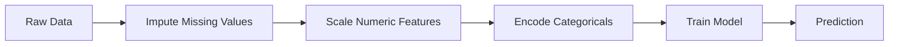
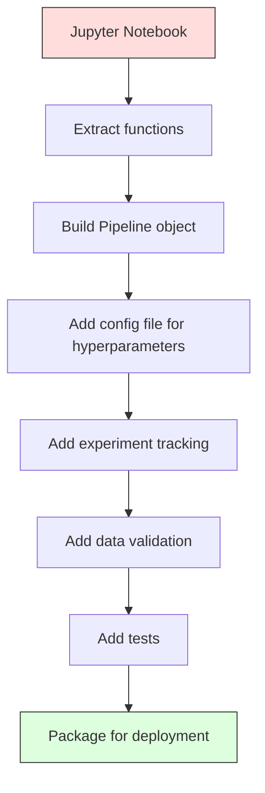

# ML boru hattları

> Bir model bir ürün değil. bir boru hattı. boru hattı ham veriden uygulanan tahminlere kadar her şeydir ve her adım yeniden üretilebilir olmalıdır.

**Type:** Build
**Language:**Python
**Prerequisites:** Phase 2, Lesson 12 (Hyperparameter Tuning)
**Time:** ~120 minutes

## Öğrenme Hedefleri

- İsimlendirme, ölçekleme, kodlama ve model eğitimi tek bir yeniden üretilebilir nesneye zincirleyen bir ML boru hattını sıfırdan inşa edin
- Veriler sızdırma senaryolarını tanımlamak ve boru hattlarının bunları sadece eğitim verilerine dönüştürücü takarak nasıl engellediğini açıklamak
- Farklı preprocessing kullanan bir sütunTransformer oluşturmak için sayısal ve kategorik özellikler
- Kök hattının serileştirilmesini uygulayarak, aynı monte edilmiş kök hattının eğitim ve üretimde aynı sonuçlar verdiğini göstermek

## Sorun

Verileri yükleyen, eksik değerleri ortalama ile dolduran, özellikleri ölçeyen, bir modeli eğiten ve kesinlik yazdırırmış bir defteriniz var.

Bir ay sonra, birisi modelini yeniden eğitmiş ve farklı sonuçlar elde etmiş. Ortalama test verileri (veriler sızması) dahil tüm veri kümesi üzerinde hesaplandı. Ölçekleme parametreleri kaydedilmedi, bu yüzden sonuç farklı istatistikler kullanır. Özellik mühendisliği kodu eğitim ve hizmet arasında kopyalandı ve kopyalar farklılaştı. Kategorik bir sütun, kodlayıcı tarafından hiç görülmemiş bir yeni bir değer elde etti.

Bu, hipotetik değil. Bunlar, ML sistemlerinin üretimde başarısız olmasının en yaygın nedenleri. boru hattları, her dönüşüm adımını tek, düzenli, yeniden üretilebilir bir nesneye paketleyerek hepsini çözmektedir.

## Anlaşım

### Bir Boru hattı Nedir

Bir boru hattı, bir model tarafından takip edilen veri dönüşümlerinin düzenli bir sırasıdır. Her adım önceki adımın çıkışını giriş olarak alır. Tüm boru hattı eğitim verilerine bir kez monte edilir. Tahmin zamanı, aynı donatılmış boru hattı yeni verileri dönüştürür ve tahminler üretir.



Bu boru hattı garanti ediyor:
- Değişiklikler sadece eğitim verilerine dayandırılır (sızıntı yoktur)
- Aynı dönüşümler çıkarma zamanında uygulanır
- Tüm nesne seriye edilebilir ve tek bir eser olarak dağıtılabilir
- Çarpışık doğrulama, boru hattının her katlaması için uygulanır ve ince bir sızmanın önlenmesi gerekir.

### Veriler Sızdı: Sessiz Katil

Test setinden veya gelecekteki verilerden alınan bilgiler eğitimleri kirlettiklerinde veri sızması meydana gelir.

**Leaky (wrong):**
```python
X = df.drop("target", axis=1)
y = df["target"]

scaler = StandardScaler()
X_scaled = scaler.fit_transform(X)

X_train, X_test = X_scaled[:800], X_scaled[800:]
y_train, y_test = y[:800], y[800:]
```

Skaliratör test verilerini gördü. Ortalama ve standart sapma test örneklerini içerir. Bu doğruluk tahminlerini şişiriyor.

**Correct:**
```python
X_train, X_test = X[:800], X[800:]

scaler = StandardScaler()
X_train_scaled = scaler.fit_transform(X_train)
X_test_scaled = scaler.transform(X_test)
```

Bir boru hattı için bunu düşünmenize gerek yok.

### Sklern boru hattı

Sklern'in `Pipeline`zincir transformatörleri ve bir tahminci.`.fit()`- Evet .`.predict()`ve`.score()`Bu, tüm adımları düzenli olarak uygulayacak.

```python
from sklearn.pipeline import Pipeline
from sklearn.preprocessing import StandardScaler
from sklearn.linear_model import LogisticRegression

pipe = Pipeline([
    ("scaler", StandardScaler()),
    ("model", LogisticRegression()),
])

pipe.fit(X_train, y_train)
predictions = pipe.predict(X_test)
```

Aradığın zaman .`pipe.fit(X_train, y_train)`- ...
1. Scaler çağrıları `fit_transform`X_tren'de
2. Model çağrılar `fit`Skalalı X_tren üzerinde

Aradığın zaman .`pipe.predict(X_test)`- ...
1. Scaler çağrıları `transform`(fit_transform değil) X_test'te
2. Model çağrılar `predict`Skalalı X_test üzerinde

Skaliratör montaj sırasında test verilerini görmez.

### KolonTransformer: Farklı sütunlar için farklı boru hattları

Gerçek veri kümeleri farklı önceden işleme gerektiren sayısal ve kategorik sütunlara sahiptir. `ColumnTransformer`Bunu halledeceğim.

```python
from sklearn.compose import ColumnTransformer
from sklearn.preprocessing import StandardScaler, OneHotEncoder
from sklearn.impute import SimpleImputer

numeric_pipe = Pipeline([
    ("impute", SimpleImputer(strategy="median")),
    ("scale", StandardScaler()),
])

categorical_pipe = Pipeline([
    ("impute", SimpleImputer(strategy="most_frequent")),
    ("encode", OneHotEncoder(handle_unknown="ignore")),
])

preprocessor = ColumnTransformer([
    ("num", numeric_pipe, ["age", "income", "score"]),
    ("cat", categorical_pipe, ["city", "gender", "plan"]),
])

full_pipeline = Pipeline([
    ("preprocess", preprocessor),
    ("model", GradientBoostingClassifier()),
])
```

- Evet .`handle_unknown="ignore"`OneHotEncoder'da yeni bir kategori ortaya çıktığında (model hiç görmemiş bir şehir), çökmek yerine sıfır vektörü üretir.

### Deneyim Takip

Bir boru hattı eğitimyi yeniden üretilebilir hale getirir, ama aynı zamanda deneylerde ne olduğunu takip etmeniz gerekir: hangi hiperparametre kullanıldı, hangi veri kümesi sürümü, hangi ölçümler vardı, hangi kod çalıştırıldı.

**MLflow**En yaygın açık kaynaklı çözümdür:

```python
import mlflow

with mlflow.start_run():
    mlflow.log_param("max_depth", 5)
    mlflow.log_param("n_estimators", 100)
    mlflow.log_param("learning_rate", 0.1)

    pipe.fit(X_train, y_train)
    accuracy = pipe.score(X_test, y_test)

    mlflow.log_metric("accuracy", accuracy)
    mlflow.sklearn.log_model(pipe, "model")
```

Her çalışmanın parametre, metrik, eser ve tam modeli ile kaydedildiği için çalışmalar karşılaştırılabilir, herhangi bir deneyi yeniden oluşturabilir ve herhangi bir model sürümünü dağıtabilirsiniz.

**Weights & Biases (wandb)**barındırılmış bir kontrol tablosu ile aynı işlevselliği sağlar:

```python
import wandb

wandb.init(project="my-pipeline")
wandb.config.update({"max_depth": 5, "n_estimators": 100})

pipe.fit(X_train, y_train)
accuracy = pipe.score(X_test, y_test)

wandb.log({"accuracy": accuracy})
```

### Model Versiyonlama

Deneyim izlemesinden sonra model sürümlerini yönetmek zorundasın. Hangi model üretimde?

MLflow'un Model Kayıt Kaydı şunları belirtir:
- **Version tracking:**Kaydedilen her model bir versiyon numarasını alır.
- **Stage transitions:**"Stage", "Prodüksiyon", "Arşivlenmiş"
- **Approval workflow:**Modeller açıkça üretime teşvik edilmelidir
- **Rollback:**Önceki sürümlere geri dön

### DVC ile Versiyonlama Versiyonları

Kod git ile versiyonlanmıştır. Versiyonlanmıştır. Versiyonlanmıştır.

```
dvc init
dvc add data/training.csv
git add data/training.csv.dvc data/.gitignore
git commit -m "Track training data"
dvc push
```

DVC gerçek verileri uzaktan depolama (S3, GCS, Azure) ve küçük bir `.dvc`Git commit'i kontrol ettiğinde,`dvc checkout`kullanılmış olan kesin verileri geri getirir.

Bu, her git'in hem kod hem de veriler için pinleri oluşturması anlamına gelir.

### Tekrarlanabilir Denemeler

Tekrarlanabilir bir deney dört şeyi gerektirir:

1. **Fixed random seeds:**Numpy, random ve framework (fırın, sklearn) için tohumlar ayarlayın
2. **Pinned dependencies:**doğru versiyonlarla requirements.txt veya poetry.lock
3. **Versioned data:**DVC veya benzeri
4. **Config files:**Tüm hiperparametre, sert kodlanmış değil

```python
import numpy as np
import random

def set_seed(seed=42):
    random.seed(seed)
    np.random.seed(seed)
    try:
        import torch
        torch.manual_seed(seed)
        torch.cuda.manual_seed_all(seed)
        torch.backends.cudnn.deterministic = True
    except ImportError:
        pass
```

### Notbuktan Üretim Kökü'ne



Tipik ilerleme:

1. **Notebook exploration:**Hızlı deneyler, görselleştirmeler, özellik fikirleri
2. **Extract functions:**Ön işleme, özellik mühendisliği, değerlendirmeyi modüllere dönüştürmek
3. **Build Pipeline:**Zincir transformasyonu sklearn boru hattı veya özel sınıf
4. **Config management:**Tüm hiperparametreyi YAML/JSON yapılandırmasına taşı
5. **Experiment tracking:**MLflow veya wandb kaydı ekle
6. **Data validation:**Eğitimden önce şema, dağılım ve eksik değer kalıplarını kontrol edin
7. **Tests:**Transformatörler için birim testleri, tüm boru hattı için entegrasyon testleri
8. **Deployment:**Kök hattını seriye, bir API'ye (FastAPI, Flask) sarın, konteynerleştir

### Genel Pipeline Hataları

| Mistake | Why it is bad | Fix |
|---------|-------------|-----|
| Fitting on full data before splitting | Data leakage | Use Pipeline with cross_val_score |
| Feature engineering outside pipeline | Different transforms at train vs serve | Put all transforms in the Pipeline |
| Not handling unknown categories | Production crash on new values | OneHotEncoder(handle_unknown="ignore") |
| Hardcoded column names | Breaks when schema changes | Use column name lists from config |
| No data validation | Silently wrong predictions on bad data | Add schema checks before prediction |
| Training/serving skew | Model sees different features in prod | One Pipeline object for both |

```figure
f3-pipeline-flow
```

## Yapın

Kodun içinde .`code/pipeline.py`Tam bir ML boru hattını sıfırdan inşa eder:

### Adım 1: Özel Transformer

```python
class CustomTransformer:
    def __init__(self):
        self.means = None
        self.stds = None

    def fit(self, X):
        self.means = np.mean(X, axis=0)
        self.stds = np.std(X, axis=0)
        self.stds[self.stds == 0] = 1.0
        return self

    def transform(self, X):
        return (X - self.means) / self.stds

    def fit_transform(self, X):
        return self.fit(X).transform(X)
```

### Adım 2: Bomba Başlangıçtan

```python
class PipelineFromScratch:
    def __init__(self, steps):
        self.steps = steps

    def fit(self, X, y=None):
        X_current = X.copy()
        for name, step in self.steps[:-1]:
            X_current = step.fit_transform(X_current)
        name, model = self.steps[-1]
        model.fit(X_current, y)
        return self

    def predict(self, X):
        X_current = X.copy()
        for name, step in self.steps[:-1]:
            X_current = step.transform(X_current)
        name, model = self.steps[-1]
        return model.predict(X_current)
```

### Adım 3: Pipeline ile çapraz onaylama

Kod, bir boru hattı ile çapraz onaylamanın veri sızmasını nasıl önlediğini gösterir: Skalire her katın eğitim verilerine ayrı olarak eklenir.

### Adım 4: Sklörn ile Tam Üretim Borusu

Tam bir boru hattı ile `ColumnTransformer`, çok sayıda önceden işleme yolu ve uygun çapraz onaylama ve deney kayıtları ile eğitilmiş bir model.

## Gönder

Bu ders şunları ortaya çıkarır:
- `outputs/prompt-ml-pipeline.md`-- ML boru hattlarını inşa etmek ve düzeltmek için bir beceri
- `code/pipeline.py`- Süklern'den sıfırdan tam bir boru hattı

## Egzersizler

1. 3 sayısal sütun ve 2 kategorik sütunlu bir veri kümesini ele alan bir boru hattı oluşturun.`ColumnTransformer`Aralıklı değerlendirme + ölçeklendirme ve en sık değerlendirme + tek sıcaktan kodlama ile kategorilere uygulanmak.

2. Bilgisayarın veri sızdırma işlemini yapın: Sıkıştırıcıyı bölmeden önce tüm veri kümesine yerleştirin. Çarpıştırıcı (sızdırıcı) veri veri veri veri veri veri veri puanı ile karşılaştırın.

3. Kök hattını seriye yap .`joblib.dump`- Ayrı bir senaryoya yükle ve tahminleri çalıştır.

4. Pipoyu en önemli iki sayısal sütun için çok sayısal özellikler (degre 2) oluşturan özel bir transformatör ekleyin.

5. Çöp hattı için MLflow izleme ayarlayın.`mlflow ui`) yarışları karşılaştırmak ve en iyi modeli seçmek için.

## Anahtar Terimler

| Term | What people say | What it actually means |
|------|----------------|----------------------|
| Pipeline | "Chain of transforms + model" | An ordered sequence of fitted transformers and a model, applied as one unit to prevent leakage |
| Data leakage | "Test info leaked into training" | Using information from outside the training set to build the model, inflating performance estimates |
| ColumnTransformer | "Different preprocessing per column" | Applies different pipelines to different subsets of columns, combining results |
| Experiment tracking | "Logging your runs" | Recording parameters, metrics, artifacts, and code versions for every training run |
| MLflow | "Track and deploy models" | Open-source platform for experiment tracking, model registry, and deployment |
| DVC | "Git for data" | Version control system for large data files, storing hashes in git and data in remote storage |
| Model registry | "Model version catalog" | A system that tracks model versions with stage labels (staging, production, archived) |
| Training/serving skew | "It worked in the notebook" | Differences between how data is processed during training versus inference, causing silent errors |
| Reproducibility | "Same code, same result" | The ability to get identical results from the same code, data, and configuration |

## Daha Fazla Okumak

- [scikit-learn Pipeline docs](https://scikit-learn.org/stable/modules/compose.html)-- resmi boru hattı referansı
- [MLflow documentation](https://mlflow.org/docs/latest/index.html)-- deney izleme ve model kayıtları
- [DVC documentation](https://dvc.org/doc)-- Versiyonlama
- [Sculley et al., Hidden Technical Debt in Machine Learning Systems (2015)](https://papers.nips.cc/paper/2015/hash/86df7dcfd896fcaf2674f757a2463eba-Abstract.html)-- ML sistemlerinin karmaşıklığı üzerine temel çalışma
- [Google ML Best Practices: Rules of ML](https://developers.google.com/machine-learning/guides/rules-of-ml)-- pratik üretim ML tavsiyesi
