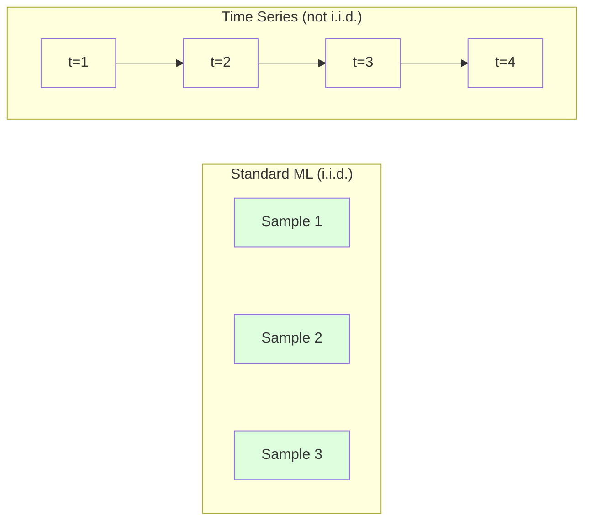
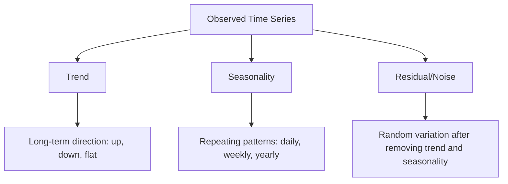
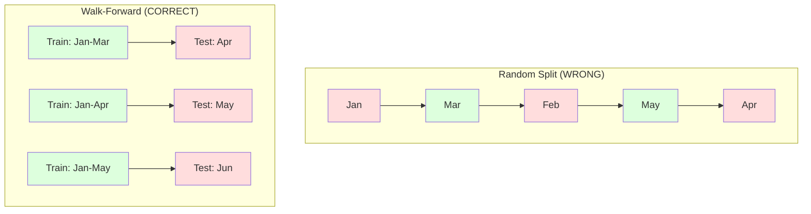

# Zaman Dizisi Temellikleri

> Geçmiş performans gelecek sonuçları tahmin eder -- eğer önce sabitliği kontrol ederseniz.

**Type:** Build
**Language:**Python
**Prerequisites:** Phase 2, Lessons 01-09
**Time:** ~90 minutes

## Öğrenme Hedefleri

- Zaman dizisini trend, mevsimsellik ve kalan bileşenlere ayırıp sabitlik testi yapılır.
- Zaman dizisini denetim altında öğrenme soruna dönüştürmek için gecikme özelliklerini ve döngülü istatistikleri uygula
- Gelecekte verilerin eğitimlere sızmasını önleyen ileriye doğrulama çerçevesini oluşturmak
- Rastgele tren/test bölünmelerinin zaman dizileri için neden geçersiz olduğunu açıklayın ve performans boşluğu ile uygun zaman bölünmelerini gösterin.

## Sorun

Günlük satış, saatlik sıcaklık, dakika başına CPU kullanımı, haftalık hisse senedi fiyatları, gelecek hafta, gelecek çeyrek için ön tahmin yapmak.

Standart ML araç kitinize ulaşırsınız: rastgele tren/test bölümü, çapraz onaylama, özellik matrisi, tahmin çıkışı. Her adım yanlış.

Zaman dizisi standart ML'nin güvendiği varsayımları kırar. Örnekler bağımsız değildir - bugünkü sıcaklık dünkiyi bağlıdır. Rastgele bölünmeler gelecekteki bilgileri geçmişe sızdırır. Geri denemelerde harika görünen özellikler üretimde başarısız olur çünkü zamanla değişen kalıplara dayanırlar.

Rastgele çapraz onayla %95 doğruluk elde eden bir model, doğru zaman tabanlı değerlendirme ile %55 elde edebilir. Fark teknik bir şey değildir. Kağıt üzerinde çalışan bir model ile üretim sırasında çalışan bir model arasındaki fark.

Bu ders temel unsurları kapsar: zaman verilerini farklı kılan nedir, modelleri nasıl dürüstçe değerlendireceğiniz ve zaman dizisini standart ML modellerinin kullanabileceği özelliklere nasıl dönüştüreceğiniz.

## Anlaşım

### Zaman Dizini Nasıl Farklı Olur?

Standart ML, i.i.d. - bağımsız ve aynı şekilde dağılımı varsayır. Her örnek diğer örneklerden bağımsız olarak aynı dağılımdan alınır. Zaman dizisi her ikisini de ihlal eder:

- **Not independent.**Bugünkü hisse senedi dünki fiyatına bağlıdır. Bu haftaki satışlar geçen hafta ile ilişkilidir.
- **Not identically distributed.**Aralık ayında satışlar Mart ayında satışlardan farklı görünüyor.

Bu ihlaller küçük değil. Özellikleri nasıl oluşturduğunuz, modelleri nasıl değerlendirdiğiniz ve hangi algoritmalar çalıştığını değiştirirler.



Standart ML'de örnekler değiştirilebilir. Onları karıştırmak hiçbir şeyi değiştirmez. Zaman dizisinde, düzen her şeydir. Karıştırmak sinyali yok eder.

### Zaman Dizisinin Bileşenleri

Her zaman dizisi bir kombinasyon:



- **Trend**Uzun vadeli yön: gelirler yılda %10 artar. Küresel sıcaklık artıyor.
- **Seasonality**: Sıkı aralıklarda tekrarlanan kalıplar. Aralık ayında perakende satışları yükseldi. Temmuz ayında klima kullanımı zirveye ulaştı.
- **Residual**Eğer kalıntı beyaz gürültü gibi görünüyorsa, parçalanma sinyalini yakaladı.

### Dayanıklılık

Bir zaman dizisi, istatistik özellikleri (ortalama, varyans, otokorrelasyon) zamanla değişmezse sabitdir.

**Why it matters:**Stasyonel olmayan bir dizi, hareket eden bir ortalama vardır. Ocak'tan beri verilere dayalı bir model, Şubat'ın gösterdiği kadar farklı bir ortalama öğrenmiştir.

**How to check:**Pencereler üzerinde yuvarlanma ortalamasını ve yuvarlanma standart sapmalarını hesaplayın.

**How to fix:**Farklılaştırma. Çöm değerleri modelleme yerine, ardılı değerler arasındaki değişimi modelleme:

```
diff[t] = value[t] - value[t-1]
```

Eğer bir farklılık döngüsü dizini sabitleştirmezse, tekrar uygulayın (ikinci sıradaki farklılık).

**Example:**

Orijinal seri: [100, 102, 106, 112, 120]
İlk fark: [2, 4, 6, 8] (hâlâ yukarı doğru eğilimi)
İkinci fark: [2, 2, 2] (sağlam -- sabit)

İlk farklılık çizgisine dönüştü, ikinci farklılık düzleştirdi.

**Formal test:**Gelişmiş Dickey-Fuller (ADF) testi, sabitlik için standart istatistik testidir. Null hipotezi "seriyalı bir istasyon değildir". 0.05'ten aşağı bir p değeri, sıfırı reddedebilir ve sabitliği sonuçlayabilirsiniz demektir. ADF'yi sıfırdan uygulamazız (asimptotik dağılım tabloları gerektirir), ancak kodumuzdaki yuvarlak istatistik yaklaşımı pratik bir görsel kontrol sağlar.

### Otomatik ilişki

Otokorelasyon, t zamanındaki bir değerin t-k zamanındaki değerle ne kadar ilişkili olduğunu ölçer (geçmişteki k adımlar).

**ACF tells you:**
- Eğer ACF 5'den sonra sıfıra düşerse, 5 adımdan fazla öncesinin değerleri önemi yoktur.
- ACF'nin 12 (aylık veriler) gecikmesiyle yükseltilmesi, yıllık mevsimsellik anlamına gelir.
- ACF'nin önemsiz hale geldiği yere kadar gecikmeler kullanın.

**PACF (Partial Autocorrelation Function)**Eğer bugün sadece ikisi de dün ile ilişkili olduğu için 3 gün önce ile ilişkiliyse, PACF 3'te 0 olurken ACF 3'te olmaz.

### Lag Özellikleri: Zaman Serisini Gözetimli Öğrenmeye dönüştürmek

Standart ML modellerinde bir özellik matrisi X ve bir hedef y gerekir. Zaman dizisi size tek bir değer sütunu verir. Köprü gecikme özellikleri.

[10, 12, 14, 13, 15] dizisini alın ve lag-1 ve lag-2 özelliklerini oluşturun:

| lag_2 | lag_1 | target |
|-------|-------|--------|
| 10    | 12    | 14     |
| 12    | 14    | 13     |
| 14    | 13    | 15     |

Şimdi standart bir gerileme sorunu var. Her türlü ML modeli (lineer gerileme, rastgele orman, gradient artışı) hedefi gecikmelerden tahmin edebilir.

Yapabileceğiniz ek özellikler:
- **Rolling statistics:**ortalama, std, min, maksimum son k değerleri
- **Calendar features:**Haftanın günü, ay, tatil, hafta sonu
- **Differenced values:**Önceki aşamalı değişiklik
- **Expanding statistics:**toplu ortalama, toplu toplam
- **Ratio features:**Akım değer / döngü ortalaması (son ortalama ile ne kadar uzak)
- **Interaction features:**1 * haftayı gün (hafta günlerinin momentum üzerindeki etkisi)

**How many lags?**Otokorelasyon fonksiyonunu kullanın. ACF 10'a kadar önemli ise en az 10 gecikme kullanın. Haftalik mevsimsellik varsa, 7 (ve muhtemelen 14) gecikme dahil edin.

**The target alignment trap.**Geçmiş özellikleri oluştururken hedef t zaman değer olmalıdır ve tüm özellikler t-1 veya daha önceki zaman değerlerini kullanmalıdır. Eğer yanlışlıkla t zaman değerini bir özellik olarak dahil ederseniz, mükemmel bir tahminci ve tamamen işe yaramaz bir modeliniz vardır. Bu, zaman dizisi özellik mühendisliği en yaygın hata.

### İleride Değerlendirme

Bu dersdeki en önemli kavramdır. Standart k katlı çapraz onaylama, eğitim ve test için örnekleri rastgele tahsis eder. Zaman dizisi için, bu gelecekteki bilgileri sızdırır.



Önceki onaylama:
1. Zamanına kadar veriyi trenle
2. Zaman t+1 (veya t+1'den t+k'ye kadar çok adımlı)
3. Pencereyi ileriye kaydır
4. Tekrarla

Her test katmanı sadece tüm eğitim verilerinden sonra gelen verileri içerir. Gelecekte sızıntı yoktur. Bu size modelin dağıtıldığında nasıl performans göstereceğini dürüst bir tahmin verir.

**Expanding window**Tüm tarihi verileri eğitim için kullanır (fenster büyür). **Sliding window**Eski verilerin hâlâ önemli olduğuna inanıyorsanız genişlemeyi kullanın. Dünya değişir ve eski verilerin zarar verdiğinde sürüklemeyi kullanın.

### ARIMA İntüition

ARIMA klasik zaman dizisi modelidir.

- **AR (Autoregressive):**Geçmiş değerlerden tahmin. AR(p) son p değerlerini kullanır.
- **I (Integrated):**D) Dönüştürme d) Dönüştürme d) Dönüştürme d) D) D) D) D) D) D) D) D) D) D) D) D) D) D) D) D) D) D) D) D) D) D) D) D) D) D) D) D) D) D) D) D) D) D) D) D) D) D) D) D) D) D) D) D) D) D) D) D) D) D) D) D) D) D) D) D) D) D) D) D) D) D) D) D) D) D) D) D) D) D) D) D) D) D) D) D) D) D) D) D) D) D) D) D) D) D) D) D) D) D) D) D) D) D) D) D) D) D) D) D) D) D) D) D) D) D) D) D) D) D) D) D) D) D) D) D) D) D) D) D) D) D) D) D) D) D) D) D) D) D) D) D) D) D) D) D) D) D) D) D) D) D) D) D) D) D) D) D) D) D) D) D) D) D) D) D) D) D) D) D) D) D) D) D) D) D) D) D) D) D) D) D) D) D) D) D) D) D) D) D) D) D) D) D) D) D) D) D) D) D) D) D) D) D) D) D) D) D) D) D) D) D) D) D) D) D) D) D) D) D) D) D) D) D) D) D) D) D) D) D) D) D) D) D) D) D) D) D) D) D) D) D) D) D) D) D) D) D) D) D) D) D) D) D
- **MA (Moving Average):**Geçmiş tahmin hatalarından tahmin. MA(q) son q hataları kullanır.

ARIMA ((p, d, q) üçü de birleştirir. ACF/PACF analizi veya otomatik arama (auto-ARIMA) üzerine kurulmuş olarak p, d, q seçilir.

ARIMA'yı sıfırdan uygulamayacağız. Bu ders kapsamının ötesinde olan sayısal optimizasyonu gerektirir. Anahtar anlayış, her bileşenin ne yaptığını anlamak, böylece ARIMA sonuçlarını yorumlayabilir ve ne zaman kullanacağınızı bilebilirsiniz.

### Ne Zaman Kullanmalı

| Approach | Best For | Handles Seasonality | Handles External Features |
|----------|---------|-------------------|------------------------|
| Lag features + ML | Tabular with many external features | With calendar features | Yes |
| ARIMA | Single univariate series, short-term | SARIMA variant | No (ARIMAX for limited) |
| Exponential smoothing | Simple trend + seasonality | Yes (Holt-Winters) | No |
| Prophet | Business forecasting, holidays | Yes (Fourier terms) | Limited |
| Neural networks (LSTM, Transformer) | Long sequences, many series | Learned | Yes |

Çoğu pratik sorun için, gecikme özellikleri + gradient artışı en güçlü başlangıç noktasıdır.

### Önceden Görülen Uçraklar ve Stratejiler

Tek adımlı tahminler bir adım ileriyi tahmin eder. Çok adımlı tahminler çok adımlı tahminler yapar.

**Recursive (iterated):**Bir adım ileriyi tahmin edin, bir sonraki adım için giriş olarak tahmin kullanın. Basit ama hatalar birikir -- her tahmin önceki tahminleri kullanır, bu yüzden hatalar karışık.

**Direct:**Her ufuk için ayrı bir model eğit. Model-1 t+1 tahmin eder, Model-5 t+5 tahmin eder. Hata birikimi yoktur, ancak her model daha az eğitim örneğine sahiptir ve bilgi paylaşmazlar.

**Multi-output:**Tüm ufukları aynı anda çıkaran bir model eğit. ufuklar arasında bilgi paylaşır, ancak birden fazla çıkışı destekleyen bir model (veya özel bir kayıp fonksiyonu) gerektirir.

Çoğu pratik sorun için, kısa ufuklar için rekürsiv (1-5 adım) ve daha uzun ufuklar için doğrudan başlayın.

### Zaman Dizisi'nde Genel Hatalar

| Mistake | Why it happens | How to fix |
|---------|---------------|-----------|
| Random train/test split | Habit from standard ML | Use walk-forward or temporal split |
| Using future features | Feature at time t included by mistake | Audit every feature for temporal alignment |
| Overfitting to seasonality | Model memorizes calendar patterns | Hold out a full seasonal cycle in the test set |
| Ignoring scale changes | Revenue doubles but patterns stay | Model percentage change instead of absolute |
| Too many lag features | "More history is better" | Use ACF to determine relevant lags |
| Not differencing | "The model will figure it out" | Tree models handle trends; linear models need stationarity |

```figure
f3-series-decompose
```

## Yapın

Kodun içinde .`code/time_series.py`Temel yapı taşlarını sıfırdan uyguluyor.

### Lag Özelliği Yaratıcısı

```python
def make_lag_features(series, n_lags):
    n = len(series)
    X = np.full((n, n_lags), np.nan)
    for lag in range(1, n_lags + 1):
        X[lag:, lag - 1] = series[:-lag]
    valid = ~np.isnan(X).any(axis=1)
    return X[valid], series[valid]
```

Bu bir 1D serisini her satırın sonuncu olduğu bir özellik matrisine dönüştürür.`n_lags`değerleri özellik olarak ve hedefi olan mevcut değer.

### Yürümeye Devam eden Çarmıhlı Değerlendirme

```python
def walk_forward_split(n_samples, n_splits=5, min_train=50):
    assert min_train < n_samples, "min_train must be less than n_samples"
    step = max(1, (n_samples - min_train) // n_splits)
    for i in range(n_splits):
        train_end = min_train + i * step
        test_end = min(train_end + step, n_samples)
        if train_end >= n_samples:
            break
        yield slice(0, train_end), slice(train_end, test_end)
```

Her bölünme, eğitim verilerinin test verilerinden önce sıkı şekilde gelmesini sağlar.

### Basit Autoregressive Model

Saf AR modeli sadece gecikme özelliklerinin doğrusal gerilemesidir:

```python
class SimpleAR:
    def __init__(self, n_lags=5):
        self.n_lags = n_lags
        self.weights = None
        self.bias = None

    def fit(self, series):
        X, y = make_lag_features(series, self.n_lags)
        # Solve via normal equations
        X_b = np.column_stack([np.ones(len(X)), X])
        theta = np.linalg.lstsq(X_b, y, rcond=None)[0]
        self.bias = theta[0]
        self.weights = theta[1:]
        return self
```

Bu, kavramsal olarak Ders 02-den gelen doğrusal gerileme ile aynıdır, ancak aynı değişkenin zaman geçirilmiş sürümlerine uygulanır.

### Duruşsuzluk Kontrolü

Kod, sabitliği görsel ve sayısal olarak değerlendirmek için kaydırma istatistiklerini hesaplar:

```python
def check_stationarity(series, window=50):
    rolling_mean = np.array([
        series[max(0, i - window):i].mean()
        for i in range(1, len(series) + 1)
    ])
    rolling_std = np.array([
        series[max(0, i - window):i].std()
        for i in range(1, len(series) + 1)
    ])
    return rolling_mean, rolling_std
```

Eğer yuvarlak ortalama sürüş veya yuvarlak std değişirse, seri sabit değildir.

Kod ayrıca serinin ilk yarısını ve ikinci yarısını karşılaştırarak sabitliği kontrol eder. Eğer araçlar standart sapmanın yarısından fazla farklılık gösterirse veya değişim oranı 2x'den fazla ise, seriler sabit olmayan olarak işaretlenir.

### Otomatik ilişki

```python
def autocorrelation(series, max_lag=20):
    n = len(series)
    mean = series.mean()
    var = series.var()
    acf = np.zeros(max_lag + 1)
    for k in range(max_lag + 1):
        cov = np.mean((series[:n-k] - mean) * (series[k:] - mean))
        acf[k] = cov / var if var > 0 else 0
    return acf
```

## Kullan

sklearn ile herhangi bir regresör ile doğrudan lag özelliklerini kullanırsınız:

```python
from sklearn.linear_model import Ridge
from sklearn.ensemble import GradientBoostingRegressor

X, y = make_lag_features(series, n_lags=10)

for train_idx, test_idx in walk_forward_split(len(X)):
    model = Ridge(alpha=1.0)
    model.fit(X[train_idx], y[train_idx])
    predictions = model.predict(X[test_idx])
```

ARIMA için, istatistik modellerini kullanın:

```python
from statsmodels.tsa.arima.model import ARIMA

model = ARIMA(train_series, order=(5, 1, 2))
fitted = model.fit()
forecast = fitted.forecast(steps=30)
```

Kodun içinde .`time_series.py`her iki yaklaşımı da gösterir ve ilerleme doğrulama kullanılarak karşılaştırır.

### sklearn Zaman Sıraları

sklearn sağlıyor `TimeSeriesSplit`ilerleme doğrulamasını uygulayan:

```python
from sklearn.model_selection import TimeSeriesSplit

tscv = TimeSeriesSplit(n_splits=5)
for train_index, test_index in tscv.split(X):
    X_train, X_test = X[train_index], X[test_index]
    y_train, y_test = y[train_index], y[test_index]
    model.fit(X_train, y_train)
    score = model.score(X_test, y_test)
```

Bu sıfırdan başlayan bizim eşdeğerimiz .`walk_forward_split`Bu, Sklern'in çapraz onaylama çerçevesine entegre.`cross_val_score`- ...

```python
from sklearn.model_selection import cross_val_score

scores = cross_val_score(model, X, y, cv=TimeSeriesSplit(n_splits=5))
print(f"Mean score: {scores.mean():.4f} +/- {scores.std():.4f}")
```

### Değerlendirme Metrikleri

Zaman dizisi tahminleri regresyon metriklerini kullanır, ancak zaman farkında bağlamla:

- **MAE (Mean Absolute Error):**"Y_true - y_pred diction" ortalaması. "Orijinal birimlerde yorumlanmak kolaydır.
- **RMSE (Root Mean Squared Error):**Ortalama kare hataların kare kökü. Büyük hataların MAE'den daha fazla cezalandırılması. Büyük hataların birçok küçük hatalardan daha kötü olduğu zaman kullanın.
- **MAPE (Mean Absolute Percentage Error):**Ortalama hata / gerçek değer = 100 * 100 . Ölçüsünden bağımsız, farklı diziler arasında karşılaştırmak için yararlı. Ama gerçek değerler sıfır olduğunda tanımlanmamış.
- **Naive baseline comparison:**Her zaman basit temel çizgilerle karşılaştırın. Mevsimsel naif temel çizgi bir dönemden önceki değeri tahmin eder (dün, geçen hafta).

### Çekilen Özellikler

Kod, gecikme özelliklerini eklemek için kaydırıcı istatistikler (7. ve 14. gün pencerelerindeki ortalama, std, min, max) eklenmesini gösterir. Bunlar model'e sadece gecikme özelliklerinin yakalamadığı son eğilimler ve değişkenlik hakkında bilgi verir.

Örneğin, yuvarlak ortalama yükselmek, bir yükseliş eğilimini gösterir. yuvarlak std artıyorsa, bu artan değişkenliği gösterir. Bunlar ağaç tabanlı modellerden öğrenebilecek, ama doğrusal modeller edemeyecek kalıp türleri.

## Gönder

Bu ders şunları ortaya çıkarır:
- `outputs/prompt-time-series-advisor.md`-- zaman dizisi sorunlarını çerçevelemek için bir ipucu
- `code/time_series.py`-- gecikme özellikleri, ileri doğrulama, AR modeli, sabitlik kontrolleri

### Yıkmanız Gereken Temel Sınırlar

Bir model oluşturmadan önce, temel çizgiler belirleyin:

1. **Last value (persistence).**Yarınki günün bugünki gibi olacağını tahmin et.
2. **Seasonal naive.**Eğer modeliniz bunu yenemezse, mevsimsellikten başka hiçbir faydalı örneği öğrenmedi.
3. **Moving average.**Son k değerlerinin ortalamasını tahmin et.

Eğer süslü ML modeliniz mevsimsel saf bir başlangıç çizgisine kaybedirse, bir hata var. En sık: gelecekteki özellikler sızması, yanlış değerlendirme yöntemi veya seri gerçekten rastgele ve tahmin edilemez.

### Etkin İpuçlar

1. **Start with plotting.**Herhangi bir modelleme yapmadan önce, çiğ serileri çizin. Eğilimleri, mevsimselliği, dış değerleri, yapısal kesintileri (harekette ani değişiklikler) araştırın. 30 saniyelik görsel inceleme genellikle size bir saatten fazla otomatik analiz anlatır.

2. **Difference first, model second.**Eğer seri açık bir eğilim gösterirse, gecikme özellikleri oluşturmadan önce fark et. Ağaç tabanlı modeller eğilimleri ele alabilir, ancak doğrusal modeller edemez ve farklılaştırmak asla zarar vermez.

3. **Hold out at least one full seasonal cycle.**Eğer haftalık mevsimsellik varsa, test setinize en az bir hafta, aylıksa en az bir ay gerekmektedir. Aksi takdirde modelin mevsimsel örneği yakaladığını değerlendiremezsiniz.

4. **Monitor in production.**Zaman dizisi modelleri zamanla değiştikçe bozulur. Önceden tahmin hatalarını düzenli olarak takip edin. Hatalar artarken, modelin son verilere dayalı yeniden eğitilmesi gerekir.

5. **Beware of regime changes.**Pandemi öncesi verilere dayalı bir model, pandemi sonrası davranışları tahmin edemez. Bilinen rejim değişikliklerinin göstergeleri özellikleri olarak dahil edilir veya eski verileri unuttuğu kaydırıcı bir pencere kullanılır.

6. **Log-transform skewed series.**Gelir, fiyatlar ve sayılar genellikle sağ tarafa çarpılır. Kayıt almayı alarak varyansiyi istikrarlı hale getirir ve çoğullama desenlerini katı yapar, bu da doğrusal modellerle başa çıkabilir. Kayıt alanında tahmin, sonra orijinal birimlere geri dönmek için eksponansyal.

## Egzersizler

1. **Stationarity experiment.**Düzsel bir eğilimle bir dizi oluşturun. Düzsellik ile statistik kontrol edin. İlk farklılık uygulayın. Tekrar kontrol edin.

2. **Lag selection.**ACF'yi mevsimsel bir dizide (period=7) hesaplayın. Hangi gecikmelerin en yüksek otokorrelasyonu vardır? Sadece o gecikmeleri (sıra üstü gecikmeleri değil) kullanarak gecikme özellikleri oluşturun. 1 ila 7 gecikmeleri kullanmakla karşılaştırıldığında doğruluk daha iyi mi?

3. **Walk-forward vs random split.**Ridge geri dönüşünü gecikme özelliklerine uygulayın. Randeom 80/20 bölümü ve ileri doğrulamayı kullanarak değerlendirin. Randeom bölümü performansı ne kadar fazla değerlendirir?

4. **Feature engineering.**Gecikme özelliklerine yuvarlanma ortalaması ( penceresi =7), yuvarlanma std ( penceresi = 7) ve haftanın günü özelliklerini ekleyin.

5. **Multi-step forecasting.**1. İki stratejiyi karşılaştırın: (a) bir adım tahmin edin, tahminini bir sonraki adım için giriş olarak kullanın (recursive) ve (b) her ufuk için ayrı modeller eğitiniz (direct). Hangisi daha doğru?

## Anahtar Terimler

| Term | What people say | What it actually means |
|------|----------------|----------------------|
| Stationarity | "The stats don't change over time" | A series whose mean, variance, and autocorrelation structure are constant over time |
| Differencing | "Subtract consecutive values" | Computing y[t] - y[t-1] to remove trends and achieve stationarity |
| Autocorrelation (ACF) | "How a series correlates with itself" | The correlation between a time series and a lagged copy of itself, as a function of the lag |
| Partial autocorrelation (PACF) | "Direct correlation only" | Autocorrelation at lag k after removing the effect of all shorter lags |
| Lag features | "Past values as inputs" | Using y[t-1], y[t-2], ..., y[t-k] as features to predict y[t] |
| Walk-forward validation | "Time-respecting cross-validation" | Evaluation where training data always precedes test data chronologically |
| ARIMA | "The classic time series model" | AutoRegressive Integrated Moving Average: combines past values (AR), differencing (I), and past errors (MA) |
| Seasonality | "Repeating calendar patterns" | Regular, predictable cycles in a time series tied to calendar periods (daily, weekly, yearly) |
| Trend | "The long-term direction" | A persistent increase or decrease in the series level over time |
| Expanding window | "Use all history" | Walk-forward validation where the training set grows with each fold |
| Sliding window | "Fixed-size history" | Walk-forward validation where the training set is a fixed-length window that slides forward |

## Daha Fazla Okumak

- [Hyndman and Athanasopoulos, Forecasting: Principles and Practice (3rd ed.)](https://otexts.com/fpp3/)- Zaman dizisi tahminleri hakkında en iyi ücretsiz ders kitabı
- [scikit-learn Time Series Split](https://scikit-learn.org/stable/modules/generated/sklearn.model_selection.TimeSeriesSplit.html)- Sklern'in ileriye doğru yürüyen parçacığı
- [statsmodels ARIMA docs](https://www.statsmodels.org/stable/generated/statsmodels.tsa.arima.model.ARIMA.html)-- ARIMA uygulaması, teşhislerle
- [Makridakis et al., The M5 Competition (2022)](https://www.sciencedirect.com/science/article/pii/S0169207021001874)-- ML yöntemlerini istatistiksel yöntemlerle karşılaştırarak büyük ölçekli tahminler yarışı
