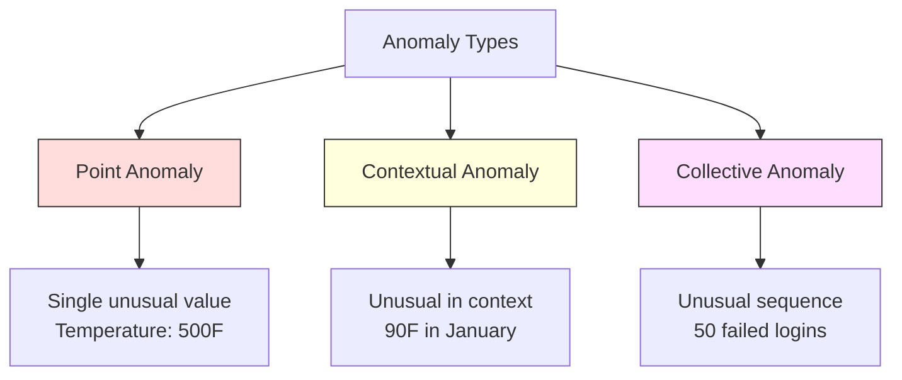
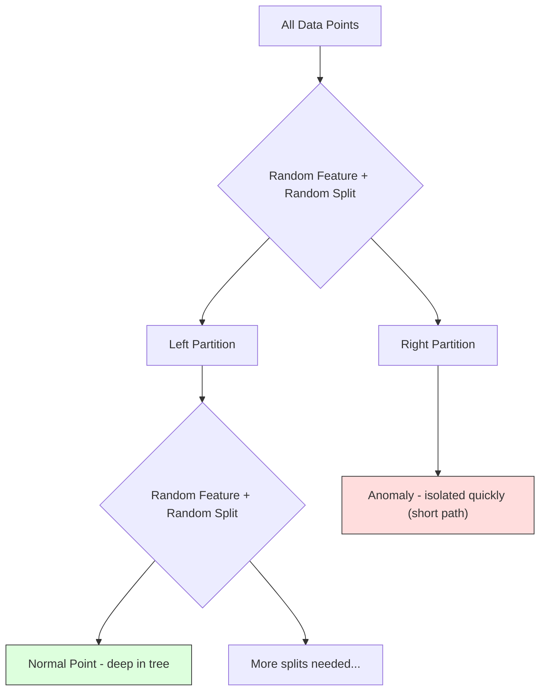
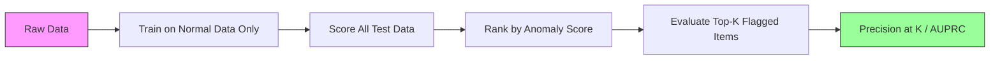

# Anomalyayı tespit etmek

> Normal tanımlamak kolaydır, anormal ise, uygun olmayan şeydir.

**Type:** Build
**Language:**Python
**Prerequisites:** Phase 2, Lessons 01-09
**Time:** ~75 minutes

## Öğrenme Hedefleri

- Z-score, IQR ve İzolasyon Orman anomaliyi tespit etme yöntemlerini sıfırdan uygula
- Nokta, bağlamlı ve kolektif anormallikler arasında ayrım yapın ve her bir için uygun tespit yöntemi seçin.
- Anomalyayı tespit etmek neden anormallikleri sınıflandırmak yerine normal verileri modellemek olarak çerçevelendiğini açıklayın.
- Denetimsiz anomali tespitini denetimli sınıflandırma ile karşılaştırın ve yeni anomali kapsamı ve hassasiyet arasındaki karıştırmayı değerlendiryin

## Sorun

Bir kredi kartı New York'ta akşam 2'de, sonra Tokyo'da akşam 2:05'de kullanılır. Normal aralığın 80-120 olduğu zaman fabrika sensörü 150 derece okuyor.

Bunlar anomaliler, onları bulmak önemli, dolandırıcılık milyarlar, ekipman bozukluğu, devreye girdiği zaman, veri maliyeti.

Sorun: nadiren anomali örneklerini etiketlendiniz. Sahtelik işlemlerin %0,1'ünü oluşturuyor. Cihazlar yılda birkaç kez bozulur. Standart bir sınıflandırıcıyı eğitemezsin çünkü "anomali" sınıfında öğrenmek için neredeyse hiçbir şey yoktur. Bazı etiketlere sahip olsanız bile, gördüğünüz anomaliler karşılaştığınız tek tür değildir. Yarınki dolandırıcılık planı bugünküden farklı görünüyor.

Anomaly tespit problemi tersine çevirir. Anomalyayı öğrenmek yerine, normal olanı öğrenin. Normalden sapmış olan her şey şüpheli. Bu etiketlenmeden çalışır, yeni tür anormalliklere uyar ve büyük veri kümelerine ölçeklendirir.

## Anlaşım

### Anomya Türleri

Tüm anomaliler aynı değil .

- **Point anomalies.**Konektsel durumdan bağımsız olarak olağandışı olan tek bir veri noktası.$50,000 from an account that normally spends $- 50'e.
- **Contextual anomalies.**Bu, bağlamı bakıldığında olağandışı bir veri noktası. 90 derece sıcaklık yazda normal, kışta anormal. Aynı değer, farklı bağlam.
- **Collective anomalies.**Bir grup olarak sıradışı olan veri noktaları sırası, her bireysel nokta normal olsa da. Beş giriş başarısızlığı normaldir.

Çoğu yöntem nokta anomalilerini tespit eder. Konekst anomalilerine zaman veya konum özellikleri gerekmektedir. Toplu anomalilere sıralama bilincili yöntemler gerekmektedir.



### Gözlemsiz Çekim

Standart sınıflandırmada her iki sınıf için etiketler vardır. Anomalyayı tespit etmek için genellikle üç durumdan biri vardır:

1. **Fully unsupervised.**Tüm verilere detektörü takarsın ve normal modelin bozulmasına engel olmayacak kadar nadir olacağın umarım.
2. **Semi-supervised.**Sadece normal verilerden oluşan temiz bir veri kümeniz var. Bu temiz bir veri kümesine sığarsınız ve diğer her şeyi notlarsınız. Bu mümkün olan en güçlü kurulum.
3. **Weakly supervised.**Birkaç etiketli anomali var. Onları değerlendirmek için kullan, eğitim değil.

Anahtar anlayış: anomali tespitleri sınıflandırmadan temel olarak farklıdır. Normal verilerin dağılımını modelleştiriyorsunuz, iki sınıf arasındaki karar sınırını değil.

### Gözetimli ve Gözetilmeyenler: Aradaki Karşılaşma

Eğer anomaliler etiketlendiyse, bunları eğitim (özenlendirilmiş sınıflandırma) veya sadece değerlendirme (özenlendirilmemiş tespit) için kullanmalı mısınız?

**Supervised (treat as classification):**
- Daha önce gördüğünüz anomalilerin tam türünü yakalar.
- Bilinen anomali türlerinde daha yüksek hassasiyet
- Yeni anomali türlerini tamamen kaçırıyor.
- Yeni anormallik türleri ortaya çıktığında yeniden eğitilme gerekir
- Yeterince anomali örneklerine ihtiyaç duyar (genellikle çok az)

**Unsupervised (model normal, flag deviations):**
- Yeni türler de dahil olmak üzere normalden herhangi bir sapma yakalar
- Etiketlenmiş anomaliler gerektirmez
- Yüksek yanlış pozitif oran (her alışılmadık şey kötü değildir)
- Dağıtım değişikliğine daha güçlü

Uygulamalarda en iyi sistemler her ikisini birleştirir: geniş kapsamlılık için denetimsiz tespit, bilinen yüksek öncelikli anormal türler için denetimli modeller ve belirsiz durumlar için insan incelemesi.

### Z-Score Yöntem

En basit yaklaşım. Her bir özelliğin ortalama ve standart sapmalarını hesaplayın. Ortalama standart sapmalardan k'den fazla herhangi bir noktayı işaretleyin.

```text
z_score = (x - mean) / std
anomaly if |z_score| > threshold
```

Varsayılan eşiği 3,0'dur (normal verilerin %99,7'si Gaussian dağılımında 3 standart sapma aralığındadır).

**Strengths:**Basit, hızlı, yorumlanabilir ("bu değer normalden 4,5 standart sapma"dır).

**Weaknesses:**Veriler normal olarak dağıtılır. Eğitim verilerindeki dış değerlere duyarlı (ön değerler ortalamayı değiştirir ve std'yi şişirir, bu da onları tespit etmeyi zorlaştırır).

**When it works well:**Verilerin yaklaşık olarak çan şeklinde olduğu tek özellikli izleme. Sunucu yanıt süreleri, üretim toleransları, sabit tabanlı sensör okumaları.

**When it fails:**Çoklu küme verileri (farklı başlangıç sıcaklıkları olan iki ofis yeri), çarpık veriler (1000 dolar nadir ama anormal olmayan işlem miktarları), eğitim kümesindeki dış değerli veriler.

### IQR Yöntem

Z puanından daha sağlam, ortalama ve standart sapıklık yerine kareler arası aralığı kullanır.

```
Q1 = 25th percentile
Q3 = 75th percentile
IQR = Q3 - Q1
lower_bound = Q1 - factor * IQR
upper_bound = Q3 + factor * IQR
anomaly if x < lower_bound or x > upper_bound
```

Varsayılan değeri 1.5'dir.

**Strengths:**Çatlak değerlere kadar sağlam (persentiller aşırı değerlerle etkilenmez).

**Weaknesses:**Tek değişkenlik (her özellik için bağımsız olarak geçerlidir). Özellikler birlikte gözden geçirilince sıradışı olan anormallikleri tespit edemez (her bir özellikte bir nokta bireysel olarak normal olabilir, ancak ortak alanda anormal olabilir).

**Practical note:**IQR'deki 1.5 faktörü, bir kutu plotındaki mustarlara karşılık gelir. mustarların dışındaki noktalar potansiyel dış değerlerdir. 1.5 yerine 3.0 kullanmak detektörü daha muhafazakar hale getirir (çık bayraklar, daha az yanlış pozitif). Doğru faktör, yanlış alarmlara karşı toleransınızdan bağlıdır.

### İzolasyon Ormanı

Anahtar anlayış: anomaliler az ve farklıdır. Verilerin rastgele bölünmesinde anomalileri izole etmek daha kolaydır. Geri kalanlardan ayırmak için daha az rastgele bölüme ihtiyaçları vardır.



**How it works:**
1. Birçok rastgele ağaç inşa edin (bir izole ormanı)
2. Her düğümde, rastgele bir özellik ve özellikin min ve maksimum arasındaki rastgele bir bölünme değeri seçin
3. Her nokta (öz yapraklarında) ayrı olana kadar bölmeye devam edin.
4. Anomaliler tüm ağaçlarda daha kısa ortalama yol uzunluğuna sahiptir

**Why it works:**Normal noktalar yoğun bölgelerde yaşar. Birini komşularından ayırmak için birçok rastgele bölüme ihtiyaç vardır. Anomaliler nadir bölgelerde yaşar. Onları izole etmek için bir veya iki rastgele bölüme yeterlidir.

Anomaly skor, tüm ağaçlardaki ortalama yol uzunluğuna dayanır. Bu normal bir rastgele ikili arama ağacının beklenen yol uzunluğuna göre normalleştirilmiştir.

```
score(x) = 2^(-average_path_length(x) / c(n))
```

Nerede ?`c(n)`n örnekler için beklenen yol uzunluğu. 1 yakınında puan anormallik demektir. 0.5 yakınında puan normal anlamına gelir. 0 yakınında puan çok normal anlamına gelir (sıkı kümelerde derinliklerde).

**Strengths:**Yayınlama varsayımları yoktur. Yüksek boyutlarda çalışır. İyi ölçekler (her ağaç bir alt örnek kullanırken örnek boyutunda alt çizgilidir). Karışık özellik türlerini ele alır.

**Weaknesses:**Sıkıntılı bölgelerde anomalilerle mücadele (mask etkisi).

**Key hyperparameters:**
- `n_estimators`Daha fazla ağaç daha istikrarlı puanlar verir ama hesaplama yavaş olur.
- `max_samples`Ağaç başına örnek sayısı. 256 orijinal kağıtın varsayılanıdır. Daha küçük değerler bireysel ağaçları daha az doğru yapar, ancak çeşitliliği artırır. Alt örnekleme, İzolasyon Ormanı'nın hızlı olmasını sağlar. Her ağaç verilerin küçük bir kısmını görür.
- `contamination`: Anomalilerin beklenen kısmı. Sadece eşiğin belirlenmesi için kullanılır.

### Yerel dış değer faktörü (LOF)

LOF, bir noktadan çevresindeki yerel yoğunluğu komşularının yoğunluğuna karşılaştırır.

**How it works:**
1. Her noktaya en yakın komşu k'yi bul
2. Yerel erişilebilirlik yoğunluğunu hesaplayın (komşunun ne kadar yoğun olduğu)
3. Her noktanın yoğunluğunu komşularının yoğunluklarıyla karşılaştır
4. Bir noktanın komşularından çok daha düşük yoğunluğu varsa, bu bir dışarıdır.

**LOF score:**
- LOF 1.0 yakın komşuların yoğunluğu (normal) anlamına gelir
- 1.0'dan büyük LOF, komşulardan daha düşük yoğunluk anlamına gelir (potansiyel olarak anormal)
- LOF 1.0'dan çok daha büyük (örneğin, 2.0+) anlamıyla daha düşük yoğunluk (muhtemelen anomali)

"Yerel" kısmı kritik. İki kümeden oluşan bir veri kümesini düşünün: 1000 noktadan oluşan yoğun bir kümeden ve 50 noktadan oluşan nadir bir kümeden. Nadir kümenin kenarındaki bir nokta küresel olarak alışılmadık değildir - 50 komşusu vardır. Ama yakın komşuları olduğundan daha yoğunsa yerel olarak alışılmadık. LOF küresel yöntemlerin kaçırdıkları bu nüansı yakalar.

**Strengths:**Yerel anormallikleri (globa olarak sıradışı olmasalar da, komşularında olağandışı olan noktaları) tespit eder.

**Weaknesses:**Büyük veri kümeleri üzerinde yavaş (O(n^2) saf uygulama için. k'nin seçimine duyarlı. Çok yüksek boyutlarda iyi çalışmaz (ölümsellik laneti mesafe hesaplamalarını etkiler).

### Karşılaştırma

| Method | Assumptions | Speed | Handles High Dims | Detects Local Anomalies |
|--------|------------|-------|-------------------|------------------------|
| Z-score | Normal distribution | Very fast | Yes (per feature) | No |
| IQR | None (per feature) | Very fast | Yes (per feature) | No |
| Isolation Forest | None | Fast | Yes | Partially |
| LOF | Distance is meaningful | Slow | Poorly | Yes |

### Değerlendirme Zorlukları

Anomalyeler denetleyicilerini değerlendirmek sınıflandırıcıları değerlendirmekten daha zor:

- **Extreme class imbalance.**%0,1 anomali ile her şey için "normal" tahmin ederek %99,9 doğruluk elde edilir.
- **AUROC is misleading.**Ağır dengesizlik durumunda, AUROC, model pratik eşiğinde çoğu anomaliyi kaçırırken bile iyi görünebilir.
- **Better metrics:**Precision@k (yukarıda k işaretli öğelerin, kaç tane gerçek anomali), AUPRC (tamamlı geri çağırma eğri altında alan) ve sabit yanlış pozitif oranla geri çağırma.



### Anomaly Deteksiyon Boru hattı

Uygulamalar, bu iş akışını takip eder:

1. **Collect baseline data.**İdeal olarak, anormallikler olmadığını (ya da çok az olduğunu) bildiğiniz bir dönem.
2. **Feature engineering.**Çiğ özellikler ve türev özellikler (rolling istatistikleri, zaman özellikleri, oranlar).
3. **Train the detector.**Baseline verilerine uygun. Model normal görünüşü öğrenir.
4. **Score new data.**Her yeni gözlem anormallik puanı alır.
5. **Threshold selection.**Bu bir iş kararı: daha yüksek eşiğin anlamı daha az yanlış alarm, ama daha fazla kaçırılan anomali.
6. **Alert and investigate.**Bayraklı noktalar insan incelemesine veya otomatik tepkiye gidiyor.
7. **Feedback collection.**Belgelemiş öğelerin gerçek anomaliler mi yoksa yanlış alarmlar mı olduğunu kaydet.

Bu boru hattı asla "bitmez". Veriler dağıtımları değişir, yeni anomalya türleri ortaya çıkar ve eşiğin ayarlanması gerekir.

```figure
f3-anomaly-fence
```

## Yapın

Kodun içinde .`code/anomaly_detection.py`Z-score, IQR ve İzolasyon Ormanı'nı sıfırdan uyguluyor.

### Z-Score Detektörü

```python
def zscore_detect(X, threshold=3.0):
    mean = X.mean(axis=0)
    std = X.std(axis=0)
    std[std == 0] = 1.0
    z = np.abs((X - mean) / std)
    return z.max(axis=1) > threshold
```

Basit ve vektörlü. Bir noktayı işaretler.

### IQR Detektörü

```python
def iqr_detect(X, factor=1.5):
    q1 = np.percentile(X, 25, axis=0)
    q3 = np.percentile(X, 75, axis=0)
    iqr = q3 - q1
    iqr[iqr == 0] = 1.0
    lower = q1 - factor * iqr
    upper = q3 + factor * iqr
    outside = (X < lower) | (X > upper)
    return outside.any(axis=1)
```

### İzolasyon Ormanı

Baştan başlayan uygulamada özellik alanını rastgele bölen izoleci ağaçlar oluşturulur:

```python
class IsolationTree:
    def __init__(self, max_depth):
        self.max_depth = max_depth

    def fit(self, X, depth=0):
        n, p = X.shape
        if depth >= self.max_depth or n <= 1:
            self.is_leaf = True
            self.size = n
            return self
        self.is_leaf = False
        self.feature = np.random.randint(p)
        x_min = X[:, self.feature].min()
        x_max = X[:, self.feature].max()
        if x_min == x_max:
            self.is_leaf = True
            self.size = n
            return self
        self.threshold = np.random.uniform(x_min, x_max)
        left_mask = X[:, self.feature] < self.threshold
        self.left = IsolationTree(self.max_depth).fit(X[left_mask], depth + 1)
        self.right = IsolationTree(self.max_depth).fit(X[~left_mask], depth + 1)
        return self
```

Bir noktayı izole etmek için yol uzunluğu anomali puanını belirler.

- Evet .`IsolationForest`sınıf birden fazla ağaç sarıyor:

```python
class IsolationForest:
    def __init__(self, n_estimators=100, max_samples=256, seed=42):
        self.n_estimators = n_estimators
        self.max_samples = max_samples

    def fit(self, X):
        sample_size = min(self.max_samples, X.shape[0])
        max_depth = int(np.ceil(np.log2(sample_size)))
        for _ in range(self.n_estimators):
            idx = rng.choice(X.shape[0], size=sample_size, replace=False)
            tree = IsolationTree(max_depth=max_depth)
            tree.fit(X[idx])
            self.trees.append(tree)

    def anomaly_score(self, X):
        avg_path = average path length across all trees
        scores = 2.0 ** (-avg_path / c(max_samples))
        return scores
```

Normalleşme faktörü`c(n)`n elementli bir ikili arama ağacında başarısız bir arama için beklenen yol uzunluğu.`2 * H(n-1) - 2*(n-1)/n`nerede`H`Bu normallaştırma, farklı boyutlarda veri kümeleri arasında puanların karşılaştırılabilir olmasını sağlar.

### Demo Szenaryoları

Kod, birden fazla test senaryosunu oluşturur:

1. **Single cluster with outliers.**Merkezden uzakta enjekte edilen anomaliler ile 2 boyutlu Gaussian kümesi.
2. **Multimodal data.**Üç farklı boyut ve yoğunluklu kümeler.
3. **High-dimensional data.**50 özellik, ancak anomaliler sadece 5'te farklıdır.

Her demo, hassasiyet, hatırlama, F1 ve Precision@k kullanarak tüm yöntemleri karşılaştırır.

## Kullan

sklearn ile (kitaphanenin uygulamalar kullanılarak, sıfırdan değil):

```python
from sklearn.ensemble import IsolationForest
from sklearn.neighbors import LocalOutlierFactor

iso = IsolationForest(n_estimators=100, contamination=0.05, random_state=42)
iso.fit(X_train)
predictions = iso.predict(X_test)

lof = LocalOutlierFactor(n_neighbors=20, contamination=0.05, novelty=True)
lof.fit(X_train)
predictions = lof.predict(X_test)
```

Not:`contamination`Bu, beklenen anomalilerin oranını belirler. Doğru ayarlamak önemlidir -- çok düşük anomalileri kaçırır, çok yüksek yanlış alarmlar yaratır.

Kodun içinde .`anomaly_detection.py`Aynı veriler üzerinde ilk baştan uygulamalar ile sklearn karşılaştırılır.

### sklearn Kirlilik parametri

- Evet .`contamination`sklearn'daki parametreler, sürekli anomalya puanlarını ikili tahminlere dönüştürme eşiğini belirler.

```python
iso_5 = IsolationForest(contamination=0.05)
iso_10 = IsolationForest(contamination=0.10)
```

İkisi de aynı anormallik puanı verir.`iso_5`% 5'i işaretlerken`iso_10`Eğer gerçek anormallik oranını bilmiyorsanız (genellikle bilmiyorsanız), kirliliği "otomatik" olarak ayarlayın ve doğrudan ham puanlarla çalışın.

### Bir Sınıf SVM

Bir sınıf SVM, yüksek boyutlu bir özellik alanında (kernel numarasını kullanarak) normal verilerin etrafında bir sınır koyuyor.

```python
from sklearn.svm import OneClassSVM

oc_svm = OneClassSVM(kernel="rbf", gamma="auto", nu=0.05)
oc_svm.fit(X_train)
predictions = oc_svm.predict(X_test)
```

- Evet .`nu`Bir Sınıf SVM küçük ve orta ölçekli veri kümeleri üzerinde iyi çalışır ancak çok büyük veriye ölçeklendirmeyen (kernel matrisi kare olarak büyür).

### Otomatik Kodlama Yöntem (Önce Görünüm)

Otomotik kodlayıcılar, verileri sıkıştırmayı ve yeniden yapılandırmayı öğrenen sinir ağlarıdır. Normal veriler üzerinde çalıştırmak. Test sırasında anomaliler yüksek yeniden yapılandırma hatasıyla sonuçlanır, çünkü ağ sadece normal kalıpları yeniden yapılandırmayı öğrenir.

Bu konu 3 (Deep Learning) aşamasında ele alınıyor, ama ilke aynı: normal olanı modelle, sapmış olanı işaretle.

### Anomaly Deteksiyonı Birleştir

Ensemble yöntemleri sınıflandırmayı iyileştirdiği gibi (Learning 11) birden fazla anormallik dedektörü birleştirmek de algılamayı iyileştirir.

1. Çoklu dedektörler çalıştırın (Z puan, IQR, İzolasyon Ormanı, LOF)
2. Her detektörün puanlarını [0, 1] olarak normalleştirin.
3. Normal puanları ortalama
4. Ortalama puanın eşiğindeki bayrak noktaları

Bu, yanlış pozitifleri azaltır çünkü farklı yöntemlerin farklı başarısızlık modları vardır. Dört yöntem tarafından işaretlenen bir nokta neredeyse kesinlikle anormaldir.

Daha gelişmiş bir dizi, her detektörün ağırlığını tahmin edilen güvenilirliğiyle (varsa bilinen anomaliler olan bir doğrulama kümesi ile ölçülür) birleştirir.

### Üretim Konuları

1. **Threshold drift.**Verilerin dağılımı değiştiğinde, sabit bir eşiğin kullanımı geçmiş hale gelir.
2. **Alert fatigue.**Çok fazla sahte alarm ve operatör dikkatini bırakıyor. Yüksek bir eşiğin (daha az, daha güvenilir uyarılar) ile başlayın ve güvenin arttıkça onu düşürün.
3. **Ensemble approach.**Üretim sırasında, birden fazla algılayıcı birleştirin. Bir noktayı sadece birden fazla yöntemin anormal olduğuna karar verdiği takdirde işaretleyin. Bu, yanlış pozitifleri önemli ölçüde azaltır.
4. **Feature engineering.**Çiğ özellikler nadiren yeterli. Yükleme istatistikleri, oranlar, son olaydan beri zaman ve alan özel özellikler ekleyin. İyi bir özellik, detektör seçimine göre daha önemlidir.
5. **Feedback loop.**İşaretli öğeleri araştırırken ve onaylarken veya reddederken, bunları sisteme geri gönderir. Detektörü değerlendirmek ve geliştirmek için zaman içinde etiketlenen verileri biriktirir.

## Gönder

Bu ders şunları ortaya çıkarır:
- `outputs/skill-anomaly-detector.md`- Doğru dedektörü seçmek için karar verme yeteneği
- `code/anomaly_detection.py`- Z puanı, IQR ve İzolasyon Ormanı sıfırdan, sklearn karşılaştırması ile

### Bir Eğlence Seçimi

Anomaly skor sürekli, ikili kararlar vermek için bir eşiğin olması gerekiyor.

İki durumdan söz edelim:
- **Fraud detection.**Yanlış alarmlar bir insan analistine 5 dakikalık bir araştırma masrafı getirir.
- **Equipment maintenance.**Sahte alarm gereksiz bir kapanma masrafı anlamına gelir .$50,000. A missed failure means a $Bu maliyetleri dengeleyen bir sınır belirleyin.

Her iki durumda da, en uygun eşiğin fiyatı yanlış olumlu ve yanlış olumsuz oranlar arasındaki maliyet oranına bağlıdır.

### Üretim için ölçeklendirme

Üretimdeki gerçek zamanlı anomali tespit için:

1. **Batch training, online scoring.**Modelle son normal veriler üzerinde düzenli olarak (gündelik, haftalık) eğitim verin.
2. **Feature computation must match.**Eğer 30 gün boyunca devreye dönüp istatistik kullanıyorsanız, yeni bir gözlem için özellikleri hesaplamak için 30 gün geçmişe ihtiyacınız var.
3. **Score distribution monitoring.**Anomaly skorlarının zaman içinde dağılmasını takip edin. Eğer ortalama puan yukarı doğru hareket ederse, ya veriler değişiyor ya da model eskidir.
4. **Explainability.**Anomaliyi işaretlediğinizde nedenini söyleyin. Z puanı: "X özellik 4,2 normalden yüksek standart sapma".

## Egzersizler

1. **Threshold tuning.**Z puanı dedektörü, 0.5 adımla 1.0'dan 5.0'a kadar olan eşiği çalıştırın.

2. **Multivariate anomalies.**Her bir özelliğin bireysel olarak normal göründüğü, ancak kombinasyonun anormal olduğu 2 boyutlu veriler oluşturun (örneğin, ana kümenin diyagonalından uzak noktalar).

3. **LOF from scratch.**K-nezar komşuları kullanarak Yerel Dışarıdaki Factor uygulamak. Aynı veriler üzerinde sklearn'ın Yerel Dışarıdaki Factor ile karşılaştırın. k=10 ve k=50 kullanın - k seçimi sonuçları nasıl etkiler?

4. **Streaming anomaly detection.**Z-score detektörü akış ayarında çalışmak için değiştirin: yeni noktalar geldiğinde çalışan ortalama ve varyansı güncelleyin (Welford'un çevrimiçi algoritması).

5. **Real-world evaluation.**Bilinen anomaliler olan bir veri kümesi alın (örneğin Kaggle'den kredi kartı dolandırıcılığı).

## Anahtar Terimler

| Term | What people say | What it actually means |
|------|----------------|----------------------|
| Anomaly | "Outlier, unusual point" | A data point that deviates significantly from the expected pattern of normal data |
| Point anomaly | "A single weird value" | An individual observation that is unusual regardless of context |
| Contextual anomaly | "Normal value, wrong context" | An observation that is unusual given its context (time, location, etc.) but might be normal in another context |
| Isolation Forest | "Random splits to find outliers" | An ensemble of random trees that isolates anomalies with fewer splits than normal points |
| Local Outlier Factor | "Compare density to neighbors" | A method that flags points whose local density is much lower than their neighbors' density |
| Z-score | "Standard deviations from mean" | (x - mean) / std, measuring how far a point is from the center in units of standard deviation |
| IQR | "Interquartile range" | Q3 - Q1, measuring the spread of the middle 50% of data, used for robust outlier detection |
| Contamination | "Expected fraction of anomalies" | A hyperparameter telling the detector what proportion of the data it should flag as anomalous |
| Precision@k | "Of the top k flags, how many are real" | Precision computed on only the k most suspicious points, useful for imbalanced anomaly detection |
| AUPRC | "Area under precision-recall curve" | A metric that summarizes precision-recall performance across all thresholds, better than AUROC for imbalanced data |

## Daha Fazla Okumak

- [Liu et al., Isolation Forest (2008)](https://cs.nju.edu.cn/zhouzh/zhouzh.files/publication/icdm08b.pdf)-- orijinal İzolasyon Orman kağıdı
- [Breunig et al., LOF: Identifying Density-Based Local Outliers (2000)](https://dl.acm.org/doi/10.1145/342009.335388)-- orijinal LOF kağıdı
- [scikit-learn Outlier Detection docs](https://scikit-learn.org/stable/modules/outlier_detection.html)-- tüm sklearn anomali tespitçilerinin genel bakış
- [Chandola et al., Anomaly Detection: A Survey (2009)](https://dl.acm.org/doi/10.1145/1541880.1541882)-- Anomalyayı tespit etme yöntemlerinin kapsamlı incelenmesi
- [Goldstein and Uchida, A Comparative Evaluation of Unsupervised Anomaly Detection Algorithms (2016)](https://journals.plos.org/plosone/article?id=10.1371/journal.pone.0152173)-- Gerçek veri kümelerindeki 10 yöntemin empiriyel karşılaştırması
