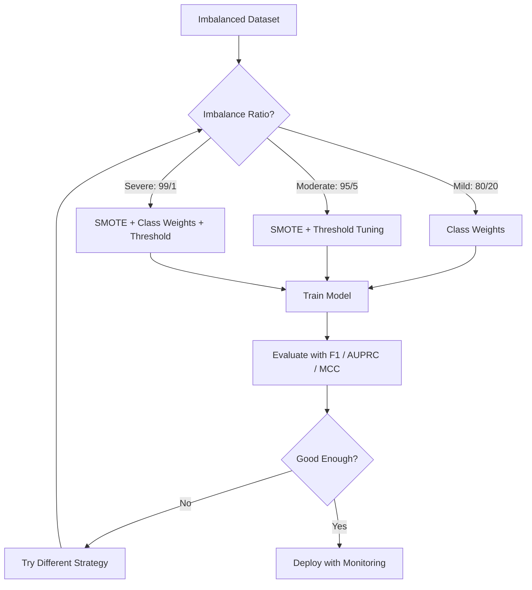
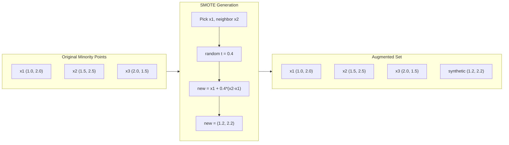
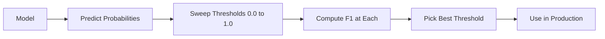
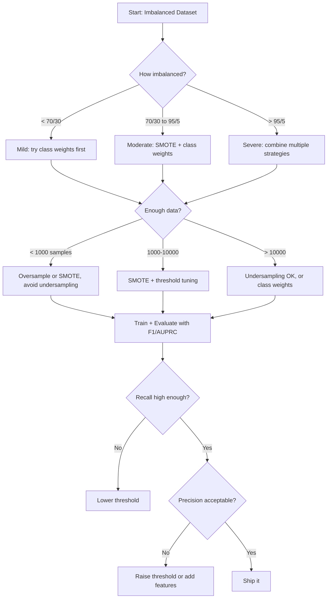

# Dengeli Olmayan Verilerle İşlem

> Verilerinin %99'u normal olduğunda doğruluk yalan olur.

**Type:** Build
**Language:**Python
**Prerequisites:** Phase 2, Lessons 01-09 (especially evaluation metrics)
**Time:** ~90 minutes

## Öğrenme Hedefleri

- SMOTE'yi sıfırdan uygulayın ve sentetik aşırı örnekleme ile rastgele çiftleme arasındaki farkı açıklayın
- Düzgünlik yerine F1, AUPRC ve Matthews Korrelasyon Koefisienini kullanarak dengesiz sınıflandırıcıları değerlendirmek
- Sınıf ağırlığını, eşiğin ayarlanmasını ve yeniden örnekleme stratejilerini karşılaştırın ve verilen dengesizlik oranı için doğru yaklaşımı seçin
- SMOTE, sınıf ağırlıkları ve eşiğin optimize edilmesini birleştiren tam dengesiz bir veri boru hattı oluşturun

## Sorun

Dolandırıcılık tespit modeli oluşturur, yüzde 99,9 doğruluk elde eder, kutlar ve her işlem için "yalandırıcılık değil" tahminini fark eder.

Bu bir hata değil. İşlemlerin sadece %0,1'ü dolandırıcı olduğunda yapılması mantıklı bir şey. Modelin öğrendiği gibi çoğunluk sınıfını tahmin etmek genel hatayı en aza indirir. Teknik olarak doğru ve tamamen işe yaramaz.

Bu her yerde gerçek sınıflandırma konularında gerçekleşir. Hastalık teşhisi: %1 pozitif oranı. Ağ girişleri: %0.01 saldırılar. Üretim kusurları: %0.5 kusurlu. Spam filtresi: %20 spam. Churn tahminleri: %5 churners. Azınlık sınıfı ne kadar sonuçlı olursa o kadar nadir olma eğilimindedir.

Doğru bir işlemin doğru bir şekilde etiketlenmesi ve sahtekarlığı doğru bir şekilde yakalamak her ikisi de doğruluk bir noktası olarak sayılır. Ama sahtekarlığı yakalamak modelin var olmasının tüm nedeni. Modelin nadir ama önemli sınıflara dikkat etmesini zorlayan ölçümlere, tekniklere ve eğitim stratejilerine ihtiyacımız var.

## Anlaşım

### Neden Doğruluk Başarısız

1000 numuneye sahip bir veri kümesini düşünelim: 990 negatif, 10 pozitif.

|  | Predicted Positive | Predicted Negative |
|--|---|---|
| Actually Positive | 0 (TP) | 10 (FN) |
| Actually Negative | 0 (FP) | 990 (TN) |

Kesinlik = (0 + 990) / 1000 = 99,0%

Model, hiçbir dolandırıcılık, hiçbir hastalık, hiçbir hata, ama doğruluk %99'u gösteriyor.

### Daha İyi Ölçümler

**Precision**TP + FP. Pozitif olarak işaretlenen her şeyden, aslında kaç tane var?

**Recall**= TP / (TP + FN). Aslında olumlu olan her şeyden kaç tane yakaladık? Yüksek hatırlama kaç kaç kaç olumlu kaybedildiği anlamına gelir.

**F1 Score**= 2 * doğruluk * geri çağırma / (doğrulık + geri çağırma). Harmonik ortalama.

**F-beta Score**= (1 + beta^2) * doğruluk * hatırlama / (beta^2 * doğruluk + hatırlama). Beta > 1 olduğunda hatırlama daha önemlidir. Beta < 1 olduğunda doğruluk daha önemlidir.

**AUPRC**(Precision-Recall Curve altında alan). AUC-ROC gibi ancak dengesiz veriler için daha bilgilendirici. Bir rastgele sınıflandırıcının AUPRC'si pozitif sınıf oranına eşit (ROC gibi 0.5 değil). Bu gelişmeleri daha kolay görmesini sağlar.

**Matthews Correlation Coefficient**= (TP * TN - FP * FN) / sqrt((TP+FP)(TP+FN)(TN+FP)(TN+FN)). -1 ila +1 arasında değişir. Sadece model her iki sınıfta iyi çalışırken yüksek puan verir.

Yukarıdaki "her zaman negatif tahmin" modeli için: hassasiyet = 0/0 (tanımsız, genellikle 0 olarak ayarlanmış), hatırlama = 0/10 = 0, F1 = 0, MCC = 0. Bu ölçümler modeli değersiz olarak doğru bir şekilde tanımlar.

### Dengezelenmiş Veriler Kökü



### SMOTE: Sintez azınlık üzerinde örnekleme tekniği

Rastgele aşırı örnekleme mevcut azınlık örneklerini çoğaltır. Bu çalışır, ancak model aynı noktaları tekrar tekrar görmesi nedeniyle aşırı uyum sağlama riski vardır.

SMOTE, inanılmaz ama kopya olmayan yeni sentetik azınlık örnekleri oluşturur.

1. Her azınlık örneği x için, diğer azınlık örnekleri arasında k'nin en yakın komşularını bul
2. Bir komşunu rastgele seç .
3. X ile komşu arasındaki çizgi segmentinde yeni bir örnek oluştur

Şekil: `new_sample = x + random(0, 1) * (neighbor - x)`

Bu, gerçek azlık noktaları arasında aralaşır ve mevcut verileri kopyalamadan aynı özellik alanındaki örnekler oluşturur.



### Örnekleme Strategileri karşılaştırıldı

**Random Oversampling**: çoğunluk sayısına eşlik etmek için ikili azınlık örnekleri.
- Avantajlar: Basit, bilgi kaybı yoktur
- Eksiklikler: Tam kopyalar aşırı uyum sağlıyor, eğitim süresini arttırıyor

**Random Undersampling**: çoğunluk örneklerini azınlık sayısına eşleştirmek için kaldırın.
- Avantajlar: hızlı eğitim, basit
- Eksiler: potansiyel olarak yararlı çoğunluk verilerini atıyor, daha yüksek varyansa

**SMOTE**: interpolasyon yoluyla sentetik azınlık örnekleri oluşturmak.
- Avantajlar: Yeni veri noktaları oluşturur, rastgele aşırı örnekleme ile karşılaştırıldığında aşırı uygunluğu azaltır
- Eksiler: karar sınırının yakınında gürültülü örnekler oluşturabilir, çoğunluk sınıfı dağılımını hesaplamaz

| Strategy | Data Changed | Risk | When to Use |
|----------|-------------|------|-------------|
| Oversample | Minority duplicated | Overfitting | Small datasets, moderate imbalance |
| Undersample | Majority removed | Information loss | Large datasets, want fast training |
| SMOTE | Synthetic minority added | Boundary noise | Moderate imbalance, enough minority samples for k-NN |

### Sınıf Ağırlıkları

Verileri değiştirmek yerine, modelin hatalarla nasıl ilgilendiğini değiştirin.

950 negatif ve 50 pozitif örnekle ikili bir sorun için:
- Negatif sınıf için ağırlık = n_sampel / (2 * n_negatif) = 1000 / (2 * 950) = 0.526
- Pozitif sınıf için ağırlık = n_sampel / (2 * n_pozitif) = 1000 / (2 * 50) = 10,0

Pozitif sınıfın ağırlığı 19 kat olur. Bir pozitif örneği yanlış sınıflandırmak 19 negatif örneği yanlış sınıflandırmak kadar maliyetlidir.

Logistik gerileme sırasında, bu kayıp işlevi değiştirir:

```
weighted_loss = -sum(w_i * [y_i * log(p_i) + (1-y_i) * log(1-p_i)])
```

w_i örnek sınıfına bağlı olduğu yer.

Sınıf ağırlıkları, matematiksel olarak beklenmedik bir şekilde fazla örnekleme ile eşdeğer, ancak yeni veri noktaları yaratmadan. Bu onları daha hızlı yapar ve çift örneklerin aşırı uygun olma riskini önler.

### Sınır ayarlama

Çoğu sınıflandırıcı bir olasılık çıkarır. Varsayılan eşiği 0.5: eğer P ((pozitif) >= 0.5, pozitif tahmin eder. Ama 0.5 keyfiyetlidir. Sınıflar dengesiz olduğunda, en uygun eşiği genellikle çok daha düşüktür.

Süreç:
1. Bir model eğit
2. Valideleme kümesinde tahmin edilen olasılıkları alın
3. 0,0 ila 1,0 arasında aralıklı sınırlar
4. Her eşiğinde F1 (veya seçtiğiniz metrik) hesaplayın
5. Metriklerini en üst düzeyde ayarlayan bir eşiği seçin .



Bir model dolandırıcı işlem için P ((sahtekârlık) = 0.15 üretebilir. 0.5 eşiğinde bu dolandırıcılık olarak sınıflandırılır. 0.10 eşiğinde doğru yakalanır. Muhtemelen kalibrasyon sıralamadan daha az önemlidir - dolandırıcılık, dolandırıcılık olmayanlardan daha yüksek olasılıkla sonuçlanırsa, onları ayıran bir eşiği vardır.

### Masraflara Çok Yakışıklı Öğrenme

Klas ağırlıklarının genelleştirilmesi.

| | Predict Positive | Predict Negative |
|--|---|---|
| Actually Positive | 0 (correct) | C_FN = 100 |
| Actually Negative | C_FP = 1 | 0 (correct) |

Sahte bir işlemin (FN) kaçırılması, yanlış bir alarmdan (FP) 100 kat daha fazla maliyet verir.

Bu, gerçek dünyadaki maliyetleri tahmin edebileceğiniz en ilkel yaklaşımdır. Kanker teşhisi kaçırılmasının, ekstra biyopsiye yol açan yanlış bir alarmdan çok farklı bir maliyeti vardır. Bu maliyetleri açıkça belirlemek doğru pazarlamaları zorlar.

### Karar Akış Çizelgesi



```figure
class-imbalance
```

## Yapın

### Adım 1: Dengezsiz bir veri kümesi oluştur

```python
import numpy as np


def make_imbalanced_data(n_majority=950, n_minority=50, seed=42):
    rng = np.random.RandomState(seed)

    X_maj = rng.randn(n_majority, 2) * 1.0 + np.array([0.0, 0.0])
    X_min = rng.randn(n_minority, 2) * 0.8 + np.array([2.5, 2.5])

    X = np.vstack([X_maj, X_min])
    y = np.concatenate([np.zeros(n_majority), np.ones(n_minority)])

    shuffle_idx = rng.permutation(len(y))
    return X[shuffle_idx], y[shuffle_idx]
```

### Adım 2: Yeriye kadar

```python
def euclidean_distance(a, b):
    return np.sqrt(np.sum((a - b) ** 2))


def find_k_neighbors(X, idx, k):
    distances = []
    for i in range(len(X)):
        if i == idx:
            continue
        d = euclidean_distance(X[idx], X[i])
        distances.append((i, d))
    distances.sort(key=lambda x: x[1])
    return [d[0] for d in distances[:k]]


def smote(X_minority, k=5, n_synthetic=100, seed=42):
    rng = np.random.RandomState(seed)
    n_samples = len(X_minority)
    k = min(k, n_samples - 1)
    synthetic = []

    for _ in range(n_synthetic):
        idx = rng.randint(0, n_samples)
        neighbors = find_k_neighbors(X_minority, idx, k)
        neighbor_idx = neighbors[rng.randint(0, len(neighbors))]
        t = rng.random()
        new_point = X_minority[idx] + t * (X_minority[neighbor_idx] - X_minority[idx])
        synthetic.append(new_point)

    return np.array(synthetic)
```

### Adım 3: Rastgele fazla ve az örnekleme

```python
def random_oversample(X, y, seed=42):
    rng = np.random.RandomState(seed)
    classes, counts = np.unique(y, return_counts=True)
    max_count = counts.max()

    X_resampled = list(X)
    y_resampled = list(y)

    for cls, count in zip(classes, counts):
        if count < max_count:
            cls_indices = np.where(y == cls)[0]
            n_needed = max_count - count
            chosen = rng.choice(cls_indices, size=n_needed, replace=True)
            X_resampled.extend(X[chosen])
            y_resampled.extend(y[chosen])

    X_out = np.array(X_resampled)
    y_out = np.array(y_resampled)
    shuffle = rng.permutation(len(y_out))
    return X_out[shuffle], y_out[shuffle]


def random_undersample(X, y, seed=42):
    rng = np.random.RandomState(seed)
    classes, counts = np.unique(y, return_counts=True)
    min_count = counts.min()

    X_resampled = []
    y_resampled = []

    for cls in classes:
        cls_indices = np.where(y == cls)[0]
        chosen = rng.choice(cls_indices, size=min_count, replace=False)
        X_resampled.extend(X[chosen])
        y_resampled.extend(y[chosen])

    X_out = np.array(X_resampled)
    y_out = np.array(y_resampled)
    shuffle = rng.permutation(len(y_out))
    return X_out[shuffle], y_out[shuffle]
```

### Adım 4: Sınıf ağırlıkları ile lojistik geri dönüş

```python
def sigmoid(z):
    return 1.0 / (1.0 + np.exp(-np.clip(z, -500, 500)))


def logistic_regression_weighted(X, y, weights, lr=0.01, epochs=200):
    n_samples, n_features = X.shape
    w = np.zeros(n_features)
    b = 0.0

    for _ in range(epochs):
        z = X @ w + b
        pred = sigmoid(z)
        error = pred - y
        weighted_error = error * weights

        gradient_w = (X.T @ weighted_error) / n_samples
        gradient_b = np.mean(weighted_error)

        w -= lr * gradient_w
        b -= lr * gradient_b

    return w, b


def compute_class_weights(y):
    classes, counts = np.unique(y, return_counts=True)
    n_samples = len(y)
    n_classes = len(classes)
    weight_map = {}
    for cls, count in zip(classes, counts):
        weight_map[cls] = n_samples / (n_classes * count)
    return np.array([weight_map[yi] for yi in y])
```

### Adım 5: Eğitme eşiği ayarlama

```python
def find_optimal_threshold(y_true, y_probs, metric="f1"):
    best_threshold = 0.5
    best_score = -1.0

    for threshold in np.arange(0.05, 0.96, 0.01):
        y_pred = (y_probs >= threshold).astype(int)
        tp = np.sum((y_pred == 1) & (y_true == 1))
        fp = np.sum((y_pred == 1) & (y_true == 0))
        fn = np.sum((y_pred == 0) & (y_true == 1))

        if metric == "f1":
            precision = tp / (tp + fp) if (tp + fp) > 0 else 0.0
            recall = tp / (tp + fn) if (tp + fn) > 0 else 0.0
            score = 2 * precision * recall / (precision + recall) if (precision + recall) > 0 else 0.0
        elif metric == "recall":
            score = tp / (tp + fn) if (tp + fn) > 0 else 0.0
        elif metric == "precision":
            score = tp / (tp + fp) if (tp + fp) > 0 else 0.0

        if score > best_score:
            best_score = score
            best_threshold = threshold

    return best_threshold, best_score
```

### Adım 6: Değerlendirme fonksiyonları

```python
def confusion_matrix_values(y_true, y_pred):
    tp = np.sum((y_pred == 1) & (y_true == 1))
    tn = np.sum((y_pred == 0) & (y_true == 0))
    fp = np.sum((y_pred == 1) & (y_true == 0))
    fn = np.sum((y_pred == 0) & (y_true == 1))
    return tp, tn, fp, fn


def compute_metrics(y_true, y_pred):
    tp, tn, fp, fn = confusion_matrix_values(y_true, y_pred)
    accuracy = (tp + tn) / (tp + tn + fp + fn)
    precision = tp / (tp + fp) if (tp + fp) > 0 else 0.0
    recall = tp / (tp + fn) if (tp + fn) > 0 else 0.0
    f1 = 2 * precision * recall / (precision + recall) if (precision + recall) > 0 else 0.0

    denom = np.sqrt(float((tp + fp) * (tp + fn) * (tn + fp) * (tn + fn)))
    mcc = (tp * tn - fp * fn) / denom if denom > 0 else 0.0

    return {
        "accuracy": accuracy,
        "precision": precision,
        "recall": recall,
        "f1": f1,
        "mcc": mcc,
    }
```

### Adım 7: Tüm yaklaşımları karşılaştırın

```python
X, y = make_imbalanced_data(950, 50, seed=42)
split = int(0.8 * len(y))
X_train, X_test = X[:split], X[split:]
y_train, y_test = y[:split], y[split:]

# Baseline: no treatment
w_base, b_base = logistic_regression_weighted(
    X_train, y_train, np.ones(len(y_train)), lr=0.1, epochs=300
)
probs_base = sigmoid(X_test @ w_base + b_base)
preds_base = (probs_base >= 0.5).astype(int)

# Oversampled
X_over, y_over = random_oversample(X_train, y_train)
w_over, b_over = logistic_regression_weighted(
    X_over, y_over, np.ones(len(y_over)), lr=0.1, epochs=300
)
preds_over = (sigmoid(X_test @ w_over + b_over) >= 0.5).astype(int)

# SMOTE
minority_mask = y_train == 1
X_minority = X_train[minority_mask]
synthetic = smote(X_minority, k=5, n_synthetic=len(y_train) - 2 * int(minority_mask.sum()))
X_smote = np.vstack([X_train, synthetic])
y_smote = np.concatenate([y_train, np.ones(len(synthetic))])
w_sm, b_sm = logistic_regression_weighted(
    X_smote, y_smote, np.ones(len(y_smote)), lr=0.1, epochs=300
)
preds_smote = (sigmoid(X_test @ w_sm + b_sm) >= 0.5).astype(int)

# Class weights
sample_weights = compute_class_weights(y_train)
w_cw, b_cw = logistic_regression_weighted(
    X_train, y_train, sample_weights, lr=0.1, epochs=300
)
probs_cw = sigmoid(X_test @ w_cw + b_cw)
preds_cw = (probs_cw >= 0.5).astype(int)

# Threshold tuning (tune on held-out validation set, not test set)
probs_val = sigmoid(X_val @ w_cw + b_cw)
best_thresh, best_f1 = find_optimal_threshold(y_val, probs_val, metric="f1")
preds_thresh = (probs_cw >= best_thresh).astype(int)
```

Kod dosyası tüm bunları tek bir senaryoda çalışır ve sonuçları yazdırır.

## Kullan

Sikit-öğrenme ve dengesiz-öğrenme ile bu teknikler tek bir çizgidir:

```python
from sklearn.linear_model import LogisticRegression
from sklearn.metrics import classification_report, f1_score
from sklearn.model_selection import train_test_split
from imblearn.over_sampling import SMOTE
from imblearn.under_sampling import RandomUnderSampler
from imblearn.pipeline import Pipeline

X_train, X_test, y_train, y_test = train_test_split(X, y, stratify=y)

model_weighted = LogisticRegression(class_weight="balanced")
model_weighted.fit(X_train, y_train)
print(classification_report(y_test, model_weighted.predict(X_test)))

smote = SMOTE(random_state=42)
X_resampled, y_resampled = smote.fit_resample(X_train, y_train)
model_smote = LogisticRegression()
model_smote.fit(X_resampled, y_resampled)
print(classification_report(y_test, model_smote.predict(X_test)))

pipeline = Pipeline([
    ("smote", SMOTE()),
    ("model", LogisticRegression(class_weight="balanced")),
])
pipeline.fit(X_train, y_train)
print(classification_report(y_test, pipeline.predict(X_test)))
```

SMOTE, azınlık sınıfında k-NN interpolasyonudur. Sınıf ağırlıkları kayıpları kat kat artırır. Sınır ayarları kesintiler üzerinde bir ön döngüdür. Sihir yok.

## Gönder

Bu ders şunları ortaya çıkarır:
- `outputs/skill-imbalanced-data.md`-- dengesiz sınıflandırma sorunlarını ele almak için bir karar kontrol listesini

## Egzersizler

1. **Borderline-SMOTE**SMOTE uygulamasını değiştirmek için, yalnızca karar sınırına yakın olan azınlık noktaları için sentetik örnekler oluşturmak (k'nin en yakın komşuları çoğunluk sınıfı örneklerini içerir).

2. **Cost matrix optimization**Bu nedenle, maliyet matrisi bir parametredir. Bir maliyet matrisi alanı oluşturup beklenen maliyeti en aza indirgenen optimum tahminleri gönderir. Farklı maliyet oranları (1:10, 1:100, 1:1000) ile test edin ve hassaslık-içilme bozukluğu nasıl değiştiğini çizin.

3. **Threshold calibration**: Platt ölçeklemesini uygulayın (kalibre olasılığını üretmek için modelin ham çıkışlarına lojistik bir geri dönüş uygulayın). Kalibrasyondan önce ve sonra hassaslık-içikleme eğriyi karşılaştırın. Kalibrasyonun sıralamayı değiştirmediğini gösterin (AUC aynı kalır), ancak olasılığı daha anlamlı hale getirir.

4. **Ensemble with balanced bagging**Bu yöntemler, SMOTE ile tek bir modelle karşılaştırıldığında, performans ve varyansaları ölçerek, tüm sürümler arasında değişimi ölçerek, birbiriyle karşılaştırarak, birbiriyle karşılaştırarak, birbiriyle karşılaştırarak, birbiriyle karşılaştırarak, birbiriyle karşılaştırarak, birbiriyle karşılaştırarak, diğerleriyle karşılaştırarak, diğerleriyle karşılaştırarak, diğerleriyle karşılaştırarak, diğerleriyle karşılaştırarak, diğerleriyle karşılaştırarak, diğerleriyle karşılaştırarak, diğerleriyle karşılaştırarak, diğerleriyle karşılaştırarak, diğerleriyle karşılaştırarak, diğerleriyle karşılaştırarak, diğerleriyle karşılaştırarak, diğerleriyle karşılaştırarak, diğerleriyle karşılaştırarak, diğerleriyle karşılaştırarak, diğerleriyle karşılaştırarak, diğerleriyle karşılaştırarak, diğerleriyle karşılaştırarak, diğerleriyle karşılaştırarak, diğerleriyle karşılaştırarak, diğerleriyle karşılaştırarak, diğerleriyle karşılaştırarak, diğerleriyle karşılaştırarak, diğerleriyle karşılaştırarak, diğerleriyle karşılaştırarak, diğerleriyle karşılaştırarak, diğerleriyle karşılaştırarak, diğerleriyle karşılaştırarak, diğerleriyle karşılaştırarak, diğerleriyle karşılaştırarak, diğerleriyle karşılaştırarak, diğerleriyle karşılaştırarak, diğerleriyle karşılaştırarak, diğerleriyle karşılaştırarak, (bir şekilde, aynı şekilde, aynı şekilde, aynı şekilde, aynı şekilde, aynı şekilde, aynı şekilde, aynı şekilde, aynı şekilde, aynı şekilde, aynı şekilde, aynı şekilde, aynı şekilde, de de de de de de de de de de de de de de de de de de de de de de de de de de de de de de de de de de de de de de de de de de de de de de de de de de de de de de de de de de de de de de de de de de de de de de de de de de de de de de de de de de de de de de de de de de de de de de de de de de de de de de de de de de de de de de de de de de de de de de de de de de de de de de de de de de de de de de de de de de de de de de de de de de de de de de de de de de de de de de de de de

5. **Imbalance ratio experiment**Bu nedenle, SMOTE'nin bir diğer yöntemi olan SMOTE'nin, her bir oran için SMOTE ile ve olmadan çalıştırılmasıdır.

## Anahtar Terimler

| Term | What people say | What it actually means |
|------|----------------|----------------------|
| Class imbalance | "One class has way more samples" | The distribution of classes in the dataset is significantly skewed, causing models to favor the majority class |
| SMOTE | "Synthetic oversampling" | Creates new minority samples by interpolating between existing minority samples and their k-nearest minority neighbors |
| Class weights | "Making errors on rare classes more expensive" | Multiplying the loss function by class-specific weights so the model penalizes minority misclassification more heavily |
| Threshold tuning | "Moving the decision boundary" | Changing the probability cutoff for classification from the default 0.5 to a value that optimizes the desired metric |
| Precision-recall tradeoff | "You cannot have both" | Lowering the threshold catches more positives (higher recall) but also flags more false positives (lower precision), and vice versa |
| AUPRC | "Area under the PR curve" | Summarizes the precision-recall curve into a single number; more informative than AUC-ROC when classes are heavily imbalanced |
| Matthews Correlation Coefficient | "The balanced metric" | A correlation between predicted and actual labels that produces a high score only when the model performs well on both classes |
| Cost-sensitive learning | "Different mistakes cost different amounts" | Incorporating real-world misclassification costs into the training objective so the model optimizes for total cost, not error count |
| Random oversampling | "Duplicate the minority" | Repeating minority class samples to balance class counts; simple but risks overfitting to duplicated points |

## Daha Fazla Okumak

- [SMOTE: Synthetic Minority Over-sampling Technique (Chawla et al., 2002)](https://arxiv.org/abs/1106.1813)-- orijinal SMOTE makalesi, hala dengesiz öğrenme konusunda en çok alıntılanan çalışma
- [Learning from Imbalanced Data (He & Garcia, 2009)](https://ieeexplore.ieee.org/document/5128907)-- örnekleme, maliyetlere karşı hassas ve algoritmik yaklaşımları kapsadığı kapsamlı bir araştırma
- [imbalanced-learn documentation](https://imbalanced-learn.org/stable/)-- SMOTE çeşitleri, alt örnekleme stratejileri ve boru hattı entegrasyonu ile Python kütüphanesi
- [The Precision-Recall Plot Is More Informative than the ROC Plot (Saito & Rehmsmeier, 2015)](https://journals.plos.org/plosone/article?id=10.1371/journal.pone.0118432)-- Denge eksikliği için PR eğriliklerini ROC eğriliklerine ne zaman ve neden tercih edilmelidir
