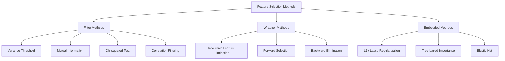
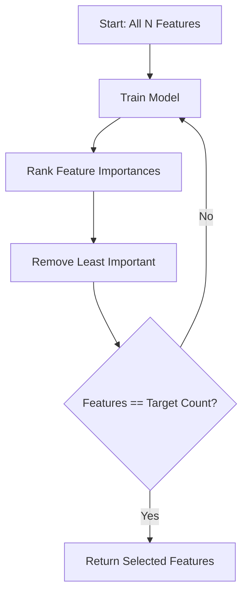
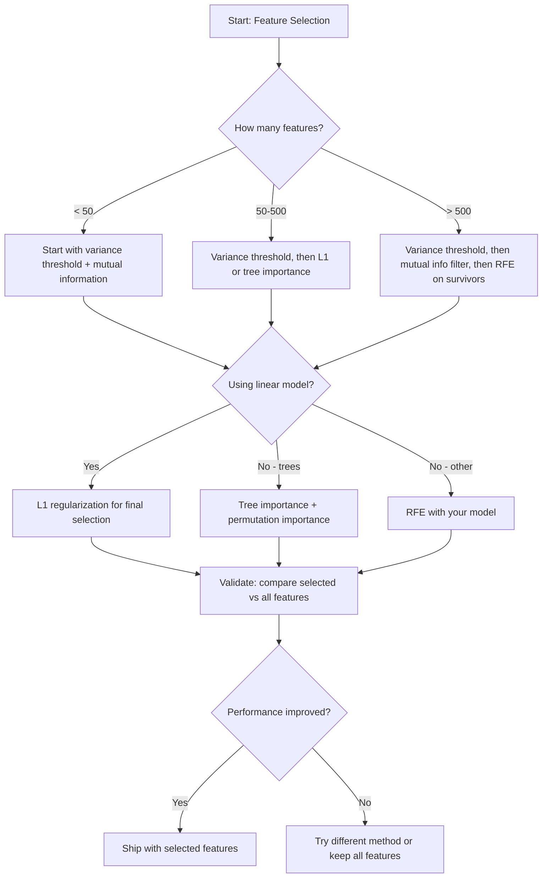

# Özellik Seçimi

> Daha fazla özellik daha iyi değil, doğru özellikler daha iyidir.

**Type:** Build
**Language:**Python
**Prerequisites:** Phase 2, Lessons 01-09, 08 (feature engineering)
**Time:** ~75 minutes

## Öğrenme Hedefleri

- Filtrleme yöntemlerini (varians eşiği, karşılıklı bilgi, chi-square) ve sarma yöntemlerini (RFE, ileriye seçme) sıfırdan uygulamak
- Karşılıklı bilgi neden bağlantıların eksik olduğu çizgisiz özellik-hedef ilişkileri yakalar?
- L1 düzenlenmesini (kişili seçimi) RFE ile (kalip seçimi) karşılaştırın ve hesaplama işlemleri karşılaştırın
- Çoklu yöntemleri birleştiren ve tutulan veriler üzerinde daha iyi genelleştirmeyi gösteren bir özellik seçimi boru hattı oluşturun

## Sorun

500 özellikiniz var. Modeliniz yavaş yavaş tren alır, sürekli aşırı yüklenir ve kimse ne öğrendiklerini açıklayamaz. Performansı artırmak için daha fazla özellik eklersiniz.

Bu, eylemdeki boyutlulığın lanetidir. Özelliklerin sayısı arttıkça, özellik alanının hacmi patlar. Veri noktaları nadir hale gelir. Noktalar arasındaki mesafeler birleşti. Modelle gerçek kalıpları bulmak için eksponansiel olarak daha fazla veri gerekmektedir. Ses özellikleri sinyal özelliklerini boğar. Aşırı uyum öntanımlı hale gelir.

Özellik seçimi, karşı ilacın bir parçasıdır. Gürültüyü ortadan kaldırın. Boşluğu ortadan kaldırın. Hedef hakkında gerçek bilgi taşıyan özellikleri koruyun. Sonuç: daha hızlı eğitim, daha iyi genelleştirme ve aslında açıklayabileceğiniz modeller.

Amaç tüm mevcut bilgileri kullanmak değil, doğru bilgileri kullanmaktır.

## Anlaşım

### Özellik Seçimi Üç Kategoriyası

Her özellik seçimi yöntemi üç kategoriden birine ayrılır:



**Filter methods**Bu, bir model kullanmamak için, bir özellik etkileşimini kaçırmak için.

**Wrapper methods**Bu, bir modelin özellik alt kümelerini değerlendirmesi için eğitilmesini sağlar.

**Embedded methods**L1 düzenlenmesi ağırlıkları sıfıra çıkarır. karar ağaçları en yararlı özelliklere ayrılır. Seçim ayrı bir adım olarak değil, montaj sırasında gerçekleşir.

### Değişiklik Eğitimi

Bir özellik örnekler arasında az değişirse, neredeyse hiçbir bilgi taşımıyor.

1000 örnekten 999'un 0.0 oranında bir özelliği düşünün.

```
variance(x) = mean((x - mean(x))^2)
```

Bir eşiği (örneğin, 0.01) belirleyin. Onun altında varyansiyesi olan her özelliği bırakın. Bu, hedef değişkenine bakmadan sabit veya neredeyse sabit özellikleri çıkarır.

Ne zaman kullanılır: diğer yöntemlerden önce bir önceden işleme adımı olarak.

Sınırlama: bir özellik yüksek bir değişikliğe sahip olabilir ve yine de saf bir gürültü olabilir.

### Karşılıklı Bilgi

Karşılıklı bilgi, X özelliğinin değerini bilmek ile Y hedefi hakkında belirsizliklerin ne kadar azaldığını ölçer.

```
I(X; Y) = sum_x sum_y p(x, y) * log(p(x, y) / (p(x) * p(y)))
```

Eğer X ve Y bağımsız ise, p(x, y) = p(x) * p(y), yani log terimi sıfır ve I(X; Y) = 0. X size Y hakkında ne kadar çok şey söylerse, karşılıklı bilgi o kadar yüksek olur.

Bir özelliğin hedefe sıfır bir korelasyonu olabilir, ancak ilişki kare veya periyodik olduğu için yüksek karşılıklı bilgi olabilir.

Sürekli özellikler için önce kutulara ayırt edin (istogram tabanlı tahmin). kutuların sayısı tahmine etkiler - çok az kutu bilgiyi kaybeder, çok fazla kutu gürültü ekler.


### Tekrarlı Özelliklerin Yok edilmesi (RFE)

RFE bir sarma yöntemidir. Bir modelin kendi özellik önemi ile tekrar tekrar kesim yapar:

1. Tüm özelliklerle model eğit
2. Önemliliklere göre sıralama özellikleri (lineer modeller için katılıklar, ağaçlar için kirlilik azaltımı)
3. En az önemli özelliği kaldırın
4. İstediğiniz özellik sayısı kalana kadar tekrarlayın



RFE, özellik etkileşimlerini göz önünde bulundurur çünkü model kalan tüm özellikleri bir araya getirir. Bir özellikten çıkarılması diğerlerinin önemini değiştirir. Bu, filtre yöntemlerinden daha kapsamlı hale getirir.

Masraf: model N - hedef zamanları eğitirsiniz. 500 özellik ve 10 hedef ile, yani 490 eğitim koşusu. Pahalı modeller için bu yavaş. Adım başına birden fazla özellik çıkararak hızlandırabilirsiniz (örneğin, her turda alt 10% çıkarın).

### L1 (Lasso) Düzenleme

L1 düzenlenmesi, kayıp fonksiyonuna ağırlıkların mutlak değerini ekler:

```
loss = prediction_error + alpha * sum(|w_i|)
```

Alfa parametri, özelliklerin ne kadar agresif olarak kesildiğini kontrol eder.

L1 cezası, ağırlık alanında elmas şeklinde bir kısıtlama bölgesini oluşturur. Optimal çözüm, bu elmasın bir veya daha fazla ağırlığın sıfır olduğu bir köşede yerleşebilir. L2 düzenlenmesi (kaş) ağırlıkların küçülmesi ancak nadiren sıfıra ulaşması için bir döngü kısıtlama oluşturur.

Bu, yerleşik özellik seçimi: model eğitim sırasında hangi özellikleri görmezden gelmeyi öğrenir.

Avantajlar: tek eğitim çalışması, ilişkili özellikleri ele alır (birini ve diğerlerini sıfırlar), çoğu doğrusal model uygulamasına yerleştirilmiştir.

Sınırlama: Sadece doğrusal modeller için çalışır.

### Ağaç Temelindeki Özelliklerin Önemi

Karar ağaçları ve onların ansamblları (hassasi ormanlar, gradient artışı) doğal olarak özellikleri sıralar. Her bölünme kirliliği azaltır (sınıflama için Gini veya entropy, geri dönüş için varians).

T ağaçları olan rastgele bir orman için:

```
importance(feature_j) = (1/T) * sum over all trees of
    sum over all nodes splitting on feature_j of
        (n_samples * impurity_decrease)
```

Bu, her özellik için normallaştırılmış bir önem puanı verir.

Dikkat: ağaç tabanlı önem birçok benzersiz değer (yüksek kardinallık) olan özelliklere karşı tarafsızdır.

### Permutasyon Önemliliği

Model-agnostik bir yöntem:

1. Model eğitimi ve doğrulama verileriyle başlangıç performansını kaydetmek
2. Her özellik için: değerlerini rastgele karıştırın, performans düşüşünü ölçün
3. Düşüş ne kadar büyükse, özellik o kadar önemli olur.

Bir özelliği karıştırmak performansına zarar vermezse, model buna bağlı değildir.

Permutasyon önemi ağaç tabanlı önemi kardinallik önyargısını önler. Ama yavaş: her özellik için bir tam değerlendirme, istikrar için çok kez tekrarlanır.

### Karşılaştırma Tablosu

| Method | Type | Speed | Nonlinear | Feature Interactions |
|--------|------|-------|-----------|---------------------|
| Variance threshold | Filter | Very fast | No | No |
| Mutual information | Filter | Fast | Yes | No |
| Correlation filter | Filter | Fast | No | No |
| RFE | Wrapper | Slow | Depends on model | Yes |
| L1 / Lasso | Embedded | Fast | No (linear) | No |
| Tree importance | Embedded | Medium | Yes | Yes |
| Permutation importance | Model-agnostic | Slow | Yes | Yes |

### Karar Akış Çizelgesi



```figure
f3-feature-prune
```

## Yapın

### Adım 1: Bilinen özellik yapısı ile sentetik verileri oluşturun

```python
import numpy as np


def make_feature_selection_data(n_samples=500, seed=42):
    rng = np.random.RandomState(seed)

    x1 = rng.randn(n_samples)
    x2 = rng.randn(n_samples)
    x3 = rng.randn(n_samples)
    x4 = x1 + 0.1 * rng.randn(n_samples)
    x5 = x2 + 0.1 * rng.randn(n_samples)

    informative = np.column_stack([x1, x2, x3, x4, x5])

    correlated = np.column_stack([
        x1 * 0.9 + 0.1 * rng.randn(n_samples),
        x2 * 0.8 + 0.2 * rng.randn(n_samples),
        x3 * 0.7 + 0.3 * rng.randn(n_samples),
        x1 * 0.5 + x2 * 0.5 + 0.1 * rng.randn(n_samples),
        x2 * 0.6 + x3 * 0.4 + 0.1 * rng.randn(n_samples),
    ])

    noise = rng.randn(n_samples, 10) * 0.5

    X = np.hstack([informative, correlated, noise])
    y = (2 * x1 - 1.5 * x2 + x3 + 0.5 * rng.randn(n_samples) > 0).astype(int)

    feature_names = (
        [f"info_{i}" for i in range(5)]
        + [f"corr_{i}" for i in range(5)]
        + [f"noise_{i}" for i in range(10)]
    )

    return X, y, feature_names
```

Temel gerçeği biliyoruz: 0-4 özellikleri bilgilendirici (daha 3 ve 4 0 ve 1'nin ilişkili kopyalarıdır), 5-9 özellikleri bilgilendirici özelliklerle ilişkili, 10-19 özellikleri saf gürültüdür. İyi bir seçim yöntemi 0-4 en yüksek ve 10-19 en düşük sırada yer almalıdır.

### Adım 2: Değişiklik eşiği

```python
def variance_threshold(X, threshold=0.01):
    variances = np.var(X, axis=0)
    mask = variances > threshold
    return mask, variances
```

### Adım 3: Karşılıklı bilgi (diskret)

```python
def discretize(x, n_bins=10):
    min_val, max_val = x.min(), x.max()
    if max_val == min_val:
        return np.zeros_like(x, dtype=int)
    bin_edges = np.linspace(min_val, max_val, n_bins + 1)
    binned = np.digitize(x, bin_edges[1:-1])
    return binned


def mutual_information(X, y, n_bins=10):
    n_samples, n_features = X.shape
    mi_scores = np.zeros(n_features)

    y_vals, y_counts = np.unique(y, return_counts=True)
    p_y = y_counts / n_samples

    for f in range(n_features):
        x_binned = discretize(X[:, f], n_bins)
        x_vals, x_counts = np.unique(x_binned, return_counts=True)
        p_x = dict(zip(x_vals, x_counts / n_samples))

        mi = 0.0
        for xv in x_vals:
            for yi, yv in enumerate(y_vals):
                joint_mask = (x_binned == xv) & (y == yv)
                p_xy = np.sum(joint_mask) / n_samples
                if p_xy > 0:
                    mi += p_xy * np.log(p_xy / (p_x[xv] * p_y[yi]))
        mi_scores[f] = mi

    return mi_scores
```

### 4. Adım: Tekrarlı Özelliklerin Yok edilmesi

```python
def simple_logistic_importance(X, y, lr=0.1, epochs=100):
    n_samples, n_features = X.shape
    w = np.zeros(n_features)
    b = 0.0

    for _ in range(epochs):
        z = X @ w + b
        pred = 1.0 / (1.0 + np.exp(-np.clip(z, -500, 500)))
        error = pred - y
        w -= lr * (X.T @ error) / n_samples
        b -= lr * np.mean(error)

    return w, b


def rfe(X, y, n_features_to_select=5, lr=0.1, epochs=100):
    n_total = X.shape[1]
    remaining = list(range(n_total))
    rankings = np.ones(n_total, dtype=int)
    rank = n_total

    while len(remaining) > n_features_to_select:
        X_subset = X[:, remaining]
        w, _ = simple_logistic_importance(X_subset, y, lr, epochs)
        importances = np.abs(w)

        least_idx = np.argmin(importances)
        original_idx = remaining[least_idx]
        rankings[original_idx] = rank
        rank -= 1
        remaining.pop(least_idx)

    for idx in remaining:
        rankings[idx] = 1

    selected_mask = rankings == 1
    return selected_mask, rankings
```

### Adım 5: L1 özellik seçimi

```python
def soft_threshold(w, alpha):
    return np.sign(w) * np.maximum(np.abs(w) - alpha, 0)


def l1_feature_selection(X, y, alpha=0.1, lr=0.01, epochs=500):
    n_samples, n_features = X.shape
    w = np.zeros(n_features)
    b = 0.0

    for _ in range(epochs):
        z = X @ w + b
        pred = 1.0 / (1.0 + np.exp(-np.clip(z, -500, 500)))
        error = pred - y

        gradient_w = (X.T @ error) / n_samples
        gradient_b = np.mean(error)

        w -= lr * gradient_w
        w = soft_threshold(w, lr * alpha)
        b -= lr * gradient_b

    selected_mask = np.abs(w) > 1e-6
    return selected_mask, w
```

### Adım 6: Ağaç temelli önem (sadece karar ağacı)

```python
def gini_impurity(y):
    if len(y) == 0:
        return 0.0
    classes, counts = np.unique(y, return_counts=True)
    probs = counts / len(y)
    return 1.0 - np.sum(probs ** 2)


def best_split(X, y, feature_idx):
    values = np.unique(X[:, feature_idx])
    if len(values) <= 1:
        return None, -1.0

    best_threshold = None
    best_gain = -1.0
    parent_gini = gini_impurity(y)
    n = len(y)

    for i in range(len(values) - 1):
        threshold = (values[i] + values[i + 1]) / 2.0
        left_mask = X[:, feature_idx] <= threshold
        right_mask = ~left_mask

        n_left = np.sum(left_mask)
        n_right = np.sum(right_mask)

        if n_left == 0 or n_right == 0:
            continue

        gain = parent_gini - (n_left / n) * gini_impurity(y[left_mask]) - (n_right / n) * gini_impurity(y[right_mask])

        if gain > best_gain:
            best_gain = gain
            best_threshold = threshold

    return best_threshold, best_gain


def tree_importance(X, y, n_trees=50, max_depth=5, seed=42):
    rng = np.random.RandomState(seed)
    n_samples, n_features = X.shape
    importances = np.zeros(n_features)

    for _ in range(n_trees):
        sample_idx = rng.choice(n_samples, size=n_samples, replace=True)
        feature_subset = rng.choice(n_features, size=max(1, int(np.sqrt(n_features))), replace=False)

        X_boot = X[sample_idx]
        y_boot = y[sample_idx]

        tree_imp = _build_tree_importance(X_boot, y_boot, feature_subset, max_depth)
        importances += tree_imp

    total = importances.sum()
    if total > 0:
        importances /= total

    return importances


def _build_tree_importance(X, y, feature_subset, max_depth, depth=0):
    n_features = X.shape[1]
    importances = np.zeros(n_features)

    if depth >= max_depth or len(np.unique(y)) <= 1 or len(y) < 4:
        return importances

    best_feature = None
    best_threshold = None
    best_gain = -1.0

    for f in feature_subset:
        threshold, gain = best_split(X, y, f)
        if gain > best_gain:
            best_gain = gain
            best_feature = f
            best_threshold = threshold

    if best_feature is None or best_gain <= 0:
        return importances

    importances[best_feature] += best_gain * len(y)

    left_mask = X[:, best_feature] <= best_threshold
    right_mask = ~left_mask

    importances += _build_tree_importance(X[left_mask], y[left_mask], feature_subset, max_depth, depth + 1)
    importances += _build_tree_importance(X[right_mask], y[right_mask], feature_subset, max_depth, depth + 1)

    return importances
```

### Adım 7: Tüm yöntemleri çalıştır ve karşılaştır

Kod dosyası aynı sentetik veri kümesinde beş yöntemi de çalışır ve her yöntemi seçen özellikleri gösteren bir karşılaştırma tablosu basar.

## Kullan

Scikit-learn ile, özellik seçimi boru hattına yerleştirilmiştir:

```python
from sklearn.feature_selection import (
    VarianceThreshold,
    mutual_info_classif,
    RFE,
    SelectFromModel,
)
from sklearn.linear_model import Lasso, LogisticRegression
from sklearn.ensemble import RandomForestClassifier

vt = VarianceThreshold(threshold=0.01)
X_filtered = vt.fit_transform(X)

mi_scores = mutual_info_classif(X, y)
top_k = np.argsort(mi_scores)[-10:]

rfe_selector = RFE(LogisticRegression(), n_features_to_select=10)
rfe_selector.fit(X, y)
X_rfe = rfe_selector.transform(X)

lasso_selector = SelectFromModel(Lasso(alpha=0.01))
lasso_selector.fit(X, y)
X_lasso = lasso_selector.transform(X)

rf = RandomForestClassifier(n_estimators=100)
rf.fit(X, y)
importances = rf.feature_importances_
```

Başlangıçtaki uygulamalar her yöntemin içinde ne olduğunu tam olarak gösterir.`var(X, axis=0)`RFE, bir tren, sıra ve kürek çizer bir döngüdür. L1 yumuşak bir sınırlı adımla gradient düşüşüdür. Ağaç önemi bölünmeler boyunca kirlilik azaltmalarını biriktirir. Sihir yok - sadece istatistik ve döngüler.

sklearn sürümleri dayanıklılık (örneğin, mutual_info_classif, bin yerine k-NN yoğunluk tahminini kullanır), hız (C uygulamalar) ve boru hattı entegrasyonu.

## Gönder

Bu ders şunları ortaya çıkarır:
- `outputs/skill-feature-selector.md`-- doğru özellik seçimi yöntemi seçmek için hızlı bir referans karar ağacı

## Egzersizler

1. **Forward selection**RFE'nin tam tersini uygulayın. Zıfır özelliklerle başlayın. Her adımda model performansını en çok iyileştiren özelliği ekleyin. Özellikleri eklerken durun artık yardımcı olmaz. Seçilen özellikleri RFE sonuçlarıyla karşılaştırın. Hangisi daha hızlı? Hangisi daha iyi sonuçlar verir?

2. **Stability selection**L1 özellik seçimi: L1 özellik seçimini 50 kez, her seferinde, verilerin rastgele bir alt örnekinin %80'inde, hafif farklı alfa değerleri ile çalıştırın. Her özellik ne kadar sık seçilir.

3. **Multicollinearity detection**: tüm özellikler için ilişki matrisi hesaplayın. Bir ilişki eşiği (örneğin 0,9) verildiğinde, her yüksek ilişkili çiftten bir özellik çıkarır (hedef ile daha yüksek karşılıklı bilgi olan bir çiftin korunması). Sentetik veri kümesi üzerinde test yapın ve onu doğrulayın.

4. **Feature selection pipeline**: zincir varyansa eşiği, karşılıklı bilgi filtresi ve RFE tek bir boru hattına. Önce sıfır yakın varyansa özelliklerini kaldırın, sonra üst 50%'i karşılıklı bilgi ile tutun, sonra hayatta kalanlar üzerinde RFE çalıştırın. Bu boru hattını tüm özelliklerde RFE'yi tek başına çalıştırmaya karşılaştırın. Boru hattı daha hızlı mıdır?

5. **Permutation importance from scratch**F1 puanının ortalama düşüşünü ölçerek, her özellik için değerlerini 10 kez karıştırın. Rangoyu ağaç tabanlı önemle karşılaştırın. Anlaşmazlıkların olduğu durumları bul ve nedenini açıklayın (söyleme: ilişkili özellikler).

## Anahtar Terimler

| Term | What people say | What it actually means |
|------|----------------|----------------------|
| Filter method | "Score features independently" | A feature selection approach that ranks features using a statistical measure without training a model, evaluating each feature in isolation |
| Wrapper method | "Use the model to pick features" | A feature selection approach that evaluates feature subsets by training a model and using its performance as the selection criterion |
| Embedded method | "The model selects features during training" | Feature selection that happens as part of model fitting, such as L1 regularization driving weights to zero |
| Mutual information | "How much one variable tells you about another" | A measure of the reduction in uncertainty about Y given knowledge of X, capturing both linear and nonlinear dependencies |
| Recursive Feature Elimination | "Train, rank, prune, repeat" | An iterative wrapper method that trains a model, removes the least important feature(s), and repeats until a target count is reached |
| L1 / Lasso regularization | "Penalty that kills features" | Adding the sum of absolute weight values to the loss function, which drives unimportant feature weights to exactly zero |
| Variance threshold | "Remove constant features" | Dropping features whose variance across samples falls below a specified threshold, filtering out features that carry no information |
| Feature importance | "Which features matter most" | A score indicating how much each feature contributes to model predictions, computed from split gains (trees) or coefficient magnitudes (linear) |
| Permutation importance | "Shuffle and measure the damage" | Evaluating feature importance by randomly shuffling each feature's values and measuring the resulting drop in model performance |
| Curse of dimensionality | "Too many features, not enough data" | The phenomenon where adding features increases the volume of the feature space exponentially, making data sparse and distances meaningless |

## Daha Fazla Okumak

- [An Introduction to Variable and Feature Selection (Guyon & Elisseeff, 2003)](https://jmlr.org/papers/v3/guyon03a.html)-- Özellik seçimi yöntemleri üzerine temel araştırmaya, hala yaygın olarak atıfta bulunmaktadır
- [scikit-learn Feature Selection Guide](https://scikit-learn.org/stable/modules/feature_selection.html)-- Filtr, ambalaj ve kod örnekleri ile gömülü yöntemler için pratik referans
- [Stability Selection (Meinshausen & Buhlmann, 2010)](https://arxiv.org/abs/0809.2932)-- güçlü, tekrarlanabilir sonuçlar için alt örnekleme ile özellik seçimi birleştirir
- [Beware Default Random Forest Importances (Strobl et al., 2007)](https://bmcbioinformatics.biomedcentral.com/articles/10.1186/1471-2105-8-25)-- ağaç temelli önemdeki kardinallik önyargısını gösterir ve alternatif olarak koşullu önem önerir
