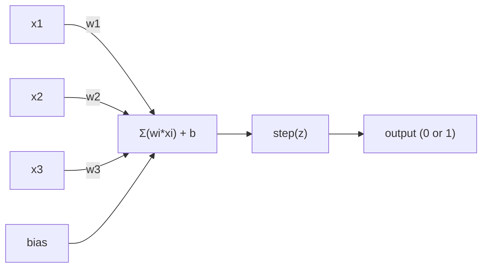
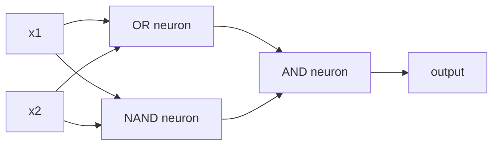

# Perceptron

> Perceptron sinir ağlarının atomudur. Açın ve ağırlıkları, önyargıları ve bir kararı bulacaksınız.

**Type:** Build
**Languages:** Python
**Prerequisites:** Phase 1 (Linear Algebra Intuition)
**Time:** ~60 minutes

## Öğrenme Hedefleri

- Python'da bir perceptron uygulamasını baştan başlayın, ağırlık güncelleme kuralı ve adım etkinleştirme işlevi dahil
- Tek bir perceptron'un neden sadece doğrusal olarak ayrılabilir sorunları çözebileceğini açıklayın ve XOR başarısızlık durumunu gösterin
- XOR çözmek için OR, NAND ve AND kapılarını oluşturarak çok katmanlı bir perceptron inşa edin
- XOR'u otomatik olarak öğrenmek için sigmoid aktivasyonu ve geri yayılması ile iki katmanlı bir ağ eğit

## Sorun

Vectörleri ve nokta ürünlerini biliyorsunuz. Bir matrisin girişleri çıkışlara dönüştürdüğünü biliyorsunuz. Ama bir makine hangi dönüşümü kullanmayı nasıl öğrenir?

Perceptron buna cevap verir. Bu mümkün olan en basit öğrenme makinesi: bazı girişleri alın, ağırlıklarla çarpın, bir önyargı ekleyin ve ikili bir karar verin. Sonra ayarlayın. İşte bu.

Perceptron'u anlamak aslında kodda "öğrenme" ne anlama geldiğini anlamak demektir: çıkış gerçekliğe uymaya kadar sayıları ayarlamak.

## Anlaşım

### Tek Bir Nöron, Tek Bir Karar

Bir perceptron n giriş alır, her birini bir ağırlıkla çarpır, onları toplar, bir önyargıyı ekler ve sonucu bir etkinleştirme fonksiyonu aracılığıyla geçer.



Adım fonksiyonu vahşi: ağırlıklı toplam artı önyargı >= 0, çıkış 1. Aksi takdirde çıkış 0.

```
step(z) = 1  if z >= 0
           0  if z < 0
```

Bu bir çizgülü sınıflandırıcıdır. Ağırlıklar ve tarafsızlık giriş alanını iki bölgeye ayıran bir çizgiyi (veya daha yüksek boyutlarda hiper düzlem) tanımlar.

### Karar Sınırı

İki giriş için, perceptron 2 boyutlu alanın içinden bir çizgi çizer:

```
  x2
  ┤
  │  Class 1        /
  │    (0)          /
  │                /
  │               / w1·x1 + w2·x2 + b = 0
  │              /
  │             /     Class 2
  │            /        (1)
  ┼───────────/──────────── x1
```

Hatın bir tarafındaki her şey 0 çıkışı çıkarır. Diğer taraftaki her şey 1 çıkışı çıkarır.

### Öğrenme Kuralı

Perceptron öğrenme kuralı basit:

```
For each training example (x, y_true):
    y_pred = predict(x)
    error = y_true - y_pred

    For each weight:
        w_i = w_i + learning_rate * error * x_i
    bias = bias + learning_rate * error
```

Eğer tahmin doğruysa, hata = 0, hiçbir şey değişmez. Eğer 0'u tahmin ederse, ama 1 olması gerekiyorsa, ağırlıklar artır. 1'i tahmin ederse, ama 0 olması gerekiyorsa, ağırlıklar azalır. Öğrenme hızı her ayarın ne kadar büyük olduğunu kontrol eder.

### XOR Sorunu

Bu mantık kapılarına bakın:

```
AND gate:           OR gate:            XOR gate:
x1  x2  out         x1  x2  out         x1  x2  out
0   0   0           0   0   0           0   0   0
0   1   0           0   1   1           0   1   1
1   0   0           1   0   1           1   0   1
1   1   1           1   1   1           1   1   0
```

AND ve OR doğrusal olarak ayırılabilir: 0'ları 1'lerden ayırmak için tek bir çizgi çizmek mümkündür. XOR değildir. Hiçbir tek çizgi [0,1] ve [1,0]'yi [0,0] ve [1,1]'den ayıramaz.

```
AND (separable):        XOR (not separable):

  x2                      x2
  1 ┤  0     1            1 ┤  1     0
    │     /                 │
  0 ┤  0 / 0              0 ┤  0     1
    ┼──/──────── x1         ┼──────────── x1
       line works!          no single line works!
```

Bu temel bir sınırdır. Tek bir algıtron sadece doğrusal olarak ayrılabilir sorunları çözebilir. Minsky ve Papert bunu 1969'da kanıtladı ve bir on yıl boyunca sinir ağları araştırmalarını neredeyse öldürdü.

Çözüm: algılayıcıları katmanlara yığın. Çok katmanlı algılayıcı bir xor çözümü iki doğrusal kararı doğrusal olmayan bir karar olarak birleştirerek çözebilir.

```figure
perceptron-boundary
```

## Yapın

### Adım 1: Perceptron sınıfı

```python
class Perceptron:
    def __init__(self, n_inputs, learning_rate=0.1):
        self.weights = [0.0] * n_inputs
        self.bias = 0.0
        self.lr = learning_rate

    def predict(self, inputs):
        total = sum(w * x for w, x in zip(self.weights, inputs))
        total += self.bias
        return 1 if total >= 0 else 0

    def train(self, training_data, epochs=100):
        for epoch in range(epochs):
            errors = 0
            for inputs, target in training_data:
                prediction = self.predict(inputs)
                error = target - prediction
                if error != 0:
                    errors += 1
                    for i in range(len(self.weights)):
                        self.weights[i] += self.lr * error * inputs[i]
                    self.bias += self.lr * error
            if errors == 0:
                print(f"Converged at epoch {epoch + 1}")
                return
        print(f"Did not converge after {epochs} epochs")
```

### Adım 2: Mantık kapılarını eğit

```python
and_data = [
    ([0, 0], 0),
    ([0, 1], 0),
    ([1, 0], 0),
    ([1, 1], 1),
]

or_data = [
    ([0, 0], 0),
    ([0, 1], 1),
    ([1, 0], 1),
    ([1, 1], 1),
]

not_data = [
    ([0], 1),
    ([1], 0),
]

print("=== AND Gate ===")
p_and = Perceptron(2)
p_and.train(and_data)
for inputs, _ in and_data:
    print(f"  {inputs} -> {p_and.predict(inputs)}")

print("\n=== OR Gate ===")
p_or = Perceptron(2)
p_or.train(or_data)
for inputs, _ in or_data:
    print(f"  {inputs} -> {p_or.predict(inputs)}")

print("\n=== NOT Gate ===")
p_not = Perceptron(1)
p_not.train(not_data)
for inputs, _ in not_data:
    print(f"  {inputs} -> {p_not.predict(inputs)}")
```

### Adım 3: XOR'un başarısız olduğunu izle

```python
xor_data = [
    ([0, 0], 0),
    ([0, 1], 1),
    ([1, 0], 1),
    ([1, 1], 0),
]

print("\n=== XOR Gate (single perceptron) ===")
p_xor = Perceptron(2)
p_xor.train(xor_data, epochs=1000)
for inputs, expected in xor_data:
    result = p_xor.predict(inputs)
    status = "OK" if result == expected else "WRONG"
    print(f"  {inputs} -> {result} (expected {expected}) {status}")
```

Bu tek bir algılayıcı XOR'u öğrenemeyeceğinin kanıtı.

### Adım 4: XOR'u iki katmanla çöz

XOR = (x1 YA da x2) ve NOT (x1 YEN x2)



```python
def xor_network(x1, x2):
    or_neuron = Perceptron(2)
    or_neuron.weights = [1.0, 1.0]
    or_neuron.bias = -0.5

    nand_neuron = Perceptron(2)
    nand_neuron.weights = [-1.0, -1.0]
    nand_neuron.bias = 1.5

    and_neuron = Perceptron(2)
    and_neuron.weights = [1.0, 1.0]
    and_neuron.bias = -1.5

    hidden1 = or_neuron.predict([x1, x2])
    hidden2 = nand_neuron.predict([x1, x2])
    output = and_neuron.predict([hidden1, hidden2])
    return output


print("\n=== XOR Gate (multi-layer network) ===")
for inputs, expected in xor_data:
    result = xor_network(inputs[0], inputs[1])
    print(f"  {inputs} -> {result} (expected {expected})")
```

Dört olay da doğru.Perektronları katmanlara yığarak tek bir perceptron üretemeyeceği karar sınırları oluşturur.

### Adım 5: İki Katlı Bir Ağ Eğit

4 numaralı adım, ağırlıkları elle kabloluyor. Bu XOR için çalışır, ama doğru ağırlıkları önceden bilmediğiniz gerçek sorunlar için değil.

```python
class TwoLayerNetwork:
    def __init__(self, learning_rate=0.5):
        import random
        random.seed(0)
        self.w_hidden = [[random.uniform(-1, 1), random.uniform(-1, 1)] for _ in range(2)]
        self.b_hidden = [random.uniform(-1, 1), random.uniform(-1, 1)]
        self.w_output = [random.uniform(-1, 1), random.uniform(-1, 1)]
        self.b_output = random.uniform(-1, 1)
        self.lr = learning_rate

    def sigmoid(self, x):
        import math
        x = max(-500, min(500, x))
        return 1.0 / (1.0 + math.exp(-x))

    def forward(self, inputs):
        self.inputs = inputs
        self.hidden_outputs = []
        for i in range(2):
            z = sum(w * x for w, x in zip(self.w_hidden[i], inputs)) + self.b_hidden[i]
            self.hidden_outputs.append(self.sigmoid(z))
        z_out = sum(w * h for w, h in zip(self.w_output, self.hidden_outputs)) + self.b_output
        self.output = self.sigmoid(z_out)
        return self.output

    def train(self, training_data, epochs=10000):
        for epoch in range(epochs):
            total_error = 0
            for inputs, target in training_data:
                output = self.forward(inputs)
                error = target - output
                total_error += error ** 2

                d_output = error * output * (1 - output)

                saved_w_output = self.w_output[:]
                hidden_deltas = []
                for i in range(2):
                    h = self.hidden_outputs[i]
                    hd = d_output * saved_w_output[i] * h * (1 - h)
                    hidden_deltas.append(hd)

                for i in range(2):
                    self.w_output[i] += self.lr * d_output * self.hidden_outputs[i]
                self.b_output += self.lr * d_output

                for i in range(2):
                    for j in range(len(inputs)):
                        self.w_hidden[i][j] += self.lr * hidden_deltas[i] * inputs[j]
                    self.b_hidden[i] += self.lr * hidden_deltas[i]
```

```python
net = TwoLayerNetwork(learning_rate=2.0)
net.train(xor_data, epochs=10000)
for inputs, expected in xor_data:
    result = net.forward(inputs)
    predicted = 1 if result >= 0.5 else 0
    print(f"  {inputs} -> {result:.4f} (rounded: {predicted}, expected {expected})")
```

Birincisi, sigmoid, adım fonksiyonunu değiştirir.`train`Bu yöntem, hatayı çıkıştan gizli katmana geriye yayarak, her ağırlığı hataya katkısına oranla ayarlıyor.

Bu, ders 3'e giden köprüdür.`d_output`ve `hidden_deltas`- - - - - - - - - - - - - - - - - - - - - - - - - - - - - - - - - - - - - - - - - - - - - - - - - - - - - - - - - - - - - - - - - - - - - - - - - - - - - - - - - - - - - - - - - - - - - - - - - - - - - - - - - - - - - - - - - - - - - - - - - - - - - - - - - - - - - - - - - - - - - - - - - - - - - - - - - - - - - - - - - - - - - - - - - - - - - - - - - - - - - - - - - - - - - - - - - - - - - - - - - - - - - - - - - - - - - - - - - - - - - - - - - - - - - - - - - - - - - - - - - - - - - - - - - - - - - - - - - - - - - - - - - - - - - - - - - - - - - - - - - - - - - - - - - - - - - - - - - - - - - - - - - - - - - - - - - - - - - - - - - - - - - - - - - - - - - - - - - - - - - - - - - - - - - - - - - - - - - - - - - - - - - - - - - - - - - - - - - - - - - - - - - - - - - - - - - - - - - - - - - - - - - - - - - - - - - - - - - - - - - - - - - - - - - - - - - - - - - - - - - - - - - - - - - - - - - - - - - - - - - - - - - - - - - - - - - - - - - - - - - - - - - - - - - - - - - - - - - - - - - - - - - - - - - -

## Kullan

Yeni oluşturduğunuz her şey bir importta var:

```python
from sklearn.linear_model import Perceptron as SkPerceptron
import numpy as np

X = np.array([[0,0],[0,1],[1,0],[1,1]])
y = np.array([0, 0, 0, 1])

clf = SkPerceptron(max_iter=100, tol=1e-3)
clf.fit(X, y)
print([clf.predict([x])[0] for x in X])
```

Beş satır, 30 satır.`Perceptron`Sklern sürümünde, yakınlaşma kontrolleri, birden fazla kayıp fonksiyonu ve nadir giriş desteği eklenir.

Gerçek fark ölçekte ortaya çıkıyor.

- Adım fonksiyonu sigmoid, ReLU veya diğer düzgün etkinleştirmeler haline gelir
- Ağırlıklar otomatik olarak geri yayılma yoluyla öğrenilir (Desin 03)
- Katmanlar daha derine gider: 3, 10, 100+ katman
- Aynı ilke geçerlidir: her katman önceki katmanın çıkışlarından yeni özellikler yaratır

Tek bir algılayıcı sadece düz çizgileri çizer.

## Gönder

Bu ders şunları ortaya çıkarır:
- `outputs/skill-perceptron.md`- tek katmanlı vs. çok katmanlı mimarilerin gerektiği zaman kapsamlı bir beceri

## Egzersizler

1. Bir perceptron'u NAND kapısı (üçbirsel kapı - herhangi bir mantıksal devrenin NAND'den inşa edilebileceği) üzerinde eğit.
2. Perceptron sınıfını değiştirin ve karar sınırını (w1*x1 + w2*x2 + b = 0) her dönemde takip edin.
3. 3 girişi algılayıcıyı oluşturun ve 3 girişi içinden en az 2'si 1 olduğunda 1 çıkarabilir.

## Anahtar Terimler

| Term | What people say | What it actually means |
|------|----------------|----------------------|
| Perceptron | "A fake neuron" | A linear classifier: dot product of inputs and weights, plus bias, through a step function |
| Weight | "How important an input is" | A multiplier that scales each input's contribution to the decision |
| Bias | "The threshold" | A constant that shifts the decision boundary, letting the perceptron fire even with zero inputs |
| Activation function | "The thing that squishes values" | A function applied after the weighted sum - step function for perceptrons, sigmoid/ReLU for modern networks |
| Linearly separable | "You can draw a line between them" | A dataset where a single hyperplane can perfectly separate the classes |
| XOR problem | "The thing perceptrons can't do" | Proof that single-layer networks cannot learn non-linearly-separable functions |
| Decision boundary | "Where the classifier switches" | The hyperplane w*x + b = 0 that divides input space into two classes |
| Multi-layer perceptron | "A real neural network" | Perceptrons stacked in layers, where each layer's output feeds the next layer's input |

## Daha Fazla Okumak

- Frank Rosenblatt, "Perceptron: Beyinde Bilgi Kaydetme ve Teşkilatlanma için Bir Muhtemelenlik Modeli" (1958) - Herşeye başlayan orijinal makale
- Minsky & Papert, "Perceptrons" (1969) -- XOR'un tek katmanlı ağlar tarafından çözülemez olduğunu kanıtlayan ve bir on yıl boyunca perceptron araştırmasını öldüren kitap
- Michael Nielsen, "Nöral ağlar ve derin öğrenme", 1. bölüm (http://neuralnetworksanddeeplearning.com/) -- ücretsiz çevrimiçi, algılayıcıların ağlara nasıl karıştığını en iyi görsel açıklama
