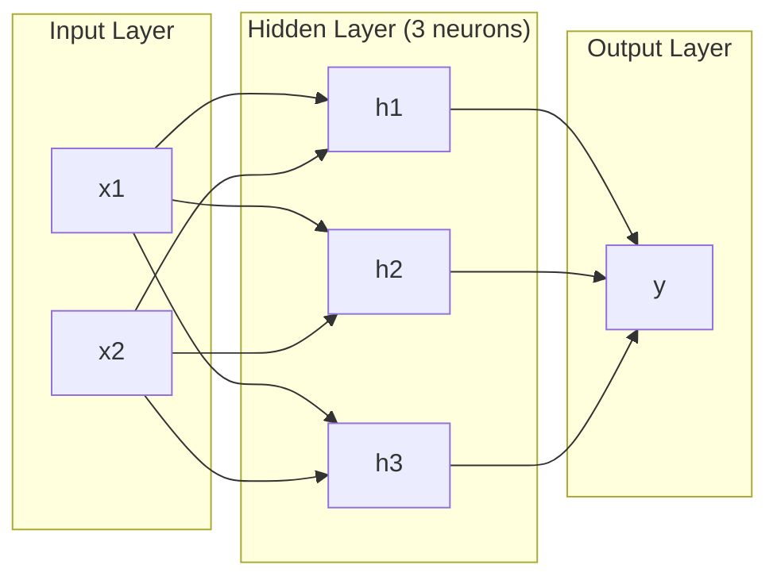
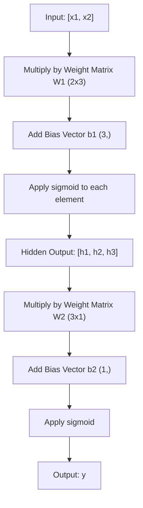
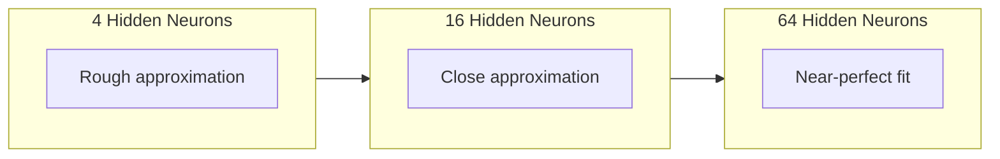

# Çok katmanlı ağlar ve ileri geçit

> Bir nöron bir çizgi çizer, onları yığar ve her şeyi çizersin.

**Type:** Build
**Languages:** Python
**Prerequisites:** Phase 01 (Math Foundations), Lesson 03.01 (The Perceptron)
**Time:** ~90 minutes

## Öğrenme Hedefleri

- Tam bir ileri geçiş yapan katman ve ağ sınıfları ile sıfırdan çok katmanlı bir ağ oluştur
- Bir ağın her katmanında iz matrisi boyutlarını takip edin ve şekil eşleşmemelerini belirleyin
- Hattı olmayan etkinleştirmeleri yığmanın bir ağın eğri karar sınırlarını nasıl öğrenmesini sağladığını açıklayın.
- El ayarlı sigmoid ağırlıkları ile 2-2-1 mimarisini kullanarak XOR sorunu çöz

## Sorun

Tek bir nöron bir çizgi çekmecesidir. Bu işte. Verilerinizi doğru bir çizgi ile geçirin. Yapay zeka'daki her gerçek sorun -- görüntü tanıma, dil anlama, Go oynamak -- eğrilik gerektirir. Nöronları katmanlara yığmak eğrilik elde etmenin bir yolu.

1969'da Minsky ve Papert bu sınırlamanın ölümcül olduğunu kanıtladı: tek katmanlı bir ağ XOR'u öğrenemez. "Öğrenmek için mücadele etmez" - matematiksel olarak olamaz. XOR gerçeklik tabloları bir tarafta [0,1] ve [1,0] yerleştirir, diğer tarafta [0,0] ve [1,1]. Onları hiçbir tek çizgi ayırmaz.

Bu, on yıldan uzun bir süre sinir ağlarının finansmanını durdurdu. Geriye bakıldığında çözüm açıkça görülüyordu: bir katman kullanmayı bırakın. Nöronları katmanlara yığın. Birinci katman giriş alanını yeni özelliklere kazınsın ve ikinci katmanın bu özellikleri tek bir satır bile yapamayacak kararlara birleştirmesine izin verin.

Bu yığın çok katmanlı ağ. Günümüzde üretilen tüm derin öğrenme modellerinin temelidir. Ön geçiş - gizlenmiş katmanlardan çıkışa giren veriler - başka bir şey çalışmadan önce inşa etmeniz gereken ilk şeydir.

## Anlaşım

### Katmanlar: Giriş, Gizli, Çıkış

Çok katmanlı bir ağ üç katman türüne sahiptir:

**Input layer**Bu bir katman değil. Bu sizin ham verilerinizi saklar. iki özellik iki giriş düğüm anlamına gelir. Burada hiçbir hesaplama yapılmıyor.

**Hidden layers**- işlerin gerçekleşmesi. Her nöron önceki katmandan her çıkışını alır, ağırlıkları ve bir tarafsızlığı uyguluyor, sonra da sonucu bir etkinleştirme fonksiyonu üzerinden geçer. "Geliştirilmiş" çünkü bu değerleri asla doğrudan eğitim verilerinde görmezsiniz.

**Output layer**- son cevabı. İkili sınıflandırma için, bir nöron sigmoid ile.



Bu bir 2-3-1 ağ. İki giriş, üç gizli nöron, bir çıkış. Her bağlantı ağırlık taşır. Her nöron ( giriş hariç) bir önyargı taşır.

Her katman gizli durum denilen bir rakam vektörü üretir. Metin için gizli durumlar boyutluluğu arttırır -- bir kelimeyi anlamlı anlamı yakalamak için 768 sayı olarak kodlar. Resimler için boyutluluğu azaltır -- milyonlarca pikselden oluşan yönetilebilir bir temsil oluşturur. Gizli durum öğrenmenin yaşadığı yerdir.

### Nöronlar ve Aktivasyonlar

Her nöron üç şey yapar:

1. Her girişini karşılıklı ağırlığı ile çarpın
2. Tüm ürünleri toplam ve bir önyargı ekleyin
3. Toplamı bir etkinleştirme fonksiyonu üzerinden geç

Şimdilik, etkinleştirme sigmoid:

```
sigmoid(z) = 1 / (1 + e^(-z))
```

Sigmoid herhangi bir sayıyı (0,1) aralığına sıfırlıyor. Büyük olumlu girişler 1. büyük negatif girişler 0.5'e doğru sıfır haritelerine doğru ilerliyor. Bu düz eğri öğrenmeyi mümkün kılan şey.

### Önceki Geçit: Verilerin Akışları

Ön geçiş, giriş verilerini ağ üzerinden katman katman olarak, çıkışa ulaşana kadar itirir. Ön geçiş sırasında hiçbir öğrenme gerçekleşmez. Saf hesaplama: katlay, ekle, etkinleştir, tekrarla.



Her katman, üç işlem sırayla gerçekleşir:

```
z = W * input + b       (linear transformation)
a = sigmoid(z)           (activation)
```

Bir katmanın çıkışı bir sonraki katmanın girişine dönüşür.

### Matrix Boyutları

Arkaplan boyutları derin öğrenmede en önemli defegleme becerisidir.

| Step | Operation | Dimensions | Result Shape |
|------|-----------|------------|-------------|
| Input | x | -- | (2,) |
| Hidden linear | W1 * x + b1 | W1: (3, 2), b1: (3,) | (3,) |
| Hidden activation | sigmoid(z1) | -- | (3,) |
| Output linear | W2 * h + b2 | W2: (1, 3), b2: (1,) | (1,) |
| Output activation | sigmoid(z2) | -- | (1,) |

Kural: katman k'deki ağırlık matrisi W'nin şekli vardır (neurons_in_layer_k, neurons_in_layer_k_minus_1). Satırlar mevcut katmanla eşleşir. sütunlar önceki katmanla eşleşir. Eğer şekiller sırayla gelmezse, bir hata vardır.

### Evrensel Yaklaşım Teoremi

1989'da George Cybenko olağanüstü bir şey kanıtladı: tek bir gizli katman ve yeterli nöronlu bir sinir ağı istedikleri herhangi bir kesinliğe herhangi bir sürekli fonksiyonu yaklaşabilir.

Bu, gizli bir katman her zaman en iyisi olduğu anlamına gelmez. Bu, mimarinin teorik olarak yeteneğine sahip olduğu anlamına gelir.

İçgüdü: Gizli katmandaki her nöron bir "bump" ya da özellik öğrenir. Doğru yerlere yerleştirilen yeterince bulup herhangi bir düz eğriyi yaklaşabilir. Daha fazla nöron, daha fazla bulup, daha iyi yaklaşılabilir.



### Dönüştürülebilirlik

Nöral ağlar yapılandırılabilir. Onları yığarak zincirleyebilir, paralel olarak çalıştırılabilir. Bir Whisper modeli ses işleme için bir kodlayıcı ağı ve metin oluşturmak için ayrı bir dekodör ağı kullanır. Modern LLM'ler sadece dekodördür. BERT sadece kodlayıcıdır. T5 kodlayıcı-dekodördür. Arsitektur seçeneği modelin ne yapabileceğini tanımlar.

```figure
mlp-forward
```

## Yapın

Temiz Python, hiç bir şey yok, her matris işlemini sıfırdan yazmış.

### Adım 1: Sigmoid Aktifleştirme

```python
import math

def sigmoid(x):
    x = max(-500.0, min(500.0, x))
    return 1.0 / (1.0 + math.exp(-x))
```

[500, 500]'e kadar olan sıkıştırıcı, aşırı akışın önlenmesini sağlar. `math.exp(500)`Büyük ama sınırlı.`math.exp(1000)`Sonsuzluk.

### Adım 2: Katman sınıfı

Derin öğrenme'de en önemli işlem matris çarpımı. Her katman, her dikkat başlığı, her ileri geçiş - aşağıya kadar matmuls. Bir doğrusal katman bir giriş vektörü alır, ağırlık matrisine çarpır ve bir önyargı vektörü ekler: y = Wx + b. Bu tek denklem sinir ağındaki hesaplamanın %90'ını oluşturur.

Bir katman bir ağırlık matrisi ve bir önyargı vektörü tutar. Önüne yönlendirme bir giriş vektörü alır ve etkin çıkışı iade eder.

```python
class Layer:
    def __init__(self, n_inputs, n_neurons, weights=None, biases=None):
        if weights is not None:
            self.weights = weights
        else:
            import random
            self.weights = [
                [random.uniform(-1, 1) for _ in range(n_inputs)]
                for _ in range(n_neurons)
            ]
        if biases is not None:
            self.biases = biases
        else:
            self.biases = [0.0] * n_neurons

    def forward(self, inputs):
        self.last_input = inputs
        self.last_output = []
        for neuron_idx in range(len(self.weights)):
            z = sum(
                w * x for w, x in zip(self.weights[neuron_idx], inputs)
            )
            z += self.biases[neuron_idx]
            self.last_output.append(sigmoid(z))
        return self.last_output
```

Ağırlık matrisi şekli vardır (n_neurons, n_inputs). Her satır tüm girişler boyunca bir nöronun ağırlıklarıdır. Ön metot nöronları üzerinden döngüler, ağırlanan toplam artı önyargıyı hesaplar, sigmoid uygulaır ve sonuçları toplar.

### Adım 3: Ağ Sınıfı

Bir ağ katmanların bir listesi. Ön geçiş onları zincirler: katman k çıkışı katman k + 1 olarak beslenir.

```python
class Network:
    def __init__(self, layers):
        self.layers = layers

    def forward(self, inputs):
        current = inputs
        for layer in self.layers:
            current = layer.forward(current)
        return current
```

Bu, tüm ileri geçiş. Dört çizgi mantık. Veriler içeri girer, her katman boyunca akıyor, diğer taraftan çıkar.

### Adım 4: Elle ayarlanmış ağırlıklar ile XOR

01. Dersde, OR, NAND ve AND algılayıcılarını birleştirerek XOR'u çözdük. Şimdi katman ve ağ sınıflarımızla aynı şeyi yapın. 2-2-1 mimarisi: iki giriş, iki gizli nöron, bir çıkış.

```python
hidden = Layer(
    n_inputs=2,
    n_neurons=2,
    weights=[[20.0, 20.0], [-20.0, -20.0]],
    biases=[-10.0, 30.0],
)

output = Layer(
    n_inputs=2,
    n_neurons=1,
    weights=[[20.0, 20.0]],
    biases=[-30.0],
)

xor_net = Network([hidden, output])

xor_data = [
    ([0, 0], 0),
    ([0, 1], 1),
    ([1, 0], 1),
    ([1, 1], 0),
]

for inputs, expected in xor_data:
    result = xor_net.forward(inputs)
    predicted = 1 if result[0] >= 0.5 else 0
    print(f"  {inputs} -> {result[0]:.6f} (rounded: {predicted}, expected: {expected})")
```

Büyük ağırlıklar (20, -20) sigmoid'i bir adım fonksiyonu gibi hareket ettirir. İlk gizli nöron OR'ya yakındır. İkinci NAND'e yakındır. Çıkış nöronu onları AND'e birleştirir, bu da XOR'dur.

### Adım 5: Çember sınıflandırması

Daha zor bir sorun: 2 boyutlu noktaları, köken merkezindeki 0.5 radiüsün içinde veya dışında bir dairede sınıflandırmak. Bu, tek bir algılayıcı için imkansız olan eğri bir karar sınırı gerektirir.

```python
import random
import math

random.seed(42)

data = []
for _ in range(200):
    x = random.uniform(-1, 1)
    y = random.uniform(-1, 1)
    label = 1 if (x * x + y * y) < 0.25 else 0
    data.append(([x, y], label))

circle_net = Network([
    Layer(n_inputs=2, n_neurons=8),
    Layer(n_inputs=8, n_neurons=1),
])
```

Bu da bir diğer şey. Bu da bir diğer şey. Bu da bir diğer şey. Bu da bir diğer şey.

```python
correct = 0
for inputs, expected in data:
    result = circle_net.forward(inputs)
    predicted = 1 if result[0] >= 0.5 else 0
    if predicted == expected:
        correct += 1

print(f"Accuracy with random weights: {correct}/{len(data)} ({100*correct/len(data):.1f}%)")
```

Rastgele ağırlıklar düşük doğruluk sağlar. Çoğu zaman çoğunluk sınıfını tahmin etmekten daha kötüdür. Eğitimden sonra (Denevi 03), bu aynı yapı 8 gizli nöronlu bir çizer.

## Kullan

PyTorch yukarıdaki her şeyi dört satırla yapar:

```python
import torch
import torch.nn as nn

model = nn.Sequential(
    nn.Linear(2, 8),
    nn.Sigmoid(),
    nn.Linear(8, 1),
    nn.Sigmoid(),
)

x = torch.tensor([[0.0, 0.0], [0.0, 1.0], [1.0, 0.0], [1.0, 1.0]])
output = model(x)
print(output)
```

`nn.Linear(2, 8)`katman sınıfınız: şekil ağırlık matrisi (8, 2), şekil eğilimi vektörü (8,). `nn.Sigmoid()`Sigmoid fonksiyonunuz element yönünde uygulanır.`nn.Sequential`Ağ sınıfınız: zincir katmanları sırasıyla.

PyTorch GPU'larda çalışır, milyonlarca numuneyi ele alır ve geri yayılma için otomatik olarak gradient hesaplar. Ama ileri geçiş mantığı sıfırdan inşa ettiğiniz ile aynıdır.

## Gönder

Bu ders, ağ mimarlıklarını tasarlamak için tekrar kullanılabilir bir ipucu üretir:

- `outputs/prompt-network-architect.md`

Bir sorun için kaç katman, her katman için kaç nöron ve hangi etkinleştirme fonksiyonunu kullanmanız gerektiğinde kullanın.

## Egzersizler

1. 2-4-2-1 ağı (iki gizli katman) oluşturun ve rastgele ağırlıklar ile XOR verilerine ileri geçiş çalıştırın.

2. Çember sınıflandırıcısındaki gizli katman boyutunu 8'den 2'ye değiştirin. Sonra 32. Her seferinde rastgele ağırlıklar ile ileri geçiş yapın. Gizli nöron sayısının çıkış aralığı veya dağılımını değiştirir mi? Neden?

3. A.`count_parameters`Network sınıfında toplam ağırlık ve tarafsızlık sayısını gönderen bir yöntem. 784-256-128-10 bir ağ üzerinde test edin (klasik MNIST mimarisi).

4. 3-4-4-2 ağı için bir ileri geçit oluşturun. RGB renk değerlerini (normalleştirilmiş 0-1) girin ve iki çıkışı gözlemleyin. Bu iki sınıflı basit bir renk sınıflandırıcısı için mimaridir.

5. Sigmoid'i "çıkışlı adım" işleviyle değiştirin: z < 0, z = 0.01 * z geri gönderin.

## Anahtar Terimler

| Term | What people say | What it actually means |
|------|----------------|----------------------|
| Forward pass | "Running the model" | Pushing input through every layer -- multiply by weights, add bias, activate -- to produce an output |
| Hidden layer | "The middle part" | Any layer between input and output whose values are not directly observed in the data |
| Multi-layer network | "A deep neural network" | Layers of neurons stacked sequentially, where each layer's output feeds the next layer's input |
| Activation function | "The nonlinearity" | A function applied after the linear transformation that introduces curves into the decision boundary |
| Sigmoid | "The S-curve" | sigma(z) = 1/(1+e^(-z)), squashes any real number to (0,1), smooth and differentiable everywhere |
| Weight matrix | "The parameters" | A matrix W of shape (current_layer_neurons, previous_layer_neurons) containing learnable connection strengths |
| Bias vector | "The offset" | A vector added after the matrix multiply that lets neurons activate even when all inputs are zero |
| Universal approximation | "Neural nets can learn anything" | A single hidden layer with enough neurons can approximate any continuous function -- but "enough" can mean billions |
| Linear transformation | "The matrix multiply step" | z = W * x + b, the computation before activation, which maps inputs to a new space |
| Decision boundary | "Where the classifier switches" | The surface in input space where the network output crosses the classification threshold |

## Daha Fazla Okumak

- Michael Nielsen, "Nöral ağlar ve derin öğrenme", Bölüm 1-2 (http://neuralnetworksanddeeplearning.com/) -- ileri geçişlerin ve ağ yapısının en açık açık açıklaması, etkileşimli görselleştirmeler ile
- Cybenko, "Sigmoidal Bir Fonksiyonun Süperpozisyonları ile Yaklaşması" (1989) - orijinal evrensel yaklaşım teoremi makalesi, şaşırtıcı derecede okuyabilir
- 3Blue1Brown, "Ama sinir ağı nedir?"https://www.youtube.com/watch?v=aircAruvnKk) -- 20 dakikalık görsel bir yürüyüş, katman, ağırlık ve ileri geçişler doğru zihinsel model oluşturur
- İyi arkadaş, Bengio, Courville, "Dikkatli Öğrenme", 6. bölüm (https://www.deeplearningbook.org/) -- Çok katmanlı ağlar için standart referans, ücretsiz çevrimiçi
