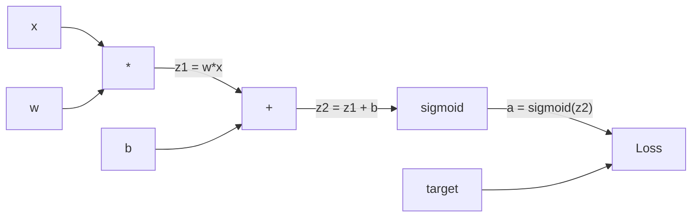
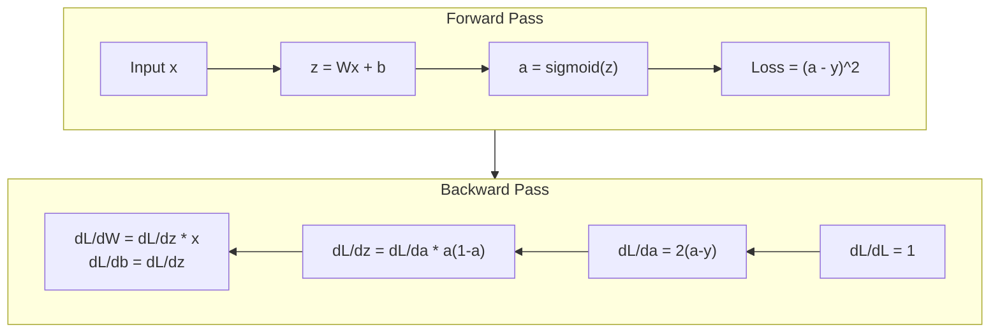
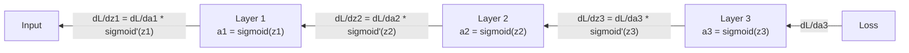

# İptalden Geriye Yayılma

> Geri yayılma öğrenmeyi mümkün kılan algoritmadır.

**Type:** Build
**Languages:** Python
**Prerequisites:** Lesson 03.02 (Multi-Layer Networks)
**Time:** ~120 minutes

## Öğrenme Hedefleri

- Bilgisayar grafikini oluşturan ve topolojik sıralama yoluyla gradientleri hesaplayan değer tabanlı bir otograd motoru uygulayın
- Zincir kuralını kullanarak ekleme, katılım ve sigmoid için geriye geçiş çıkar
- XOR ve çevreler sınıflandırması üzerinde çok katmanlı bir ağ eğitmek sadece sıfırdan geri yayılma motoru kullanarak
- Derin sigmoid ağlarda kaybolan gradient sorunu tespit edin ve gradientlerin neden eksponansiyel olarak küçüldüğünü açıklayın

## Sorun

Ağınızdaki gizli bir katman var. 768 giriş ve 3072 çıkış var. Bu 2.359.296 ağırlık. Yanlış bir tahmin yaptı. Hangi ağırlıklar hatayı neden etti? Her ağırlığı bireysel olarak test etmek 2.3 milyon ileri geçişi demektir. Geri yayılma tek bir geri geçişi içinde tüm 2.3 milyon gradient hesaplar. Bu bir optimizasyon değil. Bu eğitimlenebilir ve imkansız arasındaki fark.

Saçma yaklaşım: bir ağırlık al, onu küçük bir miktarla it, ileri geçiş tekrar çalış, kayıpın yükselmiş veya düşmüş olup olmadığını ölç. Bu size bu ağırlığın eğilimi verir. Şimdi bunu ağdaki her ağırlık için yapın. Binlerce eğitim adımıyla ve milyonlarca veri noktasıyla çoğaltın.

Geriye yayılma bunu çözüyor. Bir ileri geçiş, bir geri geçiş, tüm gradientler hesaplanmış. Hile, hesaplama kuralından gelen zincir kuralıdır, sistematik olarak bir hesaplama grafikine uygulanır. Bu derin öğrenmeyi pratik yapan algoritmadır.

## Anlaşım

### Ağlar için uygulanan zincir kuralı

Dönem 01, Ders 05'te zincir kuralını gördünüz. Hızlı bir şekilde özetle: eğer y = f(g(x) ise, dy/dx = f'(g(x)) * g'(x.

Bir sinir ağında, " zincir " girişten kayba kadar işlemlerin sırasıdır. Her katman ağırlık uyguluyor, tarafsızlıklar ekliyor, bir etkinleştirme üzerinden geçiyor. Kayıp işlevi son çıkışı hedefe karşılaştırır. Geri yayılma bu zinciri geriye doğru izler ve her işlemin hataya nasıl katkıda bulunduğunu hesaplar.

### Hesaplama Grafikleri

Her ileri geçiş bir grafik oluşturur. Her düğüm bir işlemdir (çıkartmak, eklemek, sigmoid). Her kenar ileri bir değer ve geriye bir eğilimi taşır.



Önceki geçiş: değerler soldan sağa akıyor. x ve w z1 = w*x elde eder. z2 elde etmek için b ekleyin. Sigmoid aktivasyonu a verir. Kayıp işlevi kullanarak a ile hedefi y ile karşılaştırın.

Geriye geç: gradientler sağdan sola akıyor. dL/da ile başlayın (aktifikasyonla kayıpların nasıl değişmesi). da/dz2 ile çarpın (sigmoid türev). Bu dL/dz2 verir. dL/dz2'ye bölün (dL/dz2'ye eşit olduğundan z2 = z1 + b) ve dL/dz1.

Grafdaki her düğümün geriye geçiş sırasında bir işi vardır: yukarıdan gelen eğilimi alın, yerel türevine çarpın ve aşağıya geçin.

### Önde Geriye



Ön geçit her orta değerleri saklar: z, a, her katman girişleri. Geri geçit gradientleri hesaplamak için bu kaydedilen değerlere ihtiyaç duyar. Bu, geri geçitlerin kalbindeki bellek-bilgisayar pazarlamasıdır.

### Bir Ağ İçin Geçici Akış

Üç katmanlı bir ağ için, her katman boyunca gradient zinciri:



Her katman, gradient sigmoid türevli tarafından çarpılır. Sigmoid türevli bir * (1 - a) olarak, maksimum 0.25'te (a = 0.5) çıkarılır.

### Kaybolan Değillikler

Bu, kaybolan gradient sorunu. Sigmoid, çıkışını 0 ile 1 arasında sıkıştırır. Doğrulanması her zaman 0.25'ten daha azdır.

```
sigmoid(z):     Output range [0, 1]
sigmoid'(z):    Max value 0.25 (at z = 0)

After 5 layers:   gradient * 0.25^5 = 0.001x original
After 10 layers:  gradient * 0.25^10 = 0.000001x original
```

Bu nedenle derin sigmoid ağları eğitmek neredeyse imkansızdır. Bu düzeltme - ReLU ve onun çeşitleri - Ders 04'ün konusu. Şimdilik, arka destek mükemmel şekilde çalışır. Sorun, neyle çalıştığını anlamaktır.

### İki katmanlı ağ için gradiyent çıkarmak

Giriş x, sigmoid ile gizli katman, sigmoid ile çıkış katman ve MSE kaybı ile bir ağ için beton matematik.

Ön geçit:
```
z1 = W1 * x + b1
a1 = sigmoid(z1)
z2 = W2 * a1 + b2
a2 = sigmoid(z2)
L = (a2 - y)^2
```

Geriye geçiş (çeşitli bir zincir kuralını adım adım uygulayarak):
```
dL/da2 = 2(a2 - y)
da2/dz2 = a2 * (1 - a2)
dL/dz2 = dL/da2 * da2/dz2 = 2(a2 - y) * a2 * (1 - a2)

dL/dW2 = dL/dz2 * a1
dL/db2 = dL/dz2

dL/da1 = dL/dz2 * W2
da1/dz1 = a1 * (1 - a1)
dL/dz1 = dL/da1 * da1/dz1

dL/dW1 = dL/dz1 * x
dL/db1 = dL/dz1
```

Her gradient kayıptan sonra gelen yerel türevlerin bir ürünüdür.

```figure
backprop-vanishing
```

## Yapın

### Adım 1: Değer düğümü

Hesaplamalarımızdaki her sayı bir Değer olur. Verilerini, gradientlerini ve nasıl yaratıldığını saklar (böylece gradientleri geriye doğru nasıl hesaplayacağını bilir).

```python
class Value:
    def __init__(self, data, children=(), op=''):
        self.data = data
        self.grad = 0.0
        self._backward = lambda: None
        self._children = set(children)
        self._op = op

    def __repr__(self):
        return f"Value(data={self.data:.4f}, grad={self.grad:.4f})"
```

Henüz gradient yok (0.0). Henüz geriye doğru işlevi yok (op).`_children`Bu değerleri hangi değerler ürettiğini izleyelim. Böylece grafikleri topolojik olarak sıralayabiliriz.

### İkinci Adım: Geriye dönük İşlemler

Her işlem yeni bir değer oluşturur ve gradientlerin nasıl geriye doğru akıştığını tanımlar.

```python
def __add__(self, other):
    other = other if isinstance(other, Value) else Value(other)
    out = Value(self.data + other.data, (self, other), '+')

    def _backward():
        self.grad += out.grad
        other.grad += out.grad

    out._backward = _backward
    return out

def __mul__(self, other):
    other = other if isinstance(other, Value) else Value(other)
    out = Value(self.data * other.data, (self, other), '*')

    def _backward():
        self.grad += other.data * out.grad
        other.grad += self.data * out.grad

    out._backward = _backward
    return out
```

Eklemek için: d(a+b)/da = 1, d(a+b)/db = 1. Yani her iki giriş de çıkışın gradiyentiyi doğrudan alır.

Karıştırma için: d(a*b)/da = b, d(a*b)/db = a. Her giriş diğerinin değerini çıkış gradiyentiyle çarpır.

- Evet .`+=`Bir değer birden fazla işlemde kullanılabilir.

### Adım 3: Sigmoid ve Kayıp

```python
import math

def sigmoid(self):
    x = self.data
    x = max(-500, min(500, x))
    s = 1.0 / (1.0 + math.exp(-x))
    out = Value(s, (self,), 'sigmoid')

    def _backward():
        self.grad += (s * (1 - s)) * out.grad

    out._backward = _backward
    return out
```

Sigmoid türev: sigmoid(x) * (1 - sigmoid(x)). Biz ileri geçiş sırasında sigmoid(x) = s hesapladık.

```python
def mse_loss(predicted, target):
    diff = predicted + Value(-target)
    return diff * diff
```

Tek bir çıkış için MSE: ( öngörülmüş - hedef) ^ 2. Kısıtlama, bir negatif değer ile bir ek olarak ifade edilir.

### Dördüncü Adım: Geriye Geç

Topolojik sınıflandırma, düğümleri doğru sırada işlemeyi sağlar. Bir düğümün gradiyenti, ondan yayılmadan önce tamamen toplanır.

```python
def backward(self):
    topo = []
    visited = set()

    def build_topo(v):
        if v not in visited:
            visited.add(v)
            for child in v._children:
                build_topo(child)
            topo.append(v)

    build_topo(self)
    self.grad = 1.0
    for v in reversed(topo):
        v._backward()
```

Kayıptan başlayın (gradient = 1.0, dL/dL = 1).`_backward`Çocuklarına doğru eğilimi zorlar.

### Adım 5: Katman ve ağ

```python
import random

class Neuron:
    def __init__(self, n_inputs):
        scale = (2.0 / n_inputs) ** 0.5
        self.weights = [Value(random.uniform(-scale, scale)) for _ in range(n_inputs)]
        self.bias = Value(0.0)

    def __call__(self, x):
        act = sum((wi * xi for wi, xi in zip(self.weights, x)), self.bias)
        return act.sigmoid()

    def parameters(self):
        return self.weights + [self.bias]


class Layer:
    def __init__(self, n_inputs, n_outputs):
        self.neurons = [Neuron(n_inputs) for _ in range(n_outputs)]

    def __call__(self, x):
        out = [n(x) for n in self.neurons]
        return out[0] if len(out) == 1 else out

    def parameters(self):
        params = []
        for n in self.neurons:
            params.extend(n.parameters())
        return params


class Network:
    def __init__(self, sizes):
        self.layers = []
        for i in range(len(sizes) - 1):
            self.layers.append(Layer(sizes[i], sizes[i + 1]))

    def __call__(self, x):
        for layer in self.layers:
            x = layer(x)
            if not isinstance(x, list):
                x = [x]
        return x[0] if len(x) == 1 else x

    def parameters(self):
        params = []
        for layer in self.layers:
            params.extend(layer.parameters())
        return params

    def zero_grad(self):
        for p in self.parameters():
            p.grad = 0.0
```

Bir nöron girişleri alır, ağırlıklı toplam + tarafsızlığı hesaplar ve sigmoid uyguluyor. Daha derin ağlarda sigmoid doymuşluğunun önlenmesi için kilo başlangıç ölçekleri sqrt(2/n_input) ile. Bir katman nöronların bir listesi. Bir ağ katmanların bir listesi.`parameters()`Metod, öğrenilebilir değerleri toplar böylece onları güncelleyebiliriz.

### Adım 6: XOR'da tren

```python
random.seed(42)
net = Network([2, 4, 1])

xor_data = [
    ([0.0, 0.0], 0.0),
    ([0.0, 1.0], 1.0),
    ([1.0, 0.0], 1.0),
    ([1.0, 1.0], 0.0),
]

learning_rate = 1.0

for epoch in range(1000):
    total_loss = Value(0.0)
    for inputs, target in xor_data:
        x = [Value(i) for i in inputs]
        pred = net(x)
        loss = mse_loss(pred, target)
        total_loss = total_loss + loss

    net.zero_grad()
    total_loss.backward()

    for p in net.parameters():
        p.data -= learning_rate * p.grad

    if epoch % 100 == 0:
        print(f"Epoch {epoch:4d} | Loss: {total_loss.data:.6f}")

print("\nXOR Results:")
for inputs, target in xor_data:
    x = [Value(i) for i in inputs]
    pred = net(x)
    print(f"  {inputs} -> {pred.data:.4f} (expected {target})")
```

Rastgele tahminlerden XOR çıkışlarını düzeltmeye kadar, tamamen geri yayılma bilgisayar gradientleri ve doğru yönde ağırlıkların itirilmesi ile yönlendirilir.

### Adım 7: Çember sınıflandırması

Ders 02, çember sınıflandırması için ağırlıkları elle ayarladınız.

```python
random.seed(7)

def generate_circle_data(n=100):
    data = []
    for _ in range(n):
        x1 = random.uniform(-1.5, 1.5)
        x2 = random.uniform(-1.5, 1.5)
        label = 1.0 if x1 * x1 + x2 * x2 < 1.0 else 0.0
        data.append(([x1, x2], label))
    return data

circle_data = generate_circle_data(80)

circle_net = Network([2, 8, 1])
learning_rate = 0.5

for epoch in range(2000):
    random.shuffle(circle_data)
    total_loss_val = 0.0
    for inputs, target in circle_data:
        x = [Value(i) for i in inputs]
        pred = circle_net(x)
        loss = mse_loss(pred, target)
        circle_net.zero_grad()
        loss.backward()
        for p in circle_net.parameters():
            p.data -= learning_rate * p.grad
        total_loss_val += loss.data

    if epoch % 200 == 0:
        correct = 0
        for inputs, target in circle_data:
            x = [Value(i) for i in inputs]
            pred = circle_net(x)
            predicted_class = 1.0 if pred.data > 0.5 else 0.0
            if predicted_class == target:
                correct += 1
        accuracy = correct / len(circle_data) * 100
        print(f"Epoch {epoch:4d} | Loss: {total_loss_val:.4f} | Accuracy: {accuracy:.1f}%")
```

Burada online SGD kullanıyoruz. Tüm partiyi toplamak yerine her örnekten sonra ağırlıkları güncelleyelim. Bu simetriyi daha hızlı bozar ve tüm kayıp manzarasında sigmoid doymuşluğu önler. Verileri her dönemle karıştırmak ağın sırayı ezberlemesini engeller.

Bu, arka planlama gücünün bir parçasıdır: mimari, kayıp fonksiyonu ve verileri tanımlarsınız.

## Kullan

PyTorch yukarıdaki her şeyi birkaç satırla yapar. Temel fikir aynıdır. Autograd ileri geçiş sırasında bir hesaplama grafiği oluşturur ve geriye doğru gradient hesaplamak için izler.

```python
import torch
import torch.nn as nn

model = nn.Sequential(
    nn.Linear(2, 4),
    nn.Sigmoid(),
    nn.Linear(4, 1),
    nn.Sigmoid(),
)
optimizer = torch.optim.SGD(model.parameters(), lr=1.0)
criterion = nn.MSELoss()

X = torch.tensor([[0,0],[0,1],[1,0],[1,1]], dtype=torch.float32)
y = torch.tensor([[0],[1],[1],[0]], dtype=torch.float32)

for epoch in range(1000):
    pred = model(X)
    loss = criterion(pred, y)
    optimizer.zero_grad()
    loss.backward()
    optimizer.step()

print("PyTorch XOR Results:")
with torch.no_grad():
    for i in range(4):
        pred = model(X[i])
        print(f"  {X[i].tolist()} -> {pred.item():.4f} (expected {y[i].item()})")
```

`loss.backward()`Senin mi ?`total_loss.backward()`- Evet .`optimizer.step()`Bu senin el kitabın mı?`p.data -= lr * p.grad`- Evet .`optimizer.zero_grad()`Senin mi ?`net.zero_grad()`PyTorch GPU hızlandırmasını, karışık hassaslığı, gradient kontrol noktasını ve yüzlerce katman türünü işliyor.

Eğitim ileri geçiş, sonra geri geçiş, sonra ağırlıkları güncelleştirir. İndirim sadece ileri geçiş yapar. - Ne de yükseltme, ne de güncelleme. Bu fark önemlidir çünkü sonuç üretimde olan şeydir. Claude veya GPT gibi bir API'yi aradığınızda, sonuç çıkarıyorsunuz. Cevap ağda ilerliyor ve tokenler diğer ucundan çıkıyor. Ağırlık değişmez. Arka tarafı anlamak önemlidir çünkü bu ağdaki her ağırlığı şekillendirdi.

## Gönder

Bu ders şunları ortaya çıkarır:
- `outputs/prompt-gradient-debugger.md`-- herhangi bir sinir ağında gradient sorunlarını (kayıp çıkmak, patlama, NaN) teşhis etmek için tekrar kullanılabilir bir istek.

## Egzersizler

1. Bir ekle`__sub__`Değer sınıfına (a - b = a + (-1 * b)).`__neg__`A - b) ^ 2 gibi basit bir ifade için manuel hesaplama ile karşılaştırarak gradientlerin doğru olduğunu kontrol edin.

2. Bir ekle`relu`Bu, bir simgelik olarak, bir simgelik olarak, bir simgelik olarak, bir simgelik olarak, bir simgelik olarak, bir simgelik olarak, bir simgelik olarak, bir simgelik olarak, bir simgelik olarak, bir simgelik olarak, bir simgelik olarak, bir simgelik olarak, bir simgelik olarak, bir simgelik olarak, bir simgelik olarak, bir simgelik olarak, bir simgelik olarak, bir simgelik olarak, bir simgelik olarak, bir simgelik olarak, bir simgelik olarak, bir simgelik olarak, bir simgelik olarak, bir simgelik olarak, bir simgelik olarak, bir simgelik olarak, bir simgelik olarak, bir simgelik olarak, bir simgelik olarak, bir simgelik hızını karşılaştırın.

3. A.`__pow__`Tam sayı güçleri için değer üzerinde yöntem.`mse_loss`- Evet.`(predicted - target) ** 2`Bu ifade, orijinal uygulamaya uygun olduğunu doğrula.

4. Eğitim döngüsüne gradient kesimi ekleyin: çağrıdan sonra `backward()`... tüm gradientleri [-1, 1'e] ayırın. Daha derin bir ağ (sigmoid ile 4+ katman) çalıştırın ve kayıp eğrilerini kesme ile ve kesmeden karşılaştırın. Bu patlama gradientlerine karşı ilk savunmanız.

5. Bir görselleştirme oluşturun: XOR üzerinde eğitim aldıktan sonra, ağdaki her parametrenin gradiyenti basın. En küçük gradiyenti olan katmanın kim olduğunu belirleyin. Bu, Konsep bölümünde okuduğunuz kaybolan gradiyenti sorunu gösterir.

## Anahtar Terimler

| Term | What people say | What it actually means |
|------|----------------|----------------------|
| Backpropagation | "The network learns" | An algorithm that computes dL/dw for every weight by applying the chain rule backward through the computational graph |
| Computational graph | "The network structure" | A directed acyclic graph where nodes are operations and edges carry values (forward) and gradients (backward) |
| Chain rule | "Multiply the derivatives" | If y = f(g(x)), then dy/dx = f'(g(x)) * g'(x) -- the mathematical foundation of backpropagation |
| Gradient | "The direction of steepest ascent" | The partial derivative of the loss with respect to a parameter -- tells you how to change that parameter to reduce the loss |
| Vanishing gradient | "Deep networks don't learn" | Gradients shrink exponentially as they propagate through layers with saturating activations like sigmoid |
| Forward pass | "Running the network" | Computing the output from inputs by sequentially applying each layer's operations and storing intermediate values |
| Backward pass | "Computing gradients" | Traversing the computational graph in reverse, accumulating gradients at each node using the chain rule |
| Learning rate | "How fast it learns" | A scalar that controls the step size when updating weights: w_new = w_old - lr * gradient |
| Topological sort | "The right order" | An ordering of graph nodes where each node appears after all nodes it depends on -- ensures gradients are fully accumulated before propagation |
| Autograd | "Automatic differentiation" | A system that builds computational graphs during forward computation and automatically computes gradients -- what PyTorch's engine does |

## Daha Fazla Okumak

- Rumelhart, Hinton & Williams, "Back-propagation errors" (1986) - Back-propagation mainstream ve kilitlenmemiş çok katmanlı ağ eğitimi yapan makale
- 3Blue1Brown, "Nöral Ağlar" serisi (https://www.youtube.com/playlist?list=PLZHQObOWTQDNU6R1_67000Dx_ZCJB-3pi) -- ağlardaki geri yayılma ve gradient akışının en iyi görsel açıklaması
