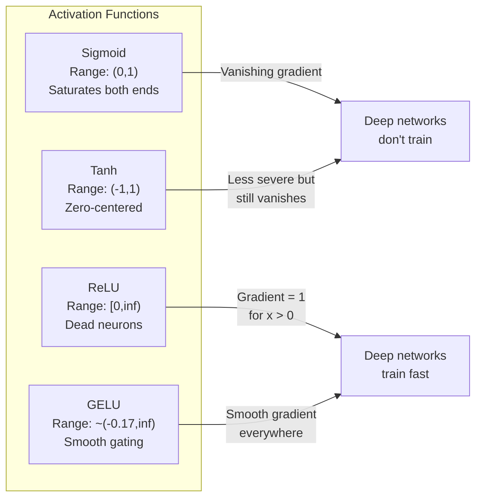
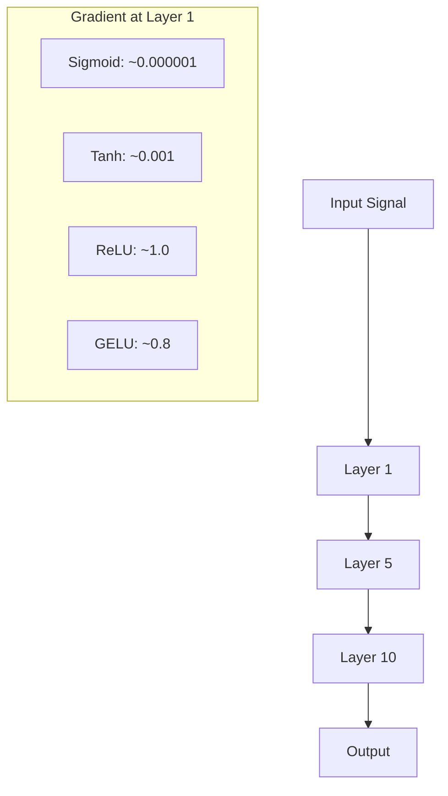
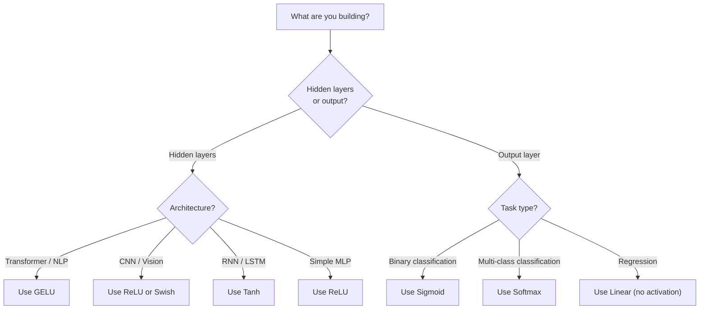

# Aktifleştirme Fonksiyonları

> Düzsel olmayan bir şey olmadan, 100 katlı ağınız, bir matris çarpımı gibi.

**Type:** Build
**Languages:** Python
**Prerequisites:** Lesson 03.03 (Backpropagation)
**Time:** ~75 minutes

## Öğrenme Hedefleri

- Sigmoid, tanh, ReLU, Leaky ReLU, GELU, Swish ve softmax'ı sıfırdan türevleri ile uygulayın
- Farklı aktivasyonlarla 10+ katman boyunca etkinlik büyüklüklerini ölçerek kaybolan gradient sorunu teşhis edin
- Bir ReLU ağındaki ölü nöronları tespit edin ve GELU ' nun bu başarısızlık modundan neden kaçınılmasını açıklayın .
- Verilmiş bir mimarlık için doğru etkinleştirme fonksiyonunu seçin (transformer, CNN, RNN, çıkış katmanı)

## Sorun

İki doğrusal dönüşüm y = W2 ((W1x + b1) + b2. Genişle: y = W2W1x + W2b1 + b2. Bu sadece y = Ax + c - tek bir doğrusal dönüşümdür. Ne kadar doğrusal katmanı yığarsanız, sonuç bir matris çarpması olarak çökür. 100 katlı ağınızın tek bir katla aynı temsil gücü vardır.

Bu teorik bir merak değil. Bu anlamı derin bir çizgisi ağı kelimenin tam anlamıyla XOR öğrenemez, bir spiral veri kümesini sınıflandıramaz, bir yüzü tanımamaktadır.

Aktiflik fonksiyonları çizgisini kırıyor. Her katmanın çıkışını çizgi olmayan bir fonksiyonla çarpıtırlar, ağın karar sınırlarını eğme, keyfi fonksiyonları yaklaşımlandırma ve aslında öğrenme yeteneğini verirler. Ama yanlış bir etkinleştirme seçerseniz gradiyensiniz sıfıra (deep networklerde sigmoid) kaybolur, sonsuzlukta patlar (yaklaşık bir başlangıç olmadan sınırsız etkinleştirmeler) veya nöronlarınız kalıcı olarak ölür (RELU büyük negatif önyargılarla). Aktifleştirme fonksiyonunun seçimi ağınızın öğrenmeyeceğini doğrudan belirler.

## Anlaşım

### Neden Düzgün Olmamalı

Matrix çarpımı bileşilebilir. Bir vektörü A ile çarpmak, sonra B ile çarpmak AB ile çarpmaya eşittir. Bu, 10 doğrusal katmanı yığmanın bir büyük matrisle bir doğrusal katmanın matematiksel olarak eşdeğer olduğunu gösterir. Tüm bu parametreler, tüm bu derinlik - boşa harcanmış. Zinciri kırmak için bir şeye ihtiyacınız var.

Bu kanıt. Bir doğrusal katman f ((x) = Wx + b hesaplar.

```
Layer 1: h = W1 * x + b1
Layer 2: y = W2 * h + b2
```

Yer değiştiren:

```
y = W2 * (W1 * x + b1) + b2
y = (W2 * W1) * x + (W2 * b1 + b2)
y = A * x + c
```

Bir katman. Katmanlar arasında bir çizgi olmayan aktivasyon g() ekleyin:

```
h = g(W1 * x + b1)
y = W2 * h + b2
```

Şimdi yerine getirme kesildi. W2 * g(W1 * x + b1) + b2 tek bir doğrusal dönüşümle azaltılamaz. Ağ doğrusal olmayan fonksiyonları temsil edebilir. Bir etkinleştirme ile her ek katman temsil kapasiteyi ekler.

### Sigmoid

Nöral ağlar için orijinal etkinleştirme fonksiyonu.

```
sigmoid(x) = 1 / (1 + e^(-x))
```

Çıktı aralığı: (0, 1). Düzgün, farklılaştırılabilir, herhangi bir gerçek sayıyı olasılık benzeri bir değere haritası yapar.

Derivat:

```
sigmoid'(x) = sigmoid(x) * (1 - sigmoid(x))
```

Bu türevin maksimum değeri 0,25'dir, x = 0'da meydana gelir. Geri yayılmada, gradientler katmanlar boyunca çoğalabilir.

```
0.25^10 = 0.000000953674
```

İlk sinyalin milyonda birinden azı. Bu kaybolan gradient sorunu. İlk katmanlarda gradientler o kadar küçük olur ki ağırlıklar neredeyse güncellenmez. Ağ öğrenir gibi görünüyor - daha sonraki katmanlarda kayıp azalır - ama ilk katmanlar donmuştur. Derin sigmoid ağlar sadece eğitim görmez.

Ek bir sorun: sigmoid çıkışlar her zaman pozitifdir (0 ila 1), bu da ağırlıklarda gradientlerin her zaman aynı işaret olduğunu gösterir.

### Tanh

Sigmoid'in merkezi versiyonu.

```
tanh(x) = (e^x - e^(-x)) / (e^x + e^(-x))
```

Çıktı aralığı: (-1, 1). Zıfır merkezli, bu da zig-zag sorunu ortadan kaldırır.

Derivat:

```
tanh'(x) = 1 - tanh(x)^2
```

Maksimum türev, x = 0'da 1.0'dur. Sigmoid'den dört kat daha iyidir. Ama kaybolan gradient sorunu hala var. Büyük olumlu veya negatif girişler için, türev sıfıra yaklaşır. On kat hala gradienti ezir, sadece daha az agresifce.

### ReLU: Önemli Bir Devam

Düzeltilmiş Hattı Birim. 2010'da Nair ve Hinton tarafından derin öğrenme için popülerleştirilmiştir (fonksiyonun kendisi Fukushima'nın 1969 çalışmalarına dayanıyor), her şeyi değiştirmiştir.

```
relu(x) = max(0, x)
```

Çıktı aralığı: [0, sonsuzluk).

```
relu'(x) = 1  if x > 0
            0  if x <= 0
```

Pozitif girişler için kaybolan bir gradient yok. gradient tam olarak 1, doğruca geçiyor. Bu yüzden derin ağlar çalışılabilir hale geldi. ReLU katmanlar boyunca gradient büyüklüğünü korur.

Ancak bir başarısızlık modudur: ölü nöron sorunu. Eğer bir nöronun ağırlıklı giriş her zaman negatifse (büyük bir negatif önyargı veya şanssız ağırlık başlangıcı nedeniyle), çıkışı her zaman sıfırdır, gradiyenti her zaman sıfırdır ve hiç güncellenmez. Kalıcı olarak ölüdür.

### Sızan ReLU

Ölü nöronlar için en basit çözüm.

```
leaky_relu(x) = x        if x > 0
                alpha * x if x <= 0
```

Alfa küçük bir sabit olduğu yerde, tipik olarak 0.01. Negatif tarafı sıfır yerine küçük bir eğilime sahiptir, bu yüzden ölü nöronlar hala bir gradient sinyali alır ve iyileşebilir.

### GELU: Modern Default

Gaussian Error Linear Unit. 2016 yılında Hendrycks ve Gimpel tarafından tanıtıldı. BERT, GPT ve çoğu modern transformörde öntanımlı etkinleştirme.

```
gelu(x) = x * Phi(x)
```

Phi ((x) standart normal dağılımın kumülatyonel dağılım fonksiyonu olduğu yerde.

```
gelu(x) ~= 0.5 * x * (1 + tanh(sqrt(2/pi) * (x + 0.044715 * x^3)))
```

GELU her yerde düzdür, küçük negatif değerlere izin verir (ReLU'dan farklı olarak sıfıra sabitleme yapar) ve olasılıklı bir yorumuna sahiptir: Gaussian dağılım altında ne kadar olumlu olması olasılığı ile her giriş ağırlaştırır. Bu düz kaplama, daha iyi bir gradient akışı sağladığı ve ölü nöron sorununu tamamen önlediği için transformatör mimarlıklarında ReLU'yu üst kat eder.

### Swish / SiLU

Ramachandran et al. tarafından 2017 yılında otomatik arama yoluyla keşfedilen kendi kendine kapalı etkinleştirme.

```
swish(x) = x * sigmoid(x)
```

Swish resmi olarak x * sigmoid ((x) olarak tanımlanır. Google bunu aktifleştirme fonksiyon alanındaki otomatik arama yoluyla keşfetti.

GELU gibi, düz, monoton olmayan ve küçük negatif değerlere izin verir. Fark hafif: Swish, kaplama için sigmoid kullanırken GELU Gaussian CDF kullanır.

### Softmax: Çıktı Aktivasyonu

Gizli katmanlarda kullanılmıyor. Softmax, ham puan vektörünü (logits) olasılık dağılımına dönüştürür.

```
softmax(x_i) = e^(x_i) / sum(e^(x_j) for all j)
```

Her çıkış 0 ile 1 arasında olur. Tüm çıkışlar toplamı 1'e çıkar. Bu da onu çok sınıf sınıflandırma için standart son etkinleştirme yapar. En büyük logit en yüksek olasılığı alır, ancak argmax'den farklı olarak softmax farklılaştırılabilir ve göreceli güvenle ilgili bilgileri korur.

### Şekillerin karşılaştırılması



### Aralıklı Akış Özetleme



### Hangi Aktifleşme



```figure
softmax-temperature
```

## Yapın

### Adım 1: Tüm aktive etme fonksiyonlarını türevlerle uygulayın

Her fonksiyon tek bir yüzen alır ve bir yüzen gönderir. Her türevli fonksiyon aynı giriş alır ve gradiyenti gönderir.

```python
import math

def sigmoid(x):
    x = max(-500, min(500, x))
    return 1.0 / (1.0 + math.exp(-x))

def sigmoid_derivative(x):
    s = sigmoid(x)
    return s * (1 - s)

def tanh_act(x):
    return math.tanh(x)

def tanh_derivative(x):
    t = math.tanh(x)
    return 1 - t * t

def relu(x):
    return max(0.0, x)

def relu_derivative(x):
    return 1.0 if x > 0 else 0.0

def leaky_relu(x, alpha=0.01):
    return x if x > 0 else alpha * x

def leaky_relu_derivative(x, alpha=0.01):
    return 1.0 if x > 0 else alpha

def gelu(x):
    return 0.5 * x * (1 + math.tanh(math.sqrt(2 / math.pi) * (x + 0.044715 * x ** 3)))

def gelu_derivative(x):
    phi = 0.5 * (1 + math.erf(x / math.sqrt(2)))
    pdf = math.exp(-0.5 * x * x) / math.sqrt(2 * math.pi)
    return phi + x * pdf

def swish(x):
    return x * sigmoid(x)

def swish_derivative(x):
    s = sigmoid(x)
    return s + x * s * (1 - s)

def softmax(xs):
    max_x = max(xs)
    exps = [math.exp(x - max_x) for x in xs]
    total = sum(exps)
    return [e / total for e in exps]
```

### İkinci Adım: Gradiyentlerin Nerede Öldüğünü Hayal Et

-5'ten 5'e kadar 100 eşit aralıklı noktada gradiyenti hesaplayın. Her aktivasyonun gradiyenti sıfıra yakın olduğunu gösteren bir metin histogramı yazdırın.

```python
def gradient_scan(name, derivative_fn, start=-5, end=5, n=100):
    step = (end - start) / n
    near_zero = 0
    healthy = 0
    for i in range(n):
        x = start + i * step
        g = derivative_fn(x)
        if abs(g) < 0.01:
            near_zero += 1
        else:
            healthy += 1
    pct_dead = near_zero / n * 100
    print(f"{name:15s}: {healthy:3d} healthy, {near_zero:3d} near-zero ({pct_dead:.0f}% dead zone)")

gradient_scan("Sigmoid", sigmoid_derivative)
gradient_scan("Tanh", tanh_derivative)
gradient_scan("ReLU", relu_derivative)
gradient_scan("Leaky ReLU", leaky_relu_derivative)
gradient_scan("GELU", gelu_derivative)
gradient_scan("Swish", swish_derivative)
```

### Üçüncü Adım: Yıkılan Gelişen Deneme

Sigmoid vs ReLU kullanarak sinyalleri N katmanlardan ileriye aktarın. Aktiflik büyüklüğünün nasıl değiştiğini ölçün.

```python
import random

def vanishing_gradient_experiment(activation_fn, name, n_layers=10, n_inputs=5):
    random.seed(42)
    values = [random.gauss(0, 1) for _ in range(n_inputs)]

    print(f"\n{name} through {n_layers} layers:")
    for layer in range(n_layers):
        weights = [random.gauss(0, 1) for _ in range(n_inputs)]
        z = sum(w * v for w, v in zip(weights, values))
        activated = activation_fn(z)
        magnitude = abs(activated)
        bar = "#" * int(magnitude * 20)
        print(f"  Layer {layer+1:2d}: magnitude = {magnitude:.6f} {bar}")
        values = [activated] * n_inputs

vanishing_gradient_experiment(sigmoid, "Sigmoid")
vanishing_gradient_experiment(relu, "ReLU")
vanishing_gradient_experiment(gelu, "GELU")
```

### 4. Adım: Ölü Nöron Detektörü

Bir ReLU ağı oluşturun, rastgele girişleri geçirin, kaç nöron ateş etmiyor sayın.

```python
def dead_neuron_detector(n_inputs=5, hidden_size=20, n_samples=1000):
    random.seed(0)
    weights = [[random.gauss(0, 1) for _ in range(n_inputs)] for _ in range(hidden_size)]
    biases = [random.gauss(0, 1) for _ in range(hidden_size)]

    fire_counts = [0] * hidden_size

    for _ in range(n_samples):
        inputs = [random.gauss(0, 1) for _ in range(n_inputs)]
        for neuron_idx in range(hidden_size):
            z = sum(w * x for w, x in zip(weights[neuron_idx], inputs)) + biases[neuron_idx]
            if relu(z) > 0:
                fire_counts[neuron_idx] += 1

    dead = sum(1 for c in fire_counts if c == 0)
    rarely_fire = sum(1 for c in fire_counts if 0 < c < n_samples * 0.05)
    healthy = hidden_size - dead - rarely_fire

    print(f"\nDead Neuron Report ({hidden_size} neurons, {n_samples} samples):")
    print(f"  Dead (never fired):     {dead}")
    print(f"  Barely alive (<5%):     {rarely_fire}")
    print(f"  Healthy:                {healthy}")
    print(f"  Dead neuron rate:       {dead/hidden_size*100:.1f}%")

    for i, c in enumerate(fire_counts):
        status = "DEAD" if c == 0 else "WEAK" if c < n_samples * 0.05 else "OK"
        bar = "#" * (c * 40 // n_samples)
        print(f"  Neuron {i:2d}: {c:4d}/{n_samples} fires [{status:4s}] {bar}")

dead_neuron_detector()
```

### Adım 5: Eğitim karşılaştırması - Sigmoid vs ReLU vs GELU

Çember veri kümesinde aynı iki katlı ağı (çemberin içindeki noktalar = sınıf 1, dışındaki noktalar = sınıf 0) üç farklı etkinleştirme ile çalıştırın.

```python
def make_circle_data(n=200, seed=42):
    random.seed(seed)
    data = []
    for _ in range(n):
        x = random.uniform(-2, 2)
        y = random.uniform(-2, 2)
        label = 1.0 if x * x + y * y < 1.5 else 0.0
        data.append(([x, y], label))
    return data


class ActivationNetwork:
    def __init__(self, activation_fn, activation_deriv, hidden_size=8, lr=0.1):
        random.seed(0)
        self.act = activation_fn
        self.act_d = activation_deriv
        self.lr = lr
        self.hidden_size = hidden_size

        self.w1 = [[random.gauss(0, 0.5) for _ in range(2)] for _ in range(hidden_size)]
        self.b1 = [0.0] * hidden_size
        self.w2 = [random.gauss(0, 0.5) for _ in range(hidden_size)]
        self.b2 = 0.0

    def forward(self, x):
        self.x = x
        self.z1 = []
        self.h = []
        for i in range(self.hidden_size):
            z = self.w1[i][0] * x[0] + self.w1[i][1] * x[1] + self.b1[i]
            self.z1.append(z)
            self.h.append(self.act(z))

        self.z2 = sum(self.w2[i] * self.h[i] for i in range(self.hidden_size)) + self.b2
        self.out = sigmoid(self.z2)
        return self.out

    def backward(self, target):
        error = self.out - target
        d_out = error * self.out * (1 - self.out)

        for i in range(self.hidden_size):
            d_h = d_out * self.w2[i] * self.act_d(self.z1[i])
            self.w2[i] -= self.lr * d_out * self.h[i]
            for j in range(2):
                self.w1[i][j] -= self.lr * d_h * self.x[j]
            self.b1[i] -= self.lr * d_h
        self.b2 -= self.lr * d_out

    def train(self, data, epochs=200):
        losses = []
        for epoch in range(epochs):
            total_loss = 0
            correct = 0
            for x, y in data:
                pred = self.forward(x)
                self.backward(y)
                total_loss += (pred - y) ** 2
                if (pred >= 0.5) == (y >= 0.5):
                    correct += 1
            avg_loss = total_loss / len(data)
            accuracy = correct / len(data) * 100
            losses.append(avg_loss)
            if epoch % 50 == 0 or epoch == epochs - 1:
                print(f"    Epoch {epoch:3d}: loss={avg_loss:.4f}, accuracy={accuracy:.1f}%")
        return losses


data = make_circle_data()

configs = [
    ("Sigmoid", sigmoid, sigmoid_derivative),
    ("ReLU", relu, relu_derivative),
    ("GELU", gelu, gelu_derivative),
]

results = {}
for name, act_fn, act_d_fn in configs:
    print(f"\n=== Training with {name} ===")
    net = ActivationNetwork(act_fn, act_d_fn, hidden_size=8, lr=0.1)
    losses = net.train(data, epochs=200)
    results[name] = losses

print("\n=== Final Loss Comparison ===")
for name, losses in results.items():
    print(f"  {name:10s}: start={losses[0]:.4f} -> end={losses[-1]:.4f} (improvement: {(1 - losses[-1]/losses[0])*100:.1f}%)")
```

## Kullan

PyTorch bunların hepsini hem fonksiyonel hem de modül formları olarak sunar:

```python
import torch
import torch.nn as nn
import torch.nn.functional as F

x = torch.randn(4, 10)

relu_out = F.relu(x)
gelu_out = F.gelu(x)
sigmoid_out = torch.sigmoid(x)
swish_out = F.silu(x)

logits = torch.randn(4, 5)
probs = F.softmax(logits, dim=1)

model = nn.Sequential(
    nn.Linear(10, 64),
    nn.GELU(),
    nn.Linear(64, 32),
    nn.GELU(),
    nn.Linear(32, 5),
)
```

Bir transformatörde gizli katmanlar: GELU. CNN'de gizli katmanlar: ReLU. Sınıflandırma için çıkış katmanı: softmax. Geri dönüş için çıkış katmanı: hiç (lineer). Muhtemelenlik için çıkış katmanı: sigmoid. İşte bu. Bu öntanımlılardan başlayın. Sadece kanıtınız olduğunda değiştirin.

RNN ve LSTM'ler gizli durum için tanh ve kapı için sigmoid kullanırlar, ama bugün sıfırdan inşa ediyorsanız, muhtemelen RNN'leri kullanmıyorsunuz. ReLU ağınızda nöronlar ölüyorsa, GELU'ya geçin.

## Gönder

Bu ders şunları ortaya çıkarır:
- `outputs/prompt-activation-selector.md`-- her bir mimarlık için doğru etkinleştirme fonksiyonunu seçmenize yardımcı olan tekrar kullanılabilir bir istek.

## Egzersizler

1. Negatif eğim alfa öğrenilebilir bir parametreden ibaret olan parametrik ReLU (PReLU) uygulayın.

2. Kayıp gradient deneyini 10 yerine 50 kat ile çalıştırın. Sigmoid, tanh, ReLU ve GELU için her kattaki büyüklüğü çizin.

3. ELU (Eksponansiyel Düzsel Birim) uygulamak: elu(x) = x > 0, alfa * (e^x - 1) x <= 0. Eğer ölü nöron oranını aynı ağdaki ReLU ile karşılaştırın.

4. Eğitim sırasında çalışacak bir "gradyen sağlığı monitörü" oluşturun: her dönem boyunca, her katmanın ortalama gradient büyüklüğünü hesaplayın.

5. Eğitim karşılaştırmasını değiştirerek, çember yerine Ders 01'den XOR veri kümesini kullanın. Hangi etkinlik XOR'da en hızlı bir şekilde birleşti? Bu neden çember sonuçlarından farklıdır?

## Anahtar Terimler

| Term | What people say | What it actually means |
|------|----------------|----------------------|
| Activation function | "The nonlinear part" | A function applied to each neuron's output that breaks linearity, enabling the network to learn nonlinear mappings |
| Vanishing gradient | "Gradients disappear in deep networks" | Gradients shrink exponentially through layers when the activation's derivative is less than 1, making early layers untrainable |
| Exploding gradient | "Gradients blow up" | Gradients grow exponentially through layers when the effective multiplier exceeds 1, causing unstable training |
| Dead neuron | "A neuron that stopped learning" | A ReLU neuron whose input is permanently negative, producing zero output and zero gradient |
| Sigmoid | "Squishes values to 0-1" | The logistic function 1/(1+e^-x), historically important but causes vanishing gradients in deep networks |
| ReLU | "Clips negatives to zero" | max(0, x) -- the activation that made deep learning practical by preserving gradient magnitude |
| GELU | "The transformer activation" | Gaussian Error Linear Unit, a smooth activation that weights inputs by their probability of being positive |
| Swish/SiLU | "Self-gated ReLU" | x * sigmoid(x), discovered through automated search, used in EfficientNet |
| Softmax | "Turns scores into probabilities" | Normalizes a vector of logits into a probability distribution where all values are in (0,1) and sum to 1 |
| Leaky ReLU | "ReLU that doesn't die" | max(alpha*x, x) where alpha is small (0.01), preventing dead neurons by allowing small negative gradients |
| Saturation | "The flat part of sigmoid" | Regions where an activation's derivative approaches zero, blocking gradient flow |
| Logit | "The raw score before softmax" | The unnormalized output of the final layer before applying softmax or sigmoid |

## Daha Fazla Okumak

- Nair & Hinton, "Düzeltilmiş Hattı Birimler Sınırlı Boltzmann Makineleri İyileştirir" (2010) - ReLU'yu tanıtan ve derin ağların eğitimini sağlayan makale
- Hendrycks & Gimpel, "Gaussian Error Linear Units (GELUs) " (2016) -- transformörler için varsayılan olan etkinleştirme fonksiyonunu tanıttı
- Ramachandran et al., "Aktifasyon Fonksiyonları Arama" (2017) -- Swish'i keşfetmek için otomatik arama kullanıldı, etkinleştirme tasarımı otomatik hale gelebileceğini gösterdi
- Glorot & Bengio, "Deep Feedforward sinir ağlarının eğitilmesi zorluğunu anlamak" (2010) - kaybolan / patlayan gradientleri teşhis eden ve Xavier başlangıç önerisi
- Goodfellow, Bengio, Courville, "Deep Learning" 6.3 (https://www.deeplearningbook.org/) -- Gizli birimlerin ve etkinleştirme işlevlerinin titiz bir şekilde işlenmesi
