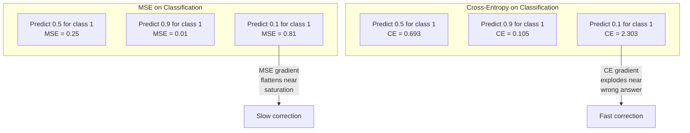
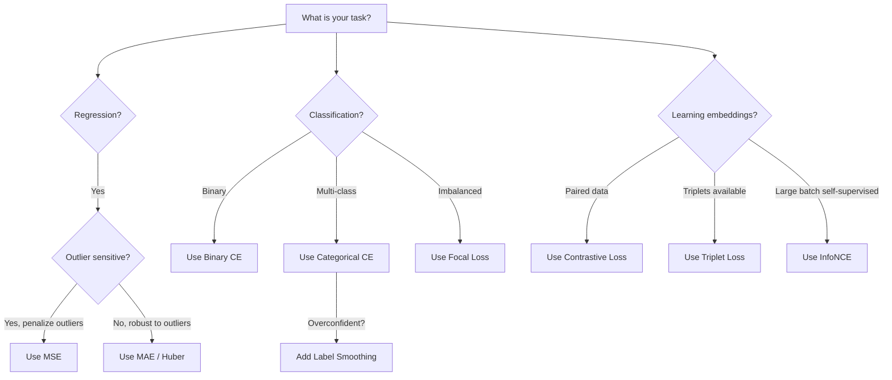
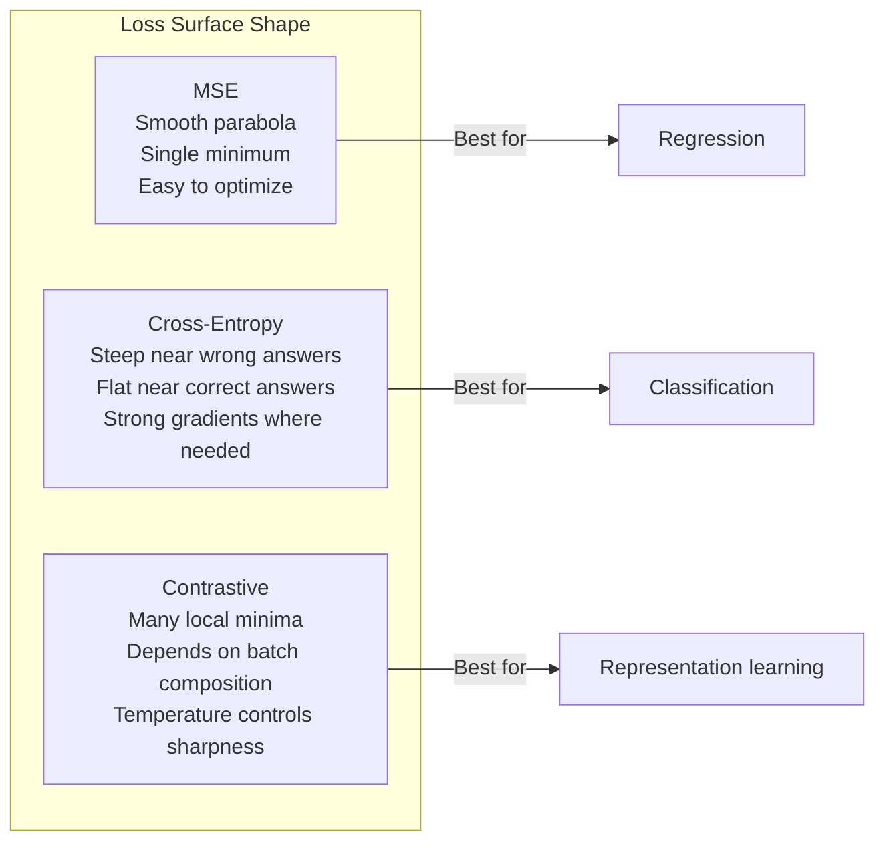

# Kayıp Fonksiyonları

> Ağınız bir tahmin yapar. Yer gerçekliği bunun aksini söyler. Ne kadar yanlış? Bu sayı kaybı. Yanlış kaybı işlevi seçin ve modeliniz tamamen yanlış şey için optimize eder.

**Type:** Build
**Languages:** Python
**Prerequisites:** Lesson 03.04 (Activation Functions)
**Time:** ~75 minutes

## Öğrenme Hedefleri

- MSE, ikili çapraz entropi, kategorik çapraz entropi ve kontrast kaybı (InfoNCE) sıfırdan kendi gradientleriyle uygulanmalıdır
- MSE'nin sınıflandırılmayı neden başarısız ettiğini, "her şey için tahmin 0.5" başarısızlık modunu göstererek açıklayın.
- Etiketleme düzeltmesini çapraz entropiye uygulayın ve aşırı güvenli tahminlerin nasıl önlendiğini açıklayın
- Regresiyon, ikili sınıflandırma, çoklu sınıflandırma ve öğrenme görevlerini yerleştirmek için doğru kayıp fonksiyonunu seçin

## Sorun

Bir sınıflandırma sorunu üzerinde MSE'yi en aza indirgenen bir model, her şey için güvenle 0.5 tahmin eder. Kayıpları en aza indirgenir.

Kayıp işlevi, modelinizin gerçekten optimize ettiği tek şeydir. Kesinlik yok. F1 puanı değil. Yöneticine rapor ettiğin herhangi bir metrik değil. Optimizer kayb fonksiyonunun gradiyentiyi alır ve bu sayıyı daha küçük hale getirmek için ağırlıkları ayarlar. Kayıp işlevi önemsediğiniz şeyi yakalamıyorsa, model matematik açısından onu tatmin etmenin en ucuz yolunu bulacaktır ve bu yol neredeyse asla istediğiniz şey değildir.

İşte bir örnek. İkili sınıflandırma görevin var. İki sınıf, 50/50 bölünmüş. Kaybın olarak MSE kullanıyorsun. Modeldeki her giriş için 0.5 öngörülüyor. Ortalama MSE 0.25'dir. Bu, hiçbir şey öğrenmeden mümkün olan en az. Model sıfır ayrımcılık yeteneğine sahip ama teknik olarak kaybı fonksiyonunuzu en aza indirmiştir. Çarpıcı entropiye geçin ve aynı model tahminleri 0 veya 1'e doğru itmek zorunda kalır çünkü -log(0.5) = 0.693 korkunç bir kayıp, -log(0.99) = 0.01 doğru tahminlere güvenen ödüller. Kayıp fonksiyonunun seçimi, öğrenen bir model ile metrik oynayan bir model arasındaki farktır.

Daha da kötüleşir. Kendini denetleyen öğrenmede etiketlerin bile bulunmuyor. Kontrast kaybı öğrenme sinyalleri tamamen tanımlar: ne benzer, ne farklı sayılır ve model onları ne kadar zorlukla birbirinden ayırmalı. Kontrast kaybı yanlış elde eder ve yerleşimleriniz tek bir noktaya çökür - her giriş haritası aynı vektöre. Teknik olarak sıfır kaybı. Tamamen değersiz.

## Anlaşım

### Ortalama Karakter Hata (MSE)

Geri dönüş için varsayılan. Tahmin ve hedef arasındaki kareden farkı hesaplayın, tüm örnekler üzerinde ortalama.

```
MSE = (1/n) * sum((y_pred - y_true)^2)
```

Neden karıştırmak önemlidir: büyük hataları karadrat olarak cezalandırır. 2'nin bir hatası 1'in bir hatası kadar 4 kat pahalı. 10'un bir hatası 100 kat pahalı. Bu da MSE'yi dış değerlere karşı hassas hale getirir.

Gerçek rakamlar: Eğer modeliniz konut fiyatlarını tahmin ederse ve $10,000 on most houses but off by $Bir sarayda 200.000, MSE saldırganca bu bir sarayı düzeltmeye çalışacak. Diğer 99 evin performansını etkileyebilir.

Bir tahminle ilgili MSE'nin eğilimi:

```
dMSE/dy_pred = (2/n) * (y_pred - y_true)
```

Hatada doğrusal. Büyük hatalar daha büyük gradientler elde eder. Bu bir gerileme özelliği (büyük hatalar büyük düzeltmeler gerektirir) ve sınıflandırma için bir hata (güvenli yanlış cevapları doğrusal değil, eksponensel olarak cezalandırmak istiyorsunuz).

### Çaplak Entropi Kayıpları

Klasifikasyon için kayıp fonksiyonu. Bilgi teorisi'nde kök salmış -- tahmin edilen olasılık dağılımıyla gerçek dağılım arasındaki ayrımı ölçüyor.

**Binary Cross-Entropy (BCE):**

```
BCE = -(y * log(p) + (1 - y) * log(1 - p))
```

Burada y gerçek etiket (0 veya 1) ve p öngörülen olasılık.

-log(p) neden işe yarıyor: gerçek etiket 1 olduğunda ve p = 0.99 olduğunu tahmin ettiğinizde, kaybı -log(0.99) = 0.01 olur.

Bu eğilimi aynı hikayeyi anlatıyor:

```
dBCE/dp = -(y/p) + (1-y)/(1-p)
```

Y = 1 ve p sıfıra yakın olduğunda, gradient -1/p'dir ve bu da negatif sonsuzluğu yaklaşır. Modelle hatalarını düzeltmek için muazzam bir sinyal verilir. p 1'e yakın olduğunda gradient küçüktür.

**Categorical Cross-Entropy:**

Tek sıcak kodlanmış hedeflerle çoklu sınıflandırma için.

```
CCE = -sum(y_i * log(p_i))
```

Sadece gerçek sınıf kaybına katkıda bulunur (çünkü diğer tüm y_i sıfırdır). Eğer 10 sınıf varsa ve doğru sınıf 0.1 olasılığı alırsa (hassasi tahmin), kaybı -log(0.1) = 2.3. Doğru sınıf 0.9 olasılığı alırsa, kaybı -log(0.9) = 0.105.

### MSE'nin sınıflandırılmamasının nedeni



MSE gradiyentiler, tahminlerin 0 veya 1 yakın olduğu zaman düzlenir (sigmoid doymuşluğu nedeniyle).

### Etiket Düzeltme

Standart bir sıcak etiketler "Bu %100 sınıf 3 ve %0 diğer her şey". diyor.

```
smooth_label = (1 - alpha) * one_hot + alpha / num_classes
```

Alfa = 0,1 ve 10 sınıfları ile: [0, 0, 1, 0, ...] yerine hedef [0, 01, 0.01, 0.91, 0.01, ...] olur.

Bu neden işe yarıyor: tam olarak 1.0'u softmax üzerinden çıkartmaya çalışan bir model logitleri sonsuzluğa doğru itmek zorunda. Bu aşırı güven neden olur, genelleşmeyi incitir ve modelin dağılım kayması için kırılgan hale gelir. Etiket düzeltme hedefi 0.9'a (alfa = 0.1) kapatır, logitleri makul bir aralığında tutar. GPT ve çoğu modern model etiket düzeltmesini veya eşdeğerini kullanır.

### Karşılıklı Kayıp

Etiketler yok, sınıflar yok, sadece giriş çiftleri ve soru: bunlar birbirine benzer mi yoksa farklı mı?

**SimCLR-style contrastive loss (NT-Xent / InfoNCE):**

Bir görüntü alın. İki artı görüntü oluşturun (çırpın, döndürün, renk kaygısı). Bunlar "pozitif çift"lerdir - benzer yerleşimlere sahip olmalıdırlar.

```
L = -log(exp(sim(z_i, z_j) / tau) / sum(exp(sim(z_i, z_k) / tau)))
```

Sim() kozin benzerliği olduğu yerde, z_i ve z_j pozitif çiftlerdir, toplam tüm negatiflerin üzerinde ve tau (temperatür) dağılımın ne kadar keskin olduğunu kontrol eder.

Gerçek sayılar: parti boyutu 256 pozitif çift başına 255 negatif anlamına gelir. Temperatür tau = 0.07 (SimCLR varsayılan). Kayıp benzerliklere karşı yumuşak bir maksimum gibi görünüyor - pozitif çiftin benzerliği tüm 256 seçenek arasında en yüksek olmasını istiyor.

**Triplet Loss:**

Üç giriş alır: demir, pozitif (aynı sınıf), negatif (farklı sınıf).

```
L = max(0, d(anchor, positive) - d(anchor, negative) + margin)
```

Marj (genellikle 0.2-1.0) pozitif ve negatif mesafeler arasında minimum bir boşluk zorlar. Negatif yeterince uzakta ise, kayıp sıfırdır - hiçbir gradient, hiçbir güncelleme yoktur. Bu eğitimleri verimli yapar, ancak dikkatli üçlü madencilik gerektirir (ankre yakın olan sert negatifleri seçmek).

### Göz Kayıpları

Düzsel olmayan veri kümeleri için. Standart çapraz entropi tüm doğru sınıflandırılmış örneklere eşit şekilde davranır.

```
FL = -alpha * (1 - p_t)^gamma * log(p_t)
```

P_t gerçek sınıfın öngörülen olasılık olduğu ve gamma odaklanmayı kontrol ettiği yerde. gamma = 0, bu standart çapraz entropi. gamma = 2 (devayla):

- Basit örnek (p_t = 0,9): ağırlık = (0,1) ^ 2 = 0,01. Etkili olarak göz ardı edildi.
- Sert örnek (p_t = 0.1): ağırlık = (0.9) ^ 2 = 0.81. Tam gradient sinyali.

Lin ve diğerleri tarafından hedef kaybı, nesnelerin tespit edilmesi için kullanılmıştır. Bu durumda, aday bölgelerin %99'u arka plan (sadece negatif) olarak kullanılır.

### Kayıp Fonksiyon Karar Ağacı



### Kayıp Çevre



```figure
cross-entropy-loss
```

## Yapın

### Adım 1: MSE ve Gradiyenti

```python
def mse(predictions, targets):
    n = len(predictions)
    total = 0.0
    for p, t in zip(predictions, targets):
        total += (p - t) ** 2
    return total / n

def mse_gradient(predictions, targets):
    n = len(predictions)
    grads = []
    for p, t in zip(predictions, targets):
        grads.append(2.0 * (p - t) / n)
    return grads
```

### Adım 2: İkili çapraz entropiyası

log(0) sorunu gerçek. Eğer model pozitif bir örnek için tam olarak 0'yu öngörürse, log(0) = negatif sonsuzluk.

```python
import math

def binary_cross_entropy(predictions, targets, eps=1e-15):
    n = len(predictions)
    total = 0.0
    for p, t in zip(predictions, targets):
        p_clipped = max(eps, min(1 - eps, p))
        total += -(t * math.log(p_clipped) + (1 - t) * math.log(1 - p_clipped))
    return total / n

def bce_gradient(predictions, targets, eps=1e-15):
    grads = []
    for p, t in zip(predictions, targets):
        p_clipped = max(eps, min(1 - eps, p))
        grads.append(-(t / p_clipped) + (1 - t) / (1 - p_clipped))
    return grads
```

### Adım 3: Softmax ile Kategorik çapraz entropiy

Softmax, çiğ logitleri olasılıklara dönüştürür sonra da tek sıcak hedeflere karşı çapraz entropi hesaplarız.

```python
def softmax(logits):
    max_val = max(logits)
    exps = [math.exp(x - max_val) for x in logits]
    total = sum(exps)
    return [e / total for e in exps]

def categorical_cross_entropy(logits, target_index, eps=1e-15):
    probs = softmax(logits)
    p = max(eps, probs[target_index])
    return -math.log(p)

def cce_gradient(logits, target_index):
    probs = softmax(logits)
    grads = list(probs)
    grads[target_index] -= 1.0
    return grads
```

Softmax + çapraz entropi gradiyenti güzel bir şekilde basitleştiriyor: sadece gerçek sınıf için ( öngörülen olasılık - 1) ve diğer tüm sınıflar için ( öngörülen olasılık). Bu zarif basitleştirme tesadüf değil - bu yüzden softmax ve çapraz entropi çiftleştirilmiştir.

### Dördüncü Adım: Etiket Düzeltme

```python
def label_smoothed_cce(logits, target_index, num_classes, alpha=0.1, eps=1e-15):
    probs = softmax(logits)
    loss = 0.0
    for i in range(num_classes):
        if i == target_index:
            smooth_target = 1.0 - alpha + alpha / num_classes
        else:
            smooth_target = alpha / num_classes
        p = max(eps, probs[i])
        loss += -smooth_target * math.log(p)
    return loss
```

### Adım 5: Kontrast Kayıp (Simplified InfoNCE)

```python
def cosine_similarity(a, b):
    dot = sum(x * y for x, y in zip(a, b))
    norm_a = math.sqrt(sum(x * x for x in a))
    norm_b = math.sqrt(sum(x * x for x in b))
    if norm_a < 1e-10 or norm_b < 1e-10:
        return 0.0
    return dot / (norm_a * norm_b)

def contrastive_loss(anchor, positive, negatives, temperature=0.07):
    sim_pos = cosine_similarity(anchor, positive) / temperature
    sim_negs = [cosine_similarity(anchor, neg) / temperature for neg in negatives]

    max_sim = max(sim_pos, max(sim_negs)) if sim_negs else sim_pos
    exp_pos = math.exp(sim_pos - max_sim)
    exp_negs = [math.exp(s - max_sim) for s in sim_negs]
    total_exp = exp_pos + sum(exp_negs)

    return -math.log(max(1e-15, exp_pos / total_exp))
```

### Adım 6: Sınıflandırma konusunda MSE vs. Çelişkili Entropi

Aynı ağı ders 04'ten (daha fazla veri) iki kayıp işlevi ile çalıştırın.

```python
import random

def sigmoid(x):
    x = max(-500, min(500, x))
    return 1.0 / (1.0 + math.exp(-x))

def make_circle_data(n=200, seed=42):
    random.seed(seed)
    data = []
    for _ in range(n):
        x = random.uniform(-2, 2)
        y = random.uniform(-2, 2)
        label = 1.0 if x * x + y * y < 1.5 else 0.0
        data.append(([x, y], label))
    return data


class LossComparisonNetwork:
    def __init__(self, loss_type="bce", hidden_size=8, lr=0.1):
        random.seed(0)
        self.loss_type = loss_type
        self.lr = lr
        self.hidden_size = hidden_size

        self.w1 = [[random.gauss(0, 0.5) for _ in range(2)] for _ in range(hidden_size)]
        self.b1 = [0.0] * hidden_size
        self.w2 = [random.gauss(0, 0.5) for _ in range(hidden_size)]
        self.b2 = 0.0

    def forward(self, x):
        self.x = x
        self.z1 = []
        self.h = []
        for i in range(self.hidden_size):
            z = self.w1[i][0] * x[0] + self.w1[i][1] * x[1] + self.b1[i]
            self.z1.append(z)
            self.h.append(max(0.0, z))

        self.z2 = sum(self.w2[i] * self.h[i] for i in range(self.hidden_size)) + self.b2
        self.out = sigmoid(self.z2)
        return self.out

    def backward(self, target):
        if self.loss_type == "mse":
            d_loss = 2.0 * (self.out - target)
        else:
            eps = 1e-15
            p = max(eps, min(1 - eps, self.out))
            d_loss = -(target / p) + (1 - target) / (1 - p)

        d_sigmoid = self.out * (1 - self.out)
        d_out = d_loss * d_sigmoid

        for i in range(self.hidden_size):
            d_relu = 1.0 if self.z1[i] > 0 else 0.0
            d_h = d_out * self.w2[i] * d_relu
            self.w2[i] -= self.lr * d_out * self.h[i]
            for j in range(2):
                self.w1[i][j] -= self.lr * d_h * self.x[j]
            self.b1[i] -= self.lr * d_h
        self.b2 -= self.lr * d_out

    def compute_loss(self, pred, target):
        if self.loss_type == "mse":
            return (pred - target) ** 2
        else:
            eps = 1e-15
            p = max(eps, min(1 - eps, pred))
            return -(target * math.log(p) + (1 - target) * math.log(1 - p))

    def train(self, data, epochs=200):
        losses = []
        for epoch in range(epochs):
            total_loss = 0.0
            correct = 0
            for x, y in data:
                pred = self.forward(x)
                self.backward(y)
                total_loss += self.compute_loss(pred, y)
                if (pred >= 0.5) == (y >= 0.5):
                    correct += 1
            avg_loss = total_loss / len(data)
            accuracy = correct / len(data) * 100
            losses.append((avg_loss, accuracy))
            if epoch % 50 == 0 or epoch == epochs - 1:
                print(f"    Epoch {epoch:3d}: loss={avg_loss:.4f}, accuracy={accuracy:.1f}%")
        return losses
```

## Kullan

PyTorch, tüm standart kayb fonksiyonlarını sayısal istikrarla oluşturuyor:

```python
import torch
import torch.nn as nn
import torch.nn.functional as F

predictions = torch.tensor([0.9, 0.1, 0.7], requires_grad=True)
targets = torch.tensor([1.0, 0.0, 1.0])

mse_loss = F.mse_loss(predictions, targets)
bce_loss = F.binary_cross_entropy(predictions, targets)

logits = torch.randn(4, 10)
labels = torch.tensor([3, 7, 1, 9])
ce_loss = F.cross_entropy(logits, labels)
ce_smooth = F.cross_entropy(logits, labels, label_smoothing=0.1)
```

Kullanım`F.cross_entropy`(Hayır)`F.nll_loss`Bu, log-softmax ve negatif log- olasılıklarını bir sayısal olarak sabit işlemde birleştirir.

Karşıtlıklı öğrenme için, çoğu ekip özel uygulamalar veya kütüphaneler kullanır.`lightly`veya `pytorch-metric-learning`.Küresel döngü her zaman aynıdır: çiftlik benzerlikleri hesaplayın, olumlu ve olumsuz üzerinde yumuşak maksimum oluşturun, geri yayılın.

## Gönder

Bu ders şunları ortaya çıkarır:
- `outputs/prompt-loss-function-selector.md`-- doğru kayıp fonksiyonunu seçmek için tekrar kullanılabilir bir ipucu
- `outputs/prompt-loss-debugger.md`- Kayıp eğri yanlış görünse , teşhis için bir ipucu .

## Egzersizler

1. Küçük hatalar için MSE ve büyük hatalar için MAE olan Huber kaybını uygulayın. Y = sin(x'i tahmin eden bir gerileme ağı eğitmek için MSE vs Huber ile eğitim hedeflerinin% 5'inin rastgele gürültü eklendiği zaman (outliers) çalıştırın.

2. İkili sınıflandırma eğitim döngüsüne odak kaybını ekleyin. Dengezsiz bir veri kümesi oluşturun (90% sınıf 0, 10% sınıf 1). 200 dönemden sonra azınlık sınıfı geri çağırışında standart BCE vs. odak kaybı (gamma=2) karşılaştırın.

3. Yarım sert negatif madencilik ile üçlü kaybı uygulayın. 5 sınıf için 2D gömleme verileri oluşturun. Her bir demir için, pozitifden daha uzak olan en sert negatif bulun.

4. MSE vs. çapraz entropi karşılaştırmasını çalıştırın, ancak eğitim sırasında her katmandaki gradient büyüklüklerini izleyin.

5. KL farklılık kaybını uygulayın ve KL(gerçek olarak tahmin edilen) KL'yi en aza indirmenin gerçek dağılım bir sıcak olduğunda çapraz entropi ile aynı gradientler verdiğini kontrol edin.

## Anahtar Terimler

| Term | What people say | What it actually means |
|------|----------------|----------------------|
| Loss function | "How wrong the model is" | A differentiable function mapping predictions and targets to a scalar that the optimizer minimizes |
| MSE | "Average squared error" | Mean of squared differences between predictions and targets; penalizes large errors quadratically |
| Cross-entropy | "The classification loss" | Measures divergence between predicted probability distribution and true distribution using -log(p) |
| Binary cross-entropy | "BCE" | Cross-entropy for two classes: -(y*log(p) + (1-y)*log(1-p)) |
| Label smoothing | "Softening the targets" | Replacing hard 0/1 targets with soft values (e.g., 0.1/0.9) to prevent overconfidence and improve generalization |
| Contrastive loss | "Pull together, push apart" | A loss that learns representations by making similar pairs close and dissimilar pairs far in embedding space |
| InfoNCE | "The CLIP/SimCLR loss" | Normalized temperature-scaled cross-entropy over similarity scores; treats contrastive learning as classification |
| Focal loss | "The imbalanced data fix" | Cross-entropy weighted by (1-p_t)^gamma to down-weight easy examples and focus on hard ones |
| Triplet loss | "Anchor-positive-negative" | Pushes anchor closer to positive than negative by at least a margin in embedding space |
| Temperature | "Sharpness knob" | A scalar divisor on logits/similarities that controls how peaked the resulting distribution is; lower = sharper |

## Daha Fazla Okumak

- Lin et al., "Dense Object Deteksiyonu için odak kaybı" (2017) -- nesne tespitinde aşırı sınıf dengesizliğini ele almak için odak kaybı tanıtıldı (RetinaNet)
- Chen et al., "Vizual Temsillerin Kontrastlı Öğrenmesi için Basit Bir Çerçeve" (SimCLR, 2020) -- NT-Xent kaybı ile modern kontrastlı öğrenme borusunu tanımladı
- Szegedy et al., "Inception Architecture'ı Yeniden Düşünmek" (2016) -- etiket düzeltmesini düzenleme tekniği olarak tanıttı, şimdi çoğu büyük modelde standart
- Hinton et al., "Neural Ağdaki Bilgiyi Destile etmek" (2015) -- Yumuşak hedefler kullanarak bilgi destilasyonu ve KL farklılığı, model sıkıştırma için temel
