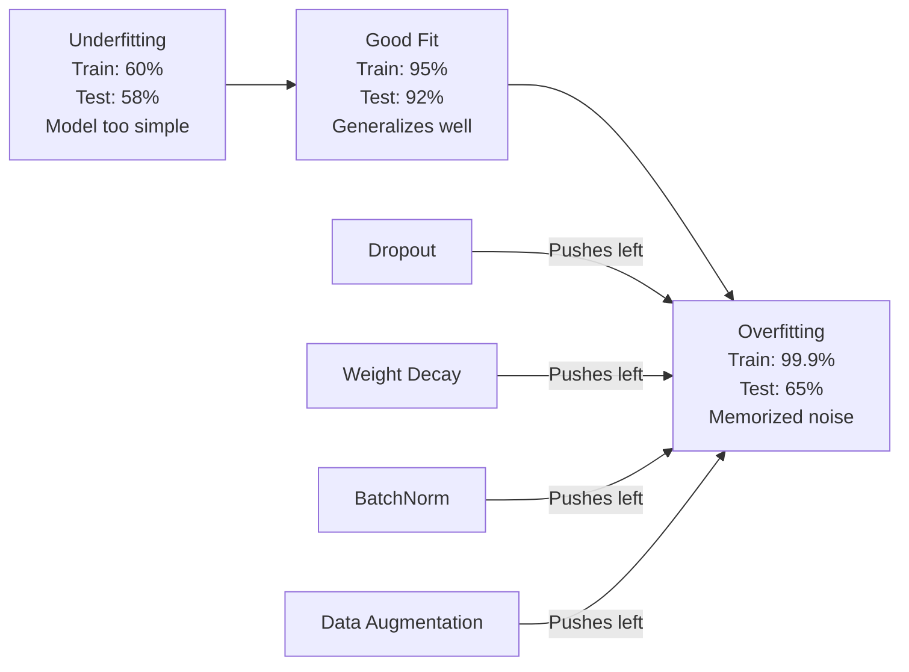
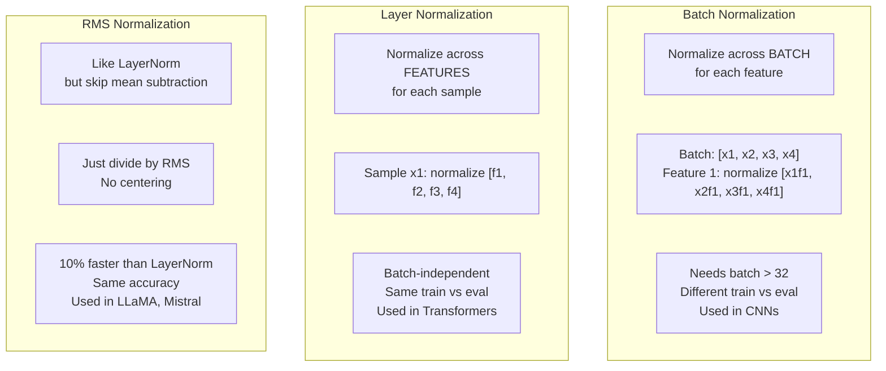
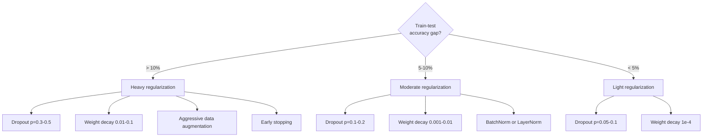

# Düzenlenme

> Modeliniz %99'u eğitim verileri ve %60'ını test verileri ile elde eder. Öğrenmek yerine ezberler.

**Type:** Build
**Languages:** Python
**Prerequisites:** Lesson 03.06 (Optimizers)
**Time:** ~75 minutes

## Öğrenme Hedefleri

- Ters ölçeklendirme, L2 ağırlık kaybı, parti normallendirme, katman normallendirme ve sıfırdan RMSNorm ile uygulama bırakma
- Tren testi doğruluk boşluğunu ölçmek ve düzenleme deneylerini kullanarak aşırı uygunluğu teşhis etmek
- Transformatörlerin BatchNorm yerine LayerNorm neden kullandığını ve modern LLM'lerin neden RMSNorm'ı tercih ettiğini açıklayın.
- Üstü uyumluğun şiddetine göre düzenleme tekniklerinin doğru kombinasyonunu uygulayın.

## Sorun

Yeterli parametreleri olan bir sinir ağı herhangi bir veri kümesini ezberleyebilir. Bu bir hipotezi değil - Zhang et al. (2017) bunu ImageNet'te rastgele etiketlerle standart ağları eğiterek kanıtladı. Ağlar tamamen rastgele etiket görevlerinde neredeyse sıfır eğitim kaybına ulaştı. Öğrenmek için bir patern olmadan bir milyon rastgele giriş-çıkanış çiftini ezberlediler. Eğitim kaybı mükemmeldi. Test doğruluğu sıfırdı.

Bu, aşırı uyumlu bir sorun ve modeller büyüdükçe daha da kötüleşir. GPT-3 175 milyar parametre sahiptir. Eğitim kümesi yaklaşık 500 milyar jetonu vardır. Bu sayısız parametre ile, model eğitim verilerinin önemli parçalarını kelimenin bir anlamında ezberleyebilecek kadar kapasiteye sahiptir. Düzenlendirme olmadan, genel hale getirülebilir kalıpları öğrenmek yerine sadece eğitim örneklerini tekrar tekrar üretecektir.

Eğitim performansıyla test performansı arasındaki fark, aşırı uygunluk aralığıdır. Bu dersdeki her teknik farklı bir açıdan bu boşluğu vurur. İptal, ağın tek bir nörona güvenmemesini zorlar. Ağırlık kaybı, herhangi bir ağırlığın çok büyükleşmesini engeller. Satır normallendirme kayıp manzarasını düzeltir böylece optimizör daha düz, daha genel hale getirebilen minimumlar bulur. Katman normallaştırması aynı şeyi yapar ancak parti normallaştırması başarısız olduğunda çalışır (küçük partiler, değişken uzunluklı diziler). RMSNorm ortalama hesaplamayı düşürerek %10 daha hızlı yapar. Her teknik basit. Birlikte, ezberleyen ve genelleştiren bir model arasındaki farkı oluştururlar.

## Anlaşım

### Aşırı Ekleyici Spektrum

Her model bir spektrimde bir yerde oturur. (önümünü yakalamak için çok basit) aşırı uyumlu (gürültüyü yakalamak için çok karmaşık).



### İptal

Eğitim sırasında, her nöronun çıkışını rastgele olarak p olasılığı ile sıfıra ayarlayın.

```
output = activation(z) * mask    where mask[i] ~ Bernoulli(1 - p)
```

P = 0.5'te, nöronların yarısı her ileri geçişte sıfırlanır. Ağ, neyronların hangi nöronların bulunacağını tahmin edemediği için fazladan temsilleri öğrenmelidir. Bu, uyumlu olmayı engeller - nöronlar belirli diğer nöronlara güvenmeyi öğrenir.

Ensemsel yorum: N nöronu ve çıkışa sahip bir ağ 2^N olası alt ağlar (nöronların açılıp kapalı olduğu her kombinasyon) oluşturur. Eğitim, yaklaşık olarak her iki N alt ağını aynı anda, her biri farklı mini-batch'larda trenleştiriyor. Test sırasında tüm nöronları kullanır (bırakma) ve hazırlık sırasında beklenen değerle eşleşmek için çıkışları (1 - p) oranında ölçebilirsiniz. Bu, 2^N alt ağlarının tahminlerinin ortalamasına eşittir -- tek bir modelden oluşan büyük bir ansambl.

Pratikte, test yerine eğitim sırasında ölçeklendirme uygulanır (i ters düşüş):

```
During training:  output = activation(z) * mask / (1 - p)
During testing:   output = activation(z)   (no change needed)
```

Bu daha temiz çünkü test kodu hiç de terk edilme hakkında bilgi sahibi olmamalı.

Öntanımlı oranlar: transformörler için p = 0,1 , MLP için p = 0,5 , CNN'ler için p = 0,2 - 0,3 .

### Ağırlık Kaybedilmesi (L2 Düzenlenmesi)

Tüm ağırlıkların karede büyüklüğünü kaybına ekleyin:

```
total_loss = task_loss + (lambda / 2) * sum(w_i^2)
```

Normalleştirme terimin gradiyenti lambda * w. Bu, her adımda her ağırlığın büyüklüğüne orantılı bir bölümle sıfıra doğru küçültüldüğü anlamına gelir. Büyük ağırlıklar daha fazla cezalandırılır.

Bu neden genelleşmeye yardımcı olur: Overfit modellerin eğitim verilerinde gürültüyi artırmak için büyük ağırlıklara sahip olma eğilimindedir.

Lambda hiperparametri sertliği kontrol eder.

- AdamW için transformatörler için 0.01
- 1e-4 için SGD CNN'de
- 0.1 ağırlıklı olarak fazla uyumlu modeller için

Ders 06'da tartışıldığı gibi, kilo kaybı ve L2 düzenlenmesi SGD'de eşittir ama Adam'da değil.

### Satır Normalleşimi

Mini-batch'ın her katmanının çıkışını bir sonraki katmana geçmeden önce normalleştirin.

Bir katman üzerinde mini seri aktivasyonlar için:

```
mu = (1/B) * sum(x_i)           (batch mean)
sigma^2 = (1/B) * sum((x_i - mu)^2)   (batch variance)
x_hat = (x_i - mu) / sqrt(sigma^2 + eps)   (normalize)
y = gamma * x_hat + beta        (scale and shift)
```

Gamma ve beta, ağın normalleşmeyi iptal etmesine izin veren öğrenilebilir parametrelerdir.

**Training vs inference split:**Eğitim sırasında, mu ve sigma mevcut mini-batch'ten gelir. Tahmin sırasında, eğitim sırasında birikmiş koşuş ortalamalarını kullanırsınız (eğlence = 0,1 ile esponansel hareketli ortalama, yani 90% eski + 10% yeni).

BatchNorm'un neden işe yaradığını tartışıyoruz. Orijinal makalede "içi kovariyet değişimi"ni (daha önceki katmanların güncelleşmesiyle değişen katman girişlerinin dağılımını) azaltıyor. Santurkar et al. (2018) bu açıklamanın yanlış olduğunu gösterdi. Gerçek neden: BatchNorm kayıpları daha da kolaylaştırıyor. Gradyentler daha öngörücüdür, Lipschitz sabitleri daha küçüktür ve optimizer daha büyük adımları güvenli bir şekilde atabilir. Bu yüzden BatchNorm daha yüksek öğrenme oranlarını kullanmanıza ve daha hızlı bir şekilde bir araya gelmenize izin verir.

BatchNorm'un temel bir sınırlaması vardır: seri istatistiklerine bağlıdır. 1 seri boyutu ile ortalama ve varyansa anlamsızdır. Küçük seri (< 32), istatistikler gürültülü ve zararlı performans gösterir. Bu, nesne tespit (hüye belleği seri boyutunu sınırlayan) ve dil modelleme (sequence uzunlukları değişen) gibi görevlerde önemlidir.

### Katman Normalleşimi

Bir numune için, parti yerine özellikler arasında normalleştirin:

```
mu = (1/D) * sum(x_j)           (feature mean)
sigma^2 = (1/D) * sum((x_j - mu)^2)   (feature variance)
x_hat = (x_j - mu) / sqrt(sigma^2 + eps)
y = gamma * x_hat + beta
```

D özellik boyutudur. Her örnek bağımsız olarak normallaştırılır - parti boyutundan bağımsız değildir. Bu nedenle transformatörler BatchNorm yerine LayerNorm kullanır. Sequence değişken uzunluklara sahiptir, parti boyutları genellikle küçüktür (veya 1 jenerasyon sırasında), ve hesaplama eğitim ve sonuçlama arasında aynıdır.

Transformatorlarda LayerNorm, her kendi dikkat blokunun ve her ileriye aktarma blokunun (Post-LN) ardından veya öncesinde (Evrim eğitimi için daha istikrarlı olan Pre-LN) uygulanır.

### RMSNorm

LayerNorm ortalama çıkarmadan. Zhang & Sennrich tarafından önerilen (2019).

```
rms = sqrt((1/D) * sum(x_j^2))
y = gamma * x / rms
```

Bu da. Ortalama hesaplama yok, beta parametri yok. gözlem: LayerNorm'daki yeniden merkeze (ortalama çıkarma) modelin performansına çok az katkıda bulunur, ancak hesaplama maliyetleri vardır.

LLaMA, LLaMA 2, LLaMA 3, Mistral ve çoğu modern LLM LayerNorm yerine RMSNorm kullanır.

### Normalleşme karşılaştırması



### Veri artırımı düzenlenme olarak

Model değiştirilmesi değil, veri değiştirilmesi. Etiketleri korurken eğitim girişlerini dönüştürün:

- Resimler: rastgele biçim, dönüş, dönüm, renk gerginliği, kesim
- Metin: eşya sözcükleri değiştirme, geri çevirme, rastgele silme
- Ses: zaman uzantısı, yüksek ses değişimi, gürültü eklenmesi

Bu, düzenlenme ile aynıdır: eğitim kümesinin etkin boyutunu arttırır ve modelin belirli örnekleri ezberlemesini zorlaştırır. Her resmini sadece orijinal biçiminde bir kez gören bir model onu ezberleyebilir. Her resmin 50 artırılmış versiyonunu gören bir model değişmez yapıyı öğrenmek zorunda kalır.

### Erken Durma

En basit düzenleyici: doğrulama kaybı artmaya başladığında eğitimden vazgeç. Model henüz o noktada fazla uyumlu değil.

### Ne Zaman Kullanmalı



```figure
l2-regularization
```

## Yapın

### Adım 1: Durumdan çıkma (Tren ve Eval Mode)

```python
import random
import math


class Dropout:
    def __init__(self, p=0.5):
        self.p = p
        self.training = True
        self.mask = None

    def forward(self, x):
        if not self.training:
            return list(x)
        self.mask = []
        output = []
        for val in x:
            if random.random() < self.p:
                self.mask.append(0)
                output.append(0.0)
            else:
                self.mask.append(1)
                output.append(val / (1 - self.p))
        return output

    def backward(self, grad_output):
        grads = []
        for g, m in zip(grad_output, self.mask):
            if m == 0:
                grads.append(0.0)
            else:
                grads.append(g / (1 - self.p))
        return grads
```

### Adım 2: L2 Ağırlık azalması

```python
def l2_regularization(weights, lambda_reg):
    penalty = 0.0
    for w in weights:
        penalty += w * w
    return lambda_reg * 0.5 * penalty

def l2_gradient(weights, lambda_reg):
    return [lambda_reg * w for w in weights]
```

### Adım 3: Satır Normalleşimi

```python
class BatchNorm:
    def __init__(self, num_features, momentum=0.1, eps=1e-5):
        self.gamma = [1.0] * num_features
        self.beta = [0.0] * num_features
        self.eps = eps
        self.momentum = momentum
        self.running_mean = [0.0] * num_features
        self.running_var = [1.0] * num_features
        self.training = True
        self.num_features = num_features

    def forward(self, batch):
        batch_size = len(batch)
        if self.training:
            mean = [0.0] * self.num_features
            for sample in batch:
                for j in range(self.num_features):
                    mean[j] += sample[j]
            mean = [m / batch_size for m in mean]

            var = [0.0] * self.num_features
            for sample in batch:
                for j in range(self.num_features):
                    var[j] += (sample[j] - mean[j]) ** 2
            var = [v / batch_size for v in var]

            for j in range(self.num_features):
                self.running_mean[j] = (1 - self.momentum) * self.running_mean[j] + self.momentum * mean[j]
                self.running_var[j] = (1 - self.momentum) * self.running_var[j] + self.momentum * var[j]
        else:
            mean = list(self.running_mean)
            var = list(self.running_var)

        self.x_hat = []
        output = []
        for sample in batch:
            normalized = []
            out_sample = []
            for j in range(self.num_features):
                x_h = (sample[j] - mean[j]) / math.sqrt(var[j] + self.eps)
                normalized.append(x_h)
                out_sample.append(self.gamma[j] * x_h + self.beta[j])
            self.x_hat.append(normalized)
            output.append(out_sample)
        return output
```

### Dördüncü adım: Katman Normalleşmesi

```python
class LayerNorm:
    def __init__(self, num_features, eps=1e-5):
        self.gamma = [1.0] * num_features
        self.beta = [0.0] * num_features
        self.eps = eps
        self.num_features = num_features

    def forward(self, x):
        mean = sum(x) / len(x)
        var = sum((xi - mean) ** 2 for xi in x) / len(x)

        self.x_hat = []
        output = []
        for j in range(self.num_features):
            x_h = (x[j] - mean) / math.sqrt(var + self.eps)
            self.x_hat.append(x_h)
            output.append(self.gamma[j] * x_h + self.beta[j])
        return output
```

### Adım 5: RMSNorm

```python
class RMSNorm:
    def __init__(self, num_features, eps=1e-6):
        self.gamma = [1.0] * num_features
        self.eps = eps
        self.num_features = num_features

    def forward(self, x):
        rms = math.sqrt(sum(xi * xi for xi in x) / len(x) + self.eps)
        output = []
        for j in range(self.num_features):
            output.append(self.gamma[j] * x[j] / rms)
        return output
```

### Adım 6: Düzenli Eğitim ve Eğitim

```python
def sigmoid(x):
    x = max(-500, min(500, x))
    return 1.0 / (1.0 + math.exp(-x))


def make_circle_data(n=200, seed=42):
    random.seed(seed)
    data = []
    for _ in range(n):
        x = random.uniform(-2, 2)
        y = random.uniform(-2, 2)
        label = 1.0 if x * x + y * y < 1.5 else 0.0
        data.append(([x, y], label))
    return data


class RegularizedNetwork:
    def __init__(self, hidden_size=16, lr=0.05, dropout_p=0.0, weight_decay=0.0):
        random.seed(0)
        self.hidden_size = hidden_size
        self.lr = lr
        self.dropout_p = dropout_p
        self.weight_decay = weight_decay
        self.dropout = Dropout(p=dropout_p) if dropout_p > 0 else None

        self.w1 = [[random.gauss(0, 0.5) for _ in range(2)] for _ in range(hidden_size)]
        self.b1 = [0.0] * hidden_size
        self.w2 = [random.gauss(0, 0.5) for _ in range(hidden_size)]
        self.b2 = 0.0

    def forward(self, x, training=True):
        self.x = x
        self.z1 = []
        self.h = []
        for i in range(self.hidden_size):
            z = self.w1[i][0] * x[0] + self.w1[i][1] * x[1] + self.b1[i]
            self.z1.append(z)
            self.h.append(max(0.0, z))

        if self.dropout and training:
            self.dropout.training = True
            self.h = self.dropout.forward(self.h)
        elif self.dropout:
            self.dropout.training = False
            self.h = self.dropout.forward(self.h)

        self.z2 = sum(self.w2[i] * self.h[i] for i in range(self.hidden_size)) + self.b2
        self.out = sigmoid(self.z2)
        return self.out

    def backward(self, target):
        eps = 1e-15
        p = max(eps, min(1 - eps, self.out))
        d_loss = -(target / p) + (1 - target) / (1 - p)
        d_sigmoid = self.out * (1 - self.out)
        d_out = d_loss * d_sigmoid

        for i in range(self.hidden_size):
            d_relu = 1.0 if self.z1[i] > 0 else 0.0
            d_h = d_out * self.w2[i] * d_relu
            self.w2[i] -= self.lr * (d_out * self.h[i] + self.weight_decay * self.w2[i])
            for j in range(2):
                self.w1[i][j] -= self.lr * (d_h * self.x[j] + self.weight_decay * self.w1[i][j])
            self.b1[i] -= self.lr * d_h
        self.b2 -= self.lr * d_out

    def evaluate(self, data):
        correct = 0
        total_loss = 0.0
        for x, y in data:
            pred = self.forward(x, training=False)
            eps = 1e-15
            p = max(eps, min(1 - eps, pred))
            total_loss += -(y * math.log(p) + (1 - y) * math.log(1 - p))
            if (pred >= 0.5) == (y >= 0.5):
                correct += 1
        return total_loss / len(data), correct / len(data) * 100

    def train_model(self, train_data, test_data, epochs=300):
        history = []
        for epoch in range(epochs):
            total_loss = 0.0
            correct = 0
            for x, y in train_data:
                pred = self.forward(x, training=True)
                self.backward(y)
                eps = 1e-15
                p = max(eps, min(1 - eps, pred))
                total_loss += -(y * math.log(p) + (1 - y) * math.log(1 - p))
                if (pred >= 0.5) == (y >= 0.5):
                    correct += 1
            train_loss = total_loss / len(train_data)
            train_acc = correct / len(train_data) * 100
            test_loss, test_acc = self.evaluate(test_data)
            history.append((train_loss, train_acc, test_loss, test_acc))
            if epoch % 75 == 0 or epoch == epochs - 1:
                gap = train_acc - test_acc
                print(f"    Epoch {epoch:3d}: train_acc={train_acc:.1f}%, test_acc={test_acc:.1f}%, gap={gap:.1f}%")
        return history
```

## Kullan

PyTorch tüm normallaşmayı ve düzenlendirmeyi modüller olarak sağlar:

```python
import torch
import torch.nn as nn

model = nn.Sequential(
    nn.Linear(784, 256),
    nn.BatchNorm1d(256),
    nn.ReLU(),
    nn.Dropout(0.3),
    nn.Linear(256, 128),
    nn.BatchNorm1d(128),
    nn.ReLU(),
    nn.Dropout(0.3),
    nn.Linear(128, 10),
)

model.train()
out_train = model(torch.randn(32, 784))

model.eval()
out_test = model(torch.randn(1, 784))
```

- Evet .`model.train()`- Ne ?`model.eval()`Çıkış kritik. Açılış/kesinliği açar ve BatchNorm'a seri istatistiklerini çalıştırma istatistikleriyle karşılaştırmak için söyler.`model.eval()`Bu nedenle, bu testlerin doğruluğu rastgele değişecek çünkü çıkış durumları hala aktif ve BatchNorm mini-batch istatistiklerini kullanıyor.

Transformatörler için, örneği farklıdır:

```python
class TransformerBlock(nn.Module):
    def __init__(self, d_model=512, nhead=8, dropout=0.1):
        super().__init__()
        self.attention = nn.MultiheadAttention(d_model, nhead, dropout=dropout)
        self.norm1 = nn.LayerNorm(d_model)
        self.ff = nn.Sequential(
            nn.Linear(d_model, d_model * 4),
            nn.GELU(),
            nn.Linear(d_model * 4, d_model),
            nn.Dropout(dropout),
        )
        self.norm2 = nn.LayerNorm(d_model)
        self.dropout = nn.Dropout(dropout)

    def forward(self, x):
        attended, _ = self.attention(x, x, x)
        x = self.norm1(x + self.dropout(attended))
        x = self.norm2(x + self.ff(x))
        return x
```

LayerNorm, BatchNorm değil. Kaldırma p=0.1, p=0.5. Bunlar dönüştürücü öntanımlıları.

## Gönder

Bu ders şunları ortaya çıkarır:
- `outputs/prompt-regularization-advisor.md`-- aşırı uygunluk teşhis eden ve doğru düzenleme stratejisini öneren bir istek.

## Egzersizler

1. 2 boyutlu veriler için uzaylı düşüş uygulayın: bireysel nöronları düşürmek yerine, tüm özellik kanallarını düşürün. Bunu ardılı özellik gruplarını kanal olarak değerlendirerek ve tüm grupları düşürerek simüle edin.

2. 5. Dersin 5. bölümünden etiket düzeltmesini uygulayın ve bu dersden çıkma ile birlikte. Dört yapılandırma ile çalışın: hiçbirisi, sadece çıkma, sadece etiket düzeltmesi, her ikisi de. Her biri için son tren testi doğruluk boşluğu ölçün. Hangi kombinasyon en küçük boşluğu verir?

3. Gizli katman ve çevrim- veri kümesi ağınızdaki etkinleştirme arasında BatchNorm katmanı ekleyin. BatchNorm ile ve olmadan 0.01, 0.05 ve 0.1 öğrenme oranlarında çalışın. BatchNorm, vanilya ağının farklı olduğu yüksek öğrenme oranlarında istikrarlı eğitim sağlaması gerekir.

4. Erken durdurma uygulayın: her dönem deneme kaybını takip edin, en iyi ağırlıkları koruyun ve test kaybı 20 dönem boyunca iyileşmediyse durdurun. 1000 dönem için düzenli ağ çalıştırın. Hangi dönem en iyi test doğruluğu olduğunu ve kaç hesaplama dönemini kurtardığınızı bildirin.

5. LayerNorm vs RMSNorm'ı 4 katlı ağda karşılaştırın (sadece 2 değil). Her ikisini de aynı ağırlıklarla başlatın. 200 dönem boyunca çalıştırın ve ilk katlıktaki son doğruluk, eğitim hızı (zaman başına) ve gradient büyüklüklerini karşılaştırın. RMSNorm'un aynı doğrulukla daha hızlı olduğunu kontrol edin.

## Anahtar Terimler

| Term | What people say | What it actually means |
|------|----------------|----------------------|
| Overfitting | "Model memorized the data" | When a model's training performance significantly exceeds its test performance, indicating it learned noise rather than signal |
| Regularization | "Preventing overfitting" | Any technique that constrains model complexity to improve generalization: dropout, weight decay, normalization, augmentation |
| Dropout | "Random neuron deletion" | Zeroing random neurons during training with probability p, forcing redundant representations; equivalent to training an ensemble |
| Weight decay | "L2 penalty" | Shrinking all weights toward zero by subtracting lambda * w at each step; penalizes complexity through weight magnitude |
| Batch normalization | "Normalize per batch" | Normalizing layer outputs across the batch dimension using batch statistics during training and running averages during inference |
| Layer normalization | "Normalize per sample" | Normalizing across features within each sample; batch-independent, used in transformers where batch size varies |
| RMSNorm | "LayerNorm without the mean" | Root mean square normalization; drops the mean subtraction from LayerNorm for 10% speedup with equal accuracy |
| Early stopping | "Stop before overfit" | Halting training when validation loss stops improving; the simplest regularizer, often used alongside others |
| Data augmentation | "More data from less" | Transforming training inputs (flip, crop, noise) to increase effective dataset size and force invariance learning |
| Generalization gap | "Train-test split" | The difference between training and test performance; regularization aims to minimize this gap |

## Daha Fazla Okumak

- Srivastava et al., "Dropout: Neural Networks'in Aşırı Uygunluktan Korunması İçin Basit Bir Yolu" (2014) -- Ensemble interpretasyonu ve kapsamlı deneyler ile orijinal bırakma kağıdı
- Ioffe & Szegedy, "Batch Normalization: Accelerating Deep Network Training by Reducing Internal Covariate Shift" (2015) -- BatchNorm ve eğitim prosedürünü, en çok alıntılanan derin öğrenme makaleleri arasında bir tanesi olarak tanıttı
- Zhang & Sennrich, "Root Mean Square Layer Normalization" (2019) -- RMSNorm'un LayerNorm doğruluğuna az hesaplama ile eşleştiğini gösterdi; LLaMA ve Mistral tarafından kabul edildi
- Zhang et al., "Deep Learning Understanding Requires Rethinking Generalization" (2017) - nöral ağların rastgele etiketleri ezberleyebileceğini gösteren önemli bir makale, genelleşme hakkında geleneksel görüşlere meydan okuyarak
