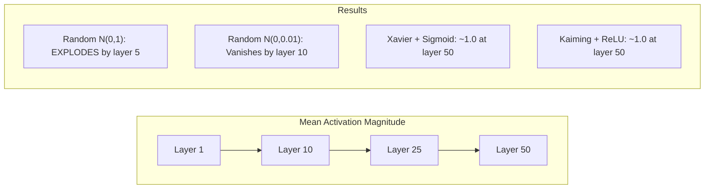
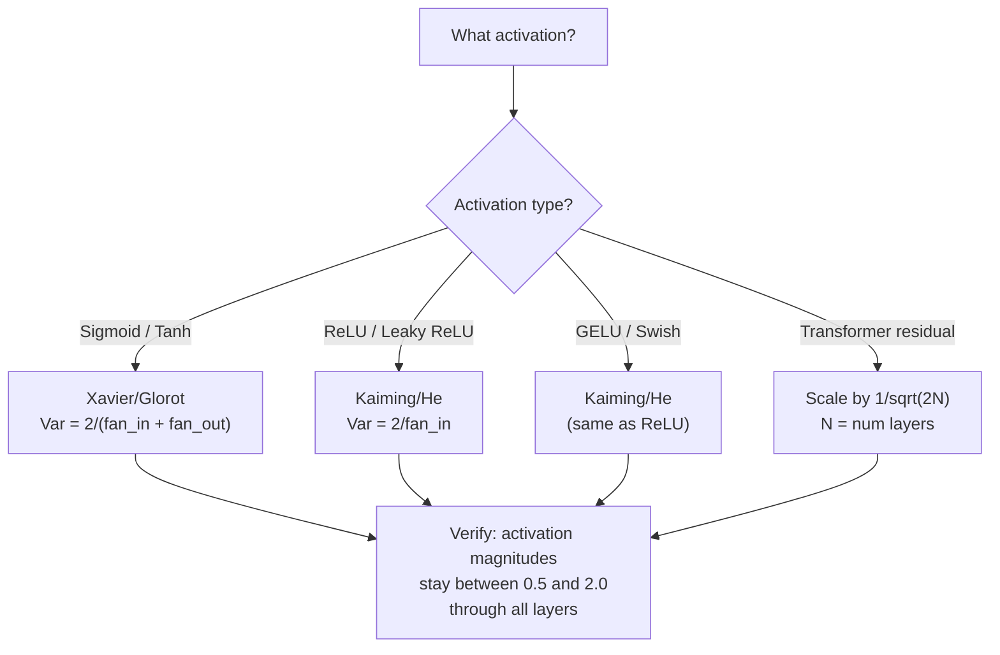

# Ağırlık Başlatma ve Eğitim Kararlılığı

> Yanlış bir başlangıç yaparsan hiç bir zaman çalışmaya başlamaz.

**Type:** Build
**Languages:** Python
**Prerequisites:** Lesson 03.04 (Activation Functions), Lesson 03.07 (Regularization)
**Time:** ~90 minutes

## Öğrenme Hedefleri

- sıfır, rastgele, Xavier/Glorot ve Kaiming/He başlangıç stratejilerini uygulayın ve 50 katman boyunca etkinlik büyüklüklerine etkilerini ölçün
- Xavier init'in Var(w) = 2/(fan_in + fan_out) ve Kaiming'in Var(w) = 2/fan_in'i neden kullandığını öğrenin.
- sıfır başlangıç ile simetri sorunu gösterin ve rastgele ölçeklerin neden yeterli olmadığını açıklayın.
- Doğru başlangıç stratejisi ile etkinleştirme fonksiyonu eşleştir: Xavier sigmoid/tanh için, Kaiming ReLU/GELU için

## Sorun

Tüm ağırlıkları sıfıra başlatın. Hiçbir şey öğrenmez. Her nöron aynı işlevi hesaplar, aynı gradiyenti alır ve aynı şekilde güncelleştirir. 10.000 dönemden sonra, 512 nöronlu gizli katmanınız hâlâ aynı nöronun 512 kopyasıdır. 512 parametre için ödeme yaptınız ve 1 aldınız.

Bu sayede, bir dizi değişkenlik, bir dizi değişkenlik ve bir dizi değişkenlik oluşur.

Bu, normal bir dağılımdan rastgele olarak başlatılır. 3 katman için çalışır. 50 katmanlarda, sinyal, rastgele ölçekin biraz fazla küçük veya biraz fazla büyük olup olmadığından bağlı olarak sıfıra düşer veya sonsuza kadar patlar. "İş" ve "kırık" arasındaki sınır keskin ince.

Ağırlık başlangıcı derin öğrenme konusunda en az değerlendirilmiş bir karar. Mimarlık kağıtlar alır. Optimizeciler blog yayınları alır. Başlangıç bir ayaknot alır. Ama yanlış yapın ve başka bir şey önemli değil - eğitim başlamadan önce ağınız öldü.

## Anlaşım

### Simetri Sorunu

Bir katmadaki her nöronun aynı yapısı vardır: girdiler ağırlıklarla çarpın, tarafsızlık ekleyin, etkinleştirme uygulayın. Eğer tüm ağırlıklar aynı değerden başlarsa (sıfır son durumdur), her nöron aynı çıkışı hesaplar. Geri yayılma sırasında, her nöron aynı gradiyenti alır. Güncelleme aşamasında, her nöron aynı miktarda değişir.

Ağda yüzlerce parametre var ama hepsi birbiriyle hareket ediyor. Buna simetri deniyor ve rastgele başlangıç, onu kırmanın yoludur. Her nöron ağırlık alanındaki farklı bir noktada başlar, böylece her biri farklı bir özelliği öğrenir.

Ancak "hassasiyet" yeterli değildir. *hassasiyetin ölçeği* ağın tren olup olmadığını belirler.

### Çevrelerle Yayılan Çevreler

Fan_in girişleri olan tek bir katman düşünün:

```
z = w1*x1 + w2*x2 + ... + w_n*x_n
```

Eğer her ağırlık wi Var(w) varanslı bir dağılımdan çıkarılırsa ve her girişi xi Var(x varanslıysa, çıkış varansı:

```
Var(z) = fan_in * Var(w) * Var(x)
```

Var(w) = 1 ve fan_in = 512, çıkış varyansi girişi varyansi 512x. 10 kat sonra: 512^10 = 1.2e27.

Var ((w) = 0.001 ise, çıkış varyansi katman başına 0.001 * 512 = 0.512 ile küçülür. 10 katman sonra: 0.512^10 = 0.00013. Sinyaliniz kayboldu.

Amaç: Var(w) seçin, böylece Var(z) = Var(x). Sinyal büyüklüğü katmanlar boyunca sabit kalır.

### Xavier/Glorot Başlangıç

Glorot ve Bengio (2010) sigmoid ve tanh aktivasyonları için çözüm elde ettiler.

```
Var(w) = 2 / (fan_in + fan_out)
```

Uygulamalarda ağırlıklar aşağıdakilerden alınır:

```
w ~ Uniform(-limit, limit)  where limit = sqrt(6 / (fan_in + fan_out))
```

veya:

```
w ~ Normal(0, sqrt(2 / (fan_in + fan_out)))
```

Bu, sigmoid ve tanh'ın sıfır yakınlarında yaklaşık olarak doğrusal olduğu için çalışır.

### Kaiming/O Başlangıç

ReLU çıkışların yarısını öldürür (eşitsiz olan her şey sıfır olur). Etkin fan_in yarıya düşürülür çünkü ortalama girdilerin yarısı sıfırdır. Xavier init bunu hesaplamaz - gerekli varyansiyi küçümser.

He et al. (2015) formülü düzeltti:

```
Var(w) = 2 / fan_in
```

Ağırlıklar aşağıdakilerden alınır:

```
w ~ Normal(0, sqrt(2 / fan_in))
```

2 katı, ReLU'nun aktifleşmelerin yarısını sıfırlamasını telafi eder. Bu olmadan, sinyal kat başına ~0.5x küçülür. 50 katı ile: 0.5^50 = 8.8e-16. Kaiming init bunu önler.

### Transformer Başlatma

GPT-2 farklı bir desen ortaya koydu. Geri kalan bağlantılar her alt katmanın çıkışını girişine ekler:

```
x = x + sublayer(x)
```

Her eklem varyansiyi arttırır. N kalan katmanlarla varyansi N'ye oranla büyür. GPT-2 kalan katmanların ağırlığını 1/sqrt(2N ile ölçeyor, burada N katman sayısıdır. Bu, toplanan sinyal büyüklüğünü istikrarlı tutar.

Llama 3 (405B parametreleri, 126 katman) benzer bir şema kullanır. Bu ölçeklendirme olmadan, kalan akım 126 katman dikkat ve geri dönüş blokları boyunca sınırsız büyüyecektir.

```mermaid
flowchart TD
    subgraph "Zero Init"
        Z1["Layer 1<br/>All weights = 0"] --> Z2["Layer 2<br/>All neurons identical"]
        Z2 --> Z3["Layer 3<br/>Still identical"]
        Z3 --> ZR["Result: 1 effective neuron<br/>regardless of width"]
    end

    subgraph "Xavier Init"
        X1["Layer 1<br/>Var = 2/(fan_in+fan_out)"] --> X2["Layer 2<br/>Signal stable"]
        X2 --> X3["Layer 50<br/>Signal stable"]
        X3 --> XR["Result: Trains with<br/>sigmoid/tanh"]
    end

    subgraph "Kaiming Init"
        K1["Layer 1<br/>Var = 2/fan_in"] --> K2["Layer 2<br/>Signal stable"]
        K2 --> K3["Layer 50<br/>Signal stable"]
        K3 --> KR["Result: Trains with<br/>ReLU/GELU"]
    end
```



### 50 katman boyunca etkinleştirme büyüklüğü



### Doğru Yöntemleri Seçmek



```figure
weight-init-variance
```

## Yapın

### Adım 1: Başlangıç Strategiları

Bir ağırlık matrisini başlangıç yapmanın dört yolu. Her biri fan_in sütunları ve fan_out satırları ile listelerin bir listesini (bir 2 boyutlu matris) gönderir.

```python
import math
import random


def zero_init(fan_in, fan_out):
    return [[0.0 for _ in range(fan_in)] for _ in range(fan_out)]


def random_init(fan_in, fan_out, scale=1.0):
    return [[random.gauss(0, scale) for _ in range(fan_in)] for _ in range(fan_out)]


def xavier_init(fan_in, fan_out):
    std = math.sqrt(2.0 / (fan_in + fan_out))
    return [[random.gauss(0, std) for _ in range(fan_in)] for _ in range(fan_out)]


def kaiming_init(fan_in, fan_out):
    std = math.sqrt(2.0 / fan_in)
    return [[random.gauss(0, std) for _ in range(fan_in)] for _ in range(fan_out)]
```

### Adım 2: Aktifleştirme fonksiyonları

Her bir init stratejisini amaçlı etkinleştirmesiyle test etmek için sigmoid, tanh ve ReLU'ya ihtiyacımız var.

```python
def sigmoid(x):
    x = max(-500, min(500, x))
    return 1.0 / (1.0 + math.exp(-x))


def tanh_act(x):
    return math.tanh(x)


def relu(x):
    return max(0.0, x)
```

### Adım 3: 50 katman geç

Toplantı verilerini derin bir ağ üzerinden aktarın ve her katmandaki ortalama etkinlik büyüklüğünü ölçün.

```python
def forward_deep(init_fn, activation_fn, n_layers=50, width=64, n_samples=100):
    random.seed(42)
    layer_magnitudes = []

    inputs = [[random.gauss(0, 1) for _ in range(width)] for _ in range(n_samples)]

    for layer_idx in range(n_layers):
        weights = init_fn(width, width)
        biases = [0.0] * width

        new_inputs = []
        for sample in inputs:
            output = []
            for neuron_idx in range(width):
                z = sum(weights[neuron_idx][j] * sample[j] for j in range(width)) + biases[neuron_idx]
                output.append(activation_fn(z))
            new_inputs.append(output)
        inputs = new_inputs

        magnitudes = []
        for sample in inputs:
            magnitudes.append(sum(abs(v) for v in sample) / width)
        mean_mag = sum(magnitudes) / len(magnitudes)
        layer_magnitudes.append(mean_mag)

    return layer_magnitudes
```

### Dördüncü Adım: Deneyim

Tüm kombinasyonları çalıştırın: sıfır init, rastgele N(0,1), rastgele N(0,0.01), Xavier sigmoid, Xavier tanh, Kaiming ReLU ile. Büyüklüğü anahtar katmanlarda yazdırın.

```python
def run_experiment():
    configs = [
        ("Zero init + Sigmoid", lambda fi, fo: zero_init(fi, fo), sigmoid),
        ("Random N(0,1) + ReLU", lambda fi, fo: random_init(fi, fo, 1.0), relu),
        ("Random N(0,0.01) + ReLU", lambda fi, fo: random_init(fi, fo, 0.01), relu),
        ("Xavier + Sigmoid", xavier_init, sigmoid),
        ("Xavier + Tanh", xavier_init, tanh_act),
        ("Kaiming + ReLU", kaiming_init, relu),
    ]

    print(f"{'Strategy':<30} {'L1':>10} {'L5':>10} {'L10':>10} {'L25':>10} {'L50':>10}")
    print("-" * 80)

    for name, init_fn, act_fn in configs:
        mags = forward_deep(init_fn, act_fn)
        row = f"{name:<30}"
        for idx in [0, 4, 9, 24, 49]:
            val = mags[idx]
            if val > 1e6:
                row += f" {'EXPLODED':>10}"
            elif val < 1e-6:
                row += f" {'VANISHED':>10}"
            else:
                row += f" {val:>10.4f}"
        print(row)
```

### Adım 5: Simetri Gösterisi

Null init'in aynı nöron ürettiğini göster.

```python
def symmetry_demo():
    random.seed(42)
    weights = zero_init(2, 4)
    biases = [0.0] * 4

    inputs = [0.5, -0.3]
    outputs = []
    for neuron_idx in range(4):
        z = sum(weights[neuron_idx][j] * inputs[j] for j in range(2)) + biases[neuron_idx]
        outputs.append(sigmoid(z))

    print("\nSymmetry Demo (4 neurons, zero init):")
    for i, out in enumerate(outputs):
        print(f"  Neuron {i}: output = {out:.6f}")
    all_same = all(abs(outputs[i] - outputs[0]) < 1e-10 for i in range(len(outputs)))
    print(f"  All identical: {all_same}")
    print(f"  Effective parameters: 1 (not {len(weights) * len(weights[0])})")
```

### Adım 6: Katmanlık Büyüklük Raporu

50 katman boyunca etkinleştirme büyüklüklerinin görsel bir çubuğu çiz.

```python
def magnitude_report(name, magnitudes):
    print(f"\n{name}:")
    for i, mag in enumerate(magnitudes):
        if i % 5 == 0 or i == len(magnitudes) - 1:
            if mag > 1e6:
                bar = "X" * 50 + " EXPLODED"
            elif mag < 1e-6:
                bar = "." + " VANISHED"
            else:
                bar_len = min(50, max(1, int(mag * 10)))
                bar = "#" * bar_len
            print(f"  Layer {i+1:3d}: {bar} ({mag:.6f})")
```

## Kullan

PyTorch bunları yerleşik fonksiyon olarak sağlar:

```python
import torch
import torch.nn as nn

layer = nn.Linear(512, 256)

nn.init.xavier_uniform_(layer.weight)
nn.init.xavier_normal_(layer.weight)

nn.init.kaiming_uniform_(layer.weight, nonlinearity='relu')
nn.init.kaiming_normal_(layer.weight, nonlinearity='relu')

nn.init.zeros_(layer.bias)
```

Aradığın zaman .`nn.Linear(512, 256)`Bu yüzden çoğu basit ağ "sadece çalışır" - PyTorch zaten doğru seçim yaptı. Ama özel mimarileri oluşturduğunuzda veya 20 katmadan daha derinlere giderseniz, ne olduğunu anlamanız ve potansiyel olarak öntanımlı olanı geçersiz kılmanız gerekir.

Transformatörler için HuggingFace modelleri genellikle özleri ile başlangıç yapmayı işliyor.`_init_weights`GPT-2 uygulaması geri kalan projeksiyonları 1/sqrt ((N) ile ölçeyor. Eğer sıfırdan bir transformatör inşa ediyorsanız, bunu kendiniz eklemelisiniz.

## Gönder

Bu ders şunları ortaya çıkarır:
- `outputs/prompt-init-strategy.md`- ağırlık başlangıç problemlerini teşhis eden ve doğru strateji öneren bir istek.

## Egzersizler

1. LeCun başlangıcı ekleyin (Var = 1/fan_in, SELU etkinleştirme için tasarlanmıştır). LeCun init + tanh ile 50 katlı deneyi çalıştırın ve Xavier + tanh ile karşılaştırın.

2. GPT-2 kalıntı ölçeklemesini uygulayın: kalıntı akımına eklemeden önce her katmanın çıkışını 1/sqrt ((2*N) ile çarpın. 50 katı ölçeklemeden ve ölçeklemeden çalıştırın, kalıntı büyüklüğünün ne kadar hızlı büyüdüğünü ölçün.

3. Bir ağın katman boyutlarını ve etkinleştirme türünü alan, ardından doğru başlangıç önerilen ve mevcut init sorunlara neden olacaksa uyarılan bir "init sağlık kontrolü" işlevi oluşturun.

4. Xavier ve Kaiming fan_in'e uyarlar, ama rastgele init yapmaz. "işler" ve "sıkıntılar" arasındaki boşluğu daha büyük katmanlarla nasıl genişletiyor olduğunu gösterin.

5. Ortogonal başlangıç uygulaması (hassasi bir matris oluşturun, SVD'sini hesaplayın, ortogonal matris U'yu kullanın). 50 katmanlı ReLU ağları için Kaiming ile karşılaştırın.

## Anahtar Terimler

| Term | What people say | What it actually means |
|------|----------------|----------------------|
| Weight initialization | "Set starting weights randomly" | The strategy for choosing initial weight values that determines whether a network can train at all |
| Symmetry breaking | "Make neurons different" | Using random initialization to ensure neurons learn distinct features instead of computing identical functions |
| Fan-in | "Number of inputs to a neuron" | The number of incoming connections, which determines how input variance accumulates in the weighted sum |
| Fan-out | "Number of outputs from a neuron" | The number of outgoing connections, relevant for maintaining gradient variance during backpropagation |
| Xavier/Glorot init | "The sigmoid initialization" | Var(w) = 2/(fan_in + fan_out), designed to preserve variance through sigmoid and tanh activations |
| Kaiming/He init | "The ReLU initialization" | Var(w) = 2/fan_in, accounts for ReLU zeroing half the activations |
| Variance propagation | "How signals grow or shrink through layers" | The mathematical analysis of how activation variance changes layer by layer based on weight scale |
| Residual scaling | "GPT-2's init trick" | Scaling residual connection weights by 1/sqrt(2N) to prevent variance growth through N transformer layers |
| Dead network | "Nothing trains" | A network where poor initialization causes all gradients to be zero or all activations to saturate |
| Exploding activations | "Values go to infinity" | When weight variance is too high, causing activation magnitudes to grow exponentially through layers |

## Daha Fazla Okumak

- Glorot & Bengio, "Deep Feedforward sinir ağlarını eğitmenin zorluğunu anlamak" (2010) - orijinal Xavier başlangıç makalesi varyansa analizi ile
- He et al., "Dep Diving into Rectifiers" (2015) -- ReLU ağları için Kaiming başlangıçını tanıttı
- Radford et al., "Dil Modelleri Gözlemsiz Çok Görevli Öğrencilerdir" (2019) -- Geri kalan ölçekleme başlangıcı ile GPT-2 kağıdı
- Mishkin & Matas, "All You Need is a Good Init" (2016) -- katmanlı sıralama birim-varians başlangıcı, analitik formüllere bir empiri alternatif
