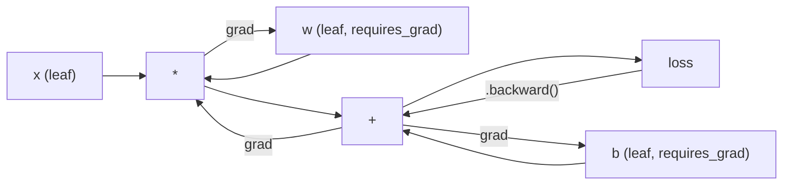
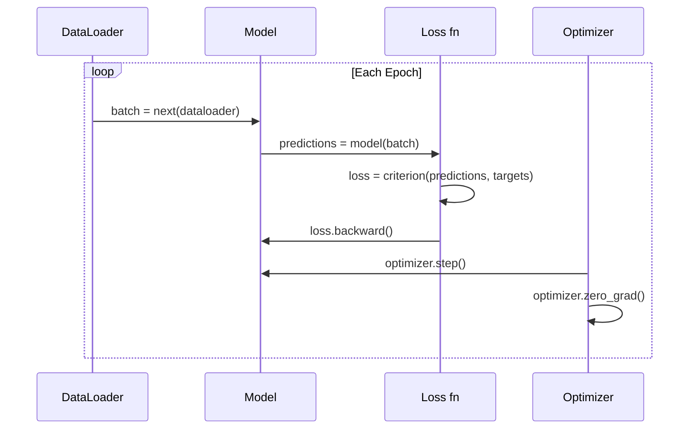

# PyTorch'a Giriş

> Motorları pistonlardan ve şarjlardan yaptın.

**Type:** Build
**Languages:** Python
**Prerequisites:** Lesson 03.10 (Build Your Own Mini Framework)
**Time:** ~75 minutes

## Öğrenme Hedefleri

- PyTorch'ın nn.Module, nn.Sequential ve autograd kullanarak sinir ağlarını oluşturun ve eğitiniz
- PyTorch tensörleri, GPU hızlandırması ve standart eğitim döngüsünü kullanın (zero_grad, ileri, kayb, geri, adım)
- Yeriye mini çerçeve bileşenlerini PyTorch eşdeğerlerine dönüştürün
- Profil ve aynı görev için saf Python çerçevesiniz ve PyTorch arasındaki eğitim hızı karşılaştırın

## Sorun

İşleyen mini çerçeve var. Düz katman, ReLU, çıkış, seri norm, Adam, bir DataLoader, bir eğitim döngüsü. Temiz Python'da bir döngü sınıflandırma sorunu üzerinde 4 katmanlı bir ağı eğitir.

Aynı sorunda PyTorch'tan 500 kat daha yavaş.

Mini çerçevenin bir anda bir örnekle bir örneği, örümlü Python döngüleri ile işliyor. PyTorch aynı işlemleri GPU'da çalışan optimize edilmiş C++/CUDA çekirdeklerine gönderir. Tek bir NVIDIA A100'de PyTorch, ResNet-50'i (parametri 25,6M) ImageNet'de (1.28M görüntü) yaklaşık 6 saatte eğitir.

Hız tek boşluk değildir. Çerçevenin GPU desteği yok. Otomatik farklılık yok - her modül için el yazmışsınız.

PyTorch bu boşlukların her birini dolduruyor. ve bunu zaten inşa ettiğiniz aynı zihinsel modelde tutarak yapar: Modül, ileri(), parametreler(), geriye(), optimizer.step(). Anlaşmalar birbiri aktarılır. Sintaks neredeyse aynıdır. Fark şu ki PyTorch, sıfırdan tasarladığınız aynı arayüzün arkasında bir on yıllık sistem mühendisliği kapsıyor.

## Anlaşım

### PyTorch Neden Kazandı

TensorFlow'un 2015 yılında bir şey çalıştırmadan önce statik bir hesaplama grafiği tanımlamanızı istedi. Grafi oluşturdu, birleştirdi, sonra da veriyi içeri soktu. Debugging, grafik görselleştirmelerine bakmak anlamına geliyordu. Arsitekturayı değiştirmek, grafi sıfırdan yeniden inşa etmek anlamına geliyordu.

PyTorch 2017'de farklı bir felsefe ile başlatıldı: hevesli bir şekilde yürütülür. Python yazıyorsunuz. Hemen çalışır.`y = model(x)`Aslında şimdi y'yi hesaplıyor, "y'yi daha sonra hesaplayacak bir grafikte bir düğüm ekleme" değil. Bu, standart Python debugging araçları çalıştı demek. print() çalıştı. pdb çalıştı. if/else in your forward pass worked.

Piytorch'un ML araştırma makalelerinde payı %7 (2017)'den %75'e (2022) yükseldi. Meta, Google DeepMind, OpenAI, Anthropic ve Hugging Face hepsi PyTorch'i ana çerçevesini kullanıyor. TensorFlow 2.x, PyTorch'un tasarımının doğru olduğunu sessiz kabul ederek, buna karşılık hevesli bir yürütme uyguladı.

Ders: Geliştiricilerin deneyimleri bileşikler. Her seferinde debug etmek için %10 daha yavaş ama %50 daha hızlı bir çerçeve kazanır.

### Tansörler

Tensor, üç kritik özelliği olan çok boyutlu bir dizi: şekil, dtype ve cihaz.

```python
import torch

x = torch.zeros(3, 4)           # shape: (3, 4), dtype: float32, device: cpu
x = torch.randn(2, 3, 224, 224) # batch of 2 RGB images, 224x224
x = torch.tensor([1, 2, 3])     # from a Python list
```

**Shape**Bir skalar şekil (), bir vektör (n), bir matris (m, n), bir görüntü parti (batch, kanallar, yüksekliği, genişliği).

**Dtype**Düzgünliği ve hafıza kontrolü.

| dtype | Bits | Range | Use case |
|-------|------|-------|----------|
| float32 | 32 | ~7 decimal digits | Default training |
| float16 | 16 | ~3.3 decimal digits | Mixed precision |
| bfloat16 | 16 | Same range as float32, less precision | LLM training |
| int8 | 8 | -128 to 127 | Quantized inference |

**Device**hesaplamaların nerede olduğunu belirler.

```python
device = torch.device("cuda" if torch.cuda.is_available() else "cpu")
x = torch.randn(3, 4, device=device)
x = x.to("cuda")
x = x.cpu()
```

Her işlem aynı cihaza tüm tenzorları gerektirir.`RuntimeError: Expected all tensors to be on the same device`Hesaplama öncesi her şeyi aynı cihaze taşıyarak düzelt.

**Reshaping**sürekli zaman -- metadataları değiştirir, verileri değil.

```python
x = torch.randn(2, 3, 4)
x.view(2, 12)      # reshape to (2, 12) -- must be contiguous
x.reshape(6, 4)    # reshape to (6, 4) -- works always
x.permute(2, 0, 1) # reorder dimensions
x.unsqueeze(0)     # add dimension: (1, 2, 3, 4)
x.squeeze()        # remove size-1 dimensions
```

### Autograd

PyTorch, tüm tensörler üzerinde yapılan her işlemini yönlendirilmiş bir asiklik grafiğe (sayım grafiği) kaydeder ve sonra bu grafiği tersine geçerek otomatik olarak gradiyenti hesaplar.



PyTorch, kaset tabanlı otomatik kaydetmeyi kullanır. Her işlem ileri geçiş sırasında bir "kasete" eklenir.`.backward()`Kaseti tersine çevirir.

```python
x = torch.randn(3, requires_grad=True)
y = x ** 2 + 3 * x
z = y.sum()
z.backward()
print(x.grad)  # dz/dx = 2x + 3
```

Autograd'ın üç kuralı:

1. Sadece  ile yaprak tenzorları`requires_grad=True`toplanan gradientler
2. Gradyentler varsayılan olarak biriktirir -- çağrı `optimizer.zero_grad()`Her geriye geçmeden önce
3. `torch.no_grad()`gradient izlemesini engelleyebilir (değerlendirme sırasında kullanılır)

### nn.Modular

`nn.Module`PyTorch'in versiyonu, otomatik parametre kayıt, rekürsiv modül keşfi, cihaz yönetimi ve durum dikt serileştirimi ekler.

```python
import torch.nn as nn

class MLP(nn.Module):
    def __init__(self, input_dim, hidden_dim, output_dim):
        super().__init__()
        self.layer1 = nn.Linear(input_dim, hidden_dim)
        self.relu = nn.ReLU()
        self.layer2 = nn.Linear(hidden_dim, output_dim)

    def forward(self, x):
        x = self.layer1(x)
        x = self.relu(x)
        x = self.layer2(x)
        return x
```

Bir görev verdiğinde`nn.Module`veya `nn.Parameter``__init__`PyTorch otomatik olarak kaydediyor.`model.parameters()`Bu yüzden mini çerçeve gibi ağırlıkları asla elden toplamak zorunda değilsiniz.

Ana yapı taşları:

| Module | What it does | Parameters |
|--------|-------------|------------|
| nn.Linear(in, out) | Wx + b | in*out + out |
| nn.Conv2d(in_ch, out_ch, k) | 2D convolution | in_ch*out_ch*k*k + out_ch |
| nn.BatchNorm1d(features) | Normalize activations | 2 * features |
| nn.Dropout(p) | Random zeroing | 0 |
| nn.ReLU() | max(0, x) | 0 |
| nn.GELU() | Gaussian error linear | 0 |
| nn.Embedding(vocab, dim) | Lookup table | vocab * dim |
| nn.LayerNorm(dim) | Per-sample normalization | 2 * dim |

### Kayıp İşlevler ve Optimizerler

PyTorch, sizin inşa ettiğiniz her şeyin üretime hazır versiyonlarını gönderir.

**Loss functions**(dan `torch.nn`):

| Loss | Task | Input |
|------|------|-------|
| nn.MSELoss() | Regression | Any shape |
| nn.CrossEntropyLoss() | Multi-class classification | Logits (not softmax) |
| nn.BCEWithLogitsLoss() | Binary classification | Logits (not sigmoid) |
| nn.L1Loss() | Regression (robust) | Any shape |
| nn.CTCLoss() | Sequence alignment | Log probabilities |

Not: `CrossEntropyLoss`birleşik `LogSoftmax`+ `NLLLoss`Bu, sessizce yanlış gradient üreten yaygın bir hata.

**Optimizers**(dan `torch.optim`):

| Optimizer | When to use | Typical LR |
|-----------|-------------|-----------|
| SGD(params, lr, momentum) | CNNs, well-tuned pipelines | 0.01--0.1 |
| Adam(params, lr) | Default starting point | 1e-3 |
| AdamW(params, lr, weight_decay) | Transformers, fine-tuning | 1e-4--1e-3 |
| LBFGS(params) | Small-scale, second-order | 1.0 |

### Eğitim Çelişkisi

Her PyTorch eğitim döngüsü aynı 5 adımlı bir kalıp izler.



Kanonik örneği:

```python
for epoch in range(num_epochs):
    model.train()
    for inputs, targets in train_loader:
        inputs, targets = inputs.to(device), targets.to(device)
        optimizer.zero_grad()
        outputs = model(inputs)
        loss = criterion(outputs, targets)
        loss.backward()
        optimizer.step()
```

Bu, bir dizi metin, bir dizi metin, bir dizi metin, bir dizi metin, bir dizi metin, bir dizi metin, bir dizi metin, bir dizi metin, bir dizi metin, bir dizi metin, bir dizi metin, bir dizi metin, bir dizi metin, bir dizi metin, bir dizi metin, bir dizi metin, bir dizi metin, bir dizi metin, bir dizi metin, bir dizi metin, bir dizi metin, bir dizi metin, bir dizi metin, bir dizi metin, bir dizi metin, bir dizi metin, bir dizi metin, bir dizi metin, bir dizi metin, bir dizi metin, bir dizi metin, bir dizi metin, bir dizi metin, bir dizi metin, bir dizi metin, bir dizi metin, bir dizi metin, bir dizi metin, bir dizi metin, bir dizi metin, bir dizi metin, bir dizi metin, bir dizi metin, bir dizi metin, bir dizi metin, bir dizi metin, bir bir bir metin, bir metin, bir metin, bir metin, bir metin, bir metin, bir metin, bir metin, bir metin, bir metin, bir metin, bir metin, bir metin, bir metin, bir metin, bir metin, bir metin, bir metin, bir metin, bir metin, bir metin, bir metin, bir metin, bir metin, bir metin, bir metin, bir metin, bir metin, bir metin, bir metin, bir metin, bir metin, bir metin, bir metin, bir metin, bir metin, bir metin, bir metin, bir metin, bir metin, bir metin, bir metin, bir metin, bir metin, bir metin, bir metin, bir metin, bir metin, bir metin, bir metin, bir metin, bir metin, bir metin, bir metin, bir metin, bir metin, bir metin, bir metin, bir metin, bir metin, bir metin, bir metin, bir metin, bir metin, bir metin, bir metin, bir metin, bir metin, bir metin,

### Veri kümesi ve DataLoader

PyTorch'in `Dataset`iki yöntemle bir soyut sınıf: `__len__`ve `__getitem__`- Evet .`DataLoader`serileme, karıştırma ve çok işlemli veri yükleme ile sarılır.

```python
from torch.utils.data import Dataset, DataLoader

class MNISTDataset(Dataset):
    def __init__(self, images, labels):
        self.images = images
        self.labels = labels

    def __len__(self):
        return len(self.labels)

    def __getitem__(self, idx):
        return self.images[idx], self.labels[idx]

loader = DataLoader(dataset, batch_size=64, shuffle=True, num_workers=4)
```

`num_workers=4`GPU, mevcut partide çalışarak verileri paralel olarak yüklemek için 4 işlem oluşturur. Disk bağlı iş yüklerinde (büyük görüntüler, ses), bu tek başına eğitim hızı ikiye katlayabilir.

### GPU Eğitim

Bir modelin GPU'ya geçmesi:

```python
device = torch.device("cuda" if torch.cuda.is_available() else "cpu")
model = model.to(device)
```

Bu, her parametreyi ve tamponu GPU'ya geri dönüşlü olarak taşıyor.

```python
inputs, targets = inputs.to(device), targets.to(device)
```

**Mixed precision**modern GPU'larda (A100, H100, RTX 4090) hafıza kullanımını ikiye katlayarak ve ana ağırlıkları float32'de tutarken float16'da ileri/geri yürüterek geçiş hızını ikiye katlayarak:

```python
from torch.amp import autocast, GradScaler

scaler = GradScaler()
for inputs, targets in loader:
    with autocast(device_type="cuda"):
        outputs = model(inputs)
        loss = criterion(outputs, targets)
    scaler.scale(loss).backward()
    scaler.step(optimizer)
    scaler.update()
    optimizer.zero_grad()
```

### Karşılaştırma: Mini Framework vs PyTorch vs JAX

| Feature | Mini Framework (L10) | PyTorch | JAX |
|---------|---------------------|---------|-----|
| Autodiff | Manual backward() | Tape-based autograd | Functional transforms |
| Execution | Eager (Python loops) | Eager (C++ kernels) | Traced + JIT compiled |
| GPU support | No | Yes (CUDA, ROCm, MPS) | Yes (CUDA, TPU) |
| Speed (MNIST MLP) | ~300s/epoch | ~0.5s/epoch | ~0.3s/epoch |
| Module system | Custom Module class | nn.Module | Stateless functions (Flax/Equinox) |
| Debugging | print() | print(), pdb, breakpoint() | Harder (JIT tracing breaks print) |
| Ecosystem | None | Hugging Face, Lightning, timm | Flax, Optax, Orbax |
| Learning curve | You built it | Moderate | Steep (functional paradigm) |
| Production use | Toy problems | Meta, OpenAI, Anthropic, HF | Google DeepMind, Midjourney |

```figure
dropout-mask
```

## Yapın

MNIST'te eğitimli 3 katlı bir MLP, sadece PyTorch primitiflerini kullanıyor.`torchvision.datasets`Hâlâ kendiliğimizden veriyi indiririz ve analiz ediyoruz.

### Adım 1: Çöm Dosyalardan MNIST yükle

MNIST 4 gzip dosya olarak gönderir: eğitim görüntüleri (60.000 x 28 x 28), eğitim etiketleri, test görüntüleri (10.000 x 28 x 28), test etiketleri.

```python
import torch
import torch.nn as nn
import struct
import gzip
import urllib.request
import os

def download_mnist(path="./mnist_data"):
    base_url = "https://storage.googleapis.com/cvdf-datasets/mnist/"
    files = [
        "train-images-idx3-ubyte.gz",
        "train-labels-idx1-ubyte.gz",
        "t10k-images-idx3-ubyte.gz",
        "t10k-labels-idx1-ubyte.gz",
    ]
    os.makedirs(path, exist_ok=True)
    for f in files:
        filepath = os.path.join(path, f)
        if not os.path.exists(filepath):
            urllib.request.urlretrieve(base_url + f, filepath)

def load_images(filepath):
    with gzip.open(filepath, "rb") as f:
        magic, num, rows, cols = struct.unpack(">IIII", f.read(16))
        data = f.read()
        images = torch.frombuffer(bytearray(data), dtype=torch.uint8)
        images = images.reshape(num, rows * cols).float() / 255.0
    return images

def load_labels(filepath):
    with gzip.open(filepath, "rb") as f:
        magic, num = struct.unpack(">II", f.read(8))
        data = f.read()
        labels = torch.frombuffer(bytearray(data), dtype=torch.uint8).long()
    return labels
```

### İkinci Adım: Örnekleri tanımlayın

Üç katlı MLP: 784 -> 256 -> 128 -> 10. ReLU etkinleştirmeleri. Düzenlenmesi için bırak.

```python
class MNISTModel(nn.Module):
    def __init__(self):
        super().__init__()
        self.net = nn.Sequential(
            nn.Linear(784, 256),
            nn.ReLU(),
            nn.Dropout(0.2),
            nn.Linear(256, 128),
            nn.ReLU(),
            nn.Dropout(0.2),
            nn.Linear(128, 10),
        )

    def forward(self, x):
        return self.net(x)
```

Çıktı katman 10 çiğ logit (her rakamda bir) üretir.`CrossEntropyLoss`Bunu içsel olarak ele alıyor.

Parametre sayısı: 784*256 + 256 + 256*128 + 128 + 128*10 + 10 = 235.146.

### Üçüncü Adım: Eğitim Çubuğu

Kanonik ileri-kayıp-geri adım örneği.

```python
def train_one_epoch(model, loader, criterion, optimizer, device):
    model.train()
    total_loss = 0
    correct = 0
    total = 0
    for images, labels in loader:
        images, labels = images.to(device), labels.to(device)
        optimizer.zero_grad()
        outputs = model(images)
        loss = criterion(outputs, labels)
        loss.backward()
        optimizer.step()
        total_loss += loss.item() * images.size(0)
        _, predicted = outputs.max(1)
        correct += predicted.eq(labels).sum().item()
        total += labels.size(0)
    return total_loss / total, correct / total


def evaluate(model, loader, criterion, device):
    model.eval()
    total_loss = 0
    correct = 0
    total = 0
    with torch.no_grad():
        for images, labels in loader:
            images, labels = images.to(device), labels.to(device)
            outputs = model(images)
            loss = criterion(outputs, labels)
            total_loss += loss.item() * images.size(0)
            _, predicted = outputs.max(1)
            correct += predicted.eq(labels).sum().item()
            total += labels.size(0)
    return total_loss / total, correct / total
```

Not:`torch.no_grad()`Bu, otomatik derecelendirmeyi devre dışı bırakır, hafıza kullanımını azaltır ve sonuçları hızlandırır.

### Dördüncü Adım: Her şeyi bir arada bağlayın

```python
def main():
    device = torch.device("cuda" if torch.cuda.is_available() else "cpu")

    download_mnist()
    train_images = load_images("./mnist_data/train-images-idx3-ubyte.gz")
    train_labels = load_labels("./mnist_data/train-labels-idx1-ubyte.gz")
    test_images = load_images("./mnist_data/t10k-images-idx3-ubyte.gz")
    test_labels = load_labels("./mnist_data/t10k-labels-idx1-ubyte.gz")

    train_dataset = torch.utils.data.TensorDataset(train_images, train_labels)
    test_dataset = torch.utils.data.TensorDataset(test_images, test_labels)
    train_loader = torch.utils.data.DataLoader(
        train_dataset, batch_size=64, shuffle=True
    )
    test_loader = torch.utils.data.DataLoader(
        test_dataset, batch_size=256, shuffle=False
    )

    model = MNISTModel().to(device)
    criterion = nn.CrossEntropyLoss()
    optimizer = torch.optim.Adam(model.parameters(), lr=1e-3)

    num_params = sum(p.numel() for p in model.parameters())
    print(f"Device: {device}")
    print(f"Parameters: {num_params:,}")
    print(f"Train samples: {len(train_dataset):,}")
    print(f"Test samples: {len(test_dataset):,}")
    print()

    for epoch in range(10):
        train_loss, train_acc = train_one_epoch(
            model, train_loader, criterion, optimizer, device
        )
        test_loss, test_acc = evaluate(
            model, test_loader, criterion, device
        )
        print(
            f"Epoch {epoch+1:2d} | "
            f"Train Loss: {train_loss:.4f} | Train Acc: {train_acc:.4f} | "
            f"Test Loss: {test_loss:.4f} | Test Acc: {test_acc:.4f}"
        )

    torch.save(model.state_dict(), "mnist_mlp.pt")
    print(f"\nModel saved to mnist_mlp.pt")
    print(f"Final test accuracy: {test_acc:.4f}")
```

10 dönemden sonra beklenen çıkış: ~97.8% test doğruluğu. CPU'da eğitim süresi: ~30 saniye. GPU'da: ~5 saniye. Aynı mimari olan mini çerçeve üzerinde: ~45 dakika.

## Kullan

### Hızlı karşılaştırma: Mini Framework vs PyTorch

| Mini Framework (Lesson 10) | PyTorch |
|---------------------------|---------|
| `model = Sequential(Linear(784, 256), ReLU(), ...)` | `model = nn.Sequential(nn.Linear(784, 256), nn.ReLU(), ...)` |
| `pred = model.forward(x)` | `pred = model(x)` |
| `optimizer.zero_grad()` | `optimizer.zero_grad()` |
| `grad = criterion.backward()` then `model.backward(grad)` | `loss.backward()` |
| `optimizer.step()` | `optimizer.step()` |
| No GPU | `model.to("cuda")` |
| Manual backward for every module | Autograd handles everything |

Ara yüzü neredeyse aynı, farkı kapının altındaki her şey.

### Kaydetme ve yükleme modelleri

```python
torch.save(model.state_dict(), "model.pt")

model = MNISTModel()
model.load_state_dict(torch.load("model.pt", weights_only=True))
model.eval()
```

Her zaman sakla .`state_dict()`Bu, bir sistemin bir parçası olarak, bir sistemin bir parçası olarak, bir sistemin bir parçası olarak, bir sistemin bir parçası olarak, bir sistemin bir parçası olarak, bir sistemin bir parçası olarak, bir sistemin bir parçası olarak, bir sistemin bir parçası olarak, bir sistemin bir parçası olarak, bir sistemin bir parçası olarak, bir sistemin bir parçası olarak, bir sistemin bir parçası olarak, bir sistemin bir parçası olarak, bir sistemin bir parçası olarak, bir sistemin bir parçası olarak, bir sistemin bir parçası olarak, bir sistemin bir parçası olarak, bir sistemin bir parçası olarak, bir sistemin bir parçası olarak, bir sistemin bir parçası olarak, bir sistemin bir diğerine, bir sistemin bir parçası olarak, bir sistemin bir diğerine, bir sistemin bir diğerine, bir diğerine, bir diğerinin, bir diğerine, bir diğerine, bir diğerine, bir diğerine, bir diğerine, bir diğerine, bir diğerine, bir diğerine, bir diğerine, bir diğerine, bir diğerine, bir diğerine, bir diğerine, bir diğerine, bir diğerine, bir diğerine, bir diğerine, bir diğerine, bir diğerine, bir diğerine, bir diğerine, bir diğerine, bir diğerine, bir diğerine, bir diğerine, bir diğerine, bir diğerine, bir diğerine, diğerine, diğerine, diğerine, diğerine, diğerine, diğerine, diğerine, diğerine, diğerine, diğerine, diğerine, diğerine, diğerine, diğerine, diğerine, diğerine, diğerine, diğerine, diğerine, diğerine, diğerine, diğerine, diğerine, diğerine, diğerine, diğerine, diğerine, diğerine, diğerine, diğerine, diğerine, diğerine, diğerine, diğerine, diğerine, diğerine, diğerine, diğerine, diğerine, diğerine, diğerine, diğerine, diğerine, diğerine, diğerine, diğerine, diğerine, diğerine, diğerine, diğerine, diğerine, diğerine, diğerine, diğerine, diğerine de, diğerine, diğerine de, diğerine, diğerine de, diğerine, diğerine, diğerine, diğerine de, diğerine, diğerine de, diğerine de, diğerine, diğerine de, diğerine, diğerine, diğerine de

### Öğrenme Tarifi Planlama

```python
scheduler = torch.optim.lr_scheduler.CosineAnnealingLR(
    optimizer, T_max=10
)
for epoch in range(10):
    train_one_epoch(model, train_loader, criterion, optimizer, device)
    scheduler.step()
```

PyTorch 15+ programcı gönderir: StepLR, ExponentialLR, CosineAnnealingLR, OneCycleLR, ReduceLROnPlateau. Hepsi aynı optimizer arayüzüne bağlanır.

## Gönder

Bu ders iki eser üretir:

- `outputs/prompt-pytorch-debugger.md`-- PyTorch eğitiminde yaygın hataların teşhis edilmesi için bir uyarı
- `outputs/skill-pytorch-patterns.md`-- PyTorch eğitim modelleri için bir beceri referansı

## Egzersizler

1. **Add batch normalization.**Ekle `nn.BatchNorm1d`Her doğrusal katmanın ardından (aktivasyondan önce). Test doğruluğu ve eğitim hızı ile sadece bırakma sürümünün karşılaştırın.

2. **Implement a learning rate finder.**Bir dönem boyunca, öğrenme oranının (1e-7'den 1.0) eksponansal olarak artması ile eğitim verin.

3. **Port to GPU with mixed precision.**Ekle`torch.amp.autocast`ve `GradScaler`A100'de, ~2x hızlanma bekleyin.

4. **Build a custom Dataset.**Moda-MNIST'i (MNIST ile aynı biçimde ancak giyim eşyalarıyla) indir.`FashionMNISTDataset(Dataset)`sınıfı `__getitem__`ve `__len__`Aynı MLP'yi çalıştırıp doğruluğu karşılaştır. Fashion-MNIST daha zor -- %88 vs. %98 bekleyin.

5. **Replace Adam with SGD + momentum.**Tren ile `SGD(params, lr=0.01, momentum=0.9)`-Könbürgenlik eğrilerini karşılaştırın.`CosineAnnealingLR`Bir programlama yapıp SGD'nin 10'a kadar Adam'ı yakaladığını gör.

## Anahtar Terimler

| Term | What people say | What it actually means |
|------|----------------|----------------------|
| Tensor | "A multi-dimensional array" | A typed, device-aware array with automatic differentiation support baked into every operation |
| Autograd | "Automatic backprop" | A tape-based system that records operations during forward pass, then replays them in reverse to compute exact gradients |
| nn.Module | "A layer" | The base class for any differentiable computation block -- registers parameters, supports nesting, handles train/eval modes |
| state_dict | "The model weights" | An OrderedDict mapping parameter names to tensors -- the portable, serializable representation of a trained model |
| .backward() | "Compute gradients" | Traverse the computational graph in reverse, computing and accumulating gradients for every leaf tensor with requires_grad=True |
| .to(device) | "Move to GPU" | Recursively transfer all parameters and buffers to the specified device (CPU, CUDA, MPS) |
| DataLoader | "The data pipeline" | An iterator that batches, shuffles, and optionally parallelizes data loading from a Dataset |
| Mixed precision | "Use float16" | Train with float16 forward/backward for speed while keeping float32 master weights for numerical stability |
| Eager execution | "Run it now" | Operations execute immediately when called, not deferred to a later compilation step -- the core design choice that differentiates PyTorch from TF 1.x |
| zero_grad | "Reset gradients" | Set all parameter gradients to zero before the next backward pass, since PyTorch accumulates gradients by default |

## Daha Fazla Okumak

- Paszke et al., "PyTorch: Bir İmperatif Stylo, Yüksek Performanslı Derin Öğrenme Kütüphanesi" (2019) -- PyTorch'in tasarım anlaşmaları açıklayan orijinal makale
- PyTorch Tutorial: "PyTorch'i Örneklerle Öğrenmek" (https://pytorch.org/tutorials/beginner/pytorch_with_examples.html) -- tenzorlardan nn.Module'ye resmi yol
- PyTorch Performance Tuning Guide (https://pytorch.org/tutorials/recipes/recipes/tuning_guide.html) -- karışık hassasiyet, DataLoader çalışanları, sabit hafıza ve diğer üretim optimizasyonları
- Horace He, "Deep Learning Go Brrrr" (Dünyöğrenmeyi Dönüştürmek)https://horace.io/brrr_intro.html) -- neden GPU eğitimi hızlı, PyTorch spesifik optimizasyon stratejileri ile
