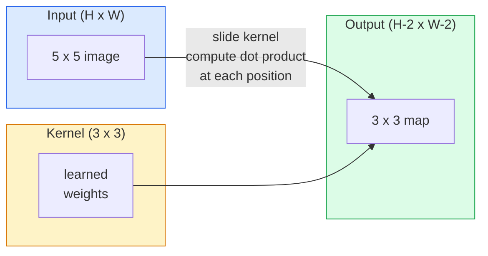
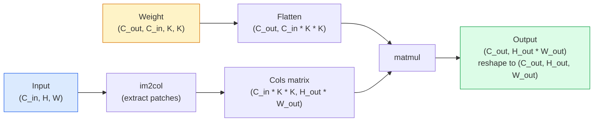

# Baştan Başta Değişiklikler

> Bir kıvrım, bir görüntü üzerinden kaydırılan, her yerde aynı ağırlıkları paylaşan küçük yoğun bir katmandır.

**Type:** Build
**Languages:** Python
**Prerequisites:** Phase 3 (Deep Learning Core), Phase 4 Lesson 01 (Image Fundamentals)
**Time:** ~75 minutes

## Öğrenme Hedefleri

- Nested-loop versiyonu ve vektörlü bir versiyonu da dahil olmak üzere sadece NumPy kullanarak sıfırdan 2 boyutlu konvulsiyon uygulayın `im2col`versiyon
- Giriş boyutu, çekirdek boyutu, dolgu ve adımların herhangi bir kombinasyonu için çıkış alan boyutunu hesaplayın ve `(H - K + 2P) / S + 1`formül
- El tasarım çekirdekleri (kır, bulanık, keskin, Sobel) ve neden her birinin yaptığı etkinleştirme modelini ürettiğini açıklayın
- Bir özellik çıkarıcıya yığın dönüşümleri ve yığın derinliğini kabul alanının boyutuna bağlamak

## Sorun

224x224 RGB görüntüde tamamen bağlantılı bir katman, nörona 224 * 224 * 3 = 150.528 giriş ağırlığına ihtiyaç duyar. 1000 ünite olan bir gizli katman, yararlı bir şey öğrenmeden önce 150 milyon parametre. Daha da kötüsü, bu katman, yukarı solda bir köpeğin ve alt sağda bir köpeğin aynı kalıp olduğunu düşünmüyor. Her piksel pozisyonunu bağımsız olarak değerlendirir, bu da görüntüler için tam olarak yanlış: Bir kedinin üç pikselle çevrilmesi ağı kavramı yeniden öğrenmeye zorlamamalı.

Bir görüntü modeli için gerekli olan iki özellik **translation equivariance**(çıkış değişimi giriş değişimiyle birlikte değişir) ve **parameter sharing**Sık katmanlar size hiçbirini vermez. Konvolisyon size her ikisini de ücretsiz verir.

Konvolusiyon derin öğrenme için icat edilmedi. JPEG sıkıştırmasını, Photoshop'ta Gaussian blur, endüstriyel vizyonda kenar algılama ve şimdiye kadar gönderilen her ses filtresiyle güçlendiren aynı işlemdir. CNN'lerin 2012-2020 yılları arasında ImageNet'e egemen olmasının nedeni, konvolusiyon yakın değerlerin ilişkili olduğu ve aynı kalıpın herhangi bir yerde görülebileceği veriler için doğru önlemdir.

## Anlaşım

### Bir çekirdek, kaydırılır

2 boyutlu bir konvolusiyon çekirdeği (veya filtre) olarak adlandırılan küçük bir ağırlık matrisini alır, giriş üzerinden kaydırır ve her yerde element bilge ürünlerin toplamını hesaplar. Bu toplam bir çıkış piksel haline gelir.



5x5 giriş üzerinde beton 3x3 örneği (toplama yok, adım 1):

```
Input X (5 x 5):                Kernel W (3 x 3):

  1  2  0  1  2                   1  0 -1
  0  1  3  1  0                   2  0 -2
  2  1  0  2  1                   1  0 -1
  1  0  2  1  3
  2  1  1  0  1

The kernel slides across every valid 3 x 3 window. Output Y is 3 x 3:

 Y[0,0] = sum( W * X[0:3, 0:3] )
 Y[0,1] = sum( W * X[0:3, 1:4] )
 Y[0,2] = sum( W * X[0:3, 2:5] )
 Y[1,0] = sum( W * X[1:4, 0:3] )
 ... and so on
```

Bu tek formül  **shared weights, locality, sliding window**Diğer her şey muhasebe.

### Çıktıran boyut formülü

Giriş alanının büyüklüğü göz önüne alındığında `H`, çekirdek boyutu `K`, dolandırıcılık`P`, adım at `S`- ...

```
H_out = floor( (H - K + 2P) / S ) + 1
```

Bunu ezberleyin. Arsitektur başına onlarca kez hesaplayacaksınız.

| Scenario | H | K | P | S | H_out |
|----------|---|---|---|---|-------|
| Valid conv, no padding | 32 | 3 | 0 | 1 | 30 |
| Same conv (preserves size) | 32 | 3 | 1 | 1 | 32 |
| Downsample by 2 | 32 | 3 | 1 | 2 | 16 |
| Pool 2x2 | 32 | 2 | 0 | 2 | 16 |
| Large receptive field | 32 | 7 | 3 | 2 | 16 |

"Eşit doldurma" demek, H_out == H olarak seçmek anlamına gelir. S == 1. Eşsiz K için, bu P = (K - 1) / 2.

### Çekme

Yükleme olmadan, her kıvrım özellik haritasını küçültür. 20'i yığarak 224x224 görüntü 184x184 olur. Bu sınırdaki hesaplamaları boşa çıkarır ve eşleşen şekiller gerektiren kalan bağlantıları karmaşıklaştırır.

```
Zero padding (P = 1) on a 5 x 5 input:

  0  0  0  0  0  0  0
  0  1  2  0  1  2  0
  0  0  1  3  1  0  0
  0  2  1  0  2  1  0       Now the kernel can centre on pixel
  0  1  0  2  1  3  0       (0, 0) and still have three rows and
  0  2  1  1  0  1  0       three columns of values to multiply.
  0  0  0  0  0  0  0
```

Pratikte karşılaştığınız modlar:`zero`(en yaygın), `reflect`(sırın aynası, üreticilerdeki sert sınırlardan kaçınır),`replicate`(Konu kopyalayın), `circular`(turoidal sorunlarda kullanılır).

### İlerleme

İlerleme, slaytın adım boyutudur. `stride=1`- Default.`stride=2`Bu, uzay boyutlarını yarıya çıkarır ve CNN'nin içindeki örnekleri ayrı bir birleştirme katmanı olmadan indirmek için klasik bir yoldur.

```
Stride 1 on a 5 x 5 input, 3 x 3 kernel:

  starts: (0,0) (0,1) (0,2)        -> output row 0
          (1,0) (1,1) (1,2)        -> output row 1
          (2,0) (2,1) (2,2)        -> output row 2

  Output: 3 x 3

Stride 2 on the same input:

  starts: (0,0) (0,2)              -> output row 0
          (2,0) (2,2)              -> output row 1

  Output: 2 x 2
```

### Çoklu giriş kanalları

Gerçek görüntüler üç kanaldan oluşur. RGB girişindeki 3x3 konvoluyonu aslında 3x3x3 hacmi: giriş kanalına bir 3x3 dilim. Her uzaylı pozisyonda, üç dilim boyunca çarpır ve toplam yaparak bir önyargı eklersiniz.

```
Input:   (C_in,  H,  W)        3 x 5 x 5
Kernel:  (C_in,  K,  K)        3 x 3 x 3 (one kernel)
Output:  (1,     H', W')       2D map

For a layer that produces C_out output channels, you stack C_out kernels:

Weight:  (C_out, C_in, K, K)   e.g. 64 x 3 x 3 x 3
Output:  (C_out, H', W')       64 x 3 x 3

Parameter count: C_out * C_in * K * K + C_out   (the + C_out is biases)
```

Bu son satır bir model planladığınızda hesaplayacağınız satırdır.`64 * 3 * 3 * 3 + 64 = 1,792`Parametre.

### İm2col numarası

Yuvalar kolayca okunur ama yavaş. GPU'lar büyük matris çarpımlarını ister. Trick: girişin her kabul alan penceresini büyük bir matrisin bir sütununa düzeltmek, çekirdeği bir sıra haline getirmek ve tüm kıvrım tek bir matmul haline gelir.



Her üretim conv uygulaması bu artı önbelleği-tıllama hilelerinin bir çeşitidir (büyük çekirdekler için doğrudan conv, Winograd, FFT conv). im2col'u anlayın ve çekirdeği anlarsınız.

### Alıcı alan

Tek 3x3 konvoy 9 giriş pikselini görür. iki 3x3 konvoyunu yığar ve ikinci katmadaki bir nöron 5x5 giriş pikselini görür.

```
RF after L stacked K x K convs (stride 1) = 1 + L * (K - 1)

With strides:   RF grows multiplicatively with stride along each layer.
```

"3x3 tüm aşağıya kadar" çalışmasının tüm nedeni (VGG, ResNet, ConvNeXt) iki 3x3 konvoyunun bir 5x5 konvoy ile aynı giriş alanını görmesidir ancak daha az parametreler ve aralarında ekstra bir çizgizliği vardır.

```figure
convolution-kernel
```

## Yapın

### Adım 1: Array'ı kapat

En küçük primitif ile başlayın: H x W dizisi etrafında sıfırlarla dolanan bir fonksiyon.

```python
import numpy as np

def pad2d(x, p):
    if p == 0:
        return x
    h, w = x.shape[-2:]
    out = np.zeros(x.shape[:-2] + (h + 2 * p, w + 2 * p), dtype=x.dtype)
    out[..., p:p + h, p:p + w] = x
    return out

x = np.arange(9).reshape(3, 3)
print(x)
print()
print(pad2d(x, 1))
```

Arka yastık hilesi .`x.shape[:-2]`Aynı fonksiyon üzerinde çalışır `(H, W)`- Evet .`(C, H, W)`veya`(N, C, H, W)`Değişiklik yapmadan.

### Adım 2: 2D sarmalıklarla sarmalık

Referans uygulanması  yavaş ama net.`torch.nn.functional.conv2d`- İlke olarak öyle.

```python
def conv2d_naive(x, w, b=None, stride=1, padding=0):
    c_in, h, w_in = x.shape
    c_out, c_in_w, kh, kw = w.shape
    assert c_in == c_in_w

    x_pad = pad2d(x, padding)
    h_out = (h + 2 * padding - kh) // stride + 1
    w_out = (w_in + 2 * padding - kw) // stride + 1

    out = np.zeros((c_out, h_out, w_out), dtype=np.float32)
    for oc in range(c_out):
        for i in range(h_out):
            for j in range(w_out):
                hs = i * stride
                ws = j * stride
                patch = x_pad[:, hs:hs + kh, ws:ws + kw]
                out[oc, i, j] = np.sum(patch * w[oc])
        if b is not None:
            out[oc] += b[oc]
    return out
```

Dört yuva (çıkış kanalı, satır, sütun, artı içerikli toplam C_in, kh, kw). Bu her hızlı uygulamanın karşısında kontrol edeceğiniz temel gerçekliktir.

### Adım 3: El tasarımı çekirdeği ile doğrulama

Dök bir Sobel çekirdeği yapın, sentetik bir adım görüntüsüne uygulayın ve dik kenarın aydınlanmasını izleyin.

```python
def synthetic_step_image():
    img = np.zeros((1, 16, 16), dtype=np.float32)
    img[:, :, 8:] = 1.0
    return img

sobel_x = np.array([
    [[-1, 0, 1],
     [-2, 0, 2],
     [-1, 0, 1]]
], dtype=np.float32)[None]

x = synthetic_step_image()
y = conv2d_naive(x, sobel_x, padding=1)
print(y[0].round(1))
```

7. sütunda büyük pozitif değerler bekleyin (soldan sağa parlaklık artışı) ve diğer yerlerde sıfırlar.

### Adım 4: im2col

Girişteki her çekirdek büyüklüğündeki pencereni bir matris sütununa dönüştürün.`C_in=3, K=3`, her sütun 27 numara.

```python
def im2col(x, kh, kw, stride=1, padding=0):
    c_in, h, w = x.shape
    x_pad = pad2d(x, padding)
    h_out = (h + 2 * padding - kh) // stride + 1
    w_out = (w + 2 * padding - kw) // stride + 1

    cols = np.zeros((c_in * kh * kw, h_out * w_out), dtype=x.dtype)
    col = 0
    for i in range(h_out):
        for j in range(w_out):
            hs = i * stride
            ws = j * stride
            patch = x_pad[:, hs:hs + kh, ws:ws + kw]
            cols[:, col] = patch.reshape(-1)
            col += 1
    return cols, h_out, w_out
```

Hala Python bir döngüsü ama artık ağır yükleme tek vektörlü bir matmul olacak.

### Adım 5: Im2col + matmul üzerinden hızlı bir şekilde kon.

Dörtlü döngüyü bir matris çarpımı ile değiştirin.

```python
def conv2d_im2col(x, w, b=None, stride=1, padding=0):
    c_out, c_in, kh, kw = w.shape
    cols, h_out, w_out = im2col(x, kh, kw, stride, padding)
    w_flat = w.reshape(c_out, -1)
    out = w_flat @ cols
    if b is not None:
        out += b[:, None]
    return out.reshape(c_out, h_out, w_out)
```

Doğruluğu kontrol etmek: her iki uygulamayı da çalıştırın ve karşılaştırın.

```python
rng = np.random.default_rng(0)
x = rng.normal(0, 1, (3, 16, 16)).astype(np.float32)
w = rng.normal(0, 1, (8, 3, 3, 3)).astype(np.float32)
b = rng.normal(0, 1, (8,)).astype(np.float32)

y_naive = conv2d_naive(x, w, b, padding=1)
y_im2col = conv2d_im2col(x, w, b, padding=1)

print(f"max abs diff: {np.max(np.abs(y_naive - y_im2col)):.2e}")
```

`max abs diff`Etrafta olmalı .`1e-5`Fark, kaygan nokta birikimi sırası, bir hata değil.

### Adım 6: El tasarımı yapılmış çekirdekler bankası

Bir tek konfor katmanının herhangi bir eğitimden önce ne ifade edebileceğini gösteren beş filtre.

```python
KERNELS = {
    "identity": np.array([[0, 0, 0], [0, 1, 0], [0, 0, 0]], dtype=np.float32),
    "blur_3x3": np.ones((3, 3), dtype=np.float32) / 9.0,
    "sharpen": np.array([[0, -1, 0], [-1, 5, -1], [0, -1, 0]], dtype=np.float32),
    "sobel_x": np.array([[-1, 0, 1], [-2, 0, 2], [-1, 0, 1]], dtype=np.float32),
    "sobel_y": np.array([[-1, -2, -1], [0, 0, 0], [1, 2, 1]], dtype=np.float32),
}

def apply_kernel(img2d, kernel):
    x = img2d[None].astype(np.float32)
    w = kernel[None, None]
    return conv2d_im2col(x, w, padding=1)[0]
```

Her türlü gri ölçekli görüntüye uygulanır, bulanıklaşır, keskin kenarları yükseltir, Sobel-x dikey kenarları aydınlatır, Sobel-y yatay kenarları aydınlatır. Bunlar AlexNet ve VGG'deki * ilk* eğitilmiş konfor katmanının öğrendiği  gibi desenlerdir. Çünkü iyi bir görüntü modeli, daha sonra ne iş olursa olsun kenar ve pürüzük algılayıcılarına ihtiyaç duyar.

## Kullan

PyTorch'in `nn.Conv2d`Bu işlem aynı işlemleri otomatik derecede, CUDA çekirdekleri ve cuDNN optimizasyonu ile tamamlıyor.

```python
import torch
import torch.nn as nn

conv = nn.Conv2d(in_channels=3, out_channels=64, kernel_size=3, stride=1, padding=1)
print(conv)
print(f"weight shape: {tuple(conv.weight.shape)}   # (C_out, C_in, K, K)")
print(f"bias shape:   {tuple(conv.bias.shape)}")
print(f"param count:  {sum(p.numel() for p in conv.parameters())}")

x = torch.randn(8, 3, 224, 224)
y = conv(x)
print(f"\ninput  shape: {tuple(x.shape)}")
print(f"output shape: {tuple(y.shape)}")
```

Değişme`padding=1`için`padding=0`ve çıkış 222x222'e düşer.`stride=1`için`stride=2`Ve 112x112'ye düşer. Yukarıda ezberlediğiniz formül.

## Gönder

Bu ders şunları ortaya çıkarır:

- `outputs/prompt-cnn-architect.md` giriş boyutunu, parametre bütçesini ve hedef alıcı alanı göz önüne alındığında, bir yığın tasarlayan bir istek `Conv2d`her adımda doğru K/S/P ile katmanlar.
- `outputs/skill-conv-shape-calculator.md` Bir ağ spesifikasyonını katman katman olarak yürüten ve her blok için çıkış şeklini, kabul alanını ve parametreler sayısını geri veren bir beceri.

## Egzersizler

1. **(Easy)**128x128 gri ölçekli giriş ve bir yığın `[Conv3x3(s=1,p=1), Conv3x3(s=2,p=1), Conv3x3(s=1,p=1), Conv3x3(s=2,p=1)]`, her katmanın çıkış alanının boyutunu ve kabul alanını el ile hesaplayın.`nn.Sequential`- Yapay konvoylar.
2. **(Medium)**Uzaklaştırma`conv2d_naive`ve `conv2d_im2col`Bir `groups`- Bunu göster.`groups=C_in=C_out`derinlik açısından bir kıvrım üretir ve parametrelerinin sayısının `C * K * K`yerine`C * C * K * K`- Evet .
3. **(Hard)**  Geriye geçiş uygulaması`conv2d_im2col`El ile: çıkış gradiyenti verildiğinde, `x`ve `w`- Kontrol et .`torch.autograd.grad`İ2col'un eğilimi,`col2im`, ve üst üste duran pencereleri toplamak zorunda.

## Anahtar Terimler

| Term | What people say | What it actually means |
|------|----------------|----------------------|
| Convolution | "Sliding a filter" | A learnable dot product applied at every spatial location with shared weights; mathematically a cross-correlation, but everyone calls it convolution |
| Kernel / filter | "The feature detector" | A small weight tensor of shape (C_in, K, K) whose dot product with a window of input produces one output pixel |
| Stride | "How far you jump" | The step size between consecutive kernel placements; stride 2 halves each spatial dimension |
| Padding | "Zeros on the edges" | Extra values added around the input so the kernel can centre on border pixels; `same` padding keeps output size equal to input size |
| Receptive field | "How much the neuron sees" | The patch of original input that a given output activation depends on, growing with depth and stride |
| im2col | "The GEMM trick" | Rearranging every receptive window into columns so convolution becomes one big matrix multiply — the core of every fast conv kernel |
| Depthwise conv | "One kernel per channel" | A conv with `groups == C_in`, computing each output channel from only its matching input channel; the backbone of MobileNet and ConvNeXt |
| Translation equivariance | "Shift in, shift out" | Property that shifting the input by k pixels shifts the output by k pixels; comes for free with shared weights |

## Daha Fazla Okumak

- [A guide to convolution arithmetic for deep learning (Dumoulin & Visin, 2016)](https://arxiv.org/abs/1603.07285) her ders sessizce kopyaladığı dolgu/ adım/ genişleme sonlu şablonları
- [CS231n: Convolutional Neural Networks for Visual Recognition](https://cs231n.github.io/convolutional-networks/) orijinal im2col açıklaması dahil olmak üzere kanonik ders notları
- [The Annotated ConvNet (fast.ai)](https://nbviewer.org/github/fastai/fastbook/blob/master/13_convolutions.ipynb) Elden kıvrımdan eğitimli bir rakam sınıflandırıcıya giden bir defter
- [Receptive Field Arithmetic for CNNs (Dang Ha The Hien)](https://distill.pub/2019/computing-receptive-fields/) kapsamlı alan hesaplamalarının kağıt kalitesi ile etkileşimli açıklayıcı
