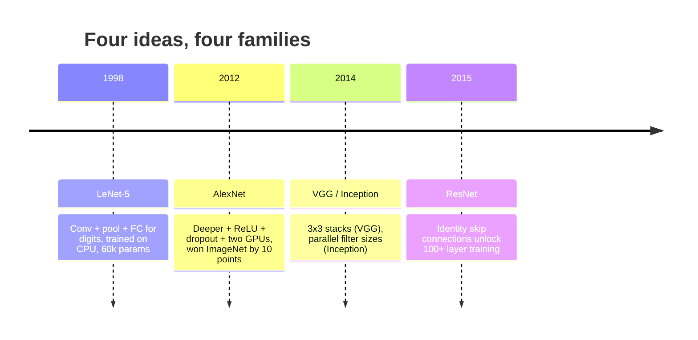
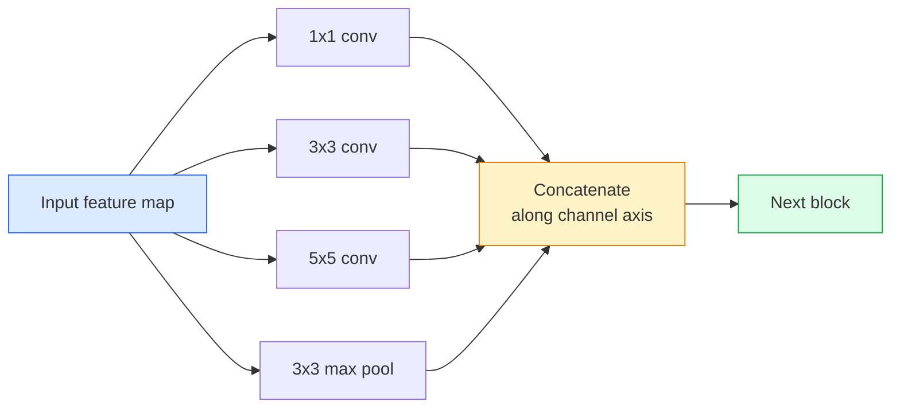
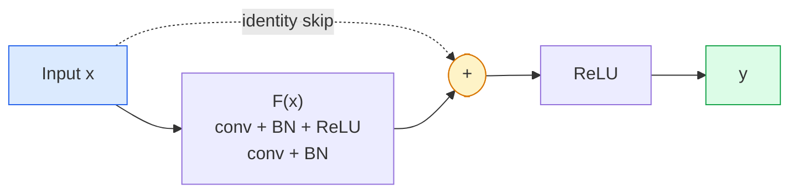

# CNN'ler  LeNet'e ResNet'e

> Son otuz yılın her büyük CNN'i aynı konvansiyonu ile aynı bir yeni fikirle birlikte.

**Type:** Learn + Build
**Languages:** Python
**Prerequisites:** Phase 3 Lesson 11 (PyTorch), Phase 4 Lesson 01 (Image Fundamentals), Phase 4 Lesson 02 (Convolutions from Scratch)
**Time:** ~75 minutes

## Öğrenme Hedefleri

- LeNet-5 -> AlexNet -> VGG -> Başlangıç -> ResNet mimari soyunu izleyin ve her aileye katılan tek yeni fikri belirtin
- PyTorch'te LeNet-5 uygulaması, VGG tarzı bir blok ve ResNet BasicBlock, her biri 40 satırın altında
- Geri kalan bağlantılar neden 1.000 katmanlı bir ağı eğitimsizden en son teknolojiye dönüştürdüğünü açıklayın.
- Modern bir omurganı okuyun (ResNet-18, ResNet-50) ve kaynağa bakmadan önce çıkış şeklini, kabul alanını ve parametrelerin sayısını tahmin edin

## Sorun

2011'de en iyi ImageNet sınıflandırıcısı %74 arasında en iyi 5 doğruluk elde etti. 2012 yılında AlexNet %85 puan aldı. ResNet'in 2015 yılında yüzde 96 puanı vardı. Yeni veriler yok. Yeni GPU nesil yok. Kazançlar mimari fikirlerden geldi. Çalışan bir vizyon mühendisi hangi kağıttan hangi fikir geldiğini bilmeli çünkü 2026'da gönderdiğiniz her üretim omurgası aynı parçaların bir yeniden birleşimidir  ve fikirler sürekli aktarılmaktadır: gruplandırılmış konvoylar CNN'lerden transformatörlere, kalan bağlantılar ResNet'ten var olan her LLM'ye geçti, parti normallaşması difüzyon modellerinde yaşar.

Bu ağları incelemek aynı zamanda yaygın bir hata karşılığını sağlar: LeNet büyüklüğündeki bir ağın sorunu çözeceği en büyük mevcut modelin ulaşılması. MNIST'in ResNet'e ihtiyacı yoktur.

## Anlaşım

### Görüşü değiştiren dört fikir



Klasik görme alanında bu dört atlayış kadar önemli bir şey yoktu.

### LeNet-5 (1998)

Yann LeCun'un rakam tanıtıcısı. 60.000 parametre. İki konfor havuzu blokları, iki tamamen bağlantılı katman, tanh etkinleştirmeleri.

```
input (1, 32, 32)
  conv 5x5 -> (6, 28, 28)
  avg pool 2x2 -> (6, 14, 14)
  conv 5x5 -> (16, 10, 10)
  avg pool 2x2 -> (16, 5, 5)
  flatten -> 400
  dense -> 120
  dense -> 84
  dense -> 10
```

Modern dünya CNN'e  değişik dönüşümler ve küçük sınıflandırıcı başı  ile beslenme örneklemesi diyen her şey LeNet daha fazla katman, daha büyük kanallar ve daha iyi etkinleştirmeler ile.

### AlexNet (2012)

ImageNet'i birleştiren üç değişiklik:

1. **ReLU**Bu yüzden, bu kadar çok şey yapmamalıyız.
2. **Dropout**Düzenleştiricilik bir hile değil, bir katman olur.
3. **Depth and width**Beş katman, üç katman, 60M parametreleri, iki GPU'da eğitilmiş ve model bölünmüş.

Kağıtın 2. Şekili hala GPU'yu iki paralel akış olarak ayırır. Bu paralellik bir donanım çözümüydi, mimari bir anlayış değil  ama yukarıdaki üç fikir hala kullandığınız her modelde var.

### VGG (2014)

VGG sordu: Sadece 3x3 kıvrımları kullanırsanız ne olur ve derinlere giderseniz?

```
stack:   conv 3x3 -> conv 3x3 -> pool 2x2
repeat:  16 or 19 conv layers
```

İki 3x3 konvoy aynı 5x5 giriş alanını bir 5x5 konvoy olarak görür, ancak daha az parametrelerle (2 * 9 * C^2 = 18C^2 vs 25 * C^2) ve aralarında ekstra bir ReLU ile. VGG bu gözlemini tüm bir mimari haline getirdi.

Masraf: 138M parametre, yavaş çalıştırılır, sonuçlama için pahalı.

### Başlangıç (2014, aynı yıl)

Google'ın "ne tür bir çekirdek boyutu kullanmalıyım?" sorusuna verdiği cevap: hepsi paralel olarak.



Her dal kanal karıştırma için 1x1, yerel doku için 3x3, daha büyük desenler için 5x5, değişim değişmeyen özellikler için birleştirme için  ve konkat, bir sonraki katmanın hangi dalı kullanışlı olduğunu seçmesine izin verir. Başlangıç v1 parametre sayısını akılda tutmak için her dalın içinde 1x1 sarsıntıları bir şişlik olarak kullanmıştır.

### Degrasyon sorunu

2015 yılına gelindiğinde VGG-19 işe yaradı ve VGG-32 işe yaramadı. Derinlik yardımcı olması gerekiyordu, ancak ~ 20 kat daha sonra hem eğitim hem de test kaybı kötüleşti. Bu aşırı uygun değil. Bu, optimizeci yararlı ağırlıkları bulmayı başarısız eder çünkü gradientler her kat boyunca çarpıcı olarak küçülür.

```
Plain deep network:
  y = f_L( f_{L-1}( ... f_1(x) ... ) )

Gradient wrt early layer:
  dL/dW_1 = dL/dy * df_L/df_{L-1} * ... * df_2/df_1 * df_1/dW_1

Each multiplicative term has magnitude roughly (weight magnitude) * (activation gain).
Stack 100 of them with gains < 1 and the gradient is effectively zero.
```

VGG, 19 katman üzerinde çalıştı çünkü parti normı (bir arada yayınlanan) etkinleştirmeleri iyi ölçeklendirdi.

### ResNet (2015)

O, Zhang, Ren, Sun her şeyi düzelten bir değişiklik önerdi:

```
standard block:   y = F(x)
residual block:   y = F(x) + x
```

- Evet .`+ x`Yani katman her zaman araba kullanarak hiçbir şey yapmayı seçebilir.`F(x)`Bu yüzden, bu sistemin en iyi yönü, her blokun *bir miktar* yararlı olmasını ve 100 kez yığılmış olarak, biraz yararlı olmasını sağlayacaktır.



Her yerde iki çeşit blok görünebilir:

- **BasicBlock**ResNet-18, ResNet-34: İki 3x3 konvoy, her ikisini de atlayın.
- **Bottleneck**ResNet-50, -101, -152): 1x1 aşağı, 3x3 orta, 1x1 yukarı, üçlüyi atlayın.

Atlamak bir aşağı örnek (adım = 2) geçmesi gerektiğinde, kimlik yolu şekillerle eşleşmek için 1x1 adım = 2 konvoy ile değiştirilir.

### Geri kalanların neden görme gücünün ötesinde önemli olduğu

Bu fikir aslında görüntü sınıflandırması değildi. Bu derin ağları "barmakların çaprazından ve umud gradientleri hayatta kalmak"dan güvenilir, ölçeklenebilir bir mühendislik aracı haline getirmekle ilgiliydi.

```figure
pooling
```

## Yapın

### Adım 1: LeNet-5

Tanh aktivasyonları, ortalama birleştirme.`nn.CrossEntropyLoss`Orijinal Gaussian bağlantılarının yerine akıntıda.

```python
import torch
import torch.nn as nn
import torch.nn.functional as F

class LeNet5(nn.Module):
    def __init__(self, num_classes=10):
        super().__init__()
        self.conv1 = nn.Conv2d(1, 6, kernel_size=5)
        self.conv2 = nn.Conv2d(6, 16, kernel_size=5)
        self.pool = nn.AvgPool2d(2)
        self.fc1 = nn.Linear(16 * 5 * 5, 120)
        self.fc2 = nn.Linear(120, 84)
        self.fc3 = nn.Linear(84, num_classes)

    def forward(self, x):
        x = self.pool(torch.tanh(self.conv1(x)))
        x = self.pool(torch.tanh(self.conv2(x)))
        x = torch.flatten(x, 1)
        x = torch.tanh(self.fc1(x))
        x = torch.tanh(self.fc2(x))
        return self.fc3(x)

net = LeNet5()
x = torch.randn(1, 1, 32, 32)
print(f"output: {net(x).shape}")
print(f"params: {sum(p.numel() for p in net.parameters()):,}")
```

Beklenen üretim: `output: torch.Size([1, 10])`- Evet .`params: 61,706`Bu, modern vizyonun başlangıcı olan tüm rakam sınıflandırıcısı.

### Adım 2: VGG blok

Tekrar kullanılabilir blok: iki 3x3 konvoy, ReLU, parti norm, maksimum havuz.

```python
class VGGBlock(nn.Module):
    def __init__(self, in_c, out_c):
        super().__init__()
        self.conv1 = nn.Conv2d(in_c, out_c, kernel_size=3, padding=1)
        self.bn1 = nn.BatchNorm2d(out_c)
        self.conv2 = nn.Conv2d(out_c, out_c, kernel_size=3, padding=1)
        self.bn2 = nn.BatchNorm2d(out_c)
        self.pool = nn.MaxPool2d(2)

    def forward(self, x):
        x = F.relu(self.bn1(self.conv1(x)))
        x = F.relu(self.bn2(self.conv2(x)))
        return self.pool(x)

class MiniVGG(nn.Module):
    def __init__(self, num_classes=10):
        super().__init__()
        self.stack = nn.Sequential(
            VGGBlock(3, 32),
            VGGBlock(32, 64),
            VGGBlock(64, 128),
        )
        self.head = nn.Sequential(
            nn.AdaptiveAvgPool2d(1),
            nn.Flatten(),
            nn.Linear(128, num_classes),
        )

    def forward(self, x):
        return self.head(self.stack(x))

net = MiniVGG()
x = torch.randn(1, 3, 32, 32)
print(f"output: {net(x).shape}")
print(f"params: {sum(p.numel() for p in net.parameters()):,}")
```

CIFAR büyüklüğündeki giriş üzerinde üç VGG blok, adaptatif bir havuz, bir çizgi katman. ~290k parametreleri. CIFAR-10 için yeterli.

### Adım 3: ResNet BasicBlock

ResNet-18 ve ResNet-34'ün temel yapı taşı.

```python
class BasicBlock(nn.Module):
    def __init__(self, in_c, out_c, stride=1):
        super().__init__()
        self.conv1 = nn.Conv2d(in_c, out_c, kernel_size=3, stride=stride, padding=1, bias=False)
        self.bn1 = nn.BatchNorm2d(out_c)
        self.conv2 = nn.Conv2d(out_c, out_c, kernel_size=3, stride=1, padding=1, bias=False)
        self.bn2 = nn.BatchNorm2d(out_c)
        if stride != 1 or in_c != out_c:
            self.shortcut = nn.Sequential(
                nn.Conv2d(in_c, out_c, kernel_size=1, stride=stride, bias=False),
                nn.BatchNorm2d(out_c),
            )
        else:
            self.shortcut = nn.Identity()

    def forward(self, x):
        out = F.relu(self.bn1(self.conv1(x)))
        out = self.bn2(self.conv2(out))
        out = out + self.shortcut(x)
        return F.relu(out)
```

`bias=False`Bu nedenle, bu konfor kısıtlamaları da bir atık.`shortcut`Sadece adım veya kanal sayısının değişmesi durumunda gerçek bir konuma ihtiyaç duyulur; aksi takdirde bu bir işleme yapılmaz kimliktir.

### Dördüncü adım: Küçük bir ResNet

CIFAR büyüklüğündeki girişler için çalışan bir ResNet elde etmek için BasicBlocks'in dört grubu yığılsın.

```python
class TinyResNet(nn.Module):
    def __init__(self, num_classes=10):
        super().__init__()
        self.stem = nn.Sequential(
            nn.Conv2d(3, 32, kernel_size=3, stride=1, padding=1, bias=False),
            nn.BatchNorm2d(32),
            nn.ReLU(inplace=True),
        )
        self.layer1 = self._make_group(32, 32, num_blocks=2, stride=1)
        self.layer2 = self._make_group(32, 64, num_blocks=2, stride=2)
        self.layer3 = self._make_group(64, 128, num_blocks=2, stride=2)
        self.layer4 = self._make_group(128, 256, num_blocks=2, stride=2)
        self.head = nn.Sequential(
            nn.AdaptiveAvgPool2d(1),
            nn.Flatten(),
            nn.Linear(256, num_classes),
        )

    def _make_group(self, in_c, out_c, num_blocks, stride):
        blocks = [BasicBlock(in_c, out_c, stride=stride)]
        for _ in range(num_blocks - 1):
            blocks.append(BasicBlock(out_c, out_c, stride=1))
        return nn.Sequential(*blocks)

    def forward(self, x):
        x = self.stem(x)
        x = self.layer1(x)
        x = self.layer2(x)
        x = self.layer3(x)
        x = self.layer4(x)
        return self.head(x)

net = TinyResNet()
x = torch.randn(1, 3, 32, 32)
print(f"output: {net(x).shape}")
print(f"params: {sum(p.numel() for p in net.parameters()):,}")
```

Her iki bloktan oluşan dört grup. 2, 3, 4 grupların başında 2. adım. Her aşağı örnekte kanal sayısı iki katına çıkar. Yaklaşık 2.8M parametreler.

### Adım 5: Parametre ile özellik verimliliğini karşılaştır

Üç ağda aynı girişleri çalıştırın ve parametrelerin sayısını karşılaştırın.

```python
def summary(name, net, x):
    y = net(x)
    params = sum(p.numel() for p in net.parameters())
    print(f"{name:12s}  input {tuple(x.shape)} -> output {tuple(y.shape)}  params {params:>10,}")

x = torch.randn(1, 3, 32, 32)
summary("LeNet5",     LeNet5(),       torch.randn(1, 1, 32, 32))
summary("MiniVGG",    MiniVGG(),      x)
summary("TinyResNet", TinyResNet(),   x)
```

CIFAR-10 doğruluğu için yaklaşık olarak: LeNet 60%, MiniVGG 89%, TinyResNet 93% birkaç eğitim döneminden sonra.

## Kullan

`torchvision.models`Bu, yukarıdaki tümlerin önceden eğitilmiş versiyonlarını verir.

```python
from torchvision.models import resnet18, ResNet18_Weights, vgg16, VGG16_Weights

r18 = resnet18(weights=ResNet18_Weights.IMAGENET1K_V1)
r18.eval()

print(f"ResNet-18 params: {sum(p.numel() for p in r18.parameters()):,}")
print(r18.layer1[0])
print()

v16 = vgg16(weights=VGG16_Weights.IMAGENET1K_V1)
v16.eval()
print(f"VGG-16   params: {sum(p.numel() for p in v16.parameters()):,}")
```

ResNet-18'in 11.7M parametresi var. VGG-16'ın 138M. Aynı ImageNet top-1 doğruluğu (69.8% vs 71.6%). Geri kalan bağlantılar size 12x parametreler verimliliği kazanır. Bu nedenle ResNet'in değişikleri 2016'dan 2021'de ViT'ye kadar baskın olmuştur ve hala hesaplama engelli olduğu gerçek dünya dağıtımlarında baskın olmuştur.

Transfer öğrenimi için, tarif her zaman aynıdır: önceden eğitilmiş yük, omurganı dondurma, sınıflandırıcı başını değiştir.

```python
for p in r18.parameters():
    p.requires_grad = False
r18.fc = nn.Linear(r18.fc.in_features, 10)
```

Şimdi, ImageNet'in ödediği temsilleri miras alan 10 sınıflı bir CIFAR sınıflandırıcınız var.

## Gönder

Bu ders şunları ortaya çıkarır:

- `outputs/prompt-backbone-selector.md` verilen görev, veri kümesi boyutu ve hesaplama bütçesini belirleyen doğru CNN ailesini (LeNet/VGG/ResNet/MobileNet/ConvNeXt) seçen bir istek.
- `outputs/skill-residual-block-reviewer.md` PyTorch modülü okuyan ve bağlantı atlama hatalarını işaretleyen bir beceri (yolu değişiminde kısayol eksikliği, kısayol etkinleştirme sırası, eklenmeye göre BN yerleştirme).

## Egzersizler

1. **(Easy)**Parametreyi el ile say `TinyResNet`Katman katman.`sum(p.numel() for p in net.parameters())`Parametre bütçesinin çoğunluğu nereye gider?
2. **(Medium)**Botulyo blokunu uygulayın (1x1 -> 3x3 -> 1x1 atlamakla) ve onu CIFAR için ResNet-50 tarzında bir ağ oluşturmak için kullanın.`TinyResNet`- Evet .
3. **(Hard)** Çıkış bağlantısını kaldır`BasicBlock`CIFAR-10'da 34 bloklu "sırın" ağ ve 34 bloklu ResNet'i her biri 10 dönem boyunca çalıştırın. Her ikisi için de plan eğitim kaybı vs. dönem. He et al. Şekil 1 sonucu, düz derin ağın daha sığ ikizinden daha yüksek kaybı karşılaştığı zaman üretin.

## Anahtar Terimler

| Term | What people say | What it actually means |
|------|----------------|----------------------|
| Backbone | "The model" | The stack of convolutional blocks that produces the feature map fed to the task head |
| Residual connection | "Skip connection" | `y = F(x) + x`; lets the optimiser learn identity by setting F to zero, which makes arbitrary depth trainable |
| BasicBlock | "Two 3x3 convs with a skip" | The ResNet-18/34 building block: conv-BN-ReLU-conv-BN-add-ReLU |
| Bottleneck | "1x1 down, 3x3, 1x1 up" | The ResNet-50/101/152 block; cheap at high channel counts because the 3x3 runs on a reduced width |
| Degradation problem | "Deeper is worse" | Past ~20 plain conv layers, both training and test error increase; solved by residual connections, not by more data |
| Stem | "The first layer" | The initial conv that converts 3-channel input into the base feature width; usually 7x7 stride 2 for ImageNet, 3x3 stride 1 for CIFAR |
| Head | "The classifier" | The layers after the final backbone block: adaptive pool, flatten, linear(s) |
| Transfer learning | "Pretrained weights" | Loading a backbone trained on ImageNet and fine-tuning only the head on your task |

## Daha Fazla Okumak

- [Deep Residual Learning for Image Recognition (He et al., 2015)](https://arxiv.org/abs/1512.03385)ResNet makalesi; her rakamın incelemeye değer
- [Very Deep Convolutional Networks (Simonyan & Zisserman, 2014)](https://arxiv.org/abs/1409.1556) VGG kağıdı; hala "neden 3x3" için en iyi referans
- [ImageNet Classification with Deep CNNs (Krizhevsky et al., 2012)](https://papers.nips.cc/paper_files/paper/2012/hash/c399862d3b9d6b76c8436e924a68c45b-Abstract.html) AlexNet; el yapımı özellik çağını sona erdiren kağıt
- [Going Deeper with Convolutions (Szegedy et al., 2014)](https://arxiv.org/abs/1409.4842) Başlangıç v1; hala görme transformörlerinde görünen paralel filtre fikri
