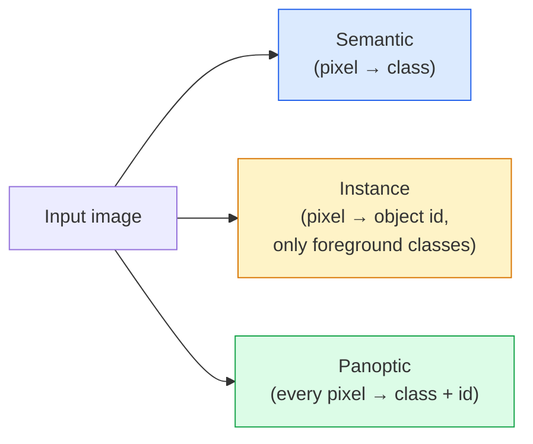
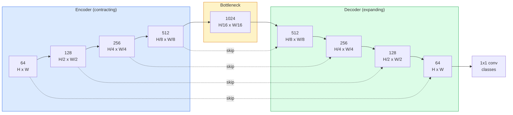

# Semantik Segmentasyon  U-Net

> Segmentasyon, her pikselde sınıflandırma. U-Net, aşağı örnekleme kodlayıcısını yukarı örnekleme dekodleyicisi ile eşleştirerek ve aralarındaki bağlantıları kablolamayı başarır.

**Type:** Build
**Languages:** Python
**Prerequisites:** Phase 4 Lesson 03 (CNNs), Phase 4 Lesson 04 (Image Classification)
**Time:** ~75 minutes

## Öğrenme Hedefleri

- Semantik, örnek ve panoptik bölünme ayırt edin ve verilen bir sorun için doğru görevi seçin
- PyTorch'te kodlayıcı blokları, bir şişe boynusu, transpose konvulsiyonları olan bir dekodörle U-Net'i sıfırdan oluşturun ve bağlantıları atlayın
- Piksel-biçimli çapraz entropi, Dice kaybı ve tıbbi ve endüstriyel segmentasyon için mevcut standart olan kombinasyon kaybını uygulayın
- Sınıf başına IoU ve Dice ölçümlerini okuyun ve küçük nesnelerin hatırlanması, sınır doğruluğu veya sınıf dengesizliği nedeniyle kötü bir puan elde edildiğini teşhis edin

## Sorun

Sınıflandırma, görüntü başına bir etiket çıkardı. Deteksiyon görüntü başına bir avuç kutu çıkardı. Segmentaj, piksel başına bir etiket çıkardı. Büyüklük girimi için `H x W`, çıkış şekil tensörüdür .`H x W`(semantik) veya `H x W x N_instances`Bu, bir görüntü için milyonlarca tahmin, tek bir değil.

Bölümleme yapısı, neredeyse her yoğun tahmin görme ürünü güçlendirir: tıbbi görüntüleme (tümör maskesi), otonom sürüş (yolu, şerit, engelleme), uydu (binanın ayak izleri, ürün sınırları), belge analizleri (kaynaklama bölgeleri), robotik (kavgalama alanları).

Mimarlık sorunu açıklamak kolaydır ve çözülmek kolaydır: bir görüntüün küresel bağlamını (bu nasıl bir sahne) ve yerel piksel ayrıntılarını (tam olarak hangi piksel yol karşısında kaldırım) aynı anda görmesi için ağ gerekir.

## Anlaşım

### Semantik vs. örnek vs. panoptik



- **Semantic**"Bu piksel yol, o piksel araba". diyor.
- **Instance**"Bu piksel 3 numaralı bir araba, bu piksel 5 numaralı bir araba" diyor. Arka plan eşyalarını görmezden gelir ("şeriler" = gök, yol, ot).
- **Panoptic**her pixel bir sınıf etiketi alır, her örnek de benzersiz bir kimlik alır, her şey ve her şey her ikisi de bölünmüştür.

Bu ders semantik konuları kapsar.

### U-Net şekli



Kodlayıcı, uzay çözünürlüğünü dört kat ikiye katlar ve kanalları ikiye katlar. Dekoder tersine: uzay çözünürlüğünü dört kat ikiye katlar ve kanalları ikiye katlar. Atlamak bağlantıları her çözünürlükte dekoder özellikleriyle eşleşen kodlayıcı özelliklerini birleştirir.`64 -> num_classes`Tam çözünürlükte.

Neden atlamak bağlantıları gerekli: dekoder pixel düzeyde tahminler çıkarmaya çalışırken sadece küçük özellik haritalarını gördü. Atlamak olmadan kenarları doğru bir şekilde yerleştiremez çünkü bu bilgi koderde sıkıştırılmıştı. Atlamak bağlantıları ona yüksek çözünürlüklü özellik haritaları aşağı giderken hesaplanmış koder verir.

### Transposed vs. bilinear upsample

Dekodörün uzay boyutlarını genişletmesi gerekiyor.

- **Transposed convolution**(`nn.ConvTranspose2d`)  Öğrenilebilir örnek. Tarihsel U-Net varsayımlı.
- **Bilinear upsample + 3x3 conv** daha az eser, daha az parametreler, şimdi modern standart.

Her ikisi de vahşi bir ortamda ortaya çıkıyor. İlk U-Net için, binaylı daha güvenli.

### Bir piksel şebekesinde çapraz entropi

C sınıfları ile semantik segmentasyon için, model çıkışı `(N, C, H, W)`Hedef `(N, H, W)`Tüm sayılardaki sınıf kimlikleri ile.

```
Loss = mean over (n, h, w) of -log( softmax(logits[n, :, h, w])[target[n, h, w]] )
```

`F.cross_entropy`PyTorch'da bu şekli doğuştan kullanıyor.

### Çöp kaybı ve neden ihtiyacın var

Çarşı-entropik her pikselle eşit şekilde davranır. Bu, bir sınıf çerçeve üzerinde egemenlik gösterdiğinde yanlışdır (tıp görüntüleme: 99% arka plan, 1% tümör). Ağ her yerde arka plan tahmin ederek %99 doğruluk elde edebilir ve hala işe yaramaz.

Çöp kaybı bunu öngörülen ve gerçek maske arasındaki örtüşmeyi doğrudan optimize ederek çözüyor:

```
Dice(p, y) = 2 * sum(p * y) / (sum(p) + sum(y) + epsilon)
Dice_loss = 1 - Dice
```

nerede`p`bir sınıf için sigmoid/softmax olasılık haritasıdır ve `y`Bu da bir diğer deyişle, bir sınıfın eşitsizliği, bir sınıfın eşitsizliği, bir sınıfın eşitsizliği, bir sınıfın eşitsizliği, bir sınıfın eşitsizliği, bir sınıfın eşitsizliği, bir sınıfın eşitsizliği, bir sınıfın eşitsizliği, bir sınıfın eşitsizliği, bir sınıfın eşitsizliği, bir sınıfın eşitsizliği, bir sınıfın eşitsizliği, bir sınıfın eşitsizliği, bir sınıfın eşitsizliği, bir sınıfın eşitsizliği, bir sınıfın eşitsizliği, bir sınıfın eşitsizliği, bir sınıfın eşitsizliği, bir sınıfın eşitsizliği, bir sınıfın eşitsizliği, bir sınıfın eşitsizliği, bir sınıfın eşitliği, bir sınıfın eşitliği, bir sınıfın eşitliği, bir sınıfın eşitliği, bir sınıfın eşitliği, bir sınıfın eşitliği, bir sınıfın eşitliği, bir sınıfın eşitliği, bir sınıfın eşitliği, bir sınıfın eşitliği, bir sınıfın eşitliği, bir sınıfın eşitliği, bir sınıfın eşitliği, bir eşitliği, bir eşitliği, bir eşitliği, bir eşitliği, birliği, birikliği, birikliği, birikliği, birikliği, birikliği, birikliği, birikliği, birikliği, birikliği, birikliği, birikliği, birikliği, birikliği, birikliği, birikliği, birikliği, birikliği, birikliği, birliği, birikliği, birikliği,

Bu konuda **combined loss**- ...

```
L = L_cross_entropy + lambda * L_dice       (lambda ~ 1)
```

Çarşı entropi, eğitim başında istikrarlı dereceler verir; Dice, eğitim kuyruğunu aslında maske şekline eşleştirmeye odaklar. Bu kombinasyon tıbbi görüntüleme standartıdır ve herhangi bir sınıf dengesiz veri kümesinde yenilmek zor.

### Değerlendirme ölçümleri

- **Pixel accuracy**%2'nin doğru tahmin edildiği pikseller.
- **IoU per class** her sınıfın maskesinin birliği üzerinde kesişim; sınıflar arasındaki ortalama = mIoU.
- **Dice (F1 on pixels)** IoU'ya benzer; `Dice = 2 * IoU / (1 + IoU)`Tıp görüntülemeyi Dice, sürücü topluluğu IoU tercih eder.
- **Boundary F1** tahmin edilen sınırların yerçekimsel gerçeklik sınırlarına ne kadar yakın olduğunu ölçer, küçük değişikliklere bile cezalandırır.

Ortalama bir sınıf %15'te, dokuz sınıf %85'teyken gizlenir.

### Giriş çözümü pazarlaması

U-Net'in kodlayıcı çözünürlüğünü dört kat ikiye katlar, bu nedenle giriş 16 ile bölünebilir olmalıdır. Tıp görüntüleri genellikle 512x512 veya 1024x1024'dir.`H * W * C_max`, ve 1024x1024'e 1024 şişek boynuz kanalları ile ön geçiş zaten VRAM'ın gigabaytlarını kullanıyor.

İki standart çözüm yolu:
1. Girme  işlemi 256x256 kapsamlı ve dikişli kapsamlı kapsamlı kapsamlı kapsamlı.
2. Boğaz boğazını, boşluk çözünürlüğünü daha yüksek tutarak, ancak kabul alanını genişleten genişletilmiş sarsılmalarla değiştirin (DeepLab ailesi).

Birinci model için, 64 kanal tabanlı U-Net ile 256x256 giriş 8 GB VRAM ile rahat bir şekilde trenler.

```figure
segmentation-flood
```

## Yapın

### Adım 1: Kodlayıcı blok

İki 3x3 konvoy ve seri norm ve ReLU.

```python
import torch
import torch.nn as nn
import torch.nn.functional as F

class DoubleConv(nn.Module):
    def __init__(self, in_c, out_c):
        super().__init__()
        self.net = nn.Sequential(
            nn.Conv2d(in_c, out_c, kernel_size=3, padding=1, bias=False),
            nn.BatchNorm2d(out_c),
            nn.ReLU(inplace=True),
            nn.Conv2d(out_c, out_c, kernel_size=3, padding=1, bias=False),
            nn.BatchNorm2d(out_c),
            nn.ReLU(inplace=True),
        )

    def forward(self, x):
        return self.net(x)
```

Bu blok her yerde tekrar kullanılıyor.`bias=False`Çünkü BN'nin beta sistemi önyargıyı ele alır.

### Adım 2: Aşağı ve yukarı bloklar

```python
class Down(nn.Module):
    def __init__(self, in_c, out_c):
        super().__init__()
        self.net = nn.Sequential(
            nn.MaxPool2d(2),
            DoubleConv(in_c, out_c),
        )

    def forward(self, x):
        return self.net(x)


class Up(nn.Module):
    def __init__(self, in_c, out_c):
        super().__init__()
        self.up = nn.Upsample(scale_factor=2, mode="bilinear", align_corners=False)
        self.conv = DoubleConv(in_c, out_c)

    def forward(self, x, skip):
        x = self.up(x)
        if x.shape[-2:] != skip.shape[-2:]:
            x = F.interpolate(x, size=skip.shape[-2:], mode="bilinear", align_corners=False)
        x = torch.cat([skip, x], dim=1)
        return self.conv(x)
```

Sadece yer alan şekil kontrolü (`shape[-2:]`) boyutları 16 ile bölünmeyen girişleri ele alır; bir kasayı`F.interpolate`Tam şeklini karşılaştırmak, kanal sayım farklılıklarını tetikleyecektir. Bu sessiz bir interpolat değil, yüksek bir hata olmalıdır.

### Üçüncü adım: U-Net

```python
class UNet(nn.Module):
    def __init__(self, in_channels=3, num_classes=2, base=64):
        super().__init__()
        self.inc = DoubleConv(in_channels, base)
        self.d1 = Down(base, base * 2)
        self.d2 = Down(base * 2, base * 4)
        self.d3 = Down(base * 4, base * 8)
        self.d4 = Down(base * 8, base * 16)
        self.u1 = Up(base * 16 + base * 8, base * 8)
        self.u2 = Up(base * 8 + base * 4, base * 4)
        self.u3 = Up(base * 4 + base * 2, base * 2)
        self.u4 = Up(base * 2 + base, base)
        self.outc = nn.Conv2d(base, num_classes, kernel_size=1)

    def forward(self, x):
        x1 = self.inc(x)
        x2 = self.d1(x1)
        x3 = self.d2(x2)
        x4 = self.d3(x3)
        x5 = self.d4(x4)
        x = self.u1(x5, x4)
        x = self.u2(x, x3)
        x = self.u3(x, x2)
        x = self.u4(x, x1)
        return self.outc(x)

net = UNet(in_channels=3, num_classes=2, base=32)
x = torch.randn(1, 3, 256, 256)
print(f"output: {net(x).shape}")
print(f"params: {sum(p.numel() for p in net.parameters()):,}")
```

Çıktı biçimi `(1, 2, 256, 256)` Giriş ile aynı alan büyüklüğü, `num_classes`Kanallar. 7.7M'lik bir parametreler.`base=32`- Evet .

### Dördüncü Adım: Kayıplar

```python
def dice_loss(logits, targets, num_classes, eps=1e-6):
    probs = F.softmax(logits, dim=1)
    targets_one_hot = F.one_hot(targets, num_classes).permute(0, 3, 1, 2).float()
    dims = (0, 2, 3)
    intersection = (probs * targets_one_hot).sum(dim=dims)
    denom = probs.sum(dim=dims) + targets_one_hot.sum(dim=dims)
    dice = (2 * intersection + eps) / (denom + eps)
    return 1 - dice.mean()


def combined_loss(logits, targets, num_classes, lam=1.0):
    ce = F.cross_entropy(logits, targets)
    dc = dice_loss(logits, targets, num_classes)
    return ce + lam * dc, {"ce": ce.item(), "dice": dc.item()}
```

Dizler sınıf başına hesaplanır ve ortalama olarak (makro Dice) hesaplanır.`eps`seriye katılmayan sınıflar için sıfırla bölünmeyi önler.

### Adım 5: IoU metrikası

```python
@torch.no_grad()
def iou_per_class(logits, targets, num_classes):
    preds = logits.argmax(dim=1)
    ious = torch.zeros(num_classes)
    for c in range(num_classes):
        pred_c = (preds == c)
        true_c = (targets == c)
        inter = (pred_c & true_c).sum().float()
        union = (pred_c | true_c).sum().float()
        ious[c] = (inter / union) if union > 0 else torch.tensor(float("nan"))
    return ious
```

C uzunluğundaki bir vektör gönderir . `nan` partiden olmayan sınıflar mIoU hesaplamalarında ortalama oranla değerlendirilmez.

### Adım 6: Sonundan Sonuna Verifikasyon için sentetik veri kümesi

Renkli arka planlarda şekiller oluşturmak, böylece ağın şekil öğrenmesi, piksel rengi değil.

```python
import numpy as np
from torch.utils.data import Dataset, DataLoader

def synthetic_segmentation(num_samples=200, size=64, seed=0):
    rng = np.random.default_rng(seed)
    images = np.zeros((num_samples, size, size, 3), dtype=np.float32)
    masks = np.zeros((num_samples, size, size), dtype=np.int64)
    for i in range(num_samples):
        bg = rng.uniform(0, 1, (3,))
        images[i] = bg
        masks[i] = 0
        num_shapes = rng.integers(1, 4)
        for _ in range(num_shapes):
            cls = int(rng.integers(1, 3))
            color = rng.uniform(0, 1, (3,))
            cx, cy = rng.integers(10, size - 10, size=2)
            r = int(rng.integers(4, 12))
            yy, xx = np.meshgrid(np.arange(size), np.arange(size), indexing="ij")
            if cls == 1:
                mask = (xx - cx) ** 2 + (yy - cy) ** 2 < r ** 2
            else:
                mask = (np.abs(xx - cx) < r) & (np.abs(yy - cy) < r)
            images[i][mask] = color
            masks[i][mask] = cls
        images[i] += rng.normal(0, 0.02, images[i].shape)
        images[i] = np.clip(images[i], 0, 1)
    return images, masks


class SegDataset(Dataset):
    def __init__(self, images, masks):
        self.images = images
        self.masks = masks

    def __len__(self):
        return len(self.images)

    def __getitem__(self, i):
        img = torch.from_numpy(self.images[i]).permute(2, 0, 1).float()
        mask = torch.from_numpy(self.masks[i]).long()
        return img, mask
```

Üç sınıf: arka plan (0), döngüler (1), kare (2) Ağ şekil ayırt etmeyi öğrenmelidir.

### Adım 7: Eğitim döngüsü

```python
def train_one_epoch(model, loader, optimizer, device, num_classes):
    model.train()
    loss_sum, total = 0.0, 0
    iou_sum = torch.zeros(num_classes)
    for x, y in loader:
        x, y = x.to(device), y.to(device)
        logits = model(x)
        loss, _ = combined_loss(logits, y, num_classes)
        optimizer.zero_grad()
        loss.backward()
        optimizer.step()
        loss_sum += loss.item() * x.size(0)
        total += x.size(0)
        iou_sum += iou_per_class(logits, y, num_classes).nan_to_num(0)
    return loss_sum / total, iou_sum / len(loader)
```

Bu süreyi sentetik veri kümesinde 10-30 dönem boyunca çalıştırın ve biçim sınıfları için mIoU'nun 0,9'u aşmasını izleyin.`nan_to_num(0)`Bir partiden uzak sınıfları sıfır olarak değerlendirir; sınıf başına doğru bir IoU için, varlık ve kullanım ile maske `torch.nanmean`Burada ortalamalama yerine değerlendirme sırasında seriler arasında.

## Kullan

Üretim için,`segmentation_models_pytorch`("smp") her standart segmentasyon mimarisini herhangi bir meşale görme veya timm omurgasıyla sarar.

```python
import segmentation_models_pytorch as smp

model = smp.Unet(
    encoder_name="resnet34",
    encoder_weights="imagenet",
    in_channels=3,
    classes=3,
)
```

Gerçek iş için de bilmeye değer:
- **DeepLabV3+**Bu, maksimum havuz tabanlı aşağı örneklemeyi genişletilmiş konvoylarla değiştirir, böylece şişe boynuzunun çözünürlüğü korunur. Uydu ve sürücü verilerindeki sınırları daha hızlılaştırır.
- **SegFormer**Konfor kodlayıcısını hiyerarşik bir transformatörle değiştirir; birçok referans değerinde mevcut SOTA.
- **Mask2Former**- Ne ?**OneFormer**Tek bir mimaride semantik, örnek ve panoptik bölünmeyi birleştirin.

Üçü de yer değiştirme işinde .`smp`veya `transformers`Aynı veri yükleyici ile.

## Gönder

Bu ders şunları ortaya çıkarır:

- `outputs/prompt-segmentation-task-picker.md` semantik, örnek ve panoptik segmentasyon arasında seçim yapan ve verilen bir görev için mimariye isim veren bir istasyon.
- `outputs/skill-segmentation-mask-inspector.md` sınıf dağılımını, tahmin edilen maske istatistiklerini ve düşük tahmin edilen veya sınırsız sınıfları rapor eden bir beceri.

## Egzersizler

1. **(Easy)**Uygulama`bce_dice_loss`Bir iki sınıflı sentetik bir veri kümesi üzerinde, ön planda %5 piksel olduğunda, birleşik kaybın BCE'den daha hızlı bir şekilde yakınlaştığını kontrol edin.
2. **(Medium)**Değiştir `nn.Upsample + conv`Bir `nn.ConvTranspose2d`-Sintez veri kümesi üzerinde çalıştırın ve mIoU'yu karşılaştırın.
3. **(Hard)**Gerçek bir segmentasyon verisi kümesi (Oxford-IIIT Hayvanlar, Cityscapes mini bölümü veya tıbbi bir alt kümesi) al ve U-Net'i `smp.Unet`sınıf başına IoU rapor edin ve Dice'yi kaybına eklemekten en çok hangi sınıfların yararlandığını belirleyin.

## Anahtar Terimler

| Term | What people say | What it actually means |
|------|----------------|----------------------|
| Semantic segmentation | "Label every pixel" | Per-pixel classification into C classes; instances of the same class merge |
| Instance segmentation | "Label every object" | Separates distinct instances of the same class; foreground-only |
| Panoptic segmentation | "Semantic + instance" | Every pixel gets a class; every thing instance also gets a unique id |
| Skip connection | "U-Net bridge" | Concatenation of encoder features into matching-resolution decoder features; preserves high-frequency detail |
| Transposed conv | "Deconvolution" | Learnable upsampling; can produce checkerboard artifacts |
| Dice loss | "Overlap loss" | 1 - 2|A ∩ B| / (|A| + |B|); optimises mask overlap directly and is robust to class imbalance |
| mIoU | "Mean intersection over union" | Average IoU across classes; the community-standard metric for segmentation |
| Boundary F1 | "Boundary accuracy" | F1 score computed on boundary pixels only; matters for precision-critical tasks |

## Daha Fazla Okumak

- [U-Net: Convolutional Networks for Biomedical Image Segmentation (Ronneberger et al., 2015)](https://arxiv.org/abs/1505.04597) orijinal kağıt; herkesin kopyaladığı resim 2. sayfada
- [Fully Convolutional Networks (Long et al., 2015)](https://arxiv.org/abs/1411.4038) ilk olarak segmentasyonu sonundan sonuna kadar bir konfor sorunu yapan kağıt
- [segmentation_models_pytorch](https://github.com/qubvel/segmentation_models.pytorch) üretim segmentasyonu için referans; her standart mimarlık artı her standart kaybı
- [Lessons learned from training SOTA segmentation (kaggle.com competitions)](https://www.kaggle.com/code/iafoss/carvana-unet-pytorch) TTA, sahte etiketleme ve sınıf ağırlıklarının gerçek veriler üzerinde neden önemli olduğunu göstermek
