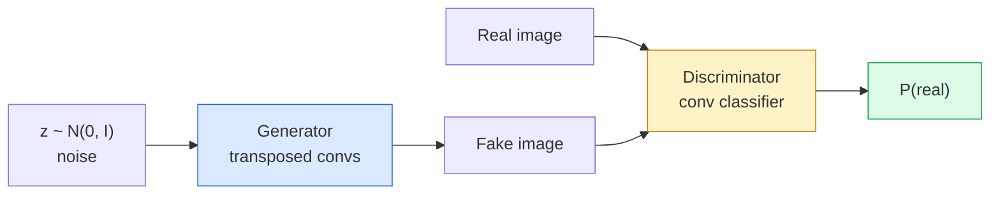
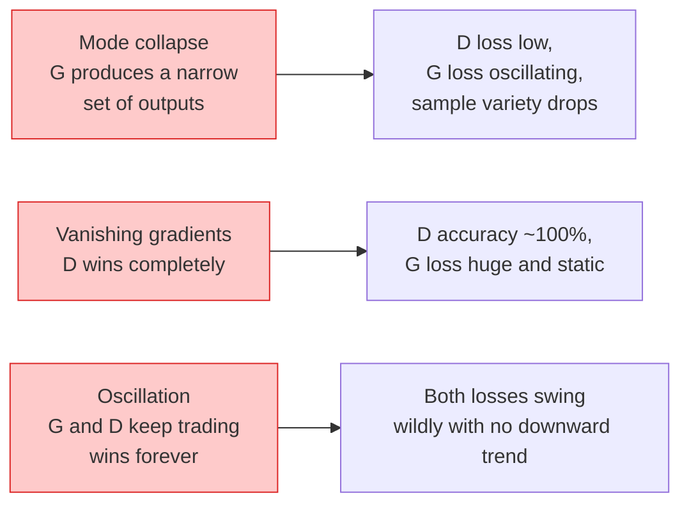

# Resim Yükleme  GAN

> Bir GAN, sabit bir oyunda iki sinir ağıdır. Biri çizer, biri eleştirir.

**Type:** Build
**Languages:** Python
**Prerequisites:** Phase 4 Lesson 03 (CNNs), Phase 3 Lesson 06 (Optimizers), Phase 3 Lesson 07 (Regularization)
**Time:** ~75 minutes

## Öğrenme Hedefleri

- Generatör ve ayrımcı arasındaki minimumx oyunu ve denge neden p_model = p_data ile karşılık geldiğini açıklayın.
- PyTorch'te DCGAN uygulamak ve 60 satırdan az bir sürede tutarlı 32x32 sentetik görüntü oluşturmak için
- GAN eğitimi üç standart hile ile istikrarlandır: beslenmeyen kayb, spektral norm, TTUR (iki kez güncelleme kuralı)
- Sağlıklı bir yakınlık ve mod çöküşü, ossilasyon ve ayrımcı-kazanacakları tamamen ayırt eden eğitim eğrilerini okuyun

## Sorun

Sınıflandırma bir ağı görüntülerin etiketlere haritasını öğretir. Üretim sorunu tersine çevirir: aynı dağılımdan gelen gibi görünen yeni görüntülere örnek verin. Fark edebileceğiniz "doğru" bir çıkış yoktur; sadece taklit etmek istediğiniz bir dağılım vardır.

Standart kayıp fonksiyonları (MSE, çapraz entropi) "Bu örnek gerçek dağılımdan geldi mi" ölçemez.Piksele hatayı en aza indirmek, gerçekçi örnekler değil, bulanık ortalamalar üretir.Kahrı öğrenmek: gerçek ile sahteyi ayırt etme görevi olan ikinci bir ağı eğitmek ve yargıcının yargıcısını jeneratörü itmek için kullanmak.

GAN'lar (Goodfellow et al., 2014) bu çerçeveyi tanımladı. 2018 yılına kadar StyleGAN fotoğraflardan ayırt edilemez 1024x1024 yüz üretmekteydi.

## Anlaşım

### İki ağ



- Evet .**generator**G bir gürültü vektörü alır `z`Ve bir görüntü çıkarır.**discriminator**D bir görüntü alır ve tek bir ölçekçi çıkarır: görüntüün gerçek olması olasılığı.

### Oyun

G, D'nin yanılmasını istiyor.

```
min_G max_D  E_x[log D(x)] + E_z[log(1 - D(G(z)))]
```

Sağdan sola okuyun: D gerçek (`log D(real)`) ve sahte (`log (1 - D(fake))`G, D'nin sahte görüntüler üzerinde doğruluğunu en aza indirmektedir.`D(G(z))`- Altı yandan.

Goodfellow , bu minimumın küresel denge olduğunu kanıtladı .`p_G = p_data`D'nin çıkışları her yerde 0.5'dir ve üretilen ve gerçek dağılımlar arasındaki Jensen-Shannon farklılığı sıfır.

### Doymayan kayıplar

Yukarıdaki form sayısal olarak dengesiz.`D(G(z))`Her sahte için sıfır yakın, yani `log(1 - D(G(z)))`G'ye göre kaybolan eğilime var. Düzeltme: G'nin kayıpını çevir.

```
L_D = -E_x[log D(x)] - E_z[log(1 - D(G(z)))]
L_G = -E_z[log D(G(z))]                          # non-saturating
```

Şimdi ne zaman ?`D(G(z))`G'nin kaybı büyük ve gradienti bilgilendirici.

### DCGAN mimarisi kuralları

Radford, Metz, Chintala (2015) yıllarca başarısız deneylerin GAN eğitimini istikrarlı yapan beş kurallara ayrıldı:

1. Birleştirmeyi adım adım konvular (her iki ağ) ile değiştirin.
2. G'nin çıkışı ve D'nin giriş hariç, hem jeneratör hem de ayrımcıda parti normunu kullanın.
3. Daha derin mimarlıklarda tamamen bağlantılı katmanları çıkarın.
4. G, çıkış hariç tüm katmanlarda ReLU kullanır (output için [-1, 1]'de tanh).
5. D, tüm katmanlarda LeakyReLU (negative_slope=0.2) kullanır.

Her modern konfor tabanlı GAN (StyleGAN, BigGAN, GigaGAN) hala bu kurallardan başlayarak parçaları birer birer değiştirir.

### Başarısızlık modları ve imzaları



- **Mode collapse**G, D'yi kandırırmak için bir görüntü bulur ve sadece bu görüntü üretir.
- **Discriminator wins**D'nin daha küçük D'yi düzeltmek, daha düşük D öğrenme oranını artırmak veya etiketleri düzeltmek için gerçek etiketlere uygula.
- **Oscillation**D'nin (D'nin G'den 2-4 kat daha hızlı öğrenmesi) veya Wasserstein kaybına geçiş.

### Değerlendirme

GAN'ların temel gerçekleri yok, nasıl çalıştıklarını biliyorsun?

- **Sample inspection** Sadece her dönem sonunda 64 numuneye bak.
- **FID (Fréchet Inception Distance)** Enception-v3 özellikleri arasındaki gerçek ve üretilen kümelerin dağılımları.
- **Inception Score** daha yaşlı, daha kırılgan; FID'yi tercih eder.
- **Precision/Recall for generative models** Kaliteli (düzgünlik) ve kapsamayı (dönüştürme) ayrı ayrı ölçer.

Küçük sentetik veri çalışması için örnek denetimi yeterlidir.

```figure
cv-gan-image
```

## Yapın

### Adım 1: Generatör

64 boyutlu gürültü alıyor ve 32x32 görüntü üreten küçük bir DCGAN jeneratörü.

```python
import torch
import torch.nn as nn

class Generator(nn.Module):
    def __init__(self, z_dim=64, img_channels=3, feat=64):
        super().__init__()
        self.net = nn.Sequential(
            nn.ConvTranspose2d(z_dim, feat * 4, kernel_size=4, stride=1, padding=0, bias=False),
            nn.BatchNorm2d(feat * 4),
            nn.ReLU(inplace=True),
            nn.ConvTranspose2d(feat * 4, feat * 2, kernel_size=4, stride=2, padding=1, bias=False),
            nn.BatchNorm2d(feat * 2),
            nn.ReLU(inplace=True),
            nn.ConvTranspose2d(feat * 2, feat, kernel_size=4, stride=2, padding=1, bias=False),
            nn.BatchNorm2d(feat),
            nn.ReLU(inplace=True),
            nn.ConvTranspose2d(feat, img_channels, kernel_size=4, stride=2, padding=1, bias=False),
            nn.Tanh(),
        )

    def forward(self, z):
        return self.net(z.view(z.size(0), -1, 1, 1))
```

4 adet transpose konveyör, her biri `kernel_size=4, stride=2, padding=1`Bu yüzden boşluk büyüklüğünü temiz bir şekilde ikiye katlarlar.

### İkinci Adım: Ayrımcılık

LeakyReLU, adımlı konvoylar, skalar bir logit ile sona erer.

```python
class Discriminator(nn.Module):
    def __init__(self, img_channels=3, feat=64):
        super().__init__()
        self.net = nn.Sequential(
            nn.Conv2d(img_channels, feat, kernel_size=4, stride=2, padding=1),
            nn.LeakyReLU(0.2, inplace=True),
            nn.Conv2d(feat, feat * 2, kernel_size=4, stride=2, padding=1, bias=False),
            nn.BatchNorm2d(feat * 2),
            nn.LeakyReLU(0.2, inplace=True),
            nn.Conv2d(feat * 2, feat * 4, kernel_size=4, stride=2, padding=1, bias=False),
            nn.BatchNorm2d(feat * 4),
            nn.LeakyReLU(0.2, inplace=True),
            nn.Conv2d(feat * 4, 1, kernel_size=4, stride=1, padding=0),
        )

    def forward(self, x):
        return self.net(x).view(-1)
```

Son konfor bir `4x4``1x1`. Çıktı görüntü başına tek bir skalar; sadece kayıp hesaplama sırasında sigmoid uygulayın.

### Adım 3: Eğitim Adımı

Alternatif: D'yi bir kez, sonra G'yi bir kez, her partide.

```python
import torch.nn.functional as F

def train_step(G, D, real, z, opt_g, opt_d, device):
    real = real.to(device)
    bs = real.size(0)

    # D step
    opt_d.zero_grad()
    d_real = D(real)
    d_fake = D(G(z).detach())
    loss_d = (F.binary_cross_entropy_with_logits(d_real, torch.ones_like(d_real))
              + F.binary_cross_entropy_with_logits(d_fake, torch.zeros_like(d_fake)))
    loss_d.backward()
    opt_d.step()

    # G step
    opt_g.zero_grad()
    d_fake = D(G(z))
    loss_g = F.binary_cross_entropy_with_logits(d_fake, torch.ones_like(d_fake))
    loss_g.backward()
    opt_g.step()

    return loss_d.item(), loss_g.item()
```

`G(z).detach()`D adımında kritik bir şeydir: güncelleme sırasında G'ye akışan gradientler istemiyoruz.

### Adım 4: Sintez şekillerde tam eğitim döngüsü

```python
from torch.utils.data import DataLoader, TensorDataset
import numpy as np

def synthetic_images(num=2000, size=32, seed=0):
    rng = np.random.default_rng(seed)
    imgs = np.zeros((num, 3, size, size), dtype=np.float32) - 1.0
    for i in range(num):
        r = rng.uniform(6, 12)
        cx, cy = rng.uniform(r, size - r, size=2)
        yy, xx = np.meshgrid(np.arange(size), np.arange(size), indexing="ij")
        mask = (xx - cx) ** 2 + (yy - cy) ** 2 < r ** 2
        color = rng.uniform(-0.5, 1.0, size=3)
        for c in range(3):
            imgs[i, c][mask] = color[c]
    return torch.from_numpy(imgs)

device = "cuda" if torch.cuda.is_available() else "cpu"
data = synthetic_images()
loader = DataLoader(TensorDataset(data), batch_size=64, shuffle=True)

G = Generator(z_dim=64, img_channels=3, feat=32).to(device)
D = Discriminator(img_channels=3, feat=32).to(device)
opt_g = torch.optim.Adam(G.parameters(), lr=2e-4, betas=(0.5, 0.999))
opt_d = torch.optim.Adam(D.parameters(), lr=2e-4, betas=(0.5, 0.999))

for epoch in range(10):
    for (batch,) in loader:
        z = torch.randn(batch.size(0), 64, device=device)
        ld, lg = train_step(G, D, batch, z, opt_g, opt_d, device)
    print(f"epoch {epoch}  D {ld:.3f}  G {lg:.3f}")
```

`Adam(lr=2e-4, betas=(0.5, 0.999))`DCGAN'ın varsayılan  düşük beta1'si, momentum süreci, rakip oyunu çok fazla istikrarlandırmaktan korur.

### Adım 5: Örnekleme

```python
@torch.no_grad()
def sample(G, n=16, z_dim=64, device="cpu"):
    G.eval()
    z = torch.randn(n, z_dim, device=device)
    imgs = G(z)
    imgs = (imgs + 1) / 2
    return imgs.clamp(0, 1)
```

Örnek alma öncesi her zaman değerlendirme moduna geçin. DCGAN için bu önemlidir çünkü parti normları çalıştırma istatistikleri parti istatistikleri yerine kullanılır.

### Adım 6: Spektral normallaştırma

Şebekenin garantili olan ayrımcıda BN'nin bir yerine 1-Lipschitz girer.

```python
from torch.nn.utils import spectral_norm

def build_sn_discriminator(img_channels=3, feat=64):
    return nn.Sequential(
        spectral_norm(nn.Conv2d(img_channels, feat, 4, 2, 1)),
        nn.LeakyReLU(0.2, inplace=True),
        spectral_norm(nn.Conv2d(feat, feat * 2, 4, 2, 1)),
        nn.LeakyReLU(0.2, inplace=True),
        spectral_norm(nn.Conv2d(feat * 2, feat * 4, 4, 2, 1)),
        nn.LeakyReLU(0.2, inplace=True),
        spectral_norm(nn.Conv2d(feat * 4, 1, 4, 1, 0)),
    )
```

Değişme`Discriminator`için`build_sn_discriminator()`Spektral norm, uygulanabilecek en kolay tek dayanıklılık yükseltmesidir.

## Kullan

Ciddi jenerasyon için önceden eğitilmiş ağırlıkları kullanın veya difüzyona geçin.

- `torch_fidelity`Aday değerlendirme kodu yazmadan, jeneratörünüzde FID / IS hesaplar.
- `pytorch-gan-zoo`(miras) ve `StudioGAN`DCGAN, WGAN-GP, SN-GAN, StyleGAN ve BigGAN'ın gemi tarafından test edilmiş uygulamaları.

2026 yılında GAN'lar hala: gerçek zamanlı görüntü üretimi (latensi <10 ms), stil transferü, kesin kontrol ile görüntüden görüntüye çevirme (Pix2Pix, CycleGAN) için en iyi seçimdir.

## Gönder

Bu ders şunları ortaya çıkarır:

- `outputs/prompt-gan-training-triage.md` bir eğitim eğri tanımını okuyan ve başarısızlık modunu (modus çöküşü, D- kazançları, titreşim) ve tek önerilen düzeltmeyi seçen bir istek.
- `outputs/skill-dcgan-scaffold.md` DCGAN'dan bir heykel yazma becerisi`z_dim`, hedef`image_size`ve`num_channels`, eğitim döngüsü ve örnek tasarrufu da dahil.

## Egzersizler

1. **(Easy)**Yukarıdaki DCGAN'ı sentetik döngü verisi kümesine ekleyin ve her dönem sonunda 16 numuneyi bir ağla kaydetin.
2. **(Medium)**Farklılık normunu spektral norm ile değiştirin. Her iki versiyonu da yan yana çalıştırın. Hangisi daha hızlı bir şekilde yaklaşıyor? Hangisinin üç tohum arasında daha düşük bir varyansi var?
3. **(Hard)**Şartlı DCGAN uygulayın: sınıf etiketini hem G hem de D'ye ekleyin (G'de gürültüye tek sıcaklık, D'de sınıf ekleme kanalını kısaltın). Ders 7'den sentetik "dahalar vs kare" veri kümesine çalışın ve sınıf koşullandırmasının belirli etiketlerle örnekleme yaparak çalıştığını gösterin.

## Anahtar Terimler

| Term | What people say | What it actually means |
|------|----------------|----------------------|
| Generator (G) | "The draws-stuff net" | Maps noise to images; trained to fool the discriminator |
| Discriminator (D) | "The critic" | Binary classifier; trained to distinguish real from generated images |
| Minimax | "The game" | min over G, max over D of an adversarial loss; equilibrium is p_G = p_data |
| Non-saturating loss | "The numerically sane version" | G's loss is -log(D(G(z))) instead of log(1 - D(G(z))) to avoid vanishing gradients early in training |
| Mode collapse | "Generator makes one thing" | G produces only a small subset of the data distribution; fix with SN, minibatch discrimination, or larger batch |
| TTUR | "Two learning rates" | D learns faster than G, typically by a factor of 2-4; stabilises training |
| Spectral norm | "1-Lipschitz layer" | A weight-normalisation that bounds each layer's Lipschitz constant; stops D from becoming arbitrarily steep |
| FID | "Fréchet Inception Distance" | Distance between Inception-v3 feature distributions of real and generated sets; the standard evaluation metric |

## Daha Fazla Okumak

- [Generative Adversarial Networks (Goodfellow et al., 2014)](https://arxiv.org/abs/1406.2661)- Herşeye başlayan gazete.
- [DCGAN (Radford, Metz, Chintala, 2015)](https://arxiv.org/abs/1511.06434) GAN'ları eğitime yararlı kılan mimari kuralları
- [Spectral Normalization for GANs (Miyato et al., 2018)](https://arxiv.org/abs/1802.05957) En faydalı istikrar hilesi
- [StyleGAN3 (Karras et al., 2021)](https://arxiv.org/abs/2106.12423)Son on yılın en büyük şarkıları gibi okuyor.
