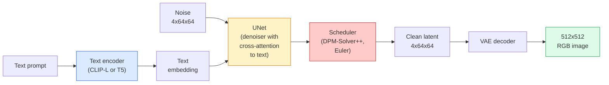

# Dayanıklı Diffusion  Memuriyete ve Düzgün Düzenleme

> Stable Diffusion, önceden eğitilmiş bir VAE'nin gizli alanında çalışan, çapraz dikkat yoluyla metine koşullanmış, hızlı bir belirleyici ODE çözücü ile örneklenen ve sınıflandırıcı dışı rehberlik ile yönlendirilmiş bir DDPM'dir.

**Type:** Learn + Use
**Languages:** Python
**Prerequisites:** Phase 4 Lesson 10 (Diffusion), Phase 7 Lesson 02 (Self-Attention)
**Time:** ~75 minutes

## Öğrenme Hedefleri

- Stable Diffusion borusunun beş parçasını izleyin: VAE, metin kodlayıcı, U-Net, programlayıcı, güvenlik kontrolcisi  ve bunların her biri aslında ne yapar
- Gizli difüzyonunu ve 4x64x64 gizli alanlarda (3x512x512 görüntü yerine) eğitim yapmanın neden kalite kaybı olmadan hesaplamaları 48 kat azalttığını açıklayın.
- Kullanım`diffusers`Resim üretmek, resimden resme çalıştırmak, boyalama ve ControlNet tarafından yönlendirilmiş jenerasyon
- Küçük özel veri kümesine LoRA ile sabit difüsiyon ve LoRA adaptörünü sonuçta yükle

## Sorun

DDPM'yi doğrudan 512x512 RGB görüntülerinde eğitmek pahalıdır. Her eğitim adımı 3x512x512 = 786,432 giriş değerlerini gören bir U-Net üzerinden geriye doğru ilerler ve örnekleme aynı U-Net üzerinden 50+ ileri geçiş alır. Stable Diffusion 1.5 (2022'de yayınlanan) kalite seviyesinde, piksel-uzayı difüsiyon yaklaşık 256 GPU-aylık eğitim ve tüketici GPU'da bir görüntü başına 10-30 saniye gerekecektir.

Açık ağırlığı olan metin-resim uygulamasını sağlayan numara:**latent diffusion**(Rombach et al., CVPR 2022). 3x512x512 resmini 4x64x64 gizli tensöre ve geriye harcayacak bir VAE eğit, sonra bu gizli alanda yayım yapın.`(3*512*512)/(4*64*64) = 48x`- Aynı GPU'da örneği almak on saniyelik bir düşüşten iki saniyeye kadar düşüyor.

Neredeyse her modern görüntü üretimi modeli  SDXL, SD3, FLUX, HunyuanDiT, Wan-Video  otomatik kodlayıcı, tanımlayıcı (U-Net veya DiT) ve metin koşullandırmasıdaki değişikliklerle gizli bir yayılma modelidir.

## Anlaşım

### - Boru hattı



- **VAE** dondurulmuş oto kodlayıcı. Kodlayıcı görüntüyi latente (img2img ve eğitim için kullanılır).
- **Text encoder** CLIP metin kodlayıcı (SD 1.x/2.x), CLIP-L + CLIP-G (SDXL) veya T5-XXL (SD3/FLUX).
- **U-Net** denoiser. Her çözünürlük düzeyinde yerleştirilen metne latentlerden katılan çapraz dikkat katmanlarına sahiptir.
- **Scheduler** örnekleme algoritması (DDIM, Euler, DPM-Solver++). Sigmaları seçer, öngörülen gürültüyü geri gizli içine karıştırır.
- **Safety checker** çıkış görüntüsünde seçmeli NSFW / yasadışı içerik filtresi.

### Sınıflandırıcıdan Çekilmeyen Rehberlik (CFG)

Basit metin koşullandırması öğrenir `epsilon_theta(x_t, t, c)`Her çağrısı için .`c`CFG aynı ağı `c`Bu nedenle, bu durumun sonucunda, hem koşullu hem de koşulsuz gürültüyi tahmin eden tek bir model oluşturuldu.

```
eps = eps_uncond + w * (eps_cond - eps_uncond)
```

`w`- Bu yönlendirme ölçeği.`w=0`Şartsızdır.`w=1`- Kesinlikle şartlı.`w>1`SD standart olarak `w=7.5`- Evet .

CFG, metin-resim kalitesi için çalışmanın nedenidür.

### Latent uzay geometrisinin

VAE'nin 4 kanallı gizli görüntüsü sadece sıkıştırılmış bir görüntü değil. Bu, aritmetiklerin yaklaşık olarak semantik düzenlemelere (sürekli mühendislik + interpolasyon her ikisi de burada yaşar) karşılık geldiği ve U-Net'in tüm modelleme bütçesini harcamak için eğitildiği bir çeşitliliktir. Rastgele bir 4x64x64 latenti çözme rastgele görünen bir görüntü üretmez  çöp üretir, çünkü yalnızca belirli bir alt çeşitlilikte latenler geçerli görüntülere çözür.

İki sonuç:

1. **Img2img**= görüntüyi gizli olarak kodlayın, kısmi gürültü ekleyin, denosörü çalıştırın, dekode edin. Görüntü yapısı, kodlamanın dönüştürülebilir olması nedeniyle hayatta kalır; içeriği istek üzerine göre değişir.
2. **Inpainting**= img2img ile aynı ama denoiser sadece maskeli bölgeleri güncelleyebilir; maskeli olmayan bölgeler kodlanmış gizli olarak tutulur.

### U-Net mimarisi

SD U-Net, Ders 10'dan TinyUNet'in büyük bir versiyonu ve üç eklemedir:

- **Transformer blocks**Her boşluk çözünürlüğünde, kendi dikkatini + metin yerleştirilmesine karşı dikkatini içerir.
- **Time embedding**Sinusoidal kodlama üzerinden MLP.
- **Skip connections**Eşleşen çözünürlüklerde kodlayıcı ve dekodör arasında.

SD 1.5'deki toplam parametreler: ~860M. SDXL: ~2.6B. FLUX: ~12B. Paramlarda atlama çoğunlukla dikkat katmanlarında gerçekleşir.

### LoRA ince ayarlama

Stable Diffusion'un tam ince ayarlaması 20 GB'dan fazla VRAM gerektirir ve 860M parametreleri güncelleyebilir. LoRA (Low-Rank Adaptation) temel modelin dondurulmasını sağlar ve dikkat katmanlarına küçük sıra-karşılaşma matrislerini enjekte eder. SD için bir LoRA adaptörü tipik olarak 10-50 MB'dir, tek bir tüketici GPU'da 10-60 dakika boyunca çalışır ve bir düşüş değiştirimi olarak sonuçlama zamanında yüklenir.

```
Original: W_q : (d_in, d_out)   frozen
LoRA:     W_q + alpha * (A @ B)   where A : (d_in, r), B : (r, d_out)

r is typically 4-32.
```

LoRA, neredeyse tüm toplulukların ince sesleri dağıtma şekli. CivitAI ve Hugging Face milyonlarca sesini evlat edinir.

### Gördüğün zamanlamalar

- **DDIM** Deterministik, ~50 adım, basit.
- **Euler ancestral** Stochastic, 30-50 adım, biraz daha yaratıcı örnekler.
- **DPM-Solver++ 2M Karras** Deterministik, 20-30 adım, üretim default.
- **LCM / TCD / Turbo** tutarlılık modelleri ve destilli çeşitleri; 1-4 adım bir kalite masrafı.

Programlamaları değiştirmek , bir satırlık bir değişimdir .`diffusers`Ve bazen de herhangi bir yeniden eğitim olmadan örnek sorunlarını düzeltir.

```figure
cv3-latent-compression
```

## Yapın

Bu ders kullanıyor .`diffusers`Bu nedenle, bu programın temelinde, yeni bir sistem oluşturmak için, yeni bir sistem oluşturmak için, yeni bir sistem oluşturmak için, yeni bir sistem oluşturmak için, yeni bir sistem oluşturmak için, yeni bir sistem oluşturmak için, yeni bir sistem oluşturmak için, yeni bir sistem oluşturmak için, yeni bir sistem oluşturmak için, yeni bir sistem oluşturmak için, yeni bir sistem oluşturmak için, yeni bir sistem oluşturmak için, yeni bir sistem oluşturmak için, yeni bir sistem oluşturmak için, yeni bir sistem oluşturmak için, yeni bir sistem oluşturmak için, yeni bir sistem oluşturmak için, yeni bir sistem oluşturmak için, yeni bir sistem oluşturmak için, yeni bir sistem oluşturmak için, yeni bir sistem oluşturmak için, yeni bir sistem oluşturmak için, yeni bir sistem oluşturmak için, yeni bir sistem oluşturmak için, yeni bir sistem oluşturmak için, yeni bir sistem oluşturmak için, yeni bir sistem oluşturmak için, yeni bir sistem oluşturmak için, yeni bir sistem oluşturmak için, yeni bir sistem oluşturmak için, yeni bir sistem oluşturmak için, yeni bir sistem oluşturmak için, yeni bir sistem oluşturmak için, yeni bir sistem oluşturmak için, yeni bir sistem oluşturmak için, bir sistem oluşturmak için, bir sistem oluşturmak için, bir sistem oluşturmak için, bir sistem oluşturmak için, bir sistem oluşturmak için, bir sistem oluşturmak için, bir temel oluşturmak için, bir amaç, bir temel oluşturmak için, bir temel oluşturmak için, bir amaç, bir temel oluşturmak için, bir temel oluşturmak için, bir temel oluşturmak için, bir temel oluşturmak için, bir temel oluşturmak için, bir temel oluşturmak için, bir temel oluşturmak için, bir temel oluşturmak, bir temel oluşturmak için, bir temel oluşturmak için, bir temel oluşturmak, bir temel oluşturmak,

### Adım 1: Resme metin

```python
import torch
from diffusers import StableDiffusionPipeline

pipe = StableDiffusionPipeline.from_pretrained(
    "runwayml/stable-diffusion-v1-5",
    torch_dtype=torch.float16,
).to("cuda")

image = pipe(
    prompt="a dog riding a skateboard in tokyo, studio ghibli style",
    guidance_scale=7.5,
    num_inference_steps=25,
    generator=torch.Generator("cuda").manual_seed(42),
).images[0]
image.save("dog.png")
```

`float16`Görülebilir bir kalite kaybı olmadan VRAM' ı yarıya çıkarır. `num_inference_steps=25`Öntanımlı DPM-Solver++ eşleşmeleri ile `num_inference_steps=50`DDIM ile.

### Adım 2: Programlayıcıyı değiştir

```python
from diffusers import DPMSolverMultistepScheduler, EulerAncestralDiscreteScheduler

pipe.scheduler = DPMSolverMultistepScheduler.from_config(pipe.scheduler.config)
pipe.scheduler = EulerAncestralDiscreteScheduler.from_config(pipe.scheduler.config)
```

Programlayıcı durum U-Net ağırlıklarından koparılmış. DDPM üzerinde eğitim alabilir ve herhangi bir programcı ile örnek alabilirsiniz.

### Adım 3: Resimden resme

```python
from diffusers import StableDiffusionImg2ImgPipeline
from PIL import Image

img2img = StableDiffusionImg2ImgPipeline.from_pretrained(
    "runwayml/stable-diffusion-v1-5",
    torch_dtype=torch.float16,
).to("cuda")

init_image = Image.open("dog.png").convert("RGB").resize((512, 512))
out = img2img(
    prompt="a dog riding a skateboard, oil painting",
    image=init_image,
    strength=0.6,
    guidance_scale=7.5,
).images[0]
```

`strength`Bu, denoze edilmeden önce ne kadar gürültü eklenmesi (0,0 = değişmez, 1.0 = tam yenilenme) anlamına gelir.

### Dördüncü adım: Boyanma

```python
from diffusers import StableDiffusionInpaintPipeline

inpaint = StableDiffusionInpaintPipeline.from_pretrained(
    "runwayml/stable-diffusion-inpainting",
    torch_dtype=torch.float16,
).to("cuda")

image = Image.open("dog.png").convert("RGB").resize((512, 512))
mask = Image.open("dog_mask.png").convert("L").resize((512, 512))

out = inpaint(
    prompt="a cat",
    image=image,
    mask_image=mask,
    guidance_scale=7.5,
).images[0]
```

Maskedeki beyaz pikseller yenilenmek için alan.

### Adım 5: LoRA yükleme

```python
pipe.load_lora_weights("sayakpaul/sd-lora-ghibli")
pipe.fuse_lora(lora_scale=0.8)

image = pipe(prompt="a village square in ghibli style").images[0]
```

`lora_scale`Güç kontrolü; 0.0 = hiçbir etki, 1.0 = tam etki. `fuse_lora`Adaptörü hız için yerindeki ağırlıklara pişirir ama değişimi engeller.`pipe.unfuse_lora()`Farklı bir adaptör yüklenmeden önce.

### Adım 6: LoRA eğitimi (sketç)

Gerçek LoRA eğitimleri hayatın içinde `peft`veya `diffusers.training`- Şekil:

```python
# Pseudocode
for step, batch in enumerate(dataloader):
    images, prompts = batch
    latents = vae.encode(images).latent_dist.sample() * 0.18215

    t = torch.randint(0, num_train_timesteps, (batch_size,))
    noise = torch.randn_like(latents)
    noisy_latents = scheduler.add_noise(latents, noise, t)

    text_emb = text_encoder(tokenizer(prompts))

    pred_noise = unet(noisy_latents, t, text_emb)  # LoRA weights injected here

    loss = F.mse_loss(pred_noise, noise)
    loss.backward()
    optimizer.step()
```

Sadece LoRA matrisleri gradient alır; temel U-Net, VAE ve metin kodlayıcı dondurulmuştur.

## Kullan

Üretim sırasında, gerçekte aldığınız kararlar:

- **Model family**: SD 1.5 açık kaynaklı topluluk ince tonları için, SDXL daha yüksek sadakat için, SD3 / FLUX son teknoloji ve sıkı lisans gereksinimleri için.
- **Scheduler**: DPM-Solver++ 20 ila 30 adım için 2M Karras, 1 saniye altında geciktiğinde LCM-LoRA.
- **Precision**- Evet .`float16`4080/4090'da, `bfloat16`A100 ve daha yeni,`int8`(den)`bitsandbytes`veya `compel`) VRAM sıkıken.
- **Conditioning**: düz metin çalışması; daha güçlü kontrol için, temel boru hattının üstüne ControlNet (sıkı, derin, poz) ekleyin.

Satır üretimi için,`AUTO1111`- Ne ?`ComfyUI`Topluluk araçları; üretim API'leri için,`diffusers`+ `accelerate`veya `optimum-nvidia`TensorRT komisyonu ile.

## Gönder

Bu ders şunları ortaya çıkarır:

- `outputs/prompt-sd-pipeline-planner.md` SD 1.5 / SDXL / SD3 / FLUX'i ve programlayıcıyı ve bir gecikme bütçesi, sadakat hedefi ve lisans kısıtlaması göz önüne alındığında kesinliği seçen bir istek.
- `outputs/skill-lora-training-setup.md` Başlıkları, sıralama, parti boyutu ve öğrenme oranı dahil olmak üzere özel bir veri kümesi için tam bir LoRA eğitim yapılandırmasını yazma becerisi.

## Egzersizler

1. **(Easy)**Aynı istekleri oluştur `guidance_scale`İçeride`[1, 3, 5, 7.5, 10, 15]`- Resim nasıl değişiyor?
2. **(Medium)**Gerçek fotoğraflar çek, onları tarayın.`StableDiffusionImg2ImgPipeline`- ...`strength`İçeride`[0.2, 0.4, 0.6, 0.8, 1.0]`1.0. neden girişleri tamamen görmezden gelir?
3. **(Hard)**Bir tek konuyu (bir evcil hayvan, logo, bir karakter) oluşturan 10-20 görüntü üzerinde LoRA'yı eğit ve bu konuyu içeren yenilikçi sahneler oluştur.

## Anahtar Terimler

| Term | What people say | What it actually means |
|------|----------------|----------------------|
| Latent diffusion | "Diffuse in latents" | Run the entire DDPM in the VAE latent space (4x64x64) instead of pixel space (3x512x512); 48x compute saving |
| VAE scale factor | "0.18215" | Constant that rescales the VAE's raw latent to roughly unit variance; hardcoded in every SD pipeline |
| Classifier-free guidance | "CFG" | Mix conditional and unconditional noise predictions; the single most impactful inference knob |
| Scheduler | "Sampler" | The algorithm that turns noise + model predictions into a denoised latent trajectory |
| LoRA | "Low-rank adapter" | Small rank-decomposition matrices that fine-tune attention layers without touching base weights |
| Cross-attention | "Text-image attention" | Attention from latent tokens to text tokens; injects prompt information at every U-Net level |
| ControlNet | "Structure conditioning" | A separately-trained adapter that steers SD with an extra input (canny, depth, pose, segmentation) |
| DPM-Solver++ | "The default scheduler" | Second-order deterministic ODE solver; best quality at low step counts (20-30) in 2026 |

## Daha Fazla Okumak

- [High-Resolution Image Synthesis with Latent Diffusion (Rombach et al., 2022)](https://arxiv.org/abs/2112.10752) Stable Diffusion kağıdı; tasarımı haklı çıkaran her bir ablation içerir
- [Classifier-Free Diffusion Guidance (Ho & Salimans, 2022)](https://arxiv.org/abs/2207.12598) CFG kağıdı
- [LoRA: Low-Rank Adaptation of Large Language Models (Hu et al., 2021)](https://arxiv.org/abs/2106.09685) LoRA ilk olarak NLP'yi kullanmış; neredeyse hiç değişim olmadan SD'ye aktarılmış.
- [diffusers documentation](https://huggingface.co/docs/diffusers) her SD / SDXL / SD3 / FLUX boru hattı için referans
