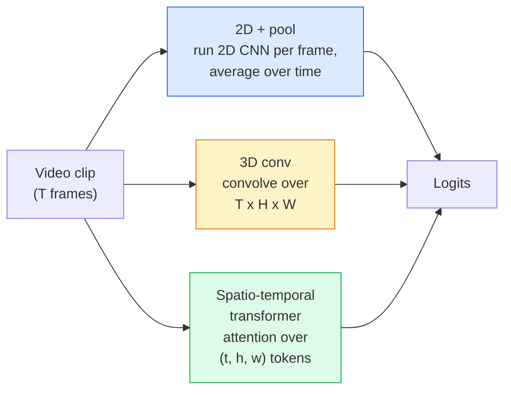

# Video Anlama  Zamanlı Modelleme

> Bir video, resimlerin bir diziyi ve onları birbirine bağlayan fizikten ibarettir. Her video modeli ya ekstra bir eksim (3D conv), bir diziyi (transformer) veya bir kez ve bir havuz (2D + havuz) çıkarmak için bir özellik olarak zamanla ilgilenir.

**Type:** Learn + Build
**Languages:** Python
**Prerequisites:** Phase 4 Lesson 03 (CNNs), Phase 4 Lesson 04 (Image Classification)
**Time:** ~45 minutes

## Öğrenme Hedefleri

- Üç ana video modeli yaklaşımını ayırt edin (2D+pool, 3D conv, uzay-zaman transformatörü) ve maliyet ve doğruluk pazarlamalarını tahmin edin
- PyTorch'te çerçeve örneklemesini, zamanlı birleştirmeyi ve 2D+pool temel sınıflandırıcıyı uygula
- I3D'nin "bombolu" 3D çekirdeklerinin ImageNet ağırlıklarından neden iyi aktarıldığını ve faktörleşmiş (2+1) D konunun farklı olarak ne yaptığını açıklayın.
- Standart eylem tanıma veri kümelerini ve ölçümlerini okuyun: Kinetics-400/600, UCF101, Something-Something V2; klip ve video düzeyinde en yüksek 1-e doğru

## Sorun

30 saniyelik bir video 30 fps'de 900 görüntüdür. Naifce, video sınıflandırması, 900 kez çalıştırılan görüntü sınıflandırmasıdır. Bu, hareket neredeyse her çerçeveye (sport, yemek, egzersiz videoları) görünürken çalışır ve hareketin kendisi tarafından tanımlandığında kötü bir şekilde başarısız olur: "bir şeyi sola doğru itmek" her çerçeveye iki sabit nesne gibi görünür.

Her video mimarisi için temel soru şu: Zamanlı yapı ne zaman ve nasıl modellenir? Cevap diğer her şeyi yönlendirir  hesaplama maliyeti, eğitim öncesi strateji, ImageNet ağırlıklarını tekrar kullanabilir miyiz, model hangi veri kümelerini eğitir.

Bu ders, istatik görüntü derslerinden kasten daha kısa. Temel görüntü makinesi zaten var ve video anlama çoğunlukla zamanlı hikaye hakkında: örnekleme, modellerleme ve toplama.

## Anlaşım

### Üç mimari aile



### 2D + havuz

2 boyutlu bir CNN (ResNet, EfficientNet, ViT) alın. Örnek alınan her çerçeve üzerinde bağımsız olarak çalıştırın.

Avantajlar:
- ImageNet'in eğitim öncesi transferleri doğrudan.
- Uygulama en basit.
- Ucuz: T çerçeveleri * tek görüntü sonucu maliyeti.

Eksiler:
- Hareket modeli yapamıyorum.
- Zamanlı birleştirme, düzen değişmez; "açık kapı" ve "kapı kapalı" aynı görünümde.

Ne zaman kullanılır: görünüm ağır görevler, küçük video veri kümeleri üzerinde öğrenme transfer, başlangıç tabanları.

### 3 boyutlu kıvrımlar

2D (H, W) çekirdeklerini 3D (T, H, W) çekirdeklerle değiştirin. Ağ hem zaman hem de uzay boyunca sarılır.

I3D numarası: önceden eğitilmiş bir 2D ImageNet modeli alın, yeni bir zaman eksesi boyunca kopyalayarak her 2D çekirdeği "flat" edin. 3x3 2D konvulusuna 3x3x3 3D konvulusuna dönüşür. Bu, 3D modeline sıfırdan eğitilmek yerine güçlü önceden eğitilmiş ağırlıklar verir.

Avantajlar:
- Doğrudan hareket modelleri.
- I3D enflasyonı ücretsiz transfer öğrenimi sağlar.

Eksiler:
- T/8'de 2D eşliğinden daha fazla FLOP (sürekli çekirdeğin 3'ü 3 kez yığılmış)
- Zaman çekirdekleri küçüktür; uzun mesafeli hareket piramit veya çift akımlı bir yaklaşım gerektirir.

Ne zaman kullanılır: hareket sinyal olduğu hareket tanımı (Something-Something V2, Kinetics with motion-heavy classes).

### Arazi-zamanlı transformatörler

Videoyu bir uzay-zaman çişisi şebekesine işaretleyin ve hepsine katılın.

Önemli olan dikkat kalıpları:
- **Joint** bir büyük dikkat üzerinde (t, h, w).`T*H*W`- Çok pahalı.
- **Divided** blok başına iki dikkat: bir zaman boyunca, bir uzay boyunca.
- **Factorised**Zaman dikkatinin bloklar arasında uzay dikkatinin değişmesi.

Avantajlar:
- SOTA doğruluğu her önemli referans değerinde.
- Görüntü transformörlerinden (ViT) patch enflasyonu üzerinden aktarmalar.
- Kısıtlı dikkat ile uzun bağlamlı videoları destekler.

Eksiler:
- Bilgisayar açlığı.
- Dikkatli bir dikkatli bir seçim veya koşuş balonu gerektirir.

Ne zaman kullanılır: büyük veri kümeleri, yüksek sadakatli video anlayışı, çok modal video + metin görevleri.

### Çerçeve örneği

30 fps'de 10 saniyelik bir klip 300 çerçeve tutar; 300'ü herhangi bir modele beslemek harcama olur.

- **Uniform sampling** Klip boyunca T çerçeveleri eşit seçin.
- **Dense sampling** rastgele bitişik T çerçeve penceresi. 3D konvoylarda yaygın çünkü hareket komşu çerçeveleri gerektirir.
- **Multi-clip** aynı videodan birden fazla T- çerçeve penceresini örnekleyin, her birini sınıflandırın, test sırasında ortalama tahminler.

T genellikle 8, 16, 32 veya 64'dir. Daha yüksek T = daha fazla hesaplama sırasında daha fazla zaman sinyali.

### Değerlendirme

İki seviyede:
- **Clip-level accuracy**Model bir T-frame klipi görür, rapor top-k.
- **Video-level accuracy** Video başına birden fazla klip üzerinde ortalama klip seviyesinin tahminleri; daha yüksek ve daha istikrarlı.

Her zaman her ikisini de rapor edin. %78 / %82 video puanı alan bir model test zaman ortalamasına büyük ölçüde güveniyor; %80 / %81 puanı alan bir model ise her klip için daha sağlamdır.

### Toplayacağınız veri kümeleri

- **Kinetics-400 / 600 / 700** genel amaçlı eylem verileri. 400.000 klip; YouTube URL'leri (çoğu artık ölü).
- **Something-Something V2** Hareketle tanımlanmış eylemler ("X'i sola sağa taşımak"). 2D+pool ile çözülemez.
- **UCF-101**- Evet .**HMDB-51** yaşlı, küçük, hala raporlanmış.
- **AVA** Yerleşim ve zaman alanında hareket; sınıflandırmaktan daha zor.

```figure
v4-video-temporal
```

## Yapın

### Adım 1: Çerçeve örneği

Çerçeve listesi (veya bir video tensörü) üzerinde çalışan tek tip ve yoğun örnekler.

```python
import numpy as np

def sample_uniform(num_frames_total, T):
    if num_frames_total <= T:
        return list(range(num_frames_total)) + [num_frames_total - 1] * (T - num_frames_total)
    step = num_frames_total / T
    return [int(i * step) for i in range(T)]


def sample_dense(num_frames_total, T, rng=None):
    rng = rng or np.random.default_rng()
    if num_frames_total <= T:
        return list(range(num_frames_total)) + [num_frames_total - 1] * (T - num_frames_total)
    start = int(rng.integers(0, num_frames_total - T + 1))
    return list(range(start, start + T))
```

İkisi de geri dönüyor .`T`Video tenzorunu kesmek için kullandığınız göstergeleri.

### Adım 2: 2D+pool başlangıç çizgisi

Her çerçeveye 2 boyutlu ResNet-18 çalıştır, ortalama havuz özellikleri, sınıflandırma.

```python
import torch
import torch.nn as nn
from torchvision.models import resnet18, ResNet18_Weights

class FramePool(nn.Module):
    def __init__(self, num_classes=400, pretrained=True):
        super().__init__()
        weights = ResNet18_Weights.IMAGENET1K_V1 if pretrained else None
        backbone = resnet18(weights=weights)
        self.features = nn.Sequential(*(list(backbone.children())[:-1]))  # global avg pool kept
        self.head = nn.Linear(512, num_classes)

    def forward(self, x):
        # x: (N, T, 3, H, W)
        N, T = x.shape[:2]
        x = x.view(N * T, *x.shape[2:])
        feats = self.features(x).view(N, T, -1)
        pooled = feats.mean(dim=1)
        return self.head(pooled)

model = FramePool(num_classes=10)
x = torch.randn(2, 8, 3, 224, 224)
print(f"output: {model(x).shape}")
print(f"params: {sum(p.numel() for p in model.parameters()):,}")
```

ImageNet'in önceden eğitimi, 11 milyon parametre, çerçeve başına çalışır, ortalamalar, sınıflandırır. Bu temel çizgi genellikle görünüm ağır görevlerde uygun 3D modellerin 5-10 puanının içinde  bazen daha iyi, çünkü daha güçlü bir ImageNet omurgasını tekrar kullanır.

### Adım 3: I3D tarzı şişmiş 3D konvoy

Tek bir 2 boyutlu konvoyı yeni bir zaman eksesi boyunca ağırlıkları tekrarlayarak 3 boyutlu konvoy haline getir.

```python
def inflate_2d_to_3d(conv2d, time_kernel=3):
    out_c, in_c, kh, kw = conv2d.weight.shape
    weight_3d = conv2d.weight.data.unsqueeze(2)  # (out, in, 1, kh, kw)
    weight_3d = weight_3d.repeat(1, 1, time_kernel, 1, 1) / time_kernel
    conv3d = nn.Conv3d(in_c, out_c, kernel_size=(time_kernel, kh, kw),
                        padding=(time_kernel // 2, conv2d.padding[0], conv2d.padding[1]),
                        stride=(1, conv2d.stride[0], conv2d.stride[1]),
                        bias=False)
    conv3d.weight.data = weight_3d
    return conv3d

conv2d = nn.Conv2d(3, 64, kernel_size=3, padding=1, bias=False)
conv3d = inflate_2d_to_3d(conv2d, time_kernel=3)
print(f"2D weight shape:  {tuple(conv2d.weight.shape)}")
print(f"3D weight shape:  {tuple(conv3d.weight.shape)}")
x = torch.randn(1, 3, 8, 56, 56)
print(f"3D output shape:  {tuple(conv3d(x).shape)}")
```

Bölüm `time_kernel`İlk geçit sırasında parti norm istatistiklerini kırmamak için önemli olan aktifleşme büyüklüklerini yaklaşık olarak sabit tutar.

### 4. Adım: Factorized (2+1) D Conv

3D bir konvoyunu 2D (yerli) ve 1D (zamanlı) bir konvoy olarak bölün. Aynı kabul alanı, daha az parametreler, bazı referans değerlerinde daha iyi doğruluk.

```python
class Conv2Plus1D(nn.Module):
    def __init__(self, in_c, out_c, kernel_size=3):
        super().__init__()
        mid_c = (in_c * out_c * kernel_size * kernel_size * kernel_size) \
                // (in_c * kernel_size * kernel_size + out_c * kernel_size)
        self.spatial = nn.Conv3d(in_c, mid_c, kernel_size=(1, kernel_size, kernel_size),
                                 padding=(0, kernel_size // 2, kernel_size // 2), bias=False)
        self.bn = nn.BatchNorm3d(mid_c)
        self.act = nn.ReLU(inplace=True)
        self.temporal = nn.Conv3d(mid_c, out_c, kernel_size=(kernel_size, 1, 1),
                                  padding=(kernel_size // 2, 0, 0), bias=False)

    def forward(self, x):
        return self.temporal(self.act(self.bn(self.spatial(x))))

c = Conv2Plus1D(3, 64)
x = torch.randn(1, 3, 8, 56, 56)
print(f"(2+1)D output: {tuple(c(x).shape)}")
```

Tam bir R(2+1)D ağı ResNet-18 ile aynıdır. Her 3x3 konforu `Conv2Plus1D`- Evet .

## Kullan

İki kütüphanede video çalışmaları yer alıyor:

- `torchvision.models.video` R(2+1) D, MViT, Swin3D önceden eğitilmiş Kinetik ağırlıkları ile.
- `pytorchvideo`(Meta)  hayvanat bahçesi modeli, Kinetik / SSv2 / AVA için veri yükleyicileri, standart dönüşümler.

Görüş Dilinde video modelleri için (video başlıkları, video sorgulama), kullanın `transformers`(`VideoMAE`- Evet .`VideoLLaMA`- Evet .`InternVideo`)

## Gönder

Bu ders şunları ortaya çıkarır:

- `outputs/prompt-video-architecture-picker.md` görünüm karşı harekete, veri kümesi boyutuna ve hesaplama bütçesine göre 2D+pool / I3D / (2+1)D / transformatör seçen bir istek.
- `outputs/skill-frame-sampler-auditor.md` bir video borusunun örnekleme cihazını kontrol eden ve ortak hataları işaretleyen bir beceri: birer birer indeks, eşsiz örnekleme`num_frames < T`, görünüm koruyucu ürün eksikliği vb.

## Egzersizler

1. **(Easy)**FramePool için T=8 ile T=8 ile 3D biçimindeki 3D ResNet ile FLOP'ları hesaplayın. 2D + pool'un neden 3-5 kat daha ucuz olduğunu açıklayın.
2. **(Medium)**Sentetik bir video verisi oluşturun: rastgele toplar rastgele yönlerde hareket ederek hareket yönü ("soldan sağa", "sağa sola", "yağlık yukarı") ile etiketlenir. FramePool'u üzerinde çalıştırın.
3. **(Hard)**ResNet-18'deki her Conv2d'yi ResNet-18 ile değiştirerek bir R(2+1) D-18 oluşturun.`Conv2Plus1D`ImageNet'in önceden eğitilmiş ResNet-18'den ilk konforun ağırlıklarını şişirt.

## Anahtar Terimler

| Term | What people say | What it actually means |
|------|----------------|----------------------|
| 2D + pool | "Per-frame classifier" | Run a 2D CNN on every sampled frame, average-pool features across time, classify |
| 3D convolution | "Spatio-temporal kernel" | Kernel that convolves over (T, H, W); can model motion natively |
| Inflation | "Lift 2D weights to 3D" | Initialise 3D conv weights by repeating a 2D conv's weights along the new time axis, then divide by kernel_T to preserve activation scale |
| (2+1)D | "Factorised conv" | Split 3D into 2D spatial + 1D temporal; fewer parameters, extra non-linearity between |
| Divided attention | "Time then space" | Transformer block with two attentions per layer: one over tokens at the same frame, one over tokens at the same position |
| Clip | "T-frame window" | A sampled subsequence of T frames; the unit a video model consumes |
| Clip vs video accuracy | "Two eval settings" | Clip = one sample per video, video = average across multiple sampled clips |
| Kinetics | "The ImageNet of video" | 400-700 action classes, 300k+ YouTube clips, the standard video pretraining corpus |

## Daha Fazla Okumak

- [I3D: Quo Vadis, Action Recognition (Carreira & Zisserman, 2017)](https://arxiv.org/abs/1705.07750) enflasyon ve Kinetics verileri
- [R(2+1)D: A Closer Look at Spatiotemporal Convolutions (Tran et al., 2018)](https://arxiv.org/abs/1711.11248) faktörleşmiş konfor, hala güçlü bir başlangıç çizgisi
- [TimeSformer: Is Space-Time Attention All You Need? (Bertasius et al., 2021)](https://arxiv.org/abs/2102.05095) İlk güçlü video transformatörü
- [VideoMAE (Tong et al., 2022)](https://arxiv.org/abs/2203.12602) video için maskeli oto kodlayıcı önceden eğitim; mevcut baskın önceden eğitim tarifi
