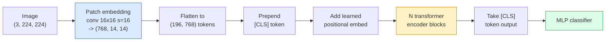

# Görme Transformerleri (ViT)

> Resmi parçalara ayır, her parça bir kelime gibi davran, standart bir transformatör çalıştır.

**Type:** Build
**Languages:** Python
**Prerequisites:** Phase 7 Lesson 02 (Self-Attention), Phase 4 Lesson 04 (Image Classification)
**Time:** ~45 minutes

## Öğrenme Hedefleri

- En az bir ViT oluşturmak için, patch embed, öğrenilmiş pozisyon embed, sınıf jetonu ve transformatör kodlayıcı bloklarını sıfırdan uygulamak
- DeiT ve MAE'nin aksi olduğunu kanıtlamadan önce ViT'nin büyük bir miktar ön eğitim verisine ihtiyacı olduğunu neden düşündüğünü açıklayın.
- ViT, Swin ve ConvNeXt'i mimari öncüleri ile karşılaştırın (hiçbir, yerel pencere dikkat, konfor omurgası)
- Önceden eğitilmiş bir ViT' yi küçük bir veri kümesine ayarlayın.`timm`ve standart çizgi-sürekli / ince ayarlama tarifi

## Sorun

Bir on yıl boyunca, konvulsiyon bilgisayar görme ile eş anlamlıydı. CNN'lerin yerleşim, çeviri eşdeğerliği 'nin değiştirilebileceğini düşünmeyen güçlü indüktif önyargıları vardı. Sonra Dosovitskiy et al. (2020) düzleştirilmiş görüntü yamalarına uygulanan basit bir transformatörün, konvulsiyon makinesi olmadan, ölçekte en iyi CNN'lere eşleşebileceğini veya yenmeyebileceğini gösterdi.

ImageNet-1k'daki ViT, ResNet'e kaybetti. ViT, ImageNet-21k veya JFT-300M üzerinde önceden eğitilmiş ve ImageNet-1k'da daha iyi ayarlanmış. Sonuç, transformatörlerin yararlı önlerinde eksik olduğu ama yeterli veriyle öğrenebildiği oldu. Sonraki çalışmalar (DeiT, MAE, DINO) doğru eğitim tarifleri ile  güçlü büyütme, kendi kendine denetimli ön eğitim, destilasyon  ViTs küçük veriler üzerinde de iyi eğitim gösterdiğini gösterdi.

2026 yılına kadar saf CNN'ler hala kenar cihazlarda rekabetçi (ConvNeXt en güçlüdür), ancak transformatörler diğer her şeye hakim: segmentasyon (Mask2Former, SegFormer), algılama (DETR, RT-DETR), multimodal (CLIP, SigLIP), video (VideoMAE, VJEPA).

## Anlaşım

### - Boru hattı



Yedi adım. Patches -> tokens -> attention -> classifier. Her variant (DeiT, Swin, ConvNeXt, MAE öncesi eğitim) yedi'den birini veya ikisini değiştirir ve geri kalanı yalnız bırakır.

### Çizgileme yerleştirme

İlk konvert sırrıdır. Kernel boyutu 16, adım 16, böylece 224x224 görüntü 16x16 çubuklardan oluşan 14x14 bir ağ haline gelir, her biri 768 boyutlu bir gömleğe projekte edilir.

```
Input:  (3, 224, 224)
Conv (3 -> 768, k=16, s=16, no padding):
Output: (768, 14, 14)
Flatten spatial: (196, 768)
```

196 yama = 196 token. Her token'un özellik boyutu 768 (ViT-B), 1024 (ViT-L) veya 1280 (ViT-H) dir.

### Sınıf simgesi

Bir tek öğrenilmiş vektör dizine önceden bağlı:

```
tokens = [CLS; patch_1; patch_2; ...; patch_196]   shape (197, 768)
```

N transformatör bloklarından sonra `[CLS]`Çıkış, küresel görüntü temsilidir.

### Konum yerleştirme

Transformatörlerin yerleşik bir konum anlayışı yoktur.

```
tokens = tokens + learned_pos_embedding   (also shape (197, 768))
```

Eklenti, modelin bir parametresidir; gradient tabanlı eğitim onu 2 boyutlu görüntü yapısına uyarlar. Sinusoidal 2 boyutlu alternatifler vardır ancak pratikte nadiren kullanılır.

### Transformer kodlayıcı blok

Standart, çok başlı kendine dikkat, MLP, kalıntı bağlantıları, pre-LayerNorm.

```
x = x + MSA(LN(x))
x = x + MLP(LN(x))

MLP is two-layer with GELU: Linear(d -> 4d) -> GELU -> Linear(4d -> d)
```

ViT-B/16 bu bloklardan 12'ini, her biri 12 dikkat başlığı ile toplamda 86M parametresi ile yığar.

### Neden LN öncesi

LN sonrası kullanılan ilk transformatörler (`x = LN(x + sublayer(x))`Bu nedenle, bu eğitimden sonra, bir süre sonra, bir süre sonra, bir süre sonra, bir süre sonra, bir süre sonra, bir süre sonra, bir süre sonra, bir süre sonra, bir süre sonra, bir süre sonra, bir süre sonra, bir süre sonra, bir süre sonra, bir süre sonra, bir süre sonra, bir süre sonra, bir süre sonra, bir süre sonra, bir süre sonra, bir süre sonra, bir süre sonra, bir süre sonra, bir süre sonra, bir süre sonra, bir süre sonra, bir süre sonra, bir süre sonra, bir süre sonra, bir süre sonra, bir süre sonra, bir süre sonra, bir süre sonra, bir süre sonra, bir süre sonra, bir süre sonra, bir süre sonra, bir süre sonra, bir süre sonra, bir süre sonra, bir süre sonra, bir süre sonra, bir süre sonra, bir süre sonra, bir süre sonra, bir süre sonra, bir süre sonra, bir süre sonra, bir süre sonra, bir süre sonra, bir süre sonra, bir süre sonra, bir süre sonra, bir süre sonra, bir süre sonra, bir süre sonra, bir süre sonra, bir süre sonra, bir süre sonra, bir süre sonra, bir süre sonra, bir süre sonra, bir süre sonra, bir süre sonra, bir süre, bir süre sonra, bir süre, bir süre sonra, bir süre, bir süre sonra, bir süre sonra, bir süre sonra, bir süre, bir süre sonra, bir süre, bir süre sonra, bir süre sonra, bir süre, bir süre sonra, bir süre, bir süre sonra, bir süre, bir süre, bir süre, bir süre, bir süre sonra, bir süre, bir sürecececececececececececececececececececececececececececececececececececececececececececececececececececececececececececececececececececececececececececececececececececececececececececececececececececececececececececececececececececececececececececececececececececececececececececececececececececececececececececececececececececececececece`x = x + sublayer(LN(x))`Bu nedenle, bu programlar, daha derin ağları, daha da derinleştirilmiş ve daha da sıcak hale getirilmemiş olarak trenler.

### Patch boyutunda değişim

- 16x16 yama -> 196 token, standart.
- 32x32 patches -> 49 token, daha hızlı ama daha düşük çözünürlük.
- 8x8 patches -> 784 token, daha ince ama O(n^2) dikkat masrafı ölçekleri kötü.

Daha büyük yamalar = daha az token = daha hızlı ama daha az alan ayrıntıları. SwinV2 hiyerarşik pencerelerde 4x4 yamalar kullanır.

### DeiT'nin ImageNet-1k'da ViT'yi eğitmek için reçeti

Orijinal ViT'ye CNN'leri yenmek için JFT-300M'ye ihtiyaç vardı. DeiT (Touvron et al., 2020) ViT-B'yi sadece ImageNet-1k'da dört değişiklikle 81.8% üst 1'e yetiştirdi:

1. Ağır artış: RandAugment, Mixup, CutMix, Random Erasing.
2. Stochastic derinliği (öğrenme sırasında tüm blokları rastgele düşürün).
3. Tekrarlanan artış (her partide 3 kez aynı görüntü örneği alınmıştır).
4. CNN öğretmeninden bir destillasyon (vepse, doğruluğu daha da artırır).

Her modern ViT eğitim tarifi DeiT'den geliyor.

### Swin vs ConvNeXt

- **Swin**(Liu et al., 2021)  Pencere tabanlı dikkat. Her blok yerel bir pencere içinde çalışır; alternatif bloklar pencereleri arasında bilgi karıştırmak için pencereyi değiştirir. Dikkat operatörünü tutarak CNN benzeri bir yerelliği geri getirir.
- **ConvNeXt**(Liu et al., 2022)  Swin'in mimari seçimlerine uyan CNN'yi yeniden tasarladı ( derinlikteki konvs, LayerNorm, GELU, ters şişe boynuz).

2026 yılında, ConvNeXt-V2 ve Swin-V2 her ikisi de üretim derecesindedir; doğru seçim sonuç yığınınıza (ConvNeXt kenar için daha iyi bir şekilde oluşturur) ve önceden eğitim korpusuna bağlıdır.

### MAE öncesi eğitim

Maskeli Otomatik Kodlayıcı (He et al., 2022): Kasıtlı olarak %75 yama maskesi, kodlayıcıyı yalnızca görünen %25'i işlemeyi eğit, kodlayıcı çıkışından maskeli yamaları yeniden yapılandırmak için küçük bir dekodörü eğit. Önceden eğitildikten sonra dekodörü atın ve kodlayıcıyı ince ayarlayın.

MAE, ViT'yi yalnızca ImageNet-1k'da eğitimlenebilir hale getirir, SOTA'yı vurur ve mevcut varsayılan kendiliğinden denetim yapılmış bir tariftir.

```figure
batchnorm-inference
```

## Yapın

### Adım 1: Patch yerleştirme

```python
import torch
import torch.nn as nn

class PatchEmbedding(nn.Module):
    def __init__(self, in_channels=3, patch_size=16, dim=192, image_size=64):
        super().__init__()
        assert image_size % patch_size == 0
        self.proj = nn.Conv2d(in_channels, dim, kernel_size=patch_size, stride=patch_size)
        num_patches = (image_size // patch_size) ** 2
        self.num_patches = num_patches

    def forward(self, x):
        x = self.proj(x)
        return x.flatten(2).transpose(1, 2)
```

Bir konvert, bir düzeltme, bir transpose.

### Adım 2: Transformer blok

Pre-LN, çok başlı kendine dikkat, GELU ile MLP, kalıntı bağlantıları.

```python
class Block(nn.Module):
    def __init__(self, dim, num_heads, mlp_ratio=4, dropout=0.0):
        super().__init__()
        self.ln1 = nn.LayerNorm(dim)
        self.attn = nn.MultiheadAttention(dim, num_heads, dropout=dropout, batch_first=True)
        self.ln2 = nn.LayerNorm(dim)
        self.mlp = nn.Sequential(
            nn.Linear(dim, dim * mlp_ratio),
            nn.GELU(),
            nn.Dropout(dropout),
            nn.Linear(dim * mlp_ratio, dim),
            nn.Dropout(dropout),
        )

    def forward(self, x):
        a, _ = self.attn(self.ln1(x), self.ln1(x), self.ln1(x), need_weights=False)
        x = x + a
        x = x + self.mlp(self.ln2(x))
        return x
```

`nn.MultiheadAttention`Başlara bölünmeyi, ölçeklendirilmiş nokta ürünü ve çıkış projeksiyonunu ele alır. `batch_first=True`Yani şekiller `(N, seq, dim)`- Evet .

### Adım 3: ViT

```python
class ViT(nn.Module):
    def __init__(self, image_size=64, patch_size=16, in_channels=3,
                 num_classes=10, dim=192, depth=6, num_heads=3, mlp_ratio=4):
        super().__init__()
        self.patch = PatchEmbedding(in_channels, patch_size, dim, image_size)
        num_patches = self.patch.num_patches
        self.cls_token = nn.Parameter(torch.zeros(1, 1, dim))
        self.pos_embed = nn.Parameter(torch.zeros(1, num_patches + 1, dim))
        self.blocks = nn.ModuleList([
            Block(dim, num_heads, mlp_ratio) for _ in range(depth)
        ])
        self.ln = nn.LayerNorm(dim)
        self.head = nn.Linear(dim, num_classes)
        nn.init.trunc_normal_(self.pos_embed, std=0.02)
        nn.init.trunc_normal_(self.cls_token, std=0.02)

    def forward(self, x):
        x = self.patch(x)
        cls = self.cls_token.expand(x.size(0), -1, -1)
        x = torch.cat([cls, x], dim=1)
        x = x + self.pos_embed
        for blk in self.blocks:
            x = blk(x)
        x = self.ln(x[:, 0])
        return self.head(x)

vit = ViT(image_size=64, patch_size=16, num_classes=10, dim=192, depth=6, num_heads=3)
x = torch.randn(2, 3, 64, 64)
print(f"output: {vit(x).shape}")
print(f"params: {sum(p.numel() for p in vit.parameters()):,}")
```

Yaklaşık 2.8M parametreleri  küçük bir ViT CPU üzerinde işlenebilir. Gerçek ViT-B 86M; aynı sınıf tanımı `dim=768, depth=12, num_heads=12`- Evet .

### Adım 4: Akıl sağlığı kontrolü  tek görüntü sonucu

```python
logits = vit(torch.randn(1, 3, 64, 64))
print(f"logits: {logits}")
print(f"probs:  {logits.softmax(-1)}")
```

Bu hata olmadan çalışmalı.

## Kullan

`timm`Tüm ViT çeşitlerini ImageNet'in önceden eğitilmiş ağırlıklarıyla gönderir.

```python
import timm

model = timm.create_model("vit_base_patch16_224", pretrained=True, num_classes=10)
```

`timm`2026 yılında görme transformörleri için üretim standartıdır. Aynı API altında ViT, DeiT, Swin, Swin-V2, ConvNeXt, ConvNeXt-V2, MaxViT, MViT, EfficientFormer ve düzinelerce diğerini destekler.

Çok modal çalışma için (resim + metin), `transformers`Bu gemiler CLIP, SigLIP, BLIP-2, LLaVA.

## Gönder

Bu ders şunları ortaya çıkarır:

- `outputs/prompt-vit-vs-cnn-picker.md` bir ViT, bir ConvNeXt veya bir Swin arasında bir bilgi kümesi boyutuna, hesaplama ve sonuç yığınına göre seçim yapan bir istek.
- `outputs/skill-vit-patch-and-pos-embed-inspector.md` bir ViT'nin yama gömülmesini ve pozisyonal gömülme şekillerinin modelin beklenen dizilerin uzunluğuna uygun olduğunu doğrulayan bir beceri, en yaygın portlama hatalarını yakalar.

## Egzersizler

1. **(Easy)**Yukarıdaki küçük ViT'den ileriye geçmek için her orta tenzorun şekillerini basın.`(N, 3, 64, 64)`-> yamalar `(N, 16, 192)`-> CLS ile `(N, 17, 192)`-> sınıflandırıcı girişleri `(N, 192)`-> çıkış `(N, num_classes)`- Evet .
2. **(Medium)**- Önceden eğitilmiş bir kişiyi ince ayarlayın .`timm`4. dersdeki sentetik-CIFAR veri kümesi üzerinde ViT-S/16'i aynı veriler üzerinde ResNet-18 ince ayarlamalarına karşı karşılaştırın.
3. **(Hard)**Küçük ViT için MAE öncesi eğitimi uygulayın: %75 yama maskesi, maskelenmiş yamaları yeniden oluşturmak için kodlayıcıyı + küçük bir dekodörü eğit.

## Anahtar Terimler

| Term | What people say | What it actually means |
|------|----------------|----------------------|
| Patch embedding | "The first conv" | A conv with kernel size = stride = patch size; turns the image into a grid of token embeddings |
| Class token | "[CLS]" | A learned vector prepended to the token sequence; its final output is the global image representation |
| Positional embedding | "Learned pos" | A learned vector added to every token so the transformer knows where each patch came from |
| Pre-LN | "LayerNorm before sublayer" | The stable transformer variant: `x + sublayer(LN(x))` instead of `LN(x + sublayer(x))` |
| Multi-head attention | "Parallel attention" | Standard transformer attention split into num_heads independent subspaces, concatenated afterwards |
| ViT-B/16 | "Base, patch 16" | The canonical size: dim=768, depth=12, heads=12, patch_size=16, image=224; ~86M params |
| DeiT | "Data-efficient ViT" | ViT trained on ImageNet-1k alone with strong augmentation; proved large pretraining datasets are not strictly required |
| MAE | "Masked autoencoder" | Self-supervised pretraining: mask 75% of patches, reconstruct; the dominant ViT pretraining recipe |

## Daha Fazla Okumak

- [An Image is Worth 16x16 Words (Dosovitskiy et al., 2020)](https://arxiv.org/abs/2010.11929) ViT kağıdı
- [DeiT: Data-efficient Image Transformers (Touvron et al., 2020)](https://arxiv.org/abs/2012.12877) Tek başına ImageNet-1k'de ViT'yi nasıl eğitebilirsiniz
- [Masked Autoencoders are Scalable Vision Learners (He et al., 2022)](https://arxiv.org/abs/2111.06377) MAE öncesi eğitim
- [timm documentation](https://huggingface.co/docs/timm) üretiminde kullanacağınız her görme transformatörüne ilişkin referans
