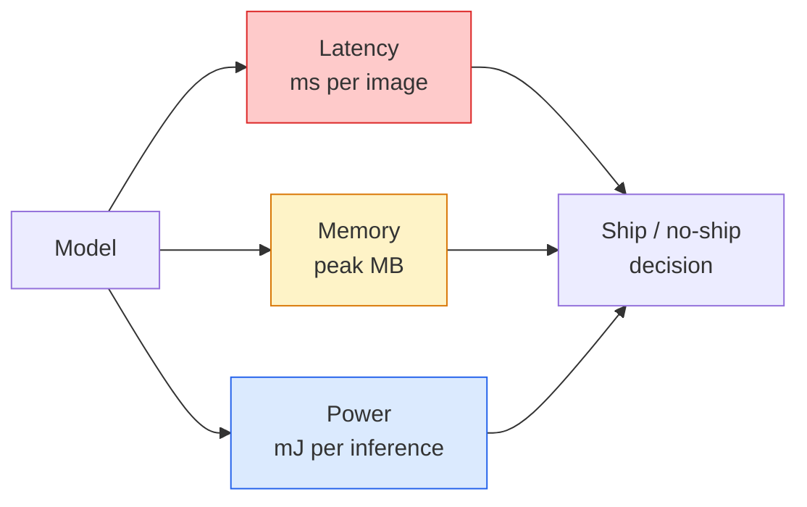

# Gerçek Zaman Görüşü  Kısıtlama

> Kenar çıkarım, 90 doğruluklu bir modelin 2 GB RAM'li bir cihazda 30 fps hızında çalışmasını sağlamak için disiplindir.

**Type:** Learn + Build
**Languages:** Python
**Prerequisites:** Phase 4 Lesson 04 (Image Classification), Phase 10 Lesson 11 (Quantization)
**Time:** ~75 minutes

## Öğrenme Hedefleri

- Herhangi bir PyTorch modeli için sonuç geçiciliği, en yüksek hafıza ve geçiş ölçümleri ve FLOPs / params / latency trade-off'u okuyun
- PyTorch'ın eğitim sonrası kuantitasyonunu kullanarak bir görme modelini INT8'e kadar kuantite edin ve doğruluk kaybını < 1%'e doğru tutun
- ONNX'e ihraç ve ONNX Runtime veya TensorRT ile oluşturmak; en yaygın üç ihraç hata ve onların düzeltmeleri
- Kenar kısıtlama için MobileNetV3, EfficientNet-Lite, ConvNeXt-Tiny veya MobileViT'yi ne zaman seçmeyi açıklayın

## Sorun

Eğitim zamanında görme modeli yüzen nokta canavarıdır. 100M parametreleri, ileri geçiş başına 10 GFLOP, 2 GB VRAM. Bunların hiçbiri bir telefona, bir aracın infotainment birimine, endüstriyel bir kameraya veya bir drone'a uymamaktadır. Görme sistemini göndermek aynı tahminleri 100 kat daha küçük bir bütçeye uymak anlamına gelir.

İşin büyük kısmını üç düğme yapar: model seçimi (aynı tarifle daha küçük bir mimarlık), kuantitasyon (FP32 yerine INT8) ve sonuç çalıştırma süresi (ONNX Runtime, TensorRT, Core ML, TFLite).

Bu ders önce ölçüm disiplini ayarlar ( ölçemediğiniz şeyi optimize edemezsiniz), sonra üç düğmeyi yürütür. Amaç her kenar çalıştırma zamanını öğrenmek değil, hangi kaldıraçların olduğunu bilmek ve her birinin düşündüğünüz şeyi nasıl yaptığını nasıl doğrulayacağınızı bilmek.

## Anlaşım

### Üç bütçe



- **Latency**Ortalama sadece p50'de gerçek zamanlı sistemler için önemli olan kuyruğu davranışları gizlenir.
- **Peak memory**Bu, cihazın gördüğü maksimum, sabit durum ortalaması değil.
- **Power / energy**Batarya ile çalışan bir cihazda: her sonuca göre millijoules.

Bir kenar kararının alınması için bir tablo (model, gecikme, bellek, doğruluk) kullanılır. Her hücre hedef cihazda ölçülür, iş istasyonunda değil.

### Ölçüm disiplinleri

Her kenar profili takip etmesi gereken üç kural:

1. **Warm up**Bu nedenle, bu testlerin en önemli sonuçları, ölçümden önce 5-10 numara ileriye geçiş yaparak elde edilebilir.
2. **Synchronise**GPU iş yükleri `torch.cuda.synchronize()`Bu olmadan çekirdek gönderisini ölçersiniz, çekirdek yürütmesini değil.
3. **Fix input sizes**224x224'de gecikme 512x512'de gecikme değil.

### FLOPs bir vekil olarak

FLOPs (doğru sonuçlar için kayarak nokta işlemleri) gecikme için ucuz, cihaz bağımsız bir vekildir. Mimarlık karşılaştırması için yararlı, mutlak duvar saati gibi yanıltıcıdır. %10 daha fazla FLOP'li bir model, donanım dostu ops kullanıldığı için pratikte 2 kat daha hızlı olabilir ( derinlik konvoyları iyi bir şekilde oluşturur, büyük 7x7 konvoyları değil).

Kural: mimarlık aramaları için FLOP'ler kullanın, yerleştirme kararları için cihazda gecikme kullanın.

### Bir paragrafdaki miktar

Model boyutu 4x düşer, bellek bant genişliği 4x düşer, hesaplama INT8 çekirdekleri olan donanımlarda 2-4x düşer (her modern mobil SoC, Tensor Cores ile her NVIDIA GPU). Görme görevlerinde doğruluk kaybı tipik olarak eğitim sonrası statik kvantizasyonla 0.1-1 yüzde puan.

Tipler:

- **Dynamic** INT8'e kadar kuantit ağırlıkları, FP'de hesaplanan aktivasyonlar.
- **Static (post-training)** kuantit ağırlıkları + kalibrasyon aktivasyonu aralıkları küçük bir kalibrasyon seti üzerinde.
- **Quantisation-aware training (QAT)** eğitim sırasında kuantitasyonu simüle etmek, böylece model etrafında öğrenir.

Görme için, eğitim sonrası statik kvantizasyon, çabaların %5'inde %95'iyle fayda sağlar.

### Kesim ve destilasyon

- **Pruning** önemli olmayan ağırlıkları (büyüklük tabanlı) veya kanalları (strüküratürlü) kaldırmak.
- **Distillation** küçük bir öğrenciyi büyük bir öğretmenin logitlerini taklit etmek için eğitmek. Genellikle modelin küçültülmesiyle kaybedilen doğrulukun çoğunu geri kazanır.

### Sonuçlama çalışma zamanları

- **PyTorch eager** yavaş, kullanımı için değil.
- **TorchScript** mirası.`torch.compile`ve ONNX ihracatı.
- **ONNX Runtime**CPU, CUDA, CoreML, TensorRT, OpenVINO hepsi ONNX sağlayıcıları var.
- **TensorRT**NVIDIA'nın en iyi gecikme süresi (workstation ve Jetson). ONNX Runtime veya standalone ile entegre.
- **Core ML** Apple'ın iOS/macOS için çalıştırma zamanı.`.mlmodel`veya `.mlpackage`- Evet .
- **TFLite** Google'ın Android/ARM için çalıştırma zamanı. Gereksinimler `.tflite`- Evet .
- **OpenVINO** Intel'in CPU/VPU çalıştırma süresi.`.xml`+ `.bin`- Evet .

Uygulama: PyTorch -> ONNX -> export. ONNX, hedef için çalıştırma zamanı seçin.

### Kenar mimarlık seçicisi

| Budget | Model | Why |
|--------|-------|-----|
| < 3M params | MobileNetV3-Small | Compiles everywhere, good baseline |
| 3-10M | EfficientNet-Lite-B0 | Best accuracy per param on TFLite |
| 10-20M | ConvNeXt-Tiny | Best accuracy-per-param, CPU-friendly |
| 20-30M | MobileViT-S or EfficientViT | Transformer with ImageNet accuracy |
| 30-80M | Swin-V2-Tiny | If stack supports window attention |

Tüm bunları INT8'e kadar miktarlandırın, eğer yapmamaya kesin bir nedeniniz yoksa.

```figure
cnn-param-count
```

## Yapın

### Adım 1: Gecikme sürelerini doğru bir şekilde ölçün

```python
import time
import torch

def measure_latency(model, input_shape, device="cpu", warmup=10, iters=50):
    model = model.to(device).eval()
    x = torch.randn(input_shape, device=device)
    with torch.no_grad():
        for _ in range(warmup):
            model(x)
        if device == "cuda":
            torch.cuda.synchronize()
        times = []
        for _ in range(iters):
            if device == "cuda":
                torch.cuda.synchronize()
            t0 = time.perf_counter()
            model(x)
            if device == "cuda":
                torch.cuda.synchronize()
            times.append((time.perf_counter() - t0) * 1000)
    times.sort()
    return {
        "p50_ms": times[len(times) // 2],
        "p95_ms": times[int(len(times) * 0.95)],
        "p99_ms": times[int(len(times) * 0.99)],
        "mean_ms": sum(times) / len(times),
    }
```

                                                                                                                                                                                                                                                                                                                                                                                                                                                                                                                             `time.perf_counter()`- Rapor yüzdeleri, sadece kötü değil.

### Adım 2: Parametr ve FLOP sayıları

```python
def parameter_count(model):
    return sum(p.numel() for p in model.parameters())

def flops_estimate(model, input_shape):
    """
    Rough FLOP count for a conv/linear-only model. For production use `fvcore` or `ptflops`.
    """
    total = 0
    def conv_hook(m, inp, out):
        nonlocal total
        c_out, c_in, kh, kw = m.weight.shape
        h, w = out.shape[-2:]
        total += 2 * c_in * c_out * kh * kw * h * w
    def linear_hook(m, inp, out):
        nonlocal total
        total += 2 * m.in_features * m.out_features
    hooks = []
    for m in model.modules():
        if isinstance(m, torch.nn.Conv2d):
            hooks.append(m.register_forward_hook(conv_hook))
        elif isinstance(m, torch.nn.Linear):
            hooks.append(m.register_forward_hook(linear_hook))
    model.eval()
    with torch.no_grad():
        model(torch.randn(input_shape))
    for h in hooks:
        h.remove()
    return total
```

Gerçek projeler için kullanmak `fvcore.nn.FlopCountAnalysis`veya `ptflops`; her modül türünü doğru şekilde ele alırlar.

### Adım 3: Eğitim sonrası statik miktarlandırma

```python
def quantise_ptq(model, calibration_loader, backend="x86"):
    import torch.ao.quantization as tq
    model = model.eval().cpu()
    model.qconfig = tq.get_default_qconfig(backend)
    tq.prepare(model, inplace=True)
    with torch.no_grad():
        for x, _ in calibration_loader:
            model(x)
    tq.convert(model, inplace=True)
    return model
```

Üç adım: yapılandırma, hazırlama (güzülmüş gözlemciler ekle), gerçek verilerle kalibrasyon, dönüştürme (füz + kuantit).`Conv -> BN -> ReLU`-> `ConvBnReLU`), ki `torch.ao.quantization.fuse_modules`Elleri.

### 4. Adım: ONNX'e ihracat

```python
def export_onnx(model, sample_input, path="model.onnx"):
    model = model.eval()
    torch.onnx.export(
        model,
        sample_input,
        path,
        input_names=["input"],
        output_names=["output"],
        dynamic_axes={"input": {0: "batch"}, "output": {0: "batch"}},
        opset_version=17,
    )
    return path
```

`opset_version=17`2026'da güvenli bir default.`dynamic_axes`ONNX modelini kendiliğinden seri boyutları ile çalıştırmak için.

### Adım 5: Sistemi değerlendir ve karşılaştır

```python
import torch.nn as nn
from torchvision.models import mobilenet_v3_small

def compare_regimes():
    model = mobilenet_v3_small(weights=None, num_classes=10)
    params = parameter_count(model)
    flops = flops_estimate(model, (1, 3, 224, 224))
    lat_fp32 = measure_latency(model, (1, 3, 224, 224), device="cpu")
    print(f"FP32 MobileNetV3-Small: {params:,} params  {flops/1e9:.2f} GFLOPs  "
          f"p50={lat_fp32['p50_ms']:.2f}ms  p95={lat_fp32['p95_ms']:.2f}ms")
```

Aynı işlevi  için çalıştır`resnet50`- Evet .`efficientnet_v2_s`ve`convnext_tiny`ve yerleşim kararı için ihtiyacınız olan karşılaştırma tablosu var.

## Kullan

Üretim yığınları üç yoldan birinde birleşti:

- **Web / serverless**PyTorch -> ONNX -> ONNX Runtime (CPU veya CUDA sağlayıcısı).
- **NVIDIA edge (Jetson, GPU server)**En iyi gecikme, en büyük mühendislik çabaları.
- **Mobile**PyTorch -> ONNX -> Core ML (iOS) veya TFLite (Android).

Ölçüm için, `torch-tb-profiler`- Evet .`nvprof`- Ne ?`nsys`, ve macOS'taki araçlar katman-katman ayrıntıları verir. `benchmark_app`(OpenVINO) ve `trtexec`(TensorRT) bağımsız CLI numaraları verin.

## Gönder

Bu ders şunları ortaya çıkarır:

- `outputs/prompt-edge-deployment-planner.md` omurganı, kuantitasyon stratejisini ve hedef cihaz ve gecikme SLA'yı verilen çalıştırma zamanını seçen bir istek.
- `outputs/skill-latency-profiler.md`                                                                                                                                                                                                                                                              

## Egzersizler

1. **(Easy)** için p50 gecikme ölçüm`resnet18`- Evet .`mobilenet_v3_small`- Evet .`efficientnet_v2_s`ve`convnext_tiny`CPU'da 224x224'e göre. Tabloyu rapor edin ve hangi mimarinin en iyi doğruluğu olduğunu belirleyin.
2. **(Medium)**                                                                                                                                                                                                                                                                                                                                                                                                                                                                                                                             `mobilenet_v3_small`. CIFAR-10 veya benzeri bir alt kümede FP32 vs INT8 gecikme ve doğruluk kaybını bildirin.
3. **(Hard)**Dışarıya Çekilme`convnext_tiny`ONNX'e, geçin.`onnxruntime`- ... ...`CPUExecutionProvider`, ve gecikmeyi PyTorch'ın istekli tabanına karşılaştırın. ONNX çalıştırma süresi daha hızlı olan ilk katmanı belirleyin ve nedenini açıklayın.

## Anahtar Terimler

| Term | What people say | What it actually means |
|------|----------------|----------------------|
| Latency | "How fast" | Time from input to output; p50/p95/p99 percentiles, not mean |
| FLOPs | "Model size" | Floating-point ops per forward pass; rough proxy for compute cost |
| INT8 quantisation | "8-bit" | Replace FP32 weights/activations with 8-bit integers; ~4x smaller, 2-4x faster |
| PTQ | "Post-training quantisation" | Quantise a trained model without retraining; easy, usually enough |
| QAT | "Quantisation-aware training" | Simulate quantisation during training; best accuracy, requires labelled data |
| ONNX | "The neutral format" | Model exchange format supported by every mainstream inference runtime |
| TensorRT | "NVIDIA compiler" | Compiles ONNX into an optimised engine for NVIDIA GPUs |
| Distillation | "Teacher -> student" | Train a small model to mimic a big model's logits; recovers most lost accuracy |

## Daha Fazla Okumak

- [EfficientNet (Tan & Le, 2019)](https://arxiv.org/abs/1905.11946) verimli mimariler için bileşik ölçeklendirme
- [MobileNetV3 (Howard et al., 2019)](https://arxiv.org/abs/1905.02244) H-swish ve squeeze-excite ile mobil ilk mimarisi
- [A Practical Guide to TensorRT Optimization (NVIDIA)](https://developer.nvidia.com/blog/accelerating-model-inference-with-tensorrt-tips-and-best-practices-for-pytorch-users/) Kağıtdaki geçiş sayısını nasıl elde edebilirsiniz
- [ONNX Runtime docs](https://onnxruntime.ai/docs/) Kvantisaj, grafik optimizasyonu, tedarikçi seçimi
