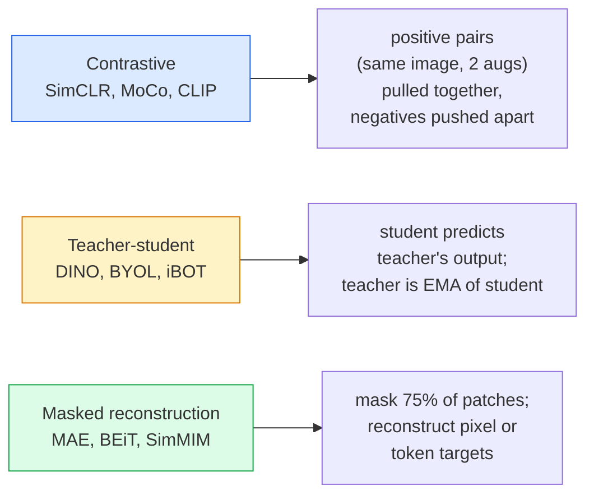

# Kendini Gözetleyici Görüş  SimCLR, DINO, MAE

> Etiketler denetimli görmenin şişeneği. Kendini denetimli bir öncülük onları ortadan kaldırır: 100 milyon etiketsiz görüntüden görsel özellikler öğrenir, 10 bin etiketli görüntüde ince ayarlar yapar.

**Type:** Learn + Build
**Languages:** Python
**Prerequisites:** Phase 4 Lesson 04 (Image Classification), Phase 4 Lesson 14 (ViT)
**Time:** ~75 minutes

## Öğrenme Hedefleri

- Üç büyük kendi kendine denetimli aileyi izleyin  kontrast (SimCLR), öğretmen-öğrenci (DINO), maskeli yeniden inşaat (MAE)  ve her birinin neyi optimize ettiğini belirtin
- InfoNCE kaybını sıfırdan uygulayın ve 512'nin bir parti neden işe yarıyor ama 32'nin bir parti neden başarısız olduğunu açıklayın
- MAE'nin 75% maske oranının neden keyfi olmadığını ve metin için BERT'nin 15% oranından nasıl farklı olduğunu açıklayın.
- Dinov2 veya MAE ImageNet kontrol noktalarını, doğrusal araştırma ve sıfır çekim çekimleri için kullanın.

## Sorun

Gözetim ImageNet'in, kaydedilmesi için tahmini 10 milyon dolarlık maliyetli 1.3 milyon etiketli görüntü var. Tıp ve endüstriyel veri kümeleri daha küçük ve etiketlemek daha pahalıdır. Her vizyon ekibi soruyor: ucuz etiketsiz veri üzerinde önceden eğitim alabilir miyiz?

Kendini denetleyen öğrenme cevabıdır. LAION veya JFT üzerinde eğitilen modern kendi kendine denetlenen ViT, ince ayarlandığında denetlenen ImageNet doğruluğuna ulaşır veya yener. Ayrıca denetlenen ön eğitimden daha iyi aşağı akıntılı görevlere (kaşif, segmentasyon, derinlik) aktarır. DINOv2 (Meta, 2023) ve MAE (Meta, 2022) aktarılabilir görüş özellikleri için mevcut üretim öntanımlılarıdır.

Konsep değişikliği, bahane görevinin  modelin yapması için eğitilmiş olduğu şey 'nin aşağıdaki görev olması gerektiği anlamına gelmez. Önemli olan modelin yararlı özellikleri öğrenmesini zorlamasıdır. Gri ölçekli görüntülerin rengini tahmin edin, görüntüleri döndürün ve modelden dönümleri sınıflandırmasını isteyin, yamaları maskelenin ve yeniden yapılandırın  hepsi işe yaradı. Bu ölçekle ilgili üç yaklaşım kontrastlı öğrenme, öğretmen-öğrenci distilasyonu ve maskeli yeniden inşaat.

## Anlaşım

### Üç aile



### Kontrastlı öğrenme (SimCLR)

Bir görüntü alın, iki rastgele artış uygulayın, iki görüntü alın. Her ikisini de aynı kodla bir projeksiyon başlığı ile besleyin. "Bu iki yerleşim yakın olmalı" ve "bu yerleşim partideki diğer tüm görüntülerin yerleşimlerinden uzak olmalıdır" diyen bir kayıpı en aza indir.

```
Loss for positive pair (z_i, z_j) among 2N views per batch:

   L_ij = -log( exp(sim(z_i, z_j) / tau) / sum_k in batch \ {i} exp(sim(z_i, z_k) / tau) )

sim = cosine similarity
tau = temperature (0.1 standard)
```

Bu InfoNCE kaybı. Pozitif başına birçok negatif gerektirir, bu nedenle seri boyutu önemlidir. SimCLR 512-8192 gerektirir. MoCo, negatif sayıyı seri boyutundan ayırmak için geçmiş partilerin bir momentum kuyrukunu tanıttı.

### Öğretmen-öğrenci (DINO)

Aynı mimari olan iki ağ: öğrenci ve öğretmen. Öğretmen öğrencinin ağırlıklarının eksponensel hareketli ortalamasıdır. Her ikisi de görüntüde artış görüyor. Öğrencinin çıkışı öğretmenin  açık negatifleri ile eşleşecek şekilde eğitilmiştir.

```
loss = CE( student_output(view_1),  teacher_output(view_2) )
     + CE( student_output(view_2),  teacher_output(view_1) )

teacher_weights = m * teacher_weights + (1 - m) * student_weights   (m ≈ 0.996)
```

"Bir sabit tahmin etmek" için neden çökmez: öğretmenin çıkışı merkezi (ölüm ortalamasını çıkar) ve keskinleştirilmiştir (küçük sıcaklıkla bölünür).

DINO, DINOv2'nin 142M kurate görüntüde ölçeklendirdiği şeydir.

### Maskeli Yeniden Yapım (MAE)

ViT girişinin %75'ini maskeye alın. Görünen %25'i sadece kodlayıcı üzerinden geçirir. Küçük bir dekoder maske pozisyonlarında kodlayıcıın çıkışını ve maske tokenlerini alır ve maske patchlerin piksellerini yeniden yapılandırmak için eğitilir.

```
Encoder:  visible 25% of patches -> features
Decoder:  features + mask tokens at masked positions -> reconstructed pixels
Loss:     MSE between reconstructed and original pixels on masked patches only
```

MAE'nin çalışmasını sağlayan temel tasarım seçenekleri:

- **75% mask ratio** yüksek. Kodlayıcıyı semantik özellikleri öğrenmeye zorlar; %25'i yeniden yapılandırmak neredeyse önemsiz olurdu (komşu pikseller CNN'in çivileyebileceği kadar ilişkili).
- **Asymmetric encoder/decoder** büyük ViT kodlayıcı sadece görünür yamalar görür; küçük bir dekoder (8 katlı, 512 boyutlu) yeniden yapılandırmayı ele alır.
- **Pixel-space reconstruction target** BEiT'in simgesel hedefinden daha basit ve ViT'de daha iyi çalışır.

Eğitimden önce, dekodörü atın.

### Neden %75'i %15'i değil?

BERT, tokenlerin %15'ini, MAE'nin %75'ini maske eder.

- Doğal dil, her token için yüksek entropiye sahiptir. Tokenlerin %15'ini tahmin etmek hala zor çünkü her maskeli pozisyonun birçok makul tamamlaması vardır.
- Resim yamalarının entropisi düşüktür. maskeli bir mahalle genellikle maskeli yama piksellerini neredeyse tam olarak belirler. Tahmin yapmak için semantik anlayış gerektirir, agresif bir şekilde maske yapmanız gerekir.

%75 basit uzaysal ekstrapolasyonun görevi çözemeyeceği kadar yüksek; kodlayıcı görüntü içeriğini temsil etmelidir.

### Düzsel araştırma değerlendirme

Kendini denetleyen bir eğitim öncesi eğitimden sonra standart değerlendirme bir **linear probe**: kodlayıcıyı dondurmak, ImageNet etiketlerinde üstte tek bir çizgi sınıflandırıcı çalıştırmak.

- SimCLR ResNet-50: ~71% (2020)
- DINO ViT-S/16: ~77% (2021)
- MAE ViT-L/16: ~76% (2022)
- DINOv2 ViT-g/14: ~86% (2023)

Düzsel araştırma, özellik kalitesi için saf bir ölçümdür; ince ayarlama genellikle 2-5 puan ekler, ancak aynı zamanda kafa yeniden eğitimi etkisinde karışır.

```figure
data-augmentation
```

## Yapın

### Adım 1: İki görüntü artıran boru hattı

```python
import torch
import torchvision.transforms as T

two_view_train = lambda: T.Compose([
    T.RandomResizedCrop(96, scale=(0.2, 1.0)),
    T.RandomHorizontalFlip(),
    T.ColorJitter(0.4, 0.4, 0.4, 0.1),
    T.RandomGrayscale(p=0.2),
    T.ToTensor(),
])


class TwoViewDataset(torch.utils.data.Dataset):
    def __init__(self, base):
        self.base = base
        self.aug = two_view_train()

    def __len__(self):
        return len(self.base)

    def __getitem__(self, i):
        img, _ = self.base[i]
        v1 = self.aug(img)
        v2 = self.aug(img)
        return v1, v2
```

Her biri .__getitem__Aynı görüntünün iki eklenmiş görüntüsü gönderir; etiketlere gerek yoktur.

### Adım 2: InfoNCE kaybı

```python
import torch.nn.functional as F

def info_nce(z1, z2, tau=0.1):
    """
    z1, z2: (N, D) L2-normalised embeddings of paired views
    """
    N, D = z1.shape
    z = torch.cat([z1, z2], dim=0)  # (2N, D)
    sim = z @ z.T / tau              # (2N, 2N)

    mask = torch.eye(2 * N, dtype=torch.bool, device=z.device)
    sim = sim.masked_fill(mask, float("-inf"))

    targets = torch.cat([torch.arange(N, 2 * N), torch.arange(0, N)]).to(z.device)
    return F.cross_entropy(sim, targets)
```

L2 çağrıdan önce yerleştirmeleri normalleştir. `tau=0.1`SimCLR'nin varsayılan değeridir; düşük kayıp daha keskin hale gelir ve daha fazla negatif gerektirir.

### Adım 3: InfoNCE akıl sağlığı kontrolü

```python
z1 = F.normalize(torch.randn(16, 32), dim=-1)
z2 = z1.clone()
loss_same = info_nce(z1, z2, tau=0.1).item()
z2_random = F.normalize(torch.randn(16, 32), dim=-1)
loss_random = info_nce(z1, z2_random, tau=0.1).item()
print(f"InfoNCE with identical pairs:  {loss_same:.3f}")
print(f"InfoNCE with random pairs:     {loss_random:.3f}")
```

Aynı çiftler düşük bir kaybı (büyük bir parti ve soğuk sıcaklık için 0'ya yakın) vermektedir.

### 4. adım: MAE tarzı maskeli

```python
def random_mask_indices(num_patches, mask_ratio=0.75, seed=0):
    g = torch.Generator().manual_seed(seed)
    n_keep = int(num_patches * (1 - mask_ratio))
    perm = torch.randperm(num_patches, generator=g)
    visible = perm[:n_keep]
    masked = perm[n_keep:]
    return visible.sort().values, masked.sort().values


num_patches = 196
visible, masked = random_mask_indices(num_patches, mask_ratio=0.75)
print(f"visible: {len(visible)} / {num_patches}")
print(f"masked:  {len(masked)} / {num_patches}")
```

Gerçek MAE uygulamalar bunu bir seri olarak toplayıp örnek maskelerini tutarlar.

## Kullan

DINOv2 2026'da üretim standartıdır:

```python
import torch
from transformers import AutoImageProcessor, AutoModel

processor = AutoImageProcessor.from_pretrained("facebook/dinov2-base")
model = AutoModel.from_pretrained("facebook/dinov2-base")
model.eval()

# Per-image embeddings for zero-shot retrieval
with torch.no_grad():
    inputs = processor(images=[pil_image], return_tensors="pt")
    outputs = model(**inputs)
    embedding = outputs.last_hidden_state[:, 0]  # CLS token
```

Sonuç olarak 768 boyutlu bir yerleşim, modern görüntü alım, yoğun bir karşılıklılık ve sıfır çekim transfer boru hattının omurgasıdır.

Resim metni yerleştirmeler için SigLIP veya OpenCLIP eşdeğerdir. MAE tarzı ince ayarlama için `timm`Her MAE kontrol noktasında repo gemileri gönderiliyor.

## Gönder

Bu ders şunları ortaya çıkarır:

- `outputs/prompt-ssl-pretraining-picker.md` bir istek SimCLR / MAE / DINOv2'yi seçer veri kümesi boyutu, hesaplama ve aşağıdaki görev verildi.
- `outputs/skill-linear-probe-runner.md` dondurulmuş kodlayıcı + etiketlenen veri kümesi için çizgi-sonde değerlendirmesini yazma becerisi.

## Egzersizler

1. **(Easy)**İyi uyumlu yerleşimlerde sıcaklık düştüğünde ve rastgele yerleşimlerde sıcaklık düştüğünde yükseldiğinde InfoNCE kaybının düştüğünü kontrol edin.`tau in [0.05, 0.1, 0.2, 0.5]`Kayıp karşısında.
2. **(Medium)**DINO tarzı merkez tamponu uygulayın. Merkezleme olmadan öğrencinin birkaç dönem içinde sabit bir vektöre düştüğünü gösterin.
3. **(Hard)**CIFAR-100'de TinyUNet'i omurgası olarak kullanarak MAE'yi eğit. 10, 50 ve 200 dönemlerde çizgi-sonde doğruluğunu bildirin. MAE'den önceden eğitilmiş bir çizgi-sonde aynı 1000 görüntü alt kümesinde sıfırdan denetim altında olan bir çizgi-sondeyi yendiğini gösterin.

## Anahtar Terimler

| Term | What people say | What it actually means |
|------|----------------|----------------------|
| Self-supervised | "Label-free" | A pretext task that produces useful representations from unlabelled data |
| Pretext task | "The fake task" | The objective used during SSL (reconstruct patches, match views); discarded after pretraining |
| Linear probe | "Frozen encoder + linear head" | Standard SSL evaluation: train only a linear classifier on top of frozen features |
| InfoNCE | "Contrastive loss" | softmax over cosine similarities; positive pair is the target class, all others are negatives |
| EMA teacher | "Moving-average teacher" | Teacher whose weights are an exponential moving average of the student's; used by BYOL, MoCo, DINO |
| Mask ratio | "% of patches hidden" | Fraction of patches masked during MAE; 75% for vision, 15% for text |
| Representation collapse | "Constant output" | SSL failure where the encoder outputs a constant vector for all inputs; prevented by centring, sharpening, or negatives |
| DINOv2 | "Production SSL backbone" | Meta's 2023 self-supervised ViT; strongest general-purpose image features in 2026 |

## Daha Fazla Okumak

- [SimCLR (Chen et al., 2020)](https://arxiv.org/abs/2002.05709) Kontrastlı öğrenme referansı
- [DINO (Caron et al., 2021)](https://arxiv.org/abs/2104.14294) Eğitim, merkez, keskinleşme ile öğretmen-öğrenci
- [MAE (He et al., 2022)](https://arxiv.org/abs/2111.06377) Maskeli oto kodlayıcı
- [DINOv2 (Oquab et al., 2023)](https://arxiv.org/abs/2304.07193) Kendiliğinden denetimli ViT'yi üretim özelliklerine ölçeklendirme
