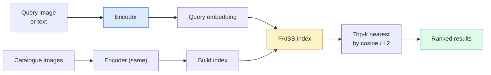

# Resim Alım ve Metrik Öğrenim

> Bir çekim sistemi, adayları yerleşim alanında mesafe ile sıralar. Metrik öğrenme, bu alanı şekillendirmenin disiplini, böylece mesafeler istediğiniz şeyi ifade eder.

**Type:** Build
**Languages:** Python
**Prerequisites:** Phase 4 Lesson 14 (ViT), Phase 4 Lesson 18 (CLIP)
**Time:** ~45 minutes

## Öğrenme Hedefleri

- Üçlü, kontrastlı ve vekili tabanlı metrik öğrenme kaybını açıklayın ve verilen bir veri kümesi için doğru olanı seçin
- L2 normallaşımı ve kozin benzerliği doğru bir şekilde uygulayacak ve "aynı madde" ve "aynı sınıf" geri alım arasındaki farkı denetleyecektir.
- FAISS indeksini oluşturun, metin ve resim ile sorgulayın ve beklenmiş sorgu kümesi için recall@K raporlayın
- DINOv2, CLIP ve SigLIP'i raf dışı omurgan olarak kullanın ve her birinin ne zaman kazandığını bilin

## Sorun

İsteğe bağlı olarak, bu görüntüde, "Bu sorgu görüntüsünü göz önüne alarak, kataloğumu sıralayın".

İki tasarım kararı tüm sistemi şekillendirir. Ekleme  hangi model vektörleri üretir. İndeks  ölçekte en yakın komşuları nasıl bulursunuz. Her ikisi de 2026'da malzeme (ekleme için DINOv2, indeks için FAISS), bu da çubuğu yükseltir: zor kısmı uygulamanız için * benzer olarak sayılan * neyi tanımlamak, ardından ekleme alanını şekillendirmeyi uzaklıkların eşleşmesini sağlar.

Bu şekillendirme, ölçülü öğrenme. Küçük ama yüksek dereceli bir disiplin.

## Anlaşım

### Bir bakışta bir çıkış



### Dört kaybeden aile

| Loss | Requires | Pros | Cons |
|------|----------|------|------|
| **Contrastive** | (anchor, positive) + negatives | Simple, works with any pair label | Slow to converge without many negatives |
| **Triplet** | (anchor, positive, negative) | Intuitive; direct margin control | Hard-triplet mining is expensive |
| **NT-Xent / InfoNCE** | Pairs + batch-mined negatives | Scales to large batches | Needs big batch or momentum queue |
| **Proxy-based (ProxyNCA)** | Class labels only | Fast, stable, no mining | Can overfit to proxies on small datasets |

Çoğu üretim kullanım vakaları için, önceden eğitilmiş bir omurganla başlayın ve test setinizde raf dışı gömülmeler düşük performans gösterirse metrik öğrenme ince ayarını ekleyin.

### Üçlü kayıp resmi olarak

```
L = max(0, ||f(a) - f(p)||^2 - ||f(a) - f(n)||^2 + margin)
```

Ankarı çek .`a`- Evet .`p`, negatifden uzaklaştır .`n`, bir `margin`Üç görüntü yapısı, herhangi bir benzerlik düzenlemesine genel hale gelir.

Madencilik: kolay üçlü (`n`Çok uzakta .`a`) sıfır kaybı katkıda bulunur; ağı sadece sert üçlüler öğretir.`n``p`2016 FaceNet tarifi ve hala hakim.

### Cosine benzerliği vs L2

İki ölçüm, iki sözleşme:

- **Cosine**L2 normallaştırılmış yerleşimler gerektirir.
- **L2**: Euclidean mesafe. Çöm veya normalleştirilmiş yerleşimlerde çalışır, ancak genellikle L2-normalleştirilmiş + kare L2 ile eşleştirilmektedir.

Çoğu modern ağ için ikisi eşittir: `||a - b||^2 = 2 - 2 cos(a, b)`Ne zaman ?`||a|| = ||b|| = 1`-Embedding eğitimine uygun bir konferans seçin; onları sessizce karıştırmak "en yakın" anlamına gelen şeyi değiştirir.

### Hatırlat @ K

Standart geri alma metrikası:

```
recall@K = fraction of queries where at least one correct match is in the top K results
```

Rapor hatırlatma@1, @5, @10 yan yana. 0.95'in üzerinde hatırlatma@10 ve 0.5'in altında hatırlatma@1 yerleştirme alanının doğru yapısına sahip olduğu anlamına gelir, ancak sıralama gürültülü  daha uzun ince tonlar veya yeniden sıralama adımlarını deneyin.

Çift tespit için, doğruluk@K daha önemlidir çünkü her yanlış pozitif kullanıcı tarafından görünür bir hatadır. Görsel arama için, hatırlatmak@K ürün sinyalidır.

### FAISS tek bir paragraf

Facebook AI benzerlik Arama. En yakın komşu araması için gerçek kütüphanesi. Üç indeks seçeneği:

- `IndexFlatIP`- Ne ?`IndexFlatL2`- Kötü güç, tam, eğitim yok. ~ 1M vektörlere kadar kullan.
- `IndexIVFFlat`K hücrelerine bölün, sadece en yakın birkaç hücreyi arayın. Yaklaşık, hızlı, eğitim verilerine ihtiyaç vardır.
- `IndexHNSW` Grafik tabanlı, birçok sorgu için en hızlı, büyük indeks boyutu.

100 bin vektör için muhtemelen isteyeceksin .`IndexFlatIP`10M için istediğiniz şey`IndexIVFFlat`. 100M+ ile birlikte ürün miktarı (`IndexIVFPQ`)

### Durum seviyesinde ve kategoride geri alınma

Aynı isimle iki farklı sorun var:

- **Category-level** "katalogumda kedileri bul". Sınıf koşulları benzerliği; raf dışı CLIP / DINOv2 yerleşimleri iyi çalışır.
- **Instance-level** "katalogumda *bu tam ürünü bul". Aynı sınıfın görsel olarak benzer nesneler arasında ince ayrımcılığa ihtiyaç duyulur; raf dışı gömülmeler düşük performans gösterir; metrik öğrenme konularında ince ayarlama yapılır.

Her zaman bir model seçmeden önce hangisini çözmeye çalıştığını sor.

```figure
metric-embedding
```

## Yapın

### Adım 1: Üçlü kayıp

```python
import torch
import torch.nn.functional as F

def triplet_loss(anchor, positive, negative, margin=0.2):
    d_ap = F.pairwise_distance(anchor, positive, p=2)
    d_an = F.pairwise_distance(anchor, negative, p=2)
    return F.relu(d_ap - d_an + margin).mean()
```

L2 standartlaştırılmış veya ham gömülmeler üzerinde çalışır.

### İkinci adım: Yarım sert madencilik

Bir sürü yerleşim ve etiket verildiğinde, her bir demir için en sert yarı sert negatif bul.

```python
def semi_hard_negatives(emb, labels, margin=0.2):
    dist = torch.cdist(emb, emb)
    same_class = labels[:, None] == labels[None, :]
    diff_class = ~same_class
    N = emb.size(0)

    positives = dist.clone()
    positives[~same_class] = float("-inf")
    positives.fill_diagonal_(float("-inf"))
    pos_idx = positives.argmax(dim=1)

    semi_hard = dist.clone()
    semi_hard[same_class] = float("inf")
    d_ap = dist[torch.arange(N), pos_idx].unsqueeze(1)
    semi_hard[dist <= d_ap] = float("inf")
    neg_idx = semi_hard.argmin(dim=1)

    fallback_mask = semi_hard[torch.arange(N), neg_idx] == float("inf")
    if fallback_mask.any():
        hardest = dist.clone()
        hardest[same_class] = float("inf")
        neg_idx = torch.where(fallback_mask, hardest.argmin(dim=1), neg_idx)
    return pos_idx, neg_idx
```

Her demir sınıfındaki en sert olumlu ve olumlu'dan daha uzak ama kenarlıkta olan yarı sert bir negatif elde eder.

### Adım 3: Hatırlat

```python
def recall_at_k(query_emb, gallery_emb, query_labels, gallery_labels, k=1):
    sim = query_emb @ gallery_emb.T
    _, top_k = sim.topk(k, dim=-1)
    matches = (gallery_labels[top_k] == query_labels[:, None]).any(dim=-1)
    return matches.float().mean().item()
```

L2 normalleştirilmiş yerleşimlerde iç ürünün üst-k, cosine üst-k'e eşit. En az bir doğru komşu ile sorguların ortalama oranını bildirin.

### Dördüncü adım: Bir araya getirmek

```python
import torch
import torch.nn as nn
from torch.optim import Adam

class Encoder(nn.Module):
    def __init__(self, in_dim=128, emb_dim=64):
        super().__init__()
        self.net = nn.Sequential(
            nn.Linear(in_dim, 128), nn.ReLU(),
            nn.Linear(128, emb_dim),
        )

    def forward(self, x):
        return F.normalize(self.net(x), dim=-1)

torch.manual_seed(0)
num_classes = 6
protos = F.normalize(torch.randn(num_classes, 128), dim=-1)

def sample_batch(bs=32):
    labels = torch.randint(0, num_classes, (bs,))
    x = protos[labels] + 0.15 * torch.randn(bs, 128)
    return x, labels

enc = Encoder()
opt = Adam(enc.parameters(), lr=3e-3)

for step in range(200):
    x, y = sample_batch(32)
    emb = enc(x)
    pos_idx, neg_idx = semi_hard_negatives(emb, y)
    loss = triplet_loss(emb, emb[pos_idx], emb[neg_idx])
    opt.zero_grad(); loss.backward(); opt.step()
```

Birkaç yüz adımdan sonra yerleştirme kümeleri her sınıf için bir kümesi oluşturur.

## Kullan

2026'da üretim aşamaları:

- **DINOv2 + FAISS**Genel amaçlı görsel çekim.
- **CLIP + FAISS** sorular mesaj olarak gönderildiğinde.
- **Fine-tuned DINOv2 + FAISS** örnek düzeyde geri alım, yüz yeniden tanımlama, moda, e-ticaret.
- **Milvus / Weaviate / Qdrant** FAISS veya HNSW etrafında yönetilen vektör DB ambalajları.

SOTA örnek kurtarma için reçete: DINOv2 omurgası, ekleme başlığı, üçlü veya InfoNCE kaybı ile ekleme etiketlenmiş çiftler, FAISS'te indeks eklenir.

## Gönder

Bu ders şunları ortaya çıkarır:

- `outputs/prompt-retrieval-loss-picker.md` belirli bir çekim sorunu için triplet / InfoNCE / ProxyNCA seçen bir istinta.
- `outputs/skill-recall-at-k-runner.md` bir yetenek, tren/val/galeriden ayrılmış ve uygun veri sözleşmesi ile recall@K için temiz bir değerlendirme harnesini yazıyor.

## Egzersizler

1. **(Easy)**Yukarıdaki oyuncak örneğini çalıştırın.
2. **(Medium)**ProxyNCA kaybı uygulamasını ekleyin: sınıf başına bir "proxy" öğrenildi, kosinus benzerliği üzerinde standart çapraz entropi. Oyuncak verileri üzerinde üçlü kaybı karşılaştır.
3. **(Hard)**1000 ImageNet onay görüntülerini HuggingFace üzerinden DINOv2 ile gömün, FAISS düz bir indeks oluşturun ve sorulardaki aynı görüntülere (1.0 olmalıdır) ve ImageNet etiketleri ile yerle bir gerçek olarak ayrılmış bir bölüme karşı hatırlama@{1, 5, 10} rapor edin.

## Anahtar Terimler

| Term | What people say | What it actually means |
|------|----------------|----------------------|
| Metric learning | "Shape the space" | Training an encoder so distances in its output space reflect a target similarity |
| Triplet loss | "Pull and push" | L = max(0, d(a, p) - d(a, n) + margin); the canonical metric-learning loss |
| Semi-hard mining | "Useful negatives" | Negatives further from the anchor than the positive but within margin; empirically the most informative |
| Proxy-based loss | "Class prototypes" | One learned proxy per class; cross-entropy over similarity-to-proxies; no pair mining |
| Recall@K | "Top-K hit rate" | Fraction of queries with at least one correct result in the top K |
| Instance retrieval | "Find this exact thing" | Fine-grained matching; off-the-shelf features usually underperform |
| FAISS | "The NN library" | Facebook's nearest-neighbour library; supports exact and approximate indexes |
| HNSW | "Graph index" | Hierarchical navigable small world; fast approximate NN with small memory overhead |

## Daha Fazla Okumak

- [FaceNet: A Unified Embedding for Face Recognition (Schroff et al., 2015)](https://arxiv.org/abs/1503.03832) üçlü kayıp / yarı sert madencilik kağıdı
- [In Defense of the Triplet Loss for Person Re-Identification (Hermans et al., 2017)](https://arxiv.org/abs/1703.07737) Üçlü ince ayarlama için pratik rehber
- [FAISS documentation](https://github.com/facebookresearch/faiss/wiki) her endeks, her ticaret
- [SMoT: Metric Learning Taxonomy (Kim et al., 2021)](https://arxiv.org/abs/2010.06927) Modern kayıplar ve bağlantıları
