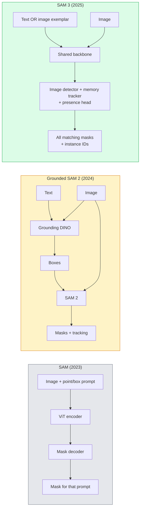

# SAM 3 ve Açık Sözlü Bölümleme

> Modellere bir metin mesajı ve bir görüntü ver ve her eşleşen nesne için maskeler alın.

**Type:** Use + Build
**Languages:** Python
**Prerequisites:** Phase 4 Lesson 07 (U-Net), Phase 4 Lesson 08 (Mask R-CNN), Phase 4 Lesson 18 (CLIP)
**Time:** ~60 minutes

## Öğrenme Hedefleri

- SAM (sadece görsel istekler), Temel SAM / SAM 2 (detektor + SAM) ve SAM 3 (asıllı metin istekleri Promptable Concept Segmentation üzerinden)
- SAM 3 mimarisini açıklayın: paylaşılan omurgan + görüntü dedektörü + hafıza tabanlı video izleyicisi + varlık başı + kopyalanmış detektör-içimleme cihazı tasarımı
- Yüzü Sarma `transformers`Metin uyarılı tespit, segmentasyon ve video izleme için SAM 3 entegrasyonu
- SAM 3, Grounded SAM 2, YOLO-World ve SAM-MI arasında gecikme, konsept karmaşıklığı ve dağıtım hedefi temelinde seçim yapın

## Sorun

2023 SAM sadece görsel bir sürpriz modeliydi: bir noktaya tıklayıp veya bir kutu çizerseniz bir maskeyi geri verir. "Bu fotoğrafta tüm portakalları bana ver" için kutuları üretmek için bir detektör (Grounding DINO) gerekirdi, sonra SAM'in her birini bölmek için.

SAM 3 (Meta, Kasım 2025, ICLR 2026) kaskadayı çöktü. Kısa isim cümlesi veya bir görüntü örneğini hemen kabul eder ve tüm eşleşen maskeleri ve örnek kimliklerini tek bir ileri geçişle geri verir.**Promptable Concept Segmentation (PCS)**Mart 2026 Obyekt Multiplex güncelleme ile (SAM 3.1), aynı kavramın birden fazla örneğini video ile verimli bir şekilde izler.

Bu ders, bu temsil eden yapısal değişim hakkında. 2D seg, algılama ve metin görüntü yerleştirme bir model olarak birleştirildi. Üretim sorusu artık "ne tür bir boru hattını zincirleştireceğim" değil, "ne tür bir istismar modeli kullanım durumumu sonundan sonuna kadar ele alacaktır".

## Anlaşım

### Üç neslin



### Anında Anlam Bölümleri

"Konsep prompt" kısa isim ifadesi (`"yellow school bus"`- Evet .`"striped red umbrella"`- Evet .`"hand holding a mug"`Modeldeki konseptle eşleşen görüntüdeki her örnek için segmentasyon maskesi, her maç için eşsiz bir örnek kimliği ile birlikte geri gönderilmektedir.

Bu, klasik görsel-sürekli SAM'den üç yönden farklıdır:

1. Bir örnek istisna istisna  tek metin istisna tüm eşleşmeleri gönderir.
2. Açık sözlük  kavram doğal dilde tarif edilebilir herhangi bir şey olabilir.
3. Tek seferde birden fazla örnek gönderir, tek istek yerine.

### Ana mimari parçalar

- **Shared backbone** tek bir ViT görüntüyi işliyor. Hem dedektör başı hem de hafıza tabanlı izleyici görüntüden okuyor.
- **Presence head** konseptin resimde mevcut olup olmadığını tahmin eder. "Bu burada mı?" ile "Nerede?" arasında ayrıştırılır.
- **Decoupled detector-tracker** Resim seviyesindeki tespit ve video seviyesindeki izleme ayrı başlara sahip, böylece müdahale etmezler.
- **Memory bank** Video izleme için çerçeveler üzerinde her örnek özelliklerini depolar (sadece SAM 2 mekanizması kullanılır).

### Ölçekte eğitim

SAM 3 ' in eğitimini aldılar .**4 million unique concepts**Yeni **SA-CO benchmark**SAM 3'ün, SA-CO'da insan performansının 75-80%'ine ulaştığını ve mevcut sistemlerin görüntü + video PCS'de iki katını arttırdığını belirtir.

### SAM 3.1 Nesne Çoklu

Mart 2026 güncellemesi: **Object Multiplex**Bu, aynı kavramın birçok örneğini bir anda birlikte takip etmek için ortak bellek mekanizmasını tanıttı. Daha önce, N örneği takip etmek N ayrı hafıza bankaları anlamına geliyordu. Multiplex, örneğe göre sorgularla bir ortak hafıza olarak çöküyor. Sonuç: doğruluğu feda etmeden çok nesneyi takip etmek önemli ölçüde daha hızlı.

### 2026'da yerleşik SAM'in hala önemli olduğu yer

- Özel bir açık sözcükleme detektörü değiştirmeniz gerektiğinde (DINO-X, Florence-2).
- SAM 3 lisansı bir engelleyici olduğunda.
- SAM 3'ün ortaya çıkardığından daha fazla kontrol gerektirdiğinde.
- Detektor bileşeninde araştırma / ablasyon çalışmaları için.

Modüler boru hattlarının hala bir yeri var. Çoğu üretim işi için SAM 3 daha basit bir yanıt.

### YOLO-World vs SAM 3

- **YOLO-World** Sadece açık sözcük depolama cihazı (mask yok). Gerçek zamanlı. Yüksek fps'lerde kutulara ihtiyaç duyduğunuzda en iyisi.
- **SAM 3** tam segmentasyon + izleme. Daha yavaş ama daha zengin çıkış.

Üretim bölümü: YOLO-World, hızlı tespit için yalnızca boru hattları (robot navigasyonu, hızlı araci tablolar), SAM 3 maske veya izleme ihtiyacı olan her şey için.

### SAM-MI verimliliği

SAM-MI (2025-2026) SAM'in dekodör boğazını ele alıyor. Ana fikirler:

- **Sparse point prompting** yoğun çağrıların yerine birkaç iyi seçilmiş noktayı kullanır; dekodör çağrılarını %96 oranında azaltır.
- **Shallow mask aggregation** kaba maske tahminlerini tek keskin maskeye birleştirir.
- **Decoupled mask injection** dekodör yeniden çalıştırılmak yerine önceden hesaplanmış maske özelliklerini alır.

Sonuç: ~ 1.6x açık sözcük referanslarında Grounded-SAM'den hızlandırma.

### Üç model için çıkış biçimi

Hepsi aynı genel yapıyı (sutular + etiketler + puanlar + maskeler + kimlikler) gönderir. Bu yararlı.

```figure
cv3-open-vocab
```

## Yapın

### Adım 1: Hızlı inşaat

Kullanıcı cümlesini SAM 3 kavram sorgularının bir listesine dönüştüren bir yardımcı oluşturun. Bu "kullanıcı yazdığı" ile "model tükettiği" arasındaki sınırdır.

```python
def split_concepts(sentence):
    """
    Heuristic splitter for multi-concept prompts.
    Returns list of short noun phrases.
    """
    for sep in [",", ";", "and", "or", "&"]:
        if sep in sentence:
            parts = [p.strip() for p in sentence.replace("and ", ",").split(",")]
            return [p for p in parts if p]
    return [sentence.strip()]

print(split_concepts("cats, dogs and balloons"))
```

SAM 3 ileri geçiş başına bir konsept kabul eder; çok konseptli sorular için, onları döngü veya seri olarak kabul eder.

### Adım 2: İşlem sonrası yardımcılar

SAM 3'ün ham çıkışlarını 4. aşama 16. ders boru hattı sözleşmemizle uyumlu tespitlerin temiz bir listesine dönüştürün.

```python
from dataclasses import dataclass
from typing import List

@dataclass
class ConceptDetection:
    concept: str
    instance_id: int
    box: tuple          # (x1, y1, x2, y2)
    score: float
    mask_rle: str       # run-length encoded


def rle_encode(binary_mask):
    flat = binary_mask.flatten().astype("uint8")
    runs = []
    prev, count = flat[0], 0
    for v in flat:
        if v == prev:
            count += 1
        else:
            runs.append((int(prev), count))
            prev, count = v, 1
    runs.append((int(prev), count))
    return ";".join(f"{v}x{c}" for v, c in runs)
```

RLE, birçok yüksek çözünürlüklü maske için bile yanıt yararlı yüklerini küçük tutar. Aynı format SAM 2, SAM 3, Grounded SAM 2'de çalışır.

### Adım 3: Tekleştirilmiş açık kelime bölünme arayüzü

Alt tarafınızdaki her bir kodun (SAM 3, Grounded SAM 2, YOLO-World + SAM 2) tek bir yöntemin arkasında sarılmasını sağlayın.

```python
from abc import ABC, abstractmethod
import numpy as np

class OpenVocabSeg(ABC):
    @abstractmethod
    def detect(self, image: np.ndarray, concept: str) -> List[ConceptDetection]:
        ...


class StubOpenVocabSeg(OpenVocabSeg):
    """
    Deterministic stub used for pipeline testing when real models are not loaded.
    """
    def detect(self, image, concept):
        h, w = image.shape[:2]
        return [
            ConceptDetection(
                concept=concept,
                instance_id=0,
                box=(w * 0.2, h * 0.3, w * 0.5, h * 0.8),
                score=0.89,
                mask_rle="0x100;1x50;0x200",
            ),
            ConceptDetection(
                concept=concept,
                instance_id=1,
                box=(w * 0.55, h * 0.25, w * 0.85, h * 0.75),
                score=0.74,
                mask_rle="0x80;1x40;0x220",
            ),
        ]
```

Gerçek .`SAM3OpenVocabSeg`Alt sınıfı kapalıdır .`transformers.Sam3Model`ve `Sam3Processor`- Evet .

### Adım 4: Yüzü Sarmak SAM 3 kullanımı (referans)

Gerçek model için, `transformers`entegrasyon:

```python
from transformers import Sam3Processor, Sam3Model
import torch

processor = Sam3Processor.from_pretrained("facebook/sam3")
model = Sam3Model.from_pretrained("facebook/sam3").eval()

inputs = processor(images=pil_image, return_tensors="pt")
inputs = processor.set_text_prompt(inputs, "yellow school bus")

with torch.no_grad():
    outputs = model(**inputs)

masks = processor.post_process_masks(
    outputs.masks, inputs.original_sizes, inputs.reshaped_input_sizes
)
boxes = outputs.boxes
scores = outputs.scores
```

Tek bir çağrı, tek bir çağrıda tüm maçlar geri döndü.

### Adım 5: Yerleşik SAM 2 ' nin size verdiği şeyi ücretsiz olarak ölçün

Dürüst bir referans: Yerleşik SAM 2'yi gerçek bir boru hattında SAM 3'e değiştirdiğinizde ne olur?

- Gecikme: SAM 3 bir ileri geçişi (ayrı bir detektör yok) kaydeder, ancak modelin kendisi daha ağırdır; genellikle net tarafsız veya hafif bir hızlandırma.
- Dürüstlük: SAM 3 nadir veya kompozisyon kavramlarında ("sırılı kırmızı şemsiye") önemli ölçüde daha iyidir.
- Esneklik: Temel SAM 2 size detektörleri (DINO-X, Florence-2, Temel DINO 1.5) değiştirmenizi sağlar; SAM 3 monolittir.

Sonuç: SAM 3 2026 açık kelime seg için varsayılan. Temel SAM 2 hala dedektör esnekliği veya farklı lisans şartları gerektiğinde doğru cevap.

## Kullan

Üretim dağıtım biçimleri:

- **Real-time annotation** SAM 3 + CVAT'ın etiket-tesk-sözleme özelliği. Anotatorlar bir etiket adını seçer; SAM 3 her eşleşen örneği önceden etiketler.
- **Video analytics** SAM 3.1 Çoklu nesne izleme için nesne çoklu; hafıza tabanlı izleyiciye ekleme çerçeveleri.
- **Robotics** Açık kelime manipülasyonu için SAM 3 ("kırmızı bardak topla"); bir planlama primitivi olarak çalışır.
- **Medical imaging** SAM 3 tıbbi kavramlara göre ince ayarlanmıştır; HF'de erişim isteği gerektirir.

Ultralytics, SAM 3'ü Python paketinde sarıyor:

```python
from ultralytics import SAM

model = SAM("sam3.pt")
results = model(image_path, prompts="yellow school bus")
```

YOLO ve SAM 2'nin arayüzü aynı.

## Gönder

Bu ders şunları ortaya çıkarır:

- `outputs/prompt-open-vocab-stack-picker.md` SAM 3 / Grounded SAM 2 / YOLO-World / SAM-MI'yi gecikme, kavram karmaşıklığı ve lisanslamalara göre seçen bir istek.
- `outputs/skill-concept-prompt-designer.md` Kullanıcı ifadelerini iyi biçimlendirilmiş SAM 3 kavramı uyarılarına dönüştüren bir beceri (paylaşma, belirsizlik, geri dönüş).

## Egzersizler

1. **(Easy)**SAM 3'ü seçtiğiniz 10 görüntüde kullanın. SAM 2 + Grounding DINO 1.5'e karşı aynı görüntülerde kullanın.
2. **(Medium)**SAM 3'ün üstünde "tıklatmak için ekle / çıkarmak için tıkla" UI oluşturun: bir metin sorusu aday örnekleri gönderir; kullanıcı tıklamaları hangilerin olumlu sayıldığını tutar. Son konsept seti JSON olarak çıkartılır.
3. **(Hard)**Her biri 20 etiketli görüntü ile özel bir konsept seti (örneğin 5 tür elektronik bileşen) üzerinde SAM 3'i ince ayarlayın. Aynı test seti üzerinde sıfır çekim SAM 3 ile karşılaştırın; maske IoU'nun iyileşmesini ölçün.

## Anahtar Terimler

| Term | What people say | What it actually means |
|------|----------------|----------------------|
| Open-vocabulary segmentation | "Segment by text" | Produce masks for objects described in natural language, not a fixed label set |
| PCS | "Promptable Concept Segmentation" | SAM 3's core task — given a noun-phrase or image exemplar, segment all matching instances |
| Concept prompt | "The text input" | Short noun phrase or image exemplar; not a full sentence |
| Presence head | "Is it here?" | SAM 3 module that decides whether the concept exists in the image before localisation |
| SA-CO | "SAM 3 benchmark" | 270K-concept open-vocabulary segmentation benchmark; 50x larger than prior open-vocab benchmarks |
| Object Multiplex | "SAM 3.1 update" | Shared-memory multi-object tracking; fast joint tracking of many instances |
| Grounded SAM 2 | "Modular pipeline" | Detector + SAM 2 cascade; still relevant when detector swap matters |
| SAM-MI | "Efficient SAM variant" | Mask Injection for 1.6x speedup over Grounded-SAM |

## Daha Fazla Okumak

- [SAM 3: Segment Anything with Concepts (arXiv 2511.16719)](https://arxiv.org/abs/2511.16719)
- [SAM 3.1 Object Multiplex (Meta AI, March 2026)](https://ai.meta.com/blog/segment-anything-model-3/)
- [SAM 3 model page on Hugging Face](https://huggingface.co/facebook/sam3)
- [Grounded SAM 2 tutorial (PyImageSearch)](https://pyimagesearch.com/2026/01/19/grounded-sam-2-from-open-set-detection-to-segmentation-and-tracking/)
- [Ultralytics SAM 3 docs](https://docs.ultralytics.com/models/sam-3/)
- [SAM3-I: Instruction-aware SAM (arXiv 2512.04585)](https://arxiv.org/abs/2512.04585)
