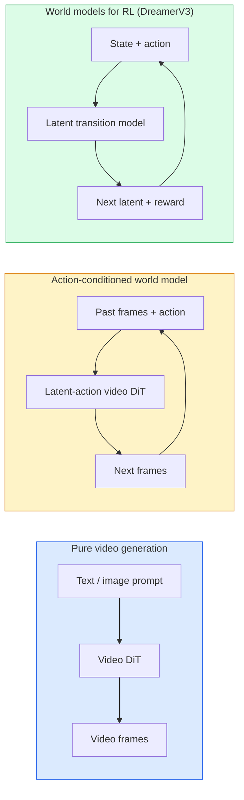

# Dünya Modeller & Video Yayınları

> Bir sahnenin sonraki saniyesini tahmin eden bir video modeli bir dünya simülatörüdür.

**Type:** Learn + Build
**Languages:** Python
**Prerequisites:** Phase 4 Lesson 10 (Diffusion), Phase 4 Lesson 12 (Video Understanding), Phase 4 Lesson 23 (DiT + Rectified Flow)
**Time:** ~75 minutes

## Öğrenme Hedefleri

- Saf bir video üretimi modeli (Sora 2) ile eylem koşullu bir dünya modeli (Genie 3, DreamerV3) arasındaki farkı açıklayın.
- Bir video DiT'yi tanımlayın: uzay-zaman yamaları, 3D konum kodlaması, T, H, W tokenleri üzerinde ortak dikkat
- Bir dünya modeli robotlara nasıl bağlanır izleyin: VLM planları → video modeli simülasyonu → ters dinamikler eylemler yayar
- Soralı bir kullanım için Sora 2, Genie 3, Runway GWM-1 Worlds, Wan-Video ve HunyuanVideo arasında seçim yapın (yaratıcı video, interaktif sim, otonom sürücü sentezi)

## Sorun

Video üretimi ve dünya modeli 2026'da birleşti. Bir dakikalık video oluşturabilen bir model, bir anlamda dünyanın nasıl hareket ettiğini öğrendi: nesnelerin kalıcılığı, yerçekimi, sebepçilik, stil. Eğer bu tahminleri eylemlere (solda yürüyüş, kapıyı aç) şartlandırırsanız, video modeli bir oyun motoru, bir sürücü simülatörü veya bir robotik ortamı değiştirebilecek bir öğrenilebilir simülatör haline gelir.

Bahisleri beton. Genie 3 tek bir görüntüden oynanabilir ortamlar oluşturur. Uçuş pistı GWM-1 Dünyaları sonsuz keşfedilebilir sahneleri sentez eder. Sora 2, senkronize edilmiş ses ve modelli fizik ile dakika uzunluğundaki videolar üretir. NVIDIA Cosmos-Drive, Wayve Gaia-2 ve Tesla DrivingWorld, otonom araç eğitim verileri için gerçekçi sürüş videoları üretmektedir. Dünya modeli paradigması robotlar için sessizce sim-real'i ele geçiriyor.

Bu ders 4. aşamada "büyük resim" dersi. Görüntü üretimi, video anlayışı ve ajanik mantıklamaları arxitektura modelinin baskın araştırmanın ilerlediği yönde birleştirir.

## Anlaşım

### Üç dünya modeli ailesi



- **Sora 2**Bu, sadece video oluşturma, uyarılara bağlı.
- **Genie 3**- Evet .**GWM-1 Worlds**- Evet .**Mirage / Magica**Bu, eylem koşullı dünya modelleri. Gözlemli videolardan gizli eylemleri yerleştirin, sonra eylemler üzerinde gelecek çerçeve tahminlerini koşullandırın.
- **DreamerV3**ve klasik RL dünya modeli ailesi açık bir eylem koşullaması ile gizli bir alanda tahmin, ödül sinyalleri üzerinde eğitilmiş. Daha az görsel; örnek verimli RL için daha kullanışlı.

### Video DiT mimarisi

```
Video latent:          (C, T, H, W)
Patchify (spatial):    grid of P_h x P_w patches per frame
Patchify (temporal):   group P_t frames into a temporal patch
Resulting tokens:      (T / P_t) * (H / P_h) * (W / P_w) tokens
```

Pozisyonel kodlama 3D'dir: (t, h, w) koordinat başına bir dönümsel veya öğrenilmiş yerleştirme.

- **Full joint** tüm tokenler tüm tokenlere katılır. O(N^2) N tokenlerle. Uzun videolar için yasak.
- **Divided** değişik zamanlı dikkat (zaman boyunca aynı uzay pozisyonu: `(H*W) * T^2`) ve uzaylı dikkat (eşit zaman aşamasında, uzay boyunca: `T * (H*W)^2`TimeSformer ve çoğu video DiT tarafından kullanılır.
- **Window** (t, h, w) yerel pencereler. Video Swin tarafından kullanılır.

2026'da her video yayılma modeli bu üç örneğin birinden daha AdaLN şartlandırması (Desin 23) ve düzeltilmiş akış kullanır.

### Eylemlerin koşullandırılması: gizli eylem modelleri

Cinsel bir şey öğrenir .**latent action**Bu nedenle, bir modelin dekodörü, açık bir klavye tuşlarında değil, sonuçlandırılmış gizli eylem üzerinde koşullar oluşturur. Sonuçta, bir kullanıcı gizli bir eylem belirleyebilir (veya yeni bir önceden bir örneğe göre) ve model, bu eylemle uyumlu bir sonraki çerçeve üretebilir.

Sora, eylem arayüzünü tamamen atlıyor. Onun dekodörü, geçmiş uzay-zaman tokenlerinden gelecek uzay-zaman tokenlerini tahmin ediyor.

### Fiziksel makulluk

Sora 2'nin 2026'daki çıkışı açıkça ilan edildi.**physical plausibility**: ağırlık, denge, nesne kalıcılığı, sebep ve etkisi. Ekip tarafından el tarafından değerlendirilmiş makullik puanları ile ölçülür; model düşmüş nesneler, çarpışan karakterler ve amaçlı başarısızlıklar (kayıp atlama) karşısında görülebilir bir şekilde iyileşir Sora 1.

Makulluk, baskın başarısızlık modudur. 2024-2025'te insanlar spagetti yiyor veya gözlüklerden içiyor videosunun modelin sürekli nesneler temsil etmemesini ortaya koydu. 2026 modelleri (Sora 2, Runway Gen-5, HunyuanVideo) bunları azaltır, ancak ortadan kaldırmaz.

### Otonom sürücü dünya modelleri

Sürüş dünya modelleri, yoldaki trajektörlere, sınırlama kutularına veya navigasyon haritalarına bağlı gerçekçi yol sahnelerini oluşturur. Kullanım:

- **Cosmos-Drive-Dreams**(NVIDIA) RL eğitimi için dakikalarca sürüş videoları oluşturur.
- **Gaia-2**(Wayve)  Politik değerlendirme için trajektör koşullu sahne sentezi.
- **DrivingWorld**(Tesla)  değişik hava, günün saati, trafik koşullarını simüle eder.
- **Vista**Reaktif sürüş sahnesi sentezi.

Köşe kafesleri için pahalı gerçek dünya verileri toplamalarını değiştirirler  geceleri yaya yürüyüşleri, buzlu kesişmeler, olağandışı araç türleri  aksi takdirde milyonlarca mil sürmeyi gerektirir.

### Robotik yığın: VLM + video modeli + ters dinamik

Yeni çıkan üç bileşenli robotik döngüsü:

1. **VLM**hedefleri analiz eder ("kırmızı bardakları topla"), yüksek düzeyde bir eylem dizisini planlar.
2. **Video generation model** N çerçeveleri önümüzdeki gözlemleri tahmin eder.
3. **Inverse dynamics model**Bu gözlemleri ortaya çıkaracak beton motor komutlarını çıkarır.

Bu, ödül şekillendirme ve örnek ağır RL'yi değiştirir. Dünya modeli hayal gücünü yapar; ters dinamikler hareketle ilgili döngüyü kapatır. Genie Envisioner bir örneklemedir; birçok araştırma grubu bu yapıya yaklaşıyor.

### Değerlendirme

- **Visual quality** FVD (Fréchet Video Distance), kullanıcı çalışmaları.
- **Prompt alignment** Çerçeve başına CLIPS puanı, VQA tarzı değerlendirme.
- **Physical plausibility** Referans değerleri bir takımında (Sora 2'nin iç referans değerleri, VBench) el değeri.
- **Controllability**(interaktif dünya modelleri için)  eylem → gözlem tutarlılığı; Önceki bir duruma dönebilir misiniz?

### 2026'da model manzara

| Model | Use | Parameters | Output | License |
|-------|-----|------------|--------|---------|
| Sora 2 | text-to-video, audio | — | 1-min 1080p + audio | API only |
| Runway Gen-5 | text/image-to-video | — | 10s clips | API |
| Runway GWM-1 Worlds | interactive world | — | infinite 3D rollout | API |
| Genie 3 | interactive world from image | 11B+ | playable frames | research preview |
| Wan-Video 2.1 | open text-to-video | 14B | high-quality clips | non-commercial |
| HunyuanVideo | open text-to-video | 13B | 10s clips | permissive |
| Cosmos / Cosmos-Drive | autonomous driving sim | 7-14B | driving scenes | NVIDIA open |
| Magica / Mirage 2 | AI-native game engine | — | modifiable worlds | product |

```figure
v4-world-rollout
```

## Yapın

### Adım 1: Video için 3D patchify

```python
import torch
import torch.nn as nn


class VideoPatch3D(nn.Module):
    def __init__(self, in_channels=4, dim=64, patch_t=2, patch_h=2, patch_w=2):
        super().__init__()
        self.proj = nn.Conv3d(
            in_channels, dim,
            kernel_size=(patch_t, patch_h, patch_w),
            stride=(patch_t, patch_h, patch_w),
        )
        self.patch_t = patch_t
        self.patch_h = patch_h
        self.patch_w = patch_w

    def forward(self, x):
        # x: (N, C, T, H, W)
        x = self.proj(x)
        n, c, t, h, w = x.shape
        tokens = x.reshape(n, c, t * h * w).transpose(1, 2)
        return tokens, (t, h, w)
```

Yüklü bir 3D konvoy, çekirdeğe eşit bir adım ile uzay-zamanlı bir patchifier olarak çalışır. `(T, H, W) -> (T/2, H/2, W/2)`- Token şebekesi.

### Adım 2: 3D dönüm pozisyon kodlaması

Rotary Position Embeddings (RoPE)  boyunca ayrı olarak uygulanır`t`- Evet .`h`- Evet .`w`Sekiller:

```python
def rope_3d(tokens, t_dim, h_dim, w_dim, grid):
    """
    tokens: (N, T*H*W, D)
    grid: (T, H, W) sizes
    t_dim + h_dim + w_dim == D
    """
    T, H, W = grid
    n, seq, d = tokens.shape
    if t_dim + h_dim + w_dim != d:
        raise ValueError(f"t_dim+h_dim+w_dim ({t_dim}+{h_dim}+{w_dim}) must equal D={d}")
    assert seq == T * H * W
    t_idx = torch.arange(T, device=tokens.device).repeat_interleave(H * W)
    h_idx = torch.arange(H, device=tokens.device).repeat_interleave(W).repeat(T)
    w_idx = torch.arange(W, device=tokens.device).repeat(T * H)
    # Simplified: just scale channels by frequencies. Real RoPE rotates pairs.
    freqs_t = torch.exp(-torch.log(torch.tensor(10000.0)) * torch.arange(t_dim // 2, device=tokens.device) / (t_dim // 2))
    freqs_h = torch.exp(-torch.log(torch.tensor(10000.0)) * torch.arange(h_dim // 2, device=tokens.device) / (h_dim // 2))
    freqs_w = torch.exp(-torch.log(torch.tensor(10000.0)) * torch.arange(w_dim // 2, device=tokens.device) / (w_dim // 2))
    emb_t = torch.cat([torch.sin(t_idx[:, None] * freqs_t), torch.cos(t_idx[:, None] * freqs_t)], dim=-1)
    emb_h = torch.cat([torch.sin(h_idx[:, None] * freqs_h), torch.cos(h_idx[:, None] * freqs_h)], dim=-1)
    emb_w = torch.cat([torch.sin(w_idx[:, None] * freqs_w), torch.cos(w_idx[:, None] * freqs_w)], dim=-1)
    return tokens + torch.cat([emb_t, emb_h, emb_w], dim=-1)
```

Basitleştirilmiş katkı biçimi. Gerçek RoPE, çiftleşmiş kanalları frekanslarda döndürür; konum bilgileri aynıdır.

### Adım 3: Dikkat blokları

```python
class DividedAttentionBlock(nn.Module):
    def __init__(self, dim=64, heads=2):
        super().__init__()
        self.time_attn = nn.MultiheadAttention(dim, heads, batch_first=True)
        self.space_attn = nn.MultiheadAttention(dim, heads, batch_first=True)
        self.ln1 = nn.LayerNorm(dim)
        self.ln2 = nn.LayerNorm(dim)
        self.ln3 = nn.LayerNorm(dim)
        self.mlp = nn.Sequential(nn.Linear(dim, 4 * dim), nn.GELU(), nn.Linear(4 * dim, dim))

    def forward(self, x, grid):
        T, H, W = grid
        n, seq, d = x.shape
        # time attention: same (h, w), across t
        xt = x.view(n, T, H * W, d).permute(0, 2, 1, 3).reshape(n * H * W, T, d)
        a, _ = self.time_attn(self.ln1(xt), self.ln1(xt), self.ln1(xt), need_weights=False)
        xt = (xt + a).reshape(n, H * W, T, d).permute(0, 2, 1, 3).reshape(n, seq, d)
        # space attention: same t, across (h, w)
        xs = xt.view(n, T, H * W, d).reshape(n * T, H * W, d)
        a, _ = self.space_attn(self.ln2(xs), self.ln2(xs), self.ln2(xs), need_weights=False)
        xs = (xs + a).reshape(n, T, H * W, d).reshape(n, seq, d)
        xs = xs + self.mlp(self.ln3(xs))
        return xs
```

Zaman dikkatinin her uzay pozisyonu boyunca zaman içinde; uzay dikkatinin pozisyonlar boyunca her çerçeve içinde hizmet göstermesi.

### Dördüncü adım: Küçük bir video yaz

```python
class TinyVideoDiT(nn.Module):
    def __init__(self, in_channels=4, dim=64, depth=2, heads=2):
        super().__init__()
        self.patch = VideoPatch3D(in_channels=in_channels, dim=dim, patch_t=2, patch_h=2, patch_w=2)
        self.blocks = nn.ModuleList([DividedAttentionBlock(dim, heads) for _ in range(depth)])
        self.out = nn.Linear(dim, in_channels * 2 * 2 * 2)

    def forward(self, x):
        tokens, grid = self.patch(x)
        for blk in self.blocks:
            tokens = blk(tokens, grid)
        return self.out(tokens), grid
```

Çalışan bir video jeneratörü değil, her parçayı doğru şekillendiren bir yapısal demo.

### Adım 5: Şekilleri kontrol edin

```python
vid = torch.randn(1, 4, 8, 16, 16)  # (N, C, T, H, W)
model = TinyVideoDiT()
out, grid = model(vid)
print(f"input  {tuple(vid.shape)}")
print(f"tokens grid {grid}")
print(f"output {tuple(out.shape)}")
```

Bekle .`grid = (4, 8, 8)`ve `out = (1, 256, 32)`Patching sonrası; başı sonra bir videoya tekrar patched olmaya hazır olarak, per-token uzay-zaman patches'e projesyonlar.

## Kullan

2026 yılı için üretim erişim modelleri:

- **Sora 2 API**(OpenAI)  metin-video, senkronize edilmiş ses.
- **Runway Gen-5 / GWM-1**(Runway)  görüntüden videoya, etkileşimli dünyalar.
- **Wan-Video 2.1 / HunyuanVideo** Açık kaynaklı kendi kendine barındırma.
- **Cosmos / Cosmos-Drive**(NVIDIA)  Sürüş simülasyonu açık ağırlıklar.
- **Genie 3** araştırma ön görünümü, erişim talep.

İnteraktif bir dünya modeli demo oluşturmak için: kalite için Wan-Video ile başlayın, etkileşim için gizli eylem adaptörüne katılın.

Robotik için, vahşi bir yığın:

1. Dil hedefi -> VLM (Qwen3-VL) -> Yüksek düzeyde plan.
2. Plan -> gizli eylem video modeli -> hayal edilmiş başlatma.
3. Çıkarma -> ters dinamik modeli -> düşük düzeyde eylemler.
4. Eylemler gerçekleştirildi -> gözlem adım 1'e geri döndü.

## Gönder

Bu ders şunları ortaya çıkarır:

- `outputs/prompt-video-model-picker.md` Sora 2 / Runway / Wan / HunyuanVideo / Cosmos arasında seçimler yapılır. Görev, lisans ve gecikme verildi.
- `outputs/skill-physical-plausibility-checks.md` otomatik kontroller ( nesne kalıcılığı, yerçekimi, süreklilik) göndermeden önce herhangi bir video üzerinde çalıştırmak için tanımlayan bir beceri.

## Egzersizler

1. **(Easy)**5 saniyelik 360p video için işaret sayısını patch-t=2, patch-h=8, patch-w=8'de hesaplayın.
2. **(Medium)**Yukarıdaki bölünmüş dikkat blokunu tam bir ortak dikkat blokuna çevirin ve şekil ve parametreler sayısını ölçün. Gerçek video modellerinde bölünmüş dikkat neden gerekli olduğunu açıklayın.
3. **(Hard)**Minimum bir gizli eylem video modeli oluşturun: (frame_t, action_t, frame_{t+1}) üçlü bir veri kümesi alın (herhangi bir basit 2 boyutlu oyun), eylem gömülmelerine bağlı küçük bir video DiT eğitiniz ve farklı eylemlerin farklı bir sonraki çerçeve ürettiğini gösterin.

## Anahtar Terimler

| Term | What people say | What it actually means |
|------|----------------|----------------------|
| World model | "Learned simulator" | A model that predicts future observations given state and action |
| Video DiT | "Spacetime transformer" | Diffusion transformer with 3D patchification and divided attention |
| Latent action | "Inferred control" | Discrete or continuous action latent inferred from frame pairs; used to condition next-frame generation |
| Divided attention | "Time then space" | Two attention operations per block — across time then across space — to keep O(N^2) manageable |
| Object permanence | "Things stay real" | Scene property that video models must learn; classic failure mode on food, glassware |
| FVD | "Fréchet Video Distance" | Video equivalent of FID; primary visual quality metric |
| Inverse dynamics model | "Observations to actions" | Given (state, next state), output the action that connects them; closes robotics loop |
| Cosmos-Drive | "NVIDIA driving sim" | Open-weights autonomous-driving world model for RL and evaluation |

## Daha Fazla Okumak

- [Sora technical report (OpenAI)](https://openai.com/index/video-generation-models-as-world-simulators/)
- [Genie: Generative Interactive Environments (Bruce et al., 2024)](https://arxiv.org/abs/2402.15391) Gizli eylem dünya modelleri
- [TimeSformer (Bertasius et al., 2021)](https://arxiv.org/abs/2102.05095) Video dönüştürücüler için ayrıntılı ilgi
- [DreamerV3 (Hafner et al., 2023)](https://arxiv.org/abs/2301.04104) RL için dünya modelleri
- [Cosmos-Drive-Dreams (NVIDIA, 2025)](https://research.nvidia.com/labs/toronto-ai/cosmos-drive-dreams/) Sürüş dünya modeli
- [Top 10 Video Generation Models 2026 (DataCamp)](https://www.datacamp.com/blog/top-video-generation-models)
- [From Video Generation to World Model — survey repo](https://github.com/ziqihuangg/Awesome-From-Video-Generation-to-World-Model/)
