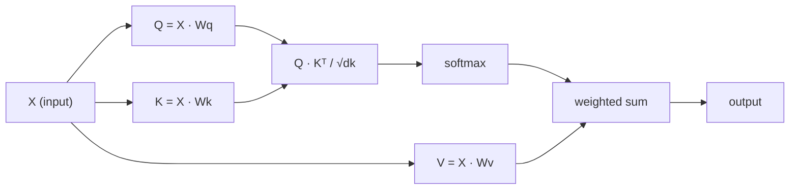

# Kendine Tam Bir Dikkat

> Dikkat, her kelimenin "kim benim için önemli?" diye sorduğu bir arama tablosudur ve cevabını öğrenir.

**Type:** Build
**Languages:** Python
**Prerequisites:** Phase 3 (Deep Learning Core), Phase 5 Lesson 10 (Sequence-to-Sequence)
**Time:** ~90 minutes

## Öğrenme Hedefleri

- Sorgu/kisel/değer projelerini ve softmax ağırlıklı toplamı dahil olmak üzere sadece NumPy kullanarak, ölçekli nokta ürün kendi dikkatini sıfırdan uygulamak
- Başları bölüp paralel dikkat hesaplayan ve sonuçları birleştiren çok başlı bir dikkat katmanı oluşturun
- Dikkat matrisi token ilişkileri nasıl yakalar ve neden sqrt(d_k) ile ölçeklendirilmesi softmax doymuşluğunu engeller açıklayın
- İki yönlü dikkatin otomatik (dekoder tarzında) dikkatine dönüştürülmesi için nedensel maskeli uygulama

## Sorun

RNN'ler bir seferde bir token'ı sıralamayı işliyor. Token 50'ye ulaştığınızda, token 1'den gelen bilgiler 50 sıkıştırma adımıyla sıkıştırılmıştır. Uzun mesafeli bağımlılıklar sabit boyutlu bir gizli duruma saplanır - LSTM kaplamalarının hiçbir miktarının tam olarak çözmediği bir şişek boynuz.

2014 Bahdanau dikkat makalesi, düzeltmeyi gösterdi: dekodörün her kodlayıcı pozisyonuna geri bakmasına ve mevcut adım için hangisinin önemli olduğuna karar vermesine izin verin. Ama yine de bir RNN'ye bağlandı. 2017 "Eğer İhtiyacınız olan şey dikkat mi?" makalesinde daha keskin bir soru sordu: dikkat * tek* mekanizmadırsa ne olacak? Tekrarlanma yok.

Kendine dikkat etmek, bir dizi konumdaki her pozisyonun diğer konumlara paralel bir adımla dikkat etmesine olanak sağlar.

## Anlaşım

### Veritaban Arama Analogisi

Dikkatin yumuşak bir veritabanı arama olduğunu düşünün:

```
Traditional database:
  Query: "capital of France"  -->  exact match  -->  "Paris"

Attention:
  Query: "capital of France"  -->  similarity to ALL keys  -->  weighted blend of ALL values
```

Her simge üç vektör oluşturur:
- **Query (Q)**"Ne arıyorum?"
- **Key (K)**"Ne içermem?"
- **Value (V)**"Seçilirse hangi bilgileri vereceğim?"

Bir sorgu ile tüm anahtarlar arasındaki nokta ürünü dikkat puanları üretir. Yüksek puan "bu anahtar sorguya uymaktadır". anlamına gelir. Bu puanlar değerleri ağırlaştırır. Çıktı değerlerin ağırlaştırılmış toplamıdır.

### Q, K, V Hesaplama

Her simge yerleştirme üç öğrenilen ağırlık matrisi ile projeleniyor:

```
Input embeddings (sequence of n tokens, each d-dimensional):

  X = [x1, x2, x3, ..., xn]       shape: (n, d)

Three weight matrices:

  Wq  shape: (d, dk)
  Wk  shape: (d, dk)
  Wv  shape: (d, dv)

Projections:

  Q = X @ Wq    shape: (n, dk)      each token's query
  K = X @ Wk    shape: (n, dk)      each token's key
  V = X @ Wv    shape: (n, dv)      each token's value
```

Görsel olarak, bir işaret için:

```
             Wq
  x_i ------[*]------> q_i    "What am I looking for?"
       |
       |     Wk
       +----[*]------> k_i    "What do I contain?"
       |
       |     Wv
       +----[*]------> v_i    "What do I offer?"
```

### Dikkat Matrisi

Tüm simgeler için Q, K, V'ye sahip olduktan sonra dikkat puanları bir matris oluşturur:

```
Scores = Q @ K^T    shape: (n, n)

              k1    k2    k3    k4    k5
        +-----+-----+-----+-----+-----+
   q1   | 2.1 | 0.3 | 0.1 | 0.8 | 0.2 |   <- how much q1 attends to each key
        +-----+-----+-----+-----+-----+
   q2   | 0.4 | 1.9 | 0.7 | 0.1 | 0.3 |
        +-----+-----+-----+-----+-----+
   q3   | 0.2 | 0.6 | 2.3 | 0.5 | 0.1 |
        +-----+-----+-----+-----+-----+
   q4   | 0.9 | 0.1 | 0.4 | 1.7 | 0.6 |
        +-----+-----+-----+-----+-----+
   q5   | 0.1 | 0.3 | 0.2 | 0.5 | 2.0 |
        +-----+-----+-----+-----+-----+

Each row: one token's attention over the entire sequence
```

Bir sorguyu bir seferde izleyin anahtarları tarayın: her satır her simgeyi puanlar, softmax puanları ağırlıklara dönüştürür ve bağlam vektörü değerlerin ağırlanmış karışımıdır.

```figure
attention-matrix
```

### Neden Ölçü?

Dots ürünleri dk boyut ile büyür. dk = 64, dots ürünleri onluk aralığında olabilir, softmax gradientlerin kaybolduğu bölgelerde itmek.

```
Scaled scores = (Q @ K^T) / sqrt(dk)
```

Bu, değerlerin softmax'ın yararlı gradientler ürettiği bir aralığında kalmasını sağlar.

### Softmax puanları ağırlıklara dönüştürüyor

Softmax, ham puanları her satır boyunca olasılık dağılımına dönüştürür:

```
Raw scores for q1:   [2.1, 0.3, 0.1, 0.8, 0.2]
                            |
                         softmax
                            |
Attention weights:   [0.52, 0.09, 0.07, 0.14, 0.08]   (sums to ~1.0)
```

Şimdi her simge, diğer simgeye ne kadar bakılması gerektiğini belirten bir dizi ağırlık vardır.

### Değerlerin Ağırlaştırılmış Toplamı

Her token için son çıkış, tüm değer vektörlerinin ağırlıklı bir toplamıdır:

```
output_i = sum( attention_weight[i][j] * v_j  for all j )

For token 1:
  output_1 = 0.52 * v1 + 0.09 * v2 + 0.07 * v3 + 0.14 * v4 + 0.08 * v5
```

### Tam boru hattı



Tek satırlı formül:

```
Attention(Q, K, V) = softmax( Q @ K^T / sqrt(dk) ) @ V
```

```figure
softmax-attention-scaling
```

## Yapın

### Adım 1: Softmax sıfırdan

Softmax çiğ logitleri olasılıklara dönüştürür.

```python
import numpy as np

def softmax(x):
    shifted = x - np.max(x, axis=-1, keepdims=True)
    exp_x = np.exp(shifted)
    return exp_x / np.sum(exp_x, axis=-1, keepdims=True)

logits = np.array([2.0, 1.0, 0.1])
print(f"logits:  {logits}")
print(f"softmax: {softmax(logits)}")
print(f"sum:     {softmax(logits).sum():.4f}")
```

### Adım 2: Skalalı nokta ürün dikkat

K, K, V matrisi alır ve dikkat çıkışı artı ağırlık matrisi gönderir.

```python
def scaled_dot_product_attention(Q, K, V):
    dk = Q.shape[-1]
    scores = Q @ K.T / np.sqrt(dk)
    weights = softmax(scores)
    output = weights @ V
    return output, weights
```

### Adım 3: Öğrenilen projeksiyonlarla kendi dikkatini gösterme sınıfı

Xavier'e benzer ölçeklendirme ile başlatılmış Wq, Wk, Wv ağırlık matrisleri ile tam bir kendi dikkat modülü.

```python
class SelfAttention:
    def __init__(self, d_model, dk, dv, seed=42):
        rng = np.random.default_rng(seed)
        scale = np.sqrt(2.0 / (d_model + dk))
        self.Wq = rng.normal(0, scale, (d_model, dk))
        self.Wk = rng.normal(0, scale, (d_model, dk))
        scale_v = np.sqrt(2.0 / (d_model + dv))
        self.Wv = rng.normal(0, scale_v, (d_model, dv))
        self.dk = dk

    def forward(self, X):
        Q = X @ self.Wq
        K = X @ self.Wk
        V = X @ self.Wv
        output, weights = scaled_dot_product_attention(Q, K, V)
        return output, weights
```

### Adım 4: Bir cümle ile çalıştır

Bir cümle için sahte yerleştirmeler yap ve dikkat ağırlıklarını izle.

```python
sentence = ["The", "cat", "sat", "on", "the", "mat"]
n_tokens = len(sentence)
d_model = 8
dk = 4
dv = 4

rng = np.random.default_rng(42)
X = rng.normal(0, 1, (n_tokens, d_model))

attn = SelfAttention(d_model, dk, dv, seed=42)
output, weights = attn.forward(X)

print("Attention weights (each row: where that token looks):\n")
print(f"{'':>6}", end="")
for token in sentence:
    print(f"{token:>6}", end="")
print()

for i, token in enumerate(sentence):
    print(f"{token:>6}", end="")
    for j in range(n_tokens):
        w = weights[i][j]
        print(f"{w:6.3f}", end="")
    print()
```

### Adım 5: ASCII ısı haritasıyla dikkatini görselleştir

Hızlı bir görüntü için dikkat ağırlıklarını karakterlere harcama.

```python
def ascii_heatmap(weights, tokens, chars=" ░▒▓█"):
    n = len(tokens)
    print(f"\n{'':>6}", end="")
    for t in tokens:
        print(f"{t:>6}", end="")
    print()

    for i in range(n):
        print(f"{tokens[i]:>6}", end="")
        for j in range(n):
            level = int(weights[i][j] * (len(chars) - 1) / weights.max())
            level = min(level, len(chars) - 1)
            print(f"{'  ' + chars[level] + '   '}", end="")
        print()

ascii_heatmap(weights, sentence)
```

## Kullan

PyTorch'in `nn.MultiheadAttention`Tam olarak biz inşa ettikleri şeyi yapar, ek olarak çok başlı bölünme ve çıkış projeksiyonu:

```python
import torch
import torch.nn as nn

d_model = 8
n_heads = 2
seq_len = 6

mha = nn.MultiheadAttention(embed_dim=d_model, num_heads=n_heads, batch_first=True)

X_torch = torch.randn(1, seq_len, d_model)

output, attn_weights = mha(X_torch, X_torch, X_torch)

print(f"Input shape:            {X_torch.shape}")
print(f"Output shape:           {output.shape}")
print(f"Attention weight shape: {attn_weights.shape}")
print(f"\nAttn weights (averaged over heads):")
print(attn_weights[0].detach().numpy().round(3))
```

Ana fark: çok başlı dikkat, her biri kendi Q, K, V projeksiyonlarıyla paralel olarak çok sayıda dikkat fonksiyonunu yürütür.

## Gönder

Bu ders şunları ortaya çıkarır:
- `outputs/prompt-attention-explainer.md`- veri tabanı arama analogi ile dikkatini açıklama için bir ipucu

## Egzersizler

1. Değiştir `scaled_dot_product_attention`Softmax'den önce belirli pozisyonları negatif sonsuzluğa ayarlayan bir seçmeli maske matrisini kabul etmek (kötü/dekoder maskeleme bu şekilde çalışır)
2. Çoklu başlı dikkatleri sıfırdan uygulayın: Q, K, V'ye bölün `n_heads`parçalar, dikkat her bir üzerinde çalıştırmak, birleştirmek ve son ağırlık matrisinin üzerinden proje Wo
3. Aynı uzunlukta iki farklı cümleyi alıp, aynı SelfAttention örneğini kullanarak onları besleyip dikkat düzenlerini karşılaştırın.

## Anahtar Terimler

| Term | What people say | What it actually means |
|------|----------------|----------------------|
| Query (Q) | "The question vector" | A learned projection of the input that represents what information this token is looking for |
| Key (K) | "The label vector" | A learned projection that represents what information this token contains, matched against queries |
| Value (V) | "The content vector" | A learned projection carrying the actual information that gets aggregated based on attention scores |
| Scaled dot-product attention | "The attention formula" | softmax(QK^T / sqrt(dk)) @ V - scaling prevents softmax saturation in high dimensions |
| Self-attention | "The token looks at itself and others" | Attention where Q, K, V all come from the same sequence, letting every position attend to every other position |
| Attention weights | "How much focus" | A probability distribution over positions, produced by softmax over scaled dot products |
| Multi-head attention | "Parallel attention" | Running multiple attention functions with different projections, then concatenating results for richer representations |

## Daha Fazla Okumak

- [Attention Is All You Need (Vaswani et al., 2017)](https://arxiv.org/abs/1706.03762)- orijinal transformatör kağıdı
- [The Illustrated Transformer (Jay Alammar)](https://jalammar.github.io/illustrated-transformer/)- Tam mimarinin en iyi görsel geçiş yolu
- [The Annotated Transformer (Harvard NLP)](https://nlp.seas.harvard.edu/annotated-transformer/)- açıklamalarla birlikte PyTorch'in satır sonucu uygulanması
