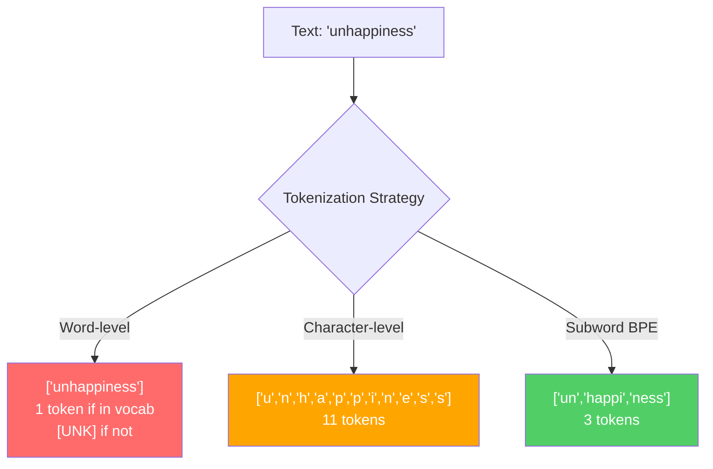
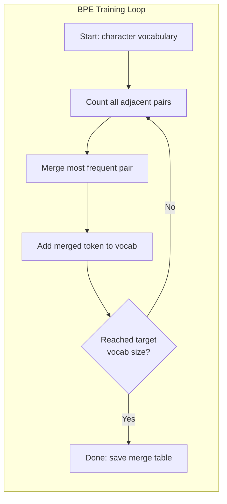
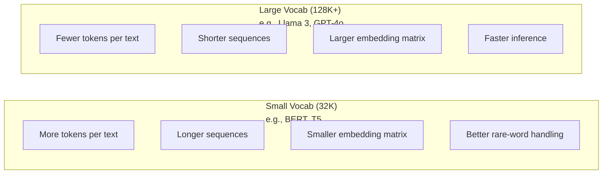

# Tokenizers: BPE, WordPiece, SentencePiece

> LLM'nin İngilizce okumayı, tam sayıları okumayı ve bu tam sayıları kullanıp kullanmayacağını belirlemesini sağlar.

**Type:** Build
**Languages:** Python
**Prerequisites:** Phase 05 (NLP Foundations)
**Time:** ~90 minutes

## Öğrenme Hedefleri

- BPE, WordPiece ve Unigram tokenizasyon algoritmaları sıfırdan uygulayın ve birleşme stratejilerini karşılaştırın
- Sözcüklük boyutunun model verimliliğini nasıl etkilediğini açıklayın: Çok küçük uzun diziler oluşturur, çok büyük atıklar parametreleri yerleştirir
- Dil ve kodlar arasında tokenizasyon eserlerini analiz ederek belirli tokenizörlerin nerede parçalanıp parçalanmasını belirler
- Metni simgelemek ve elde edilen simge kimliklerini incelemek için tiktoken ve cümle parça kütüphanelerini kullanın

## Sorun

Yüksek Lisans'ın İngilizce okumayı, herhangi bir dil okumayı, sayı okumayı.

"Merhaba dünya!" ve [15496, 11, 995, 0] arasındaki boşluk, işaretlemeci. Bir modelin işleme yapabilmesi için her kelime, her boşluk, her noktalama işaretinin bir tam sayıya dönüştürülmesi gerekir. Bu dönüşüm tarafsız değildir. Daha sonra atlatılamayan varsayımları modelde pişirir.

Yanlış anlayınca modeliniz çok sayıda token ile ortak kelimeleri kodlama kapasitesini harcıyor. "Ne yazık ki" bir yerine dört simge olur. 128K bağlam pencereniz çok silbeli kelimeler için %75'e küçültüldü. Doğru yaparsanız aynı bağlam penceresi iki kat daha fazla anlam taşıyor. "Bu model kodu iyi ele alır" ve "bu model Python'a boğulur" arasındaki fark genellikle tokenizer'in nasıl eğitildiğine bağlıdır.

GPT-4 veya Claude'a yaptığınız her API çağrısı bir token başına fiyatlandırılır. Modelinizin oluşturduğu her token hesaplama maliyetini ödüyor. Bir çıkışı temsil etmek için gereken daha az token, sonundan sonuna kadar sonuç daha hızlı olur. Tokenizasyon önceden işleme değildir. Mimarlıktır.

## Anlaşım

### Başarısız Olmuş Üç Yöntem (Ve Bir Yöntem)

Metni rakamlara dönüştürmenin üç yolu var. Bunlardan ikisi ölçekte çalışmaz.

**Word-level tokenization**"Kedi oturdu" ("The", "cat", "sat"); basit. "Tokenizasyon" ya da "GPT-4o" ne demek?`[UNK]`Token -- modelin "Bunun ne olduğunu bilmiyorum" demesinin yolu. İngilizce'de tek başına bir milyondan fazla kelime şekli var.

**Character-level tokenization**"hello" başka yöne gider. "h", "e", "l", "l", "o" olur. Sözlük küçüktür (bir kaç yüz karakter). Bilinmeyen işaretler yoktur. Ama diziler son derece uzun olur. 10 kelime seviyesindeki işaretler olacak bir cümle, 50 karakter seviyesindeki işaretler haline gelir.

**Subword tokenization**"Büyük bir şey" kelimesi, "bir şey" kelimesini içerir ve "bir şey" kelimesini içerir. "Büyük bir şey" kelimesi, "bir şey" kelimesini içerir.

Her modern LLM'de alt sözcük işaretleme kullanılır. GPT-2, GPT-4, BERT, Llama 3, Claude.



### BPE: Byte çift kodlama

BPE, tokenizasyon için yeniden tasarlanmış açgözlü bir sıkıştırma algoritmasıdır.

Tek tek karakterle başlayın. Eğitim kurpusundaki her yan çiftini sayın. En sık gelen çiftleri yeni bir simgeye birleştirin. Hedef kelime birikimi boyutuna ulaşana kadar tekrarlayın.

```figure
tokenizer-bpe
```

İşte BPE, küçük bir korpus üzerinde "en düşük", "en düşük" ve "en yeni" kelimeleri ile çalışıyor:

```
Corpus (with word frequencies):
  "lower"  x5
  "lowest" x2
  "newest" x6

Step 0 -- Start with characters:
  l o w e r       (x5)
  l o w e s t     (x2)
  n e w e s t     (x6)

Step 1 -- Count adjacent pairs:
  (e,s): 8    (s,t): 8    (l,o): 7    (o,w): 7
  (w,e): 13   (e,r): 5    (n,e): 6    ...

Step 2 -- Merge most frequent pair (w,e) -> "we":
  l o we r        (x5)
  l o we s t      (x2)
  n e we s t      (x6)

Step 3 -- Recount and merge (e,s) -> "es":
  l o we r        (x5)
  l o we s t      (x2)    <- 'es' only forms from 'e'+'s', not 'we'+'s'
  n e we s t      (x6)    <- wait, the 'e' before 'we' and 's' after 'we'

Actually tracking this precisely:
  After "we" merge, remaining pairs:
  (l,o): 7   (o,we): 7   (we,r): 5   (we,s): 8
  (s,t): 8   (n,e): 6    (e,we): 6

Step 3 -- Merge (we,s) -> "wes" or (s,t) -> "st" (tied at 8, pick first):
  Merge (we,s) -> "wes":
  l o we r        (x5)
  l o wes t       (x2)
  n e wes t       (x6)

Step 4 -- Merge (wes,t) -> "west":
  l o we r        (x5)
  l o west        (x2)
  n e west        (x6)

...continue until target vocab size reached.
```

Birleştirme tablosu, tokenizer'dir. Yeni metni kodlamak için, öğrenilen sırada birleştirmeler uygulayın. Eğitim korpusu hangi birleştirmeler olduğunu belirler ve bu seçim modelin gördüğünü kalıcı olarak şekillendirir.



### Bite seviyesindeki BPE (GPT-2, GPT-3, GPT-4)

Standart BPE, Unicode karakterleri üzerinde çalışır. Byte seviyesindeki BPE çiğ bytelerde çalışır (0-255). Bu size tam olarak 256 temel kelime birikimi verir, herhangi bir dili veya kodlamayı ele alır ve asla bilinmeyen bir token üretmez.

GPT-2 bu yaklaşımı tanıttı. Temel kelime birikimi her olası baytı kapsar. BPE bunun üzerine kurulur. OpenAI'nin tiktoken kütüphanesi bu kelime birikimi boyutları ile bayt seviyesindeki BPE'yi uyguluyor:

- GPT-2: 50.257 token
- GPT-3.5/GPT-4: ~100,256 token (cl100k_base kodlaması)
- GPT-4o: 200,019 token (o200k_base kodlaması)

### WordPiece (BERT)

WordPiece, BPE'ye benzer bir görünüm taşır, ancak seçerleri farklı bir şekilde birleştiriyor.

```
BPE merge criterion:      count(A, B)
WordPiece merge criterion: count(AB) / (count(A) * count(B))
```

BPE: "En sık hangi çift ortaya çıkar?" diye sorar. WordPiece: "Hangi çift rastlantıdan beklediğinizden daha sık birlikte ortaya çıkar?" diye sorar. Bu ince fark farklı kelime birikimi üretir. WordPiece, eşleşmenin şaşırtıcı olduğu yerlerde birleşmeyi tercih eder, sadece sık değil.

WordPiece ayrıca devam alt kelimeler için "##" önlüğünü kullanır:

```
"unhappiness" -> ["un", "##happi", "##ness"]
"embedding"   -> ["em", "##bed", "##ding"]
```

"##" önbölgesi, bu parçayı önceki bir token'a devam ettirerek gösterir. BERT, 30.522 token sözlüğü olan WordPiece'yi kullanır. BERT'in her varianti - DistilBERT, RoBERTa'nın tokenizeri aslında BPE, ancak BERT'in kendisi WordPiece.

### CezaBöğüt (Llama, T5)

SentencePiece, girişleri beyaz alan da dahil olmak üzere Unicode karakterlerinin ham akışı olarak değerlendirir. Ön-tokenizasyon adımları yoktur. Sözcük sınırları hakkında dil-süsusi kurallar yoktur. Bu onu gerçekten dil-agnostik yapar - boşluklar kelimeleri ayırmayan Çin, Japon, Tayland ve diğer dillerde çalışır.

SentencePiece iki algoritmayı destekler:
- **BPE mode**: standart BPE'ye benzer bir birleşme mantığı, çiğ karakter dizilerine uygulanır
- **Unigram mode**BPE'nin tersine, birleşme yerine kesim.

Llama 2 32 bin token ile SentencePiece BPE kullanıyor. T5 32 bin token ile SentencePiece Unigram kullanıyor. Not: Llama 3 128.256 token ile tiktoken tabanlı bir bayt seviyesindeki BPE tokenize geçmiştir.

### Sözlük Boyutu Aralıklar

Bu gerçek bir mühendislik kararı ve ölçülebilir sonuçlar.



Konkrete sayı. 4.096 boyutlu yerleştirmeler olan 128K kelimeforu için, yerleştirme matrisi 128.000 x 4.096 = 524 milyon parametre. 32K kelimeforu için, 131 milyon parametre. Bu tek başına tokenizer seçeneğinden 400M parametre farkıdır.

Ama daha büyük kelime hazineleri metni daha agresif sıkıştırır. Aynı İngilizce paragrafı, 32K kelime hazinesi ile 100 token alırsa, 128K kelime hazinesiyle 70 token alabilir. Bu, üretim sırasında %30 daha az ileri geçiş anlamına gelir. Milyonlarca talebi karşılayan bir model için, bu doğrudan hesaplama maliyetinde bir azalma demektir.

GPT-2'de 50257 kullanıldı. GPT-4'de ~100K kullanıldı. Llama 3'de 128K kullanıldı. GPT-4o'da 200K kullanıldı.

| Model | Vocab Size | Tokenizer Type | Avg Tokens per English Word |
|-------|-----------|----------------|---------------------------|
| BERT | 30,522 | WordPiece | ~1.4 |
| GPT-2 | 50,257 | Byte-level BPE | ~1.3 |
| Llama 2 | 32,000 | SentencePiece BPE | ~1.4 |
| GPT-4 | ~100,256 | Byte-level BPE | ~1.2 |
| Llama 3 | 128,256 | Byte-level BPE (tiktoken) | ~1.1 |
| GPT-4o | 200,019 | Byte-level BPE | ~1.0 |

### Çok Dilli Vergi

Başlıca olarak İngilizce eğitimli tokenizerler diğer dillere karşı zalimce. GPT-2'nin tokenizerindeki Kore metni ortalama bir kelime başına 2-3 token tutar. Çin dili daha kötü olabilir. Bu, bir Koreli kullanıcının İngiliz kullanıcısının yarısı büyüklüğündeki bir bağlam penceresine sahip olduğu anlamına gelir.

Bu nedenle Llama 3 sözlük birikimini 32K'den 128K'ye dört katına çıkarmıştır. İngilizce olmayan senaryolara adanmış daha fazla token diller arasında daha adil sıkıştırma anlamına gelir.

```figure
tokenizer-tradeoff
```

## Yapın

### Adım 1: Karakter seviyesindeki Tokenizer

Temelden başlayın. Bir karakter seviyesindeki bir simgeci her karakterin Unicode kod noktasına haritasını yapar. Eğitim gerekmez. Bilinmeyen simgeler yok. Sadece doğrudan haritası.

```python
class CharTokenizer:
    def encode(self, text):
        return [ord(c) for c in text]

    def decode(self, tokens):
        return "".join(chr(t) for t in tokens)
```

"Merhaba" [104, 101, 108, 108, 111] olur. Her karakter kendi simgesidir. Bu, geliştirdiğimiz temel çizgidir.

### Adım 2: BPE Tokenizer sıfırdan

Gerçek uygulamayı. Çöm byetleri (GPT-2 gibi) üzerinde çalışıyoruz, çiftleri sayıyoruz, en sık birleşir ve her birleşimi sırada kaydederiz.

```python
from collections import Counter

class BPETokenizer:
    def __init__(self):
        self.merges = {}
        self.vocab = {}

    def _get_pairs(self, tokens):
        pairs = Counter()
        for i in range(len(tokens) - 1):
            pairs[(tokens[i], tokens[i + 1])] += 1
        return pairs

    def _merge_pair(self, tokens, pair, new_token):
        merged = []
        i = 0
        while i < len(tokens):
            if i < len(tokens) - 1 and tokens[i] == pair[0] and tokens[i + 1] == pair[1]:
                merged.append(new_token)
                i += 2
            else:
                merged.append(tokens[i])
                i += 1
        return merged

    def train(self, text, num_merges):
        tokens = list(text.encode("utf-8"))
        self.vocab = {i: bytes([i]) for i in range(256)}

        for i in range(num_merges):
            pairs = self._get_pairs(tokens)
            if not pairs:
                break
            best_pair = max(pairs, key=pairs.get)
            new_token = 256 + i
            tokens = self._merge_pair(tokens, best_pair, new_token)
            self.merges[best_pair] = new_token
            self.vocab[new_token] = self.vocab[best_pair[0]] + self.vocab[best_pair[1]]

        return self

    def encode(self, text):
        tokens = list(text.encode("utf-8"))
        for pair, new_token in self.merges.items():
            tokens = self._merge_pair(tokens, pair, new_token)
        return tokens

    def decode(self, tokens):
        byte_sequence = b"".join(self.vocab[t] for t in tokens)
        return byte_sequence.decode("utf-8", errors="replace")
```

Eğitim döngüsü BPE'nin çekirdeğidir: çift sayın, kazananı birleştirin, tekrarlayın. Her bir birleşme toplam token sayısını azaltır.`num_merges`Dönemlerde, kelime birikimi 256 (bası bayt) den 256 + num_merge'ye kadar büyüyor.

Kodlama, öğrendikleri tam sırada birleşmeleri uyguluyor. Bu önemlidir. Eğer 1'yi birleştirerek "th" oluşturulur ve 5'yi birleştirerek "the" oluşturulursa, kodlama önce birleştirerek 1'yi uygulamalıdır, böylece "the" birleştirmede "th" + "e"den oluşabilir.

Şifreleme tersidir: kelime kitapçığındaki her token kimliğini araştır, baytları birleştir, UTF-8'e şifreleme yap.

### Adım 3: Değişiklikleri kodlama ve çözme

```python
corpus = (
    "The cat sat on the mat. The cat ate the rat. "
    "The dog sat on the log. The dog ate the frog. "
    "Natural language processing is the study of how computers "
    "understand and generate human language. "
    "Tokenization is the first step in any NLP pipeline."
)

tokenizer = BPETokenizer()
tokenizer.train(corpus, num_merges=40)

test_sentences = [
    "The cat sat on the mat.",
    "Natural language processing",
    "tokenization pipeline",
    "unhappiness",
]

for sentence in test_sentences:
    encoded = tokenizer.encode(sentence)
    decoded = tokenizer.decode(encoded)
    raw_bytes = len(sentence.encode("utf-8"))
    ratio = len(encoded) / raw_bytes
    print(f"'{sentence}'")
    print(f"  Tokens: {len(encoded)} (from {raw_bytes} bytes) -- ratio: {ratio:.2f}")
    print(f"  Roundtrip: {'PASS' if decoded == sentence else 'FAIL'}")
```

Sıkıştırma oranı, tokenizerin ne kadar etkili olduğunu gösterir. 0,50 oranı, tokenizer'in metni çiğ byte kadar yarıya sıkıştırdığı anlamına gelir. Daha düşük daha iyidir. Eğitim kurpusunda oran iyi olacak. "Mutsuzluk" gibi dağıtım dışı metinlerde (korpusda görünmeyen), oran daha kötü olacaktır - tokenizer görünmeyen desenler için karakter seviyesindeki kodlamaya geri döner.

### Adım 4: Tiktoken ile karşılaştır

```python
import tiktoken

enc = tiktoken.get_encoding("cl100k_base")

texts = [
    "The cat sat on the mat.",
    "unhappiness",
    "Hello, world!",
    "def fibonacci(n): return n if n < 2 else fibonacci(n-1) + fibonacci(n-2)",
    "Geschwindigkeitsbegrenzung",
]

for text in texts:
    our_tokens = tokenizer.encode(text)
    tiktoken_tokens = enc.encode(text)
    tiktoken_pieces = [enc.decode([t]) for t in tiktoken_tokens]
    print(f"'{text}'")
    print(f"  Our BPE:   {len(our_tokens)} tokens")
    print(f"  tiktoken:  {len(tiktoken_tokens)} tokens -> {tiktoken_pieces}")
```

tiktoken aynı algoritmayı kullanıyor ama 100 bin birleşim ile yüzlerce gigabytes metinde eğitim alıyor. Algoritm aynı. Fark eğitim verileri ve birleşim sayısıdır. 40 birleşim ile paragraf üzerinde eğitim alan tokenizeriniz tiktoken'in 100K birleşimleriyle yarışamaz. Ama mekanizma aynıdır.

### Adım 5: Sözlük Analizi

```python
def analyze_vocabulary(tokenizer, test_texts):
    total_tokens = 0
    total_chars = 0
    token_usage = Counter()

    for text in test_texts:
        encoded = tokenizer.encode(text)
        total_tokens += len(encoded)
        total_chars += len(text)
        for t in encoded:
            token_usage[t] += 1

    print(f"Vocabulary size: {len(tokenizer.vocab)}")
    print(f"Total tokens across all texts: {total_tokens}")
    print(f"Total characters: {total_chars}")
    print(f"Avg tokens per character: {total_tokens / total_chars:.2f}")

    print(f"\nMost used tokens:")
    for token_id, count in token_usage.most_common(10):
        token_bytes = tokenizer.vocab[token_id]
        display = token_bytes.decode("utf-8", errors="replace")
        print(f"  Token {token_id:4d}: '{display}' (used {count} times)")

    unused = [t for t in tokenizer.vocab if t not in token_usage]
    print(f"\nUnused tokens: {len(unused)} out of {len(tokenizer.vocab)}")
```

Bu, sözlükte Zipf dağılımını ortaya çıkarır. Birkaç token (öreler, "the", "e") baskındır. Çoğu token nadiren kullanılır. Üretim tokenizörleri bu dağılım için optimize edilir - ortak desenler kısa token kimliklerini alır, nadir desenler daha uzun temsiller alır.

## Kullan

Çizik BPE'nin işe yarıyor.

### tiktoken (OpenAI)

```python
import tiktoken

enc = tiktoken.get_encoding("cl100k_base")

text = "Tokenizers convert text to integers"
tokens = enc.encode(text)
print(f"Tokens: {tokens}")
print(f"Pieces: {[enc.decode([t]) for t in tokens]}")
print(f"Roundtrip: {enc.decode(tokens)}")
```

tiktoken, Python bağlamaları ile Rust'de yazılmıştır. Sekunde milyonlarca tokeni kodlar. Aynı BPE algoritması, endüstriyel güç uygulaması.

### Kucaklayan Yüz Tokenizeri

```python
from tokenizers import Tokenizer
from tokenizers.models import BPE
from tokenizers.trainers import BpeTrainer
from tokenizers.pre_tokenizers import ByteLevel

tokenizer = Tokenizer(BPE())
tokenizer.pre_tokenizer = ByteLevel()

trainer = BpeTrainer(vocab_size=1000, special_tokens=["<pad>", "<eos>", "<unk>"])
tokenizer.train(["corpus.txt"], trainer)

output = tokenizer.encode("The cat sat on the mat.")
print(f"Tokens: {output.tokens}")
print(f"IDs: {output.ids}")
```

Hugging Face tokenizers kütüphanesi de Rust'ın altındaki. Gigabyte ölçekli korpuslarda saniyeler içinde BPE'yi eğitir.

### Llama'nın Tokenizer'ini yükleniyor

```python
from transformers import AutoTokenizer

tokenizer = AutoTokenizer.from_pretrained("meta-llama/Llama-3.1-8B")

text = "Tokenizers are the unsung heroes of LLMs"
tokens = tokenizer.encode(text)
print(f"Token IDs: {tokens}")
print(f"Tokens: {tokenizer.convert_ids_to_tokens(tokens)}")
print(f"Vocab size: {tokenizer.vocab_size}")

multilingual = ["Hello world", "Hola mundo", "Bonjour le monde"]
for text in multilingual:
    ids = tokenizer.encode(text)
    print(f"'{text}' -> {len(ids)} tokens")
```

Llama 3'ün 128K kelime birikimi İngilizce olmayan metni GPT-2'nin 50K kelime birikimine göre daha iyi sıkıştırır. Bunu kendiniz doğrulayabilirsiniz. Aynı cümleyi birden fazla dilde kodlayıp simgeler sayın.

## Gönder

Bu ders bize çok yararlı .`outputs/prompt-tokenizer-analyzer.md`-- bir tekrar kullanılabilir işaretleme etkinliğini analiz eden bir tekrar kullanılabilir işaretleme istasyonu. herhangi bir metin ve model kombinasyonu için.

## Egzersizler

1. BPE işaretleyicisini her birleşme adımında kelime birikimini basmak için değiştirin. "t" + "h" nasıl "th" hale geldiğini, "th" + "e" nasıl "the" hale geldiğini izleyin.

2. Özel simgeler ekle (`<pad>`- Evet .`<eos>`- Evet .`<unk>`BPE'yi kullanmadan önce beyaz alanlarda bölünen bir pre-tokenizasyon aşamasını uygulayın.

3. WordPiece birleşim kriterini uygulayın (sürekli yerine olasılık oranı). Aynı sayıda birleşme ile aynı korpusta BPE ve WordPiece'yi eğit. Sonuçta oluşan sözlükleri karşılaştırın - hangisi daha dil anlamlı alt kelimeler üretir?

4. Çok dilli bir tokenizer verimlilik referansını oluşturun. İngilizce, İspanyolca, Çinli, Koreli ve Arapça 10 cümle alın. Her birini tiktoken (cl100k_base) ile işaretleyin ve karakter başına ortalama tokenleri ölçün. Her dil için "çok dilli vergi" nçeçeçeçeçe.

5. BPE tokenizerinizi daha büyük bir korpus üzerinde çalıştırın (Wikipedia makalesini indir). Aynı metinde tiktoken oranının %10'unda bir sıkıştırma oranı elde etmek için birleşim sayısını ayarlayın. Bu, korpus boyutu, birleşim sayısı ve sıkıştırma kalitesi arasındaki ilişkiyi anlamanızı zorlar.

## Anahtar Terimler

| Term | What people say | What it actually means |
|------|----------------|----------------------|
| Token | "A word" | A unit in the model's vocabulary -- could be a character, subword, word, or multi-word chunk |
| BPE | "Some compression thing" | Byte Pair Encoding -- iteratively merge the most frequent adjacent pair of tokens until the target vocabulary size is reached |
| WordPiece | "BERT's tokenizer" | Like BPE but merges maximize the likelihood ratio count(AB)/(count(A)*count(B)) instead of raw frequency |
| SentencePiece | "A tokenizer library" | A language-agnostic tokenizer that operates on raw Unicode without pre-tokenization, supporting BPE and Unigram algorithms |
| Vocabulary size | "How many words it knows" | The total number of unique tokens: GPT-2 has 50,257, BERT has 30,522, Llama 3 has 128,256 |
| Fertility | "Not a tokenizer term" | Average number of tokens per word -- measures tokenizer efficiency across languages (1.0 is perfect, 3.0 means the model works three times harder) |
| Byte-level BPE | "GPT's tokenizer" | BPE operating on raw bytes (0-255) instead of Unicode characters, guaranteeing no unknown tokens for any input |
| Merge table | "The tokenizer file" | Ordered list of pair merges learned during training -- this IS the tokenizer, and order matters |
| Pre-tokenization | "Splitting on spaces" | Rules applied before subword tokenization: whitespace splitting, digit separation, punctuation handling |
| Compression ratio | "How efficient the tokenizer is" | Tokens produced divided by input bytes -- lower means better compression and faster inference |

## Daha Fazla Okumak

- [Sennrich et al., 2016 -- "Neural Machine Translation of Rare Words with Subword Units"](https://arxiv.org/abs/1508.07909)-- BPE'yi NLP için tanıtan makale, 1994'te basınç algoritmasını modern tokenizeleme temeline dönüştürdü.
- [Kudo & Richardson, 2018 -- "SentencePiece: A simple and language independent subword tokenizer"](https://arxiv.org/abs/1808.06226)-- çok dilli modeller pratik hale getiren dil-agnostik bir işaretleme
- [OpenAI tiktoken repository](https://github.com/openai/tiktoken)-- GPT-3.5/4/4o tarafından kullanılan Python bağlamaları ile Rust'te üretim BPE uygulaması
- [Hugging Face Tokenizers documentation](https://huggingface.co/docs/tokenizers)-- Rust performanslı üretim derecesi tokenizer eğitimi
