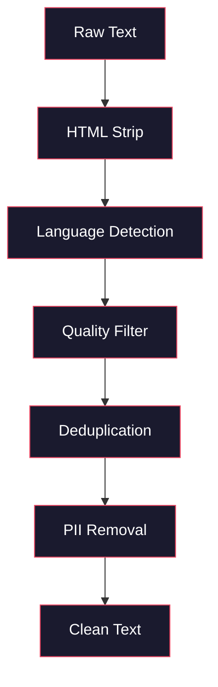
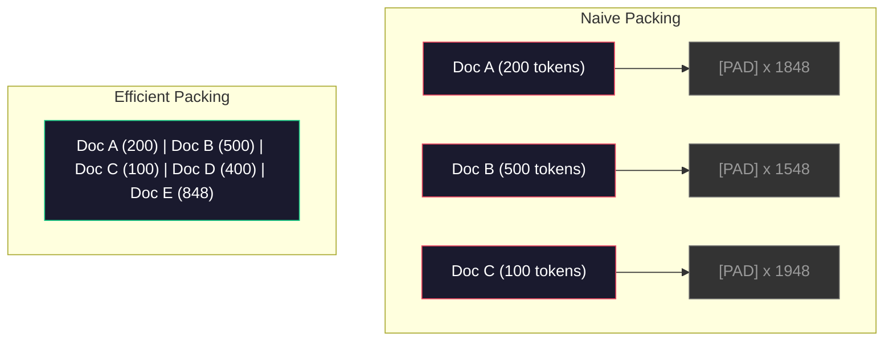

# Ön Eğitim için Veri Kökleri

> Model bir ayna. Ona verdiğiniz verileri yansıtır. Çöpü besler, çöpü mükemmel akıcılıkla yansıtır.

**Type:** Build
**Languages:** Python
**Prerequisites:** Phase 10, Lessons 01-02 (Tokenizers, Building a Tokenizer)
**Time:** ~90 minutes

## Öğrenme Hedefleri

- Tümünü belleğe yüklemeden, tıklama, parça, karıştırma ve seri metin terabaytlarını simgeleyen akışlı veri borusunu oluşturun
- Gerçek eğitim öncesi borularda kullanılan veri kalitesi filtrelerini (dedulikasyon, dil tespit, içerik filtresi) uygula
- Uygun dikkat maskeleri ve belge sınırları ile düzenli olarak uzunluklı eğitim dizilerini oluşturmak
- Profil boru hattı geçiş, veriler yükleyiciye GPU eğitim hızı ile uyum sağlamak için

## Sorun

Bir işaretçiniz var, şimdi verilere ihtiyacınız var.

Veriler kümesi değil, CSV dosyası değil. Terabyte metin temizlenmiş, kopyalanmış, kaliteli olarak filtrelenmiş, sabit uzunluklı dizilerde tokenize edilmiş ve 8 GPU'dan oluşan kümeniz bir sonraki seriyi beklemeyecek kadar hızlı rastgele seri olarak servis edilmiş.

Bir LLM eğitimi hakkında çoğu insan düşünür. Bu model mimarisi hakkında. Llama 3 15.6 trilyon jeton kullanmıştır. GPT-3 300 trilyon kullanmıştır. DeepSeek-V2 8.1 trilyon kullanmıştır. Üçün de mimarisi yaklaşık olarak aynıdır: dikkat ve geri dönüş katmanları olan yığılmış transformatör blokları.

DeepMind'in Chinchilla makalesi bunu tam olarak ortaya koydu. Verilmiş bir hesaplama bütçesi için, model parametrelerinin eğitim jetonlarına en uygun oranı vardır. Chinchilla 2022'deki çoğu modelin çok az eğitimli olduğunu gösterdi. Gördükleri veri miktarı için çok fazla parametre vardı. 1.4 trilyon token üzerinde eğitilen 70B parametre modeli (Chinchilla-optimal) 300 milyar token üzerinde eğitilen 280B modeli (Gopher) üzerinde performans gösterdi.

Verileriniz, modelinizin dil öğrenmesini veya gürültü öğrenmesini belirler.

## Anlaşım

### Verilerin Kaynağı

Her büyük dil modeli bir karışım kaynaklara dayanarak eğitilmiştir. Tam bileşim çoğu laboratuvar için sıkı korunan bir sırdır, ama kategorileri anlayacak kadar biliyoruz.

| Source | Size | Quality | Used By |
|--------|------|---------|---------|
| Common Crawl | ~250 TB raw | Low (needs heavy filtering) | GPT-3, Llama, most open models |
| Wikipedia | ~20 GB | High | Every major LLM |
| GitHub code | ~1 TB+ | Medium (lots of duplicates, dead code) | StarCoder, CodeLlama, DeepSeek-Coder |
| Books (BookCorpus, Pile) | ~100 GB | High | GPT-2, GPT-3, early models |
| Academic papers (arXiv, S2ORC) | ~100 GB | High for STEM | Llama, Galactica |
| StackOverflow, Reddit | ~100 GB | Medium | Llama, Falcon |
| Curated web (C4, RefinedWeb) | ~5 TB | Medium-High (pre-filtered) | T5, Falcon |

Llama 3 veriler karışımını açıkladı: yaklaşık %50 web verileri, %25 kod, %13 kitap ve akademik makaleler, %8 matematik verileri ve %4 çok dilli web verileri.

Bu oranın da önemli olduğu kadar toplam boyut da önemlidir. Çok fazla web verisi ve model Reddit papağanı olur. Çok az kod ve programlanamaz. Çok az matematik ve mantık yürütmede başarısız olur. Bu karışımı doğru hale getirmek LLM eğitimin en zor kısımlarından biridir ve bir formül yoktur.

### Veriler Temizle

Çöp web verileri pisliktir.

- HTML etiketleri ve JavaScript
- Kaynak plağı başlıkları, ayakkabıları, gezinti menüleri
- Çift sayfalar (tam ve neredeyse çift sayfalar)
- Makine tarafından oluşturulan spam
- Kişisel olarak tanımlanabilir bilgiler (PII)
- Düşük kaliteli metin (kilit kelimeler listesi, SEO spam)
- Metin olarak kodlanan metin dışı içerik

Bu temizlik seçeneği değildir. Koherent paragraflar üreten ve ürün listeleri ile karıştırılmış HTML etiketleri çıkaran bir model arasındaki fark.



Her adım bir gürültü kategorisini ortadan kaldırır:

**HTML stripping:**Tüm işaretlemeyi kaldırın. Sadece görünen metin içeriğini saklayın.`trafilatura`veya `readability`Navigasyon, reklamlar ve kaynaktan çıkartarak makale içeriğini çıkarın.

**Language detection:**Her belgeyi sınıflandırmak için fastText'in dil tanımlama modeli (lid.176.bin) kullanın. Hedef dillerinize filtreleyin. 0.8'den az güvenle İngilizce olarak sınıflandırılmış bir belge muhtemelen temiz İngilizce değildir.

**Quality filtering:**Bu ilginç bir noktaya dönüşüyor. RefinedWeb (Falcon'un arkasındaki veri kümesi) karmaşıklığa dayalı bir filtre kullanıyor: Wikipedia'da küçük bir dil modeli eğitmek, sonra her belgeyi notlamak. Yüksek karmaşıklık belgeyi Wikipedia'ya benzemiyor demektir - muhtemelen spam, anahtar kelime listeleri veya makine tarafından oluşturulan içerik.

**Deduplication:**En etkili temizleme adımları. Common Crawl çok sayıda kopya sayfası içerir. yasal hak çıkarma bildirimleri, çerez bildirimleri, hizmet şartları.

**PII removal:**Adlar, e-posta adresleri, telefon numaraları, sosyal güvenlik numaraları, yapılandırılmış PII için Regex tabanlı tespit, bağlamda isimler için NER modelleri.

### MinHash ile deduplasyon

Tam deduplasyon kolay: her belgeyi hash edin, kopyaları kaldırın. Ama neredeyse kopyalar gerçek sorun. Çevresi biraz farklı reklamlarla aynı haber makalesinin iki kopyası neredeyse kopyalardır. İçeriği% 95 aynı, ancak bayt-bayt farklıdır.

MinHash + Yerleşim Duyarlı Hashing (LSH) bunu verimli bir şekilde çözüyor.


Fikir:

1. **Shingling:**Her belgeyi n-gram bir diziye dönüştürün (örneğin, 5 gram kelimeler veya karakterler).

2. **MinHash:**Her belgenin şingle seti için k hash değerlerini hesaplayın. Her şingle değeri farklı bir şingle işlevi altında tüm şingleler üzerinde minimum şingle değeri. Bu, herhangi iki belge arasında Jaccard benzerliğini yakınlaştıran sabit boyutlu bir " imza " oluşturur.

3. **LSH:**MinHash imzasının bantlarına dayanarak belgeleri kovalara ayırın. Aynı kovadaki belgeleri aday neredeyse kopyalı. Bu her çiftin karşılaştırılmasını önler. Sadece adayları karşılaştırırsınız.

4. **Verify:**Her aday çift için, tam Jaccard benzerliği hesaplayın.

Llama ekibi, web verilerinin yaklaşık% 38'ini deduplasyon yoluyla kaldırdığını bildirdi. Bu küçük bir sayı değil. Common Crawl'un üçte birinden fazlası çift veya neredeyse çift içerikli.

### Sıradan Paketleme

Modeliniz sabit uzunluklı giriş dizilerini bekliyor. Belgeleriniz değişken uzunlukta. Bazıları 50 token. Bazıları 50.000 token.

Naif yaklaşım: her belgeyi maksimum sekans uzunluğuna kadar doldur. Bu, öğrenmeye hiçbir katkıda bulunmayan tokenleri doldurmak için muazzam bir hesaplama harcamaktadır.

Daha iyi yaklaşım: birden fazla belgeyi tek bir dizide birleştirin, dizinin sonu belirtiler ile ayrılır. 2048 belirtiler dizisi, bunlar arasında [EOS] belirtilerle bağlanmış üç kısa belge içerebilir.



Dikkat maskası doğru şekilde ayarlanmalıdır. A belgesinden gelen tokenler aynı paketlenmiş sırada B belgesinden gelen tokenlere katılmamalıdır. Bu, blok diyagonal bir dikkat maskası gerektirir.

Uzun belgeleri sırayla sınırlarda kısaltılır veya parçalara ayrılır. Bölüm noktası önemlidir: cümle ortasında bölünmek, modelin eksik düşünceleri görmesini zorlar.

### Chinchilla Ölçekleme Yasası

Sıkı bir hesaplama bütçesi C için (FLOP'lerde ölçülür) en uygun model boyutu N ve veri kümesi boyutu D aşağıdakiler:

```
N_opt ~ C^0.5
D_opt ~ C^0.5
```

Bu, pratikte model boyutunu ve veri kümesi boyutunu yaklaşık olarak eşit olarak ölçeklendirmeniz gerektiği anlamına gelir. 10 kat daha fazla parametre olan bir model aynı kayba ulaşmak için yaklaşık 10 kat daha fazla eğitim jetonu gerektirir.

| Model | Parameters | Training Tokens | Chinchilla-Optimal? |
|-------|-----------|----------------|-------------------|
| GPT-3 | 175B | 300B | No (undertrained 3-4x) |
| Chinchilla | 70B | 1.4T | Yes (by design) |
| Llama 2 | 70B | 2T | Overtrained (intentionally) |
| Llama 3 | 70B | 15T | Heavily overtrained |

Llama 3 bilerek Chinchilla yasasını ihlal eder. Meta, daha fazla veri üzerinde aşırı eğitim - hesaplama-optimal oranın çok ötesinde - sonucu çıkarmak için daha iyi modeller ürettiğini buldu. Ekstra eğitim maliyeti bir kez ödenir, ancak daha küçük model sonsuza kadar hizmet etmek için daha ucuz. Bu bazen " sonucu-optimal" ölçekleme yaklaşımı olarak adlandırılır ve 2024'ten beri endüstri standardı haline gelmiştir.

```figure
l5-data-pipeline
```

## Yapın

### Adım 1: Metni Temizle

HTML'i çiz, beyaz alanı normalleştir, metin dışı içeriği kaldır. Küçük bir korpusumuz olarak kamu alanı metni (Project Gutenberg) kullanacağız.

```python
import re

def clean_text(text):
    text = re.sub(r"<[^>]+>", "", text)
    text = re.sub(r"http\S+", "", text)
    text = re.sub(r"[^\x20-\x7E\n]", "", text)
    text = re.sub(r"\n{3,}", "\n\n", text)
    text = re.sub(r" {2,}", " ", text)
    return text.strip()

def quality_filter(text, min_words=50, max_ratio_caps=0.3, max_ratio_special=0.1):
    words = text.split()
    if len(words) < min_words:
        return False
    caps_ratio = sum(1 for w in words if w.isupper()) / len(words)
    if caps_ratio > max_ratio_caps:
        return False
    special_chars = sum(1 for c in text if not c.isalnum() and not c.isspace())
    if special_chars / max(len(text), 1) > max_ratio_special:
        return False
    return True
```

Kalite filtresi SEO spam (ALL CAPS), makine tarafından üretilen gürültü (yüksek özel karakter oranı) ve parça sayfaları (çok kısa) yakalar. Bu üç kontrol tek başına web taramalarından şaşırtıcı miktarda çöp çıkarır.

### Adım 2: MinHash Deduplasyonu

MinHash'i sıfırdan uygulamak.`hashlib`- Evet .

```python
import hashlib
from collections import defaultdict

def get_shingles(text, k=5):
    words = text.lower().split()
    if len(words) < k:
        return set()
    return {" ".join(words[i:i+k]) for i in range(len(words) - k + 1)}

def minhash_signature(shingles, num_hashes=128):
    signature = []
    for i in range(num_hashes):
        min_hash = float("inf")
        for shingle in shingles:
            h = int(hashlib.sha256(f"{i}:{shingle}".encode()).hexdigest(), 16)
            min_hash = min(min_hash, h)
        signature.append(min_hash)
    return signature

def lsh_buckets(signature, bands=16):
    rows_per_band = len(signature) // bands
    buckets = []
    for b in range(bands):
        start = b * rows_per_band
        band_data = tuple(signature[start:start + rows_per_band])
        bucket_hash = hashlib.md5(str(band_data).encode()).hexdigest()
        buckets.append((b, bucket_hash))
    return buckets

def deduplicate(documents, threshold=0.8, num_hashes=128, bands=16):
    signatures = []
    shingle_sets = []
    for doc in documents:
        shingles = get_shingles(doc)
        shingle_sets.append(shingles)
        signatures.append(minhash_signature(shingles, num_hashes))

    bucket_map = defaultdict(list)
    for doc_idx, sig in enumerate(signatures):
        for band_id, bucket_hash in lsh_buckets(sig, bands):
            bucket_map[(band_id, bucket_hash)].append(doc_idx)

    duplicate_pairs = set()
    for bucket_docs in bucket_map.values():
        if len(bucket_docs) < 2:
            continue
        for i in range(len(bucket_docs)):
            for j in range(i + 1, len(bucket_docs)):
                duplicate_pairs.add((bucket_docs[i], bucket_docs[j]))

    removed = set()
    for i, j in duplicate_pairs:
        if i in removed or j in removed:
            continue
        s1, s2 = shingle_sets[i], shingle_sets[j]
        if not s1 or not s2:
            continue
        jaccard = len(s1 & s2) / len(s1 | s2)
        if jaccard >= threshold:
            removed.add(j)

    return [doc for idx, doc in enumerate(documents) if idx not in removed], len(removed)
```

- Evet .`num_hashes=128`ve `bands=16`Daha fazla hash daha doğru benzerlik tahminleri verir. Daha fazla bant daha fazla yanlış pozitif maliyetinde hatırlama artırır. Bu değerler tipik web metni için iyi çalışır.

### Adım 3: Sekansları Tokenize ve Paket

Temiz, kopyalı metni alın, işaretleyin ve eğitim için sabit uzunluklı dizilerde paketleyin.

```python
def tokenize_corpus(documents, tokenizer):
    all_tokens = []
    for doc in documents:
        tokens = tokenizer.encode(doc)
        all_tokens.extend(tokens)
        all_tokens.append(tokenizer.eos_id)
    return all_tokens

def pack_sequences(token_ids, seq_length, pad_id=0):
    sequences = []
    attention_masks = []
    for i in range(0, len(token_ids), seq_length):
        seq = token_ids[i:i + seq_length]
        mask = [1] * len(seq)
        if len(seq) < seq_length:
            pad_count = seq_length - len(seq)
            seq = seq + [pad_id] * pad_count
            mask = mask + [0] * pad_count
        sequences.append(seq)
        attention_masks.append(mask)
    return sequences, attention_masks
```

### Adım 4: Eğitim için DataLoader

Eğitim döngüsü bu kadar tüketir.

```python
import random

class PreTrainingDataLoader:
    def __init__(self, sequences, attention_masks, batch_size, shuffle=True):
        self.sequences = sequences
        self.attention_masks = attention_masks
        self.batch_size = batch_size
        self.shuffle = shuffle

    def __len__(self):
        return (len(self.sequences) + self.batch_size - 1) // self.batch_size

    def __iter__(self):
        indices = list(range(len(self.sequences)))
        if self.shuffle:
            random.shuffle(indices)
        for start in range(0, len(indices), self.batch_size):
            batch_idx = indices[start:start + self.batch_size]
            batch_seqs = [self.sequences[i] for i in batch_idx]
            batch_masks = [self.attention_masks[i] for i in batch_idx]
            yield batch_seqs, batch_masks
```

### Adım 5: Veritahtıstatistikler

Önemli olan sayıları hesaplayın: toplam tokenler, benzersiz tokenler, sıkıştırma oranı, belge uzunluğu dağılım.

```python
from collections import Counter

def compute_statistics(documents, token_ids, sequences, tokenizer_vocab_size):
    total_chars = sum(len(d) for d in documents)
    total_tokens = len(token_ids)
    unique_tokens = len(set(token_ids))
    compression_ratio = total_chars / total_tokens

    doc_lengths = [len(d.split()) for d in documents]
    avg_doc_length = sum(doc_lengths) / max(len(doc_lengths), 1)
    max_doc_length = max(doc_lengths) if doc_lengths else 0
    min_doc_length = min(doc_lengths) if doc_lengths else 0

    token_counts = Counter(token_ids)
    top_tokens = token_counts.most_common(10)

    non_pad_tokens = sum(sum(1 for t in seq if t != 0) for seq in sequences)
    total_positions = sum(len(seq) for seq in sequences)
    utilization = non_pad_tokens / max(total_positions, 1)

    stats = {
        "total_documents": len(documents),
        "total_characters": total_chars,
        "total_tokens": total_tokens,
        "unique_tokens": unique_tokens,
        "vocab_utilization": unique_tokens / tokenizer_vocab_size,
        "compression_ratio": compression_ratio,
        "avg_doc_length_words": avg_doc_length,
        "max_doc_length_words": max_doc_length,
        "min_doc_length_words": min_doc_length,
        "num_sequences": len(sequences),
        "sequence_utilization": utilization,
        "top_10_tokens": top_tokens,
    }
    return stats
```

Sıkıştırma oranı, bu korpus üzerinde tokenizerin ne kadar verimli olduğunu gösterir. İngilizce metin tipik olarak her token başına yaklaşık 3-4 karakterle sıkıştırılır.

Sequence utilization size paketlenen sıraların ne kadarı gerçek veri ile doldurma karşılaştırıldığında gösterir. %90'ın altında paketlemeniz verimsiz demektir -- paketleme tokenlerinde hesaplama harcadınız.

## Kullan

### HuggingFace verileri ile karşılaştır

Aynı corpus'u HuggingFace'ın veri kümesi kütüphanesi üzerinden yükle ve boru hattı hızını karşılaştır.

```python
from datasets import load_dataset
from transformers import AutoTokenizer

ds = load_dataset("wikitext", "wikitext-2-raw-v1", split="train")
tokenizer = AutoTokenizer.from_pretrained("meta-llama/Meta-Llama-3-8B")

import time

start = time.time()
tokenized = ds.map(
    lambda x: tokenizer(x["text"], truncation=True, max_length=2048),
    batched=True,
    num_proc=4,
)
hf_time = time.time() - start
total_tokens = sum(len(t) for t in tokenized["input_ids"])
print(f"HuggingFace: {total_tokens:,} tokens in {hf_time:.2f}s ({total_tokens/hf_time:,.0f} tokens/sec)")
```

HuggingFace boru hattı, kapının altında Rust tokenizörlerini kullanır ve 4 çekirdek boyunca paralel işleme yapar. Temiz Python boru hattınız 10-50 kat daha yavaş olacaktır. Bu boşluk, üretim ekiplerinin toplanmış tokenizörleri kullanmasının nedeni. Algoritm aynıdır. Uygulama dili farkıdır.

## Gönder

Bu ders, LLM eğitim boru hattlarında veri kalitesini doğrulamak ve düzeltmek için bir ipucu oluşturur.`outputs/prompt-data-quality-checker.md`- Evet .

## Egzersizler

1. **Easy:**Temizleme borusuna basit bir heuristik (harakter set analizi) kullanarak dil tespitini ekleyin. Sadece İngilizce belgeleri filtreleyin ve kaç belge kaldırıldığını ölçün.
2. **Medium:**SHA-256 hashleri ile birlikte MinHash yakın deduplasyonu ile doğru deduplasyon uygulayın.
3. **Hard:**Kafasını karışıklık tabanlı bir kalite filtre oluşturun. Wikipedia metni üzerinde küçük bir büyük metin dil modeli eğitiniz, her belgeyi karışıklık ile not edin ve alt 20%'i çıkarın. Filtreli ve filtre edilmemiş veriler üzerinde eğitim yaparken model çıkış kalitesini karşılaştırın.

## Anahtar Terimler

| Term | What people say | What it actually means |
|------|----------------|----------------------|
| Common Crawl | "The internet" | A non-profit that crawls the web monthly -- ~250TB raw, the starting point for most LLM training data |
| MinHash | "Some hashing trick" | A technique to estimate Jaccard similarity between sets using fixed-size signatures -- enables near-duplicate detection at scale |
| LSH | "Locality-Sensitive Hashing" | A method to group similar items into the same bucket -- reduces pairwise comparisons from O(n^2) to near-linear |
| Sequence packing | "Concatenating documents" | Fitting multiple documents into fixed-length sequences with proper attention masks -- eliminates padding waste |
| Chinchilla scaling | "Train on more data" | For a fixed compute budget, optimal performance requires scaling model size and training tokens roughly equally |
| Fertility | "Tokens per word" | Average number of tokens per word -- 1.3 for English in GPT-4, higher for non-Latin scripts |
| Data mixing | "Choosing training data" | The ratio of code vs text vs math vs multilingual data -- no formula, requires experimentation |
| Perplexity filter | "Quality scoring" | Use a small language model to score documents -- high perplexity means the text is unlike clean reference data |
| Deduplication | "Removing copies" | Eliminating exact and near-duplicate documents -- typically removes 30-40% of raw web data |
| Attention mask | "Which tokens to look at" | A binary mask that prevents attention across document boundaries in packed sequences |

## Daha Fazla Okumak

- [Hoffmann et al., 2022 -- Training Compute-Optimal Large Language Models (Chinchilla)](https://arxiv.org/abs/2203.15556)- verilerin ölçeklenmesi hakkında düşüncelerimizi değiştiren makale
- [Penedo et al., 2023 -- The RefinedWeb Dataset for Falcon LLM](https://arxiv.org/abs/2306.01116)-- Common Crawl'ı yüksek kaliteli filtrelemek için nasıl
- [Touvron et al., 2023 -- Llama 2: Open Foundation and Fine-Tuned Chat Models](https://arxiv.org/abs/2307.09288)-- Llama 2 için veri boru hattı detayları
- [Lee et al., 2022 -- Deduplicating Training Data Makes Language Models Better](https://arxiv.org/abs/2107.06499)- ...deplomasyon neden düşündüğünüzden daha önemli?
- [Broder, 1997 -- On the Resemblance and Containment of Documents](https://ieeexplore.ieee.org/document/666900)- Orijinal MinHash kağıdı
- [Meta, 2024 -- Llama 3 Technical Report](https://arxiv.org/abs/2407.21783)-- 15.6T tokens, veri karışımı oranları, filtrelenme borusu
