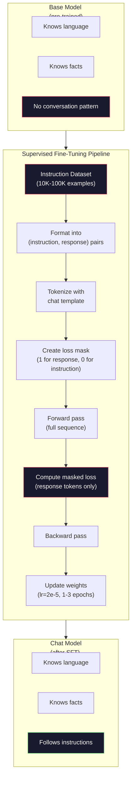

# Görev ayarlama (SFT)

> Bir temel model bir sonraki token'ı tahmin eder. İşte bu. talimatları takip etmez, soruları cevaplamaz veya zararlı istekleri reddetmez. SFT bir token öngörücü ile yararlı bir asistan arasındaki köprüdür. Hiç konuştuğunuz her model - Claude, GPT, Llama Chat - bu adımdan geçti.

**Type:** Build
**Languages:** Python (with numpy)
**Prerequisites:** Phase 10, Lesson 04 (Pre-Training a Mini GPT)
**Time:** ~90 minutes

## Öğrenme Hedefleri

- Temel dil modelini talimatları takip eden bir asistan olarak dönüştüren denetlenmiş ince ayarlama (SFT) uygulaması
- Sistem, kullanıcı ve yardımcı rolleri ile sohbet şablonları kullanarak eğitim verilerini biçimlendirin ve yardımcı olmayan tokenlerde maske kaybı
- SFT'nin neden gerekli olduğunu açıklayın: Temel modeller soruları cevaplamak yerine metni devam ettirir
- SFT kalitesini, temel model ile ince ayarlanmış model cevaplarını, uzun süreli bir talimat kümesi üzerinde karşılaştırarak değerlendirin.

## Sorun

Bir modelin bir dizi verildiğinde bir sonraki simgeyi tahmin edebilmesi için ders 04'te eğitim almışsınız. "Transformer mimarisi" olarak besleyebilir ve "doğal dil işlemesinde devrim yarattı".

Şimdi bunu deneyin: "Fransa'nın başkenti nedir?" diye besleyin. Temel model "Paris"e cevap vermez. Bu, "Almanya'nın başkenti nedir? İspanya'nın başkenti nedir?" çünkü sorular listesi içeren belgelerden öğrendi. Ya da "çok insanın sorduğu bir soru" olabilir çünkü bu bir sonraki belirti devamı olabilir. Modelde " cevabı " kavramı yoktur. Sadece devam ediyor.

Bu GPT-3 (temel model, Haziran 2020'de yayınlandı) ve ChatGPT (özetle ayarlanmış, Kasım 2022'de yayınlandı) arasındaki farkdır. Aynı mimarlık. Aynı önceden eğitim. Fark, modelin konuşma örneğini takip etmeyi öğrettiği dikkatle hazırlanmış (özet, yanıt) çiftler arasında 20.000 ila 100.000 arasıdır.

Stanford Alpaca, milyonlarca örneğe ihtiyacınız olmadığını kanıtladı. Mart 2023'te, GPT-3.5 tarafından üretilen sadece 52.000 talimat- yanıt çiftine Llama 7B'yi ince ayarladılar.$600. The result was a chatbot that could follow instructions, answer questions, and hold conversations. Not as good as ChatGPT, but shockingly close for $600 ve birkaç saat eğitim.

Meta'nın Llama 2 Çat'ı ilk SFT aşamasında sadece ~ 27.000 yüksek kaliteli örnek kullanmıştır. Anahtar anlayış: kalite miktardan daha önemlidir. Yetkin notatörler tarafından yazılan 27.000 örnek, internetten kaydırılan 1 milyon gürültülü örneği yendi.

## Anlaşım

### SFT'nin Gerçekte Yaptıkları

Denetimli Fine-Tuning, eğitim öncesi eğitimden önceki eğitim döngüsünü sürdürüyor -- ileri geçiş, hesap kaybı, geri geçiş, güncelleme ağırlıkları -- ama farklı bir veri türü üzerinde.

```json
{
  "system": "You are a helpful assistant.",
  "user": "What is the capital of France?",
  "assistant": "The capital of France is Paris."
}
```

Model, Paris'in Fransa'nın başkenti olduğunu zaten biliyor. Bunu Wikipedia, ders kitapları ve web sayfalarında önceden eğitim sırasında öğrendi. SFT model'e yeni gerçekleri öğretmez. Model'e yeni bir * davranış * öğretir: bir soru gördüğünde cevap ver. Bir talimat gördüğünde tamamlama ver. Zararlı bir talebi gördüğünde reddetme ver.

Bunu şöyle düşünün: önceden eğitim model bilgisini verir. SFT model davranışlarını verir.

### Veriler biçimi

Endüstriyi üç format yönetiyor. Her biri aynı bilgileri kodlıyor -- kim ne dedi -- farklı sınırlayıcılarla.

**Alpaca Format**(Stanford, Mart 2023):

```json
{
  "instruction": "Summarize the following article in 3 sentences.",
  "input": "The European Central Bank raised interest rates...",
  "output": "The ECB increased rates by 25 basis points..."
}
```

Basit ve yaygın olarak kullanılan.`input`Stanford, GPT-3.5 tarafından 600 dolara üretilen bu formatta 52.000 örnek yayınladı. Bu açık kaynaklı talimat ayarlama hareketine yol açtı.

**ShareGPT Format**(Topluluk, 2023):

```json
{
  "conversations": [
    {"from": "system", "value": "You are a helpful assistant."},
    {"from": "human", "value": "What causes tides?"},
    {"from": "gpt", "value": "Tides are caused by the gravitational pull of the Moon..."},
    {"from": "human", "value": "How often do they occur?"},
    {"from": "gpt", "value": "Most coastal areas experience two high tides and two low tides per day..."}
  ]
}
```

Vicuna, kullanıcılar tarafından paylaşılan ChatGPT transkriptlerinden alınan 70.000 ShareGPT sohbetinden eğitim aldı.

**ChatML Format**(OpenAI, birçok açık kaynaklı modelde kullanılır):

```
<|im_start|>system
You are a helpful assistant.<|im_end|>
<|im_start|>user
What is the capital of France?<|im_end|>
<|im_start|>assistant
The capital of France is Paris.<|im_end|>
```

Özel token kullanır (`<|im_start|>`- Evet .`<|im_end|>`Bu tokenler, ince ayarlama sırasında tokenizer'in sözlüküne eklenir. Qwen, Yi ve diğer birçok model ChatML kullanır.

Üç format da aynı şeyi başarıyor: modeline "Bu talimat, bu cevap, bu örneği öğrenin" diyorlar.

### Neden İşe Yararlı

Model, dilini önceden öğrenmiş ve cevaplar ile takip edilen soruların, talimatların ardından tamamlamaların ve insanlar arasındaki sohbetlerin milyarlarca örneğini görmüştür.

SFT bu gizli yeteneği yoğunlaştırır. Model bir soruya cevap vermeli veya bir belgeyi devam ettirmeli olup olmadığını bağlamdan anlamak yerine, SFT açıkça konuşma kalıbına eğitim verir. Birkaç bin örnekten sonra, model öğrenir: yardımcı rol işaretçisini gördüğünüzde, yardımcı bir yanıt üretin.

Bu yüzden 27.000 örnek yeterlidir. Bu model İngilizceyi öğretmiyorsunuz. Dünyayla ilgili gerçekleri öğretmiyorsunuz. Ona basit bir davranış öğretmiyorsunuz: talimatlara cevap verin. Bilgi zaten orada.

### Gizli Kayıp

Bu SFT'de en önemli teknik ayrıntı ve çoğu öğretim bunu atlatır.

Ön eğitim sırasında, her token'da kayıp hesaplanır. Model sıradaki her token'ı tahmin etmeyi öğrenir. SFT sırasında, sadece * yanıt* token'larda kayıp hesaplanır. talimat tokenleri bağlam için vardır, ancak model yanlış "böyle tahmin" ettiği için cezalandırılmaz.

Neden? Çünkü modelin talimatları oluşturmayı öğrenmesini istemiyorsunuz. talimatlara yanıt vermeyi öğrenmesini istiyorsunuz. Eğer talimat tokenlerinde kayıp hesaplarsanız, modelin soruyu soran kişi gibi "Fransa'nın başkenti nedir?" tahmin etmesini eğitiyorsunuz. Bu, gradient sinyali boşa çıkarır ve modelin rolü hakkında karıştırılabilir.

Pratikte bir kayb maskası oluşturursunuz: 1 cevap simgesi için, 0 talimat simgesi için.

```
Tokens:    [SYS] You are helpful [USER] What is the capital? [ASST] Paris is the capital [EOS]
Loss mask:   0    0    0     0      0     0   0  0     0       1     1    1   1     1      1
```

Sadece tokenlerin ardından .`[ASST]`Model, ileri geçiş sırasında tüm konuşmayı görür (doğru yanıt üretmek için talimata ihtiyaç duyar), ancak sadece yanıtın ne kadar iyi tahmin edildiğine göre ağırlıklarını güncelleyebilir.

### Eğitim Hiperparametre

SFT, eğitim öncesiyle çok farklı hiperparametre kullanıyor. Siz sıfırdan eğitim vermiyorsunuz.

| Parameter | Pre-Training (Llama 2 7B) | SFT (Llama 2 Chat) |
|-----------|---------------------------|---------------------|
| Learning rate | 3e-4 (peak) | 2e-5 |
| Epochs | 1 (single pass over data) | 2 |
| Batch size | 4M tokens | 64 examples |
| Warmup steps | 2,000 | 0-100 |
| Weight decay | 0.1 | 0.0-0.1 |
| Data size | 2T tokens | 27,000 examples |

SFT için öğrenme oranı 15 kat daha düşüktür. Bu kritik bir durumdur. ince ayarlama sırasında yüksek öğrenme oranı önceden eğitilmiş bilgiyi yok eder. Model öğrendiklerini "götürür" ve küçük ince ayarlama verisiyle aşırıya kaçar. Bu felaketli bir unutma.

İki dönem, modelin her eğitim örneğini iki kez görmesi anlamına gelir. Küçük bir veri kümesindeki üç dönemden fazla süre hafıza oluşturmaya neden olur.

### Kazaflı Unutulma

Düzgün ayarlama genel yetenekleri yok edebilir. talimatları takip eden veriler üzerinde çok uzun süre eğitim verirsek model kod yazma, matematik yapmak veya yaratıcı metin üretme yeteneğini kaybeder.

Üç hafifleme:

1. **Low learning rate.**1e-5'e-5e-5'e-5'e. Daha küçük güncelleştirmeler önceden eğitilmiş özelliklerin daha az yok edilmesini sağlar.

2. **Short training.**Modelle aşırı yüklenmeden durun.

3. **Mix in pre-training data.**Llama 2 Chat, SFT veri kümesine ham ön eğitim verilerinin küçük bir yüzdesini (2-5%) karıştırdı. Bu, yeni talimat takip davranışını öğrenirken genel yeteneklerini modelini "hatırlatır".

### Gerçek Sayılar

7B modelini 10.000 kaliteli eğitim çiftine ince ayarlamak, tek bir NVIDIA A100 80GB GPU'da yaklaşık 1 saat sürer.

- 10.000 örnek x 512 token ortalama = 5,12M token
- 2 dönem = toplam 10.24M token
- A100, 7B modelini ince ayarlamak için: ~3,000 token/sekundi
- 10.24M / 3,000 = ~ 3.400 saniye = ~ 57 dakika

Mini GPT'de eğitim neredeyse anlık bir süreçtir.



```figure
loss-masking
```

## Yapın

### Adım 1: Eğitim Verileri

Sintez bir talimat verisi oluşturun. Scale AI ve Anthropic gibi şirketler bunları yazmak için insan yorumcularını kullanıyor.

```python
import numpy as np

INSTRUCTION_DATA = [
    {
        "instruction": "What is the capital of France?",
        "response": "The capital of France is Paris."
    },
    {
        "instruction": "Explain gravity in one sentence.",
        "response": "Gravity is the force that attracts objects with mass toward each other."
    },
    {
        "instruction": "Write a haiku about the ocean.",
        "response": "Waves crash on the shore, salt and foam beneath the sun, endless blue expanse."
    },
    {
        "instruction": "What is 15 multiplied by 7?",
        "response": "15 multiplied by 7 is 105."
    },
    {
        "instruction": "Name three programming languages.",
        "response": "Three programming languages are Python, Rust, and TypeScript."
    },
    {
        "instruction": "Summarize photosynthesis.",
        "response": "Photosynthesis converts sunlight, water, and carbon dioxide into glucose and oxygen."
    },
    {
        "instruction": "What year did World War II end?",
        "response": "World War II ended in 1945."
    },
    {
        "instruction": "Define machine learning.",
        "response": "Machine learning is a field where algorithms learn patterns from data to make predictions."
    },
]
```

Stanford Alpaca'nın 52,000 kullanımı aynı ama mekanikler aynıdır. 8 veya 52,000'e sahip olursak da: tokenize, mask, hesap kaybı sadece cevaplar üzerinde.

### Adım 2: Çat Şablonu ile simgeleme

Görev- yanıt çiftlerini özel rol işaretleyicileri ile simgelik diziler haline getir.

```python
SPECIAL_TOKENS = {
    "INST_START": 253,
    "INST_END": 254,
    "RESP_START": 255,
}


def tokenize_instruction_pair(instruction, response, vocab_size=256):
    inst_tokens = list(instruction.encode("utf-8"))
    resp_tokens = list(response.encode("utf-8"))

    inst_tokens = [min(t, vocab_size - 4) for t in inst_tokens]
    resp_tokens = [min(t, vocab_size - 4) for t in resp_tokens]

    tokens = (
        [SPECIAL_TOKENS["INST_START"]]
        + inst_tokens
        + [SPECIAL_TOKENS["INST_END"]]
        + [SPECIAL_TOKENS["RESP_START"]]
        + resp_tokens
    )

    return tokens


def create_loss_mask(tokens):
    mask = np.zeros(len(tokens), dtype=np.float32)
    in_response = False

    for i, token in enumerate(tokens):
        if token == SPECIAL_TOKENS["RESP_START"]:
            in_response = True
            continue
        if in_response:
            mask[i] = 1.0

    return mask
```

Kayıp maskası, tüm talimat simgelerinin sıfırları ve tüm cevap simgelerinin sıfırlarıdır.`RESP_START`Token kendisinin 0 maskası elde eder çünkü bu bir sınırlayıcı, cevap içeriğinin bir parçası değil.

### Adım 3: Gizli çapraz entropy kaybı

Standart çapraz entropi, ancak kayb maskasıyla çarpılır.

```python
def masked_cross_entropy_loss(logits, targets, loss_mask):
    batch, seq_len, vocab_size = logits.shape
    logits_flat = logits.reshape(-1, vocab_size)
    targets_flat = targets.reshape(-1)
    mask_flat = loss_mask.reshape(-1)

    max_logits = logits_flat.max(axis=-1, keepdims=True)
    log_softmax = logits_flat - max_logits - np.log(
        np.exp(logits_flat - max_logits).sum(axis=-1, keepdims=True)
    )

    per_token_loss = -log_softmax[np.arange(len(targets_flat)), targets_flat]

    masked_loss = per_token_loss * mask_flat
    num_response_tokens = mask_flat.sum()
    if num_response_tokens == 0:
        return 0.0
    loss = masked_loss.sum() / num_response_tokens

    return loss
```

Adın adı `num_response_tokens`- Hayır .`seq_len`. Eğer toplam dizi uzunluğu ile bölüyorsanız, daha uzun talimatlar gradient sinyali bozar.

### 4. Adım: SFT Eğitim Çubuğu

MiniGPT'yi Ders 04'ten tekrar kullanın. Eğitim döngüsü, eğitim öncesiyle neredeyse aynı görünüyor, ancak talimat biçimlendirme ve maskeli kaybı ile.

```python
import sys
import os
sys.path.insert(0, os.path.join(os.path.dirname(__file__), "..", "..", "04-pre-training-mini-gpt", "code"))
from main import MiniGPT, LayerNorm, FeedForward, MultiHeadAttention, TransformerBlock, Embedding


def sft_train(model, dataset, num_epochs=2, lr=2e-5, seq_len=64):
    formatted_data = []
    for example in dataset:
        tokens = tokenize_instruction_pair(example["instruction"], example["response"])
        mask = create_loss_mask(tokens)
        formatted_data.append((tokens, mask))

    print(f"SFT Training: {len(formatted_data)} examples, {num_epochs} epochs, lr={lr}")
    print(f"Total tokens: {sum(len(t) for t, _ in formatted_data):,}")
    print()

    losses = []

    for epoch in range(num_epochs):
        epoch_loss = 0.0
        num_batches = 0

        indices = np.random.permutation(len(formatted_data))

        for idx in indices:
            tokens, mask = formatted_data[idx]

            if len(tokens) < 3:
                continue
            if len(tokens) > seq_len:
                tokens = tokens[:seq_len]
                mask = mask[:seq_len]

            input_ids = np.array(tokens[:-1]).reshape(1, -1)
            target_ids = np.array(tokens[1:]).reshape(1, -1)
            loss_mask = np.array(mask[1:]).reshape(1, -1)

            logits = model.forward(input_ids)
            loss = masked_cross_entropy_loss(logits, target_ids, loss_mask)

            batch_size, s_len, v_size = logits.shape
            probs = np.exp(logits - logits.max(axis=-1, keepdims=True))
            probs = probs / probs.sum(axis=-1, keepdims=True)
            dlogits = probs.copy()
            dlogits[np.arange(batch_size)[:, None], np.arange(s_len), target_ids] -= 1.0

            mask_expanded = loss_mask[:, :, np.newaxis]
            num_resp = loss_mask.sum()
            if num_resp > 0:
                dlogits = dlogits * mask_expanded / num_resp

            for block in model.blocks:
                block.ffn.W1 -= lr * np.random.randn(*block.ffn.W1.shape) * 0.01
                block.ffn.W2 -= lr * np.random.randn(*block.ffn.W2.shape) * 0.01
                block.ffn.b1 -= lr * np.random.randn(*block.ffn.b1.shape) * 0.01
                block.ffn.b2 -= lr * np.random.randn(*block.ffn.b2.shape) * 0.01

            epoch_loss += loss
            num_batches += 1
            losses.append(loss)

        avg_loss = epoch_loss / max(num_batches, 1)
        print(f"Epoch {epoch + 1}/{num_epochs} | Avg Loss: {avg_loss:.4f}")

    return model, losses
```

Öğrenme hızı 2e-5, Llama 2 Chat'e eşleşir. Bunu eğitim öncesi kullanılan 3e-4 ile karşılaştırın. 15 kat daha küçük.

### Adım 5: Base vs SFT Modelli karşılaştır

SFT'nin bütün amacı davranış değişikliği. modelin talimat biçimindeki girişlere karşı çiğ metin devamlarına nasıl tepki verdiğini kontrol ederek ölçüyoruz.

```python
def generate_response(model, prompt_tokens, max_new_tokens=50, temperature=0.8):
    tokens = list(prompt_tokens)
    seq_len = model.embedding.pos_embed.shape[0]

    for _ in range(max_new_tokens):
        context = np.array(tokens[-seq_len:]).reshape(1, -1)
        logits = model.forward(context)
        next_logits = logits[0, -1, :]

        next_logits = next_logits / max(temperature, 1e-8)
        probs = np.exp(next_logits - next_logits.max())
        probs = probs / probs.sum()
        probs = np.clip(probs, 1e-10, 1.0)
        probs = probs / probs.sum()

        next_token = np.random.choice(len(probs), p=probs)
        tokens.append(int(next_token))

    return tokens


def evaluate_instruction_following(model, instructions):
    print("Evaluating instruction following:")
    print("-" * 50)

    for instruction in instructions:
        tokens = (
            [SPECIAL_TOKENS["INST_START"]]
            + [min(t, 252) for t in list(instruction.encode("utf-8"))]
            + [SPECIAL_TOKENS["INST_END"]]
            + [SPECIAL_TOKENS["RESP_START"]]
        )

        output = generate_response(model, tokens, max_new_tokens=30, temperature=0.6)
        response_start = len(tokens)
        response_tokens = output[response_start:]
        response_bytes = bytes([t for t in response_tokens if t < 128])
        response_text = response_bytes.decode("utf-8", errors="replace")

        print(f"  Q: {instruction}")
        print(f"  A: {response_text[:80]}")
        print()
```

8 örnekle küçük bir modelde, cevaplar anlamlı olmayacak. Bu beklenir. Önemli olan * yapı*: model daha fazla talimat üretmeye devam etmek yerine cevap işaretçisinden sonra çıkış üretmeyi öğrenir.

### 6 . Adım: Kayıp Bir Unutma Ölçüsü

SFT'den önce ve sonra modelin bir sonraki belirti tahmin yeteneğini karşılaştırın. SFT genel yeteneklere zarar verirse, ham metin kayıpları artacaktır.

```python
def measure_forgetting(model, test_text, seq_len=64):
    tokens = np.array(list(test_text.encode("utf-8")[:512]))

    total_loss = 0.0
    num_windows = 0

    for start in range(0, len(tokens) - seq_len - 1, seq_len):
        input_ids = tokens[start:start + seq_len].reshape(1, -1)
        target_ids = tokens[start + 1:start + seq_len + 1].reshape(1, -1)

        logits = model.forward(input_ids)

        batch, s_len, vocab_size = logits.shape
        logits_flat = logits.reshape(-1, vocab_size)
        targets_flat = target_ids.reshape(-1)

        max_logits = logits_flat.max(axis=-1, keepdims=True)
        log_softmax = logits_flat - max_logits - np.log(
            np.exp(logits_flat - max_logits).sum(axis=-1, keepdims=True)
        )

        loss = -log_softmax[np.arange(len(targets_flat)), targets_flat].mean()
        total_loss += loss
        num_windows += 1

    return total_loss / max(num_windows, 1)
```

Gerçek ince ayarlamalarda, bu metrikleri eğitim boyunca takip edebilirsiniz. Eğer ham metin kaybı %10'dan %15'e kadar artarsa, SFT'niz çok agresif olur. Öğrenme oranını düşürün veya dönem sayısını azaltın.

## Kullan

### Tam SFT boru hattı gösterimi

```python
if __name__ == "__main__":
    np.random.seed(42)

    test_text = """The transformer architecture processes sequences through self-attention.
Each layer applies multi-head attention followed by a feedforward network.
Residual connections and layer normalization stabilize deep networks.
The model learns to predict the next token given all previous tokens."""

    print("=" * 70)
    print("INSTRUCTION TUNING (SFT) DEMO")
    print("=" * 70)
    print()

    model = MiniGPT(
        vocab_size=256, embed_dim=128, num_heads=4,
        num_layers=4, max_seq_len=128, ff_dim=512
    )
    print(f"Model: {model.count_parameters():,} parameters")
    print(f"Config: 4 layers, 4 heads, 128 dims (mini GPT from Lesson 04)")
    print()

    print("PRE-SFT: Measuring base model loss on raw text")
    base_loss = measure_forgetting(model, test_text)
    print(f"  Base model loss: {base_loss:.4f}")
    print()

    print("=" * 70)
    print("SFT TRAINING")
    print("=" * 70)

    model, losses = sft_train(
        model, INSTRUCTION_DATA, num_epochs=3, lr=2e-5, seq_len=128
    )

    print()
    print("POST-SFT: Measuring fine-tuned model loss on raw text")
    sft_loss = measure_forgetting(model, test_text)
    print(f"  SFT model loss: {sft_loss:.4f}")
    print(f"  Change: {((sft_loss - base_loss) / base_loss * 100):+.1f}%")
    if abs(sft_loss - base_loss) / base_loss < 0.15:
        print("  Minimal forgetting (< 15% change)")
    else:
        print("  Significant forgetting detected")
    print()

    print("=" * 70)
    print("INSTRUCTION FOLLOWING EVALUATION")
    print("=" * 70)
    print()

    test_instructions = [
        "What is the capital of France?",
        "Name a programming language.",
        "Define gravity.",
    ]
    evaluate_instruction_following(model, test_instructions)

    print("=" * 70)
    print("DATA FORMAT EXAMPLES")
    print("=" * 70)
    print()

    for i, example in enumerate(INSTRUCTION_DATA[:3]):
        tokens = tokenize_instruction_pair(example["instruction"], example["response"])
        mask = create_loss_mask(tokens)
        resp_count = int(mask.sum())
        total_count = len(tokens)
        print(f"  Example {i + 1}: {total_count} tokens, {resp_count} response tokens ({resp_count/total_count:.0%} of sequence)")
        print(f"    Instruction: {example['instruction']}")
        print(f"    Response: {example['response']}")
        print()

    print("=" * 70)
    print("TRAINING LOSS CURVE")
    print("=" * 70)
    print()

    if losses:
        window = max(1, len(losses) // 5)
        for i in range(0, len(losses), window):
            chunk = losses[i:i + window]
            avg = sum(chunk) / len(chunk)
            print(f"  Steps {i:3d}-{i + len(chunk) - 1:3d}: avg loss = {avg:.4f}")
```

## Gönder

Bu ders bize çok yararlı .`outputs/prompt-sft-data-curator.md`- SFT için talimat verileri tasarlamanıza ve kurasyonuna yardımcı olan bir istek. Hedef yeteneği (kod üretimi, matematik, konuşma) verildiğinde, format özellikleri, kalite kriterleri ve çeşitlilik gereksinimleri ile bir veri toplama planı üretir.

## Egzersizler

1. Sistem hızlı destek ekle. Değiştir `tokenize_instruction_pair`Sistem mesajını kabul etmek ve talimattan önce hazırlamak için. 5 örnek oluşturmak için farklı sistem istekleri ("Şairsin", "Matematika öğretmenisin") ve modelin eğitim sırasında farklı sistem istekleri gördüğünü doğrulayın.

2. Veriler karışımı uygulayın. SFT veri kümesi ve ham metin korpusunu alan bir işlev oluşturun, ardından örneklerin% 5'i ham metin (masklama yapılmıyor) ve% 95'i talimat çiftleri (masklama yapılmaktadır) olan eğitim partilerini oluşturun. 3 dönem çalıştırın ve unutma metriklerini saf SFT eğitimine karşı karşılaştırın.

3. Veriler kalitesi puanlayıcıyı oluşturun. Her talimat- yanıt çiftine göre: (a) sinyallerdeki yanıt uzunluğu, (b) talimat- yanıt oranı, (c) kelime dağılımının (eşitli işaretler / toplam işaretler) ölçümlerini hesaplayın. Yanıt uzunluğu < 10 işaret veya çeşitliliği < 0.3 olan örnekleri filtreleyin. Filtrenin nihai kayba nasıl etkisi olduğunu gösterin.

4. Çok dönüşlü konuşma eğitimi uygulayın. 3 dönüşlü konuşmaları (kullanıcı asistanı-kullanıcı asistanı-kullanıcı asistanı) yönetmek için işaretlemeyi genişletin. Kayıp maskası üç asistan dönüşünü de kapsamalıdır. Maskanın doğru olduğunu bir örnek için işaret-mask düzeni yazdırarak kontrol edin.

5. Öğrenme oranlarını karşılaştırın. Aynı modeli lr=1e-4, lr=2e-5 ve lr=1e-6 ile üç kez çalıştırın. Kayıp eğrilerini çizin. 1e-4 koşusu hızlı bir başlangıç düşüşü göstermelidir, ancak daha yüksek nihai kaybı (overfitting). 1e-6 koşusu neredeyse hareket etmemelidir. 2e-5 koşusu tatlı noktayı olmalıdır.

## Anahtar Terimler

| Term | What people say | What it actually means |
|------|----------------|----------------------|
| SFT | "Fine-tuning on conversations" | Supervised Fine-Tuning: continuing training on (instruction, response) pairs with loss computed only on response tokens |
| Instruction tuning | "Teaching the model to follow instructions" | Training on explicit instruction-response pairs so the base model learns the conversation pattern, not new knowledge |
| Loss masking | "Ignoring the prompt" | Setting loss to zero for instruction tokens so gradients only flow from response token predictions |
| ChatML | "Chat Markup Language" | A token format using `<\|im_start\|>` and `<\|im_end\|>` delimiters to mark speaker roles in conversation data |
| Alpaca format | "Stanford's format" | A JSON format with instruction/input/output fields, used for 52K GPT-3.5-generated examples that cost $600 |
| Catastrophic forgetting | "The model gets dumber" | Fine-tuning destroys pre-trained capabilities because gradient updates overwrite general knowledge with task-specific patterns |
| Weight tying | "Shared embeddings" | Using the same matrix for input token embeddings and output prediction head, saving parameters and improving coherence |
| Chat template | "How you format the prompt" | The specific token sequence (role markers, delimiters) that structures a conversation for the model |

## Daha Fazla Okumak

- [Ouyang et al., 2022 -- "Training language models to follow instructions with human feedback" (InstructGPT)](https://arxiv.org/abs/2203.02155)-- OpenAI'de talimat ayarlama + RLHF'i tanıtan makale
- [Taori et al., 2023 -- "Stanford Alpaca: An Instruction-following LLaMA Model"](https://github.com/tatsu-lab/stanford_alpaca)-- 600 $ için 52K talimat örnekleri, SFT'nin küçük veri kümelerinde çalıştığını kanıtlıyor.
- [Touvron et al., 2023 -- "Llama 2: Open Foundation and Fine-Tuned Chat Models"](https://arxiv.org/abs/2307.09288)-- Meta'nın SFT + RLHF boru hattı, 27K yüksek kaliteli örnekle
- [Chiang et al., 2023 -- "Vicuna: An Open-Source Chatbot Impressing GPT-4"](https://lmsys.org/blog/2023-03-30-vicuna/)-- 70K ShareGPT sohbetleri üzerine eğitim
- [Zhou et al., 2023 -- "LIMA: Less Is More for Alignment"](https://arxiv.org/abs/2305.11206)-- 1000 dikkatli bir şekilde seçilen örneklerin çok daha büyük veri kümelerinde SFT ile eşleşebileceğini kanıtlamak
