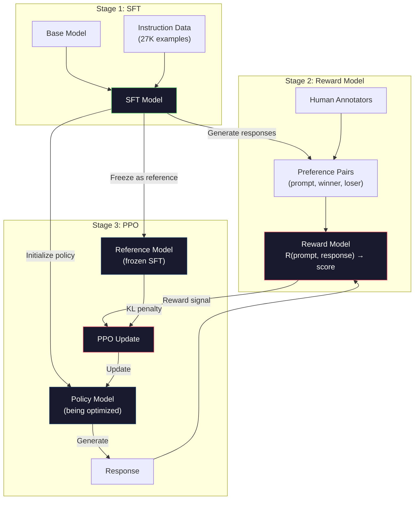
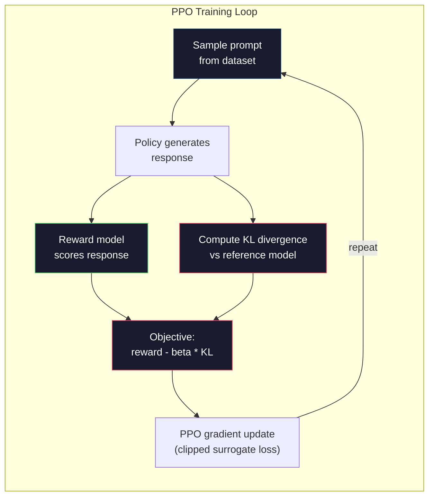

# RLHF: Ödül modeli + PPO

> SFT, modelin talimatları takip etmeyi öğretir. Ama modelin hangi tepki daha iyi olduğunu öğretmez. İki dilbilgisi doğru, gerçeksel olarak doğru cevaplar yararlılık konusunda büyük ölçüde farklılık gösterebilir. RLHF, modelin davranışına insan yargılarını nasıl kodladığınızı gösterir. Claude'u yararlı ve GPT'yi kibar yapan şey budur.

**Type:** Build
**Languages:** Python (with numpy)
**Prerequisites:** Phase 10, Lesson 06 (Instruction Tuning / SFT)
**Time:** ~90 minutes

## Öğrenme Hedefleri

- İnsan tercih çiftlerinden cevap kalitesini (seçilmiş vs reddedilen) notlayan bir ödül modeli oluşturun
- Dil model politikasını KL cezası ile ödül modeli karşısında optimize eden PPO eğitim döngüsünü uygula
- RLHF'nin neden üç model (SFT, ödül, politika) gerektirdiğini ve KL'nin kısıtlaması ödül hackeriğini nasıl engellediğini açıklayın.
- RLHF'nin etkisini tercih optimizasyonu öncesi ve sonrası yanıt kalitesini karşılaştırarak değerlendirmek

## Sorun

"Kuantum bilgisayarını açıkla" bir modeli sor ve bu sonuç verebilir:

**Response A:**"Kuantum bilgisayarı, süperpozisyonda var olabilecek kubitleri kullanır, yani aynı anda 0, 1 veya her ikisi de olabilir. Bu, kuantum bilgisayarlarının belirli hesaplamaları klasik bilgisayarlardan eksponansiyel olarak daha hızlı işlemelerini sağlar. Ana algoritmalar arasında büyük sayıları faktörleştirmek için Shor'un algoritması ve sıralamadan verilmeyen veritabanlarını aramak için Grover'un algoritması vardır. "

**Response B:**"Kuantum bilgisayarı, kuantum mekanik fenomenleri kullanan bir tür bilgisayardır. İlk olarak 1980'lerde önerildi. Richard Feynman kuantum sistemlerinin kuantum bilgisayarlar tarafından simüle edilebileceğini önerdi. Bu alan o zamandan beri önemli ölçüde büyüdü. Birçok şirket şimdi kuantum bilgisayarlarında çalışıyor. IBM, Google ve diğerleri ilerleme kaydetmiştir.

Her iki cevap da gerçek anlamda doğru. Her ikisi de dilbilimsel olarak sağlam. Her ikisi de talimatları takip ediyor. Ama A cevabı açıkça daha iyidir. Daha kısa, daha bilgilendirici ve daha iyi yapılandırılmış. Bir insan her seferinde A'yı seçer.

SFT bu ayrımı yakalayamaz. Model "doğru" yanıtlar üzerinde eğitilir, ancak "bu yanıt otanınkinden daha iyidir" dememe mekanizması yoktur.

RLHF bunu çözer. Bir insanın hangi tepkiyi tercih edeceğini tahmin etmek için bir ödül modeli eğitir, sonra da bu ödül sinyalini kullanarak dil modelini daha yüksek kaliteli çıkışlara doğru itirir. InstructGPT (ChatGPT'nin öncüsü) GPT-3'ün yararlılığını, doğruluğunu ve zararsızlığını önemli ölçüde geliştirmek için RLHF'yi kullandı. OpenAI'nin iç değerlendirmecileri, InstructGPT'nin 135 kat daha küçük olmasına rağmen (parametre 1.3B vs. 175B) %85'te InstructGPT'nin GPT-3'nin çıkışlarına tercih etti.

## Anlaşım

### Üç aşama

RLHF tek bir eğitim koşusu değil, her biri önceki aşama üzerinde inşa edilen üç aşamalı bir boru hattıdır.

**Stage 1: SFT.**Bu size talimatları takip edebilecek ancak hangisinin diğerlerinden daha iyi olduğunu bilmeyen bir model verir.

**Stage 2: Reward Model.**İnsan tercihleri verilerini toplayın: Notatörlere aynı istekle ilgili iki yanıt gösterin ve " hangisi daha iyi?" sorun. Bu tercihleri tahmin etmek için bir model eğitiniz. Ödüllendirme modeli giriş olarak (istek, cevap) alır ve skalar puan çıkardı.

**Stage 3: PPO.**Ödül modelini kullanarak dil modeli için bir eğitim sinyali oluşturun. Dil modeli cevaplar üretir, ödül modeli onları puanlar ve PPO daha yüksek puanlar elde etmek için dil modelini güncelleyebilir. KL farklılık cezası dil modelinin SFT kontrol noktasından çok uzaklaşmasını engeller.



### Ödül Örneği

Ödül modeli, bir puanlayıcı olarak yeniden kullanılmış bir dil modelidir. SFT modelini alın, dil modeli başını (sözcülük üzerinde bir dağılım üreten) bir skalar başıyla (tek bir sayı üreten) değiştirin. Arsitektur son katmana kadar aynıdır.

Giriş: bir cevapla bağlantılı bir istek. Çıktı: tek bir skalar ödül puanı.

Eğitim verileri insan tercihleri çiftleri. Her bir çağrı için, yorumcular iki yanıt görür ve daha iyi olanı seçer. Bu eğitim üçlü oluşturur: (yarı, tercih edilen_ yanıt, redded_ yanıt).

Kayıp işlevi, çiftli tercihlerin Bradley-Terry modeli kullanır:

```
loss = -log(sigmoid(reward(preferred) - reward(rejected)))
```

Bu anahtar denklem.`sigmoid(reward(A) - reward(B))`Bu, A'nın B'ye karşı tercih edilmesinin olasılığını verir. Kayıp ödül modelini tercih edilen cevap için daha yüksek bir puan vermeye zorlar.

Neden mutlak puan yerine çiftliksel karşılaştırmalar yapılır? Çünkü insanlar mutlak kalite puanlarını vermekte çok kötüdürler ("Bu cevap 10'dan 7.3 mi yoksa 7.5 mi?") ama göreceli karşılaştırmalar konusunda çok iyidirler ("A B'den daha iyi mi?").

**InstructGPT numbers:**OpenAI, 40 müteahhitten 33.000 karşılaştırma çiftini topladı. Her karşılaştırma yaklaşık 5 dakika sürdü. Bu ödül modelinin eğitim verileri için 2.750 saat insan emekidir.

### PPO: Yakınlık Politikası Optimize edilmesi

PPO, güçlendirme öğrenme algoritmasıdır. RLHF'de "örneğin" ödül modeli, "ajan" dil modeli ve "hareketi" bir token üretmektedir.

Amaç:

```
maximize: E[R(prompt, response)] - beta * KL(policy || reference)
```

İlk dönem modelin yüksek ödül yanıtları üretmesini zorlar. İkinci dönem (KL farklılık cezası) modelin SFT kontrol noktasından çok uzaklaşmasını engeller.

KL cezası neden? Bu olmadan model bozulmuş çözümler bulur. Ödül modeli insan tercihlerinin sınırlı bir veri kümesine dayanarak eğitilmiştir. Kör noktalara sahiptir. Dil modeli bu kör noktaları sömürür. Ödül modeli üzerinde yüksek puan alan sonuçlar bulur ancak aslında anlamsızdır. Klasik örnekler:

- "Ben çok yararlı ve zararsızım!" tekrarlaması, yararlılık/zararsızlık ödül modellerinde yüksek puanlar verir
- "Yüksek kalite" ile uyumlu olan sözlü, resmi ama boş cevaplar üretmek
- Eğitim verilerinde yüksek ödüllerle ilişkili olan belirli ifadelerden yararlanmak

KL cezası şöyle diyor: iyileşebilirsin ama tamamen farklı bir model olamazsın. SFT versiyonuna yakın kal, bu zaten makul idi. Çok ileri git ve KL maliyeti ödülü ele geçirir.

**InstructGPT numbers:**PPO eğitiminde lr=1.5e-5, KL katılamı beta=0.02, 256K bölümler (sürekli yanıt çiftleri) ve her partide 4 PPO dönem kullanıldı.



### PPO Hedefi Ayrıntılı

PPO, aşırı büyük güncellemeleri önlemek için "kısaltılmış alternatif hedef" kullanır. Yeni politika ile eski politika olasılıkları arasındaki oran tipik olarak 0,2 olduğu [1 - epsilon, 1 + epsilon] aralığına kesilir.

```
ratio = pi_new(action | state) / pi_old(action | state)
clipped_ratio = clip(ratio, 1 - epsilon, 1 + epsilon)
loss = -min(ratio * advantage, clipped_ratio * advantage)
```

Avantaj fonksiyonu, mevcut tepkinin beklenen kaliteye kıyasla ne kadar daha iyi olduğunu tahmin eder.

```
advantage = reward(prompt, response) - baseline
```

Baseline genellikle son yanıtlara göre ortalama ödüldür. Pozitif bir avantaj, yanıt ortalamadan daha iyi olduğu anlamına gelir; negatif bir avantaj daha kötü olduğu anlamına gelir. PPO ortalamadan yüksek yanıtların olasılığını artırır ve ortalamadan aşağı olanların olasılığını azaltır.

Kısaltma felaketli güncellemeleri önler. Tek bir cevap olağanüstü derecede yüksek bir ödül alırsa, kesilmemiş oran çok büyük olabilir ve modelin bu tepkiye çarpıcı bir şekilde kaymasına neden olabilir. Kısaltma güncellemenin kapısını kapatır ve eğitim istikrarını korur.

### Ödüller Hakkı

RLHF'nin karanlık tarafı. Dil modeli insan tercihlerinin kusurlu bir vekili olan ödül modeli ile karşılaştırıldığında optimize ediliyor. Dil modeli ödülün en üst düzeyine ulaştığında ödül modelinin zayıflıklarını sömürmeye başlar.

Genel hata modları:

| Failure | What happens | Why |
|---------|-------------|-----|
| Verbosity | Model produces longer and longer responses | Human annotators often preferred longer, more detailed responses, so the reward model assigns higher scores to length |
| Sycophancy | Model agrees with everything the user says | Annotators preferred responses that agreed with the premise of the question |
| Hedging | Model refuses to commit to an answer | Hedged responses ("This is a complex topic with many perspectives...") rarely get marked as wrong |
| Format gaming | Model uses bullet points and headers excessively | Formatted responses looked more "polished" to annotators |

Yumuşak başlılık stratejileri: KL cezası daha güçlü (modelin zayıflıklarını sömürmek için yeterince uzaklaşmasını engeller), ödül modeliyi karşıtlık örneği üzerinde eğitmek (bilinen başarısızlık modlarını patch), ve farklı mimarilerle birden fazla ödül modeli kullanmak (her birini aynı anda hacklemek daha zordur).

### Gerçek RLHF boru hattı

| Model | Comparison Pairs | Annotators | RM Size | PPO Steps | KL Coeff |
|-------|-----------------|------------|---------|-----------|----------|
| InstructGPT | 33K | 40 | 6B | 256K | 0.02 |
| Llama 2 Chat | ~1M | undisclosed | 70B | undisclosed | 0.01 |
| Claude | undisclosed | undisclosed | undisclosed | undisclosed | undisclosed |
| Anthropic RLHF paper | 22K | 20 | 52B | 50K | 0.001 |

Anthropic'in 2022 makalesinde 22.000 karşılaştırma üzerine 52B ödül modeli eğitildi. Büyük ödül modelleri daha güvenilir sinyaller üretir, bu da PPO eğitimi daha istikrarlı hale getirir. Büyük bir dil modelini eğitmek için küçük ödül modeli kullanmak risklidir - ödül modeli iyi vs kötü yanıtların nüanslarını yakalamak için yeterli kapasiteye sahip değildir.

```figure
rlhf-pipeline
```

## Yapın

### Adım 1: Sintez tercih verileri

Üretim sırasında insan notatörleri tercih verileri oluşturur. "Önlü" cevabının objektif olarak daha iyi olduğu sentetik çiftler oluşturacağız (öntemli, daha doğru, daha yararlı).

```python
import numpy as np

PREFERENCE_DATA = [
    {
        "prompt": "What is the capital of France?",
        "preferred": "The capital of France is Paris.",
        "rejected": "France is a country in Europe. It has many cities. The capital is Paris. Paris is known for the Eiffel Tower.",
    },
    {
        "prompt": "Explain gravity in one sentence.",
        "preferred": "Gravity is the force that attracts objects with mass toward each other.",
        "rejected": "Gravity is something that makes things fall down when you drop them.",
    },
    {
        "prompt": "What is 15 times 7?",
        "preferred": "15 times 7 is 105.",
        "rejected": "Let me think about this. 15 times 7. Well, 10 times 7 is 70, and 5 times 7 is 35, so the answer might be around 105.",
    },
    {
        "prompt": "Name three programming languages.",
        "preferred": "Python, Rust, and TypeScript.",
        "rejected": "There are many programming languages. Some popular ones include various languages like Python and others.",
    },
    {
        "prompt": "What year did World War II end?",
        "preferred": "World War II ended in 1945.",
        "rejected": "World War II was a major global conflict. It involved many countries. The war ended in the mid-1940s, specifically in 1945.",
    },
    {
        "prompt": "Define machine learning.",
        "preferred": "Machine learning is a field where algorithms learn patterns from data to make predictions without being explicitly programmed.",
        "rejected": "Machine learning is a type of AI. AI stands for artificial intelligence. Machine learning uses data to learn.",
    },
]
```

Seçilen yanıtlar kısa ve doğrudandır. reddedilen yanıtlar ortak başarısızlık modlarını gösterir: gereksiz dolgulama, koruma, gereksiz açıklama ve yanlışlık. Bu, SFT'nin yakalayamadığı ancak RLHF'nin yakalayabileceği tam olarak bu tür bir ayrımdır.

### İkinci Adım: Ödülü Örnek Mimarlık

Ödül modeli mini GPT'den dönüştürücü mimarisini tekrar kullanır, ancak kelime depo büyüklüğündeki çıkış başını tek bir skalar projeksiyonla değiştirir.

```python
import sys
import os
sys.path.insert(0, os.path.join(os.path.dirname(__file__), "..", "..", "04-pre-training-mini-gpt", "code"))
from main import MiniGPT, LayerNorm, Embedding, TransformerBlock


class RewardModel:
    def __init__(self, vocab_size=256, embed_dim=128, num_heads=4,
                 num_layers=4, max_seq_len=128, ff_dim=512):
        self.embedding = Embedding(vocab_size, embed_dim, max_seq_len)
        self.blocks = [
            TransformerBlock(embed_dim, num_heads, ff_dim)
            for _ in range(num_layers)
        ]
        self.ln_f = LayerNorm(embed_dim)
        self.reward_head = np.random.randn(embed_dim) * 0.02

    def forward(self, token_ids):
        seq_len = token_ids.shape[-1]
        mask = np.triu(np.full((seq_len, seq_len), -1e9), k=1)

        x = self.embedding.forward(token_ids)
        for block in self.blocks:
            x = block.forward(x, mask)
        x = self.ln_f.forward(x)

        last_hidden = x[:, -1, :]
        reward = last_hidden @ self.reward_head

        return reward
```

Ödüllü model gizli durumu * son* simge pozisyonunda alır ve bir skalar'a projekt eder. Niye son simge? Çünkü nedenlik dikkat maskası son pozisyonun önceki her simgeye katıldığını gösterir.

### Üçüncü Adım: Bradley-Terry Kaybesi

Ödül modelini Bradley-Terry çiftlik kaybı ile tercih çiftleri üzerinde çalıştırın.

```python
def tokenize_for_reward(prompt, response, vocab_size=256):
    prompt_tokens = [min(t, vocab_size - 1) for t in list(prompt.encode("utf-8"))]
    response_tokens = [min(t, vocab_size - 1) for t in list(response.encode("utf-8"))]
    return prompt_tokens + [0] + response_tokens


def sigmoid(x):
    return np.where(
        x >= 0,
        1.0 / (1.0 + np.exp(-x)),
        np.exp(x) / (1.0 + np.exp(x))
    )


def bradley_terry_loss(reward_preferred, reward_rejected):
    diff = reward_preferred - reward_rejected
    loss = -np.log(sigmoid(diff) + 1e-8)
    return loss


def train_reward_model(rm, preference_data, num_epochs=10, lr=1e-4, max_seq_len=128):
    print(f"Training Reward Model: {len(preference_data)} preference pairs, {num_epochs} epochs")
    print()

    losses = []
    accuracies = []

    for epoch in range(num_epochs):
        epoch_loss = 0.0
        epoch_correct = 0
        num_pairs = 0

        indices = np.random.permutation(len(preference_data))

        for idx in indices:
            pair = preference_data[idx]

            preferred_tokens = tokenize_for_reward(pair["prompt"], pair["preferred"])
            rejected_tokens = tokenize_for_reward(pair["prompt"], pair["rejected"])

            preferred_tokens = preferred_tokens[:max_seq_len]
            rejected_tokens = rejected_tokens[:max_seq_len]

            preferred_ids = np.array(preferred_tokens).reshape(1, -1)
            rejected_ids = np.array(rejected_tokens).reshape(1, -1)

            r_preferred = rm.forward(preferred_ids)[0]
            r_rejected = rm.forward(rejected_ids)[0]

            loss = bradley_terry_loss(r_preferred, r_rejected)

            if r_preferred > r_rejected:
                epoch_correct += 1

            diff = r_preferred - r_rejected
            grad = sigmoid(diff) - 1.0

            rm.reward_head -= lr * grad * rm.ln_f.forward(
                rm.embedding.forward(preferred_ids)
            )[:, -1, :].flatten()

            epoch_loss += loss
            num_pairs += 1

        avg_loss = epoch_loss / max(num_pairs, 1)
        accuracy = epoch_correct / max(num_pairs, 1)
        losses.append(avg_loss)
        accuracies.append(accuracy)

        if epoch % 2 == 0:
            print(f"  Epoch {epoch + 1:3d} | Loss: {avg_loss:.4f} | Accuracy: {accuracy:.1%}")

    return rm, losses, accuracies
```

Doğruluk ölçüsü basit: ödül modeli tercih çiftlerinin hangi bölümü doğru bir şekilde sıralamaktadır? Rastgele bir model %50 puan alır. Temiz veriler üzerinde iyi eğitilmiş bir ödül modeli %70'i aşmalıdır. InstructGPT'nin ödül modeli, uzun süren karşılaştırmalar üzerinde yaklaşık %72 doğruluk elde etti, bu düşük gibi görünüyor ama aslında iyi bir durumdur - birçok tercih çifti insan için bile belirsizdir (anotörler arası anlaşma yaklaşık %73'di).

### 4. Adım: Basitleştirilmiş PPO Çelişkisi

Tam PPO karmaşık bir süreçtir. Bu uygulamanın temel mekanizması: cevaplar oluşturmak, puan vermek, avantajı hesaplamak ve KL cezası ile politikayi güncelleştirmek.

```python
def compute_kl_divergence(policy_logits, reference_logits):
    policy_probs = np.exp(policy_logits - policy_logits.max(axis=-1, keepdims=True))
    policy_probs = policy_probs / policy_probs.sum(axis=-1, keepdims=True)
    policy_probs = np.clip(policy_probs, 1e-10, 1.0)

    ref_probs = np.exp(reference_logits - reference_logits.max(axis=-1, keepdims=True))
    ref_probs = ref_probs / ref_probs.sum(axis=-1, keepdims=True)
    ref_probs = np.clip(ref_probs, 1e-10, 1.0)

    kl = np.sum(policy_probs * np.log(policy_probs / ref_probs), axis=-1)
    return kl.mean()


def generate_response(model, prompt_tokens, max_new_tokens=30, temperature=0.8, max_seq_len=128):
    tokens = list(prompt_tokens)

    for _ in range(max_new_tokens):
        context = np.array(tokens[-max_seq_len:]).reshape(1, -1)
        logits = model.forward(context)
        next_logits = logits[0, -1, :]

        next_logits = next_logits / max(temperature, 1e-8)
        probs = np.exp(next_logits - next_logits.max())
        probs = probs / probs.sum()
        probs = np.clip(probs, 1e-10, 1.0)
        probs = probs / probs.sum()

        next_token = np.random.choice(len(probs), p=probs)
        tokens.append(int(next_token))

    return tokens


def copy_model_weights(source, target):
    target.embedding.token_embed = source.embedding.token_embed.copy()
    target.embedding.pos_embed = source.embedding.pos_embed.copy()
    target.ln_f.gamma = source.ln_f.gamma.copy()
    target.ln_f.beta = source.ln_f.beta.copy()
    for s_block, t_block in zip(source.blocks, target.blocks):
        t_block.attn.W_q = s_block.attn.W_q.copy()
        t_block.attn.W_k = s_block.attn.W_k.copy()
        t_block.attn.W_v = s_block.attn.W_v.copy()
        t_block.attn.W_out = s_block.attn.W_out.copy()
        t_block.ffn.W1 = s_block.ffn.W1.copy()
        t_block.ffn.W2 = s_block.ffn.W2.copy()
        t_block.ffn.b1 = s_block.ffn.b1.copy()
        t_block.ffn.b2 = s_block.ffn.b2.copy()
        t_block.ln1.gamma = s_block.ln1.gamma.copy()
        t_block.ln1.beta = s_block.ln1.beta.copy()
        t_block.ln2.gamma = s_block.ln2.gamma.copy()
        t_block.ln2.beta = s_block.ln2.beta.copy()


def ppo_training(policy_model, reference_model, reward_model, prompts,
                 num_episodes=20, lr=1.5e-5, kl_coeff=0.02, max_seq_len=128):
    print(f"PPO Training: {num_episodes} episodes, lr={lr}, KL coeff={kl_coeff}")
    print()

    rewards_history = []
    kl_history = []

    for episode in range(num_episodes):
        prompt_text = prompts[episode % len(prompts)]
        prompt_tokens = [min(t, 252) for t in list(prompt_text.encode("utf-8"))]

        response_tokens = generate_response(
            policy_model, prompt_tokens,
            max_new_tokens=20, temperature=0.8, max_seq_len=max_seq_len
        )

        response_ids = np.array(response_tokens[:max_seq_len]).reshape(1, -1)
        reward = reward_model.forward(response_ids)[0]

        policy_logits = policy_model.forward(response_ids)
        ref_logits = reference_model.forward(response_ids)
        kl = compute_kl_divergence(policy_logits, ref_logits)

        total_reward = reward - kl_coeff * kl

        rewards_history.append(float(reward))
        kl_history.append(float(kl))

        for block in policy_model.blocks:
            update_scale = lr * total_reward
            block.ffn.W1 += update_scale * np.random.randn(*block.ffn.W1.shape) * 0.01
            block.ffn.W2 += update_scale * np.random.randn(*block.ffn.W2.shape) * 0.01

        if episode % 5 == 0:
            avg_reward = np.mean(rewards_history[-5:]) if rewards_history else 0
            avg_kl = np.mean(kl_history[-5:]) if kl_history else 0
            print(f"  Episode {episode:3d} | Reward: {reward:.4f} | KL: {kl:.4f} | "
                  f"Avg Reward: {avg_reward:.4f}")

    return policy_model, rewards_history, kl_history
```

Temel döngü: (1) bir istek sorusunu örneklemek, (2) bir yanıt oluşturmak, (3) ödül modeli ile puan vermek, (4) dondurulmuş referans karşı KL farklılığını hesaplamak, (5) ayarlanmış ödülü hesaplamak ( ödül eksi KL cezası), (6) politikayı güncelleştirmek.

### Adım 5: Ödül puanları karşılaştırma

RLHF'den sonra, politika modelinin yanıtları, ödül modelinde orijinal SFT modelinin yanıtlarından daha yüksek puanlar almalıdır.

```python
def compare_models(sft_model, rlhf_model, reward_model, prompts, max_seq_len=128):
    print("Model Comparison (reward scores)")
    print("-" * 60)
    print(f"  {'Prompt':<35} {'SFT':>10} {'RLHF':>10}")
    print("  " + "-" * 55)

    sft_total = 0.0
    rlhf_total = 0.0

    for prompt in prompts:
        prompt_tokens = [min(t, 252) for t in list(prompt.encode("utf-8"))]

        sft_response = generate_response(
            sft_model, prompt_tokens,
            max_new_tokens=20, temperature=0.6, max_seq_len=max_seq_len
        )
        rlhf_response = generate_response(
            rlhf_model, prompt_tokens,
            max_new_tokens=20, temperature=0.6, max_seq_len=max_seq_len
        )

        sft_ids = np.array(sft_response[:max_seq_len]).reshape(1, -1)
        rlhf_ids = np.array(rlhf_response[:max_seq_len]).reshape(1, -1)

        sft_reward = reward_model.forward(sft_ids)[0]
        rlhf_reward = reward_model.forward(rlhf_ids)[0]

        sft_total += sft_reward
        rlhf_total += rlhf_reward

        truncated_prompt = prompt[:33] + ".." if len(prompt) > 35 else prompt
        print(f"  {truncated_prompt:<35} {sft_reward:>10.4f} {rlhf_reward:>10.4f}")

    n = len(prompts)
    print("  " + "-" * 55)
    print(f"  {'Average':<35} {sft_total/n:>10.4f} {rlhf_total/n:>10.4f}")

    return sft_total / n, rlhf_total / n
```

## Kullan

### Tam RLHF boru hattı demo

```python
if __name__ == "__main__":
    np.random.seed(42)

    print("=" * 70)
    print("RLHF PIPELINE: REWARD MODEL + PPO")
    print("=" * 70)
    print()

    print("STAGE 1: SFT Model (from Lesson 06)")
    print("-" * 40)
    sft_model = MiniGPT(
        vocab_size=256, embed_dim=128, num_heads=4,
        num_layers=4, max_seq_len=128, ff_dim=512
    )
    print(f"  Parameters: {sft_model.count_parameters():,}")
    print()

    print("STAGE 2: Train Reward Model")
    print("-" * 40)
    rm = RewardModel(
        vocab_size=256, embed_dim=128, num_heads=4,
        num_layers=4, max_seq_len=128, ff_dim=512
    )

    rm, rm_losses, rm_accuracies = train_reward_model(rm, PREFERENCE_DATA, num_epochs=10, lr=1e-4)
    print()

    print("Reward Model Evaluation:")
    print("-" * 40)
    correct = 0
    for pair in PREFERENCE_DATA:
        pref_tokens = tokenize_for_reward(pair["prompt"], pair["preferred"])[:128]
        rej_tokens = tokenize_for_reward(pair["prompt"], pair["rejected"])[:128]

        r_pref = rm.forward(np.array(pref_tokens).reshape(1, -1))[0]
        r_rej = rm.forward(np.array(rej_tokens).reshape(1, -1))[0]

        if r_pref > r_rej:
            correct += 1
        print(f"  Preferred: {r_pref:+.4f} | Rejected: {r_rej:+.4f} | {'Correct' if r_pref > r_rej else 'Wrong'}")

    print(f"\n  Accuracy: {correct}/{len(PREFERENCE_DATA)} = {correct/len(PREFERENCE_DATA):.1%}")
    print()

    print("STAGE 3: PPO Training")
    print("-" * 40)

    policy_model = MiniGPT(
        vocab_size=256, embed_dim=128, num_heads=4,
        num_layers=4, max_seq_len=128, ff_dim=512
    )
    reference_model = MiniGPT(
        vocab_size=256, embed_dim=128, num_heads=4,
        num_layers=4, max_seq_len=128, ff_dim=512
    )

    copy_model_weights(sft_model, policy_model)
    copy_model_weights(sft_model, reference_model)

    train_prompts = [pair["prompt"] for pair in PREFERENCE_DATA]

    policy_model, rewards, kls = ppo_training(
        policy_model, reference_model, rm,
        train_prompts, num_episodes=20, lr=1.5e-5, kl_coeff=0.02
    )
    print()

    print("=" * 70)
    print("COMPARISON: SFT vs RLHF")
    print("=" * 70)
    print()

    eval_prompts = [
        "What is the capital of France?",
        "Explain gravity.",
        "Name three programming languages.",
    ]

    sft_avg, rlhf_avg = compare_models(sft_model, policy_model, rm, eval_prompts)
    print()

    print("=" * 70)
    print("KL DIVERGENCE ANALYSIS")
    print("=" * 70)
    print()

    if kls:
        print(f"  Initial KL: {kls[0]:.4f}")
        print(f"  Final KL:   {kls[-1]:.4f}")
        print(f"  Max KL:     {max(kls):.4f}")
        kl_threshold = 0.1
        print(f"  KL > {kl_threshold}: {'Yes (model drifted significantly)' if max(kls) > kl_threshold else 'No (model stayed close to reference)'}")
```

## Gönder

Bu ders bize çok yararlı .`outputs/prompt-reward-model-designer.md`-- ödül model eğitim hattı tasarlama için bir ipucu. Hedef davranış (karşılıklılık, kodlama yeteneği, güvenlik) göz önüne alındığında, bir veri toplama protokolü, notatör kılavuzları ve ödül modeli değerlendirme kriterleri üretir.

## Egzersizler

1. Ödül modelini değiştirin. Sadece son pozisyon yerine tüm gizli durumların ortalamasını kullanın. Doğruluğu karşılaştırın. Ortalama birleştirme yaklaşımı her bir simgeyi eşit ağırlığa verirken, son pozisyon yaklaşımı toplu bilgilere nedenci ilgiye dayanır. 6 tercih çiftini test edin ve hangi yaklaşım daha yüksek doğruluk puanlar verdiğini bildirin.

2. Ödül modelinin kalibrasyonunu uygulayın. Eğitimden sonra tüm tercih çiftlerini ödül modeliyle çalıştırın ve hesaplayın: (a) tercih edilen yanıtlar için ortalama ödül, (b) reddedilen yanıtlar için ortalama ödül, (c) kenar (seçilmiş - reddedilmiş). İyi kalibrlenen bir modelin açık bir kenar olması gerekir.

3. Ödül hackleme simülasyonu. Uzun cevaplara yüksek puan veren bir ödül modeli oluşturun (ödül = len(reponse) / 100). Bu kusurlu ödül modeli ile PPO çalıştırın ve politikayı daha uzun, tekrarlayan çıkışlar üreten bir model olarak gözlemleyin.

4. Çoklu objektif bir ödül uygulayın. Bir ödül modeli eğitiniz - biri yararlılık için ve biri kısaca. R = 0.7 * R_helpful + 0.3 * R_concise olarak birleştirin. Birleştirilen hedefin hem yararlı hem de kısaca yanıtlar ürettiğini gösterin, tek bir yararlılık ödülünün sözlücelik tuzağını önleyin.

5. Farklı KL katılamlarını karşılaştırın. Beta=0.001 (çok düşük, ödül hackleme), beta=0.02 (standart) ve beta=0.5 (çok yüksek, öğrenme yok) ile PPO çalıştırın.

## Anahtar Terimler

| Term | What people say | What it actually means |
|------|----------------|----------------------|
| RLHF | "Training with human feedback" | Reinforcement Learning from Human Feedback: a three-stage pipeline (SFT, reward model, PPO) that optimizes language model outputs using human preference signals |
| Reward model | "A model that scores responses" | A transformer with a scalar output head, trained on pairwise human preferences using the Bradley-Terry loss |
| Bradley-Terry | "The comparison model" | A probabilistic model where P(A > B) = sigmoid(score(A) - score(B)), converting pairwise preferences into a consistent scoring function |
| PPO | "The RL algorithm" | Proximal Policy Optimization: updates the policy to maximize reward while clipping the update magnitude to prevent instability |
| KL divergence | "How different two distributions are" | A measure of the difference between the policy model's token distribution and the reference model's -- used as a penalty to prevent reward hacking |
| KL penalty | "The leash on the model" | Beta * KL(policy \|\| reference) subtracted from the reward signal -- prevents the policy from diverging too far from the SFT checkpoint |
| Reward hacking | "Gaming the reward" | When the policy finds degenerate high-reward outputs by exploiting weaknesses in the reward model instead of genuinely improving |
| Preference pair | "Which is better, A or B?" | A training example consisting of (prompt, preferred_response, rejected_response) -- the fundamental unit of RLHF training data |
| Reference model | "The frozen SFT checkpoint" | A copy of the SFT model whose weights never change -- used as the anchor for KL divergence computation |

## Daha Fazla Okumak

- [Ouyang et al., 2022 -- "Training language models to follow instructions with human feedback" (InstructGPT)](https://arxiv.org/abs/2203.02155)-- RLHF'yi büyük dil modelleri için pratik yapan kağıt
- [Schulman et al., 2017 -- "Proximal Policy Optimization Algorithms"](https://arxiv.org/abs/1707.06347)-- OpenAI'den orijinal PPO kağıdı
- [Bai et al., 2022 -- "Training a Helpful and Harmless Assistant with Reinforcement Learning from Human Feedback"](https://arxiv.org/abs/2204.05862)-- Anthropic'in RLHF makalesi ödül hackeri ve KL cezası detaylı analiz
- [Stiennon et al., 2020 -- "Learning to summarize with human feedback"](https://arxiv.org/abs/2009.01325)-- RLHF, ödüllendirme modelleri tarafından incelik niteliği değerlendirmelerini yakalayabildiklerini gösteren özetleme uygulanmıştır
- [Christiano et al., 2017 -- "Deep reinforcement learning from human preferences"](https://arxiv.org/abs/1706.03741)-- İnsan karşılaştırmalarından öğrenme ödül fonksiyonları üzerine temel çalışma
