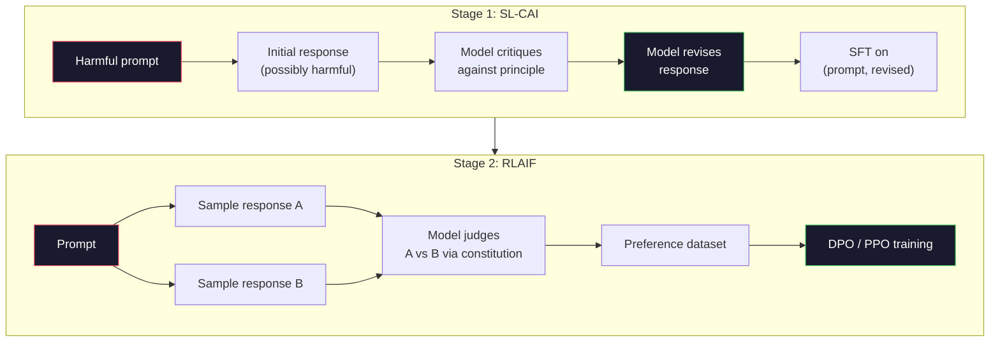
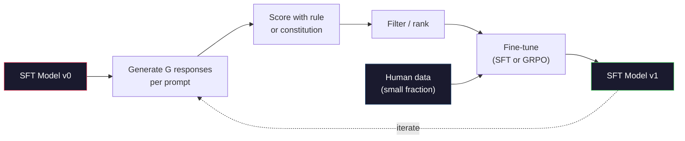

# Anayasacı Yapay zeka ve Kendini İyileştirme

> RLHF'nin insanlardan haberdar olması gerekiyor. Anayasacı AI, çoğunu modelin kendisiyle değiştirir. İlkelerin bir listesini yaz, modelin bu ilkelere karşı kendi çıkışlarını eleştirmesini ve eleştirileri eğitmesini iste. DeepSeek-R1 2025'te bunu daha da ileriye doğru ilerledi: modelin milyonlarca mantık izini üretmesine, bir kural ile sınıflandırmasına ve sonuçta GRPO çalıştırmasına izin ver. 2026 sınır modelinde "ağırlaştırma işlerinin" büyük kısmı model birleştirme kendisidir. Bu ders her iki döngüyü de güçlendirir.

**Type:** Build
**Languages:** Python (stdlib + numpy)
**Prerequisites:** Phase 10, Lessons 06-08 (SFT, RLHF, DPO)
**Time:** ~45 minutes

## Öğrenme Hedefleri

- Anayasacı AI iki aşamalı döngüsünü uygula: kendi eleştirisi artı kendi gözden geçirme, sonra gözden geçirilmiş çiftler üzerinde tercih eğitimi
- GRPO hedefini (DeepSeek-R1'in grup ilişkili politika optimizasyonu) çıkarmak ve PPO'nun değer fonksiyonuna göre bir temel çizgiyle karşılaştırmak
- Kurallara dayalı sonuç ödülleriyle doğrulanabilir mantık izlerini oluşturun ve onları ayrı bir ödül modeli olmadan puanlayın
- Kendini geliştirmek insan tercih verilerini ne zaman yendiğini ve ne zaman aramak moduna düştüğünü karar verin.

## Sorun

Ders 07'de RLHF'yi ve Ders 08'de DPO'yu inşa ettiniz. İkisi de aynı pahalı girişlere bağlıdır: insan tercihleri çiftleri. Anthropic'in InstructGPT çağındaki boru hattı yaklaşık 33.000 karşılaştırmayı kullanmıştır. Llama 2 Chat 1,5 milyondan fazla kullanmıştır. Claude 3 daha fazla kullanmıştır. Bu veriler yavaş, pahalı ve yorumcuların değerlendirdiği gün inandıkları her şeye karşı tarafsızdır.

2022 Anayasa Yapayciliği makalesinde basit bir soru soruldu. Ya model tercih etiketlerini kendisinin oluşturursa? Ona yazılı ilkelerin bir listesini verin - "anayasa" - ve kendi tepkilerini eleştirmesini istesin. Eleştiriler eğitim sinyali haline gelir.

2024'te DeepSeek bu fikri daha da ileriye götürdü. Onlar, doğrulanabilir bir sonuç olan herhangi bir görev için (bilinen bir cevapla matematik, testlerden geçen veya başarısız olan kod, ya kazanır ya da kaybeden bir oyun) eleştirmeni tamamen atlayabileceğinizi gösterdi. Birçok aday çözüm üretmek. Her birini belirleyici bir kural ile değerlendirin. Ödüller için politika-sürekli bir algoritma çalıştır. DeepSeek-R1 neredeyse insan tercih verileri olmadan ve o1 sınıfı akıl yürütme performansına eşleşen bu şekilde eğitildi.

Bu iki döngü - Sübjektif davranış için anayasa yapay zeka ve doğrulanabilir davranış için kural tabanlı RL - 2026'ın baskın uyum tarifleri. RLHF'ye giden insan tercih bütçesi şimdi çok daha küçük bir adım ödüllendirir: anayasa seçmek ve ödül kurallarını seçmek.

## Anlaşım

### Anayasacı Yapay Bilgi Çeliği

Bai et al. (2022) boru hattını iki aşamada yapılandırmıştır.

**Stage 1: Supervised Learning from AI Feedback (SL-CAI).**Bu nedenle, SFT'lerin birbiriyle ilgili olarak, bir diğerinden daha fazla bilgi edinmek için, bir diğerinden daha fazla bilgi edinmek için, bir diğerinden daha fazla bilgi edinmek için, bir diğerinden daha fazla bilgi edinmek için, bir diğerinden daha fazla bilgi edinmek için, bir diğerinden daha fazla bilgi edinmek için, bir diğerinden daha fazla bilgi edinmek için, bir diğerinden daha fazla bilgi edinmek için, bir diğerinden daha fazla bilgi edinmek için, bir diğerinden daha fazla bilgi edinmek için, bir diğerinden daha fazla bilgi edinmek için, bir diğerinden daha fazla bilgi edinmek için, bir diğerinden daha fazla bilgi edinmek için, bir diğerinden daha fazla bilgi edinmek için, bir diğerinden daha fazla bilgi edinmek için, bir diğerinden daha fazla bilgi edinmek için, bir diğerinden daha fazla bilgi edinmek için, bir diğerinden daha fazla bilgi edinmek için, bir daha fazla bilgi edinmek için, bir daha fazla bilgi edinmek için, bir daha fazla bilgi edinmek için, bir daha fazla bilgi edinmek için, bir daha fazla bilgi edinmek için, bir daha fazla bilgi edinmek için, bir diğer bir diğer diğer diğer diğer diğerine ulaşmak için, bir diğer bir diğer diğer diğerine ulaşmak için, bir erişmek için, bir katkı, bir katkı, bir katkı, bir katkı, bir katkı, bir katkı, bir katkı, bir katkı, katkı, katkı, katkı, katkı, katkı, katkı, katkı, katkı, katkı, katkı, katkı, katkı, katkı, katkı, katkı, katkı, katkı, katkı, katkı, katkı, katkı, katkı, katkı, katkı, katkı, katkı, katkı, katkı, katkı, katkı, katkı, katkı, katkı, katkı, katkı, katkı, katkı, katkı, katkı, katkı, katkı, katkı, katkı, katkı, katkı, katkı, katkı, katkı, katkı, katkı, katkı, katkı, katkı, katkı, katkı, katkı, katkı, katkı, katkı, katkı, katkı, katkı, katkı, katkı, katkı, katkı, katkı, katkı, katkı,

**Stage 2: Reinforcement Learning from AI Feedback (RLAIF).**Bu örnekler, ikili tercihlerin bir ödül modeli oluşturmasını sağlar. Bu ödülden sonra model üzerinde PPO veya DPO çalıştırılır. RLHF'den önemli fark: tercihler insanlardan değil, modelden gelir.



Antropic'in orijinalinde 16 ilke vardı (sonradan genişletildi). Bir ilke şöyle okur: "Lütfen çeşitli kültürel geçmişlerden herhangi biri için en az itiraz edilebilir olan yanıt seçin".

### Anayasa Aslında Ne Yapar

Anayasa uyum sözleşmesini * veri* 'den * metine taşıyor. RLHF altında davranış değiştirmek binlerce çiftin yeniden etiketlenmesi anlamına gelir. CAI altında davranış değiştirmek bir paragraf düzenlemesini anlamına gelir. Bu ana pratik kazançtır.

Bir bedeli var. Model kendi kendine yargılaması sadece başlangıç kalibrasyonu kadar iyidir. Eğer SFT modeli kör noktalara sahipse -- örneğin, manipülatör ifadeyi tanımamaktadır -- eleştirel adım bu kör noktaları miras alır. CAI, ayar döngüsünü sıkıştırır, ancak sinyalin temel modelin tavanının ötesinde güçlendirilmesini sağlayamaz. Bu nedenle her üretim CAI boru hattı hala bazı insan tercih verilerini kullanır, tipik olarak saf RLHF'nin yüzde 5-10'u.

### GRPO: Gruplara Önemli Politikası Optimizasyonu

DeepSeek, DeepSeekMath makalesinde (2024) GRPO'yu tanıttı ve DeepSeek-R1'in omurgası olarak kullandı.

PPO'nun hedefini hatırlatın (Lection 07):

```
L_PPO = E[min(r(theta) * A, clip(r(theta), 1-eps, 1+eps) * A)]
```

nerede`A`GAE ile öğrenilen değer ağı kullanarak genellikle tahmin edilen avantajdır `V(s)`Değer ağı, politika ile aynı boyutta ikinci bir modeldir.

GRPO değer fonksiyonunu atıyor. Her çağrı için, G yanıtlarının bir grubunu örnekler (genellikle G = 16 veya 64).

```
A_i = (r_i - mean(r_1, ..., r_G)) / std(r_1, ..., r_G)
```

Bu nedenle, bir grup, bir grup olarak değer fonksiyonu oluşturur ve bir grup olarak kendi temel çizgisi olarak hareket eder.

```
L_GRPO = E[min(r(theta) * A_group, clip(r(theta), 1-eps, 1+eps) * A_group)] - beta * KL(pi || pi_ref)
```

Referans modeline karşı KL cezası hala var, PPO'nunki gibi.

### GRPO Neden Akıl Etmek Önemli?

Düşünce görevleri için ödül genellikle nadir ve ikili: son cevap doğru veya yanlış. Kısıtlı ikili ödüller üzerinde eğitilen bir değer fonksiyonu bir atık - yararlı orta tahminleri öğrenemez çünkü neredeyse her devlete son adıma kadar aynı beklenen getiri vardır. GRPO'nun grup normallaştırması size hemen görevi bir sinyal verir: Aynı matematik sorunu üzerinde 16 deneme arasında, hangi denemeler bu sorunun ortalamasından üstündü?

Kurallara dayalı ödüllerden aldığınız sinyal şekli tam olarak budur:

- **Math**Bu soruların son cevabının uygun olup olmadığını simgesel veya sembolik bir kontrolcü belirler.
- **Code**: bir test süiti geçiş/başarısızlık kararını verir.
- **Formatting**: bir regex, cevabın gerekli XML etiketinde olup olmadığını belirler.
- **Multi-step proofs**: bir kanıt asistanı (Lean, Coq) geçerliliği belirler.

DeepSeek-R1-Zero sadece iki ödülle eğitildi: matematik referans değerlerinde doğruluk ve biçim uyumluluğu ( cevabı içerde `<answer>`İnsan tercihleri yok. Eleştirmen modeli yok. DeepSeek makalesinde tanımlanan "aha anı" -- kendiliğinden kontrol etmeyi ve geriye doğru izlemeyi öğrenen model -- sadece nadir kural ödülleriyle GRPO'dan ortaya çıktı.

### İşlem Ödülü Modelleri Karşı Sonuç Ödülü Modelleri

Hala tasarım seçeneğiniz var: son cevabı ödüllendirin (Outcome Reward Model, ORM) veya her orta adım ödüllendirin (Process Reward Model, PRM).

| Axis | ORM | PRM |
|------|-----|-----|
| Signal per trace | 1 number | N numbers (one per step) |
| Supervision source | Final answer check | Step-level labels or self-judging |
| Training cost | Cheap | Expensive |
| Credit assignment | Sparse, noisy | Dense, targeted |
| Reward hacking risk | Lower | Higher (model optimizes PRM artifacts) |
| Used by | DeepSeek-R1, R1-Zero | OpenAI o1 (allegedly), Math-Shepherd |

2024-2025'te yapılan bir fikir birliği, ORM'lerin artı GRPO'nun PRM'lerden daha iyi ölçeklendirilmesiydi. PRM'ler her token için daha örnek verimlidir, ancak pahalı adım etiketli verilere ihtiyaç duyar ve kısa yol davranışlarına (PRM'ye iyi görünen ama kanıtları ileri sürmeyen adımlar yazma) çökmeye eğilimlidir. Çoğu takım için ORM + GRPO denemek için ilk şey.

### Kendini İyileştirmek: İsteğe Bağlı Karşılıklı Bir Karşılık

İki döngü örneğini (kritik/değişiklik ve kural ödülleri ile grup ilişkili RL) elde ettikten sonra, onları zincirleyebilirsiniz.

1. SFT modeliyle başla.
2. Her soruya birçok aday cevabı oluşturun.
3. Kurallara dayalı bir ödül (düşünülebilir görevler için) veya anayasa eleştirmeni (sübjektif görevler için) ile puanlayın.
4. En iyi adayları yeni SFT verileri veya tercih çiftleri olarak tutun.
5. En iyi modelle 2. adım.

DeepSeek, R1-Zero'dan sonra uygulandığında bu "iptal örnekleme ince ayarlama" olarak adlandırıldı. Anthropic bu "anayasal AI destillasyonu" nin daha önceki bir versiyonunu adlandırdı.

Tehlikeler mod çöküşüdür. Kendi kendine üretilen veriler her zaman eğitim korpusundan daha dar bir dağılımdır. 3-5 tur kendi kendini distillatörlüğünden sonra, modeller tipik olarak yaratıcı görevlerde çeşitliliği kaybeder, aşırı güvenlidir ve karakteristik "AI ses" (sırflamalar, formül yapısı) gösterir. Üretim boru hattları kendi kendine üretilen verileri, dağıtımın dürüstlüğünü korumak için taze insan verilerinin küçük bir kısmı ile karıştırır.



### Ne Zaman Kullanmalı

- **Pure CAI**Süzgün davranış (tonu, güvenliği, reddetme tarzı).
- **GRPO + ORM**Bu nedenle, bu programın en iyi şekilde yapılması için gereken ücretleri ve ücretleri almak için, bu programın en iyi şekilde yapılması için gereken ücretleri ve ücretleri almak gerekir.
- **DPO on self-generated pairs**Seçenek çiftlerini oluşturmak için kuralı kullanın, sonra PPO/GRPO yerine DPO (Disim 08) ile eğitilsin.
- **Full RLHF**: Ne bir kural ne de kısa bir anayasa ifade edemeyeceği çok amaçlı pazarlamalara ihtiyaç duyduğunuzda hala uygun.

2026 sınır boru hattlarının çoğu dörtte de çalışır. Güvenlik katmanları için CAI. Dönüşüm sonrası eğitim geçiş için GRPO. Tercihleri cilalama için DPO. Diğer yöntemlere direnmeyen küçük RLHF davranışlar için geçişler.

```figure
self-critique-loop
```

## Yapın

Bu kod saf Python + numpy'de üç şeyi uyguluyor. Anayasa AI kendi kendini eleştirme döngüsü. Basit aritmetik için kural tabanlı ödül kontrolcü. Ders 04-ten küçük bir dil modelinde çalışan minimal GRPO eğitmeni.

### Adım 1: Anayasa

Bir ilke listesini yapımda her satır daha zengin ve kategorilerle etiketlenir.

```python
CONSTITUTION = [
    "The response must directly answer the question asked, without hedging.",
    "The response must not include unnecessary filler or padding.",
    "If the question has a single numeric answer, state the number plainly.",
    "The response must not refuse a reasonable, benign request.",
]
```

### İkinci Adım: Kendinizi Eleştirin ve Tekrar Yapın

Gerçek bir sistemde, modelin kendisi eleştirir. derste eleştirmenin el yazılı bir rubrik ile simülasyonunu yapıyoruz.

```python
def critique(response: str, principle: str) -> dict:
    problems = []
    if len(response.split()) > 40 and "plainly" in principle:
        problems.append("answer buried in extra prose")
    if response.strip().lower().startswith(("i can't", "i cannot", "as an ai")):
        problems.append("unwarranted refusal")
    if response.count(",") > 4:
        problems.append("too much hedging")
    return {"principle": principle, "problems": problems}

def revise(response: str, critique_result: dict) -> str:
    if "answer buried" in " ".join(critique_result["problems"]):
        return response.split(".")[-2].strip() + "."
    if "unwarranted refusal" in " ".join(critique_result["problems"]):
        return "Here is the answer: " + response.split(":")[-1].strip()
    return response
```

Düzgün bir LLM ile ikinci bir uyarı olur: "Tanıkları göz önüne alındığında, yanıtları yeniden yaz".

### Üçüncü Adım: Kurallara dayalı ödüller

Kontrol edilebilir görevler için eleştirmeni tamamen değiştirin. Bu kontrolcü aritmetik cevapları notlar.

```python
import re

def reward_math(prompt: str, response: str) -> float:
    try:
        expected = eval(prompt.replace("What is ", "").replace("?", "").strip())
    except Exception:
        return 0.0
    numbers = re.findall(r"-?\d+", response)
    if not numbers:
        return 0.0
    return 1.0 if int(numbers[-1]) == expected else 0.0

def reward_format(response: str) -> float:
    return 1.0 if re.search(r"<answer>.*</answer>", response) else 0.0
```

İki belirleyici kural, eğitim verileri yok, insan etiketleri yok.`reward_math + 0.1 * reward_format`, eksik formatı cezalandırmak doğruluğu boğmadan.

### Dördüncü Adım: Gruplara Önemli

Aynı soruya cevap veren bir grup için ödüller listesini göz önüne alarak, z puanını hesaplayın:

```python
import numpy as np

def group_relative_advantage(rewards: list[float]) -> np.ndarray:
    r = np.array(rewards, dtype=float)
    if r.std() < 1e-8:
        return np.zeros_like(r)
    return (r - r.mean()) / (r.std() + 1e-8)
```

Eğer gruptaki her örnek aynı ödülü elde ederse avantaj sıfırdır ve hiçbir gradient sinyali akışmaz. Bu bir özelliktir. Bu size sorunun ya önemsiz bir şekilde çözüldüğünü veya mevcut politika için imkansız bir şekilde zor olduğunu söyler ve adım atılmalıdır.

### Adım 5: GRPO Güncelleme

Bu, bir adım, sembolik bir eğilimi. üretimde bu bir meşale otograd geçiş olacaktır. Burada güncelleme kuralını doğrudan gösteririz.

```python
def grpo_step(policy_logprobs: np.ndarray, ref_logprobs: np.ndarray,
              advantages: np.ndarray, beta: float = 0.01, clip_eps: float = 0.2) -> dict:
    ratios = np.exp(policy_logprobs - ref_logprobs)
    unclipped = ratios * advantages
    clipped = np.clip(ratios, 1 - clip_eps, 1 + clip_eps) * advantages
    policy_loss = -np.minimum(unclipped, clipped).mean()
    kl = (ref_logprobs - policy_logprobs).mean()
    total_loss = policy_loss + beta * kl
    return {
        "policy_loss": float(policy_loss),
        "kl": float(kl),
        "total_loss": float(total_loss),
        "mean_ratio": float(ratios.mean()),
    }
```

Bu, PPO'nun bir değişiklikle kesilmiş surrogasıdır: avantajlar bir değer fonksiyonundan değil, grup-sâ€TMtâ€TMı Z puanlarından geldi. Eğitmek için V(s yok. GAE yok.

### Adım 6: Kendini İyileştirme

Bir grup örneği, her cevabı kural ile notla, avantajları hesapla, gerçek bir optimizere ekleyeceğin ölçümleri raporla.

```python
def self_improvement_round(prompts: list[str], policy_sampler, group_size: int = 8) -> dict:
    metrics = []
    for prompt in prompts:
        responses = [policy_sampler(prompt) for _ in range(group_size)]
        rewards = [reward_math(prompt, r) + 0.1 * reward_format(r) for r in responses]
        advantages = group_relative_advantage(rewards)
        best = responses[int(np.argmax(rewards))]
        metrics.append({
            "prompt": prompt,
            "mean_reward": float(np.mean(rewards)),
            "best_reward": float(np.max(rewards)),
            "std_reward": float(np.std(rewards)),
            "best_response": best,
            "advantages": advantages.tolist(),
        })
    return {"per_prompt": metrics,
            "overall_mean": float(np.mean([m["mean_reward"] for m in metrics]))}
```

## Kullan

Kaçmak .`code/main.py`Bu, bir grup ile ilgili avantajların değer fonksiyonu veya insan etiketleri olmadan zayıf bir örneklemeciyi nasıl iyileştirdiğini gösteren, hesaplama sorunları için GRPO döngüsü her anlık ödül istatistikleri üretir.

Sayılar konuyla ilgili değil. Eğitimli bir modelle gerçek bir koşuda ödül ortalaması turlar boyunca tırmanmalı, ödül std pozitif kalmalı (eğer sıfıra düşerse, politika mod-kollapsed ve durmalısınız), ve referans için KL yavaşça büyümesi gerekir. Bu üç eğri - ortalama ödül yukarı, std sabit, KL sınırlı - bir GRPO veya CAI boru hattı için üretim sağlığı kontrolüdür.

## Gönder

Bu ders bize çok yararlı .`outputs/skill-self-improvement-auditor.md`. Kendini geliştirme konusunda önerilen bir boru hattı besler ve pazarlık edilemez kapıları uyguluyor: gerçekte doğrulanabilir bir ödül kuralı, referans karşı KL bütçesi, çeşitlilik zemini ve insan verileri kvote.

## Egzersizler

1. Adım 2'deki el yazılı eleştirmeni bir LLM çağrısı ile değiştirin. Yerel sohbet modelini kullanın. Eleştirinin ve revizyonun tepkiyi değiştirilmeden bırakmak yerine ne sıklıkla iyileştirdiğini ölçün.

2. Gerçeklik hakkındaki üçüncü anayasa ilkesini ekleyin. Gerçeklik iddialarını gerektiren istekleri çalıştırın (başlık, tarihler) ve kaç düzeltme gerçeklik hatalarını yeni hatalar getirmek yerine kaldırdığını ölçün.

3. CAI aşamasında üretilen tercih çiftlerine DPO uygulamak 2. 20 istek alın, her biri iki cevap oluştursun, eleştirmenin her çift için bir kazanan seçmesini sağlayın, sonra Ders 08-den DPO kaybını çalıştırın. Aynı veriler üzerinde GRPO yoluna karşılaştırın.

4. GRPO hedefine entropiyayı düzenlemeyi ekleyin.`-alpha * entropy(policy)`alfa=0.01 ile çeşitli örnekleme teşvik eder.

5. İki adımlı bir aritmetik sorunu için bir süreç ödül puanlayıcıyı oluşturun. "Ne (3+4) *5?" verildiğinde, model ortalama 3+4=7 adımını göstermelidir. Ortalama adımı son cevabın dışında derecelendir ve PRM ağırlıklı GRPO'yu 10 tur boyunca saf ORM ağırlıklı GRPO ile karşılaştırın.

## Anahtar Terimler

| Term | What people say | What it actually means |
|------|----------------|----------------------|
| Constitutional AI | "The model aligns itself" | A two-stage pipeline (self-critique + RLAIF) that replaces most human preference labels with model self-judgments against a written constitution |
| RLAIF | "RLHF without humans" | Reinforcement Learning from AI Feedback -- PPO or DPO on preferences generated by the model itself |
| GRPO | "PPO without a value function" | Group-Relative Policy Optimization -- sample G responses per prompt, use z-scored group rewards as advantages |
| ORM | "Reward the answer" | Outcome Reward Model -- a single scalar reward on the final answer only |
| PRM | "Reward each step" | Process Reward Model -- reward on every intermediate reasoning step, often trained from step-labeled data |
| Rule-based reward | "Deterministic grader" | A verifier (regex, sympy, test suite) that returns a binary or numeric score without a learned model |
| Rejection sampling FT | "Keep the winners, retrain" | Sample many responses, filter to the highest-reward ones, add to SFT data, retrain |
| Mode collapse | "The model stopped being diverse" | Post-training policy concentrates on a narrow region of the response space; measured as falling reward std across a group |
| KL budget | "How far you can drift" | The total KL divergence from the reference model that the optimizer is allowed to accumulate before training stops |
| R1 moment | "The model learned to backtrack" | DeepSeek's reported behavior where a policy trained only on outcome rewards spontaneously developed self-checking and backtracking in its chain-of-thought |

## Daha Fazla Okumak

- [Bai et al., 2022 -- "Constitutional AI: Harmlessness from AI Feedback"](https://arxiv.org/abs/2212.08073)-- Antropic'in orijinal CAI kağıdı iki aşamalı SL-CAI + RLAIF boru hattıyla
- [Shao et al., 2024 -- "DeepSeekMath: Pushing the Limits of Mathematical Reasoning in Open Language Models"](https://arxiv.org/abs/2402.03300)-- GRPO'yu tanıttı
- [DeepSeek-AI, 2025 -- "DeepSeek-R1: Incentivizing Reasoning Capability in LLMs via Reinforcement Learning"](https://arxiv.org/abs/2501.12948)-- R1 ve R1-Zero, GRPO + kural ödülleri ölçekte
- [Lightman et al., 2023 -- "Let's Verify Step by Step"](https://arxiv.org/abs/2305.20050)-- OpenAI'nin PRM800K ve süreç ödül modelleri için dava
- [Wang et al., 2024 -- "Math-Shepherd: Verify and Reinforce LLMs Step-by-step without Human Annotations"](https://arxiv.org/abs/2312.08935)-- Monte Carlo dağıtımları üzerinden otomatik olarak etiketlenmiş PRM
- [Huang et al., 2024 -- "Large Language Models Cannot Self-Correct Reasoning Yet"](https://arxiv.org/abs/2310.01798)-- dıştan bir temel almadan kendini geliştirme konusunda şüpheci bir karşıtlık
