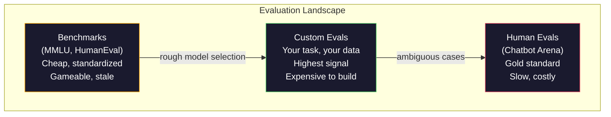
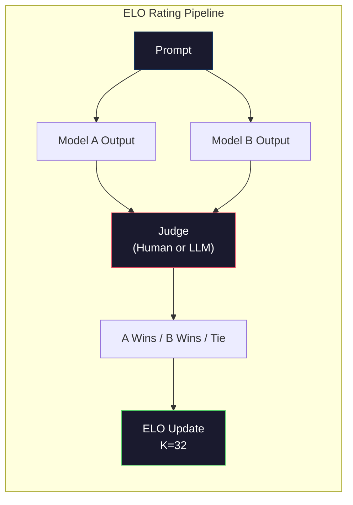

# Değerlendirme: Benchmarks, Evals, LM Harness

> Goodhart Kanunu: Bir ölçüm hedefe dönüştüğünde, iyi bir ölçüm olmaktan vazgeçirir. Her sınır laboratuvar oyunu referans değerleri. MMLU puanları yükselirken modeller hala "çilek"teki R sayısını güvenilir bir şekilde sayamazlar. Önemli olan tek değerlendirme, TAKKIN değerlendirme - TAKKIN, TAKKIN verileri ile.

**Type:** Build
**Languages:** Python
**Prerequisites:** Phase 10, Lessons 01-05 (LLMs from Scratch)
**Time:** ~90 minutes

## Öğrenme Hedefleri

- Çoklu seçim ve açık uç referansları ile dil modeline karşı çalışan özel bir değerlendirme harnesini oluşturun
- Standart referans değerlerinin (MMLU, HumanEval) neden doymuş ve sınır modelleri farklılaştıramadığını açıklayın
- Uygun ölçümlerle görev-özel değerlendirmeler uygula: tam eşleşme, F1, BLEU ve LLM-as-judge puanlaması
- Sadece kamu liderlik tablolarına güvenmek yerine özel kullanım durumunuza odaklanan özel bir değerlendirme kümesi tasarlayın

## Sorun

MMLU, 2020 yılında 57 konu üzerinde 15.908 soru ile yayınlandı. Üç yıl içinde, sınır modelleri onu doydu. GPT-4 86,4% puan aldı. Claude 3 Opus 86,8% puan aldı. Llama 3 405B 88,6% puan aldı.

Bu arada, aynı modeller 10 yaşındaki bir çocuğun düşünmeden yerine getirdiği görevlerde başarısız olurlar. Claude 3.5 Sonnet, MMLU'da %88,7 puan aldı. Başlangıçta "Strawberry" harflerini sayamıyordu. Bu bir görevdi. Dünyayı bilmemek ve akıl yürütmemek için sıfır bir şey gerektiriyordu. Sadece karakter düzeyinde tekrarlama. HumanEval 164 sorunla kod üretimi test ediyor. Modeller, %90'dan fazla puan alarak, hala herhangi bir genç geliştiricinin yakalayacağı uç durumlarda çöken kod üretmektedir.

Benchmark performansı ile gerçek dünya güvenilirliği arasındaki fark, LLM değerlendirme ile ilgili merkezi sorundur. Benchmarks size bir modelin benchmark üzerinde nasıl performans gösterdiğini söyler. Bu modelin belirli görevlerinizde, belirli verilerinizde, belirli başarısızlık modlarınızda nasıl performans göstereceği hakkında neredeyse hiçbir şey söylemezler. Müşteri desteği botunu oluşturursanız, MMLU önemsizdir. Eğer bir kod asistanı oluşturuyorsanız, HumanEval sadece fonksiyon düzeyinde jenerasyon kapsar -- dosyaların üzerinde hata düzeltme, yeniden faktörleme veya kod açıklama hakkında hiçbir şey söylemez.

Özel değerlendirmelere ihtiyacınız var. Benchmarks işe yaramaz olduğu için değil - kaba model seçimi için yararlıdırlar - ama nihai değerlendirme sizin yerleştirme koşullarınıza tam olarak uymalı olduğu için.

## Anlaşım

### Eval Manzarası

Her biri farklı maliyet ve sinyal kalitesi ile üç değerlendirme kategorisine ayrılmıştır.

**Benchmarks**Bu testler standartlaştırılmış test takımlarıdır. MMLU, HumanEval, SWE-bench, MATH, ARC, HellaSwag. Bir model ile referans değerine karşı çalıştırılır ve puan alırsınız. Avantaj: herkes aynı test kullanır, böylece modeller karşılaştırılabilir. Eksikliği: modeller ve eğitim verileri bu referans değerlerini giderek daha fazla kirletiyor. Laboratuvarlar referans soruları içeren veriler üzerinde eğitim alıyor. Notlar artıyor. Yeteneklilik olmayabilir.

**Custom evals**Bu test süitleri, belirli kullanım durumunuz için oluşturduğunuz test süitleri. Girişleri, beklenen çıkışları ve puanlama fonksiyonunu tanımlarsınız. Hukuki belge özetleyicisi yasal belgelere değerlendirilir. SQL jeneratörü veritabanı şeması üzerinde değerlendirilir. Bunlar oluşturmak pahalı ama üretim performansını tahmin eden tek değerlendirme onlardır.

**Human evals**Bu, bir diğer modelin değerlendirilmesi için kullanılacak bir araçtır. Bu araçlar, kullanılabilirlik, doğruluk, akıcılık ve güvenlik gibi kriterlere göre model sonuçlarını değerlendirmek için ücretli yorumcu kullanır.$0.10-$2.00'de) ve hız (saatler ve günler arasında).



### Neden Değerlendirme Kayıpları

Üç mekanizma, referans puanlarının gerçek kapasiteyi yansıtmayı bırakmasına neden olur.

**Data contamination.**Eğitim kurumları internet'i kavrar. Benchmark soruları internette canlı yayımlanır. Modeller cevapları eğitim sırasında görür. Bu geleneksel anlamda aldatma değil - laboratuvarlar kasıtlı olarak referans verilerini içermez. Ama web ölçekli kavrama neredeyse dışlanmayı imkansız hale getirir.

**Teaching to the test.**Laboratuvarlar, eğitim karışımlarını benchmark performans için optimize eder. Eğitim karışımının% 5'i MMLU tarzı çoklu seçim ise, model biçimi ve cevap dağılımını öğrenir. MMLU dört yönlü çoklu seçimdir.

**Saturation.**Her sınır modeli bir referans değerinde 85-90% puan aldığında, referans ayrımcılığı durdurur. Geri kalan soruların 10-15%'i belirsiz, yanlış etiketlendirilmiş veya belirsiz alan bilgisi gerektirebilir. MMLU'da %87'den %89'a yükselmesi, modelin iki belirsiz soru daha akılda tutması anlamına gelebilir, daha akıllı hale gelmediği anlamına gelebilir.

### Kafası karışık: Hızlı Bir Sağlık Kontrolü

Kafasızlık, bir modelin bir token dizisi tarafından ne kadar şaşırtıldığını ölçer.

```
PPL = exp(-1/N * sum(log P(token_i | context)))
```

10'un karmaşıklığı, modelin her token pozisyonunda 10 seçenek arasında eşit seçimi kadar belirsiz olduğu anlamına gelir. Daha düşük daha iyidir. GPT-2 WikiText-103'de ~30'un karmaşıklığını alır. GPT-3 ~20'e ulaşır. Llama 3 8B ~7'e ulaşır.

Bir model, nadir ama önemli desenlerde kötüyken ortak desenleri tahmin ederek düşük karmaşıklığa sahip olabilir. Ayrıca talimatları takip etmek, akıl yürütmek veya gerçek doğruluğu hakkında hiçbir şey söylemez. Bunu bir akıl kontrolü olarak kullanın, son bir hüküm değil.

### Yargıç olarak LLM

Güçlü bir model kullanın ve daha zayıf bir modelin çıkışını değerlendirin. Fikir basit: GPT-4o veya Claude Sonnet'e sorun. Doğru, yararlı ve güvenli bir cevap için 1-5 ölçeğinde bir cevap değerlendirsin. Bu, GPT-4o-mini ile bir yargı için yaklaşık 0.01 dolarlık bir değerlendirme ve insan yargılarıyla şaşırtıcı derecede iyi ilişkilidir.

Notlama sorunu, modelden daha önemlidir. Bilinmeyen bir sorunun ("Bu cevabı oranla") gürültülü skorlar üretir. Bir rubrika ile yapılandırılmış bir sorunun ("Ciddi bir cevap varsa 5 puan ve bir kaynağı belirtir, doğruysa 4 ama kaynaklanmamışsa, kısmen doğruysa 3 puan...") tutarlı, tekrarlanabilir puanlar üretir.

Başarısızlık modları: yargıç modelleri pozisyon tersi gösterir (bir çiftlik karşılaştırmalarda ilk tepkiyi tercih eder), sözcük tersi (uzun cevapları tercih eder) ve kendi tercihlerini (GPT-4 oranları GPT-4 çıkışları eşdeğer Claude çıkışlarından daha yüksektir).

### Çiftlik Karşılaştırmalar'dan ELO Notları

Chatbot Arena'nın yaklaşımı. Farklı modellerden aynı soruya iki yanıt göster. Bir insan (veya LLM yargıçı) daha iyi birini seçer. Bu binlerce karşılaştırmalardan, her model için ELO derecesini hesaplayın. Satrançta kullanılan aynı sistem.

ELO avantajları: nispet sıralama mutlak puanlamalardan daha güvenilirdir, bağları zarif bir şekilde ele alır ve her çıkışı bağımsız olarak puanlamanın daha az karşılaştırması ile birleşti. 2026'ın başından itibaren, Chatbot Arena sıralamaları GPT-4o, Claude 3.5 Sonnet ve Gemini 1.5 Pro'yu birbirinden 20 ELO puan içinde en üstte göstermektedir.



### Eval Çerçeve

**lm-evaluation-harness**(EleutherAI): standart açık kaynak değerlendirme çerçevesidir. 200+ referans değerini destekler. Open LLM Leaderboard tarafından kullanılan bir komutla MMLU, HellaSwag, ARC vb. karşı herhangi bir Hugging Face modelini çalıştırın.

**RAGAS**RAG boru hattları için özel olarak değerlendirme çerçevesidir. Dürüstlüğü ( cevabın alınan bağlamla uyumlu mu?), bağlamlılığı ( alınan bağlam soruya alakalı mı?), ve cevap doğruluğunu ölçer.

**promptfoo**YAML'de test vakalarını tanımlayın, birden fazla modelle çalıştırın, bir geçiş/başarısızlık raporu alın. Geri dönüş test istekleri için yararlı - bir istekli değişiklik mevcut test vakalarını kırmaması için emin olun.

### Özel Evaller Yapmak

Üretim için önemli olan tek değerlendirme.

1. **Define the task.**"Soruları cevaplamak" çok belirsiz. "Bir müşteri şikayet e-postası verildiğinde, ürün adını, sorun kategorisini ve duygularını çıkarmak" değerlendirebileceğiniz bir görevdir.

2. **Create test cases.**Bir prototip eval için en az 50 , üretim için 200+. Her test vakaı bir (girin, beklenen_ürün) çifttir. Kenar vakaları dahil edin: boş girişler, karşıt girişler, belirsiz girişler, diğer dillerde girişler.

3. **Define scoring.**Yapılandırılmış çıkışlar için tam eşleşme. BLEU/ROUGE metin benzerliği için. LLM-as-judge açık kaliteli için. F1 çıkarma görevleri için.

4. **Automate.**Her değerlendirme tek bir komutla çalışır. El adımları yoktur. Sonuçları zamanla karşılaştırmayı mümkün kılan bir formatta saklayın.

5. **Track over time.**Bir değerlendirme puanı, tek başına anlamsızdır. Trend çizgisine ihtiyacınız var. Son çağrı değişiminden sonra puan iyileşti mi? Modeller değiştirildikten sonra geri mi düştü?

| Eval Type | Cost per judgment | Agreement with humans | Best for |
|-----------|------------------|----------------------|----------|
| Exact match | ~$0 | 100% (when applicable) | Structured output, classification |
| BLEU/ROUGE | ~$0 | ~60% | Translation, summarization |
| LLM-as-judge | ~$0.01 | ~80% | Open-ended generation |
| Human eval | $0.10-$2.00 | N/A (is the ground truth) | Ambiguous, high-stakes tasks |

```figure
perplexity-loss
```

## Yapın

### Adım 1: En az eşitlik çerçevesini oluşturmak

Temel soyutlamaları tanımlayın. Bir eval vaka bir giriş, beklenen bir çıkış ve bir seçeneği metadata dikt içerir. Bir skorlayıcı bir tahmin ve bir referans alır ve 0 ile 1 arasındaki bir puanı gönderir.

```python
import json
from collections import Counter

class EvalCase:
    def __init__(self, input_text, expected, metadata=None):
        self.input_text = input_text
        self.expected = expected
        self.metadata = metadata or {}

class EvalSuite:
    def __init__(self, name, cases, scorers):
        self.name = name
        self.cases = cases
        self.scorers = scorers

    def run(self, model_fn):
        results = []
        for case in self.cases:
            prediction = model_fn(case.input_text)
            scores = {}
            for scorer_name, scorer_fn in self.scorers.items():
                scores[scorer_name] = scorer_fn(prediction, case.expected)
            results.append({
                "input": case.input_text,
                "expected": case.expected,
                "prediction": prediction,
                "scores": scores,
            })
        return results
```

### Adım 2: İşlevleri değerlendirme

Tam eşleşme, F1 simülasyonu ve bir hakim olarak LLM puancı oluşturun.

```python
def exact_match(prediction, expected):
    return 1.0 if prediction.strip().lower() == expected.strip().lower() else 0.0

def token_f1(prediction, expected):
    pred_tokens = set(prediction.lower().split())
    exp_tokens = set(expected.lower().split())
    if not pred_tokens or not exp_tokens:
        return 0.0
    common = pred_tokens & exp_tokens
    precision = len(common) / len(pred_tokens)
    recall = len(common) / len(exp_tokens)
    if precision + recall == 0:
        return 0.0
    return 2 * (precision * recall) / (precision + recall)

def llm_judge_simulated(prediction, expected):
    pred_words = set(prediction.lower().split())
    exp_words = set(expected.lower().split())
    if not exp_words:
        return 0.0
    overlap = len(pred_words & exp_words) / len(exp_words)
    length_penalty = min(1.0, len(prediction) / max(len(expected), 1))
    return round(overlap * 0.7 + length_penalty * 0.3, 3)
```

### Adım 3: ELO derecelendirme sistemi

ELO güncellemeleri ile çiftli karşılaştırmalar uygulayın. Bu tam olarak Chatbot Arena'nın modelleri sıralamak için kullandığı sistemdir.

```python
class ELOTracker:
    def __init__(self, k=32, initial_rating=1500):
        self.ratings = {}
        self.k = k
        self.initial_rating = initial_rating
        self.history = []

    def _ensure_player(self, name):
        if name not in self.ratings:
            self.ratings[name] = self.initial_rating

    def expected_score(self, rating_a, rating_b):
        return 1 / (1 + 10 ** ((rating_b - rating_a) / 400))

    def record_match(self, player_a, player_b, outcome):
        self._ensure_player(player_a)
        self._ensure_player(player_b)

        ea = self.expected_score(self.ratings[player_a], self.ratings[player_b])
        eb = 1 - ea

        if outcome == "a":
            sa, sb = 1.0, 0.0
        elif outcome == "b":
            sa, sb = 0.0, 1.0
        else:
            sa, sb = 0.5, 0.5

        self.ratings[player_a] += self.k * (sa - ea)
        self.ratings[player_b] += self.k * (sb - eb)

        self.history.append({
            "a": player_a, "b": player_b,
            "outcome": outcome,
            "rating_a": round(self.ratings[player_a], 1),
            "rating_b": round(self.ratings[player_b], 1),
        })

    def leaderboard(self):
        return sorted(self.ratings.items(), key=lambda x: -x[1])
```

### Dördüncü Adım: Kafası karışıklık hesaplama

Bu, bir olasılık dağılımıyla simüle ediliyor.

```python
import numpy as np

def perplexity(log_probs):
    if not log_probs:
        return float("inf")
    avg_neg_log_prob = -np.mean(log_probs)
    return float(np.exp(avg_neg_log_prob))

def token_log_probs_simulated(text, model_quality=0.8):
    np.random.seed(hash(text) % 2**31)
    tokens = text.split()
    log_probs = []
    for i, token in enumerate(tokens):
        base_prob = model_quality
        if len(token) > 8:
            base_prob *= 0.6
        if i == 0:
            base_prob *= 0.7
        prob = np.clip(base_prob + np.random.normal(0, 0.1), 0.01, 0.99)
        log_probs.append(float(np.log(prob)))
    return log_probs
```

### Adım 5: Toplam Sonuçlar

Bir değerlendirme çalışması boyunca özetleme istatistiklerini hesaplayın: ortalama, ortalama, bir eşiğinde geçiş oranı ve per-metrik ayrıntılar.

```python
def summarize_results(results, threshold=0.8):
    all_scores = {}
    for r in results:
        for metric, score in r["scores"].items():
            all_scores.setdefault(metric, []).append(score)

    summary = {}
    for metric, scores in all_scores.items():
        arr = np.array(scores)
        summary[metric] = {
            "mean": round(float(np.mean(arr)), 3),
            "median": round(float(np.median(arr)), 3),
            "std": round(float(np.std(arr)), 3),
            "min": round(float(np.min(arr)), 3),
            "max": round(float(np.max(arr)), 3),
            "pass_rate": round(float(np.mean(arr >= threshold)), 3),
            "n": len(scores),
        }
    return summary

def print_summary(summary, suite_name="Eval"):
    print(f"\n{'=' * 60}")
    print(f"  {suite_name} Summary")
    print(f"{'=' * 60}")
    for metric, stats in summary.items():
        print(f"\n  {metric}:")
        print(f"    Mean:      {stats['mean']:.3f}")
        print(f"    Median:    {stats['median']:.3f}")
        print(f"    Std:       {stats['std']:.3f}")
        print(f"    Range:     [{stats['min']:.3f}, {stats['max']:.3f}]")
        print(f"    Pass rate: {stats['pass_rate']:.1%} (threshold >= 0.8)")
        print(f"    N:         {stats['n']}")
```

### Adım 6: Tam boru hattını çalıştır

Bir görevi tanımlayın, test vakaları oluşturun, iki model simüle edin, değerlendirme çalıştırın, çiftliksel karşılaştırmalar üzerinden ELO hesaplayın ve sıralama tablosunu yazdırın.

```python
def demo_model_good(prompt):
    responses = {
        "What is the capital of France?": "Paris",
        "What is 2 + 2?": "4",
        "Who wrote Hamlet?": "William Shakespeare",
        "What language is PyTorch written in?": "Python and C++",
        "What is the boiling point of water?": "100 degrees Celsius",
    }
    return responses.get(prompt, "I don't know")

def demo_model_bad(prompt):
    responses = {
        "What is the capital of France?": "Paris is the capital city of France",
        "What is 2 + 2?": "The answer is four",
        "Who wrote Hamlet?": "Shakespeare",
        "What language is PyTorch written in?": "Python",
        "What is the boiling point of water?": "212 Fahrenheit",
    }
    return responses.get(prompt, "Unknown")

cases = [
    EvalCase("What is the capital of France?", "Paris"),
    EvalCase("What is 2 + 2?", "4"),
    EvalCase("Who wrote Hamlet?", "William Shakespeare"),
    EvalCase("What language is PyTorch written in?", "Python and C++"),
    EvalCase("What is the boiling point of water?", "100 degrees Celsius"),
]

suite = EvalSuite(
    name="General Knowledge",
    cases=cases,
    scorers={
        "exact_match": exact_match,
        "token_f1": token_f1,
        "llm_judge": llm_judge_simulated,
    },
)

results_good = suite.run(demo_model_good)
results_bad = suite.run(demo_model_bad)

print_summary(summarize_results(results_good), "Model A (concise)")
print_summary(summarize_results(results_bad), "Model B (verbose)")
```

"İyi" modeli tam cevaplar verir. "Kötü" modeli sözlü parafrases verir. Tam eşleşme sözlü modeli şiddetle cezalandırır. F1 simgesi ve yargıç olarak LLM daha bağışlayıcıdır. Bu, ölçüm seçiminin neden önemli olduğunu gösterir: aynı model, nasıl puan aldığımıza bağlı olarak harika veya korkunç görünüyor.

### Adım 7: ELO Turnuvası

Çoklu turlar boyunca modeller arasında çiftlik karşılaştırmalar yapın.

```python
elo = ELOTracker(k=32)

for case in cases:
    pred_a = demo_model_good(case.input_text)
    pred_b = demo_model_bad(case.input_text)

    score_a = token_f1(pred_a, case.expected)
    score_b = token_f1(pred_b, case.expected)

    if score_a > score_b:
        outcome = "a"
    elif score_b > score_a:
        outcome = "b"
    else:
        outcome = "tie"

    elo.record_match("model_a_concise", "model_b_verbose", outcome)

print("\nELO Leaderboard:")
for name, rating in elo.leaderboard():
    print(f"  {name}: {rating:.0f}")
```

### Adım 8: Kafası karışıklık

Farklı kalite seviyelerindeki "modeller" arasında karmaşıklığı karşılaştırın.

```python
test_text = "The quick brown fox jumps over the lazy dog in the garden"

for quality, label in [(0.9, "Strong model"), (0.7, "Medium model"), (0.4, "Weak model")]:
    log_probs = token_log_probs_simulated(test_text, model_quality=quality)
    ppl = perplexity(log_probs)
    print(f"  {label} (quality={quality}): perplexity = {ppl:.2f}")
```

## Kullan

### değerlendirme aletleri (EleutherAI)

Herhangi bir modelde referans değerlerini çalıştırmak için standart araç.

```python
# pip install lm-eval
# Command line:
# lm_eval --model hf --model_args pretrained=meta-llama/Llama-3.1-8B --tasks mmlu --batch_size 8

# Python API:
# import lm_eval
# results = lm_eval.simple_evaluate(
#     model="hf",
#     model_args="pretrained=meta-llama/Llama-3.1-8B",
#     tasks=["mmlu", "hellaswag", "arc_easy"],
#     batch_size=8,
# )
# print(results["results"])
```

### promptfoo

Hızlı mühendislik için yapılandırma yönlendirilen değerlendirme. YAML'de testleri tanımlayın ve birden fazla sağlayıcıya karşı çalıştırın.

```yaml
# promptfoo.yaml
providers:
  - openai:gpt-4o-mini
  - anthropic:claude-3-haiku

prompts:
  - "Answer in one word: {{question}}"

tests:
  - vars:
      question: "What is the capital of France?"
    assert:
      - type: contains
        value: "Paris"
  - vars:
      question: "What is 2 + 2?"
    assert:
      - type: equals
        value: "4"
```

### RAG değerlendirmesi için RAGAS

```python
# pip install ragas
# from ragas import evaluate
# from ragas.metrics import faithfulness, answer_relevancy, context_precision
#
# result = evaluate(
#     dataset,
#     metrics=[faithfulness, answer_relevancy, context_precision],
# )
# print(result)
```

RAGAS, genel değerlendirmelerin neyi eksik ettiğini ölçer: modelin cevabının alınan bağlamda yer aldığı, sadece cevabın soyut olarak "sağ" olup olmadığını değil.

## Gönder

Bu ders bize çok yararlı .`outputs/prompt-eval-designer.md`-- herhangi bir görev için özel değerlendirme süitlerini tasarlayan tekrar kullanılabilir bir istek. Ona bir görev açıklaması verin ve test vakaları, puanlama işlevleri ve geçme/başarısızlık eşiği önerisi üretir.

Ayrıca üretir `outputs/skill-llm-evaluation.md`-- görev türüne, bütçenize ve gecikme gereksinimlerine göre doğru değerlendirme stratejisini seçmek için bir karar çerçevesini.

## Egzersizler

1. Aynı girişleri model boyunca 5 kez çalıştıran ve çıkışların ne sıklıkla eşleştiğini ölçen bir " tutarlılık " puanlayıcıyı ekleyin. Deterministik girişler üzerinde tutarlı olmayan cevaplar kırılgan istekleri veya yüksek sıcaklık ayarlarını ortaya çıkarır.

2. ELO izleyicisini birden fazla yargıç fonksiyonunu desteklemek için genişletin (exact match, F1, LLM-as-judge) ve ağırlıklandırın.

3. Özel bir görev için bir eval suite oluşturun: e-posta sınıflandırması 5 kategoride. Kısayol vakaları (birden fazla kategorilere ait olabilecek e-postalar, boş e-postalar, diğer dillerde e-postalar) dahil olmak üzere çeşitli örneklerle 100 test vakaları oluşturun. Farklı "modellerin" (kurallara dayalı, anahtar kelime eşleşimi, simüle edilen LLM) performansını ölçün.

4. Kirlilik tespitini uygulayın: bir dizi değerlendirme sorusu ve bir eğitim korpusuna göre, eğitim verilerinde değerlendirme sorularının (veya yakın parafrases) ne kadar yüzdesi bulunduğunu kontrol edin.

5. "Model Diff" aracı oluşturun. İki model sürümünden değerlendirme sonuçlarını göz önüne alarak, hangi özel test durumlarının iyileştiğini, hangilarının geri döndüğünü ve hangilarının aynı kalıpta kaldığını belirleyin. Bu, bir değişimin yarattığını veya zarar verdiğini anlamak için gerekli olan bir kod farklılığı değerlendirme eşdeğeri.

## Anahtar Terimler

| Term | What people say | What it actually means |
|------|----------------|----------------------|
| MMLU | "The benchmark" | Massive Multitask Language Understanding -- 15,908 multiple choice questions across 57 subjects, saturated above 88% by 2025 |
| HumanEval | "Code eval" | 164 Python function-completion problems from OpenAI, tests only isolated function generation |
| SWE-bench | "Real coding eval" | 2,294 GitHub issues from 12 Python repos, measures end-to-end bug fixing including test generation |
| Perplexity | "How confused the model is" | exp(-avg(log P(token_i given context))) -- lower means the model assigns higher probability to the actual tokens |
| ELO rating | "Chess ranking for models" | A relative skill rating computed from pairwise win/loss records, used by Chatbot Arena to rank 100+ models |
| LLM-as-judge | "Using AI to grade AI" | A strong model scores a weaker model's outputs against a rubric, ~80% agreement with human judges at ~$0.01/judgment |
| Data contamination | "The model saw the test" | Training data includes benchmark questions, inflating scores without improving real capability |
| Eval suite | "A bunch of tests" | A versioned collection of (input, expected_output, scorer) triples that measure a specific capability |
| Pass rate | "What percentage it gets right" | Fraction of eval cases scoring above a threshold -- more actionable than mean score because it measures reliability |
| Chatbot Arena | "Model ranking website" | LMSYS platform with 2M+ human preference votes, producing the most trusted LLM leaderboard via ELO ratings |

## Daha Fazla Okumak

- [Hendrycks et al., 2021 -- "Measuring Massive Multitask Language Understanding"](https://arxiv.org/abs/2009.03300)-- MMLU makalesi, still the most cited LLM benchmark despite its saturation
- [Chen et al., 2021 -- "Evaluating Large Language Models Trained on Code"](https://arxiv.org/abs/2107.03374)-- OpenAI'den HumanEval makalesi, kurulan kod üretimi değerlendirme metodolojisi
- [Zheng et al., 2023 -- "Judging LLM-as-a-Judge"](https://arxiv.org/abs/2306.05685)-- pozisyon ve sözcüksellik önyargısı bulguları dahil olmak üzere LLM'leri değerlendirmek için LLM'lerin kullanılması sistematik analiz
- [LMSYS Chatbot Arena](https://chat.lmsys.org/)-- 2M+ oyları olan, gerçek dünyadaki en güvenilir LLM sıralaması
