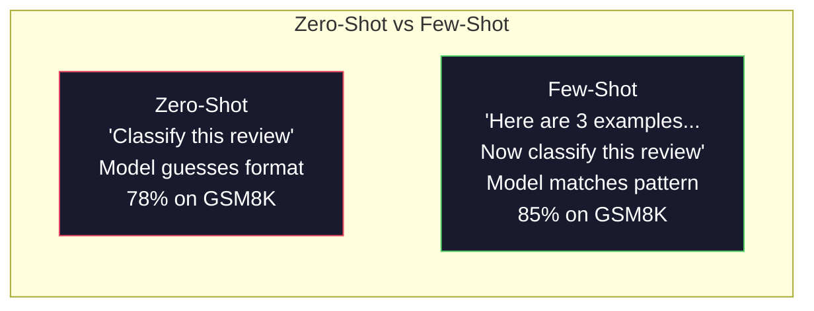
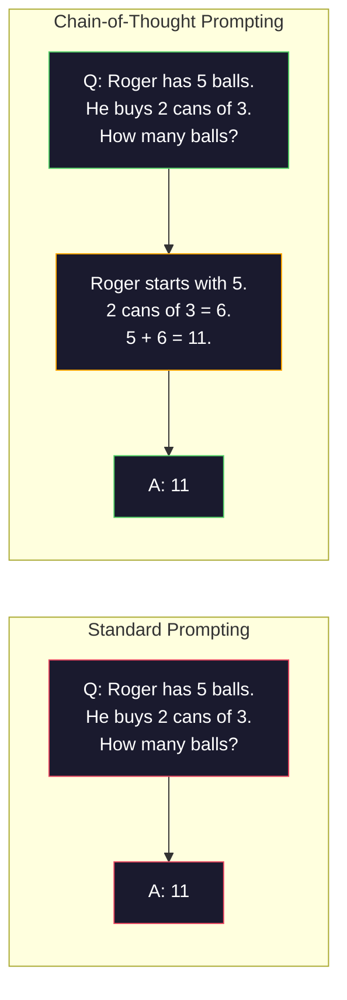
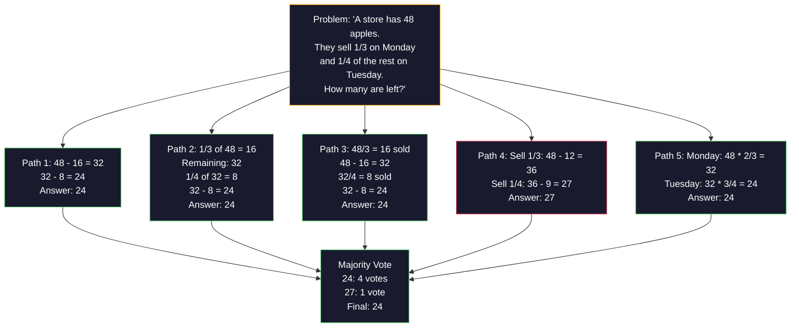
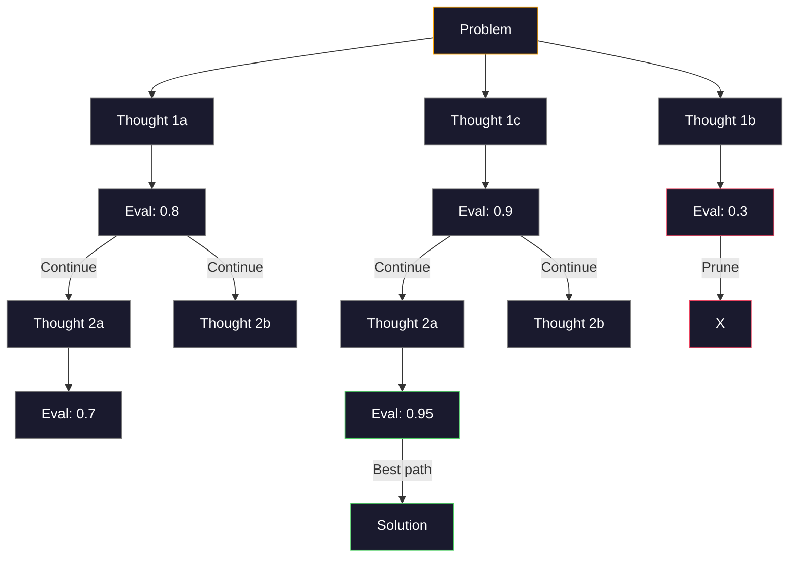

# Az Atış, Düşünce Zinciri, Düşünce Ağacı

> Bir modelin ne yapması gerektiğini söylemek, ona nasıl düşünmesi gerektiğini göstermek mühendisliktir. Aynı model, aynı görev, aynı veriler üzerinde %78 ile %91 arasında bir fark daha iyi bir model değildir. Daha iyi bir akıl yürütme stratejisi.

**Type:** Build
**Languages:** Python
**Prerequisites:** Lesson 11.01 (Prompt Engineering)
**Time:** ~45 minutes

## Öğrenme Hedefleri

- Görev doğruluğunu en üst düzeye çıkaran örnek gösterileri seçerek ve biçimlendirip birkaç çekimli isteklendirmeyi uygulayın
- Matematik kelime sorunları gibi çok adımlı problemlerde doğruluk geliştirmek için düşünce zinciri (CoT) mantıklamasını uygulayın
- Bir sürü düşünce yolu keşfeden ve en iyi olanı seçen bir düşünce ağacı sorgu yapın
- Standart bir referans değerinde sıfır atış vs. birkaç atış vs. CoT'den doğruluk gelişmesini ölçmek

## Sorun

Matematik dersleri uygulaması oluşturursanız, sorgulamanız "Bu kelime sorunu çöz". GPT-5 standard bir lisensel matematik standartı olan GSM8K'de %94 doğru olur.

Beş kelime ekleyin -- "Hatırla adım adım" -- ve doğruluk 91%'e kadar yükselmiş. Birkaç çalıştırılmış örnek ekleyin ve bu yüzde 95'e ulaşır. Aynı model. Aynı sıcaklık. Aynı API maliyeti. Tek fark, modelin çizim kağıdı verildiği.

Bu bir hack değil. Düşünce işleminin işlevi budur. İnsanlar bir zihinsel sıçrayışta çok adımlı sorunları çözmezler. Transformatörler de. Bir modelin aralama jetonları üretmesine zorladığınızda, bu jetonlar bir sonraki jeton bağlamının bir parçası olur. Her bir düşünce adımını bir sonrakiye besler. Model kelimenin tam anlamıyla cevap için yollarını hesaplar.

Ama "adım adım düşün" son değil başlangıç. Beş mantık yolu örneğini alıp çoğunlukla oy alırsanız ne olur? modelin olasılık ağacını keşfetmesine, dalları değerlendirmesine ve kesmesine izin verirsen ne olur? mantıkla araç kullanımı arasında karıştırılırsanız ne olur? Bunlar hipotetik değil. Bunlar ölçülü gelişmelerle yayınlanan teknikler ve hepsini bu derste inşa edeceksiniz.

## Anlaşım

### Zero-Shot vs. Few-Shot: Örnekler talimatları yendiğinde

Zero-shot prompting, modelin bir görevi verir ve başka bir şey vermez.

Wei et al. (2022) bunu 8 referans değerinde ölçtü. Duygu sınıflandırması gibi basit görevler için, sıfır atış ve az atış birbirinden% 2'lik bir oranda gerçekleştirildi. Çok adımlı aritmetik ve sembolik akıl yürütme gibi karmaşık görevler için, az atış doğruluğu % 10-25% arttı.

İntüyüsyon: örnekler sıkıştırılmış talimatlardır. Çıktı biçimi tanımlamak yerine gösterirsin. Düşünme sürecini açıklamak yerine gösterirsin. Model örneği soyut talimatları yorumlamaktan daha güvenilir bir şekilde örneklere eşleşir.



**When few-shot wins:**biçim hassas görevler, sınıflandırma, yapılandırılmış çıkarma, alan-özel jargon, modelin belirli bir kalıpla uyumlu olması gereken herhangi bir görev.

**When zero-shot wins:**Basit gerçek sorular, örneklerin yaratıcılığı kısıtladığı yaratıcı görevler, iyi örneklerin bulunması iyi talimatlardan daha zor olduğu görevler.

### Örnek Seçimi: Benzer Rastlar

Tüm örnekler eşit değildir. Hedef girişine benzer örnekleri seçmek sınıflandırma görevlerinde rastgele seçimi 5-15% oranında üst düzeyine çıkarır (Liu et al., 2022).

1. **Semantic similarity**: yerleştirme alanında girişlere en yakın örnekleri seçin
2. **Label diversity**: örneklerindeki tüm çıkış kategorilerini kapsar
3. **Difficulty matching**: hedef sorununun karmaşıklık seviyesine uygun

Çoğu görev için en uygun örnek sayısı 3-5'dir. 3'ün altında, modelin örneği çıkarmak için yeterli sinyal olmadığı görülür. 5'in üzerinde, azalmakta olan geri dönüşleri ve atık bağlam penceresi belirtilerini vurursunuz.

### Düşünce zinciri: Modeller Vermek

Google Brain'de Wei et al. (2022) tarafından düşünce zinciri (CoT) teşvik edilmesi başlatıldı.



Bu işlem neden mekanik olarak çalışır? Bir transformatör tarafından üretilen her token, bir sonraki token için bağlam haline gelir. CoT olmadan, model tüm mantıklıyı tek ileri geçişin gizli durumuna sıkıştırmalıdır. CoT ile, model ortalama hesaplamaları jetonlar olarak dışa çıkarır. Her mantıklandırma jetonu etkili hesaplama derinliğini genişletiyor.

**GSM8K benchmarks (grade-school math, 8.5K problems):**

| Model | Zero-Shot | Zero-Shot CoT | Few-Shot CoT |
|-------|-----------|---------------|--------------|
| GPT-4o | 78% | 91% | 95% |
| GPT-5 | 94% | 97% | 98% |
| o4-mini (reasoning) | 97% | — | — |
| Claude Opus 4.7 | 93% | 97% | 98% |
| Gemini 3 Pro | 92% | 96% | 98% |
| Llama 4 70B | 80% | 89% | 94% |
| DeepSeek-V3.1 | 89% | 94% | 96% |

**Note on reasoning models.**OpenAI'nin o-seri (o3, o4-mini) ve DeepSeek-R1 gibi modeller cevaplarını yayınlamadan önce içsel olarak düşünce zinciri çalıştırırlar.

İki tatlı CoT:

**Zero-shot CoT**Kojima et al. (2022) bu tek cümleyi aritmetik, akıl sağlığı ve sembolik mantıklama görevlerinde doğruluğu arttırdığını gösterdi.

**Few-shot CoT**Bu, modelin beklediğiniz tam olarak mantık biçimini gördüğü için sıfır çekim CoT'den daha etkili.

**When CoT hurts**Bu nedenle, bir iş için bir başvuru olarak, bir başvuru olarak, bir başvuru olarak, bir başvuru olarak, bir başvuru olarak, bir başvuru olarak, bir başvuru olarak, bir başvuru olarak, bir başvuru olarak, bir başvuru olarak, bir başvuru olarak, bir başvuru olarak, bir başvuru olarak, bir başvuru olarak, bir başvuru olarak, bir başvuru olarak, bir başvuru olarak, bir başvuru olarak, bir başvuru olarak, bir başvuru olarak, bir başvuru olarak, bir başvuru olarak, bir başvuru olarak, bir başvuru olarak, bir başvuru olarak, bir başvuru olarak, bir başvuru olarak, bir başvuru olarak, bir başvuru olarak, bir başvuru olarak, bir başvuru olarak, bir başvuru olarak, bir başvuru olarak, bir başvuru olarak, bir başvuru olarak, bir başvuru olarak, bir başvuru olarak, bir başvuru olarak, bir başvuru olarak, bir başvuru olarak, bir başvuru olarak, bir başvuru olarak, bir başvuru olarak, bir başvuru olarak, bir başvuru olarak, bir başvuru olarak, bir başvuru olarak, bir başvuru olarak, bir başvuru olarak, bir başvuru olarak, bir başvuru olarak, bir başvuru olarak, bir başvuru olarak, bir başvuru olarak, bir başvuru olarak, başvuru olarak, başvuru olarak, başvuru olarak, başvuru olarak, başvuru olarak, başvuru olarak, başvuru olarak, başvuru olarak, başvuru olarak, başvuru olarak, başvuru olarak, başvuru olarak, başvuru olarak, başvuru olarak, başvuru olarak, başvuru olarak, başvuru olarak, başvuru olarak, başvuru olarak, başvuru olarak, başvuru olarak, başvuru olarak, başvuru olarak, başvuru olarak, başvuru olarak, başvuru olarak, başvuru, başvuru, başvuru, başvuru, başvuru, başvuru, başvuru, başvuru, başvuru, başvuru, başvuru,

### Kendi Katında Dayanıklılık: Birçok kişiyi örnekleyin, bir kez oy verin

Wang et al. (2023) kendi kendine tutarlılık tanıttı. Bakış açısı: tek bir CoT yolu mantıksal hatalar içerebilir.



Otomatik tutarlılık, orijinal PaLM 540B deneylerinde N=40 ile GSM8K doğruluğunu %56,5'ten (tek CoT) %74,4'e yükseltti. GPT-5'de gelişme küçüktür (97% ila 98%) çünkü temel doğruluk zaten doymuştur. Tek yol hatası sık olduğu ama sistematik olmayan tatlı noktada, 60-85% temel CoT doğruluğu olan modellerde teknik en çok parlıyor. Dönüşüm modelleri (o serisi, R1) için kendi kendine tutarlılık, yerleşik iç örnekleme ile kabul edilir.

N örnekler, API maliyetinin ve gecikme süresinin Nx'ini ifade eder.

### Düşünce Ağacı: Tarımsal Araştırma

Yao et al. (2023) düşünce ağacını (ToT) tanıttı. CoT bir çizgisi mantık yolu izlediğinde, ToT devam etmeden önce en umut verici olan birçok dalı araştırır ve değerlendirir.



ToT'nin üç bileşeni vardır:

1. **Thought generation**: bir çok aday sonraki adımları üretmek
2. **State evaluation**: her adayın puanı ( değerlendirici olarak LLM'yi kullanabilir)
3. **Search algorithm**: BFS veya DFS ağaçtan geçerek, düşük puan alan dalları kesmek

24'ün Oyunda (24'ü yapmak için aritmetik kullanılarak 4 sayı birleştirin) standart uyarı ile GPT-4 sorunların %7,3'ünü çözür. CoT ile, %4,0'ü (CoT burada çok acı verir çünkü arama alanı geniş)

ToT pahalı. Ağaçtaki her düğüm LLM çağrısı gerektirir. 3 dallama faktörü ve derinliği 3 olan bir ağaç 39 LLM çağrısı gerektirir. Sadece arama alanı büyük ama değerlendirilebilir olan sorunlar için kullanın - planlama, bulmaca çözme, kısıtlamalarla yaratıcı sorun çözme.

### Etkinleşme: Düşünme + Yaptırma

Yao et al. (2022) akıl etmenin izlerini eylemlerle birleştirdi.

```mermaid
graph LR
    Q["Question:\nWhat is the\npopulation of the\ncountry where\nthe Eiffel Tower\nis located?"]
    T1["Thought: I need to\nfind which country\nhas the Eiffel Tower"]
    A1["Action: search\n'Eiffel Tower location'"]
    O1["Observation:\nParis, France"]
    T2["Thought: Now I need\nFrance's population"]
    A2["Action: search\n'France population 2024'"]
    O2["Observation:\n68.4 million"]
    T3["Thought: I have\nthe answer"]
    F["Answer:\n68.4 million"]

    Q --> T1 --> A1 --> O1 --> T2 --> A2 --> O2 --> T3 --> F

    style Q fill:#1a1a2e,stroke:#ffa500,color:#fff
    style T1 fill:#1a1a2e,stroke:#51cf66,color:#fff
    style A1 fill:#1a1a2e,stroke:#e94560,color:#fff
    style O1 fill:#1a1a2e,stroke:#808080,color:#fff
    style T2 fill:#1a1a2e,stroke:#51cf66,color:#fff
    style A2 fill:#1a1a2e,stroke:#e94560,color:#fff
    style O2 fill:#1a1a2e,stroke:#808080,color:#fff
    style T3 fill:#1a1a2e,stroke:#51cf66,color:#fff
    style F fill:#1a1a2e,stroke:#51cf66,color:#fff
```



ReAct, bilgi yoğunluklu görevlerde saf CoT'yi üstün kılar çünkü mantıklı düşüncelerini gerçek verilere dayatabilir. HotpotQA (çokluklı soru cevaplama), GPT-4 ile ReAct, yalnızca CoT için %35,1'e karşı %29,4'e doğru bir eşleşme elde eder. Gerçek güç mantıklı düşüncelerle yanlışların düzeltilmesidir - model planını uygulanmanın ortasında güncelleyebilir.

ReAct, modern AI ajanlarının temelidir. Her ajan çerçevesinde (LangChain, CrewAI, AutoGen) Düşünce- eylem- gözlem döngüsünün bir çeşitliği uygulanır.

### Yapılandırılmış Çözüm: XML Etiketleri, Delimitörler, Başlıklar

İstekler karmaşıklaştıkça, yapı modelin karıştırıcı bölümlerini engeller.

**XML tags**(Claude ile en iyi çalışır, her yerde sağlam):
```
<context>
You are reviewing a pull request.
The codebase uses TypeScript and React.
</context>

<task>
Review the following diff for bugs, security issues, and style violations.
</task>

<diff>
{diff_content}
</diff>

<output_format>
List each issue with: file, line, severity (critical/warning/info), description.
</output_format>
```

**Markdown headers**(üçlü):
```
## Role
Senior security engineer at a fintech company.

## Task
Analyze this API endpoint for vulnerabilities.

## Input
{api_code}

## Rules
- Focus on OWASP Top 10
- Rate each finding: critical, high, medium, low
- Include remediation steps
```

**Delimiters**(minimum ama etkili):
```
---INPUT---
{user_text}
---END INPUT---

---INSTRUCTIONS---
Summarize the above in 3 bullet points.
---END INSTRUCTIONS---
```

### Hızlı zincirleme: Sıradan parçalanma

Bazı görevler tek bir istek için çok karmaşıkdır.


Zincirleme üç nedenden dolayı tek seferde çarpıyor:

1. **Each step is simpler**: model her şeyi zengellemek yerine tek bir odaklı görevi yerine
2. **Intermediate outputs are inspectable**: adımlar arasında doğrulamayı ve düzeltmeyi yapabilirsiniz
3. **Different steps can use different models**: çıkarmak için ucuz bir model kullanın, akıl yürütmek için pahalı bir model kullanın

### Performans karşılaştırması

| Technique | Best For | GSM8K Accuracy (GPT-5) | API Calls | Token Overhead | Complexity |
|-----------|----------|------------------------|-----------|----------------|------------|
| Zero-Shot | Simple tasks | 94% | 1 | None | Trivial |
| Few-Shot | Format matching | 96% | 1 | 200-500 tokens | Low |
| Zero-Shot CoT | Quick reasoning boost | 97% | 1 | 50-200 tokens | Trivial |
| Few-Shot CoT | Maximum single-call accuracy | 98% | 1 | 300-600 tokens | Low |
| Self-Consistency (N=5) | High-stakes reasoning | 98.5% | 5 | 5x token cost | Medium |
| Reasoning model (o4-mini) | Drop-in CoT replacement | 97% | 1 | hidden (2-10x internal) | Trivial |
| Tree-of-Thought | Search/planning problems | N/A (74% on Game of 24) | 10-40+ | 10-40x token cost | High |
| ReAct | Knowledge-grounded reasoning | N/A (35.1% on HotpotQA) | 3-10+ | Variable | High |
| Prompt Chaining | Complex multi-step tasks | 96% (pipeline) | 2-5 | 2-5x token cost | Medium |

Doğru teknik üç faktöre bağlıdır: doğruluk gereksinimleri, gecikme bütçesi ve maliyet toleransı.

```figure
few-shot-curve
```

## Yapın

Birkaç atışlı istek, zincir düşünce akıl yürütme ve kendi kendine tutarlılıklı oylamaları bir tek boru hattına birleştiren bir matematik sorunu çözücüünü oluşturacağız. Sonra zor sorunlar için düşünce ağacını ekleyeceğiz.

Tam olarak uygulanması `code/advanced_prompting.py`İşte ana bileşenler.

### Adım 1: Az Çıkarma Örnek Dükkanı

İlk bileşen birkaç atışlı örnekleri yönetir ve belirli bir sorun için en uygun olanları seçer.

```python
GSM8K_EXAMPLES = [
    {
        "question": "Janet's ducks lay 16 eggs per day. She eats three for breakfast every morning and bakes muffins for her friends every day with four. She sells every egg at the farmers' market for $2. How much does she make every day at the farmers' market?",
        "reasoning": "Janet's ducks lay 16 eggs per day. She eats 3 and bakes 4, using 3 + 4 = 7 eggs. So she has 16 - 7 = 9 eggs left. She sells each for $2, so she makes 9 * 2 = $18 per day.",
        "answer": "18"
    },
    ...
]
```

Her örnek üç parçaya sahiptir: soru, mantıksal zincir ve son cevap. mantıksal zincir, normal birkaç atış örneğini bir CoT birkaç atış örneğine dönüştürür.

### İkinci Adım: Düşünce Zinciri Çabuk Oluşturma

İhtiyarlık yapıcı bir sistem mesajını, birkaç atış örneğini akıl zincirleriyle ve hedef soruyu tek bir istekle birleştirir.

```python
def build_cot_prompt(question, examples, num_examples=3):
    system = (
        "You are a math problem solver. "
        "For each problem, show your step-by-step reasoning, "
        "then give the final numerical answer on the last line "
        "in the format: 'The answer is [number]'."
    )

    example_text = ""
    for ex in examples[:num_examples]:
        example_text += f"Q: {ex['question']}\n"
        example_text += f"A: {ex['reasoning']} The answer is {ex['answer']}.\n\n"

    user = f"{example_text}Q: {question}\nA:"
    return system, user
```

Format kısıtlaması (" cevabı [sayı] ") kritikdir. Bu olmadan, kendi kendine tutarlılık örnekler arasındaki cevapları çıkarıp karşılaştıramaz.

### Adım 3: Kendi Katkılarındaki Oylama

N akıl yürütme yollarını örnekleyin ve çoğunluk cevabını alın.

```python
def self_consistency_solve(question, examples, client, model, n_samples=5):
    system, user = build_cot_prompt(question, examples)

    answers = []
    reasonings = []
    for _ in range(n_samples):
        response = client.chat.completions.create(
            model=model,
            messages=[
                {"role": "system", "content": system},
                {"role": "user", "content": user}
            ],
            temperature=0.7
        )
        text = response.choices[0].message.content
        reasonings.append(text)
        answer = extract_answer(text)
        if answer is not None:
            answers.append(answer)

    vote_counts = Counter(answers)
    best_answer = vote_counts.most_common(1)[0][0] if vote_counts else None
    confidence = vote_counts[best_answer] / len(answers) if best_answer else 0

    return best_answer, confidence, reasonings, vote_counts
```

Temperatür 0,7 önemlidir. Temperatür 0,0'da tüm N örnekleri aynı olur ve amaçtan yoksun olur. Çeşitli akıl yürütme yolları için yeterince rastgelelik gerekir ama modelin saçmalık üretmesi kadar değil.

### Dördüncü Adım: Düşünce Ağacını Çözmek

Düzsel akıl yürütme başarısız olduğu sorunlar için, ToT birden fazla yaklaşımı araştırır ve hangi yönün en ümit verici olduğunu değerlendirir.

```python
def tree_of_thought_solve(question, client, model, breadth=3, depth=3):
    thoughts = generate_initial_thoughts(question, client, model, breadth)
    scored = [(t, evaluate_thought(t, question, client, model)) for t in thoughts]
    scored.sort(key=lambda x: x[1], reverse=True)

    for current_depth in range(1, depth):
        next_thoughts = []
        for thought, score in scored[:2]:
            extensions = extend_thought(thought, question, client, model, breadth)
            for ext in extensions:
                ext_score = evaluate_thought(ext, question, client, model)
                next_thoughts.append((ext, ext_score))
        scored = sorted(next_thoughts, key=lambda x: x[1], reverse=True)

    best_thought = scored[0][0] if scored else ""
    return extract_answer(best_thought), best_thought
```

Değerlendirici kendiliğinden bir LLM çağrısı. Modelle sorarsanız: "0.0 ile 1.0 arasında bir ölçekte, bu düşünce yolu sorunu çözmek için ne kadar umut verici?" Bu ToT'nin temel anlayışıdır -- model kendi kısmi çözümlerini değerlendirir.

### Adım 5: Tam boru hattı

Bu boru hattı tüm teknikleri bir tırmanış stratejisi ile birleştirir.

```python
def solve_with_escalation(question, examples, client, model):
    system, user = build_cot_prompt(question, examples)
    single_response = call_llm(client, model, system, user, temperature=0.0)
    single_answer = extract_answer(single_response)

    sc_answer, confidence, _, _ = self_consistency_solve(
        question, examples, client, model, n_samples=5
    )

    if confidence >= 0.8:
        return sc_answer, "self_consistency", confidence

    tot_answer, _ = tree_of_thought_solve(question, client, model)
    return tot_answer, "tree_of_thought", None
```

Aşama mantığı: Önce ucuz (tek CoT) deneyin. Eğer kendi kendine tutarlılık güveninin 0.8'in altında (beş örnekten 4'ten azı aynı fikirde) ise, ToT'ye aşın. Bu maliyet ve doğruluğu dengeleyecek. Çoğu sorun ucuz çözülecek, zor sorun daha fazla hesaplanacak.

## Kullan

### Şablonlara dayalı birkaç çekim sorguları

LangChain, birkaç atış ve CoT kalıplarını basitleştiren hızlı şablonlar ve çıkış analizleri için yerleşik destek sağlar:

```python
from langchain_core.prompts import FewShotPromptTemplate, PromptTemplate
from langchain_openai import ChatOpenAI

example_prompt = PromptTemplate(
    input_variables=["question", "reasoning", "answer"],
    template="Q: {question}\nA: {reasoning} The answer is {answer}."
)

few_shot_prompt = FewShotPromptTemplate(
    examples=examples,
    example_prompt=example_prompt,
    suffix="Q: {input}\nA: Let's think step by step.",
    input_variables=["input"]
)

llm = ChatOpenAI(model="gpt-4o", temperature=0.7)
chain = few_shot_prompt | llm
result = chain.invoke({"input": "If a train travels 120 km in 2 hours..."})
```

LangChain de bunu yaptı .`ExampleSelector`semantik benzerlik seçimi sınıfları:

```python
from langchain_core.example_selectors import SemanticSimilarityExampleSelector
from langchain_openai import OpenAIEmbeddings

selector = SemanticSimilarityExampleSelector.from_examples(
    examples,
    OpenAIEmbeddings(),
    k=3
)
```

### Toplanan İpuçlar

DSPy, istek stratejilerini optimize edilebilir modüller olarak değerlendirir. CoT isteklerini el yaparak yapmaktansa, bir imza tanımlar ve DSPy istekleri optimize etmesine izin verir:

```python
import dspy

dspy.configure(lm=dspy.LM("openai/gpt-4o", temperature=0.7))

class MathSolver(dspy.Module):
    def __init__(self):
        self.solve = dspy.ChainOfThought("question -> answer")

    def forward(self, question):
        return self.solve(question=question)

solver = MathSolver()
result = solver(question="Janet's ducks lay 16 eggs per day...")
```

DSPy'nin `ChainOfThought`otomatik olarak mantık izleri ekler. `dspy.majority`Kendi kendine uyumlu bir şekilde uygulanır:

```python
result = dspy.majority(
    [solver(question=q) for _ in range(5)],
    field="answer"
)
```

### Karşılaştırma: Çizgi vs Çerçeve

| Feature | From-Scratch (this lesson) | LangChain | DSPy |
|---------|--------------------------|-----------|------|
| Control over prompt format | Full | Template-based | Automatic |
| Self-consistency | Manual voting | Manual | Built-in (`dspy.majority`) |
| Example selection | Custom logic | `ExampleSelector` | `dspy.BootstrapFewShot` |
| Tree-of-Thought | Custom tree search | Community chains | Not built-in |
| Prompt optimization | Manual iteration | Manual | Automatic compilation |
| Best for | Learning, custom pipelines | Standard workflows | Research, optimization |

## Gönder

Bu ders iki eser üretir.

**1. Reasoning Chain Prompt**(`outputs/prompt-reasoning-chain.md`): kendi kendine tutarlı olan, üretime hazır bir önlenme şablonu.

**2. CoT Pattern Selection Skill**(`outputs/skill-cot-patterns.md`): Görev türüne, doğruluk gerekliliklerine ve maliyet kısıtlamalarına göre doğru akıl yürütme tekniğini seçmek için bir karar çerçevesidir.

## Egzersizler

1. **Measure the gap**Bu nedenle, bu konularda bir dizi farklılık vardır: 10 GSM8K sorunu alın. Her birini sıfır atış, birkaç atış, sıfır atış, ve birkaç atış ile çözebilirsiniz. Her biri için doğru bir kayda alın. Hangi teknik modelinizde en büyük yüksekliği sağlar?

2. **Example selection experiment**Aynı 10 sorunun için rastgele örnek seçimi ile elle seçilen benzer örnekleri karşılaştırın.

3. **Self-consistency cost curve**N = 1, 3, 5, 7, 10 ile 20 GSM8K sorunu üzerinde kendi kendine tutarlılık çalıştırın.

4. **Build a ReAct loop**: Kalkülülatör aracı ile boru hattını uzatın. Model bir matematik ifadesini oluşturduğunda, Python'un kullanımı ile çalıştırın `eval()`(bir kum kutusunda) ve sonuçları geri getirir.

5. **ToT for creative tasks**Bir düşünce ağacı çözücüünü yaratıcı bir yazma görevi için uyarın: "Hesap ve üzücü olan 6 kelime bir hikaye yaz".

## Anahtar Terimler

| Term | What people say | What it actually means |
|------|----------------|----------------------|
| Few-shot prompting | "Give it some examples" | Including input-output demonstrations in the prompt to anchor the model's output format and behavior |
| Chain-of-Thought | "Make it think step by step" | Eliciting intermediate reasoning tokens that extend the model's effective computation before producing a final answer |
| Self-Consistency | "Run it multiple times" | Sampling N diverse reasoning paths at temperature > 0 and selecting the most common final answer by majority vote |
| Tree-of-Thought | "Let it explore options" | Structured search over reasoning branches where each partial solution is evaluated and only promising paths are expanded |
| ReAct | "Thinking + tool use" | Interleaving reasoning traces with external actions (search, compute, API calls) in a Thought-Action-Observation loop |
| Prompt chaining | "Break it into steps" | Decomposing a complex task into sequential prompts where each output feeds the next input |
| Zero-shot CoT | "Just add 'think step by step'" | Appending a reasoning trigger phrase to a prompt without any examples, relying on the model's latent reasoning capability |

## Daha Fazla Okumak

- [Chain-of-Thought Prompting Elicits Reasoning in Large Language Models](https://arxiv.org/abs/2201.11903)- Wei et al. 2022'de Google Brain'den orijinal CoT makalesini okuyun.
- [Self-Consistency Improves Chain of Thought Reasoning in Language Models](https://arxiv.org/abs/2203.11171)- Wang et al. 2023. kendi kendine tutarlılık kağıdı.
- [Tree of Thoughts: Deliberate Problem Solving with Large Language Models](https://arxiv.org/abs/2305.10601)Yao et al. 2023 ToT makalesi. Bölüm 4'teki 24 oyunun sonuçları en önemli noktada.
- [ReAct: Synergizing Reasoning and Acting in Language Models](https://arxiv.org/abs/2210.03629)Yao et al. 2022'de, modern Yapay zeka ajanlarının temeli. Bölüm 3 düşünce- eylem- gözlem döngüsünü açıklıyor.
- [Large Language Models are Zero-Shot Reasoners](https://arxiv.org/abs/2205.11916)Kojima et al. 2022'de "Hatırla adım adım" makalesini.
- [DSPy: Compiling Declarative Language Model Calls into Self-Improving Pipelines](https://arxiv.org/abs/2310.03714)- Khattab et al. 2023. Kurulum sorunu olarak uyarı ile ilgilenir.
- [OpenAI — Reasoning models guide](https://platform.openai.com/docs/guides/reasoning)- Satıcı rehberliği, düşünce zinciri ne zaman iç, fiyatlı bir token "düşünme" moduna dönüşecek.
- [Lightman et al., "Let's Verify Step by Step" (2023)](https://arxiv.org/abs/2305.20050)-- bir zincirin her adımı derecelendiren süreç ödül modeli (PRM); sadece sonuç ödüllerini başaran akıl yürütme denetim sinyali.
- [Snell et al., "Scaling LLM Test-Time Compute Optimally" (2024)](https://arxiv.org/abs/2408.03314)-- CoT uzunluğu, kendi kendine tutarlılık örneği ve MCTS sistematik çalışması; "adım adım düşünün" zaman doğruluk daha çok zaman zamanından önem verir.
