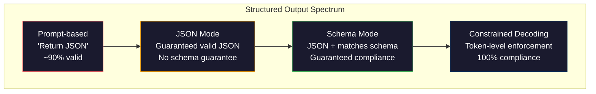
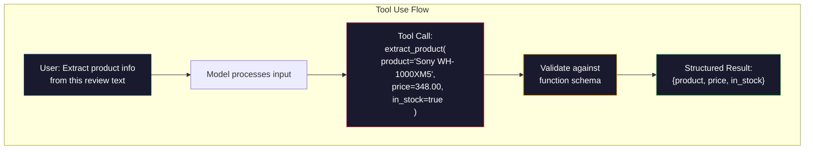

# Yapılandırılmış Çıktımlar: JSON, Şema Doğrulama, Sınırlı Şifreleme

> LLM'iniz bir dizileri gönderir. Uygulama JSON'a ihtiyaç duyar. Bu boşluk herhangi bir model halüsinasyonundan daha fazla üretim sistemini çöktürdü. Yapılandırılmış çıkış doğal dil ve yazılmış veriler arasındaki köprüdür. Doğru yapın ve LLM'iniz güvenilir bir API olur. Yanlış yapın ve regex ile serbest metni sabah 3'te analiz ediyorsunuz.

**Type:** Build
**Languages:** Python
**Prerequisites:** Phase 10, Lessons 01-05 (LLMs from Scratch)
**Time:** ~90 minutes
**Related:**5 · 20 aşama (Strukturlandırılmış Çıktıranlar ve Sınırlı Dekodlama) dekodör düzeyin teorisini kapsar (FSM/CFG logit işlemcileri, Özetler, XGrammar).Bu ders üretim SDK yüzeyine (OpenAI `response_format`, Antropik araç kullanımı, Eğitmen)  API'nin altındaki olayları anlamak istiyorsanız önce 5 · 20 aşamasını okuyun.

## Öğrenme Hedefleri

- OpenAI ve Anthropic API parametrelerini kullanarak JSON mod ve şema kısıtlı çıkışları uygulayın
- Yanlış biçimlendirilmiş LLM çıkışlarını ve hata geri bildirimi ile tekrar denemeyi reddeden bir Pydantic onay tabaka oluşturun
- Sınırlı çözme, token düzeyinde post-işlemeden geçerli JSON'u nasıl zorladığını açıklayın
- Yapılandırılmamış metni güvenilir bir şekilde tiplenen veri yapılarına dönüştüren güçlü çıkarma isteklerini tasarlayın

## Sorun

Bir LLM'ye sorarsanız: "Bu metinden ürün adını, fiyatını ve kullanılabilirliğini çıkarın".

```
The product is the Sony WH-1000XM5 headphones, which cost $348.00 and are currently in stock.
```

Bu mükemmel bir yanıt. Bu da başvurunuz için tamamen işe yaramaz.`{"product": "Sony WH-1000XM5", "price": 348.00, "in_stock": true}`.Benize özel anahtarlar, belirli türler ve belirli değer kısıtlamaları olan bir JSON nesneye ihtiyacınız var.

Saf çözüm: Cevap sorunuza "JSON'da yanıt" ekleyin. Bu zamanın %90'ında işe yarıyor. Diğer %10 model JSON'u markdown kod çitlerine sarar veya "JSON: İşte" gibi bir önbellek ekler veya bir şapka erken kapatıldığı için sentaksik olarak geçersiz JSON üretir. JSON analiz cihazınız çöktü. - Boru hattın kırılıyor. Deneme/sıkılama ekler ve tekrar deneme döngüsü. Yeniden deneme bazen farklı veriler üretir. Şimdi bir analiz sorunu üstüne tutarlılık sorunu var.

Bu, hızlı bir mühendislik sorunu değil. Bu bir çözme sorunu. Modeldeki simgeler soldan sağa doğru üretilir. Her pozisyonda, 100K+ seçeneklerin bir sözlüklüğünden en olası bir sonraki simgeler seçer. Bu seçeneklerin çoğu herhangi bir pozisyonda geçersiz JSON üretir.`{"price":`, bir sonraki simge bir rakam, bir alıntı (sırç için) olmalıdır.`null`- Evet .`true`- Evet .`false`Bu model, kısıtlamalar olmadan, bir İngilizce kelime seçebilmek için çok mantıklı olabilir.

## Anlaşım

### Yapılandırılmış Çıktı Spektrumu

Yapılandırılmış çıkış kontrolünün dört seviyesi vardır, her biri sonundan daha güvenilirdir.



**Prompt-based**("Türekli JSON'da yanıtlayın"): uygulanmaz. Model genellikle uyar ama bazen yapmaz. Güvenilirlik: ~ 90%. Başarısızlık modusu: işaretleme çitleri, önbaşı metni, kısaltılmış çıkış, yanlış yapı.

**JSON mode**API'nin çıkışının geçerli JSON olduğunu garanti eder.`response_format: { type: "json_object" }`Bu, çıkışın hata olmadan analiz edilmesini sağlar. Ama beklediğiniz şema ile aynı olmayabilir. Ekstra anahtarlar, yanlış türler, eksik alanlar.

**Schema mode**Bu, bir JSON Şema'yı alır ve çıkışın onunla eşleşmesini garanti eder. 2026 yılında tüm büyük sağlayıcılar bunu doğuştan destekler: OpenAI'nin `response_format: { type: "json_schema", json_schema: {...} }`(aynı zamanda `tool_choice="required"`), Anthropic'in araç kullanımı ile `input_schema`, ve Geminin'in `response_schema`+ `response_mime_type: "application/json"`Çıktırma, belirlediğiniz anahtarları, türleri ve kısıtlamaları içerir.

**Constrained decoding**Bu işlem, bir simge oluşturmak için kullanılır. Bu işlem, simgeyi oluşturmak için kullanılır. Bu işlem, simgeyi oluşturmak için kullanılır.

### JSON Şema: Sözleşme Dili

JSON Şema, çıkışın hangi şekli olması gerektiğini model (veya onay katmanı) nasıl anlattığını gösterir.

```json
{
  "type": "object",
  "properties": {
    "product": { "type": "string" },
    "price": { "type": "number", "minimum": 0 },
    "in_stock": { "type": "boolean" },
    "categories": {
      "type": "array",
      "items": { "type": "string" }
    }
  },
  "required": ["product", "price", "in_stock"]
}
```

Bu şema şöyle diyor: çıkış bir dizilenin bir nesnesi olmalıdır `product`, negatif olmayan bir sayı `price`, bir Boolean `in_stock`, ve bir dizi dizginli ip .`categories`- Uygun olmayan çıkışlar reddedilmektedir.

Şemalar zor durumları ele alıyor: yuvalanmış nesneler, tiplenen öğelerle diziler, enumlar (bir dizi belirli değerlere sınırlandırmak), örneğe eşleşme (dizi üzerinde regeks) ve kombinatörler (polymorfik çıkışlar için oneOf, anyOf, allOf).

### Pydantik Şekil

Python'da JSON Şeması'nı elden yazmazsınız. Pydantic modelini tanımlarsınız ve sizin için şema oluşturur.

```python
from pydantic import BaseModel

class Product(BaseModel):
    product: str
    price: float
    in_stock: bool
    categories: list[str] = []
```

Bu, yukarıdaki gibi aynı JSON Şeması üretir. Instructor kütüphanesi (ve OpenAI'nin SDK) doğrudan Pydantic modellerini kabul eder: model sınıfını geçerek onaylanmış bir örnek geri alır. LLM çıkışı eşleşmezse, Instructor otomatik olarak tekrar çalışır.

### Fonksiyon Çağrıları / Araç Kullanımı

Aynı sorunun alternatif bir arayüzü. Modelle doğrudan JSON üretmesini istemek yerine, "ümleleri" (fonksiyonları) tiplenen parametrelerle tanımlarsınız. Modelle yapılandırılmış argümanlarla bir fonksiyon çağrısı çıkarır. OpenAI buna "fonksiyon çağrısı" diyor. Anthropic buna "ümleleri kullanımı" diyor. Sonuç aynıdır: yapılandırılmış veriler.



Araç kullanımı, modelin sadece parametreleri doldurmak yerine hangi işlevi çağıracağını seçmesi gerektiğinde tercih edilir. Eğer 10 farklı çıkarma şeması varsa ve model giriş üzerine göre doğru olanı seçmelidirse, araç kullanımı size hem şemayı seçme hem de yapılandırılmış çıkış sağlar.

### Genel Başarısızlık Modu

Şema uygulanması ile bile, yapılandırılmış çıkışlar ince yollarla başarısız olabilir.

**Hallucinated values**: çıkış şema ile uyumludur ancak icat edilmiş verileri içerir.`{"price": 299.99}`Şema onaylaması bunu yakalayamıyor -- tip doğru, değer yanlış.

**Enum confusion**: bir alanı sınırlandırır `["in_stock", "out_of_stock", "preorder"]`Modelin çıkışları .`"available"`- semantik olarak doğru, ancak izin verilen sette değil. iyi kısıtlı çözme bunu engeller.

**Nested object depth**Bu nedenle, bu modelin yapısını kaybedebileceği başka bir yer ise, her yuva yuvası.

**Array length**Modelle çok fazla veya çok az bir dizi ürün üretmek olabilir.`minItems`ve `maxItems`Ama tüm tedarikçiler bunları çözme düzeyinde uygulamaz.

**Optional field omission**Modelle teknik olarak seçeneği olmayan ancak kullanım durumunuz için anlamsal olarak önemli alanlar kaydedilmektedir.`null`Açıkça.

```figure
mx-schema-funnel
```

## Yapın

### Adım 1: JSON Şema Doğrulama

Python nesnesinin JSON Şeması ile uyumlu olup olmadığını kontrol eden bir onaylayıcıyı sıfırdan oluşturun.

```python
import json

def validate_schema(data, schema):
    errors = []
    _validate(data, schema, "", errors)
    return errors

def _validate(data, schema, path, errors):
    schema_type = schema.get("type")

    if schema_type == "object":
        if not isinstance(data, dict):
            errors.append(f"{path}: expected object, got {type(data).__name__}")
            return
        for key in schema.get("required", []):
            if key not in data:
                errors.append(f"{path}.{key}: required field missing")
        properties = schema.get("properties", {})
        for key, value in data.items():
            if key in properties:
                _validate(value, properties[key], f"{path}.{key}", errors)

    elif schema_type == "array":
        if not isinstance(data, list):
            errors.append(f"{path}: expected array, got {type(data).__name__}")
            return
        min_items = schema.get("minItems", 0)
        max_items = schema.get("maxItems", float("inf"))
        if len(data) < min_items:
            errors.append(f"{path}: array has {len(data)} items, minimum is {min_items}")
        if len(data) > max_items:
            errors.append(f"{path}: array has {len(data)} items, maximum is {max_items}")
        items_schema = schema.get("items", {})
        for i, item in enumerate(data):
            _validate(item, items_schema, f"{path}[{i}]", errors)

    elif schema_type == "string":
        if not isinstance(data, str):
            errors.append(f"{path}: expected string, got {type(data).__name__}")
            return
        enum_values = schema.get("enum")
        if enum_values and data not in enum_values:
            errors.append(f"{path}: '{data}' not in allowed values {enum_values}")

    elif schema_type == "number":
        if not isinstance(data, (int, float)):
            errors.append(f"{path}: expected number, got {type(data).__name__}")
            return
        minimum = schema.get("minimum")
        maximum = schema.get("maximum")
        if minimum is not None and data < minimum:
            errors.append(f"{path}: {data} is less than minimum {minimum}")
        if maximum is not None and data > maximum:
            errors.append(f"{path}: {data} is greater than maximum {maximum}")

    elif schema_type == "boolean":
        if not isinstance(data, bool):
            errors.append(f"{path}: expected boolean, got {type(data).__name__}")

    elif schema_type == "integer":
        if not isinstance(data, int) or isinstance(data, bool):
            errors.append(f"{path}: expected integer, got {type(data).__name__}")
```

### Adım 2: Pydantik Stylo Modelinden Şema'ya

Minimum bir sınıf-sema dönüştürücü oluşturun. Python sınıfını tanımlayın ve otomatik olarak JSON Schema'sını oluşturun.

```python
class SchemaField:
    def __init__(self, field_type, required=True, default=None, enum=None, minimum=None, maximum=None):
        self.field_type = field_type
        self.required = required
        self.default = default
        self.enum = enum
        self.minimum = minimum
        self.maximum = maximum

def python_type_to_schema(field):
    type_map = {
        str: "string",
        int: "integer",
        float: "number",
        bool: "boolean",
    }

    schema = {}

    if field.field_type in type_map:
        schema["type"] = type_map[field.field_type]
    elif field.field_type == list:
        schema["type"] = "array"
        schema["items"] = {"type": "string"}
    elif isinstance(field.field_type, dict):
        schema = field.field_type

    if field.enum:
        schema["enum"] = field.enum
    if field.minimum is not None:
        schema["minimum"] = field.minimum
    if field.maximum is not None:
        schema["maximum"] = field.maximum

    return schema

def model_to_schema(name, fields):
    properties = {}
    required = []

    for field_name, field in fields.items():
        properties[field_name] = python_type_to_schema(field)
        if field.required:
            required.append(field_name)

    return {
        "type": "object",
        "properties": properties,
        "required": required,
    }
```

### Adım 3: Sınırlı İşaret Filtrasyonu

kısıtlı dekodlama simülasyonu. Bir kısmi JSON dizisi ve bir şema verildiğinde, hangi token kategorilerini geçerli olarak belirleyin.

```python
def next_valid_tokens(partial_json, schema):
    stripped = partial_json.strip()

    if not stripped:
        return ["{"]

    try:
        json.loads(stripped)
        return ["<EOS>"]
    except json.JSONDecodeError:
        pass

    last_char = stripped[-1] if stripped else ""

    if last_char == "{":
        return ['"', "}"]
    elif last_char == '"':
        if stripped.endswith('":'):
            return ['"', "0-9", "true", "false", "null", "[", "{"]
        return ["a-z", '"']
    elif last_char == ":":
        return [" ", '"', "0-9", "true", "false", "null", "[", "{"]
    elif last_char == ",":
        return [" ", '"', "{", "["]
    elif last_char in "0123456789":
        return ["0-9", ".", ",", "}", "]"]
    elif last_char == "}":
        return [",", "}", "]", "<EOS>"]
    elif last_char == "]":
        return [",", "}", "<EOS>"]
    elif last_char == "[":
        return ['"', "0-9", "true", "false", "null", "{", "[", "]"]
    else:
        return ["any"]

def demonstrate_constrained_decoding():
    partial_states = [
        '',
        '{',
        '{"product"',
        '{"product":',
        '{"product": "Sony"',
        '{"product": "Sony",',
        '{"product": "Sony", "price":',
        '{"product": "Sony", "price": 348',
        '{"product": "Sony", "price": 348}',
    ]

    print(f"{'Partial JSON':<45} {'Valid Next Tokens'}")
    print("-" * 80)
    for state in partial_states:
        valid = next_valid_tokens(state, {})
        display = state if state else "(empty)"
        print(f"{display:<45} {valid}")
```

### 4. Adım: Çöp boru hattı

Her şeyi bir çıkarma borusuna birleştirin: bir şema tanımlayın, yapılandırılmış çıkış üreten bir LLM'yi taklit edin, çıkışı doğrulayın ve tekrar denemeleri halledebilirsiniz.

```python
def simulate_llm_extraction(text, schema, attempt=0):
    if "headphones" in text.lower() or "sony" in text.lower():
        if attempt == 0:
            return '{"product": "Sony WH-1000XM5", "price": 348.00, "in_stock": true, "categories": ["audio", "headphones"]}'
        return '{"product": "Sony WH-1000XM5", "price": 348.00, "in_stock": true}'

    if "laptop" in text.lower():
        return '{"product": "MacBook Pro 16", "price": 2499.00, "in_stock": false, "categories": ["computers"]}'

    return '{"product": "Unknown", "price": 0, "in_stock": false}'

def extract_with_retry(text, schema, max_retries=3):
    for attempt in range(max_retries):
        raw = simulate_llm_extraction(text, schema, attempt)

        try:
            data = json.loads(raw)
        except json.JSONDecodeError as e:
            print(f"  Attempt {attempt + 1}: JSON parse error -- {e}")
            continue

        errors = validate_schema(data, schema)
        if not errors:
            return data

        print(f"  Attempt {attempt + 1}: Schema validation errors -- {errors}")

    return None

product_schema = {
    "type": "object",
    "properties": {
        "product": {"type": "string"},
        "price": {"type": "number", "minimum": 0},
        "in_stock": {"type": "boolean"},
        "categories": {"type": "array", "items": {"type": "string"}},
    },
    "required": ["product", "price", "in_stock"],
}
```

### Adım 5: Tam boru hattını çalıştır

```python
def run_demo():
    print("=" * 60)
    print("  Structured Output Pipeline Demo")
    print("=" * 60)

    print("\n--- Schema Definition ---")
    product_fields = {
        "product": SchemaField(str),
        "price": SchemaField(float, minimum=0),
        "in_stock": SchemaField(bool),
        "categories": SchemaField(list, required=False),
    }
    generated_schema = model_to_schema("Product", product_fields)
    print(json.dumps(generated_schema, indent=2))

    print("\n--- Schema Validation ---")
    test_cases = [
        ({"product": "Test", "price": 10.0, "in_stock": True}, "Valid object"),
        ({"product": "Test", "price": -5.0, "in_stock": True}, "Negative price"),
        ({"product": "Test", "in_stock": True}, "Missing price"),
        ({"product": "Test", "price": "ten", "in_stock": True}, "String as price"),
        ("not an object", "String instead of object"),
    ]

    for data, label in test_cases:
        errors = validate_schema(data, product_schema)
        status = "PASS" if not errors else f"FAIL: {errors}"
        print(f"  {label}: {status}")

    print("\n--- Constrained Decoding Simulation ---")
    demonstrate_constrained_decoding()

    print("\n--- Extraction Pipeline ---")
    texts = [
        "The Sony WH-1000XM5 headphones are priced at $348 and currently available.",
        "The new MacBook Pro 16-inch laptop costs $2499 but is sold out.",
        "This is a random sentence with no product info.",
    ]

    for text in texts:
        print(f"\n  Input: {text[:60]}...")
        result = extract_with_retry(text, product_schema)
        if result:
            print(f"  Output: {json.dumps(result)}")
        else:
            print(f"  Output: FAILED after retries")
```

## Kullan

### OpenAI Yapılandırılmış Çıktıranlar

```python
# from openai import OpenAI
# from pydantic import BaseModel
#
# client = OpenAI()
#
# class Product(BaseModel):
#     product: str
#     price: float
#     in_stock: bool
#
# response = client.beta.chat.completions.parse(
#     model="gpt-5-mini",
#     messages=[
#         {"role": "system", "content": "Extract product information."},
#         {"role": "user", "content": "Sony WH-1000XM5, $348, in stock"},
#     ],
#     response_format=Product,
# )
#
# product = response.choices[0].message.parsed
# print(product.product, product.price, product.in_stock)
```

OpenAI'nin yapılandırılmış çıkış modunda, iç iç iç kısıtlamalar kullanılır. Model oluşturan her token Pydantic şemasıyla uyumlu çıkış üretmeye garantilidir. Tekrar deneme gerekmez. Doğrulama gerekmez. kısıtlamalar çözme sürecine eklenir.

### Antropik Araç Kullanımı

```python
# import anthropic
#
# client = anthropic.Anthropic()
#
# response = client.messages.create(
#     model="claude-opus-4-7",
#     max_tokens=1024,
#     tools=[{
#         "name": "extract_product",
#         "description": "Extract product information from text",
#         "input_schema": {
#             "type": "object",
#             "properties": {
#                 "product": {"type": "string"},
#                 "price": {"type": "number"},
#                 "in_stock": {"type": "boolean"},
#             },
#             "required": ["product", "price", "in_stock"],
#         },
#     }],
#     messages=[{"role": "user", "content": "Extract: Sony WH-1000XM5, $348, in stock"}],
# )
```

Antropic, araç kullanımı yoluyla yapılandırılmış çıkış elde eder. Model input_schema ile eşleşen yapılandırılmış argümanlar ile bir araç çağrısı yayınlar. Aynı sonuç, farklı API yüzey.

### Eğitmen Kütüphanesi

```python
# pip install instructor
# import instructor
# from openai import OpenAI
# from pydantic import BaseModel
#
# client = instructor.from_openai(OpenAI())
#
# class Product(BaseModel):
#     product: str
#     price: float
#     in_stock: bool
#
# product = client.chat.completions.create(
#     model="gpt-5-mini",
#     response_model=Product,
#     messages=[{"role": "user", "content": "Sony WH-1000XM5, $348, in stock"}],
# )
```

Eğitmen herhangi bir LLM istemcisini sarar ve onaylama ile otomatik tekrar denemeleri ekler. Eğer ilk deneme onaylamada başarısız olursa, hataları bağlam olarak modeline geri gönderir ve çıkışını düzeltmesini ister. Bu sadece OpenAI ile değil, herhangi bir sağlayıcıyla çalışır.

## Gönder

Bu ders bize çok yararlı .`outputs/prompt-structured-extractor.md`-- bir schema tanımlaması verilen herhangi bir metinden yapılandırılmış verileri çeken tekrar kullanılabilir bir istek şablonu. Ona JSON Şablonu ve yapılandırılmamış metni besleyin ve doğrulanmış JSON gönderir.

Ayrıca üretir `outputs/skill-structured-outputs.md`-- sağlayıcıya, güvenilirlik gereksinimlerine ve şema karmaşıklığına göre doğru yapılandırılmış çıkış stratejisini seçmek için bir karar çerçevesini.

## Egzersizler

1. Şema onaylayıcıyı desteklemek için genişlet `oneOf`Bu, polimorf çıkışları ele alır. Örneğin, bir alan`Product`veya bir `Service`Farklı şekillerde bir nesne.

2. İki şema ile karşılaştırılan ve kırılan değişiklikleri (istekli alanlar kaldırılmış, değiştirilmiş türler) ile kırılmayan değişiklikleri (ekletilmiş seçmeli alanlar, gevşek kısıtlamalar) belirleyen bir "şema farklılık" aracı oluşturun.

3. JSON Şema ve 100 simgelik bir kelime birikimi (harfler, rakamlar, noktalamalar, anahtar kelimeler) verildiğinde, her pozisyonda geçersiz simgelikleri gizleyerek adım adım jenerasyon yoluyla yürüyün.

4. Ekstraksiyon değerlendirme paketini oluşturun. El etiketli JSON çıkışlarıyla 50 ürün açıklaması oluşturun. Ekstraksiyon borusunuzu tüm 50 üzerinde çalıştırın ve tam eşleşme, alan seviyesindeki doğruluk ve tip uyumluluğunu ölçün. Hangi alanların doğru şekilde çıkarılması en zor olduğunu belirleyin.

5. Çöpleme hattınıza "güven puanları" ekleyin. Çöplenen her alan için modelin ne kadar güvenilir olduğunu (token olasılıklarına veya çıkarmayı 3 kez çalıştırarak ve tutarlılığı ölçerek) tahmin edin.

## Anahtar Terimler

| Term | What people say | What it actually means |
|------|----------------|----------------------|
| JSON mode | "Returns JSON" | API flag that guarantees syntactically valid JSON output, but does not enforce any particular schema |
| Structured output | "Typed JSON" | Output that matches a specific JSON Schema with correct keys, types, and constraints |
| Constrained decoding | "Guided generation" | At each token position, mask out tokens that would produce invalid output -- guarantees 100% schema compliance |
| JSON Schema | "A JSON template" | A declarative language for describing the structure, types, and constraints of JSON data (used by OpenAPI, JSON Forms, etc.) |
| Pydantic | "Python dataclasses+" | Python library that defines data models with type validation, used by FastAPI and Instructor to generate JSON Schemas |
| Function calling | "Tool use" | LLM outputs a structured function invocation (name + typed arguments) instead of free text -- OpenAI and Anthropic both support this |
| Instructor | "Pydantic for LLMs" | Python library that wraps LLM clients to return validated Pydantic instances, with automatic retry on validation failure |
| Token masking | "Filtering the vocabulary" | Setting specific token probabilities to zero during generation so the model cannot produce them |
| Schema compliance | "Matches the shape" | The output has every required field, correct types, values within constraints, and no extra disallowed fields |
| Retry loop | "Try again until it works" | Send validation errors back to the model and ask it to fix the output -- Instructor does this automatically, up to a configurable max |

## Daha Fazla Okumak

- [OpenAI Structured Outputs Guide](https://platform.openai.com/docs/guides/structured-outputs)-- OpenAI API'de JSON Şema tabanlı kısıtlı çözme için resmi belge
- [Willard & Louf, 2023 -- "Efficient Guided Generation for Large Language Models"](https://arxiv.org/abs/2307.09702)-- JSON Şekimlerini token düzeyinde kısıtlamalar için sonlu durum makinelerine nasıl birleştirileceğini açıklayan Outlines makalesi
- [Instructor documentation](https://python.useinstructor.com/)-- Pydantic onaylı ve tekrar deneme ile herhangi bir LLM'den yapılandırılmış sonuçlar elde etmek için standart kütüphane
- [Anthropic Tool Use Guide](https://docs.anthropic.com/en/docs/tool-use)-- Claude , JSON Schema input_schema ile araç kullanımı yoluyla yapılandırılmış çıkışı nasıl uyguluyor
- [JSON Schema specification](https://json-schema.org/)-- her büyük yapılandırılmış çıkış sistemi tarafından kullanılan şema dili için tam özellik
- [Outlines library](https://github.com/outlines-dev/outlines)-- açık kaynaklı kısıtlı jenerasyon , sınırlı durum makinelerine oluşturulan regex ve JSON Şema kullanılarak
- [Dong et al., "XGrammar: Flexible and Efficient Structured Generation Engine for Large Language Models" (MLSys 2025)](https://arxiv.org/abs/2411.15100)-- güncel en son dilbilgisayara motor; tokeni ~ 100 ns / token'da gizleyen bir atma-otomatik komisyon.
- [Beurer-Kellner et al., "Prompting Is Programming: A Query Language for Large Language Models" (LMQL)](https://arxiv.org/abs/2212.06094)-- LMQL kağıt çerçevesinde, tip ve değer kısıtlamaları olan bir sorgu dili olarak kısıtlı bir dekodlama yapıldı.
- [Microsoft Guidance (framework docs)](https://github.com/guidance-ai/guidance)-- Şablon yönlendirici kısıtlı jenerasyon; Satıcı-agnostik Outlines ve XGrammar'a tamamlayıcı.
