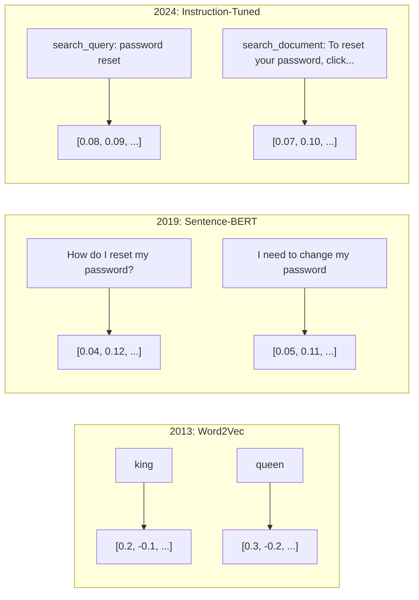
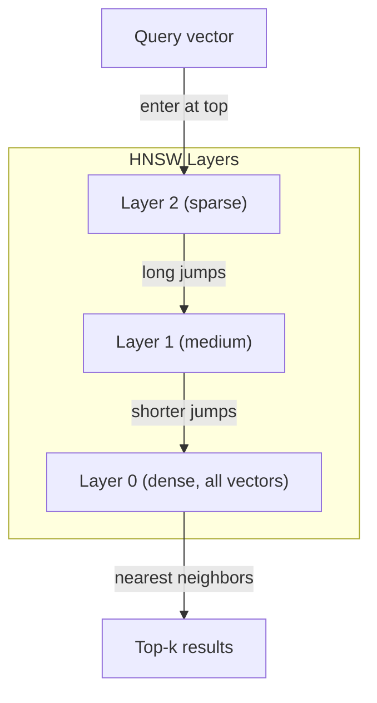
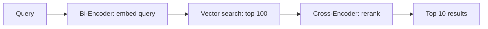

# Eklentiler ve vektör temsilleri

> Metin ayrıdır. Matematik sürekli. LLM'den "böyle" belgeler bulmasını, anlamları karşılaştırmasını veya anahtar kelimelerden daha öte aramalarını istediğiniz her seferinde bu iki dünya arasındaki köprüye güveniyorsunuz. Bu köprü bir yerleşimdir. Eğer yerleşimleri anlamıyorsanız, modern Yapay zeka'yı anlamıyorsunuz. Sadece kullanıyorsunuz.

**Type:** Build
**Languages:** Python
**Prerequisites:** Phase 11, Lesson 01 (Prompt Engineering)
**Time:** ~75 minutes
**Related:**5 · 22 aşaması (Embedding Models Deep Dive) yoğun vs. nadir vs. çok vektör, Matryoshka kesimleme ve eksel model seçimini kapsar. Bu ders üretim borusuna (vektor DB'leri, HNSW, benzerlik matematiği) odaklanır.

## Öğrenme Hedefleri

- API sağlayıcıları ve açık kaynaklı modeller kullanarak metin gömülmeleri oluşturun ve bunlar arasında cosine benzerliği hesaplayın
- Anahtar kelime aramalarının çözemeyeceği kelime birikimi eşleşmezliği sorunu neden yerleştirilmiş olduğunu açıklayın
- Anlamlardaki anahtar kelimeyle aynı değil, anlamla belgeler bulunan anlamlı bir arama endeksi oluşturun
- Çıkarma referans markeri (precision@k, hatırlat) kullanarak yerleştirme kalitesini değerlendir ve göreviniz için doğru yerleştirme modelini seçin

## Sorun

10,000 destek bileti var. Bir müşteri "Ödeme işlemim bitmedi". diye yazıyor. Aynı geçmiş biletleri bulmanız gerekiyor. Anahtar kelime arama "Ödeme işlem" ve "Ödeme işlemimiz bitmedi" içeren biletleri bulur. "Transaction failed", "charge was declined", ve "billing error" gibi kelimeleri kaybeder. Bu biletler tam olarak aynı sorunu tamamen farklı kelimelerle anlatır.

Bu kelime kaynağı eşleşme sorunu. İnsan dili aynı şeyi söylemek için düzinelerce yollara sahiptir. Anahtar kelime arama her kelimeyi anlamsız bağımsız bir sembol olarak değerlendirir. "Kesin" ve "geçmedi" aynı kavramı ifade ettiğini bilmiyor.

"Ödemeyi yapmadım" ve "transaksiyon reddedildi" kelimelerini birbiriyle yakın bir şekilde bir araya getirmek için bir yöntem gerekir. "Ödemeyi zamanında aldım" kelimesini paylaştığınızda "Ödeme" kelimesini uzaklaştırarak.

Bu temsil bir yerleşimdir.

## Anlaşım

### Bir İçeride Yerleşme Nedir?

Bir yerleştirme, metnin anlamını temsil eden yüzen nokta sayılarının yoğun bir vektörüdür. "Sık" kelimesi önemlidir - her boyut, çoğu boyut sıfır olan nadir temsillerden (saç sözcükler, TF-IDF) farklı olarak bilgi taşır.

"Kedi çarşafta oturuyordu" gibi bir şey oluyor.`[0.023, -0.041, 0.087, ..., 0.012]`Bu sayıların anlamını kodlamasıdır. Onları asla doğrudan kontrol etmiyorsunuz. Onları karşılaştırıyorsunuz.

### Word2Vec'in Yürüyüşü

2013 yılında Tomas Mikolov ve Google'daki meslektaşları Word2Vec'i yayınladı. Temel anlayış: komşularından bir kelimeyi (veya komşuları bir kelimeyle) tahmin etmek için bir sinir ağını eğitmek ve gizli katman ağırlıkları anlamlı vektör temsilleri haline gelmek.

Ünlü sonuç:

```
king - man + woman = queen
```

Sözcük yerleştirmelerindeki vektör aritmetikleri anlamsal ilişkileri yakalar. "erkek"ten "kadın"a olan yön "kral"dan " kraliçe"e olan yön ile aynıdır. Bu, jeometri'nin anlamı kodlayabileceğini anlayan an oldu.

Word2Vec 300 boyutlu vektörler üretti. Her kelime bağlamına bakılmaksızın bir vektör aldı. "Deniz kıyısında" ve "bank hesabı"daki "bank" aynı yerleşime sahipti. Bu sınırlama sonraki on yıllık araştırmayı yönlendirdi.

### Sözlerden cümlelere

Sözcük yerleştirmeler tek bir simgeyi temsil eder. Üretim sistemleri tüm cümleleri, paragrafları veya belgeleri yerleştirmelidir. Dört yaklaşım ortaya çıktı:

**Averaging**Bu cümle, kısa metin için şaşırtıcı derecede iyi bir şekilde kullanılır. kelimeler sırasını tamamen kaybeder. "Köpek adamı ısırır" ve "İnsan köpeği ısırır" aynı yerleşimleri alır.

**CLS token**Transformer modelleri (BERT, 2018) tüm girişleri temsil eden özel bir [CLS] token gömülmesini çıkarır.

**Contrastive learning**Bu yöntemin temelini oluşturan, "Hadişatimi nasıl yeniden ayarlarım?" ve "Hadişatimi değiştirmem gerekiyor" ifadelerini göz önüne alarak, model bu ifadelerin neredeyse aynı vektörlere sahip olması gerektiğini öğrenir.

**Instruction-tuned embeddings**E5 ve GTE gibi modeller, modelin hangi tür yerleştirme üretmesi gerektiğini söyleyen bir görev önlüğünü kabul eder ("search_query:", "search_document:"). Bu, bir modelin birden fazla görevi yerine getirmesi sağlar.



### Modern İçeriği Modeller

Piyasa bir avuç üretim seviyesine sahip seçeneklere (MTEB puanları 2026 yılının başlarında MTEB v2) yerleştirildi:

| Model | Provider | Dimensions | MTEB | Context | Cost / 1M tokens |
|-------|----------|-----------|------|---------|------------------|
| Gemini Embedding 2 | Google | 3072 (Matryoshka) | 67.7 (retrieval) | 8192 | $0.15 |
| embed-v4 | Cohere | 1024 (Matryoshka) | 65.2 | 128K | $0.12 |
| voyage-4 | Voyage AI | 1024/2048 (Matryoshka) | 66.8 | 32K | $0.12 |
| text-embedding-3-large | OpenAI | 3072 (Matryoshka) | 64.6 | 8192 | $0.13 |
| text-embedding-3-small | OpenAI | 1536 (Matryoshka) | 62.3 | 8192 | $0.02 |
| BGE-M3 | BAAI | 1024 (dense+sparse+ColBERT) | 63.0 multilingual | 8192 | Open-weight |
| Qwen3-Embedding | Alibaba | 4096 (Matryoshka) | 66.9 | 32K | Open-weight |
| Nomic-embed-v2 | Nomic | 768 (Matryoshka) | 63.1 | 8192 | Open-weight |

MTEB (Massive Text Embedding Benchmark) v2, geri alım, sınıflandırma, gruplama, yeniden sıralama ve özetleme alanında 100+ görevi kapsar. Daha yüksek daha iyidir. 2026 yılına kadar, açık ağırlıklı modeller (Qwen3-Embedding, BGE-M3) çoğu eksede kapalı konutlu modellerle eşleşir veya yenir. Gemini Embedding 2 saf geri alımı yönlendirir; Voyage/Cohere belirli alanları yönlendirir (mali, hukuk, kod). Her zaman kendinize karar vermeden önce kendi sorularınızı değerlendirin.

### Benzerlik Metrikleri

İki yerleştirme vektörü verildiğinde, benzerliklerini ölçmenin üç yolu:

**Cosine similarity**Bu, iki vektör arasındaki açının kozinüsünü gösterir. -1 (karşı) ile 1 (aynı yön) arasında değişir. Büyüklüğü görmezden gelir. 10 kelime cümle ve 500 kelimelik bir belge aynı yönü gösterirse 1.0 puan alabilir. Bu kullanım durumlarının %90'ında varsayılan puan.

```
cosine_sim(a, b) = dot(a, b) / (||a|| * ||b||)
```

**Dot product**: iki vektörün çiğ iç ürünü. vektörler normalleştirildiğinde (birlik uzunluğu) kozin benzerliği ile aynı. Hesaplama daha hızlı. OpenAI'nin gömülmeleri normalleştirilmiştir, bu nedenle nokta ürünü ve kozin aynı sıralama verir.

```
dot(a, b) = sum(a_i * b_i)
```

**Euclidean (L2) distance**Vectör alanında düz çizgi mesafe. Daha küçük = daha benzer. Büyüklük farklarına duyarlı. Sadece yön değil, uzaydaki mutlak pozisyon önemli olduğunda kullanın.

```
L2(a, b) = sqrt(sum((a_i - b_i)^2))
```

Ne zaman kullanılır:

| Metric | Use when | Avoid when |
|--------|----------|------------|
| Cosine similarity | Comparing texts of different lengths; most retrieval tasks | Magnitude carries information |
| Dot product | Embeddings are already normalized; maximum speed | Vectors have varying magnitudes |
| Euclidean distance | Clustering; spatial nearest-neighbor problems | Comparing documents of wildly different lengths |

### Vektör Veritabanları ve HNSW

Bir kaba güç benzerlik arama sorguyu her depolanmış vektörle karşılaştırır. 1536 boyutlu 1 milyon vektörde, bu sorgu başına 1,5 milyar kat kat ekleme işlemidir. Çok yavaş.

Vektör veritabanları bunu Yaklaşık En Yakın Komşu (ANN) algoritmaları ile çözüyor.

1. Vektörlerin çok katmanlı bir grafik oluştur
2. Yukarı katmanlar nadirdir. Uzak gruplar arasındaki uzun mesafeli bağlantılar.
3. Alt katmanlar yoğun -- yakın vektörler arasındaki ince tanelerli bağlantılar
4. Arama üst katmandan başlar, açgözlülükle aramak için aşağı iner
5. O(log n) yerine O(n) zamanında yaklaşık üst-k sonuçları gönderir

HNSW, büyük hız kazanımları için küçük bir doğruluk kaybı (genellikle 95-99% hatırlama) ticareti yapar. 10 milyon vektörde kaba güç saniyeler alır. HNSW milisaniyeler alır.



Üretim seçenekleri:

| Database | Type | Best for | Max scale |
|----------|------|----------|-----------|
| Pinecone | Managed SaaS | Zero-ops production | Billions |
| Weaviate | Open source | Self-hosted, hybrid search | 100M+ |
| Qdrant | Open source | High performance, filtering | 100M+ |
| ChromaDB | Embedded | Prototyping, local dev | 1M |
| pgvector | Postgres extension | Already using Postgres | 10M |
| FAISS | Library | In-process, research | 1B+ |

### Çürükleme Strategiları

Belgeler tek vektör olarak yerleştirilmeyecek kadar uzun. 50 sayfalık bir PDF düzinelerce konuyu kapsar. yerleştirilmesi her şeyin ortalaması haline gelir, hiçbir şeyle benzer. Belgeler parçalara ayırıp her birini yerleştirir.

**Fixed-size chunking**M-token üst üstelik olan her N tokeni bölün. Basit ve öngörülebilir. Belgeler net bir yapı olmamasında iyi çalışır. 50 token üst üstelik olan 512 token parçası: 1 token 0-511, 2 token 462-973.

**Sentence-based chunking**Bir cümleyi iki parçaya ayırmak, cümle sınırlarını bölmek, cümleleri belirgin sınırına ulaşıncaya kadar gruplandırmak. Her parça en az bir cümleyi tamamlıyor.

**Recursive chunking**Bu, LangChain'in sınırlarıdır.`RecursiveCharacterTextSplitter`ve karışık formatlı vücutlar için iyi çalışır.

**Semantic chunking**Bu cümleler, bir cümleyi bir araya getirmek için bir cümleyi oluşturur.

| Strategy | Complexity | Quality | Best for |
|----------|-----------|---------|----------|
| Fixed-size | Low | Decent | Unstructured text, logs |
| Sentence-based | Low | Good | Articles, emails |
| Recursive | Medium | Good | Markdown, HTML, mixed docs |
| Semantic | High | Best | Critical retrieval quality |

Çoğu sistem için en iyi nokta: 256-512 token parçası 50 token üst üste.

### Bi-Enkodlayıcılar vs. Çapraz-Enkodlayıcılar

Bir iki kodlayıcı sorgulama ve belgeyi bağımsız olarak yerleştirir, sonra vektörleri karşılaştırır. Hızlı - sorgulama bir kez yerleştirir ve önceden hesaplanmış belge yerleştirmelerine karşı karşılaştırır. Bu, geri almak için kullandığınız şey.

Bir çapraz kodlayıcı, sorgu ve belgeyi tek bir giriş olarak alır ve bir bağlayıcılık puanı çıkarır. Yavaş - her sorgu-belge çiftini tam model boyunca işliyor. Ama çok daha doğru çünkü sorgu ve belge tokenlerini aynı anda karşılayabilir.

Üretim örneği: Bi-encoder en iyi 100 adayı alır, çapraz encoder onları en iyi 10'a geri gönderir. Bu, geri alın ve sonra yeniden sıralama borusu.



Ranking modelleri: Cohere Rerank 3.5 (1000 sorgu başına 2 dolar), BGE-reranker-v2 (ücretsiz, açık kaynak), Jina Reranker v2 (ücretsiz, açık kaynak).

### Matryoshka Eklemleri

Geleneksel yerleşimler her şey veya hiçbir şey değildir. 1536 boyutlu bir vektör 1536 yüzen kullanır.

Matryoshka Reprezentation Learning (Kusupati et al., 2022) bunu düzeltir. Model, ilk N boyutları en önemli bilgileri yakalamak için eğitilmiştir, örneğin bir Rus yuva kuklası gibi. 1536-d bir Matryoshka gömülmesi 256 boyutlara kısaltmak bazı doğruluk kaybeder ancak işlevsel kalır.

OpenAI'nin metin içeren 3 küçük ve metin içeren 3 büyük destekleri Matryoshka kesimi `dimensions`Parametre: 1536 yerine 256 boyut talep etmek depolama alanını 6 kat azaltır ve MTEB referans değerlerinde yaklaşık %3-5% doğruluk kaybı ile azaltır.

### Çiftlik Kvantizasyon

float32 olarak saklanan 1536 boyutlu bir gömme 6.144 byte kullanır. 10 milyon belge ile çarpın: sadece vektörler için 61 GB.

İkili kuantitasyon her akıştı tek bir bit olarak dönüştürür: olumlu değerler 1, negatif değerler 0 olur. Kayıtlama 6,144 bytes'ten 192 byte'ye düşer - 32x bir azalım. Benzerlik Hamming mesafesini kullanarak hesaplanır (farklı bit sayım), CPU'lar tek bir talimat ile yapabilir.

Çıkarma geri çağırışında doğruluk oranı yaklaşık %5-10'dur. Genel model: biner kuantitasyon, ilk geçiş arama için milyonlarca vektör üzerinde, sonra tam doğruluk vektörleri ile üst 1000'i yeniden gösterir. Bu size %95+ tam doğruluk doğruluk sağlar. 32 kat daha az bellek.

```figure
cosine-similarity
```

## Yapın

Semantik bir arama motoru oluşturduk sıfırdan. Vektör veritabanı yok. Dış yerleştirme API yok. Matematik için saf Python.

### Adım 1: Metinleri parçala

```python
def chunk_text(text, chunk_size=200, overlap=50):
    words = text.split()
    chunks = []
    start = 0
    while start < len(words):
        end = start + chunk_size
        chunk = " ".join(words[start:end])
        chunks.append(chunk)
        start += chunk_size - overlap
    return chunks


def chunk_by_sentences(text, max_chunk_tokens=200):
    sentences = text.replace("\n", " ").split(".")
    sentences = [s.strip() + "." for s in sentences if s.strip()]
    chunks = []
    current_chunk = []
    current_length = 0
    for sentence in sentences:
        sentence_length = len(sentence.split())
        if current_length + sentence_length > max_chunk_tokens and current_chunk:
            chunks.append(" ".join(current_chunk))
            current_chunk = []
            current_length = 0
        current_chunk.append(sentence)
        current_length += sentence_length
    if current_chunk:
        chunks.append(" ".join(current_chunk))
    return chunks
```

### Adım 2: Baştan Yükleme Yapımları

L2 normalleştirmesi ile TF-IDF kullanarak basit yoğun bir yerleştirme uyguluyoruz. Bu bir nöral yerleştirme değil, aynı sözleşmeyi takip ediyor: metin içeri, sabit boyutlu vektör dışarı, benzer metinler benzer vektörler üretir.

```python
import math
import numpy as np
from collections import Counter

class SimpleEmbedder:
    def __init__(self):
        self.vocab = []
        self.idf = []
        self.word_to_idx = {}

    def fit(self, documents):
        vocab_set = set()
        for doc in documents:
            vocab_set.update(doc.lower().split())
        self.vocab = sorted(vocab_set)
        self.word_to_idx = {w: i for i, w in enumerate(self.vocab)}
        n = len(documents)
        self.idf = np.zeros(len(self.vocab))
        for i, word in enumerate(self.vocab):
            doc_count = sum(1 for doc in documents if word in doc.lower().split())
            self.idf[i] = math.log((n + 1) / (doc_count + 1)) + 1

    def embed(self, text):
        words = text.lower().split()
        count = Counter(words)
        total = len(words) if words else 1
        vec = np.zeros(len(self.vocab))
        for word, freq in count.items():
            if word in self.word_to_idx:
                tf = freq / total
                vec[self.word_to_idx[word]] = tf * self.idf[self.word_to_idx[word]]
        norm = np.linalg.norm(vec)
        if norm > 0:
            vec = vec / norm
        return vec
```

### Adım 3: Benzerlik İşleri

```python
def cosine_similarity(a, b):
    dot = np.dot(a, b)
    norm_a = np.linalg.norm(a)
    norm_b = np.linalg.norm(b)
    if norm_a == 0 or norm_b == 0:
        return 0.0
    return float(dot / (norm_a * norm_b))


def dot_product(a, b):
    return float(np.dot(a, b))


def euclidean_distance(a, b):
    return float(np.linalg.norm(a - b))
```

### Adım 4: Brut-Force Arama ile Vektör İndeksi

```python
class VectorIndex:
    def __init__(self):
        self.vectors = []
        self.texts = []
        self.metadata = []

    def add(self, vector, text, meta=None):
        self.vectors.append(vector)
        self.texts.append(text)
        self.metadata.append(meta or {})

    def search(self, query_vector, top_k=5, metric="cosine"):
        scores = []
        for i, vec in enumerate(self.vectors):
            if metric == "cosine":
                score = cosine_similarity(query_vector, vec)
            elif metric == "dot":
                score = dot_product(query_vector, vec)
            elif metric == "euclidean":
                score = -euclidean_distance(query_vector, vec)
            else:
                raise ValueError(f"Unknown metric: {metric}")
            scores.append((i, score))
        scores.sort(key=lambda x: x[1], reverse=True)
        results = []
        for idx, score in scores[:top_k]:
            results.append({
                "text": self.texts[idx],
                "score": score,
                "metadata": self.metadata[idx],
                "index": idx
            })
        return results

    def size(self):
        return len(self.vectors)
```

### Adım 5: Semantik Arama Motoru

```python
class SemanticSearchEngine:
    def __init__(self, chunk_size=200, overlap=50):
        self.embedder = SimpleEmbedder()
        self.index = VectorIndex()
        self.chunk_size = chunk_size
        self.overlap = overlap

    def index_documents(self, documents, source_names=None):
        all_chunks = []
        all_sources = []
        for i, doc in enumerate(documents):
            chunks = chunk_text(doc, self.chunk_size, self.overlap)
            all_chunks.extend(chunks)
            name = source_names[i] if source_names else f"doc_{i}"
            all_sources.extend([name] * len(chunks))
        self.embedder.fit(all_chunks)
        for chunk, source in zip(all_chunks, all_sources):
            vec = self.embedder.embed(chunk)
            self.index.add(vec, chunk, {"source": source})
        return len(all_chunks)

    def search(self, query, top_k=5, metric="cosine"):
        query_vec = self.embedder.embed(query)
        return self.index.search(query_vec, top_k, metric)

    def search_with_scores(self, query, top_k=5):
        results = self.search(query, top_k)
        return [
            {
                "text": r["text"][:200],
                "source": r["metadata"].get("source", "unknown"),
                "score": round(r["score"], 4)
            }
            for r in results
        ]
```

### Adım 6: Benzerlik Metriklerini karşılaştırmak

```python
def compare_metrics(engine, query, top_k=3):
    results = {}
    for metric in ["cosine", "dot", "euclidean"]:
        hits = engine.search(query, top_k=top_k, metric=metric)
        results[metric] = [
            {"score": round(h["score"], 4), "preview": h["text"][:80]}
            for h in hits
        ]
    return results
```

## Kullan

Bir üretim gömleyici API ile, mimarlık aynı kalır. Sadece gömleyici değişir:

```python
from openai import OpenAI

client = OpenAI()

def openai_embed(texts, model="text-embedding-3-small", dimensions=None):
    kwargs = {"model": model, "input": texts}
    if dimensions:
        kwargs["dimensions"] = dimensions
    response = client.embeddings.create(**kwargs)
    return [item.embedding for item in response.data]
```

OpenAI ile matryoshka kesimi -- aynı model, daha az boyut, daha düşük depolama:

```python
full = openai_embed(["semantic search query"], dimensions=1536)
compact = openai_embed(["semantic search query"], dimensions=256)
```

256-d vektörü 6 kat daha az depolama kullanıyor. 10 milyon belge için, bu 10 GB vs 61 GB.

Cohere'la yeniden sıralama için:

```python
import cohere

co = cohere.ClientV2()

results = co.rerank(
    model="rerank-v3.5",
    query="What is the refund policy?",
    documents=["Full refund within 30 days...", "No refunds after 90 days..."],
    top_n=3
)
```

API bağımlılığı olmayan yerel yerleşimler için:

```python
from sentence_transformers import SentenceTransformer

model = SentenceTransformer("BAAI/bge-small-en-v1.5")
embeddings = model.encode(["semantic search query", "another document"])
```

Bu tür bir yapı ile vectorindex sınıfı çalışır. yerleştirme fonksiyonunu değiştirin, arama mantığını koruyun.

## Gönder

Bu ders şunları ortaya çıkarır:
- `outputs/prompt-embedding-advisor.md`-- özel kullanım durumları için yerleştirme modelleri ve stratejileri seçmek için bir ipucu
- `outputs/skill-embedding-patterns.md`-- bir yetenek ki ajanlara üretimde etkili şekilde gömülmüşleri nasıl kullanacaklarını öğretir

## Egzersizler

1. **Metric comparison**Bu nedenle, bir örnek olarak, bir örnek ile aynı 5 sorguyu cosine benzerliği, nokta ürünü ve Euclidean mesafeyi kullanarak çalıştırın.

2. **Chunk size experiment**: 50, 100, 200 ve 500 kelimelik parça boyutları ile örnek belgeleri indeksleyin. Her biri için 5 sorgu çalıştırın ve en iyi 1 benzerlik puanını kaydetin. parça boyutu ve çekim kalitesi arasındaki ilişkiyi çizin. Büyük parçaların acı çekmeye başladığı noktayı bulun.

3. **Matryoshka simulation**Bu, gerçek bir eğitim hilesine ihtiyaç duymadan Matryoshka davranışını simüle eder.

4. **Binary quantization**Bu nedenle, bu değerler, bir araya gelerek, bir araya gelerek, bir araya gelerek, bir araya gelerek, bir araya gelerek, bir araya gelerek, bir araya gelerek, bir araya gelerek, bir araya gelerek, bir araya gelerek, bir araya gelerek, bir araya gelerek, bir araya gelerek, bir araya gelerek, bir araya gelerek, bir araya gelerek, bir araya gelerek, bir araya gelerek, bir araya gelerek, bir araya gelerek, bir araya gelerek, bir araya gelerek, bir araya gelerek, bir araya gelerek, bir araya gelerek, bir araya gelerek, bir araya gelerek, bir araya gelerek, bir araya gelerek, bir araya gelerek, bir araya gelerek, bir araya gelerek, bir araya gelerek, bir araya gelerek, bir araya gelerek, bir araya gelerek, bir araya gelerek, bir araya gelerek, bir araya gelerek, bir araya gelerek, bir araya gelerek, bir araya gelerek, bir araya gelerek, bir araya gelerek, bir araya gelişe, bir araya gelerek, bir araya gelerek, bir araya geleceğebilir.

5. **Sentence-based chunking**: sabit boyutlu parçalanmayı `chunk_by_sentences`Aynı sorular sorup, sonuçları karşılaştır.

## Anahtar Terimler

| Term | What people say | What it actually means |
|------|----------------|----------------------|
| Embedding | "Text to numbers" | A dense vector where geometric proximity encodes semantic similarity |
| Word2Vec | "The OG embedding" | 2013 model that learned word vectors by predicting context words; proved vector arithmetic encodes meaning |
| Cosine similarity | "How similar are two vectors" | Cosine of the angle between vectors; 1 = identical direction, 0 = orthogonal, -1 = opposite |
| HNSW | "Fast vector search" | Hierarchical Navigable Small World graph -- multi-layer structure enabling O(log n) approximate nearest neighbor search |
| Bi-encoder | "Embed separately, compare fast" | Encodes query and document independently into vectors; enables pre-computation and fast retrieval |
| Cross-encoder | "Slow but accurate reranker" | Processes query-document pair jointly through the full model; higher accuracy, no pre-computation |
| Matryoshka embeddings | "Truncatable vectors" | Embeddings trained so the first N dimensions capture the most important information, enabling variable-size storage |
| Binary quantization | "1-bit embeddings" | Converting float vectors to binary (sign bit only) for 32x storage reduction with Hamming distance search |
| Chunking | "Split docs for embedding" | Breaking documents into 256-512 token segments so each can be independently embedded and retrieved |
| Vector database | "Search engine for embeddings" | Data store optimized for storing vectors and performing approximate nearest neighbor search at scale |
| Contrastive learning | "Train by comparison" | Training approach that pushes similar pair embeddings together and dissimilar pair embeddings apart |
| MTEB | "The embedding benchmark" | Massive Text Embedding Benchmark -- 56 datasets across 8 tasks; standard for comparing embedding models |

## Daha Fazla Okumak

- Mikolov et al., "Vectör Uzayında Kelimeler Temsillerinin Etkili Tahmini" (2013) - Kral- kraliçe benzerliği ile gömülme devrimini başlatan Word2Vec makalesi
- Reimers & Gurevych, "Sentence-BERT: Sentence Embeddings using Siamese BERT-Networks" (2019) -- cümle seviyesindeki benzerlik için iki kodlayıcıyı nasıl eğiteceğiniz, modern gömleme modelleri temelini oluşturan
- Kusupati et al., "Matryoshka Reprezentation Learning" (2022) -- OpenAI'nin metin yerleştirme için benimsemiş olduğu değişken boyutlu yerleşimlerin arkasındaki teknik-3
- Malkov & Yashunin, "Hiyerarşik Yürüyen Küçük Dünya Grafiklerini Kullanarak En Yakın Komşunu Etkili ve Güçlü Yaklaşır" (2018) -- HNSW kağıdı, çoğu üretim vektör aramalarının arkasındaki algoritma
- OpenAI Embeddings Guide (platform.openai.com/docs/guides/embeddings) -- Matryoshka boyut azaltımı dahil olmak üzere metin-embedded-3 modelleri için pratik referans
- MTEB Leaderboard (huggingface.co/spaces/mteb/leaderboard) -- Tüm yerleştirme modelleri görev ve diller arasında karşılaştıran canlı bir referans göstergesi
- [Muennighoff et al., "MTEB: Massive Text Embedding Benchmark" (EACL 2023)](https://arxiv.org/abs/2210.07316)-- sıralama tablosunun raporladığı 8 görev kategorisini tanımlayan referans değerleri (sınıflama, gruplama, çift sınıflandırma, yeniden sıralama, geri alım, STS, özetleme, biteks madenciliği); herhangi bir MTEB puanına güvenmeden önce okuyun.
- [Sentence Transformers documentation](https://www.sbert.net/)-- iki kodlayıcı vs çapraz kodlayıcı için kanonik referans, birleştirme stratejileri ve bu ders uygulanır.
