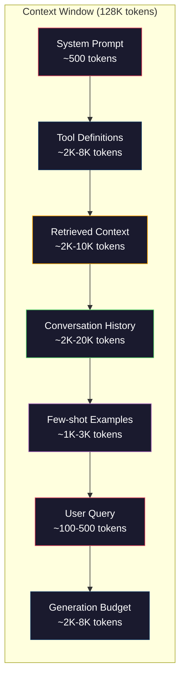
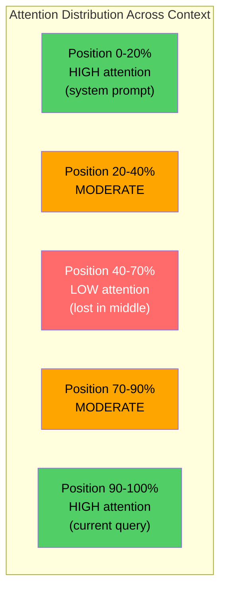
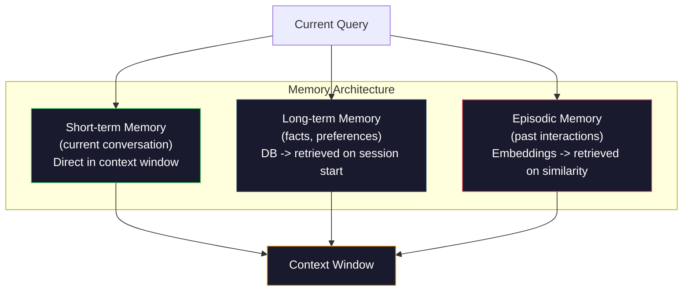

# Kontext Mühendisliği: Windows, Bütçe, Hatıra ve İndirme

> Çabuk mühendislik bir alt kümedir. Konteks mühendisliği tüm oyundur. Çabuk bir dizilme, bir dizilme. Konteks, modelin penceresine giren her şeydir: sistem talimatları, alınan belgeler, araç tanımları, konuşma tarihi, birkaç çekim örneği ve çabuk bir şey. 2026'daki en iyi AI mühendisleri bağlam mühendisleri. Ne girer, ne kalır ve hangi sırada karar verirler.

**Type:** Build
**Languages:** Python
**Prerequisites:** Phase 10 (LLMs from Scratch), Phase 11 Lesson 01-02
**Time:** ~90 minutes
**Related:**EY 11 · 15 (Hızlı Kayıtlama)  önbelleğe dostu düzen bağlam mühendisliği bir uzantı. 5 · 28 (Uzun bağlam değerlendirme) NIAH/RULER ile orta kayıpları ölçmek için.

## Öğrenme Hedefleri

- Tüm bağlam penceresi bileşenleri (sistem istekleri, araçlar, geçmiş, alınan belgeler, jenerasyon başlık alanı) için token bütçelerini hesaplayın
- Konekst pencere yönetim stratejilerini uygulayın: konuşma geçmişi için kısaltma, özetleme ve kaydırma penceresi
- Modelin en alakalı bilgilere olan dikkatini artırmak için öncelik ver ve bağlam bileşenlerini sıralayın
- Sorgu türüne ve mevcut pencerenin alanına göre belirtiler dinamik olarak tahsis eden bir bağlam asembleri oluştur

## Sorun

Claude Opus 4.7'de 200K token penceresi (1M beta versiyonunda). GPT-5'de 400K. Gemini 3 Pro'da 2M. Llama 4'de 10M. Bu rakamlar doldurulana kadar muazzam görünüyor.

İşte bir kodlama asistanı için gerçek bir ayrıntı. Sistem sorgulaması: 500 token. 50 araç için araç tanımları: 8.000 token. Alınan belge: 4.000 token. Konuşma tarihi (10 dönüş): 6.000 token. Güncel kullanıcı sorusu: 200 token. Gelişim bütçesi (maksimum çıkış): 4.000 token. Toplam: 22.700 token. Bu 128K penceresinin sadece 18%'idir.

Ama dikkat bağlam uzunluğu ile lineer olarak ölçeklenmez. 128K bağlam belirtileri olan bir model, most transformörlerinde kare dikkat maliyetini (O(n^2) ödüyor, ancak çoğu üretim modeli verimli dikkat varianlarını kullanıyor. Daha da önemlisi, çekim doğruluğu azalıyor. "Haystack'taki İğne" testi, modellerin uzun bağlamların ortasında yerleştirilen bilgileri bulmakta zorlandığını göstermektedir. Liu ve diğerleri tarafından yapılan araştırma. (2023) LLM'lerin uzun bağlamların başlangıcında ve sonunda neredeyse mükemmel bir doğrulukla bilgi almadığını gösterdi, ancak doğruluk ortalama konuma yerleştirilen bilgiler için (koneksten oluşan pozisyonların 40-70%'i) %10-20 oranında düştü. Bu "ortalarda kaybolan" etki modelden model değişir ancak tüm mevcut mimarlıkları etkiler.

Pratik ders: 200K token kullanmak 200K token kullanmanın etkili olduğu anlamına gelmez. Dikkatle düzenlenen 10K token bağlamı genellikle atılan 100K token bağlamını üstlenir. Kontext mühendisliği bağlam penceresi içinde sinyal-gürültü oranını en üst düzeye çıkarma disiplini.

Pencereye koyduğunuz her token daha fazla ilgili bilgi taşıyabilecek bir token'ı değiştirir. Her anlamsız araç tanımlaması, her eski konuşma dönüşü, soruya cevap vermeyen her alınan metin parçası -- her biri, modelin görevi biraz daha kötü hale getiriyor.

## Anlaşım

### Konekst Penceresi Kıt Bir Kaynak

Konekst penceresini disk değil RAM olarak düşünün. Hızlı ve doğrudan erişilebilir, ama sınırlı. Her şeyi yerleştiremezsiniz. Seçmelisiniz.



Her bileşen boşluk için rekabet eder. Daha fazla araç tanımını eklemek sohbet geçmişi için daha az yer demektir. Daha fazla alınan bağlam eklemek birkaç çekim örneği için daha az yer demektir. Kontext mühendisliği, bu bütçeyi görev performansını en üst düzeye çıkarmak için tahsis etme sanatıdır.

### Ortada Kaybolmuş

En önemli empirici bulgu bağlam mühendisliği. Modeller bağlamın başlangıcında ve sonunda bilgiyi daha iyi karşılar. Ortadaki bilgi daha düşük dikkat puanları alır ve daha fazla ihmal edilme olasılığı vardır.

Liu et al. (2023) bunu sistematik olarak test ettiler. 20 farklı pozisyonda ilgili bir belgeyi 20 irelevant belge arasında yerleştirdiler ve cevap doğruluğunu ölçtüler. İlgili belge ilk veya son olduğunda, doğruluk 85-90% idi. Ortadayken (20'nin 10 pozisyonu), doğruluk 60-70%'ye düştü.

Bu doğrudan mühendislik etkileri vardır:

- En önemli bilgileri öncelikle verin (sistem süresi, kritik talimatlar)
- Geçerli soruyu ve en ilgili bağlamı sonuna koy (son zamanlarda önyargı yardımcı olur)
- Konektsin ortasını en düşük öncelik alanı olarak değerlendirin
- Eğer orta tarafta bilgi eklemek istiyorsanız, son tarafta anahtar noktayı tekrarlayın.



### Bağlantı bileşenleri

**System prompt**Claude Code, araç tanımlamaları ve davranış talimatları dahil olmak üzere sistem prompt'u için yaklaşık 6.000 token kullanır.

**Tool definitions**Bu, bir iletişim kurmadan önce her bir işaretin 50-200 simgesini ekler. Dinamik araç seçimi - sadece mevcut sorguya ilişkin araçları dahil ederek - bu oranı %60-80 oranında azaltabilir.

**Retrieved context**Vectör veritabanından belgeler, arama sonuçları, dosya içeriği. Arama kalitesi doğrudan yanıt kalitesini belirler. Kötü bir arama hiçbir arama olmaktan daha kötüdür - pencereleri gürültüyle doldurur ve aktif olarak modelin yanıltıcı hale getiriyor.

**Conversation history**Bu, bir kullanıcı tarafından gönderilen bir mesajın ve yardımcı yanıtının öncesinde gerçekleşen bir mesajdır. Konuşma uzunluğu ile lineer olarak büyür.

**Few-shot examples**Bu nedenle, bu örnekler, bir dizi yönlendirme simgesinin içeriği ve çıkışını gösterir.

**Generation budget**Modelin cevaplaması için rezerve edilen tokens. Kapasite penceresini doldurursanız, modelin cevap vermesi için yer yoktur.

### Konekst Sıkıştırma Stratejileri

**History summarization**Bu, "X'yi tartıştık, Y'yi karar verdik ve kullanıcı Z'yi istiyor" diyerek 100 tokenin yerine 2000 tokenin alınan 10 dönüşü değiştirir. Tarih bir eşiği aşırınca özetleme çalıştırın (örneğin, 5.000 token).

**Relevance filtering**: her alınmış belgeyi mevcut sorguya göre değerlendirerek bir eşiğin altında bırakın. 10 parça alınır ama sadece 3 parça önemlidirse, diğerleri atın. 7. Ortalama 10'dan çok önemli olan 3 parça daha iyi.

**Tool pruning**Bu nedenle, bir kod sorusu için programlama araçları gerekmez. Bir programlama sorusu için dosya sistemleri araçları gerekmez. Bu, araç tanımlarını 8.000 tokenden 1.000'e düşürebilir.

**Recursive summarization**Bu nedenle, bir makaleyi oluşturmak için, bir makaleyi oluşturmak için, bir makaleyi oluşturmak için, bir makaleyi oluşturmak için, bir makaleyi oluşturmak için, bir makaleyi oluşturmak için, bir makaleyi oluşturmak için, bir makaleyi oluşturmak için, bir makaleyi oluşturmak için, bir makaleyi oluşturmak için, bir makaleyi oluşturmak için, bir makaleyi oluşturmak için, bir makaleyi oluşturmak için, bir makaleyi oluşturmak için, bir makaleyi oluşturmak için, bir makaleyi oluşturmak için, bir makaleyi oluşturmak için, bir makale oluşturmak için, bir makale oluşturmak için, bir makale oluşturmak için, bir makale oluşturmak için, bir makale oluşturmak için, bir makale oluşturmak için, bir makale oluşturmak için, bir makale oluşturmak için, bir makale oluşturmak için, bir makale oluşturmak için, bir makale oluşturmak için, bir makale oluşturmak için, bir makale oluşturmak için, bir makaleyi oluşturmak için, bir makaleyi oluşturmak için, bir makale, bir makaleyi oluşturmak için, bir makale, bir makale oluşturmak için, bir makale, bir makale oluşturmak için, bir makale, bir makale, bir makale oluşturmak için, bir makale, bir makale oluşturmak için, bir makale, bir makale, bir makale, bir makale, bir makale, bir makale, bir makale, bir makale, bir makale, bir makale, bir makale, bir makale, bir makale, bir makale, bir makale, bir makale, bir makale, bir makale, bir makale, bir makale, bir makale, bir makale, bir makale, bir makale, bir makale, bir makale, bir makale, bir makale, bir makale, bir makale, bir makale, bir makale, bir makale, bir makale, bir makale, bir makale, bir makale, bir makale, bir makale, bir makale, bir makale, bir makale, bir makale, bir makale, bir makale, bir makale, bir makale, bir makale, bir makale, bir makale, bir makale,

### Hatırlama Sistemleri

Kontext mühendisliği üç zaman ufukuna uzanıyor.

**Short-term memory**Bu, bir iletişim kuruluşu oluşturur.

**Long-term memory**"Kullanıcı TypeScript'i tercih eder". "Projen PostgreSQL kullanır". Bir veritabanında depolanır, oturum başlaması sırasında alınır. Claude Code bunu CLAUDE.md dosyalarında saklar. ChatGPT bunu bellek özelliğinde saklar.

**Episodic memory**: ilgili olabilecek özel geçmiş etkileşimleri. "Geçen Salı, Auth modülünde benzer bir sorunu debugg ettik".



### Dinamik Konekst Meclisi

Anahtar anlayış: farklı sorguların farklı bağlamlara ihtiyacı vardır. Bir statik sistem prompt + statik araçlar + statik geçmiş harcama olur. En iyi sistemler her sorguya dinamik olarak bağlam oluşturur.

1. Sorgu niyetini sınıflandır
2. İlgili araçları seçin (bütün araçlar değil)
3. İlgili belgeler (sıkı bir set değil)
4. Önemli tarih dönümleri dahil edin (bütün tarih değil)
5. Görev türüne uyan birkaç çekim örneğini ekle
6. Her şeyi önemle sıralayın: önce kritik, sonra önemli, ortada seçeneği.

Bu, iyi bir AI uygulamasını harika bir uygulamadan ayıran şeydir.

```figure
lost-in-the-middle
```

## Yapın

### Adım 1: İşaret Sayıcı

Ölçemeyeceğiniz şeyi bütçe edemezsiniz. Basit bir token sayıcısı oluşturun (beyaz alan bölümü kullanarak yaklaşım, çünkü tam sayım tokenizer'e bağlıdır).

```python
import json
import numpy as np
from collections import OrderedDict

def count_tokens(text):
    if not text:
        return 0
    return int(len(text.split()) * 1.3)

def count_tokens_json(obj):
    return count_tokens(json.dumps(obj))
```

### Adım 2: Bağlantı bütçe yöneticisi

Bir bütçe yöneticisi her bileşenin kaç tane tokeni kullandığını takip eder ve sınırları uyguluyor.

```python
class ContextBudget:
    def __init__(self, max_tokens=128000, generation_reserve=4000):
        self.max_tokens = max_tokens
        self.generation_reserve = generation_reserve
        self.available = max_tokens - generation_reserve
        self.allocations = OrderedDict()

    def allocate(self, component, content, max_tokens=None):
        tokens = count_tokens(content)
        if max_tokens and tokens > max_tokens:
            words = content.split()
            target_words = int(max_tokens / 1.3)
            content = " ".join(words[:target_words])
            tokens = count_tokens(content)

        used = sum(self.allocations.values())
        if used + tokens > self.available:
            allowed = self.available - used
            if allowed <= 0:
                return None, 0
            words = content.split()
            target_words = int(allowed / 1.3)
            content = " ".join(words[:target_words])
            tokens = count_tokens(content)

        self.allocations[component] = tokens
        return content, tokens

    def remaining(self):
        used = sum(self.allocations.values())
        return self.available - used

    def utilization(self):
        used = sum(self.allocations.values())
        return used / self.max_tokens

    def report(self):
        total_used = sum(self.allocations.values())
        lines = []
        lines.append(f"Context Budget Report ({self.max_tokens:,} token window)")
        lines.append("-" * 50)
        for component, tokens in self.allocations.items():
            pct = tokens / self.max_tokens * 100
            bar = "#" * int(pct / 2)
            lines.append(f"  {component:<25} {tokens:>6} tokens ({pct:>5.1f}%) {bar}")
        lines.append("-" * 50)
        lines.append(f"  {'Used':<25} {total_used:>6} tokens ({total_used/self.max_tokens*100:.1f}%)")
        lines.append(f"  {'Generation reserve':<25} {self.generation_reserve:>6} tokens")
        lines.append(f"  {'Remaining':<25} {self.remaining():>6} tokens")
        return "\n".join(lines)
```

### Adım 3: Ortalık Kayıp Düzenleme

Yeniden düzenleme stratejisini uygulayın: en önemli konular önce ve sonuncu, en az önemli konular orta.

```python
def reorder_lost_in_middle(items, scores):
    paired = sorted(zip(scores, items), reverse=True)
    sorted_items = [item for _, item in paired]

    if len(sorted_items) <= 2:
        return sorted_items

    first_half = sorted_items[::2]
    second_half = sorted_items[1::2]
    second_half.reverse()

    return first_half + second_half

def score_relevance(query, documents):
    query_words = set(query.lower().split())
    scores = []
    for doc in documents:
        doc_words = set(doc.lower().split())
        if not query_words:
            scores.append(0.0)
            continue
        overlap = len(query_words & doc_words) / len(query_words)
        scores.append(round(overlap, 3))
    return scores
```

### Adım 4: Konuşma Tarihi Kompresörü

Eski konuşmayı özetleyerek, para kazanmak için bir devreye dönüşüyor.

```python
class ConversationManager:
    def __init__(self, max_history_tokens=5000):
        self.turns = []
        self.summaries = []
        self.max_history_tokens = max_history_tokens

    def add_turn(self, role, content):
        self.turns.append({"role": role, "content": content})
        self._compress_if_needed()

    def _compress_if_needed(self):
        total = sum(count_tokens(t["content"]) for t in self.turns)
        if total <= self.max_history_tokens:
            return

        while total > self.max_history_tokens and len(self.turns) > 4:
            old_turns = self.turns[:2]
            summary = self._summarize_turns(old_turns)
            self.summaries.append(summary)
            self.turns = self.turns[2:]
            total = sum(count_tokens(t["content"]) for t in self.turns)

    def _summarize_turns(self, turns):
        parts = []
        for t in turns:
            content = t["content"]
            if len(content) > 100:
                content = content[:100] + "..."
            parts.append(f"{t['role']}: {content}")
        return "Previous: " + " | ".join(parts)

    def get_context(self):
        parts = []
        if self.summaries:
            parts.append("[Conversation Summary]")
            for s in self.summaries:
                parts.append(s)
        parts.append("[Recent Conversation]")
        for t in self.turns:
            parts.append(f"{t['role']}: {t['content']}")
        return "\n".join(parts)

    def token_count(self):
        return count_tokens(self.get_context())
```

### Adım 5: Dinamik Araç Seçicisi

Sadece mevcut sorguya ilişkin araçları ekleyin.

```python
TOOL_REGISTRY = {
    "read_file": {
        "description": "Read contents of a file",
        "tokens": 120,
        "categories": ["code", "files"],
    },
    "write_file": {
        "description": "Write content to a file",
        "tokens": 150,
        "categories": ["code", "files"],
    },
    "search_code": {
        "description": "Search for patterns in codebase",
        "tokens": 130,
        "categories": ["code"],
    },
    "run_command": {
        "description": "Execute a shell command",
        "tokens": 140,
        "categories": ["code", "system"],
    },
    "create_calendar_event": {
        "description": "Create a new calendar event",
        "tokens": 180,
        "categories": ["calendar"],
    },
    "list_emails": {
        "description": "List recent emails",
        "tokens": 160,
        "categories": ["email"],
    },
    "send_email": {
        "description": "Send an email message",
        "tokens": 200,
        "categories": ["email"],
    },
    "web_search": {
        "description": "Search the web for information",
        "tokens": 140,
        "categories": ["research"],
    },
    "query_database": {
        "description": "Run a SQL query on the database",
        "tokens": 170,
        "categories": ["code", "data"],
    },
    "generate_chart": {
        "description": "Generate a chart from data",
        "tokens": 190,
        "categories": ["data", "visualization"],
    },
}

def classify_intent(query):
    query_lower = query.lower()

    intent_keywords = {
        "code": ["code", "function", "bug", "error", "file", "implement", "refactor", "debug", "test"],
        "calendar": ["meeting", "schedule", "calendar", "appointment", "event"],
        "email": ["email", "mail", "send", "inbox", "message"],
        "research": ["search", "find", "what is", "how does", "explain", "look up"],
        "data": ["data", "query", "database", "chart", "graph", "analytics", "sql"],
    }

    scores = {}
    for intent, keywords in intent_keywords.items():
        score = sum(1 for kw in keywords if kw in query_lower)
        if score > 0:
            scores[intent] = score

    if not scores:
        return ["code"]

    max_score = max(scores.values())
    return [intent for intent, score in scores.items() if score >= max_score * 0.5]

def select_tools(query, token_budget=2000):
    intents = classify_intent(query)
    relevant = {}
    total_tokens = 0

    for name, tool in TOOL_REGISTRY.items():
        if any(cat in intents for cat in tool["categories"]):
            if total_tokens + tool["tokens"] <= token_budget:
                relevant[name] = tool
                total_tokens += tool["tokens"]

    return relevant, total_tokens
```

### Adım 6: Tam Konekst Meclis Boru hattı

Bir soruyu vererek, optimum bağlamı dinamik bir şekilde birleştirin.

```python
class ContextEngine:
    def __init__(self, max_tokens=128000, generation_reserve=4000):
        self.budget = ContextBudget(max_tokens, generation_reserve)
        self.conversation = ConversationManager(max_history_tokens=5000)
        self.system_prompt = (
            "You are a helpful AI assistant. You have access to tools for "
            "code editing, file management, web search, and data analysis. "
            "Use the appropriate tools for each task. Be concise and accurate."
        )
        self.knowledge_base = [
            "Python 3.12 introduced type parameter syntax for generic classes using bracket notation.",
            "The project uses PostgreSQL 16 with pgvector for embedding storage.",
            "Authentication is handled by Supabase Auth with JWT tokens.",
            "The frontend is built with Next.js 15 using the App Router.",
            "API rate limits are set to 100 requests per minute per user.",
            "The deployment pipeline uses GitHub Actions with Docker multi-stage builds.",
            "Test coverage must be above 80% for all new modules.",
            "The codebase follows the repository pattern for data access.",
        ]

    def assemble(self, query):
        self.budget = ContextBudget(self.budget.max_tokens, self.budget.generation_reserve)

        system_content, _ = self.budget.allocate("system_prompt", self.system_prompt, max_tokens=1000)

        tools, tool_tokens = select_tools(query, token_budget=2000)
        tool_text = json.dumps(list(tools.keys()))
        tool_content, _ = self.budget.allocate("tools", tool_text, max_tokens=2000)

        relevance = score_relevance(query, self.knowledge_base)
        threshold = 0.1
        relevant_docs = [
            doc for doc, score in zip(self.knowledge_base, relevance)
            if score >= threshold
        ]

        if relevant_docs:
            doc_scores = [s for s in relevance if s >= threshold]
            reordered = reorder_lost_in_middle(relevant_docs, doc_scores)
            doc_text = "\n".join(reordered)
            doc_content, _ = self.budget.allocate("retrieved_context", doc_text, max_tokens=3000)

        history_text = self.conversation.get_context()
        if history_text.strip():
            history_content, _ = self.budget.allocate("conversation_history", history_text, max_tokens=5000)

        query_content, _ = self.budget.allocate("user_query", query, max_tokens=500)

        return self.budget

    def chat(self, query):
        self.conversation.add_turn("user", query)
        budget = self.assemble(query)
        response = f"[Response to: {query[:50]}...]"
        self.conversation.add_turn("assistant", response)
        return budget


def run_demo():
    print("=" * 60)
    print("  Context Engineering Pipeline Demo")
    print("=" * 60)

    engine = ContextEngine(max_tokens=128000, generation_reserve=4000)

    print("\n--- Query 1: Code task ---")
    budget = engine.chat("Fix the bug in the authentication module where JWT tokens expire too early")
    print(budget.report())

    print("\n--- Query 2: Research task ---")
    budget = engine.chat("What is the best approach for implementing vector search in PostgreSQL?")
    print(budget.report())

    print("\n--- Query 3: After conversation history builds up ---")
    for i in range(8):
        engine.conversation.add_turn("user", f"Follow-up question number {i+1} about the implementation details of the system")
        engine.conversation.add_turn("assistant", f"Here is the response to follow-up {i+1} with technical details about the architecture")

    budget = engine.chat("Now implement the changes we discussed")
    print(budget.report())

    print("\n--- Tool Selection Examples ---")
    test_queries = [
        "Fix the bug in auth.py",
        "Schedule a meeting with the team for Tuesday",
        "Show me the database query performance stats",
        "Search for best practices on error handling",
    ]

    for q in test_queries:
        tools, tokens = select_tools(q)
        intents = classify_intent(q)
        print(f"\n  Query: {q}")
        print(f"  Intents: {intents}")
        print(f"  Tools: {list(tools.keys())} ({tokens} tokens)")

    print("\n--- Lost-in-the-Middle Reordering ---")
    docs = ["Doc A (most relevant)", "Doc B (somewhat relevant)", "Doc C (least relevant)",
            "Doc D (relevant)", "Doc E (moderately relevant)"]
    scores = [0.95, 0.60, 0.20, 0.80, 0.50]
    reordered = reorder_lost_in_middle(docs, scores)
    print(f"  Original order: {docs}")
    print(f"  Scores:         {scores}")
    print(f"  Reordered:      {reordered}")
    print(f"  (Most relevant at start and end, least relevant in middle)")
```

## Kullan

### Harness Yönetilen Koneks

Claude Code, katmanlı bir yaklaşım ile bağlamı yönetir. Sistem prompt'unda davranış kuralları ve araç tanımları (~ 6K jetonları) bulunur. Bir dosyayı açtığınızda, içeriği bağlam olarak enjekte edilir. Aradığınızda, sonuçlar eklenir. Eski konuşma dönümleri özetlenir. CLAUDE.md, oturuluklar boyunca devam eden uzun vadeli bellek sağlar.

Ana mühendislik kararı: Claude Code tüm kod tabanınızı bağlamda atmaz. İsteğe bağlı dosyaları geri alır. Bu pratikte bağlam mühendisliği.

### Dinamik Konekst yükleme

Cursor tüm kod tabanınızı yerleşimlere indexe eder. Bir sorgu yazdığınızda, vektör benzerliği kullanarak en ilgili dosyaları ve kod bloklarını geri alır. Sadece bu parçalar bağlam penceresine girer. 500K satırlı bir kod tabanı en ilgili 5-10 kod bloğuna sıkıştırılır.

Bu bir örnektir: her şeyi yerleştir, talep üzerine geri alın, sadece önemli olanları ekleyin.

### Uzun vadeli hafıza yardımcıları

ChatGPT, kullanıcı tercihlerini ve gerçekleri uzun süreli hafıza olarak kaydediyor. Her konuşma başlatıldığında ilgili hatıralar alınır ve sistem uyarısına dahil edilir. "Kullanıcı Python'ı tercih eder" 5 token maliyetini alır, ancak konuşmalar boyunca tekrarlanan talimatların yüzlerce tokenini kaydeder.

### RAG Konekts Mühendisliği

Retrieval-Augmented Generation, bağlam mühendisliği resmileştirilmiştir. Bilgiyi modelin ağırlıklarına (öğrenme) veya sistem uyarısına (statik bağlam) doldurmak yerine, sorgu zamanında ilgili belgeler alıyorsunuz ve bağlam penceresine enjekte ediyorsunuz. RAG'in tüm hattı - parçalanma, yerleştirme, çekim, yeniden sıralama - bir sorunu çözmek için var: doğru bilgileri bağlam penceresine koymak.

## Gönder

Bu ders bize çok yararlı .`outputs/prompt-context-optimizer.md`-- bir bağlam birimliği stratejisini denetleyen ve optimize etme önerisi veren tekrar kullanılabilir bir istatistik. Sistem istatistiklerini, araç sayısını, ortalama tarih uzunluğunu ve geri alma stratejisini besle ve token atıklarını belirle ve geliştirmeler önerir.

Ayrıca üretir `outputs/skill-context-engineering.md`-- görev türüne, bağlam penceresinin boyutuna ve gecikme bütçesine göre bağlam birimleri borularını tasarlamak için bir karar çerçevesini.

## Egzersizler

1. ContextBudget sınıfına "token waste detector" ekleyin.Budjetin %30'undan fazla kullanan bileşenleri işaretlemeli ve her bileşen türüne özel sıkıştırma stratejilerini önermelidir (tarihi özetlemek, kesme araçları, belgeleri yeniden sıralamak).

2. Arayan bağlam için semantik deduplasyon uygulayın. Eğer iki alınmış belge %80'den fazla benzerse (söz üst üstelik veya gömülmelerinin cosine benzerliği ile), sadece daha yüksek puan alan bir belgeyi tutun. Bu belge bütçesinin ne kadar geri kazanıldığını ölçün.

3. "Sonuç tekrarlama" aracı oluşturun. Bir konuşma transkripti verildiğinde, onu ContextEngine üzerinden tekrar oynatın ve bütçe tahsisinin nasıl değişeceğini görselleştirin. Zamanla bileşen başına token kullanımını çizin. Sunuç sıkıştırılmaya başladığı sırayı tanımlayın.

4. Önceliklere dayalı bir araç seçicisi uygulayın. İkili ekle/ekle yerine, her bir araçla mevcut soruya bir bağlayıcılık puanı tahsis edin. Araç bütçesi bitene kadar aşağıdaki bağlayıcılık sırasıyla araçları ekleyin. Ödev performansını 5, 10, 20 ve 50 araçla karşılaştırın.

5. Çok strateji bağlamlı bir kompresör oluşturun. Üç kompresyon stratejisini uygulayın (kısaltma, özetleme, anahtar cümlelerin çıkarılması) ve 20 belge üzerinde bir referans çizin. Kompresyon oranı ve bilgi saklama arasındaki karıştırmayı ölçün (kompresyon versiyonunda hala sorunun cevabı var mı?).

## Anahtar Terimler

| Term | What people say | What it actually means |
|------|----------------|----------------------|
| Context window | "How much the model can read" | The maximum number of tokens (input + output) the model processes in a single forward pass -- 400K for GPT-5, 200K (1M beta) for Claude Opus 4.7, 2M for Gemini 3 Pro |
| Context engineering | "Advanced prompt engineering" | The discipline of deciding what goes into the context window, in what order, and at what priority -- encompasses retrieval, compression, tool selection, and memory management |
| Lost-in-the-middle | "Models forget stuff in the middle" | Empirical finding that LLMs attend better to the beginning and end of context, with 10-20% accuracy drop for information placed in the middle |
| Token budget | "How many tokens you have left" | An explicit allocation of context window capacity across components (system prompt, tools, history, retrieval, generation) with per-component limits |
| Dynamic context | "Loading stuff on the fly" | Assembling the context window differently for each query based on intent classification, relevant tool selection, and retrieval results |
| History summarization | "Compressing the conversation" | Replacing verbatim old conversation turns with a concise summary, reducing token cost while preserving key information |
| Tool pruning | "Only including relevant tools" | Classifying query intent and only including tool definitions that match, reducing tool token cost by 60-80% |
| Long-term memory | "Remembering across sessions" | Facts and preferences stored in a database and retrieved at session start -- CLAUDE.md, ChatGPT Memory, and similar systems |
| Episodic memory | "Remembering specific past events" | Past interactions stored as embeddings and retrieved when the current query is similar to a past conversation |
| Generation budget | "Room for the answer" | Tokens reserved for the model's output -- if the context fills the window completely, the model has no room to respond |

## Daha Fazla Okumak

- [Liu et al., 2023 -- "Lost in the Middle: How Language Models Use Long Contexts"](https://arxiv.org/abs/2307.03172)-- pozisyon bağımlılığı üzerine yapılan kesin çalışma, modellerin uzun bağlamlar ortasında bilgiyle mücadele ettiğini göstermektedir.
- [Anthropic's Contextual Retrieval blog post](https://www.anthropic.com/news/contextual-retrieval)-- Anthropic'in bağlamdan haberdar parçaları nasıl bulduğunu, bu da %49'a düşmüş bir geri alım başarısızlığı
- [Simon Willison's "Context Engineering"](https://simonwillison.net/2025/Jun/27/context-engineering/)- ...diplinin adını veren ve onu hızlı mühendislikten ayıran blog yazısı
- [LangChain documentation on RAG](https://python.langchain.com/docs/tutorials/rag/)-- Çıkarma artıran jenerasyonun bağlam mühendisliği örneği olarak pratik uygulanması
- [Greg Kamradt's Needle in a Haystack test](https://github.com/gkamradt/LLMTest_NeedleInAHaystack)-- tüm büyük modellerde konumlara bağlı olarak alınma başarısızlıklarını ortaya koyan referans değer
- [Pope et al., "Efficiently Scaling Transformer Inference" (2022)](https://arxiv.org/abs/2211.05102)-- bağlam uzunluğu hafıza ve gecikme sürüşünü neden değiştirir ve KV önbelleği, MQA ve GQA bütçe hesaplamasını nasıl değiştirir.
- [Agrawal et al., "SARATHI: Efficient LLM Inference by Piggybacking Decodes with Chunked Prefills" (2023)](https://arxiv.org/abs/2308.16369)-- TTFT'de uzun çağrıları pahalı yapan iki sonucu aşamaları, TPOT'de ucuz olan; bağlam içeren pazarlamaların arkasındaki temel gerçek.
- [Ainslie et al., "GQA: Training Generalized Multi-Query Transformer Models from Multi-Head Checkpoints" (EMNLP 2023)](https://arxiv.org/abs/2305.13245)-- üretim dekodörlerinde kalite kaybı olmadan KV hafızasını 8x kesen gruplanmış sorgu dikkat kağıdı.
