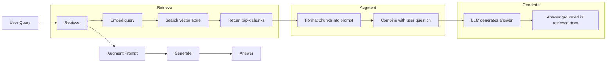
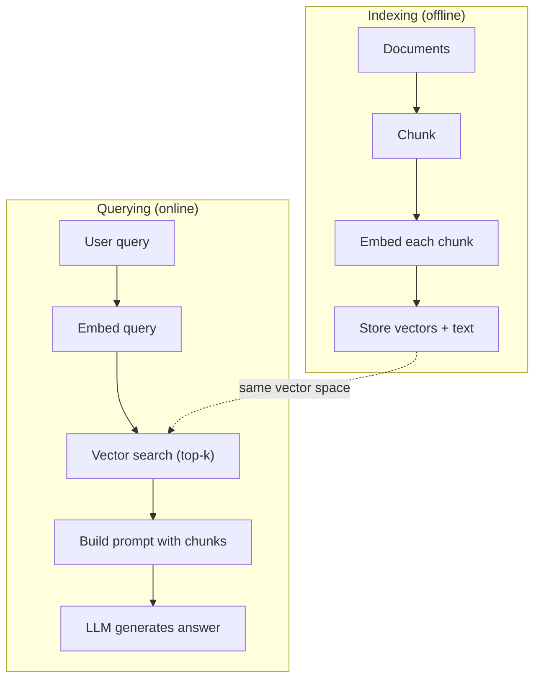

# RAG (Kendirme Geliştirilmiş Nesil)

> LLM'iniz eğitim kesintiye kadar her şeyi biliyor. Şirketinizin belgeleri, kod tabanınız veya geçen haftanın toplantı notları hakkında hiçbir şey bilmiyor. RAG bunu ilgili belgeler toplayarak ve onları tescilde doldurarak çözüyor. Bu üretim AI'de en yaygın bir örnektir. Bu kursdan bir şey inşa ederseniz, bir RAG boru hattı inşa edin.

**Type:** Build
**Languages:** Python
**Prerequisites:** Phase 10 (LLMs from Scratch), Phase 11 Lessons 01-05
**Time:** ~90 minutes
**Related:**5 · 23 aşaması (RAG için parçalanma stratejileri) altı parçalanma algoritması için ve her biri ne zaman kazanır. 5 · 22 aşaması (Embedding Models Deep Dive) yerleştiricileri seçmek için. 11 · 07 aşaması (Advanced RAG) hibrid arama, yeniden sıralama ve sorgu dönüşümü için.

## Öğrenme Hedefleri

- Tam bir RAG boru hattı oluşturun: belge yükleme, parçalanma, yerleştirme, vektör depolama, geri çekme ve oluşturma
- Doğru indeksiyle vektör veritabanı (ChromaDB, FAISS veya Pinecone) kullanarak semantik arama uygulayın
- Bilgiye dayalı uygulamalarda RAG'nin neden ince ayarlamalara tercih edildiğini açıklayın (maliyet, tazelik, atribut)
- RAG kalitesini, geri alma ölçümleri (tamam, geri çağırma) ve üretim ölçümleri (davranışlılık, uygunluk) kullanarak değerlendirmek

## Sorun

Bir müşteriniz "Enterprise planları için geri ödeme politikası nedir?" diye sorar. LLM tipik SaaS geri ödeme politikası hakkında genel bir cevap verir. 200 sayfalık bir iç wiki'de gömülü olan gerçek politika, kurumsal müşterilerin pro-sınıflı geri ödeme ile 60 günlük bir pencere aldığını söyler. LLM bu belgeyi hiç görmedi.

Düzgün ayarlama bir çözümdür. LLM'yi alın, iç belgeleri üzerinde eğitiniz ve güncellenmiş modeli uygulayın. Bu çalışır ama ciddi sorunlara neden olur. Düzgün ayarlama binlerce dolarlık hesaplama maliyetindedir. Bir belge değişirken model eskisine dönüşür. Modelin hangi kaynağı olduğunu bilmenin bir yolu yoktur. Ve şirket gelecek ay başka bir ürün hattı satın alırsa, tekrar düzeltmelisiniz.

RAG diğer çözümdür. Modelle dokunmadan bırakın. Bir soru geldiğinde, belge depolarında ilgili pasajlar aramak, soru öncesi sorguya yapıştırmak ve örnekin bu pasajları bağlam olarak kullanarak cevap vermesine izin verin. Belge depoları dakikalar içinde güncelleyebilir. Tam olarak hangi belgeleri bulduğumu görebilirsiniz. Model asla değişmez. Bu nedenle RAG üretimdeki baskın modeldir: daha ucuz, daha taze, daha denetlenebilir ve herhangi bir LLM ile çalışır.

## Anlaşım

### RAG Şablonu

Tüm bu örneği dört adımda yerleştiriyoruz:



Sorgu -> Al -> Büyütme sorgulaması -> Yükle. Her RAG sistemi bu örneği izler. Üretim RAG sistemleri arasındaki farklar her adımın ayrıntılarında bulunur: nasıl parçalayırsınız, nasıl yerleştirirsiniz, nasıl arıyorsunuz ve nasıl bir sorgu oluşturursunuz.

### RAG Neden İyi Düzenlemeyi Yararlı Kaldı

| Concern | Fine-tuning | RAG |
|---------|------------|-----|
| Cost | $1,000-$100,000+ per training run | $0.01-$0.10 per query (embedding + LLM) |
| Freshness | Stale until retrained | Updated in minutes by re-indexing docs |
| Auditability | Cannot trace answer to source | Can show exact retrieved passages |
| Hallucination | Still hallucinates freely | Grounded in retrieved documents |
| Data privacy | Training data baked into weights | Documents stay in your vector store |

RAG, modelin bağlamını geçici olarak değiştirir. Çoğu uygulama için, geçici bağlam istediğiniz şeydir.

Düzgün ayarlama kazanırken, modelin tek başına uyarma yoluyla elde edilemeyecek belirli bir stil, ton veya mantık kalıbını benimsemesine ihtiyaç duyduğunda.

### Modeller yerleştirmek

Bir yerleştirme modeli metni yoğun bir vektöre dönüştürür. Benzer metinler bu yüksek boyutlu alanda birbirine yakın olan vektörler üretir. "Hadişatimi nasıl yeniden ayarlarım?" ve "Hadişatimi değiştirmem gerekiyor" neredeyse aynı vektörler üretir.

Genel yerleştirme modelleri (2026 dizisi  tam analiz için 5 · 22 aşamasını görün):

| Model | Dimensions | Provider | Notes |
|-------|-----------|----------|-------|
| text-embedding-3-small | 1536 (Matryoshka) | OpenAI | Best price/performance for most use cases |
| text-embedding-3-large | 3072 (Matryoshka) | OpenAI | Higher accuracy, truncatable to 256/512/1024 |
| Gemini Embedding 2 | 3072 (Matryoshka) | Google | Top MTEB retrieval; 8K context |
| voyage-4 | 1024/2048 (Matryoshka) | Voyage AI | Domain variants (code, finance, law) |
| Cohere embed-v4 | 1024 (Matryoshka) | Cohere | Strong multilingual, 128K context |
| BGE-M3 | 1024 (dense + sparse + ColBERT) | BAAI (open-weight) | Three views from one model |
| Qwen3-Embedding | 4096 (Matryoshka) | Alibaba (open-weight) | Top open-weight retrieval score |
| all-MiniLM-L6-v2 | 384 | Open-weight (Sentence Transformers) | Prototyping baseline |

Bu ders için, TF-IDF kullanarak kendi basit gömülümüzi oluşturduk. TF-IDF üretim sistemlerinin kullandığı şey değil, kavramı somutlaştırdığı için: metin girer, vektör çıkar, benzer metinler benzer vektörler üretir.

### vektör benzerliği

İki vektör verildiğinde benzerliği nasıl ölçersiniz?

**Cosine similarity**Bu, iki vektör arasındaki açının kozinüsünü gösterir. -1 (karşıt) ile 1 (tıpkı aynı) arasında değişir. Büyüklüğü görmezden gelir, sadece yönü önemsiyor.

```
cosine_sim(a, b) = dot(a, b) / (||a|| * ||b||)
```

**Dot product**Büyük vektörler daha yüksek puanlar elde eder. Büyüklük bilgi taşıdığı zaman yararlıdır (uzak belgeler daha önemlidir).

```
dot(a, b) = sum(a_i * b_i)
```

**L2 (Euclidean) distance**Vectör alanında düz çizgi mesafe. Daha küçük mesafe = daha benzer. Büyüklük farklarına duyarlı.

```
L2(a, b) = sqrt(sum((a_i - b_i)^2))
```

Kosin benzerliği standarttır. Farklı uzunluklı belgeler ile zarifçe başa çıkar çünkü büyüklüğüyle normalleşir. Biri "vektor arayışı" dediğinde neredeyse her zaman kozine benzerliği kastediyorlar.

### Çürükleme Strategiları

Belgeler tek vektör olarak yerleştirilmek için çok uzun. 50 sayfalık bir PDF, onlarca konu içeren korkunç bir yerleştirme üretebilir. Bunun yerine belgeleri parçalara ayırıp her parça ayrı yerleştirirsiniz.

**Fixed-size chunking**N tokens'i bölün. Basit ve tahmin edilebilir. 50 tokens üst üste olan 512 tokens parçası 1 tokens 0-511, 2 tokens 462-973, vb.

**Semantic chunking**Bu kısımlar, her kısım, tutarlı bir anlam birimidir. Uygulama daha karmaşık ama daha iyi bir geri dönüşüm sağlar.

**Recursive chunking**Bir bölüm hala çok büyükse paragraf sınırlarında bölün. Bir paragraf hala çok büyükse cümle sınırlarında bölün. Bu LangChain RecursiveCharacterTextSplitter yaklaşımı ve pratikte iyi çalışır.

İnsanların düşündüklerinden daha fazla önemli olan parça boyutu:

- Çok küçük (64-128 token): her parça bağlamsız. "Geçen çeyrekte %15 arttı" "bu" neyi kastettiğini bilmeden hiçbir şey ifade etmez.
- Çok büyük (2048+ token): her parça birden fazla konuyu kapsar ve ilgililiği azaltır. Gelir verilerini aradığınızda, gelir hakkında %10 ve işçi sayısı hakkında %90 olan bir parça elde edersiniz.
- Tatlı nokta (256-512 token): özgüvenli olmak için yeterli bağlam, ilgili olmak için yeterince odaklanmış.

Çoğu üretim RAG sistemi, 50 token üst üste olan 256-512 token parçacığını kullanır.

### Vektör Veritabanları

Bir kere yerleştirilmiş olan varsa, depolamak ve arama yapmak için bir yere ihtiyacınız var.

| Database | Type | Best for |
|----------|------|----------|
| FAISS | Library (in-process) | Prototyping, small to medium datasets |
| Chroma | Lightweight DB | Local development, small deployments |
| Pinecone | Managed service | Production without ops overhead |
| Weaviate | Open source DB | Self-hosted production |
| pgvector | Postgres extension | Already using Postgres |
| Qdrant | Open source DB | High-performance self-hosted |

Bu ders için, basit bir hafıza vektör depo oluşturduk. Bir listede vektörleri saklıyor ve kaba kuvvetli kozine benzerlik arayışı yapar. Bu düz bir indeksle FAISS'e eşittir. yavaşlamadan önce belki de 100.000 vektöre kadar ölçebilir. Üretim sistemleri, milisaniyede milyonlarca vektörü aramak için HNSW gibi en yakın komşu (ANN) algoritmalarını kullanır.

### Tam Boru hattı



İndeksleme aşaması her belge başına bir kez (veya belge güncellediğinde) çalışır. Sorgu aşaması her kullanıcı istekinde çalışır. İndeksleme üretiminde saatler içinde milyonlarca belge işleyebilir. Sorgulama bir saniyede cevap vermelidir.

### Gerçek Sayılar

Çoğu üretim RAG sistemi bu parametreleri kullanır:

- **k = 5 to 10**Arama başına alınan parçalar
- **Chunk size = 256 to 512 tokens**50 token üst üste
- **Context budget**: Her sorguda 2500-5000 tane çekirdek alınan içeriği
- **Total prompt**: ~ 8.000-16.000 token (sistem istekleri + alınan parçalar + konuşma geçmişi + kullanıcı sorusu)
- **Embedding dimension**: 384-3072 modelden farklı olarak
- **Indexing throughput**: API yerleştirmeleri ile saniyede 100-1,000 belge
- **Query latency**: 50-200 ms geri almak için, 500-3000 ms üretmek için

```figure
rag-chunking
```

## Yapın

### Adım 1: Belge Çıkartılması

```python
def chunk_text(text, chunk_size=200, overlap=50):
    words = text.split()
    chunks = []
    start = 0
    while start < len(words):
        end = start + chunk_size
        chunk = " ".join(words[start:end])
        chunks.append(chunk)
        start += chunk_size - overlap
    return chunks
```

### Adım 2: TF-IDF yerleştirmeleri

Basit bir gömleyici işlevi oluştururuz. TF-IDF (Term Frequency-Inverse Document Frequency) bir sinirleme gömleyici değil, ancak metni kelime önemini yakalayan bir şekilde vektörlere dönüştürür. Bir belgedeki sık kelimeler daha yüksek TF elde eder. Korpus boyunca nadir kelimeler daha yüksek IDF elde eder. Ürün önemli, ayırt edici kelimelerin yüksek değerleri olan bir vektör verir.

```python
import math
from collections import Counter

def build_vocabulary(documents):
    vocab = set()
    for doc in documents:
        vocab.update(doc.lower().split())
    return sorted(vocab)

def compute_tf(text, vocab):
    words = text.lower().split()
    count = Counter(words)
    total = len(words)
    return [count.get(word, 0) / total for word in vocab]

def compute_idf(documents, vocab):
    n = len(documents)
    idf = []
    for word in vocab:
        doc_count = sum(1 for doc in documents if word in doc.lower().split())
        idf.append(math.log((n + 1) / (doc_count + 1)) + 1)
    return idf

def tfidf_embed(text, vocab, idf):
    tf = compute_tf(text, vocab)
    return [t * i for t, i in zip(tf, idf)]
```

### Adım 3: Kosine benzerliği aramak

```python
def cosine_similarity(a, b):
    dot = sum(x * y for x, y in zip(a, b))
    norm_a = math.sqrt(sum(x * x for x in a))
    norm_b = math.sqrt(sum(x * x for x in b))
    if norm_a == 0 or norm_b == 0:
        return 0.0
    return dot / (norm_a * norm_b)

def search(query_embedding, stored_embeddings, top_k=5):
    scores = []
    for i, emb in enumerate(stored_embeddings):
        sim = cosine_similarity(query_embedding, emb)
        scores.append((i, sim))
    scores.sort(key=lambda x: x[1], reverse=True)
    return scores[:top_k]
```

### Dördüncü Adım: Hızlı İnşaat

RAG'de "genişleştirilen" olayı burada gerçekleşir. Alınan parçaları alın, onları bir istekle biçimlendirin ve verilen bağlamda bulunarak LLM'den cevap vermesini isteyin.

```python
def build_rag_prompt(query, retrieved_chunks):
    context = "\n\n---\n\n".join(
        f"[Source {i+1}]\n{chunk}"
        for i, chunk in enumerate(retrieved_chunks)
    )
    return f"""Answer the question based ONLY on the following context.
If the context doesn't contain enough information, say "I don't have enough information to answer that."

Context:
{context}

Question: {query}

Answer:"""
```

### Adım 5: Tam RAG boru hattı

```python
class RAGPipeline:
    def __init__(self):
        self.chunks = []
        self.embeddings = []
        self.vocab = []
        self.idf = []

    def index(self, documents):
        all_chunks = []
        for doc in documents:
            all_chunks.extend(chunk_text(doc))
        self.chunks = all_chunks
        self.vocab = build_vocabulary(all_chunks)
        self.idf = compute_idf(all_chunks, self.vocab)
        self.embeddings = [
            tfidf_embed(chunk, self.vocab, self.idf)
            for chunk in all_chunks
        ]

    def query(self, question, top_k=5):
        query_emb = tfidf_embed(question, self.vocab, self.idf)
        results = search(query_emb, self.embeddings, top_k)
        retrieved = [(self.chunks[i], score) for i, score in results]
        prompt = build_rag_prompt(
            question, [chunk for chunk, _ in retrieved]
        )
        return prompt, retrieved
```

### Adım 6: Nesil (sümüle)

Bu ders için, en uygun cümleyi alınan bağlamdan çıkararak jenerasyonu simüle ediyoruz.

```python
def simple_generate(prompt, retrieved_chunks):
    query_words = set(prompt.lower().split("question:")[-1].split())
    best_sentence = ""
    best_score = 0
    for chunk in retrieved_chunks:
        for sentence in chunk.split("."):
            sentence = sentence.strip()
            if not sentence:
                continue
            words = set(sentence.lower().split())
            overlap = len(query_words & words)
            if overlap > best_score:
                best_score = overlap
                best_sentence = sentence
    return best_sentence if best_sentence else "I don't have enough information."
```

## Kullan

Gerçek bir gömleyici model ve LLM ile kod neredeyse değişmez:

```python
from openai import OpenAI

client = OpenAI()

def embed(text):
    response = client.embeddings.create(
        model="text-embedding-3-small",
        input=text
    )
    return response.data[0].embedding

def generate(prompt):
    response = client.chat.completions.create(
        model="gpt-4o-mini",
        messages=[{"role": "user", "content": prompt}],
        temperature=0
    )
    return response.choices[0].message.content
```

Veya Anthropic ile:

```python
import anthropic

client = anthropic.Anthropic()

def generate(prompt):
    response = client.messages.create(
        model="claude-sonnet-5",
        max_tokens=1024,
        messages=[{"role": "user", "content": prompt}]
    )
    return response.content[0].text
```

Bu boru hattı aynı. Eklenti işlevini değiştir. Yürütme işlevini değiştir. Alım mantığı, parçalanma, hızlı inşaat - her şey hangi model kullanırsanız kullanın aynı.

Ölçülü vektör depolama için, kaba güç arama işlemini uygun vektör veritabanı ile değiştirin:

```python
import chromadb

client = chromadb.Client()
collection = client.create_collection("my_docs")

collection.add(
    documents=chunks,
    ids=[f"chunk_{i}" for i in range(len(chunks))]
)

results = collection.query(
    query_texts=["What is the refund policy?"],
    n_results=5
)
```

Chroma, yerleşimleri içe ele alır (devayla tüm MiniLM-L6-v2 kullanır) ve vektörleri yerel bir veritabanında saklar.

## Gönder

Bu ders şunları ortaya çıkarır:
- `outputs/prompt-rag-architect.md`-- RAG sistemlerinin özel kullanım durumları için tasarlanması için bir çağrı
- `outputs/skill-rag-pipeline.md`- ...Agentlere RAG boru hattlarını nasıl inşa edip düzeltmeleri öğretecek bir beceri.

## Egzersizler

1. TF-IDF yerleştirmelerini basit bir sözcük çantası yaklaşımı ile değiştirin (biner: kelime mevcutsa 1, yoksa 0). Örnek belgelerdeki çekim kalitesini karşılaştırın. TF-IDF nadir kelimelerin ağırlığı daha yüksek olduğu için daha iyi performans göstermelidir.

2. Parça boyutları ile deneyin: aynı belge seti üzerinde 50, 100, 200 ve 500 kelime deneyin. Her boyut için aynı 5 soruyu çalıştırın ve en üst 3'te ilgili bir parça ne kadar geri döndüğünü sayın.

3. Her parçaya metadata ekleyin (kaynak belgesinin adı, parçacık pozisyonu). Kaynak atributunu dahil etmek için istek şablonunu değiştirin, böylece LLM kaynaklarını belirtir.

4. Basit bir değerlendirme uygulayın: 10 soru- yanıt çiftini vererek, her soruyu RAG borusundan geçirin ve alınan parçaların ne kadar yüzdesi cevabı içerdiğini ölçün.

5. Konuşmayı bilen bir RAG boru hattı oluşturun: son 3 değişimin geçmişini tutun ve alınan parçaların yanında onları istekle ekleyin. Fiyatlandırma hakkında sorduğundan sonra "Enterprise hakkında ne olacak?" gibi takip soruları ile test edin.

## Anahtar Terimler

| Term | What people say | What it actually means |
|------|----------------|----------------------|
| RAG | "AI that reads your docs" | Retrieve relevant documents, paste them into the prompt, and generate an answer grounded in those documents |
| Embedding | "Convert text to numbers" | A dense vector representation of text where similar meanings produce similar vectors |
| Vector database | "Search engine for AI" | A data store optimized for storing vectors and finding the nearest neighbors by similarity |
| Chunking | "Split docs into pieces" | Breaking documents into smaller segments (typically 256-512 tokens) so each can be embedded and retrieved independently |
| Cosine similarity | "How similar are two vectors" | The cosine of the angle between two vectors; 1 = identical direction, 0 = orthogonal, -1 = opposite |
| Top-k retrieval | "Get the k best matches" | Return the k most similar chunks to the query from the vector store |
| Context window | "How much text the LLM can see" | The maximum number of tokens the LLM can process in a single request; retrieved chunks must fit within this |
| Augmented generation | "Answer using given context" | Generating a response using retrieved documents as context rather than relying solely on trained knowledge |
| TF-IDF | "Word importance scoring" | Term Frequency times Inverse Document Frequency; weights words by how distinctive they are within a corpus |
| Indexing | "Preparing docs for search" | The offline process of chunking, embedding, and storing documents so they can be searched at query time |

## Daha Fazla Okumak

- Lewis et al., "Bilgi yoğun NLP görevleri için geri kazanma-yükseltilmiş nesil" (2020) -- Facebook AI Araştırması'ndan gelen orijinal RAG makalesi geri kazanma-sonra üretme örneğini resmileştirdi
- Anthropic'in RAG belgeleri (docs.anthropic.com) - parça boyutları, hızlı inşaat ve değerlendirme için pratik rehberlik
- Pinecone Öğrenme Merkezi, "RAG nedir?" -- RAG borusunun üretim düşünceleri ile ilgili net görsel açıklamalar
- Ceza-BERT: Reimers & Gurevych (2019) -- tüm MiniLM gömleyici modellerinin arkasındaki makale, semantik benzerlik için iki kodlayıcıyı nasıl eğiteceğimizi gösterir
- [Karpukhin et al., "Dense Passage Retrieval for Open-Domain Question Answering" (EMNLP 2020)](https://arxiv.org/abs/2004.04906)- DPR kağıdı yoğun iki kodlayıcı geri alımı kanıtladı BM25 açık alanı QA'da ve modern RAG geri alıcılar için model belirledi.
- [LlamaIndex High-Level Concepts](https://docs.llamaindex.ai/en/stable/getting_started/concepts.html)-- RAG boru hattları inşa ederken bilmesi gereken ana kavramlar: veri yükleyici, düğüm parçalayıcı, indeks, geri alıcı, yanıt sentezleyicileri.
- [LangChain RAG tutorial](https://python.langchain.com/docs/tutorials/rag/)- karşıt tadlı orkestrasyon; aynı geri alın sonra üretilen örneğin bir zincir-of-runnables görünümü.
