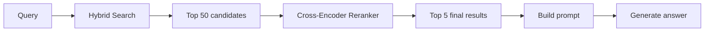
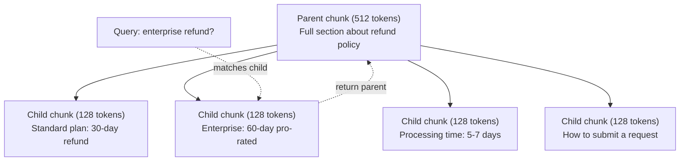
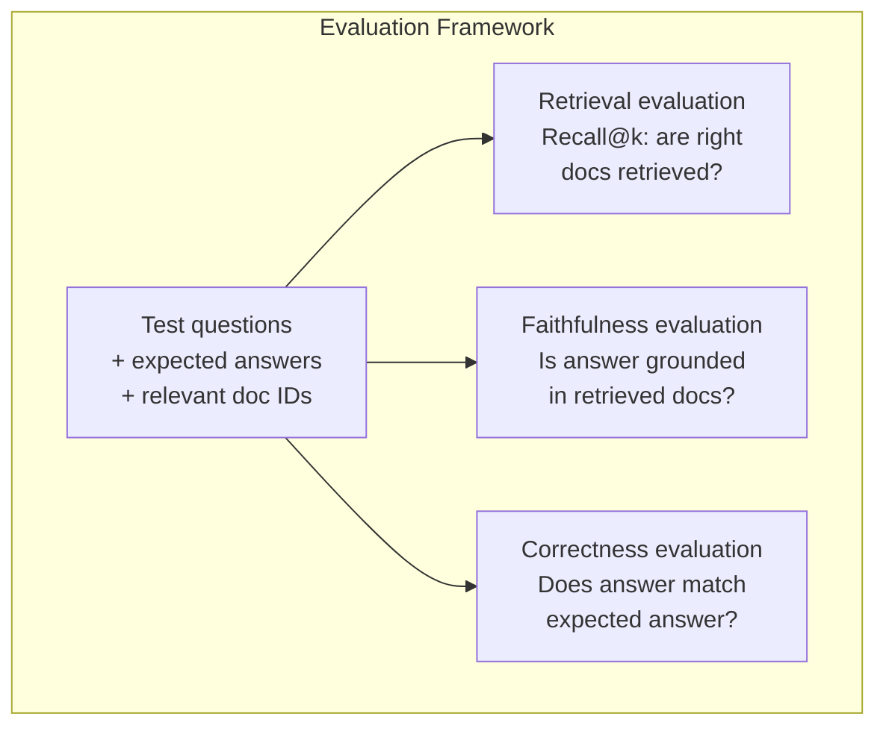

# Gelişmiş RAG (Kürtülme, Yeniden Ranking, İbrid Arama)

> Basik RAG, en benzer parçaları top-k'yi alır. Bu basit sorular için çalışır. Çoklu hop mantıklama, belirsiz sorular ve büyük korpuslar için parçalanır. Gelişmiş RAG, 10 belge üzerinde çalışan bir demo ile 10 milyon üzerinde çalışan bir sistem arasındaki fark.

**Type:** Build
**Languages:** Python
**Prerequisites:** Phase 11, Lesson 06 (RAG)
**Time:** ~90 minutes
**Related:**5 · 23 aşaması (RAG için parçalanma stratejileri) altı parçalanma algoritmasını  rekürsiv, semantik, cümle, ana belge, geç parçalanma, bağlamsal geri alım  vectara/antropik referans değerleriyle kapsar. Bu ders üstü üzerinde inşa edilir: hibrid arama, yeniden sıralama, sorgu dönüşümü.

## Öğrenme Hedefleri

- Doküman yapısını ve bağlamını koruyan gelişmiş parçalanma stratejilerini (semantik, rekürziv, ebeveyn-öğrenç) uygula
- BM25 anahtar kelime eşleşimi ile semantik vektör arama ve çapraz kodlayıcı yeniden sıralamacı birleştiren bir hibrit arama boru oluşturun
- Açıkça bilinmeyen veya karmaşık sorularda geri çekilmeyi geliştirmek için sorgu dönüşüm tekniklerini (HyDE, çok sorgu, geri adım) uygula
- Genel RAG hatalarını teşhis ve düzeltmek: Yanlış parça alınmış, bağlamda cevap verilmemiş, çoklu hop akıl yürütme ayrıntıları

## Sorun

Ders 06'da temel bir RAG boru hattı oluşturdun.

**Ambiguous query**"Geçen çeyrek gelir neydi?" anlamlı arama gelir stratejisi, gelir tahminleri ve CFO'nun gelir büyüme düşüncelerinin parçalarını gönderir. Bunların hepsi anlamlı olarak " gelir " kelimesine benzer.$47.2M in Q3 2025" but uses the word "earnings" instead of "revenue." The embedding model thinks "revenue strategy" is closer to the query than "Q3 earnings were $47.2M.

**Multi-hop question**Bu, her ekibin memnuniyet puanlarını bulmayı, karşılaştırmayı ve maksimum puanı tanımlamayı gerektirir.

**Large corpus problem**Top 5'i bulmanızda # 14, # 89,201, # 1,200,000, # 44, ve # 901,333'ü çekersiniz. Yerleşim alanı yakın, ancak cevap içermeyen. Bu ölçekte, en yakın komşu aramaları ilgili sonuçların üst-k'dan dışarı atılmasına yeterli hata içeriyor.

Temel RAG başarısız olur çünkü vektör benzerliği ile ilgililik aynı şey değildir. Bir parça, bir soruya semantik olarak benzer olabilir ancak cevaplanmak için yararlı değildir. Advanced RAG, dört teknikle bu konuyu ele alıyor: hibrit arama (kilit kelime eşleşmesini ekle), yeniden sıralama (kandidatları daha dikkatli bir şekilde puanlayın), sorgu dönüşümü (soruşmadan önce sorguyu düzeltin) ve daha iyi parçalanma (sağ granularlıkta geri alın).

## Anlaşım

### Hibrit Arama: Semantik + Anahtar Kelime

Semantik arama (vektor benzerliği) anlamı anlamakta iyidir. "Aboneliğimi nasıl iptal edebilirim?" kelimeleri paylaşmasalar da "Planınızı sona erdirme adımları" ile eşleşir. Ama tam eşleşme eksiktir. "E-4021 hata kodu" yerleştirme modeli bu "E-4021" içeren bir parçaya eşleşmeyebilir.

Anahtar kelime arama (BM25) tam tersidir. Tam eşleşmelerde üstünlük sağlar. "E-4021" mükemmel bir eşleşme. Ama belge "planınızı sona erdirin" derse "abonamı iptal edin" sıfır sonuçlar verir.

Hibrit arama her ikisini de çalışır, sonra sonuçları birleştirir.

**BM25**(Best Matching 25) standart anahtar kelime arama algoritmasıdır. 1990'lardan beri arama motorlarının omurgası olmuştur.

```
BM25(q, d) = sum over terms t in q:
    IDF(t) * (tf(t,d) * (k1 + 1)) / (tf(t,d) + k1 * (1 - b + b * |d| / avgdl))
```

tf(t,d) belgede t term frekansı d, IDF(t) ters belge frekansı, \ \ \ \ \ \ \ \ \ \ \ \ \ \ \ \ \ \ \ \ \ \ \ \ \ \ \ \ \ \ \ \ \ \ \ \ \ \ \ \ \ \ \ \ \ \ \ \ \ \ \ \ \ \ \ \ \ \ \ \ \ \ \ \ \ \ \ \ \ \ \ \ \ \ \ \ \ \ \ \ \ \ \ \ \ \ \ \ \ \ \ \ \ \ \ \ \ \ \ \ \ \ \ \ \ \ \ \ \ \ \ \ \ \ \ \ \ \ \ \ \ \ \ \ \ \ \ \ \ \ \ \ \ \ \ \ \ \ \ \ \ \ \ \ \ \ \ \ \ \ \ \ \ \ \ \ \ \ \ \ \ \ \ \ \ \ \ \ \ \ \ \ \ \ \ \ \ \ \ \ \ \ \ \ \ \ \ \ \ \ \ \ \ \ \ \ \ \ \ \ \ \ \ \ \ \ \ \ \ \ \ \ \ \ \ \ \ \ \ \ \ \ \ \ \ \ \ \ \ \ \ \ \ \ \ \ \ \ \ \ \ \ \ \ \ \ \ \ \ \ \ \ \ \ \ \ \ \ \ \ \ \ \ \ \ \ \ \ \ \ \ \ \ \ \ \ \ \ \ \ \ \ \ \ \ \ \ \ \ \ \ \ \ \ \ \ \ \ \ \ \ \ \ \ \ \ \ \ \ \ \ \ \ \ \ \ \ \ \ \ \ \ \ \ \ \ \ \ \ \ \ \ \ \ \ \ \ \ \ \ \ \ \ \ \ \ \ \ \ \ \ \ \ \ \ \ \ \ \ \ \ \ \ \ \ \ \ \ \ \ \ \ \ \ \ \ \ \ \ \ \ \ \ \ \ \ \ \ \ \ \ \ \ \ \ \ \ \ \ \ \ \ \ \ \ \ \ \ \ \ \ \ \ \ \ \ \ \ \ \ \ \ \ \ \ \ \ \ \ \ \ \ \ \ \ \ \ \ \ \ \ \ \ \ \ \ \ \ \ \ \ \ \ \ \ \ \ \ \ \ \ \ \ \ \ \ \ \ \ \ \ \ \ \ \ \ \ \ \ \ \ \ \ \ \

Basit bir şekilde: BM25, sorgu terimleri (özellikle nadir olanlar) içeren belgeler için daha yüksek puanlar verir, ancak tekrarlanan terimler için düşen getiri ile.

### Karşılıklı Rank Füzyonu (RRF)

İki sıralama listesi var: biri vektör arama, biri BM25'ten.

```
RRF_score(d) = sum over rankings R:
    1 / (k + rank_R(d))
```

K'nin en yüksek derecede sıralanan sonucu baskın hale gelmesini engelleyen sabit (genellikle 60).

Vektör aramalarında 1. ve BM25'de 5. sırada bulunan bir belge: 1/(60+1) + 1/(60+5) = 0.0164 + 0.0154 = 0.0318

Vektör aramalarında #3 ve BM25'de #2 sıralı bir belge: 1/(60+3) + 1/(60+2) = 0.0159 + 0.0161 = 0.0320

RRF doğal olarak iki sinyali dengeleir. Her iki listede de yüksek bir sıralama alanı olan bir belge en iyi puan alır. Bir listede # 1 olan ancak diğerinden uzak olan bir belge ortalama puan alır. Bu, çiğ puanlar değil, sıralar kullanıldığı için sağlamdır, bu nedenle iki sistem arasındaki puan dağılımlarındaki farklılıklar önemli değildir.

### Değişiklik

Retrieval (vector, keyword veya hybrid olsun) hızlı ama netsizdir. Bi-encoder kullanır: sorgu ve her belge bağımsız olarak yerleştirilmiştir, sonra karşılaştırılır. Yerleştirmeler bir kez hesaplanır ve önbelleğe alınır. Bu milyonlarca belgeye kadar ölçeklendirilir.

Ranking çapraz kodlayıcıları kullanır: sorgu ve bir aday belgesinin birbiriyle bir bağlantı puanı üreten bir model oluşturulur. Model her iki metni aynı anda görür ve aralarındaki ince tohumlu etkileşimi yakalayabilir. Bir çapraz kodlayıcı, bağlantıyı kaçırmış olsa bile "Q3 kazançları nelerdir?"

İşlem: çapraz kodlayıcılar iki kodlayıcılardan 100-1000 kat daha yavaşdır çünkü soru-doküman çiftini birlikte işliyor. Bir milyon belge için çapraz kodlayıcı puanlarını önceden hesaplayamazsınız. Çözüm: daha büyük bir aday kümesini (hibrid aramalardan en üst-50'i) geri alın, ardından son üst-5'i elde etmek için çapraz kodlayıcı ile yeniden sıralayın.



Genel yeniden sıralama modelleri (2026 sıralaması):
- Kohere Rerank 3.5: yönetilen API, çok dilli, karışık korpuslarda en iyi hatırlama kazancı
- Voyage reranking-2.5: yönetilen API, barındırılan seçeneklerin en düşük gecikmesi
- Jina-Reranker-v2 Çok dilli: açık ağırlıklı, 100+ dil
- bge-re-ranker-v2-m3: açık ağırlıklı, güçlü bir başlangıç çizgisi
- çapraz kodlayıcı/ms-marco-MiniLM-L-6-v2: açık ağırlıklı, prototip oluşturmak için CPU ile çalışır
- ColBERTv2 / Jina-ColBERT-v2: Son etkileşim çok vektör yeniden sıralamaları  O(tokens) not O(docs) not zamanında

### Sorgu dönüşümü

Bazen sorun, geri alım değil, sorunun kendisidir. "Yeni politika değişikliği hakkında bu şey neydi?" korkunç bir arama sorusu.

**Query rewriting**Bu nedenle, bir LLM'nin, kullanıcı sorusunu daha iyi bir arama sorusu haline getirmesi için:

```
User: "What was that thing about the new policy change?"
Rewritten: "Recent policy changes and updates"
```

**HyDE (Hypothetical Document Embeddings)**Sorgu ile arama yerine, bir hipotetik cevap oluşturun, onu yerleştirin ve benzer gerçek belgeler için arama yapın.

```
Query: "What is the refund policy for enterprise?"
Hypothetical answer: "Enterprise customers are eligible for a full refund
within 60 days of purchase. Refunds are pro-rated based on the remaining
subscription period and processed within 5-7 business days."
```

İhtiyacınız olan cevaplar, gerçek cevaplara benzer gerçek belgeler için araştırılmalıdır. İhtiyacınız olan cevaplar, gerçek cevaplara ait alanı yerleştirmek için orijinal sorudan daha yakın bir yerlerde bulunmaktadır. Sorular ve cevaplar farklı dilsel yapıya sahiptir. İhtiyaclı cevaplar oluşturarak, yerleştirme alanındaki "sorun alanı" ve " cevab alanı" arasındaki boşluğu kapatırsınız.

HyDE, geri alımdan önce bir LLM çağrısı ekler. Bu, gecikmeyi 500-2000 ms ile artırır.

### Ebeveyn-Çocuk Çıkışları

Standart parçalanma, bir değişikliği zorlar: doğru bir şekilde alınması için küçük parçalar, yeterli bağlam için büyük parçalar.

İndeks küçük parçalar (128 token) kurtarmak için. Küçük bir parça alınırken, sorgu için ana parçalarını (512 token) geri gönderin. Küçük parça sorguya tam olarak uymaktadır. Ana parça LLM için iyi bir cevap üretmek için yeterli bağlam sağlar.



"Enterprise refund?" sorusu çocuk parçacığı C2'ye tam olarak eşleşiyor. Ama sorgu, işleme süresi ve gönderme süreci hakkında çevredeki bağlamı içeren tam ana parçacığı P'yi alır.

### Metadata Filtrasyonu

Vektör arama işlemini yapmadan önce metadatalar ile metapresini filtreleyin: tarih, kaynak, kategori, yazar, dil. Bu arama alanını azaltır ve alakasız sonuçları önler.

"Geçen ay güvenlik politikasında ne değişiklik oldu?" sadece güvenlik kategorisindeki son 30 günlük belgeler aramalı. Metadata filtresi olmadan, tüm corpus'u ararsınız ve semantik olarak benzer olan 2 yıllık bir güvenlik belgesini bulabilirsiniz.

Üretim RAG sistemleri metadataları her parça ile birlikte saklar: kaynak belge, yaratma tarihi, kategorisi, yazarı, sürümü. Vektör veritabanları, ölçekli performans için kritik olan benzerlik aramanın öncesinde metadata ile filtrelemeyi destekliyor.

### Değerlendirme

Bir RAG sistemi inşa ettiniz.

**Retrieval relevance (Recall@k)**Eğer bir sorunun cevabı bölüm #47'de ise bölüm #47'de ilk 5'te görünür mü?

**Faithfulness**Eğer alınan parçalarda "60 günlük geri ödeme penceresi" ve modelde "90 günlük geri ödeme penceresi" yazıyorsa, bu sadakat başarısızlığıdır.

**Answer correctness**Bu, son-son ölçümdür.Kazanma kalitesi ve üretim kalitesi birleştirir.

Basit bir sadakat kontrolü: oluşturulan yanıtta her iddiayı alın ve alınan parçalarda (temelli olarak) ortaya çıktığını doğrulayın.



```figure
agentic-rag-loop
```

## Yapın

### Adım 1: BM25 Uygulama

```python
import math
from collections import Counter

class BM25:
    def __init__(self, k1=1.2, b=0.75):
        self.k1 = k1
        self.b = b
        self.docs = []
        self.doc_lengths = []
        self.avg_dl = 0
        self.doc_freqs = {}
        self.n_docs = 0

    def index(self, documents):
        self.docs = documents
        self.n_docs = len(documents)
        self.doc_lengths = []
        self.doc_freqs = {}

        for doc in documents:
            words = doc.lower().split()
            self.doc_lengths.append(len(words))
            unique_words = set(words)
            for word in unique_words:
                self.doc_freqs[word] = self.doc_freqs.get(word, 0) + 1

        self.avg_dl = sum(self.doc_lengths) / self.n_docs if self.n_docs else 1

    def score(self, query, doc_idx):
        query_words = query.lower().split()
        doc_words = self.docs[doc_idx].lower().split()
        doc_len = self.doc_lengths[doc_idx]
        word_counts = Counter(doc_words)
        score = 0.0

        for term in query_words:
            if term not in word_counts:
                continue
            tf = word_counts[term]
            df = self.doc_freqs.get(term, 0)
            idf = math.log((self.n_docs - df + 0.5) / (df + 0.5) + 1)
            numerator = tf * (self.k1 + 1)
            denominator = tf + self.k1 * (1 - self.b + self.b * doc_len / self.avg_dl)
            score += idf * numerator / denominator

        return score

    def search(self, query, top_k=10):
        scores = [(i, self.score(query, i)) for i in range(self.n_docs)]
        scores.sort(key=lambda x: x[1], reverse=True)
        return scores[:top_k]
```

### Adım 2: Karşılıklı Rank Füzyonu

```python
def reciprocal_rank_fusion(ranked_lists, k=60):
    scores = {}
    for ranked_list in ranked_lists:
        for rank, (doc_id, _) in enumerate(ranked_list):
            if doc_id not in scores:
                scores[doc_id] = 0.0
            scores[doc_id] += 1.0 / (k + rank + 1)
    fused = sorted(scores.items(), key=lambda x: x[1], reverse=True)
    return fused
```

### Adım 3: Hibrit Arama Pipeline

```python
def hybrid_search(query, chunks, vector_embeddings, vocab, idf, bm25_index, top_k=5, fusion_k=60):
    query_emb = tfidf_embed(query, vocab, idf)
    vector_results = search(query_emb, vector_embeddings, top_k=top_k * 3)
    bm25_results = bm25_index.search(query, top_k=top_k * 3)
    fused = reciprocal_rank_fusion([vector_results, bm25_results], k=fusion_k)
    return fused[:top_k]
```

### Dördüncü Adım: Basit Bir Yeniden Ranker

Üretimde, çapraz kodlama modeli kullanırsınız. Burada, sözcük üst üstelik, terim önemi ve cümle eşleşimi kullanarak sorgu belgesinin bağlamını değerlendiren bir yeniden sıralamacı oluştururuz.

```python
def rerank(query, candidates, chunks):
    query_words = set(query.lower().split())
    stop_words = {"the", "a", "an", "is", "are", "was", "were", "what", "how",
                  "why", "when", "where", "do", "does", "for", "of", "in", "to",
                  "and", "or", "on", "at", "by", "it", "its", "this", "that",
                  "with", "from", "be", "has", "have", "had", "not", "but"}
    query_terms = query_words - stop_words

    scored = []
    for doc_id, initial_score in candidates:
        chunk = chunks[doc_id].lower()
        chunk_words = set(chunk.split())

        term_overlap = len(query_terms & chunk_words)

        query_bigrams = set()
        q_list = [w for w in query.lower().split() if w not in stop_words]
        for i in range(len(q_list) - 1):
            query_bigrams.add(q_list[i] + " " + q_list[i + 1])
        bigram_matches = sum(1 for bg in query_bigrams if bg in chunk)

        position_boost = 0
        for term in query_terms:
            pos = chunk.find(term)
            if pos != -1 and pos < len(chunk) // 3:
                position_boost += 0.5

        rerank_score = (
            term_overlap * 1.0
            + bigram_matches * 2.0
            + position_boost
            + initial_score * 5.0
        )
        scored.append((doc_id, rerank_score))

    scored.sort(key=lambda x: x[1], reverse=True)
    return scored
```

### Adım 5: HyDE (Hypotetic Document Embeddings)

```python
def hyde_generate_hypothesis(query):
    templates = {
        "what": "The answer to '{query}' is as follows: Based on our documentation, {topic} involves specific policies and procedures that define how the process works.",
        "how": "To address '{query}': The process involves several steps. First, you need to initiate the request. Then, the system processes it according to the defined rules.",
        "default": "Regarding '{query}': Our records indicate specific details and policies related to this topic that provide a comprehensive answer."
    }
    query_lower = query.lower()
    if query_lower.startswith("what"):
        template = templates["what"]
    elif query_lower.startswith("how"):
        template = templates["how"]
    else:
        template = templates["default"]

    topic_words = [w for w in query.lower().split()
                   if w not in {"what", "is", "the", "how", "do", "does", "a", "an",
                                "for", "of", "to", "in", "on", "at", "by", "and", "or"}]
    topic = " ".join(topic_words) if topic_words else "this topic"

    return template.format(query=query, topic=topic)


def hyde_search(query, chunks, vector_embeddings, vocab, idf, top_k=5):
    hypothesis = hyde_generate_hypothesis(query)
    hypothesis_emb = tfidf_embed(hypothesis, vocab, idf)
    results = search(hypothesis_emb, vector_embeddings, top_k)
    return results, hypothesis
```

### Adım 6: Ebeveyn-Çocuk Çıkışları

```python
def create_parent_child_chunks(text, parent_size=200, child_size=50):
    words = text.split()
    parents = []
    children = []
    child_to_parent = {}

    parent_idx = 0
    start = 0
    while start < len(words):
        parent_end = min(start + parent_size, len(words))
        parent_text = " ".join(words[start:parent_end])
        parents.append(parent_text)

        child_start = start
        while child_start < parent_end:
            child_end = min(child_start + child_size, parent_end)
            child_text = " ".join(words[child_start:child_end])
            child_idx = len(children)
            children.append(child_text)
            child_to_parent[child_idx] = parent_idx
            child_start += child_size

        parent_idx += 1
        start += parent_size

    return parents, children, child_to_parent
```

### 7 . Adım: Sadakat değerlendirme

```python
def evaluate_faithfulness(answer, retrieved_chunks):
    answer_sentences = [s.strip() for s in answer.split(".") if len(s.strip()) > 10]
    if not answer_sentences:
        return 1.0, []

    grounded = 0
    ungrounded = []
    context = " ".join(retrieved_chunks).lower()

    for sentence in answer_sentences:
        words = set(sentence.lower().split())
        stop_words = {"the", "a", "an", "is", "are", "was", "were", "and", "or",
                      "to", "of", "in", "for", "on", "at", "by", "it", "this", "that"}
        content_words = words - stop_words
        if not content_words:
            grounded += 1
            continue

        matched = sum(1 for w in content_words if w in context)
        ratio = matched / len(content_words) if content_words else 0

        if ratio >= 0.5:
            grounded += 1
        else:
            ungrounded.append(sentence)

    score = grounded / len(answer_sentences) if answer_sentences else 1.0
    return score, ungrounded


def evaluate_retrieval_recall(queries_with_relevant, retrieval_fn, k=5):
    total_recall = 0.0
    results = []

    for query, relevant_indices in queries_with_relevant:
        retrieved = retrieval_fn(query, k)
        retrieved_indices = set(idx for idx, _ in retrieved)
        relevant_set = set(relevant_indices)
        hits = len(retrieved_indices & relevant_set)
        recall = hits / len(relevant_set) if relevant_set else 1.0
        total_recall += recall
        results.append({
            "query": query,
            "recall": recall,
            "hits": hits,
            "total_relevant": len(relevant_set)
        })

    avg_recall = total_recall / len(queries_with_relevant) if queries_with_relevant else 0
    return avg_recall, results
```

## Kullan

Yeniden sıralama için gerçek bir çapraz kodlayıcı ile:

```python
from sentence_transformers import CrossEncoder

reranker = CrossEncoder("cross-encoder/ms-marco-MiniLM-L-6-v2")

def rerank_with_cross_encoder(query, candidates, chunks, top_k=5):
    pairs = [(query, chunks[doc_id]) for doc_id, _ in candidates]
    scores = reranker.predict(pairs)
    scored = list(zip([doc_id for doc_id, _ in candidates], scores))
    scored.sort(key=lambda x: x[1], reverse=True)
    return scored[:top_k]
```

Cohere'nin yönettiği yeniden sıralamacıyla:

```python
import cohere

co = cohere.Client()

def rerank_with_cohere(query, candidates, chunks, top_k=5):
    docs = [chunks[doc_id] for doc_id, _ in candidates]
    response = co.rerank(
        model="rerank-english-v3.0",
        query=query,
        documents=docs,
        top_n=top_k
    )
    return [(candidates[r.index][0], r.relevance_score) for r in response.results]
```

Gerçek bir LLM olan HyDE için:

```python
import anthropic

client = anthropic.Anthropic()

def hyde_with_llm(query):
    response = client.messages.create(
        model="claude-sonnet-5",
        max_tokens=256,
        messages=[{
            "role": "user",
            "content": f"Write a short paragraph that would be a good answer to this question. Do not say you don't know. Just write what the answer would look like.\n\nQuestion: {query}"
        }]
    )
    return response.content[0].text
```

Weaviate ile üretim hibrid arama için:

```python
import weaviate

client = weaviate.connect_to_local()

collection = client.collections.get("Documents")
response = collection.query.hybrid(
    query="enterprise refund policy",
    alpha=0.5,
    limit=10
)
```

Alfa parametresi dengeni kontrol eder: 0.0 = saf anahtar kelime (BM25), 1.0 = saf vektör, 0.5 = eşit ağırlık. Çoğu üretim sistemi 0.3 ile 0.7 arasında alfa kullanır.

## Gönder

Bu ders şunları ortaya çıkarır:
- `outputs/prompt-advanced-rag-debugger.md`-- RAG kalitesi sorunlarını teşhis etmek ve düzeltmek için bir uyarı
- `outputs/skill-advanced-rag.md`-- hibrit arama ve yeniden sıralama ile üretim derecesindeki RAG'leri oluşturma becerisi

## Egzersizler

1. BM25 vs vektör arama vs örneği belgeleri hibrit arama karşılaştırın. 5 test sorgularından her biri için, hangi yaklaşım en ilgili parçayı pozisyon # 1'de geri gönderdiğini kaydetin.

2. Metadata filtresi uygulayın. Her belgeye bir "kategory" alanı ekleyin (güvenlik, faturalama, api, ürün). Vektör arama çalıştırmadan önce, parçaları yalnızca ilgili kategoriye filtreleyin. "Ne şifreleme kullanılır?" ile test edin ve yalnızca güvenlik kategori parçalarını arayanları doğrulayın.

3. Ders 06'dan gelen basit oluştur işlevini kullanarak tam bir HyDE boru hattı oluşturun. Doğrudan sorgu arama ve HyDE arama arasındaki geri alım kalitesini (top-3 bağlamı) karşılaştırın. HyDE tüm 5 test sorgularında sonuçları iyileştirmelidir.

4. Örnek belgelere anne-baba parçalanma stratejisini uygulayın. child_size=30 ve parent_size=100 kullanın. Çocuk parçalara bakarak, fakat sorguda ebeveyn parçalara geri gönderin. Standart parçalanma için oluşturulan cevapları chunk_size=50 ile karşılaştırın.

5. Değerlendirme verileri oluştur: Bilinen cevap parçaları olan 10 sorunun. (a) yalnızca vektör arama, (b) yalnızca BM25, (c) hibrit arama, (d) hibrit + yeniden sıralama için Recall@3, Recall@5 ve Recall@10 ölçümlerini yapın. Sonuçları çizin ve yeniden sıralamaların en çok nereye yardımcı olduğunu belirleyin.

## Anahtar Terimler

| Term | What people say | What it actually means |
|------|----------------|----------------------|
| BM25 | "Keyword search" | A probabilistic ranking algorithm that scores documents by term frequency, inverse document frequency, and document length normalization |
| Hybrid search | "Best of both worlds" | Running semantic (vector) and keyword (BM25) search in parallel, then merging results with rank fusion |
| Reciprocal Rank Fusion | "Merge ranked lists" | Combining multiple ranked lists by summing 1/(k + rank) for each document across all lists |
| Reranking | "Second pass scoring" | Using a more expensive cross-encoder model to re-score a candidate set from initial retrieval |
| Cross-encoder | "Joint query-document model" | A model that takes a query and document as a single input, producing a relevance score; more accurate than bi-encoders but too slow for full corpus search |
| Bi-encoder | "Independent embedding model" | A model that embeds queries and documents independently; fast because embeddings are precomputed, but less accurate than cross-encoders |
| HyDE | "Search with a fake answer" | Generate a hypothetical answer to the query, embed it, and search for real documents similar to it |
| Parent-child chunking | "Small search, big context" | Index small chunks for precise retrieval but return the larger parent chunk to provide sufficient context |
| Metadata filtering | "Narrow before searching" | Filtering documents by attributes (date, source, category) before running vector search to reduce the search space |
| Faithfulness | "Did it stay grounded" | Whether the generated answer is supported by the retrieved documents, as opposed to hallucinated from the model's training data |

## Daha Fazla Okumak

- Robertson & Zaragoza, "The Probabilistic Relevance Framework: BM25 and Beyond" (2009) -- BM25 için kesin referans, formülün arkasındaki olasılık temelleri açıklayan
- Cormack et al., "Reciprocal Rank Fusion Outperforms Condorcet and Individual Rank Learning Methods" (2009) -- daha karmaşık füzyon yöntemlerini yendiğini gösteren orijinal RRF kağıdı
- Gao et al., "Alaqı Etiketleri olmadan Tam Zero-Shot Dense Retrieval" (2022) -- HiDE kağıdı, hipotetik belge gömülmelerinin herhangi bir eğitim verisi olmadan geri almayı iyileştirdiğini göstermektedir
- Nogueira & Cho, "BERT ile Geçit Yeniden Ranklama" (2019) -- BM25'in üstündeki çapraz kodlayıcı yeniden sıralamasını gösterdi
- [Khattab et al., "DSPy: Compiling Declarative Language Model Calls into Self-Improving Pipelines" (2023)](https://arxiv.org/abs/2310.03714)-- hızlı inşaat ve ağırlık seçimi, geri alınma boru hattları üzerinde optimizasyon sorunu olarak değerlendiriyor; bunu "sürekli LLM" yerine "program LLM" için okuyun.
- [Edge et al., "From Local to Global: A Graph RAG Approach to Query-Focused Summarization" (Microsoft Research 2024)](https://arxiv.org/abs/2404.16130)-- GraphRAG kağıdı: Entite ilişkisi çıkarımı + sorgu odaklı özet için Leiden topluluk tespit; küresel vs yerel geri alım ayrımı.
- [Asai et al., "Self-RAG: Learning to Retrieve, Generate, and Critique through Self-Reflection" (ICLR 2024)](https://arxiv.org/abs/2310.11511)- Refleksyon simgelerle kendi kendini değerlendiren RAG; statik geri alım-sonra oluşturma geçişleri ajanlık sınır.
- [LangChain Query Construction blog](https://blog.langchain.dev/query-construction/)-- doğal dil sorgularını yapılandırılmış veritabanı sorgularına (Text-to-SQL, Cypher) nasıl çevirilir.
