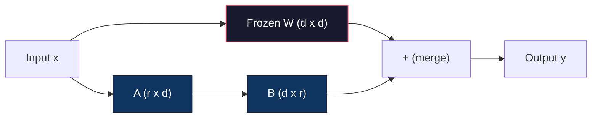
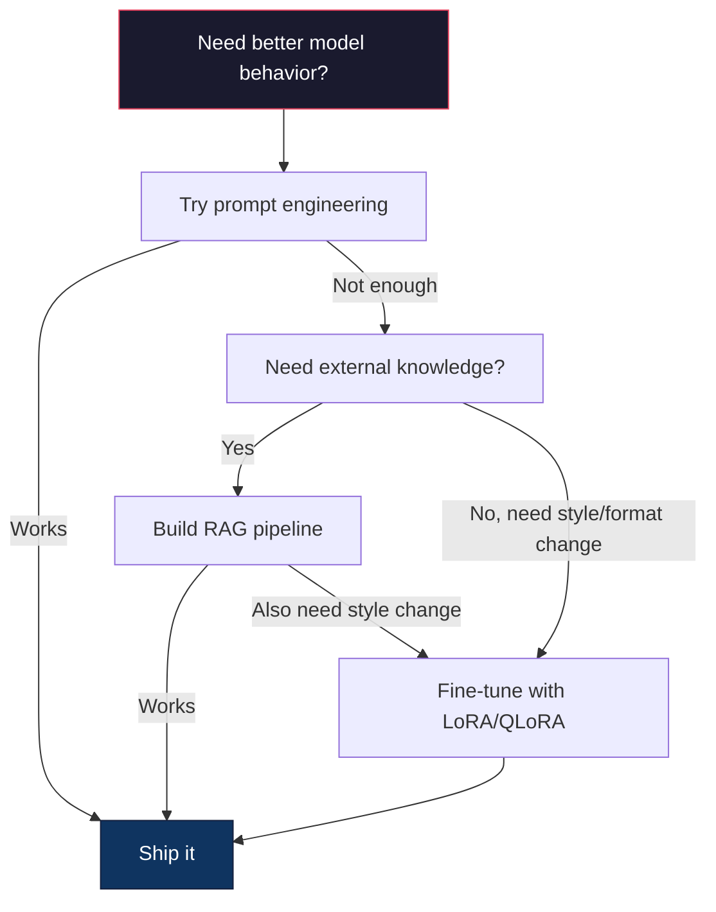

# LoRA ve QLoRA ile ince ayarlama

> 7B modelinin tam ince ayarlaması için 56GB VRAM gereklidir. Bunun için sizde yok. Çoğu şirketde de yok. LoRA aynı modeli 6GB'de aynı parametrelerin %1'inden azını eğiterek ince ayarlamanızı sağlar. Bu bir uzlaşma değil.

**Type:** Build
**Languages:** Python
**Prerequisites:** Phase 10, Lesson 06 (Instruction Tuning / SFT)
**Time:** ~75 minutes
**Related:**Fase 10 sıfırdan SFT/DPO döngüleri kapsar. Bu ders onları 2026 PEFT araç çubuğuna (PEFT, TRL, Unsloth, Axolotl, LLaMA-Factory) bağlar.

## Öğrenme Hedefleri

- LoRA'yı, önceden eğitilmiş bir modelin dikkat katmanlarına düşük sıralama adaptör matrisleri (A ve B) enjekte ederek uygulayın.
- LoRA vs. tam ince ayarlama parametreler tasarrufu hesaplayın: d_model boyutları trenleri d^2 yerine 2*r*d parametreleri ile r sıra
- Bir modelin QLoRA (4 bitli kuantit baz + LoRA adaptörleri) kullanarak tüketicinin GPU belleğine sığması için ince ayarlama yapın
- LoRA ağırlıklarını yeniden dağıtım için temel modeline birleştirin ve adapterlerle ve olmadan sonuç hızı karşılaştırın

## Sorun

Llama 3 8B'nin bir temel modeliniz var. Müşteri desteği biletlerine şirketinizin sesinde cevap vermek istiyorsunuz. SFT cevabı. Ama SFT'nin maliyet sorunu var.

Tam ince ayarlama, modeldeki her parametreyi güncelleyebilir. Llama 3 8B'nin 8 milyar parametre vardır. fp16'da, her parametre 2 byte alır. Bu, ağırlıkları yüklemek için 16GB'dir. Eğitim sırasında, aynı zamanda gradientlere (16GB), Adam için optimizer durumlarına (32GB'ye kadar momentum + varians) ve etkinleştirmelerine ihtiyacınız var.

A100 80GB'lik bir A100, bu kadarı bile bile bile bilebilir.$3-4/hour on cloud providers. Training for 3 epochs on 50,000 examples takes 6-10 hours. That's $Hyperparametreyi doğrulamak için 10 deney yaparsanız, herhangi bir şey kullanmadan önce 400 dolar harcadınız.

Llama 3 70B'ye kadar ölçeyin ve rakamlar saçma olur. 140 GB ağırlıklar için.

Daha derin bir sorun da var. Tam ince ayarlama modelin her ağırlığını değiştirir. Müşteri desteği verilerini ince ayarlarsanız, modelin genel yeteneklerini düşürürsünüz. Buna felaketli unutma deniyor. Model görevinizde daha iyi olur ve diğer her şeyde daha kötü olur.

Daha az parametreyi eğiten, daha az bellek kullanan ve modelin mevcut bilgisini yok etmeyen bir yöntem gerekiyor.

## Anlaşım

### LoRA: Düşük Ranklı Adaptasyon

Edward Hu ve Microsoft'daki meslektaşları Haziran 2021'de LoRA'yı yayınladı. Kağıtın anlayışı: ince ayarlama sırasında ağırlık güncellemeleri düşük özgü bir rütbeye sahiptir. 4096x4096 ağırlık matrisinde 16.7 milyon parametrenizi güncellemeniz gerekmez. Güncellemedeki yararlı bilgileri 16 veya 32 rütbe matrisinden elde edilebilir.

Bu matematik. Standart bir çizgi katman hesaplar:

```
y = Wx
```

W, d_out x d_in matrisi. 4096x4096 dikkat projeksiyonu için, bu 16,777,216 parametre.

LoRA W'yi dondurup düşük derecede parçalanma ekler:

```
y = Wx + BAx
```

Burada B (d_out x r) ve A (r x d_in) olur. r sıra d'den çok daha küçüktür -- tipik olarak 8, 16 veya 32.

R=16 için 4096x4096 katmanında:
- Orijinal parametreler: 4096 x 4096 = 16.777.216
- LoRA parametreleri: (4096 x 16) + (16 x 4096) = 65,536 + 65,536 = 131,072
- Kısıtlama: 131.072 / 16.777.216 = 0.78%

Parametrelerin %0,78'ünü eğitmiş ve kalitenin %95-100'ünü elde etmişsin.



A, rastgele bir Gaussian ile başlatılır. B sıfır ile başlatılır. Bu, LoRA katkı sıfırdan başlar demektir.

### Ölçekleme Faktörü: Alfa

LoRA, düşük sıralama güncelleme çıktıyı ne kadar etkilediğini kontrol eden bir ölçekleme faktörü alfa'yı tanıttı:

```
y = Wx + (alpha / r) * BAx
```

Alfa = r olduğunda, ölçeklendirme 1x. Alfa = 2r (orta standart) olduğunda, ölçeklendirme 2x. Bu hiperparametre LoRA yolunun öğrenme hızını temel öğrenme hızından bağımsız olarak kontrol eder.

Pratik rehberlik:
- alpha = 2 * rank ortak bir topluluk konvensiyonudur (genel makale kullanılmış alpha = rank çoğu deneyde)
- alfa = sıra 1x ölçeklendirme verir, muhafazakâr ama istikrarlı
- Yüksek alfa, adım başına daha büyük güncellemeler anlamına gelir, bu da yakınlaşmayı hızlandırabilir veya istikrarsızlığa neden olabilir

### LoRA Nereye Uygulabilir

Bir transformatörün birçok doğrusal katmanı vardır.

| Target Layers | Trainable Params (7B) | Quality |
|--------------|----------------------|---------|
| q_proj only | 4.7M | Good |
| q_proj + v_proj | 9.4M | Better |
| q_proj + k_proj + v_proj + o_proj | 18.9M | Best for attention |
| All linear (attention + MLP) | 37.7M | Marginal gain, 2x params |

Çoğu görev için tatlı nokta: q_proj + v_proj. Bu, sorgu ve değer projeksiyonlarını kendi dikkatini çekerek, modelin neye katıldığını ve hangi bilgileri çektiğini kontrol eden bir hedef. MLP katmanlarının eklenmesi kod üretimi gibi karmaşık görevlerde yardımcı olur, ancak daha basit görevlerde azalmış getiri için parametrelerin sayısını ikiye katlar.

### Renk Seçimi

R sıra adaptasyonun ifade gücünü kontrol eder:

| Rank | Trainable Params (per layer) | Best For |
|------|---------------------------|----------|
| 4 | 32,768 | Simple classification, sentiment |
| 8 | 65,536 | Single-domain Q&A, summarization |
| 16 | 131,072 | Multi-domain tasks, instruction following |
| 32 | 262,144 | Complex reasoning, code generation |
| 64 | 524,288 | Diminishing returns for most tasks |
| 128 | 1,048,576 | Rarely justified |

Hu et al. r=4'in basit görevler için daha fazla uyarlanma yapıldığını gösterdi. r=8 ve r=16 pratikte en yaygın seçimlerdir. r=64'ten öte gitmek nadiren kaliteyi iyileştirir ve LoRA'nın hafıza avantajını kaybetmeye başlar.

### QLoRA: 4 bitli kuantitasyon + LoRA

Tim Dettmers ve Washington Üniversitesi'ndeki meslektaşları Mayıs 2023'te QLoRA yayınladı.

Bu hafıza denklemini çarpıcı bir şekilde değiştirir:

| Method | Weight Memory (7B) | Training Memory (7B) | GPU Required |
|--------|-------------------|---------------------|-------------|
| Full fine-tune (fp16) | 14GB | ~56GB | 1x A100 80GB |
| LoRA (fp16 base) | 14GB | ~18GB | 1x A100 40GB |
| QLoRA (4-bit base) | 3.5GB | ~6GB | 1x RTX 3090 24GB |

QLoRA üç teknik katkı sağlar:

**NF4 (Normal Float 4-bit)**NF4 16 kuantitasyon düzeylerini standart normal bir dağılımın kuantiteleri üzerinde yerleştirir. Bu, normal olarak dağıtılan veriler için bilgi teorik olarak en iyidir.

**Double quantization**Kvantisalat sabitlerinin kendileri hafıza alır. 64 ağırlıklı her blok fp32 ölçek faktörü (4 byte) gerektirir. 7B modeli için, bu ekstra 0.4GB. Çift kuantisalat bu sabitleri fp8 olarak kuantisalar, genel maliyeti 0.1GB'ye düşürür. Küçük ama toplar.

**Paged optimizers**Eğitim sırasında, optimizer durumları (Adam'ın momentum ve varyansı) uzun dizilerde GPU bellekinden fazla olabilir. Paged optimizerler, NVIDIA'nın birleşik bellekini kullanarak, GPU bellekinin tükeniştiği zaman otomatik olarak optimizer durumlarını CPU RAM'e sayfalar ve gerektiğinde geri sayfalar. Bu, bazı geçiş maliyetleri karşılığında OOM çöküşlerini önler.

### Kalite Sorusu

Parametreyi azaltmak veya tabanı kuantleştirmek kaliteyi zarar veriyor mu?

| Method | MMLU (5-shot) | MT-Bench | HumanEval |
|--------|--------------|----------|-----------|
| Full fine-tune (Llama 2 7B) | 48.3 | 6.72 | 14.6 |
| LoRA r=16 | 47.9 | 6.68 | 14.0 |
| QLoRA r=16 (NF4) | 47.5 | 6.61 | 13.4 |
| QLoRA r=64 (NF4) | 48.1 | 6.70 | 14.2 |

R=16'da LoRA, çoğu referans değerinde tam ince ayarlamaların% 1'inin içinde. R=16'da QLoRA, yüzde bir diğer bölümü kaybeder.

### Gerçek Dünya Masrafları

Llama 3 8B'nin 50.000 örnek üzerinde ince ayarlama yapılması (3 dönem):

| Method | GPU | Time | Cost |
|--------|-----|------|------|
| Full fine-tune | 2x A100 80GB | 8 hours | ~$32 |
| LoRA r=16 | 1x A100 40GB | 4 hours | ~$8 |
| QLoRA r=16 | 1x RTX 4090 24GB | 6 hours | ~$5 |
| QLoRA r=16 (Unsloth) | 1x RTX 4090 24GB | 2.5 hours | ~$2 |
| QLoRA r=16 | 1x T4 16GB | 12 hours | ~$4 |

Tek bir tüketici GPU'sındaki QLoRA öğle yemeğinden daha az malzeme. Bu nedenle açık ağırlıklı ince ayarlama topluluğu 2023'te patladı ve neden altındaki her eğitim çerçevesinin 2026'da varsayılan olarak QLoRA'yı gemiler.

### 2026 PEFT yığın

| Framework | What it is | Pick when |
|-----------|-----------|-----------|
| **Hugging Face PEFT** | The canonical LoRA/QLoRA/DoRA/IA3 library | You want raw control and your training loop is already on `transformers.Trainer` |
| **TRL** | HF's reinforcement-from-feedback trainers (SFT, DPO, GRPO, PPO, ORPO) | You need DPO/GRPO after SFT; built on top of PEFT |
| **Unsloth** | Triton-kernel rewrite of the forward/backward pass | You want 2-5x speedup + half the VRAM with no accuracy loss; Llama/Mistral/Qwen family |
| **Axolotl** | YAML-config wrapper over PEFT + TRL + DeepSpeed + Unsloth | You want reproducible, version-controlled training runs |
| **LLaMA-Factory** | GUI/CLI/API over PEFT + TRL | You want zero-code fine-tuning; 100+ model families supported |
| **torchtune** | Native PyTorch recipes, no `transformers` dep | You want minimal deps and your org already standardizes on PyTorch |

Basamak kuralı: araştırma kullanımı veya tek seferlik deney → PEFT. Tekrarlanabilir üretim boru hattı → Unsloth çekirdekleri etkinleştirilmiş Axolotl. Atılan prototipleme → LLaMA-Factory.

### Adaptörleri Birleştirmek

Eğitimden sonra iki şeyiniz var: dondurulmuş temel model ve küçük bir LoRA adaptörü (genellikle 10-100MB).

1. **Keep them separate**: Temel model yükleyin, üstü adaptörü yükleyin. Farklı görevler için adaptörleri değiştirin.

2. **Merge them permanently**: W' = W + (alfa/r) * BA hesaplayın ve sonucu yeni bir tam model olarak kaydetin. Birleştirilmiş model orijinal ile aynı boyutta. İhtiyaçlı bir sonuç yok. Yönetmek için bir adaptör yok.

Çoklu görevleri (müşteri desteği adaptörü, kod adaptörü, çeviri adaptörü) yerine getirmek için, bunları ayrı tutun. Tek bir uzmanlık modeli dağıtmak için, birleştirin.

Çoklu adaptörleri birleştirmek için gelişmiş birleşme teknikleri:

- **TIES-Merging**(Yadav et al. 2023): Küçük büyüklük parametrelerini keser, işaret çatışmalarını çözür, sonra birleştirilir. Adaptörler arasındaki müdahaleyi azaltır.
- **DARE**Yu ve diğerleri: Adapter parametrelerini birleştirmeden önce rastgele düşürür ve geri kalanını yeniden ölçebilir.
- **Task arithmetic**Adaptör ağırlığını eklemek veya çıkarmak için "kod" adaptörü ve "matematika" adaptörü eklemek genellikle her ikisinde de iyi bir model üretir.

### Ne Zaman Düzene Yapmamak

Düzgün ayarlama üçüncü seçenek, ilk değil.

**First: prompt engineering.**Daha iyi bir sistem uyarısı yazın. Birkaç atış örneği ekleyin. Düşünce zinciri kullanın. Bu hiçbir şey masraf etmez ve dakikalar alır. Eğer uyarı yolu 80% alırsa, muhtemelen ince ayarlama yapmanız gerekmez.

**Second: RAG.**Modelin belirli verilerinizi (belgeler, bilgi tabanı, ürün katalogları) bilmesi gerekiyorsa, bu bilgiyi çekimlere pişirmekten daha ucuz ve daha sürdürülebilir.

**Third: fine-tuning.**Bu, istekle elde edilemeyecek belirli bir stil, biçim veya mantık kalıbını benimsemek için modelin gerek duyduğunda kullanılır. Düzgün yapılandırılmış çıkış gerekildiğinde. Büyük bir modeli daha küçük birine distilletmeniz gerektiğinde. Gecikme önemli olduğunda ve birkaç çekim istekle ekstra jetonları karşılayamadığınızda.



```figure
lora-params
```

## Yapın

LoRA'yı saf PyTorch'ten baştan uyguluyoruz. Kütüphaneler yok. Sihir yok. LoRA katmanını inşa edersin, bir modele enjekte edersin, onu eğitirsin ve ağırlıkları yeniden birleştirirsin.

### Adım 1: LoRA katmanı

```python
import torch
import torch.nn as nn
import math

class LoRALayer(nn.Module):
    def __init__(self, in_features, out_features, rank=8, alpha=16):
        super().__init__()
        self.rank = rank
        self.alpha = alpha
        self.scaling = alpha / rank

        self.A = nn.Parameter(torch.randn(in_features, rank) * (1 / math.sqrt(rank)))
        self.B = nn.Parameter(torch.zeros(rank, out_features))

    def forward(self, x):
        return (x @ self.A @ self.B) * self.scaling
```

A, ölçeklendirilmiş rastgele değerlerle başlatılır. B sıfır ile başlatılır. Ürün BA sıfırdan başlar, bu nedenle model orijinal davranışıyla başlar.

### Adım 2: LoRA-Kötürlü Düzsel Katman

```python
class LinearWithLoRA(nn.Module):
    def __init__(self, linear, rank=8, alpha=16):
        super().__init__()
        self.linear = linear
        self.lora = LoRALayer(
            linear.in_features, linear.out_features, rank, alpha
        )

        for param in self.linear.parameters():
            param.requires_grad = False

    def forward(self, x):
        return self.linear(x) + self.lora(x)
```

Asıl doğrusal katman dondurulmuştur. Sadece LoRA parametreleri (A ve B) eğitilebilir.

### Adım 3: LoRA'yı bir modelde enjekte edin

```python
def inject_lora(model, target_modules, rank=8, alpha=16):
    for param in model.parameters():
        param.requires_grad = False

    lora_layers = {}
    for name, module in model.named_modules():
        if isinstance(module, nn.Linear):
            if any(t in name for t in target_modules):
                parent_name = ".".join(name.split(".")[:-1])
                child_name = name.split(".")[-1]
                parent = dict(model.named_modules())[parent_name]
                lora_linear = LinearWithLoRA(module, rank, alpha)
                setattr(parent, child_name, lora_linear)
                lora_layers[name] = lora_linear
    return lora_layers
```

Önce modeldeki her parametreyi dondur, sonra model ağacını izle, hedef isimlerinize uyan çizgisi katmanları bul ve onları LoRA-bunglu versiyonlarla değiştir. LoRA A ve B matrisleri tüm modelde tek eğitimli parametrelerdir.

### Dördüncü Adım: Parametre Sayın

```python
def count_parameters(model):
    total = sum(p.numel() for p in model.parameters())
    trainable = sum(p.numel() for p in model.parameters() if p.requires_grad)
    frozen = total - trainable
    return {
        "total": total,
        "trainable": trainable,
        "frozen": frozen,
        "trainable_pct": 100 * trainable / total if total > 0 else 0
    }
```

### Adım 5: Ağırlıkları Geri Birleştirin

```python
def merge_lora_weights(model):
    for name, module in model.named_modules():
        if isinstance(module, LinearWithLoRA):
            with torch.no_grad():
                merged = (
                    module.lora.A @ module.lora.B
                ) * module.lora.scaling
                module.linear.weight.data += merged.T
            parent_name = ".".join(name.split(".")[:-1])
            child_name = name.split(".")[-1]
            if parent_name:
                parent = dict(model.named_modules())[parent_name]
            else:
                parent = model
            setattr(parent, child_name, module.linear)
```

Birleştirildikten sonra LoRA katmanları kayboldu. model orijinal ile aynı boyutta ve adapte olarak ağırlıklara pişirilmiştir.

### Adım 6: Simülasyonlu QLoRA Kvantisiasyonu

```python
def quantize_to_nf4(tensor, block_size=64):
    blocks = tensor.reshape(-1, block_size)
    scales = blocks.abs().max(dim=1, keepdim=True).values / 7.0
    scales = torch.clamp(scales, min=1e-8)
    quantized = torch.round(blocks / scales).clamp(-8, 7).to(torch.int8)
    return quantized, scales

def dequantize_from_nf4(quantized, scales, original_shape):
    dequantized = quantized.float() * scales
    return dequantized.reshape(original_shape)
```

Bu, ağırlıkları 64 blok içinde 16 ayrı düzeyde haritaslayarak 4 bit kuantitasyonu simüle eder.

### 7 . Adım: Eğitim Çubuğu

```python
def train_lora(model, data, epochs=5, lr=1e-3, batch_size=4):
    optimizer = torch.optim.AdamW(
        [p for p in model.parameters() if p.requires_grad], lr=lr
    )
    criterion = nn.MSELoss()

    losses = []
    for epoch in range(epochs):
        epoch_loss = 0.0
        n_batches = 0
        indices = torch.randperm(len(data["inputs"]))

        for i in range(0, len(indices), batch_size):
            batch_idx = indices[i:i + batch_size]
            x = data["inputs"][batch_idx]
            y = data["targets"][batch_idx]

            output = model(x)
            loss = criterion(output, y)

            optimizer.zero_grad()
            loss.backward()
            optimizer.step()

            epoch_loss += loss.item()
            n_batches += 1

        avg_loss = epoch_loss / n_batches
        losses.append(avg_loss)

    return losses
```

### Adım 8: Tam Demo

```python
def demo():
    torch.manual_seed(42)
    d_model = 256
    n_classes = 10

    model = nn.Sequential(
        nn.Linear(d_model, 512),
        nn.ReLU(),
        nn.Linear(512, 512),
        nn.ReLU(),
        nn.Linear(512, n_classes),
    )

    n_samples = 500
    x = torch.randn(n_samples, d_model)
    y = torch.randint(0, n_classes, (n_samples,))
    y_onehot = torch.zeros(n_samples, n_classes).scatter_(1, y.unsqueeze(1), 1.0)

    data = {"inputs": x, "targets": y_onehot}

    params_before = count_parameters(model)

    lora_layers = inject_lora(
        model, target_modules=["0", "2"], rank=8, alpha=16
    )

    params_after = count_parameters(model)

    losses = train_lora(model, data, epochs=20, lr=1e-3)

    merge_lora_weights(model)
    params_merged = count_parameters(model)

    return {
        "params_before": params_before,
        "params_after": params_after,
        "params_merged": params_merged,
        "losses": losses,
    }
```

Demo, küçük bir model oluşturur, LoRA'yı iki katmaya enjekte eder, onu eğitir ve ağırlıkları geri birleştirir. Parametre sayısı, LoRA eğitiminde tamamen eğitimlenebilirden ~1%'e düşer ve sonra birleşimden sonra orijinal mimarlığa döner.

## Kullan

"Köme yüz" ekosisteminde, LoRA gerçek bir modelde yaklaşık 20 satır alır:

```python
from transformers import AutoModelForCausalLM, AutoTokenizer
from peft import LoraConfig, get_peft_model, TaskType

model = AutoModelForCausalLM.from_pretrained("meta-llama/Llama-3.1-8B")
tokenizer = AutoTokenizer.from_pretrained("meta-llama/Llama-3.1-8B")

lora_config = LoraConfig(
    task_type=TaskType.CAUSAL_LM,
    r=16,
    lora_alpha=32,
    lora_dropout=0.05,
    target_modules=["q_proj", "v_proj"],
)

model = get_peft_model(model, lora_config)
model.print_trainable_parameters()
```

QLoRA için bit ve byte kuantitasyonu ekleyin:

```python
from transformers import BitsAndBytesConfig

bnb_config = BitsAndBytesConfig(
    load_in_4bit=True,
    bnb_4bit_quant_type="nf4",
    bnb_4bit_compute_dtype=torch.bfloat16,
    bnb_4bit_use_double_quant=True,
)

model = AutoModelForCausalLM.from_pretrained(
    "meta-llama/Llama-3.1-8B",
    quantization_config=bnb_config,
    device_map="auto",
)

model = get_peft_model(model, lora_config)
```

Aynı eğitim döngüsü, aynı veri boru hattı, temel model 4 bitte çalışıyor, LoRA adaptörleri fp16'da çalışıyor ve her şey 6GB'ye uygun.

"Kömeşmek Yüzü Eğitimi" ile eğitim için:

```python
from transformers import TrainingArguments, Trainer
from datasets import load_dataset

dataset = load_dataset("tatsu-lab/alpaca", split="train[:5000]")

training_args = TrainingArguments(
    output_dir="./lora-llama",
    num_train_epochs=3,
    per_device_train_batch_size=4,
    gradient_accumulation_steps=4,
    learning_rate=2e-4,
    fp16=True,
    logging_steps=10,
    save_strategy="epoch",
    optim="paged_adamw_8bit",
)

trainer = Trainer(
    model=model,
    args=training_args,
    train_dataset=dataset,
)

trainer.train()

model.save_pretrained("./lora-adapter")
```

Kaydedilen adaptör 10-100 MB. Temel model dokunulmamış kalır.

## Gönder

Bu ders şunları ortaya çıkarır:
- `outputs/prompt-lora-advisor.md`- LoRA sıralamasını, hedef modüllerini ve belirli görevinin hiperparametrelerini belirlemenize yardımcı olan bir ipucu
- `outputs/skill-fine-tuning-guide.md`- ...bir yetenek ki ajanlara ne zaman ve nasıl ince ayarlama yapmaları için karar ağacını öğretir

## Egzersizler

1. **Rank ablation study.**2., 4., 8., 16., 32. ve 64. sıralar ile gösterge çalıştırın. Son kaybı vs. sıra. Rengi ikiye katlamanın kaybı yarıya indirmediği düşen getiri noktasını bul. 256-dim özellikler üzerinde basit bir sınıflandırma görevi için, bu r = 8-16 civarında olmalıdır.

2. **Target module comparison.**Inject_lora'yı sadece katman "0", sadece katman "2", sadece katman "4" ve üçü için hedeflemek için değiştirin. Her variansı 20 dönem boyunca çalıştırın. Dönüşüm hızını ve son kaybı karşılaştırın. Bu, tüm doğrusal katmanlara karşı q_proj vs v_proj'yi hedefleme konusundaki gerçek kararını yansıtır.

3. **Quantization error analysis.**Eğitimli modelin ağırlık matrislerini önce ve sonra kvantise_to_nf4 / dequantize_from_nf4 alın. Orta kareler hatası, maksimum mutlak hatayı ve orijinal ve yeniden yapılandırılmış ağırlıklar arasındaki ilişkiyi hesaplayın. 32, 64, 128 ve 256'li blok_ boyut değerleriyle deney yapın.

4. **Multi-adapter serving.**İki LoRA adaptörünü farklı veri alt kümelerine (tıpkı indeksler vs. eşsiz indeksler) çalıştırın. Her iki adaptörü kaydetin. Temel modelini bir kez yükleyin, sonra adaptörleri değiştirin ve her birinin aynı giriş üzerinde farklı çıkışlar ürettiğini kontrol edin.

5. **Merge vs. unmerged inference.**Aynı 100 giriş üzerinde merge_lora_weights'ın ön ve sonrasında LoRA modelinin çıkışını karşılaştırın. çıkışların aynı olduğunu kontrol edin (süren nokta toleransının içinde 1e-5).

## Anahtar Terimler

| Term | What people say | What it actually means |
|------|----------------|----------------------|
| LoRA | "Efficient fine-tuning" | Low-Rank Adaptation: freeze base weights, train two small matrices A and B whose product approximates the full weight update |
| QLoRA | "Fine-tune on a laptop" | Quantized LoRA: load the base model in 4-bit NF4, train LoRA adapters in fp16 on top, enabling 7B fine-tuning in 6GB VRAM |
| Rank (r) | "How much the model can learn" | The inner dimension of the A and B matrices; controls expressiveness vs. parameter count |
| Alpha | "LoRA learning rate" | Scaling factor applied to the LoRA output; alpha/r scales the adaptation's contribution to the final output |
| NF4 | "4-bit quantization" | Normal Float 4: a 4-bit data type with quantization levels at normal distribution quantiles, optimal for neural network weights |
| Adapter | "The small trained part" | The LoRA A and B matrices saved as a separate file (10-100MB), loadable on top of any copy of the base model |
| Target modules | "Which layers to LoRA" | The specific linear layers (q_proj, v_proj, etc.) where LoRA adapters are injected |
| Merging | "Bake it in" | Computing W + (alpha/r) * BA and replacing the original weight, eliminating the adapter overhead at inference |
| Paged optimizers | "Don't OOM during training" | Offloading optimizer states (Adam momentum, variance) to CPU when GPU memory is exhausted |
| Catastrophic forgetting | "Fine-tuning broke everything else" | When updating all weights causes the model to lose previously learned capabilities |

## Daha Fazla Okumak

- Hu et al., "LoRA: Low-Rank Adaptation of Large Language Models" (2021) -- GPT-3 175B üzerinde test edilen, düşük derecede 4 derecede düşük derecede olan düşük derecede parçalanma yöntemini tanıtan orijinal makale
- Dettmers et al., "QLoRA: Quantized Language Models'in Verimli FineTuning" (2023) -- NF4, çift kuantitasyon ve sayfalı optimizörler sunar.
- PEFT kütüphane belgeleri (huggingface.co/docs/peft) - Hugging Face ekosistemindeki LoRA, QLoRA ve diğer parametrelerle verimli yöntemler için standart kütüphane
- Yadav et al., "TIES-Merging: Merging Models'de Engelliği Çözmek" (2023) -- Kalite bozulmadan birden fazla LoRA adaptörünü birleştirme teknikleri
- [Rafailov et al., "Direct Preference Optimization: Your Language Model is Secretly a Reward Model" (NeurIPS 2023)](https://arxiv.org/abs/2305.18290)-- DPO'nun çıkarılması; SFT'den sonra gelen tercih ayarlama aşaması, ödül modeli gerekmez.
- [TRL documentation](https://huggingface.co/docs/trl/)-- resmi referans`SFTTrainer`- Evet .`DPOTrainer`- Evet .`KTOTrainer`, ve PEFT/bitsandbytes/Unsloth ile entegrasyon yüzey.
- [Unsloth documentation](https://docs.unsloth.ai/)-- ince ayarlama geçişini ikiye katlayan ve hafıza yarısını azaltan birleşik çekirdekler; TRL altında performans katmanı.
- [Axolotl documentation](https://axolotl-ai-cloud.github.io/axolotl/)-- YAML yapılandırılmış çoklu GPU SFT/DPO/QLoRA eğitmeni; el yazılı senaryolara alternatif olarak yapılandırma kodu.
