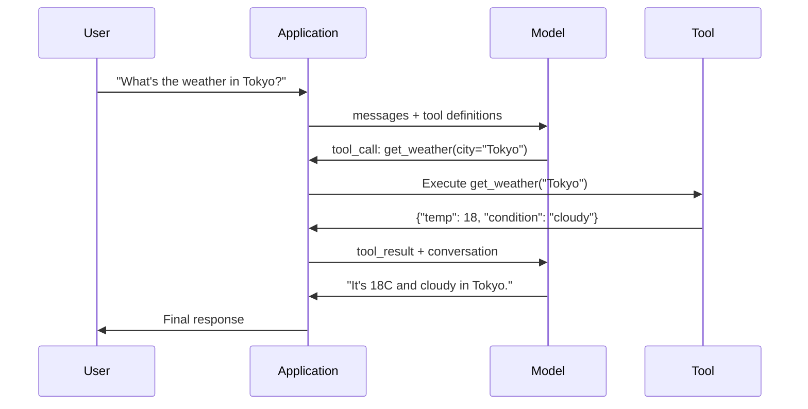

# Fonksiyon Çağrıları ve Araç Kullanımı

> LLM'ler hiçbir şey yapamaz. Metin oluştururlar. Bu tüm yetenekler. Hava durumu kontrol edemezler, veri tabanına sorgu soramazlar, e-posta gönderemezler, kod çalıştıramazlar veya bir dosyayı okuyamayız. Gördüğünüz her "AI ajanı" hangi fonksiyonu arayacağınızı söyleyen JSON üreten bir LLM'dir ve sonra kodunuz aslında onu çağırır. Model beyin. Araçlar eller. Fonksiyon çağrısı onları bağlayan sinir sistemidir.

**Type:** Build
**Languages:** Python
**Prerequisites:** Phase 11 Lesson 03 (Structured Outputs)
**Time:** ~75 minutes
**Related:**Fase 11 · 14 (Model Konteks Protokolü)  bir araç barındırmacılar arasında paylaşıldığında, inline fonksiyon çağrısı ile MCP sunucusuna geçin. Bu ders inline durumu kapsar; MCP protokol durumu kapsar.

## Öğrenme Hedefleri

- Bir fonksiyon çağrı döngüsünü uygulayın: araç şemelerini tanımlayın, modelin araç çağrı JSON'unu analiz edin, fonksiyonları yürütün ve sonuçları geri verin
- Modelle güvenilir bir şekilde başvuruda bulunabilecek açık açıklamalar ve tipi parametre ile tasarım araçları şemeleri
- Karmaşık sorulara cevap vermek için birden fazla fonksiyon çağrısını zincirleyen bir çok dönüş ajan döngüsü oluştur
- Kenarlık durumlarını çağıran işlevleri yönetme: paralel araç çağrıları, hata yayılması ve sonsuz araç döngüslerinin önlenmesi

## Sorun

Bir chatbot oluşturursanız, bir kullanıcı "Şu anda Tokyo'da hava nasıl?" diye sorar.

Model şöyle cevap verir: "Gerçek zamanlı hava verilerine erişim yok, ama mevsimden dolayı Tokyo'nun muhtemelen 15 derece Selsyüs civarında olması... "

Bu bir halüsinasyon, bir sorumluluk dışılığı giyinmiş.Model hava durumu bilmiyor.

Doğru cevap, OpenWeatherMap API'yi arayıp, mevcut sıcaklığı elde etmek ve gerçek sayıyı geri getirmek gerektirir. Model API'yi arayamaz. Kodunuz yapabilir. Eksik olan parça: modelin "Bu argümanlar ile hava API'sini arayım" diyebilmesini ve kodunuzun onu çalıştırmasını ve sonucu geri göndermesini sağlayan bir yapılandırılmış protokol.

Bu fonksiyon çağrısı. Model hangi fonksiyonu hangi argümanlarla çağrılacağını açıklayan yapılandırılmış JSON çıkardı. Uygulama fonksiyonu yürütür. Sonuç sohbete geri döner. Model son cevabını üretmek için sonucu kullanır.

Fonksiyon çağrısı olmadan, LLM'ler ansiklopedi olur.

## Anlaşım

### Çelişki Çekici Fonksiyon

Her araç kullanımı etkileşimi aynı 5 adımlı döngüye uyar.



Adım 1: Kullanıcı bir mesaj gönderir. Adım 2: model, araç tanımları ile birlikte mesajı alır (olunan işlevleri açıklayan JSON Şema). Adım 3: Metin ile cevap vermek yerine, model bir araç çağrısı çıkarır. İşlev adı ve argümanları olan yapılandırılmış JSON nesnesi. Adım 4: kodunuz fonksiyonu yürütür ve sonucu yakalar. Adım 5: sonuç, son cevabını elde etmek için gerçek verilere sahip olan modeline geri döner.

Model hiçbir şeyi yürütmez, sadece neyi çağırıp hangi argümanlarla çağırmaya karar verir.

### Araç Tanımları: JSON Şema Sözleşmesi

Her araç, işlevin ne yaptığını, hangi argümanları aldığını ve bu argümanların hangi türleri olması gerektiğini modeline söyleyen bir JSON Şema ile tanımlanır.

```json
{
  "type": "function",
  "function": {
    "name": "get_weather",
    "description": "Get current weather for a city. Returns temperature in Celsius and conditions.",
    "parameters": {
      "type": "object",
      "properties": {
        "city": {
          "type": "string",
          "description": "City name, e.g. 'Tokyo' or 'San Francisco'"
        },
        "units": {
          "type": "string",
          "enum": ["celsius", "fahrenheit"],
          "description": "Temperature units"
        }
      },
      "required": ["city"]
    }
  }
}
```

- Evet .`description`Bu yöntemler, araçların kullanımı için ne zaman ve nasıl kullanılacağını belirlemek için kullanılır. "Hava durumu" gibi belirsiz bir tanım, "Bir şehir için mevcut hava durumu elde edin. Temperatürü Celsius ve koşullarda geri gönderir". gibi araç seçimi için bir ipucu oluşturur.

### Sağlayıcıların Özetleme

Her büyük sağlayıcı fonksiyon çağrısını destekler, ancak API yüzeyi farklıdır.

| Provider | API Parameter | Tool Call Format | Parallel Calls | Forced Calling |
|----------|--------------|-----------------|---------------|----------------|
| OpenAI (GPT-5, o4) | `tools` | `tool_calls[].function` | Yes (multiple per turn) | `tool_choice="required"` |
| Anthropic (Claude 4.6/4.7) | `tools` | `content[].type="tool_use"` | Yes (multiple blocks) | `tool_choice={"type":"any"}` |
| Google (Gemini 3) | `function_declarations` | `functionCall` | Yes | `function_calling_config` |
| Open-weight (Llama 4, Qwen3, DeepSeek-V3) | Native `tools` on Llama 4; Hermes or ChatML on others | Mixed | Model-dependent | Prompt-based or `tool_choice` if supported |

2026 yılına kadar üç kapalı sağlayıcı neredeyse aynı JSON-Schema tabanlı formatlara birleşti.`tools`OpenAI'nin şekliyle eşleşen alan. Açık ağırlıklı ince tonlar hala değişir  Hermes biçimi (NousResearch) üçüncü taraf ince tonlar için en yaygın olanıdır.

### Araç Seçimi: Otomatik, Gerekli, Özel

Model alet kullanırken sen kontrol ediyorsun.

**Auto**(devayla): model bir aracı çağırmaya mı yoksa doğrudan cevap vermeye mi karar verir. "2+2 nedir?" -- doğrudan cevap verir. "Hava nasıl?" -- aracı çağırır.

**Required**Modelin en az bir aracı çağırması gerekir. Kullanıcının niyetinin bir aracı gerektirdiğini bildiğinizde kullanın. Modelin gerçek verileri aramak yerine tahmin etmesini engeller.

**Specific function**: modelin belirli bir fonksiyonu çağırmasını zorlamak. `tool_choice={"type":"function", "function": {"name": "get_weather"}}`Bu, yönlendirme için kullanın -- yukarı akım mantığı hangi aracı gerekli olduğunu zaten belirlediğinde.

### Paralel Fonksiyon Aramaları

GPT-4o ve Claude birden fazla fonksiyonu tek bir dönüşte çağırabilir. Bir kullanıcı "Tokyo ve New York'ta hava nasıl?" diye sorar.

```json
[
  {"name": "get_weather", "arguments": {"city": "Tokyo"}},
  {"name": "get_weather", "arguments": {"city": "New York"}}
]
```

Kodunuz her ikisini de (ideyal olarak aynı anda) gerçekleştirir, her iki sonucu da gönderir ve model tek bir yanıt sentezler. Bu, dönüş yolculuğunu 2'den 1'e kadar azaltır.

### Yapılandırılmış Çıktırmalar Karşılıklı Fonksiyon Çağrıları

Ders 03 yapılandırılmış çıkışları kapsamaktadır. Fonksiyon çağrısı aynı JSON Şema makinesi kullanır, ancak farklı bir amaçla.

**Structured outputs**: modelin belirli bir şekilinde verileri üretmesini zorlayın.`{name, price, in_stock}`- Evet .

**Function calling**Modelle bir eylem gerçekleştirme niyetini bildirir.`get_weather(city="Tokyo")`-- model bir eylem talep ediyor, son cevabı üretmiyor.

Verileri çıkarmak istediğinizde yapılandırılmış çıkışlar kullanın. Modelin dış sistemlerle etkileşime girmesini istediğinizde fonksiyon çağrısı kullanın.

### Güvenlik: Tartışma dışı Kurallar

Bir LLM'ye verebileceğiniz en tehlikeli yetenek fonksiyon çağrısıdır. Modeldeki araç kümesi neyi gerçekleştirmek istediğini seçer. Eğer araç kümeniz veritabanı sorgularını içerirse, model sorguları oluşturur. Eğer Shell komutlarını içerirse, model bunları yazar.

**Rule 1: Never pass model-generated SQL directly to a database.**Model her satırı geri alan DROP TABLE, UNION enjeksiyonları veya sorguları oluşturabilir ve oluşturacaktır. Her zaman parametreleme yapın. Her zaman doğrulayın. Her zaman işlemlerin izin listesi kullanın.

**Rule 2: Allowlist functions.**Modelle sadece açıkça tanımladığınız fonksiyonları çağırabilirsiniz. Hiç bir generik "bir fonksiyonu isimle çalıştır" aracı yapmayın. Eğer 50 iç fonksiyonu varsa, yalnızca kullanıcının ihtiyaç duyduğu 5'i ortaya çıkarın.

**Rule 3: Validate arguments.**Model şehrin adını geçebilir .`"; DROP TABLE users; --"`. Yürütmeden önce beklenen türlere, aralıklara ve biçimlere karşı her argümanı doğrulayın.

**Rule 4: Sanitize tool results.**Bir araç hassas verileri (API anahtarları, PII, iç hatalar) gönderirse, modeline göndermeden önce filtreleyin.

**Rule 5: Rate limit tool calls.**Bir döngüdeki bir model, araçları yüzlerce kez çağırabilir. En fazla (10-20 arama konuşma başına makul) ayarlayın. Sonsuz döngüleri kırın.

### Hata İşlemesi

Araçlar başarısız oluyor. API'ler zaman kaybı. Veri tabanları çöküyor. Dosyalar yok. Modelle bir araç ne zaman ve neden başarısız olduğunu bilmesi gerekir.

Yapılandırılmış araç sonuçları olarak geri dönüş hataları, istisnalar değil:

```json
{
  "error": true,
  "message": "City 'Toky' not found. Did you mean 'Tokyo'?",
  "code": "CITY_NOT_FOUND"
}
```

Model bunu okuyor, argümanlarını düzeltir ve tekrar dener. Modeller yapılandırılmış hata mesajlarından kendi kendini düzeltmekte iyi. Boş yanıtlardan veya genel "bir şey yanlış gitti" hatalarından kurtulmakta kötüdürler.

### MCP: Model Konektsel Protokol

MCP, Anthropic'in araçlar ile geçiş için açık standartıdır. Her uygulama kendi araçlarını tanımlamak yerine, MCP evrensel bir protokol sunar: araçlar MCP sunucuları tarafından hizmet verilir, MCP istemcileri tarafından tüketilir (örneğin Claude Code, Cursor veya uygulamanız).

Bir MCP sunucusu, araçları herhangi bir uyumlu istemciye açıklayabilir. Postgres MCP sunucusu herhangi bir MCP uyumlu ajan veritabanına erişim sağlar. GitHub MCP sunucusu herhangi bir ajan deposu erişimini sağlar. Araçlar bir kez tanımlanır, her yerde kullanılır.

MCP, HTTP'nin ağlama çağrısı olarak işlev yapmaktır.

```figure
mx-tool-call-loop
```

## Yapın

### Adım 1: Araç Kayıtını Define Et

Her araçta bir JSON Schema tanımlaması (model ne görüyor) ve bir Python fonksiyonu (kodunuzun ne uyguladığını) vardır.

```python
import json
import math
import time
import hashlib


TOOL_REGISTRY = {}


def register_tool(name, description, parameters, function):
    TOOL_REGISTRY[name] = {
        "definition": {
            "type": "function",
            "function": {
                "name": name,
                "description": description,
                "parameters": parameters,
            },
        },
        "function": function,
    }
```

### İkinci Adım: Beş Araç Kullan

Bir hesap makinesi, hava durumu, web arama simülatörü, dosya okuyucu ve kod çalıştırıcı yapın.

```python
def calculator(expression, precision=2):
    allowed = set("0123456789+-*/.() ")
    if not all(c in allowed for c in expression):
        return {"error": True, "message": f"Invalid characters in expression: {expression}"}
    try:
        result = eval(expression, {"__builtins__": {}}, {"math": math})
        return {"result": round(float(result), precision), "expression": expression}
    except Exception as e:
        return {"error": True, "message": str(e)}


WEATHER_DB = {
    "tokyo": {"temp_c": 18, "condition": "cloudy", "humidity": 72, "wind_kph": 14},
    "new york": {"temp_c": 22, "condition": "sunny", "humidity": 45, "wind_kph": 8},
    "london": {"temp_c": 12, "condition": "rainy", "humidity": 88, "wind_kph": 22},
    "san francisco": {"temp_c": 16, "condition": "foggy", "humidity": 80, "wind_kph": 18},
    "sydney": {"temp_c": 25, "condition": "sunny", "humidity": 55, "wind_kph": 10},
}


def get_weather(city, units="celsius"):
    key = city.lower().strip()
    if key not in WEATHER_DB:
        suggestions = [c for c in WEATHER_DB if c.startswith(key[:3])]
        return {
            "error": True,
            "message": f"City '{city}' not found.",
            "suggestions": suggestions,
            "code": "CITY_NOT_FOUND",
        }
    data = WEATHER_DB[key].copy()
    if units == "fahrenheit":
        data["temp_f"] = round(data["temp_c"] * 9 / 5 + 32, 1)
        del data["temp_c"]
    data["city"] = city
    return data


SEARCH_DB = {
    "python function calling": [
        {"title": "OpenAI Function Calling Guide", "url": "https://platform.openai.com/docs/guides/function-calling", "snippet": "Learn how to connect LLMs to external tools."},
        {"title": "Anthropic Tool Use", "url": "https://docs.anthropic.com/en/docs/tool-use", "snippet": "Claude can interact with external tools and APIs."},
    ],
    "MCP protocol": [
        {"title": "Model Context Protocol", "url": "https://modelcontextprotocol.io", "snippet": "An open standard for connecting AI models to data sources."},
    ],
    "weather API": [
        {"title": "OpenWeatherMap API", "url": "https://openweathermap.org/api", "snippet": "Free weather API with current, forecast, and historical data."},
    ],
}


def web_search(query, max_results=3):
    key = query.lower().strip()
    for db_key, results in SEARCH_DB.items():
        if db_key in key or key in db_key:
            return {"query": query, "results": results[:max_results], "total": len(results)}
    return {"query": query, "results": [], "total": 0}


FILE_SYSTEM = {
    "data/config.json": '{"model": "gpt-4o", "temperature": 0.7, "max_tokens": 4096}',
    "data/users.csv": "name,email,role\nAlice,alice@example.com,admin\nBob,bob@example.com,user",
    "README.md": "# My Project\nA tool-use agent built from scratch.",
}


def read_file(path):
    if ".." in path or path.startswith("/"):
        return {"error": True, "message": "Path traversal not allowed.", "code": "FORBIDDEN"}
    if path not in FILE_SYSTEM:
        available = list(FILE_SYSTEM.keys())
        return {"error": True, "message": f"File '{path}' not found.", "available_files": available, "code": "NOT_FOUND"}
    content = FILE_SYSTEM[path]
    return {"path": path, "content": content, "size_bytes": len(content), "lines": content.count("\n") + 1}


def run_code(code, language="python"):
    if language != "python":
        return {"error": True, "message": f"Language '{language}' not supported. Only 'python' is available."}
    forbidden = ["import os", "import sys", "import subprocess", "exec(", "eval(", "__import__", "open("]
    for pattern in forbidden:
        if pattern in code:
            return {"error": True, "message": f"Forbidden operation: {pattern}", "code": "SECURITY_VIOLATION"}
    try:
        local_vars = {}
        exec(code, {"__builtins__": {"print": print, "range": range, "len": len, "str": str, "int": int, "float": float, "list": list, "dict": dict, "sum": sum, "min": min, "max": max, "abs": abs, "round": round, "sorted": sorted, "enumerate": enumerate, "zip": zip, "map": map, "filter": filter, "math": math}}, local_vars)
        result = local_vars.get("result", None)
        return {"success": True, "result": result, "variables": {k: str(v) for k, v in local_vars.items() if not k.startswith("_")}}
    except Exception as e:
        return {"error": True, "message": f"{type(e).__name__}: {e}"}
```

### Adım 3: Tüm araçları kaydet

```python
def register_all_tools():
    register_tool(
        "calculator", "Evaluate a mathematical expression. Supports +, -, *, /, parentheses, and decimals. Returns the numeric result.",
        {"type": "object", "properties": {"expression": {"type": "string", "description": "Math expression, e.g. '(10 + 5) * 3'"}, "precision": {"type": "integer", "description": "Decimal places in result", "default": 2}}, "required": ["expression"]},
        calculator,
    )
    register_tool(
        "get_weather", "Get current weather for a city. Returns temperature, condition, humidity, and wind speed.",
        {"type": "object", "properties": {"city": {"type": "string", "description": "City name, e.g. 'Tokyo' or 'San Francisco'"}, "units": {"type": "string", "enum": ["celsius", "fahrenheit"], "description": "Temperature units, defaults to celsius"}}, "required": ["city"]},
        get_weather,
    )
    register_tool(
        "web_search", "Search the web for information. Returns a list of results with title, URL, and snippet.",
        {"type": "object", "properties": {"query": {"type": "string", "description": "Search query"}, "max_results": {"type": "integer", "description": "Maximum results to return", "default": 3}}, "required": ["query"]},
        web_search,
    )
    register_tool(
        "read_file", "Read the contents of a file. Returns the file content, size, and line count.",
        {"type": "object", "properties": {"path": {"type": "string", "description": "Relative file path, e.g. 'data/config.json'"}}, "required": ["path"]},
        read_file,
    )
    register_tool(
        "run_code", "Execute Python code in a sandboxed environment. Set a 'result' variable to return output.",
        {"type": "object", "properties": {"code": {"type": "string", "description": "Python code to execute"}, "language": {"type": "string", "enum": ["python"], "description": "Programming language"}}, "required": ["code"]},
        run_code,
    )
```

### Dördüncü Adım: Çapı Çapı İşlemi Yapın

Bu çekirdek motor, hangi aracı çağırmaya karar vererek modelin simülasyonunu yapar, aracı çalıştırır ve sonuçları geri gönderir.

```python
def simulate_model_decision(user_message, tools, conversation_history):
    msg = user_message.lower()

    if any(word in msg for word in ["weather", "temperature", "forecast"]):
        cities = []
        for city in WEATHER_DB:
            if city in msg:
                cities.append(city)
        if not cities:
            for word in msg.split():
                if word.capitalize() in [c.title() for c in WEATHER_DB]:
                    cities.append(word)
        if not cities:
            cities = ["tokyo"]
        calls = []
        for city in cities:
            calls.append({"name": "get_weather", "arguments": {"city": city.title()}})
        return calls

    if any(word in msg for word in ["calculate", "compute", "math", "what is", "how much"]):
        for token in msg.split():
            if any(c in token for c in "+-*/"):
                return [{"name": "calculator", "arguments": {"expression": token}}]
        if "+" in msg or "-" in msg or "*" in msg or "/" in msg:
            expr = "".join(c for c in msg if c in "0123456789+-*/.() ")
            if expr.strip():
                return [{"name": "calculator", "arguments": {"expression": expr.strip()}}]
        return [{"name": "calculator", "arguments": {"expression": "0"}}]

    if any(word in msg for word in ["search", "find", "look up", "google"]):
        query = msg.replace("search for", "").replace("look up", "").replace("find", "").strip()
        return [{"name": "web_search", "arguments": {"query": query}}]

    if any(word in msg for word in ["read", "file", "open", "cat", "show"]):
        for path in FILE_SYSTEM:
            if path.split("/")[-1].split(".")[0] in msg:
                return [{"name": "read_file", "arguments": {"path": path}}]
        return [{"name": "read_file", "arguments": {"path": "README.md"}}]

    if any(word in msg for word in ["run", "execute", "code", "python"]):
        return [{"name": "run_code", "arguments": {"code": "result = 'Hello from the sandbox!'", "language": "python"}}]

    return []


def execute_tool_call(tool_call):
    name = tool_call["name"]
    args = tool_call["arguments"]

    if name not in TOOL_REGISTRY:
        return {"error": True, "message": f"Unknown tool: {name}", "code": "UNKNOWN_TOOL"}

    tool = TOOL_REGISTRY[name]
    func = tool["function"]
    start = time.time()

    try:
        result = func(**args)
    except TypeError as e:
        result = {"error": True, "message": f"Invalid arguments: {e}"}

    elapsed_ms = round((time.time() - start) * 1000, 2)
    return {"tool": name, "result": result, "execution_time_ms": elapsed_ms}


def run_function_calling_loop(user_message, max_iterations=5):
    conversation = [{"role": "user", "content": user_message}]
    tool_definitions = [t["definition"] for t in TOOL_REGISTRY.values()]
    all_tool_results = []

    for iteration in range(max_iterations):
        tool_calls = simulate_model_decision(user_message, tool_definitions, conversation)

        if not tool_calls:
            break

        results = []
        for call in tool_calls:
            result = execute_tool_call(call)
            results.append(result)

        conversation.append({"role": "assistant", "content": None, "tool_calls": tool_calls})

        for result in results:
            conversation.append({"role": "tool", "content": json.dumps(result["result"]), "tool_name": result["tool"]})

        all_tool_results.extend(results)
        break

    return {"conversation": conversation, "tool_results": all_tool_results, "iterations": iteration + 1 if tool_calls else 0}
```

### Adım 5: Duruşmanın doğruluğu

Çalıştırmadan önce araç çağrı argümanlarını JSON Şeması ile karşılayan bir onaylayıcı oluşturun.

```python
def validate_tool_arguments(tool_name, arguments):
    if tool_name not in TOOL_REGISTRY:
        return [f"Unknown tool: {tool_name}"]

    schema = TOOL_REGISTRY[tool_name]["definition"]["function"]["parameters"]
    errors = []

    if not isinstance(arguments, dict):
        return [f"Arguments must be an object, got {type(arguments).__name__}"]

    for required_field in schema.get("required", []):
        if required_field not in arguments:
            errors.append(f"Missing required argument: {required_field}")

    properties = schema.get("properties", {})
    for arg_name, arg_value in arguments.items():
        if arg_name not in properties:
            errors.append(f"Unknown argument: {arg_name}")
            continue

        prop_schema = properties[arg_name]
        expected_type = prop_schema.get("type")

        type_checks = {"string": str, "integer": int, "number": (int, float), "boolean": bool, "array": list, "object": dict}
        if expected_type in type_checks:
            if not isinstance(arg_value, type_checks[expected_type]):
                errors.append(f"Argument '{arg_name}': expected {expected_type}, got {type(arg_value).__name__}")

        if "enum" in prop_schema and arg_value not in prop_schema["enum"]:
            errors.append(f"Argument '{arg_name}': '{arg_value}' not in {prop_schema['enum']}")

    return errors
```

### Adım 6: Demo çalıştır

```python
def run_demo():
    register_all_tools()

    print("=" * 60)
    print("  Function Calling & Tool Use Demo")
    print("=" * 60)

    print("\n--- Registered Tools ---")
    for name, tool in TOOL_REGISTRY.items():
        desc = tool["definition"]["function"]["description"][:60]
        params = list(tool["definition"]["function"]["parameters"].get("properties", {}).keys())
        print(f"  {name}: {desc}...")
        print(f"    params: {params}")

    print(f"\n--- Argument Validation ---")
    validation_tests = [
        ("get_weather", {"city": "Tokyo"}, "Valid call"),
        ("get_weather", {}, "Missing required arg"),
        ("get_weather", {"city": "Tokyo", "units": "kelvin"}, "Invalid enum value"),
        ("calculator", {"expression": 123}, "Wrong type (int for string)"),
        ("unknown_tool", {"x": 1}, "Unknown tool"),
    ]
    for tool_name, args, label in validation_tests:
        errors = validate_tool_arguments(tool_name, args)
        status = "VALID" if not errors else f"ERRORS: {errors}"
        print(f"  {label}: {status}")

    print(f"\n--- Tool Execution ---")
    direct_tests = [
        {"name": "calculator", "arguments": {"expression": "(10 + 5) * 3 / 2"}},
        {"name": "get_weather", "arguments": {"city": "Tokyo"}},
        {"name": "get_weather", "arguments": {"city": "Mars"}},
        {"name": "web_search", "arguments": {"query": "python function calling"}},
        {"name": "read_file", "arguments": {"path": "data/config.json"}},
        {"name": "read_file", "arguments": {"path": "../etc/passwd"}},
        {"name": "run_code", "arguments": {"code": "result = sum(range(1, 101))"}},
        {"name": "run_code", "arguments": {"code": "import os; os.system('rm -rf /')"}},
    ]
    for call in direct_tests:
        result = execute_tool_call(call)
        print(f"\n  {call['name']}({json.dumps(call['arguments'])})")
        print(f"    -> {json.dumps(result['result'], indent=None)[:100]}")
        print(f"    time: {result['execution_time_ms']}ms")

    print(f"\n--- Full Function Calling Loop ---")
    test_queries = [
        "What's the weather in Tokyo?",
        "Calculate (100 + 250) * 0.15",
        "Search for MCP protocol",
        "Read the config file",
        "Run some Python code",
        "Tell me a joke",
    ]
    for query in test_queries:
        print(f"\n  User: {query}")
        result = run_function_calling_loop(query)
        if result["tool_results"]:
            for tr in result["tool_results"]:
                print(f"    Tool: {tr['tool']} ({tr['execution_time_ms']}ms)")
                print(f"    Result: {json.dumps(tr['result'], indent=None)[:90]}")
        else:
            print(f"    [No tool called -- direct response]")
        print(f"    Iterations: {result['iterations']}")

    print(f"\n--- Parallel Tool Calls ---")
    multi_city_query = "What's the weather in tokyo and london?"
    print(f"  User: {multi_city_query}")
    result = run_function_calling_loop(multi_city_query)
    print(f"  Tool calls made: {len(result['tool_results'])}")
    for tr in result["tool_results"]:
        city = tr["result"].get("city", "unknown")
        temp = tr["result"].get("temp_c", "N/A")
        print(f"    {city}: {temp}C, {tr['result'].get('condition', 'N/A')}")

    print(f"\n--- Security Checks ---")
    security_tests = [
        ("read_file", {"path": "../../etc/passwd"}),
        ("run_code", {"code": "import subprocess; subprocess.run(['ls'])"}),
        ("calculator", {"expression": "__import__('os').system('ls')"}),
    ]
    for tool_name, args in security_tests:
        result = execute_tool_call({"name": tool_name, "arguments": args})
        blocked = result["result"].get("error", False)
        print(f"  {tool_name}({list(args.values())[0][:40]}): {'BLOCKED' if blocked else 'ALLOWED'}")
```

## Kullan

### OpenAI fonksiyon çağrısı

```python
# from openai import OpenAI
#
# client = OpenAI()
#
# tools = [{
#     "type": "function",
#     "function": {
#         "name": "get_weather",
#         "description": "Get current weather for a city",
#         "parameters": {
#             "type": "object",
#             "properties": {
#                 "city": {"type": "string"},
#                 "units": {"type": "string", "enum": ["celsius", "fahrenheit"]}
#             },
#             "required": ["city"]
#         }
#     }
# }]
#
# response = client.chat.completions.create(
#     model="gpt-4o",
#     messages=[{"role": "user", "content": "Weather in Tokyo?"}],
#     tools=tools,
#     tool_choice="auto",
# )
#
# tool_call = response.choices[0].message.tool_calls[0]
# args = json.loads(tool_call.function.arguments)
# result = get_weather(**args)
#
# final = client.chat.completions.create(
#     model="gpt-4o",
#     messages=[
#         {"role": "user", "content": "Weather in Tokyo?"},
#         response.choices[0].message,
#         {"role": "tool", "tool_call_id": tool_call.id, "content": json.dumps(result)},
#     ],
# )
# print(final.choices[0].message.content)
```

OpenAI , araç çağrılarını  olarak gönderir .`response.choices[0].message.tool_calls`Her çağrının bir numarası var .`id`GPT-4o, bir tek cevapta birden fazla araç çağrısı geri verebilir - hepsini tekrarlayıp uygulayabilir.

### Antropik Araç Kullanımı

```python
# import anthropic
#
# client = anthropic.Anthropic()
#
# response = client.messages.create(
#     model="claude-sonnet-5",
#     max_tokens=1024,
#     tools=[{
#         "name": "get_weather",
#         "description": "Get current weather for a city",
#         "input_schema": {
#             "type": "object",
#             "properties": {
#                 "city": {"type": "string"},
#                 "units": {"type": "string", "enum": ["celsius", "fahrenheit"]}
#             },
#             "required": ["city"]
#         }
#     }],
#     messages=[{"role": "user", "content": "Weather in Tokyo?"}],
# )
#
# tool_block = next(b for b in response.content if b.type == "tool_use")
# result = get_weather(**tool_block.input)
#
# final = client.messages.create(
#     model="claude-sonnet-5",
#     max_tokens=1024,
#     tools=[...],
#     messages=[
#         {"role": "user", "content": "Weather in Tokyo?"},
#         {"role": "assistant", "content": response.content},
#         {"role": "user", "content": [{"type": "tool_result", "tool_use_id": tool_block.id, "content": json.dumps(result)}]},
#     ],
# )
```

Antropic , araç çağrılarını içeriği blokları olarak  ile gönderir .`type: "tool_use"`. Araç sonucu kullanıcı mesajında `type: "tool_result"`Ana farkı dikkat edin: Antropik kullanımları `input_schema`OpenAI kullanırken, araç parametreleri tanımları için `parameters`- Evet .

### MCP Entegreliği

```python
# MCP servers expose tools over a standardized protocol.
# Any MCP-compatible client can discover and call these tools.
#
# Example: connecting to a Postgres MCP server
#
# from mcp import ClientSession, StdioServerParameters
# from mcp.client.stdio import stdio_client
#
# server_params = StdioServerParameters(
#     command="npx",
#     args=["-y", "@modelcontextprotocol/server-postgres", "postgresql://localhost/mydb"],
# )
#
# async with stdio_client(server_params) as (read, write):
#     async with ClientSession(read, write) as session:
#         await session.initialize()
#         tools = await session.list_tools()
#         result = await session.call_tool("query", {"sql": "SELECT count(*) FROM users"})
```

MCP, araç uygulamalarını araç tüketiminden ayırır. Postgres sunucusu SQL'i bilir. GitHub sunucusu API'yi bilir. Ajanınız sadece araçları keşfeder ve arama yapar. Her entegrasyon için sağlayıcı özel kodun gerekmediği için.

## Gönder

Bu ders bize çok yararlı .`outputs/prompt-tool-designer.md`-- bir araç tanımlarını tasarlamak için tekrar kullanılabilir bir istek şablonu. Bir araç ne yapmasını istediğinizin bir açıklamasını verin ve tanımlar, türler ve kısıtlamalar ile birlikte JSON Schema tanımını oluşturur.

Ayrıca üretir `outputs/skill-function-calling-patterns.md`-- üretimdeki görev çağrısını uygulayacak bir karar çerçevesini oluşturur. Bu çerçeve araç tasarımını, hata yönetimini, güvenlik ve tedarikçiye özel kalıpları kapsar.

## Egzersizler

1. **Add a 6th tool: database query.**Bir hafıza tablosu ile simülasyonlanmış bir SQL aracı uygulayın. Araç bir tablo adı ve filtre koşullarını kabul eder (çırın SQL değil). Tablo adı izin listesinde olup olmadığını ve filtre operatörlerinin sınırlı olduğunu doğrulayın `=`- Evet .`>`- Evet .`<`- Evet .`>=`- Evet .`<=`- Uygun satırları JSON olarak geri gönder.

2. **Implement retry with error feedback.**Bir araç çağrısı başarısız olduğunda (örneğin şehir bulunamadığında), hata mesajını model karar fonksiyonuna geri gönderin ve argümanlarını düzeltmesine izin verin. Her çağrının kaç tekrar çalışmasını takip edin.

3. **Build a multi-step agent.**Bazı sorular zincirleme araç çağrılarını gerektirir: "Konfigüratör dosyasını okuyun ve bana hangi modelin yapılandırıldığını söyleyin, sonra da o modelin fiyatlandırmasını webte arayın".

4. **Measure tool selection accuracy.**30 test sorguunu, beklenen araç isimleriyle oluşturun. Her 30 üzerinde karar fonksiyonunu çalıştırın ve doğru araç seçtiği zamanın ne kadar yüzdesini ölçün. Hangi sorguların araçlar arasında en fazla karışıklığa neden olduğunu belirleyin.

5. **Implement tool call caching.**Aynı araç 60 saniye içinde aynı argümanlar ile çağrılırsa, yeniden çalıştırmak yerine önbelleğe alınan sonucu geri gönderin.`(tool_name, frozenset(args.items()))`20 soruyla bir konuşmada cache çarpma oranlarını ölç.

## Anahtar Terimler

| Term | What people say | What it actually means |
|------|----------------|----------------------|
| Function calling | "Tool use" | The model outputs structured JSON describing a function to invoke with specific arguments -- your code executes it, not the model |
| Tool definition | "Function schema" | A JSON Schema object describing a tool's name, purpose, parameters, and types -- the model reads this to decide when and how to use the tool |
| Tool choice | "Calling mode" | Controls whether the model must call a tool (required), may call a tool (auto), or must call a specific tool (named) |
| Parallel calling | "Multi-tool" | The model outputs multiple tool calls in a single turn, reducing round trips -- GPT-4o and Claude both support this |
| Tool result | "Function output" | The return value from executing a tool, sent back to the model as a message so it can use real data in its response |
| Argument validation | "Input checking" | Verifying that model-generated arguments match the expected types, ranges, and constraints before executing the tool |
| MCP | "Tool protocol" | Model Context Protocol -- Anthropic's open standard for exposing tools via servers that any compatible client can discover and call |
| Agent loop | "ReAct loop" | The iterative cycle of model-decides-tool, code-executes-tool, result-feeds-back until the model has enough information to respond |
| Tool poisoning | "Prompt injection via tools" | An attack where tool results contain instructions that manipulate the model's behavior -- sanitize all tool outputs |
| Rate limiting | "Call budget" | Setting a maximum number of tool calls per conversation to prevent infinite loops and runaway API costs |

## Daha Fazla Okumak

- [OpenAI Function Calling Guide](https://platform.openai.com/docs/guides/function-calling)-- GPT-4o ile araç kullanımı için kesin referans, paralel çağrılar, zorla çağrılar ve yapılandırılmış argümanlar dahil
- [Anthropic Tool Use Guide](https://docs.anthropic.com/en/docs/tool-use)-- Claude'un araç kullanımı uygulaması input_schema, multi-tool cevapları ve tool_choice yapılandırması ile
- [Model Context Protocol Specification](https://modelcontextprotocol.io)-- Sunucu/klient mimarisi ile AI uygulamaları arasında araçların birlikte çalışması için açık standart
- [Schick et al., 2023 -- "Toolformer: Language Models Can Teach Themselves to Use Tools"](https://arxiv.org/abs/2302.04761)-- Dış araçları ne zaman ve nasıl çağırılacağını belirlemek için LLM'lerin eğitimiyle ilgili temel kağıt
- [Patil et al., 2023 -- "Gorilla: Large Language Model Connected with Massive APIs"](https://arxiv.org/abs/2305.15334)-- halüsinasyon azaltımıyla 1,645 API'de doğru API çağrıları için ince ayarlama LLM 'leri
- [Berkeley Function Calling Leaderboard](https://gorilla.cs.berkeley.edu/leaderboard.html)-- gerçek zamanlı bir referans değerinin GPT-4o, Claude, Gemini ve açık modeller arasında doğru çağrı fonksiyonları karşılaştırması
- [Yao et al., "ReAct: Synergizing Reasoning and Acting in Language Models" (ICLR 2023)](https://arxiv.org/abs/2210.03629)- Düşünce- eylem- gözlem döngüsü, her araç çağrısının etrafındaki dış ajan döngüsü; bu dersin sona erdiği yerde, 14. aşama başlar.
- [Anthropic — Building effective agents (Dec 2024)](https://www.anthropic.com/research/building-effective-agents)-- beş yapılandırılabilir desen (sürekli zincirleme, yönlendirme, paralelleştirme, orkestrasyon-işçiler, değerlendirme-optimallaştırıcı) tek araç kullanımı ilkelinden inşa edilmiş.
