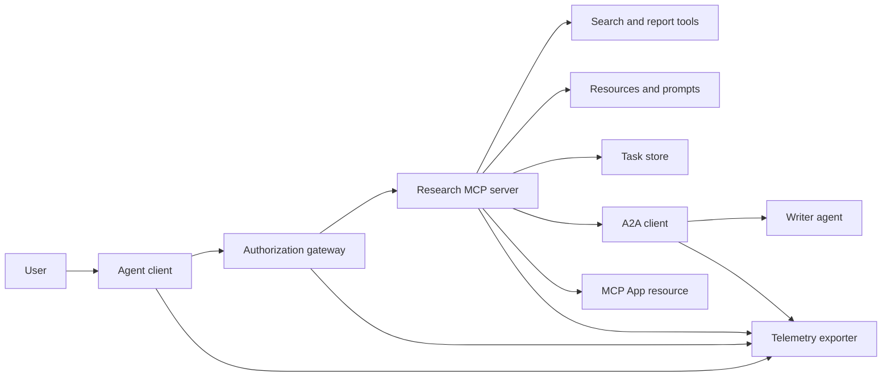
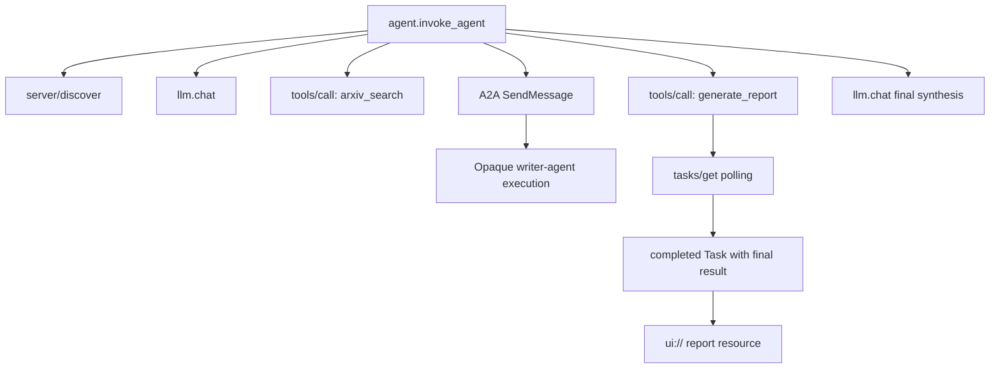
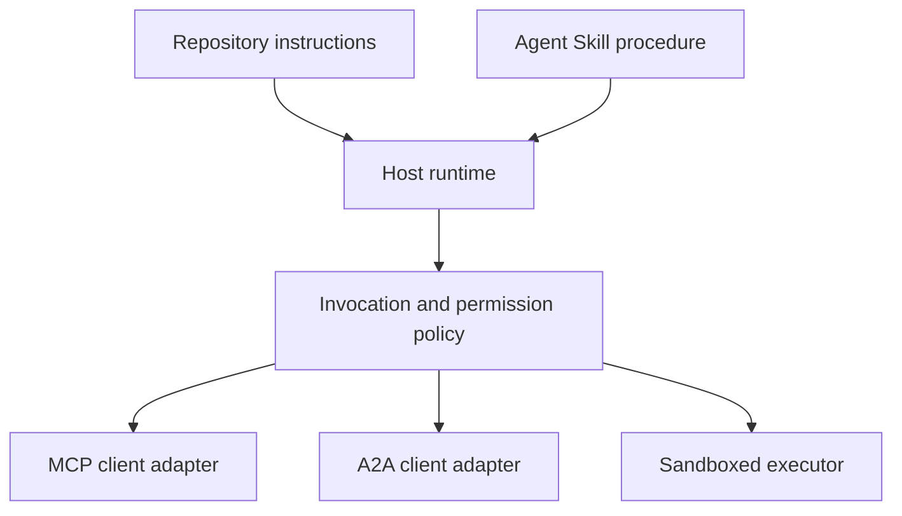

# Kap taşı: İnsansız Alet Ekosistemi

> Bir üretim ajanı sistemi, bir özellik kümesi değil, bir sınır kümesi. Bu kapak taşı, gerçek bir dağıtım için hala gerekli olan protokol müşterilerinden, yetki sunucularından, kum kutularından ve telemetri ihracatçılarından okunur bir süreç simülasyonunu ayırır.

**Type:** Build
**Languages:** Python (stdlib, in-process simulation)
**Prerequisites:** Phase 13 · 01 through 22, using MCP revision `2026-07-28`
**Time:** ~120 minutes

## Öğrenme Hedefleri

- Araç çağrılarını, görev şeklinde sonuçları, devredilen iş, UI kaynakları, yetki politikalarını ve izleme kayıtlarını tek akışta oluşturun.
- Bir bağlantı oturumuna güvenmek yerine, her MCP talebinde protokol versiyonu, istemci kimliği ve özellikleri taşıyın.
- Kullanmadan önce bir sunucu keşfedin ve resmi Görevler uzantısı üzerinden uzun çalışmalar sürün.
- Bir protokol şeklinde simülasyonun MCP, A2A, OAuth veya OpenTelemetry uygulamasından ayırt edilmesi.
- Her simülasyon sınırını, onu değiştirmesi gereken üretim bileşenine harekete geçirin.
- - Tutun .`AGENTS.md`, bir ajan yeteneği, çalıştırma zaman adaptörleri, araçlar ve güvenlik politikası doğru rollerinde.
- Hangi iddiaların yerel çıkışlardan doğrulanabileceğini ve hangilarının canlı entegrasyon testlerine ihtiyaç duyduğunu açıklayın.

## Sorun

Araştırma ve raporlama sistemi tasarlayın. Bir kullanıcı ajan protokolleri üzerine makaleler istiyor. Sistem bir kağıt katalogunu arıyor, özetlemeyi delegeler ediyor, bir rapor oluşturur, bir UI kaynağı gönderir ve sistemi geçiş yolunu kaydeder.

Bu cümle birkaç bağımsız sözleşmeyi gizler:

- model açısından bir araç şeması;
- Devletsiz bir talep zarfı ve sunucu keşif sözleşmesi;
- aktör, kapsam ve araç kimliği için bir geçit kararı;
- Uzun süreli bir operasyon sözleşmesi;
- bir delegasyon protokolü;
- host ile uygulama arasında bir köprü;
- izler yayılması ve ihracatı;
- tekrar kullanılabilir bir işletim prosedürü.

`code/main.py`Bu sistem, normal Python fonksiyonları ve sözlüklerle bu sınırları görünür tutmaktadır. Bir taşımacılığı açmaz, arXiv ile iletişime geçmez, OAuth yapmaz, A2A sunucusu aramaz, bir MCP uygulamasını oluşturmaz veya uzaktan ölçümler çıkarmaz. Bu, kontrol akışını uyumlu bir hizmet olarak simülasyon sunmadan denetmeyi kolaylaştırır.

## Anlaşım

### Hedef mimarisi



Mimarlık, kamu protokol modellerinin kavramsal bir bileşimi.

### Hedef izleri



Gerçek bir uygulamada, her hop iz bağlamını yayar. İsim ve özellikler seçilen aletleme sürümü tarafından desteklenen OpenTelemetry semantik sözleşmelerini takip etmelidir. Paylaşılan iz tanımlayıcısı tek başına doğru bir ebeveynlik, ihracat veya arka uç alımını kanıtlamaz.

### Geçerli protokol yüzeyleri

Geçerli protokol tarafından tanımlanan yöntem isimlerini kullanın, eski bir taslaktaki hatırlanan isimleri kullanmayın:

| Boundary | Current surface | What the capstone simulates |
|---|---|---|
| MCP discovery | Mandatory `server/discover` | A direct function returning versions, capabilities, and server identity |
| MCP request context | Version, capabilities, and client identity in every `params._meta` | Fresh request metadata passed to every simulated call |
| MCP tool call | `tools/call` | Direct Python function dispatch |
| MCP task polling | `io.modelcontextprotocol/tasks` with `tasks/get` | A working handle followed by a completed task carrying its final result |
| A2A delegation | `SendMessage` in gRPC and JSON-RPC; `POST /message:send` in HTTP+JSON | One nested span with no remote call or artificial delay |
| MCP App calling a server tool | `app.callServerTool({ name, arguments })` | An HTML string with no live bridge |
| OAuth authorization | Authorization server, protected-resource metadata, audience and scope validation | Static token lookup and scope membership |
| OpenTelemetry | SDK, propagator, exporter, and collector or backend | In-memory span dictionaries |

Protokol isimleri sadece ilk katmandır. Üretim testleri gerçek tel boyunca serileşme, kimlik doğrulama hataları, iptal, zaman çıkışı, tekrar deneme ve sürüm uyumluluğunu uygulamalıdır.

### İttifaksiz MCP entegrasyon sınırını değiştirir

Dönüşüm`2026-07-28`protokol seanslarını ve `initialize`- Ne ?`notifications/initialized`El sıkışması.`Mcp-Session-Id`Her talepte bu isim boşluğu vardır .`_meta`alanlar:

```json
{
  "io.modelcontextprotocol/protocolVersion": "2026-07-28",
  "io.modelcontextprotocol/clientCapabilities": {
    "extensions": {
      "io.modelcontextprotocol/tasks": {}
    }
  },
  "io.modelcontextprotocol/clientInfo": {
    "name": "capstone-client",
    "version": "1.0.0"
  }
}
```

Sunucu uygulamalıdır `server/discover`. Sıradan sonuçlar kullanımı `resultType: "complete"`; görev elini kullanır `resultType: "task"`. Her sonuç , sunucuyu `_meta.io.modelcontextprotocol/serverInfo`- Evet .

Görev uzatılması `tasks/get`- Evet .`tasks/update`ve`tasks/cancel`Bir alet önce dönebilir .`resultType: "task"`- ...`tasks/get`Kendisi döner.`resultType: "complete"`, ve tamamlanmıştır .`Task`Son sonuç içerir.`tasks/result`ve `tasks/list`Bu yöntemler mevcut uzantı için geçerli değildir.`io.modelcontextprotocol/tasks`Bu işlem, görev eleştiriciyi aynı talepte alabilir.`-32021`- Evet .`requiredCapabilities`Klantı yeteneği nesnesi şeklinde şekillendirilen,  dahil`extensions.io.modelcontextprotocol/tasks`- Evet .

### Güvenlik duruşu

Planlanan yerleşim, derin savunma kullanıyor:

- Müşteri türünün gerektirdiği PKCE ile OAuth yetkisi;
- İletişim tokenleri için kaynak ve kitle bağlanması;
- talep edilen araç ve kapsamı kontrol eden RBAC geçit sistemi;
- Modelle görebilen bağlamın dışında bulunan yukarıdaki kimlikler;
- Dökme veya inceleme yapılmış bir araç tanımlama manifisti;
- Güvenilmeyen girişler, hassas veriler ve sonuçta uygulanan eylemler için ikinci kural değerlendirilmesi;
- Dosya sistemi, işlem, ağ, yetenek ve kaynak sınırlarının yetkinliğinden dışarı uygulanması gereken bir yürütme kum kutusu.

Demo sadece statik tokenler, kapsam kontrolleri ve açıklama hashleri uyguluyor.

### Bilgiler, yolculuk değil, prosedürdür.

Bir Ajan Yetenekli, araştırma iş akışını nasıl gerçekleştirilmesi gerektiğini, hangi araç kontratlarını bekleyeceğini, hangi kanıtları kaydetmesi gerektiğini ve ne zaman durması gerektiğini çalıştırma süresine söyleyebilir.



Bu eski kap taşındaki düz eser, bir ev sahibi'nin taşınabilir bir paket koruduğunu kanıtlayan bir ders planı değildir. 24 ila 27 dersleri, tüm paket yaşam döngüsünü oluşturur ve test eder.

### Kurs artifekti metadataları yerel bir adaptördür

Kurs katalogu ve kurulum cihazı , `skill-*.md`Bu ders, taşınabilir kimlik alanlarını ve ders katalog alanlarını aynı seviyede tutar:

```yaml
---
name: ecosystem-blueprint
description: Produce a full Phase 13 ecosystem architecture for a product need.
version: "1.0.0"
phase: "13"
lesson: "23"
tags: [mcp, capstone, ecosystem, architecture, a2a, otel]
---
```

`name`ve `description`taşınabilir kimlik alanları. `version`- Evet .`phase`- Evet .`lesson`ve`tags`Kurs analizörü için gerekli olan ders özel katalog uzantılarıdır.`tags`Bir çizgi listesi olarak.`--tag capstone`- Ben de eşleşebilirim.

Uygulanabilir bir dizin yeteneği seçeneği kullanabilir `metadata`İpucu değerli uzatma verileri için haritaya.`metadata`Bu dosya yuvaları varsa, bu depoya göre bir kataloğu var.`version`veya `tags`Aşağıda`metadata`Bu nedenle, YAML'nin en küçük analizörü bu açarları atlıyor, katalog boş bir sürüm kaydediyor ve etiket filtresi eseri bulamıyor.

### Simülasyon ile üretim

| Layer | `code/main.py` | Production replacement | Required evidence |
|---|---|---|---|
| Discovery | `server_discover()` plus static `TOOLS` | `server/discover` followed by cache-aware `tools/list` | Wire transcript, deterministic order, and schema validation |
| Authentication | Token-keyed dictionary | OAuth authorization and resource server validation | Issuer, audience, scope, expiry, and failure tests |
| Authorization | Scope membership | Gateway policy bound to actor, tool, target, and tenant | Allow and deny audit cases |
| Search | Static paper fixtures | Search API or MCP server | Source provenance, ranking, and error tests |
| Tasks | Local handle plus immediate `tasks/get` | Durable `io.modelcontextprotocol/tasks` store with `tasks/get`, `tasks/update`, `tasks/cancel`, and TTL | State-transition, input, cancellation, and recovery tests |
| Delegation | Sleep plus nested span | A2A client and remote Agent Card | Contract, timeout, retry, and opacity tests |
| App | HTML string and URI | MCP Apps resource and `App` bridge | CSP, permissions, tool-call, and browser tests |
| Telemetry | In-memory list | OTel SDK and exporter | Collector receipt and trace-parent assertions |
| Sandbox | None | Host-enforced isolated executor | Escape, egress, secret, and resource-limit tests |

Bu tablo, teslimat sınırı. Yeşil yerel bir koşuş sadece simülasyonu onaylar.

### 13. aşama haritası

| Lessons | Contribution |
|---|---|
| 01-05 | Tool interfaces, calls, schemas, structured results, and deterministic validation |
| 06-14 | Stateless MCP request envelopes, discovery, transports, resources, prompts, extensions, and Apps |
| 15-18 | Poisoning defenses, OAuth, gateways, registries, and production authentication |
| 19 | A2A message and task delegation |
| 20 | OpenTelemetry GenAI trace design |
| 21 | Model-provider routing |
| 22 | Portable skill contract and runtime boundary |

```figure
t3-capstone-chain
```

## Yapın

İşlem sırasında harman çalıştır:

```bash
cd phases/13-tools-and-protocols/23-capstone-tool-ecosystem
python3 code/main.py
```

Beş şeyi kontrol et:

1. `server/discover`reklamlar revisyon `2026-07-28`Ve Görevler uzantısı.
2. Alice bir rapor okuyabilir ve oluşturabilirken Bob'un yazılı çağrısı reddedilmiştir.
3. Bir orkestratör çalışmasında her yerel uzantı bir iz kimliği paylaşır ve ana uzantı kimlikleri kaydeder.
4. Rapor görevden başlıyor.`tasks/get`sonuç sonuçta metin ve bir `ui://`referans.
5. Görevli yazar, orkeströrün sadece sınır aralığını kaydetmesi için açık değildir.
6. Hiçbir çıkış ağ bağlantısı, OAuth değişimi, kolektor ihracatı, tarayıcı gösterimi veya kum kutu icrası meydana geldiğini iddia etmiyor.

Senaryo iki kez çalışır, bu yüzden iki kök iz üretir. Denetim girişleri süreç-yerel ve bir sonraki çalışmada yeniden ayarlanır.

## Kullan

Bir katman bir seferde destekleyin:

1. Değiştir `server_discover()`ve real ile statik araç listesi`server/discover`ve `tools/list`Her istek için versiyon, kimlik ve özellikleri gönderin.
2. Statik tokenleri yetki sunucusu ve korunan kaynak doğrulama ile değiştirin.
3. `io.modelcontextprotocol/tasks`Uzatma ve test`tasks/get`- Evet .`tasks/update`- Evet .`tasks/cancel`, Timeout, TTL ve Recovery'ı yeniden başlat.`tasks/result`veya `tasks/list`- Evet .
4. Delegasyon çubuğunu A2A istemcisiyle değiştirin. Bu bir ajan kartını çözer ve bir mesaj gönderir.
5. Uygulama resmi SDK ile oluşturun ve sunucu araçlarını  üzerinden arayın`app.callServerTool`- Evet .
6. Test toplayıcıya ihracat süreleri ve alıcıda aileyi belirten.
7. Ders 26'dan Sandbox sözleşmesinin içinde araç ve senaryo çalıştırma.
8. Proseduru tam bir dizin paketine birleştirin ve Ders 27'nin çıkış kapısını geçin.

Her promosyon yeni sınırları geçen bir entegrasyon testi gerektirir.

## Gönder

Bu ders bize çok yararlı .`outputs/skill-ecosystem-blueprint.md`Bu, primitifleri, güvenlik, delegasyon, telemetri, ambalaj ve en zor işletim riskini kapsayan bir sayfa mimarisi için talep eder.

Bu bir dizin paket olmadığı için referansları, senaryoları, varlıkları veya değerlendirme ayarlarını taşıyamıyor. Bu kurs dışında tekrar kullanılabilir bir beceri yayınlarken Ders 22 ve 24 ila 27'den paket biçimini kullanın.

## Egzersizler

1. Çık .`code/main.py`. İsteğe bağlı kanıtlara ihtiyaç duyan üretim iddialarından elde edilen üretim ile kanıtlanmış ayrı gerçekler.
2. İkinci bir statik arka uç ekleyin ve aynı isimli iki araç için çarpışma kuralını tanımlayın.`tools/list`- Çağrılar.
3. Yazarı A2A test sunucusu ile değiştirin.
4. Bir işlem yeniden başlatılmasından sonra hayatta kalan bir görev deposu ekleyin.`tasks/get`Saygı .`pollIntervalMs`, ve tamamlanmış görevin son sonuçlarını okumadan `tasks/result`- Evet .
5. En az bir MCP uygulaması oluşturun ve doğrulayın `app.callServerTool`kısıtlayıcı bir CSP ve açık izinler olan bir tarayıcıda.
6. Simülasyonu bir OTel SDK üzerinden yerel bir koleksiyoncuya aktarın.
7. Yazmın .`AGENTS.md`Değişken araştırma prosedürü için deposu genelinde bakım kuralları ve ayrı bir beceri paketi için.

## Anahtar Terimler

| Term | What people say | What it actually means |
|---|---|---|
| Capstone | "Everything wired together" | A staged integration whose simulated and live boundaries remain explicit |
| Protocol-shaped simulation | "It is basically MCP" | Local data and calls that resemble a protocol without implementing its wire contract |
| Tasks extension | "Long tool call" | An optional `io.modelcontextprotocol/tasks` lifecycle with durable identity, polling, client input, final result, and cancellation semantics |
| Opacity boundary | "The other agent handles it" | The caller sees the declared interface and artifacts, not private reasoning or internal state |
| Runtime adapter | "Skill integration" | Host code that maps portable procedure to discovery, invocation, tools, policy, and context |
| Integration evidence | "It passed" | A transcript, artifact, or receiver-side observation proving the real boundary was crossed |

## Daha Fazla Okumak

- [MCP specification 2026-07-28](https://modelcontextprotocol.io/specification/2026-07-28)İttifaksiz istekler, keşifler, araçlar, yetki ve taşıma davranışları için.
- [MCP 2026-07-28 key changes](https://modelcontextprotocol.io/specification/2026-07-28/changelog)Sessiyon kaldırma, talep başına metadata, MRTR, uzantılar ve geri çekilmeler için.
- [MCP Tasks extension](https://tasks.extensions.modelcontextprotocol.io/specification/draft/tasks)için`tasks/get`- Evet .`tasks/update`- Evet .`tasks/cancel`, ve son sonuçlar için son görevler.
- [MCP Apps SDK](https://github.com/modelcontextprotocol/ext-apps/blob/main/docs/overview.md)için`App`ve `app.callServerTool`- Evet .
- [A2A protocol](https://a2a-protocol.org/latest/)Ajan Kartları, mesaj teslimatı, görevler, eserler ve ulaşım bağları için.
- [OpenTelemetry GenAI semantic conventions](https://opentelemetry.io/docs/specs/semconv/gen-ai/)iz ve özelliği konvansiyonları için.
- [Agent Skills specification](https://agentskills.io/specification)İşlem katmanında kullanılan taşınabilir paket sözleşmesi için.
