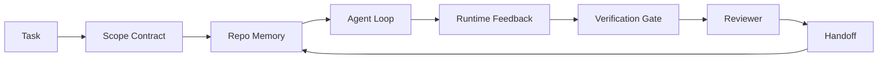

# Ajan Çalışma Masa Mühendisliği: Neden Yetkili Modeller Hala Başarısız

> Güvenilir bir model yeterli değildir. Güvenilir ajanlar bir çalışma tabanına ihtiyaç duyarlar: talimatlar, durum, kapsam, geri bildirim, doğrulama, inceleme ve teslimat. Bunları uzaklaştırın ve hatta sınır modeli, gönderilmeye güvenli olmayan bir iş üretir.

**Type:** Learn + Build
**Languages:** Python (stdlib)
**Prerequisites:** Phase 14 · 01 (Agent Loop), Phase 14 · 26 (Failure Modes)
**Time:** ~45 minutes

## Öğrenme Hedefleri

- İcracılık güvenilirliğinden ayrı bir model kapasitesi.
- Bir ajanın gemiye gitmeyeceğini belirleyen yedi çalışma masası yüzeylerini söyle.
- Sadece bir anlık çalışmayı küçük bir repo görevinde çalışma masasıyla yönlendirilmiş çalışmaya karşılaştırın.
- Kaybolan her yüzeyi neden olduğu semptomla ilgili bir hata modu raporu oluşturun.

## Sorun

Bir sınır modeli gerçek bir repo'ya düşürür ve giriş onayını eklemesini ister. Dört dosya açar, makul kod yazar, başarıyı ilan eder ve durur. Testleri yürütürsünüz. İki başarısız olur. Validasyonla hiçbir ilgisi olmayan üçüncü bir dosya dokunur. Ajanın ne olduğunu, ilk denediğini veya ne yapması gerektiğini kaydetmez.

Python'da model yanlış değildi. İş konusunda yanlıştı. Neyin yapıldığını, nerede yazmasına izin verdiğini, hangi testlerin otoriter olduğunu veya bir sonraki seansın nasıl devam edeceğini bilmiyordu.

Bu bir model hatası değil, bir çalışma masası hatasıdır. Ajanın etrafındaki yüzeyde tek çekim bir jenerasyonu güvenilir, yeniden çalıştırılabilir mühendislik yapan parçalar eksik.

## Anlaşım

Bir çalışma deski, bir görev sırasında modelin sarıldığı çalışma ortamıdır.

| Surface | What it carries | Failure when missing |
|---------|-----------------|----------------------|
| Instructions | Startup rules, forbidden actions, definition of done | Agent guesses what shipping means |
| State | Current task, touched files, blockers, next action | Each session restarts from zero |
| Scope | Allowed files, forbidden files, acceptance criteria | Edits leak into unrelated code |
| Feedback | Real command output captured into the loop | Agent declares success on a 400 |
| Verification | Tests, lint, smoke run, scope check | "Looks good" reaches main |
| Review | A second pass with a different role | Builder marks own homework |
| Handoff | What changed, why, what is left | Next session re-discovers everything |

Çalışma masası modelden bağımsızdır. Model değiştirip yüzeylerini tutabilirsin. Yüzeyleri değiştirip güvenilirliği koruyabilirsin.



Çat tarihi değil, devlet dosyasında bu döngü kapanıyor.

### İş masası vs. hızlı mühendislik

Bu sırada ne istediğinizi modellere söyler. Bir çalışma desti modeline dönüşler boyunca ve seanslar boyunca nasıl çalışıldığını söyler. Çoğu ajan başarısızlık hikayesi, iş desti başarısızlığı kıyafetleri giyerek iş desti.

### İş masası vs. çerçeve

Bir çerçeve size bir çalıştırma süresi verir (LangGraph, AutoGen, Agents SDK). Bir çalışma desti, ajanın çalıştırma süresi içinde çalışması için bir yer sağlar. İkisine de ihtiyacınız var. Bu mini-track ikinci birinden bahsediyor.

### Satıcı taksonomilerinden değil, ilkelerden mantık yürütme

Şu anda "harness mühendisliği" hakkında çok şey yazılıyor. Addy Osmani, OpenAI, Anthropic, LangChain, Martin Fowler, MongoDB, HumanLayer, Augment Code, Thoughtworks, walkinglabs harika listesi ve Medium ve Hacker News parçalarının sürekli davul etmesi hepsini taşıyor. Bir harmanın ne olduğu, kapsamının ne olduğu ve hangi kelime birikimi kullanılması konusunda anlaşmazlık yaşıyorlar. Bir taraf seçmemiz gerekmiyor. Yedi yüzey bir UX katmanıdır; her çalışma masaya altında güvenilir bir arka planı tutan aynı dağıtılmış sistemler ilkeleri seti bulunmaktadır.

Bir ajan çalışması, zaman, süreç ve makineyi kesici hesaplamalardır. Bu güvenilirliği sağlamak için her üretim sisteminin ihtiyaç duyduğu aynı ilkelere ihtiyacınız var.

| Primitive | What it is | What it carries for an agent |
|-----------|------------|------------------------------|
| Function | Typed handler. Pure where possible. Owns its inputs and outputs. | A tool call, a rule check, a verification step, a model invocation |
| Worker | Long-lived process that owns one or more functions and a lifecycle | The builder, the reviewer, the verifier, an MCP server |
| Trigger | Event source that invokes a function | Agent loop tick, HTTP request, queue message, cron, file change, hook |
| Runtime | The boundary that decides what runs where, with what timeouts and resources | Claude Code's process, LangGraph's runtime, a worker container |
| HTTP / RPC | The wire between caller and worker | Tool-call protocol, MCP request, model API |
| Queue | Durable buffer between trigger and worker; back-pressure, retry, idempotency | The task board, the feedback log, the review inbox |
| Session persistence | State that survives crashes, restarts, model swaps | `agent_state.json`, checkpoints, KV stores, the repo itself |
| Authorization policy | Who can call what function with which scope | Allowed/forbidden files, approval boundaries, MCP capability lists |

Şimdi yedi çalışma masası yüzeylerini bu ilkelere yerleştirin.

- **Instructions** politika + fonksiyon metadataları. Kurallar kontroller (fonksiyonlar).`AGENTS.md`) çalıştırma zamanının başlaması ile ilgili bir politika.
- **State** oturum kalıcılığı. Bir anahtarlı depo her adımda çalıştırma süresini okuyor. Dosya, KV veya DB; kalıcılık semantikası önemlidir, depolama arka uçı değil.
- **Scope** görev başına izin politikaları. İzin verilen/ yasaklanan küpleri bir ACL'dir. İzin verilmesi gerekenler bir izin ağıdır.
- **Feedback** Bir sıra yazılmış çağrı kayıtları. Her çağrı kaydıdır, dayanıklıdır, tekrarlanabilir.
- **Verification** bir fonksiyon. Girişler üzerinde belirleyici. Görev kapanırken tetiklenir. Başarısız kapanır.
- **Review** inşaat eserleri üzerinde sadece okuma hakkı ve inceleme raporları üzerinde sadece yazma hakkı olan ayrı bir işçi.
- **Handoff** bir seans sonu tetikleyicisi tarafından yayımlanan dayanıklı bir kayıt.

Ajan döngüsü kendisinde olayları tüketen (kullanıcı mesajı, araç sonucu, zamanlama işaretleri), fonksiyonları çağıran (modeldeki, sonra model seçtiği araçlar), kayıtlar yazar (halkı, geri bildirim) ve tetikleyicileri yayar (kanıtlama, inceleme, teslimat).

### Çevreye dönen kalıplar, ilkelere çevrilmiştir

Her popüler harman örneği sekiz ilkeline düşürülür.

| Vendor or community pattern | What it actually is |
|------------------------------|--------------------|
| Ralph Loop (Claude Code, Codex, agentic_harness book) — re-inject original intent into a fresh context window when the agent tries to stop early | A trigger that re-enqueues a task with a clean context; session persistence carries the goal forward |
| Plan / Execute / Verify (PEV) | Three workers, one per role, communicating via state and a queue between phases |
| Harness-compute separation (OpenAI Agents SDK, April 2026) — split control plane from execution plane | Restating control-plane / data-plane. Predates the agent label by decades |
| Open Agent Passport (OAP, March 2026) — sign and audit every tool call against a declarative policy before execution | An authorization policy enforced by a pre-action worker, with a signed audit queue |
| Guides and Sensors (Birgitta Böckeler / Thoughtworks) — feedforward rules + feedback observability | Authorization policy + verification functions + observability traces |
| Progressive compaction, 5-stage (Claude Code reverse engineering, April 2026) | A state-management worker that runs cron-like over session persistence to keep it within a budget |
| Hooks / middleware (LangChain, Claude Code) — intercept model and tool calls | Triggers + functions wrapped around the runtime's invocation path |
| Skills as Markdown with progressive disclosure (Anthropic, Flue) | A function registry where the function metadata is loaded into context just-in-time |
| Sandbox agents (Codex, Sandcastle, Vercel Sandbox) | The compute plane: a runtime with isolated filesystem, network, and lifecycle |
| MCP servers | Workers exposing functions over a stable RPC, with capability lists as authorization |

Bu tabloda her giriş, dağıtılmış sistemlerde zaten bir isim olan bir primitif'e ulaşan ve yeni bir isim veren ajan topluluğudur. Pazarlama için yararlı etiketler; mühendislik kelime birikimi olarak kullanışlı değil.

### Kitsler aslında ne diyor

Harness-over-model iddiasının arkasında şimdi sayı var. Bilmeye değer, çünkü onlar "sadece daha akıllı bir model bekleyin" karşı tek dürüst bir argüman.

- Terminal Bench 2.0  aynı model, harness değişikliği, bir kodlama ajanını ilk 30'un dışında beşinci sıraya taşıdı (LangChain, *Anatomy of an Agent Harness*).
- Vercel  ajanının araçlarının %80'ini sildi; başarının oranı %80'den %100'e yükseldi (MongoDB).
- Harvey  hukuki ajanlar sadece harness optimizasyonu (MongoDB) ile doğruluğunu ikiye katladı.
- İşletmeci AI ajan projelerinin %88'i üretime ulaşamıyor. Başarısızlıklar, gerekçeler değil çalıştırma süresi ile birleştirilir (preprints.org, *Harness Engineering for Language Agents*, Mart 2026).
- Üç popüler açık kaynak çerçevesinde 2025'te yapılan bir referans çalışması, görev tamamlanmasının %50'sini bildirmiştir; uzun bağlamlı WebAgent, uzun bağlamlı koşullarda %40-50'den %10'a düştü, çoğunlukla sonsuz döngeler ve hedef kaybı (2026'ın başlarında yaygın olarak kapsamlı).

Bu yüzden, modeller zamanla harness oyunlarını yansıtır. Bu gün yük taşıyan mühendislik modelin etrafında değil, içinde ve bu yükü taşıyan ilkeler her üretim sisteminin her zaman ihtiyaç duyduğu şeydir.

### Satıcı yazıları kısa durduğunda

Bu konuda kibar olmana gerek yok.

- LangChain'in *Anatomy of an Agent Harness* on bir bileşen listeler  istekler, araçlar, kancalar, kum kutuları, orkestrasyon, hafıza, beceriler, alt kısımlar ve bir çalıştırma süresi "sahte döngüsü".
- Addy Osmani'nin *Agent Harness Mühendisliği* çerçeveyi yerleştirir.`Agent = Model + Harness`Bu bir takımın nasıl yapıldığını söylemedi.
- Antropic ve OpenAI yüzeylerde en derinlere giderler ancak kendi çalıştırma zamanlarında kalırlar. Nisan 2026 ajanlar SDK'sindeki "harness-compute ayrımı" duyuru, kontrol düzeni / veri düzeni bölünmesini açıkça onaylayan ilk satıcı parçasıdır. Bu bir ilkel fikir, yeni bir fikir değil.
- Agentc_harness kitabı harness'i bir konfigörleme nesnesi olarak değerlendirir (Jaymin West'in *Agentic Engineering*, bölüm 6) ve en güçlü satır "agentc sistemindeki ilk güvenlik sınırı harness"dir.
- Hacker News ipleri aynı yere ulaşmaya devam ediyor. Nisan 2026 ipliği *Agent harnes sandbox dışında yer alır* harnesin "her şeyin dışında oturan ve bağlam ve kullanıcıya göre erişimi izin veren bir hipervizör gibi" oturması gerektiğini savunuyor.

Bu parçaların hiçbirine katılmak zorunda değilsiniz. Boşluğu fark etmek için. Onlar zaten var olan bir sistemin UX tanımlarını yazıyorlar. Biz sistemi yazıyoruz. Sistem doğru inşa edildiğinde, yedi yüzey ilkeden düşer. Yanlış inşa edildiğinde, hiçbir miktar `AGENTS.md`Polish kayıp sırayı düzeltir.

Başka yerlerde "harness mühendisliği" duyarsanız, ilkeler için çevirin. İhtiyarlar ve kurallar politika ve fonksiyonlardır. Scaffolding koşuşturma zamanıdır. Koruma rayları yetki + doğrulama. Haklar tetikleyici. Hatıra, seansın devamlılığıdır. Ralph Loop'un beklenmesi. Yasaklar işçi. Kum kutuları bilgisayar uçakları. Sözcük de değişir, mühendislik de değişmez. İş masası, ajan yüzündeki UX'dir; Arnes, bir sonraki satıcı yeniden çerçevesinden sağ kalan anlamda, işlevler, işçiler, tetikleyiciler, çalışma zamanları, kuyruklar, ısrar ve politikalar doğru şekilde birbirine bağlanmıştır.

```figure
wb-seven-surfaces
```

## Yapın

`code/main.py`Bu program, ilk olarak sadece prompt olarak, sonra yedi yüzey ile kablolu bir şekilde çalıştırılır. Aynı model, aynı görev.

Repo görevi amaçlı olarak küçüktür: bir dosya FastAPI tarzı işletimine giriş onayını ekle ve geçiş testi yaz.

Çek şunu:

```
python3 code/main.py
```

Çıkış: iki koşunun yan yana bir kayıt, bir `failure_modes.json`Sadece hızlı bir şekilde çalışmayı ve iş masası için tek satırlık bir kararı özetliyor.

Bu küçük yolun geri kalan kısmında her yüzeyi gerçek, tekrar kullanılabilir bir eser olarak yeniden inşa edeceksiniz.

## Kullan

Üç yerli masa yüzeyleri zaten vahşi bir yaşamda var, kimse onlara böyle demeyecek olsa bile:

- **Claude Code, Codex, Cursor.** `AGENTS.md`ve `CLAUDE.md`Slash komutları kapsam, haklar doğrulama.
- **LangGraph, OpenAI Agents SDK.**Kontrol noktaları ve toplantı mağazası devletin yüzeyi.
- **CI on a real repo.**Testler, tıraşlar ve tip kontrolü doğrulama. İlişki şablonu teslim edilir. Kode sahipleri inceleme yapılır.

İş masası mühendisliği, bu yüzeyleri açık ve tekrar kullanılabilir hale getirmek için disiplin, her ekibin onları yeniden keşfetmesine izin vermek yerine.

## Gönder

`outputs/skill-workbench-audit.md`Bu, mevcut bir repo'yu yok olan, kısmi olan ve sağlıklı olan yedi çalışma masası yüzey ve rapor için denetleyen taşınabilir bir beceri.

## Egzersizler

1. Bir ajanın zaten çalıştığı repo seçin. Yedi yüzeyyi 0 (kaybolan) 2 (sağlıklı) ile notlayın. En zayıf yüzeyiniz hangisi?
2. Uzaklaştırma`main.py`Bu yüzden sadece hızlı bir şekilde çalışmak da sahte bir "başarılı" iddiası üretir.
3. Kendi ürününüz için sekizinci bir yüzey ekleyin.
4. Yazı metnini başka bir madde ile tekrar çalıştırın ki bu da ek bir dosya yazmasını halüsinasyonlara yol açsın.
5. 14 · 26 aşamasından itibaren sektörde tekrarlanan beş arıza modunu yedi yüzey üzerinde harcama yapın.

## Anahtar Terimler

| Term | What people say | What it actually means |
|------|----------------|------------------------|
| Workbench | "The setup" | Engineered surfaces around the model that make work reliable |
| Surface | "A doc" or "a script" | A named, machine-readable input the agent reads or writes every turn |
| System of record | "The notes" | The file the agent treats as truth when chat history is gone |
| Definition of done | "Acceptance" | An objective, file-backed checklist the agent cannot fake |
| Workbench audit | "Repo readiness check" | A pass over the seven surfaces that flags missing pieces before work begins |

## Daha Fazla Okumak

Bu bilgiyi yetkililer olarak değil, veri noktaları olarak okuyun. Her biri kısmi bir taksonomidir. Her kavramı kabul etmeyeceğinizi karar vermeden önce bir primitif (fonksiyon, işçi, tetikleyici, çalıştırma süresi, HTTP/RPC, kuyruk, ısrar, politika) olarak çevirin.

Satıcı çerçeveleri:

- [Addy Osmani, Agent Harness Engineering](https://addyosmani.com/blog/agent-harness-engineering/) `Agent = Model + Harness`ve rütf kalıpı; altyapıda ince
- [LangChain, The Anatomy of an Agent Harness](https://blog.langchain.com/the-anatomy-of-an-agent-harness/) On bir bileşen: istekler, araçlar, haklar, orkestrasyon, kum kutuları, hafıza, beceriler, alt kısımlar, çalıştırma zamanı; sırayı, dağıtım, otz atıyor
- [OpenAI, Harness engineering: leveraging Codex in an agent-first world](https://openai.com/index/harness-engineering/) Codex ekibi, çalışma zamanları etrafındaki yüzeylerin bakış açısını
- [OpenAI, Unrolling the Codex agent loop](https://openai.com/index/unrolling-the-codex-agent-loop/) ajan döngüsü bir `while`fonksiyon çağrıları
- [Anthropic, Effective harnesses for long-running agents](https://www.anthropic.com/engineering/effective-harnesses-for-long-running-agents) belirli bir çalıştırma süresi içinde uzun ufuk yüzeyleri
- [Anthropic, Harness design for long-running application development](https://www.anthropic.com/engineering/harness-design-long-running-apps) uygulanan tasarım notları
- [LangChain Deep Agents harness capabilities](https://docs.langchain.com/oss/python/deepagents/harness) Çalışma zamanı yapılandırma yüzeyi

Kullanılabilir detaylılıklı pratik parçaları:

- [Martin Fowler / Birgitta Böckeler, Harness engineering for coding agent users](https://martinfowler.com/articles/harness-engineering.html) rehberler (feedforward) + sensörler (feedback); en temiz kontrol teorisi çerçevesini
- [HumanLayer, Skill Issue: Harness Engineering for Coding Agents](https://www.humanlayer.dev/blog/skill-issue-harness-engineering-for-coding-agents) "Bu bir model sorunu değil, bir yapılandırma sorunu"
- [MongoDB, The Agent Harness: Why the LLM Is the Smallest Part of Your Agent System](https://www.mongodb.com/company/blog/technical/agent-harness-why-llm-is-smallest-part-of-your-agent-system) Servisler: Vercel %80 ila %100, Harvey 2x doğruluk, Terminal Bench Top 30 Top 5
- [Augment Code, Harness Engineering for AI Coding Agents](https://www.augmentcode.com/guides/harness-engineering-ai-coding-agents) Zorluk-İlk yürüyüş
- [Sequoia podcast, Harrison Chase on Context Engineering Long-Horizon Agents](https://sequoiacap.com/podcast/context-engineering-our-way-to-long-horizon-agents-langchains-harrison-chase/) Modelle ilgili kaygılardan daha fazla çalışma süresi kaygıları

Kitaplar, makaleler ve referans uygulamalar:

- [Jaymin West, Agentic Engineering — Chapter 6: Harnesses](https://www.jayminwest.com/agentic-engineering-book/6-harnesses) kitap boyutunda tedavi, en önemli güvenlik sınırı olarak harness tedavi
- [preprints.org, Harness Engineering for Language Agents (March 2026)](https://www.preprints.org/manuscript/202603.1756) Kontrol / ajans / çalışma zamanı olarak akademik çerçeve
- [walkinglabs/awesome-harness-engineering](https://github.com/walkinglabs/awesome-harness-engineering) Konekst, değerlendirme, gözlemlenebilirlik, orkestrasyon boyunca kurate edilmiş okuma listesi
- [ai-boost/awesome-harness-engineering](https://github.com/ai-boost/awesome-harness-engineering) alternatif kurate listesi (üçergeleri, değerlendirmeler, bellek, MCP, izinler)
- [andrewgarst/agentic_harness](https://github.com/andrewgarst/agentic_harness) Redis desteklenen bellek ve eval paketleri ile üretim hazır referans uygulaması
- [HKUDS/OpenHarness](https://github.com/HKUDS/OpenHarness) İçeriye özel ajanla açık ajan harnası

Hacker News'in fikir ayrılığı için okumaya değer bir makalesi var, konsensüs için değil:

- [HN: Effective harnesses for long-running agents](https://news.ycombinator.com/item?id=46081704)
- [HN: Improving 15 LLMs at Coding in One Afternoon. Only the Harness Changed](https://news.ycombinator.com/item?id=46988596)
- [HN: The agent harness belongs outside the sandbox](https://news.ycombinator.com/item?id=47990675) ayrı bir uçak olarak izin için savunuyor

Bu eğitim programında çapraz referanslar:

- Fase 14 · 23  OpenTelemetry GenAI'nin konvensiyonları: sensör literatürünün gözlemlebilirlik katmanı
- Fase 14 · 26  Başarısız modlar kataloğu yedi yüzey absorber için tasarlanmıştır
- Fase 14 · 27  İzin verme politikası ilkel olarak oturan hızlı enjeksiyon savunmaları
- Eğitim süreleri (kuyruk, olay, cron): bu dersdeki ilklerin dağıtımda yaşadığı
