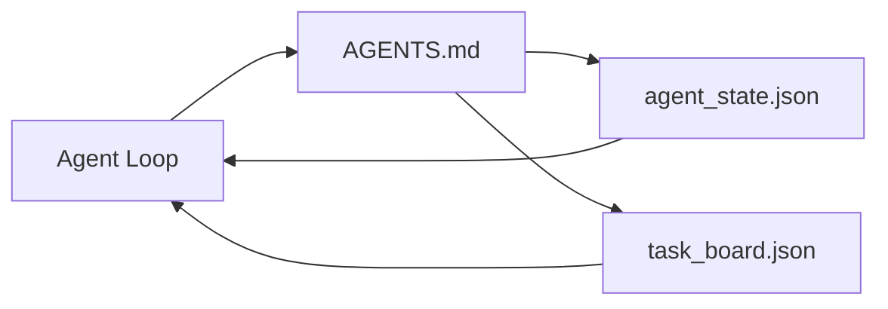

# Minimum Ajan Çalışma Masa

> En küçük kullanışlı çalışma desti üç dosyadır: bir kök talimat yönlendirici, bir durum dosyası ve bir görev panosu. Diğer her şey üst katlıdır.

**Type:** Build
**Languages:** Python (stdlib)
**Prerequisites:** Phase 14 · 31 (Why Capable Models Still Fail)
**Time:** ~45 minutes

## Öğrenme Hedefleri

- En az uygulanabilir çalışma tabanını oluşturan üç dosyayı tanımlayın.
- Neden kısa bir root yönlendiricisi uzun bir monolit yönlendiricisini yendiğini açıkla .`AGENTS.md`- Evet .
- Ajanın her dönüşte okuyabileceği ve sonunda yazabileceği bir dosya oluşturun.
- Çat geçmişi olmadan çok seanslı çalışmayı sağlayan bir görev panosunu oluşturun.

## Sorun

Çoğu ekip 3000 satırlı bir yazı yazarak bir çalışma deskeye ulaşır `AGENTS.md`Model yüklenir, özetleyemediği parçaları görmezden gelir ve yine de her zaman başarısız olduğu aynı yüzeylerde başarısız olur.

Bunun tam tersi gerekir. Ajanı sadece uygun olduğunda daha derin dosyalara yönlendiren küçük bir kök dosyası. Ajanın hareket etmeden önce okuduğu ve sonra yazdığı kalıcı durum. Uçuşta ne olduğunu, engellendiğini ve daha sonra ne olduğunu söyleyen bir görev tahtası.

Üç dosya, her biri bir iş, her biri makine okuyabilir, sonra gerçek bir sisteme dönüşecek kadar.

## Anlaşım



### AGENTS.md bir yönlendirici, bir el kitabı değil.

İyi bir .`AGENTS.md`- Ajanı şu yere yönlendirir:

- Devlet dosyası (buradasınız).
- Görev panosu (bakiye kalanlar).
- Daha derin kurallar (azap altında)`docs/agent-rules.md`)
- Verifikasyon komutları (işlediğini nasıl anlayabilirsiniz).

Uzun kitaplar daha derin dosyalara, gerekirse yüklenir, uzun kitaplar göz ardı edilir, kısa yönlendirmeler takip edilir.

### agent_state.json kayıt sistemidir

Durum taşıyor: aktif görev kimliği, dokunan dosyalar, yapılan varsayımlar, engeller ve sonraki eylem. Ajan her dönüşte okuyor.

Devlet bir dosyada yaşıyor çünkü sohbet geçmişi güvenilir değil.

### task_board.json sırada

Görev panosu her görevi statüsle yerine getiriyor `todo | in_progress | done | blocked`Bu, ajanın boş olduğu sırada çekilen sıradır ve ajanın doğru yolda olup olmadığını bilmek istediğiniz sırada okuduğunuz sıradır.

Yönetim Kurulunda bir görevde bir kimlik, bir hedef, bir sahibi vardır (`builder`- Evet .`reviewer`veya`human`Bu tablo amaçlı küçüktür: ekranın ötesinde büyüdükçe planlama sorunu var, bir tablo sorunu değil.

### Üç dosya zemin, tavan değil.

Sonraki dersler kapsam sözleşmeleri, geri bildirim koşucular, doğrulama kapıları, inceleme listeleri ve teslimat paketleri ekler.

```figure
wb-three-files
```

## Yapın

`code/main.py`En az çalışma masasını boş bir repo'ya yazar ve tek bir ajanın:

1. Okuyor .`agent_state.json`- Evet .
2. Bir sonraki görevi çek `task_board.json`Eğer devlet boşsa.
3. Sınıfın içinde tek bir dosya dokunuyor.
4. Yenilenmiş durumunu yazıyor.

Çek şunu:

```
python3 code/main.py
```

Senaryo yaratıyor `workdir/`Birinci dönüşün nasıl bittiğini görmek için tekrar çalıştırın.

## Kullan

Üretim ajanı ürünlerinin içinde aynı üç dosya farklı isimlerle görünür:

- **Claude Code:** `AGENTS.md`veya `CLAUDE.md`yönlendirici için, `.claude/state.json`- Devlet için ticari mağazalar, tahta için kaçalar.
- **Codex / Cursor:**Router için çalışma alanı kuralları, durum için oturum belleği, pano için sohbet yan çubuğunda sırada görevler.
- **Custom Python agent:**Az önce yazdığın dosyaları.

İsimler değişir, şekil değişmez.

## Doğada üretim biçimleri

Minimum çalışma masaya, gerçek monoreposlarla temas halinde kalırsa, üç kalıp üstü katlanır.

**Nested `AGENTS.md` with nearest-wins precedence.**OpenAI gemileri 88 `AGENTS.md`Kodeks, Cursor, Claude Code ve Copilot, çalışma dosyasından repo köküye doğru yürüyerek her bir bağlantıyı oluştururlar.`AGENTS.md`Alt dizin dosyaları kök dosyasını genişletiyor.`AGENTS.override.md`Bu nedenle, bu yöntemin kullanımı, bir süreliğine daha fazla kullanımı ve kullanımı için daha fazla kullanımı sağlayan bir sistemdir.`AGENTS.md`Dosyalar Haiku'dan Opus'a yükseltmek kadar kaliteli bir sıçrama verir; en kötüler ise hiçbir dosya olmaktan daha kötü sonuçlar verir.

**Anti-patterns to refuse, even when they look like coverage.**Çelişkili talimatlar, ajanı etkileşimli moddan açgözlü moduna sessizce düşürür (ICLR 2026 AMBIG-SWE: 48.8% → 28% çözünürlük oranı); onları düz yığmaktansa öncelikleri sayın. Verifiable stil kuralları ("Google Python Style Guide'i izleyin") hiçbir uygulama komutu olmadan ajanın uyumluluğu icat etmesine izin verin; her stil kuralını kesin lint komutu ile eşleştirin. Komut yerine stille önderlik etmek doğrulama yolunu gömür; komutlar önce, stil son. Ajanların yerine insanlar için yazmak bağlam bütçesini harcamaktadır; kısaltma bir özelliktir.

**Cross-tool symlinks.**Tek bir kök dosyası sim bağlantıları ile (`ln -s AGENTS.md CLAUDE.md`- Evet .`ln -s AGENTS.md .github/copilot-instructions.md`- Evet .`ln -s AGENTS.md .cursorrules`) her kodlama ajanını aynı gerçek kaynağı üzerinde tutar.`nx ai-setup`Claude Code, Cursor, Copilot, Gemini, Codex ve OpenCode'da tek bir yapılandırmadan otomatikleştirir.

## Gönder

`outputs/skill-minimal-workbench.md`Yeni repo için üç dosya işleme tabanı oluşturur:`AGENTS.md`Projenin ayarlanmış yönlendirici, bir `agent_state.json`Doğru anahtarlarla ve bir`task_board.json`Şu anki geri kalanlık ile birlikte ekilmiş.

## Egzersizler

1. Bir ekle`last_run`Zaman damgası `agent_state.json`- İşleyici tarafından onaylanmadıkça dosyanın 24 saatten daha eski olduğu durumlarda çalıştırmayı reddetmek.
2. Bir ekle`priority`Görev panosuna alanı açın ve çekicini değiştirin ve her zaman en yüksek önceliği seçin `todo`- Evet .
3. Göçmek için `task_board.json`JSON Lines'e, böylece her görev bir satır ve farklılıklar versiyon kontrolünde temizdir.
4. Bir yazın .`lint_workbench.py`Bu başarısız olur.`AGENTS.md`80 satırdan fazla veya var olmayan bir dosya ile bağlantılıdır.
5. Üç dosyanın hangisinin kaybetmek için en çok zarar vereceğini karar verin.

## Anahtar Terimler

| Term | What people say | What it actually means |
|------|----------------|------------------------|
| Router | `AGENTS.md` | Short root file that points the agent at deeper docs and files |
| State file | "The notes" | Machine-readable record of where the agent is, written every turn |
| Task board | "The backlog" | JSON queue of work with status, owner, acceptance |
| System of record | "Source of truth" | The file the workbench treats as authoritative when chat is gone |

## Daha Fazla Okumak

- [agents.md — the open spec](https://agents.md/) Cursor, Codex, Claude Code, Copilot, Gemini, OpenCode tarafından kabul edilmiştir
- [Augment Code, A good AGENTS.md is a model upgrade. A bad one is worse than no docs at all](https://www.augmentcode.com/blog/how-to-write-good-agents-dot-md-files) ölçülen kalite sıçramaları
- [Blake Crosley, AGENTS.md Patterns: What Actually Changes Agent Behavior](https://blakecrosley.com/blog/agents-md-patterns) Empirik olarak ne işe yarıyor, ne işe yaramadı
- [Datadog Frontend, Steering AI Agents in Monorepos with AGENTS.md](https://dev.to/datadog-frontend-dev/steering-ai-agents-in-monorepos-with-agentsmd-13g0) pratikte yerleşmiş önde gelenlik
- [Nx Blog, Teach Your AI Agent How to Work in a Monorepo](https://nx.dev/blog/nx-ai-agent-skills) 6 araçta tek kaynaklı üretim
- [The Prompt Shelf, AGENTS.md Best Practices: Structure, Scope, and Real Examples](https://thepromptshelf.dev/blog/agents-md-best-practices/) incelemeyi sürdüren bölüm
- [Anthropic, Claude Code subagents](https://code.claude.com/docs/en/sub-agents)
- Fase 14 · 31  bu minimumın en düşük şekilde absorbe ettiği aralıklar
- Fase 14 · 34  bu ders için kalıcı durum şeması
