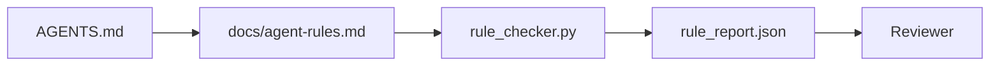

# Ajan talimatları uygulanabilir kısıtlamalar olarak

> Prosa olarak yazılan talimatlar dileklerdir. Zorluklar olarak yazılan talimatlar testlerdir. Çalışma masası her kuralı bir ajanın çalışma sırasında kontrol edebileceği ve bir değerlendirici gerçeğin ardından doğrulayabileceği bir şeye dönüştürür.

**Type:** Build
**Languages:** Python (stdlib)
**Prerequisites:** Phase 14 · 32 (Minimal Workbench)
**Time:** ~50 minutes

## Öğrenme Hedefleri

- İşlem kurallarından ayrı bir yollama prozası.
- Açıklama başlangıç kuralları, yasak eylemler, yapılmışların tanımlanması, belirsizlik yönetimi ve onay sınırları makine kontrol edilebilir kısıtlamalar olarak.
- Kural setine karşı bir koşuyu vuran bir kural kontrolcüsü uygulayın.
- Kuralları farklılıklara uygun hale getir, böylece inceleme değişikliği görebilir.

## Sorun

Tipik bir `AGENTS.md`Üç gün sonra, ajan test olmadan bir değişiklik gönderir, yasak bir dizinye yazar ve asla sormaz çünkü hatın nerede olduğunu asla bilmiyor.

Talimatlar, işlevsel olduğunda güçlüdür ve istekli olduğunda zayıfdır.

## Anlaşım

Kurallar da `docs/agent-rules.md`Her kuralın bir adı, bir kategorisi ve bir kontrolü vardır.



### Çoğu kuralı kapsayan beş kategori

| Category | Question the rule answers | Example |
|----------|---------------------------|---------|
| Startup | What must be true before work begins? | "state file exists and is fresh" |
| Forbidden | What must never happen? | "do not edit `scripts/release.sh`" |
| Definition of done | What proves the task is complete? | "pytest exits 0 and acceptance line passes" |
| Uncertainty | What does the agent do when unsure? | "open a question note instead of guessing" |
| Approval | What requires human approval? | "any new dependency, any prod write" |

Bu beş kuraldan birine uymayan bir kural genellikle iki kural olmak ister.

### Kurallar makine tarafından okunur.

Her kuralın bir kuralı, bir kategorisi, tek satırlı bir tanımı ve bir `check``rule_checker.py`Bir kural eklemek bir çek eklemek demektir.

### Kurallar farklılıklara karşı dostu.

Kurallar tek bir işaretleme dosyasında bir başlık için canlıdır. Yeniden isimler farklılıklarda görünür. Yeni kurallar kategorilerinin başında yer alır. Eski kurallar silinir, yorumlanmaz, çünkü çalışma masaları, takımın geçen çeyrekte nasıl hissettiği hakkında sohbet günlüğü değil, gerçeğin kaynağıdır.

### Kurallar vs. Çerçeve koruma

Çerçeve koruma perileri (OpenAI Ajanlar SDK koruma perileri, LangGraph keser) çalıştırma süresi düzeyinde kurallar uyguluyor. Bu derste belirtilen kural, bu koruma perileri tarafından uygulanabilir, gözden geçirilebilir bir sözleşmedir. İkisine de ihtiyacınız var: çalıştırma süresi bir dönüş sırasında ihlalleri yakalar, kurallar belirlenmiş çalıştırma süresi doğru şeyi yapıyor.

### Gelişmiş açıklama: bir harita, ansiklopedi değil

Sebep .`AGENTS.md`Bu, her olayın bir kural eklemesi ve hiçbir olayın bir kural çıkarmasıdır. Bir yıl sonra dosya iki bin satırdır ve ajan ilk ekranı okuyor, dikkat bütçesinden yoksun kalıyor ve söylenenlerin bir kısmına göre hareket ediyor. Dev bir talimat dosyası aynı sebepten başarısız olur: okuyucu bir kez inceleme yapar ve asla önemli olan bölümüne dönmez.

Bu düzeltme daha kısa bir dosyadır. Bu bir katmanlı dosyadır. Kök yönlendiricisi her seansı okuyacak kadar küçük kalır ve işaretçiden başka bir şey tutmaz. Ajanın görev onlara dokunduğu zaman görev dosyalarında yüklediği konu dosyalarında derinlik yaşar. Ajanın tüm ansiklopedisi değil bir haritayı verin ve ihtiyacına dair sayfaya gitmesine izin verin.

```
AGENTS.md                  # router, < 50 lines: what this repo is, where to look, the 5 hard rules
docs/
  agent-rules.md           # the full rule set (this lesson)
  architecture.md          # loaded when the task touches module boundaries
  testing.md               # loaded when the task writes or runs tests
  deploy.md                # loaded only for release work, gated behind an approval rule
feature_list.json          # the backlog (Phase 14 · 36)
```

| Tier | Lives in | Read when | Size budget |
|------|----------|-----------|-------------|
| Router | `AGENTS.md` | Every session, always | Under ~50 lines |
| Rules | `docs/agent-rules.md` | Every session, on startup | One screen per category |
| Topic docs | `docs/<topic>.md` | Only when the task touches that topic | As deep as needed |

İki test, katmanın dürüstlüğünü korur. Erişilebilirlik testi: bir ajan, yönlendiriciden en fazla iki atışta herhangi bir kurallara ulaşmalıdır, bu nedenle yönlendiricinin her konu doküsünü proza olarak tanımlamadan yolla bağlaması gerekir. Tazelik testi: yönlendirici, her PR'de bir eleştirmen tarafından tekrar okunacak kadar kısa, bu da onu değiştirdiği ansiklopediye sessizce yeniden büyümesini engelleyen tek şey. Artık çözülmeyen bir işaretçi, eksik bir kuralı daha kötü bir başarısızlıktır, bu yüzden yönlendiricide kırık bir bağlantı kendi başına bir başlangıç kontrol ihlalidir.

```figure
wb-rule-checkoff
```

## Yapın

`code/main.py`Gemi:

- `agent-rules.md`Kurallar bir veri sınıfına yüklenen bir analizci.
- `rule_checker.py`Şekör fonksiyonları, bir kişilik`check`referans.
- İki kural ihlal eden bir demo ajanı ve onları yakalayan bir çek geçit.

Çek şunu:

```
python3 code/main.py
```

Çıktı: analiz kuralı, çalıştırma izleri, kural başına geçme/başarısızlık ve `rule_report.json`senaryoya yakın kaydedildi.

## Doğada üretim biçimleri

Üç örneğe göre, bir haftada bozulan bir kuralın, dörtte bir süre devam eden bir kuralın ayrılığı vardır.

**Severity tagging at write time.**Her kuralın içinde bir şey vardır .`severity`- Evet .`block`- Evet .`warn`veya`info`Kontrolcü üçü de rapor ediyor . Sürüş zamanı sadece reddediyor .`block`. Çoğu ekip ciddiyetini erken aşarken sonuncu baskı altında sessizce zayıflatır; yazma zamanında etiketleme kalibrasyonu önüne zorlar.`block`bir kural olarak `overrides.jsonl`denetim kayıtları.

**Rule expiry as a forcing function.**Her kural bir kural içerir .`expires_at`verici, geçersiz bir kuralın 60 gün boyunca sıfır bir ihlal olduğu durumlarda bir uyarı gönderir; sonraki çeyreklik inceleme, onu tutmayı haklı çıkarır veya zayıflatır.`info`Cloudflare'ın üretimi AI Code Review verileri (Epril 2026, 131.246 inceleme 30 günde 5.169 repo üzerinde çalışmaktadır) açık bir şekilde sona ermiş olan kural setlerinin repo başına 30 kural altında kaldığını gösterdi; kullanmayan setlerin çoğu asla ateşlenmediği 80+'e yükseldi.

**Markdown-as-source, JSON-as-cache.** `agent-rules.md`yazar dosyasıdır; `agent-rules.lock.json`Bu, kontrol cihazının sıcak yolda okuduğu bir önbellektir. Kilit, önceden görevlendirilen bir kanca ile yenilenir. Markdown farklılıkları gözden geçirilebilir; JSON analizleri her dönüşten uzak kalır.`package.json`- Ne ?`package-lock.json`ve `Cargo.toml`- Ne ?`Cargo.lock`- Evet .

## Kullan

Üretim:

- Claude Code, Codex, Cursor, oturma başlarında kuralları okuyor ve hareketleri reddettiklerinde onları alıntılıyor.
- OpenAI Ajanlar SDK koruyucu perdeler giriş ve çıkış koruyucu perdeler ile aynı kontrolleri kaydeder.
- LangGraph, uçuşda bir düğüm kural ihlal ettiğinde ateşini keser.

Kural kümesi, üçü de taşınabilir çünkü sadece işaretleme ve fonksiyon isimleri.

## Gönder

`outputs/skill-rule-set-builder.md`proje sahibi ile röportaj yapar, mevcut proza talimatlarını beş kategoriye sınıflandırır ve bir versiyon yayınlar `agent-rules.md`Bir de bir kontrol kabusu.

## Egzersizler

1. Ürününüzün gerçekten ihtiyacı varsa altıncı bir kategori ekleyin.
2. Kontrol cihazını uzatmak, bir kuralın sertliği taşıyabilmesi için (`block`- Evet .`warn`- Evet .`info`) ve raporunu buna göre topluyor.
3. Kontrol cihazını CI'ye bağlayın: En son ajan çalışmasında blok ağırlığı kuralının başarısız olması durumunda yapılamayı başarısız edin.
4. Her kural için bir "geçmiş" alanı ekleyin. 90 gün boyunca kontrol başarısızlığı olmadan, kural gözden geçirilecek.
5. Gerçek bir tane bul .`AGENTS.md`Ve beş kategori kuralları olarak yeniden yazın.

## Anahtar Terimler

| Term | What people say | What it actually means |
|------|----------------|------------------------|
| Operational rule | "A real instruction" | A rule the workbench can check at runtime |
| Aspirational rule | "Be careful" | A rule with no check; either delete or upgrade |
| Definition of done | "Acceptance" | An objective, file-backed proof the task is complete |
| Block severity | "Hard rule" | Violation halts the run; cannot be silenced without an operator |
| Rule expiry | "Stale rule sweep" | A rule with no fails in N days is up for retirement |

## Daha Fazla Okumak

- [OpenAI Agents SDK guardrails](https://openai.github.io/openai-agents-python/guardrails/)
- [LangGraph interrupts](https://langchain-ai.github.io/langgraph/how-tos/human_in_the_loop/breakpoints/)
- [Anthropic, Building Effective Agents](https://www.anthropic.com/research/building-effective-agents)
- [Rick Hightower, Agent RuleZ: A Deterministic Policy Engine](https://medium.com/@richardhightower/agent-rulez-a-deterministic-policy-engine-for-ai-coding-agents-9489e0561edf) üretimdeki blok/ uyarı/ bilgi ağırlığı
- [Cloudflare, Orchestrating AI Code Review at Scale](https://blog.cloudflare.com/ai-code-review/) 131k inceleme dersi, kural kompozisyonu dersleri
- [microservices.io, GenAI development platform — part 1: guardrails](https://microservices.io/post/architecture/2026/03/09/genai-development-platform-part-1-development-guardrails.html) Kurallar ve İL arasındaki derin savunma
- [Type-Checked Compliance: Deterministic Guardrails (arXiv 2604.01483)](https://arxiv.org/pdf/2604.01483) Kural olarak kontrolün üst sınırı olarak 4'ü eğ
- [logi-cmd/agent-guardrails](https://github.com/logi-cmd/agent-guardrails) birleşme kapısı uygulaması: kapsam, mutasyon testi, ihlal bütçeleri
- Fase 14 · 32  bu kural setinin en az çalışma masası düşüyor
- Fase 14 · 38  Kural raporu tüketen doğrulama kapısı
- Fase 14 · 39  kuralların uygulanmasını değerlendiren değerlendirici ajan
