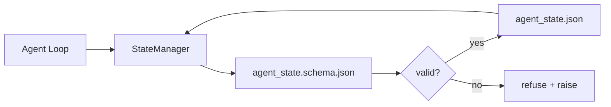

# Repo hafızası ve kalıcı durum

> Çat tarihi değişik. repo dayanıklıdır. iş stolunun depolama ajanı versiyon dosyalarında belirtiyor böylece bir sonraki oturum, bir sonraki ajan ve bir sonraki yorumcu hepsi aynı gerçeğin kaynağından okuyor.

**Type:** Build
**Languages:** Python (stdlib + `jsonschema` optional)
**Prerequisites:** Phase 14 · 32 (Minimal Workbench)
**Time:** ~60 minutes

## Öğrenme Hedefleri

- repo hafızasına ne ait olduğunu ve sohbet geçmişine neyin ait olduğunu tanımlayın.
- Yazar JSON Schemas for `agent_state.json`ve `task_board.json`- Evet .
- Atomik olarak devleti yükleyen, onaylayan, mutasyon yapan ve devam eden bir devlet yöneticisi oluşturun.
- İş masasını bozan kötü yazıları reddetmek için şema kullan.

## Sorun

Bu nedenle, bir süre sonra, bir süre sonra, bir süre sonra, bir süre sonra, bir süre sonra, bir süre sonra, bir süre sonra, bir süre sonra, bir süre sonra, bir süre sonra, bir süre sonra, bir süre sonra, bir süre sonra, bir süre sonra, bir süre sonra, bir süre sonra, bir süre sonra, bir süre sonra, bir süre sonra, bir süre sonra, bir süre sonra, bir süre sonra, bir süre sonra, bir süre sonra, bir süre sonra, bir süre sonra, bir süre sonra, bir süre sonra, bir süre sonra, bir süre sonra, bir süre sonra, bir süre sonra, bir süre sonra, bir süre sonra, bir süre sonra, bir süre sonra, bir süre sonra, bir süre sonra, bir süre sonra, bir süre sonra, bir süre sonra, bir süre sonra, bir süre sonra, bir süre sonra, bir süre sonra, bir süre sonra, bir süre sonra, bir süre sonra, bir süre sonra, bir süre sonra, bir süre sonra, bir süre sonra, bir süre sonra, bir süre sonra, bir süre sonra, bir süre sonra, bir süre sonra, bir süre sonra, bir süre sonra, bir süre sonra, bir süre sonra, bir süre sonra, bir süre sonra, bir süre sonra, bir süre sonra, bir süre sonra, bir süre sonra, bir süre sonra, bir süre sonra, bir süre sonra, bir süre sonra, bir süre sonra, bir süre sonra, bir süre sonra, bir süre sonra, bir süre sonra, bir süre, bir süre sonra, bir süre sonra, bir süre sonra, bir süre, bir süre, bir süre, bir süre sonra, bir süre, bir süre, bir süre, bir süre, bir süre sonra, bir süre, bir süre, bir süre, bir süre, bir süre, bir süre, bir süre, bir süre, bir süre, bir süre, bir süre, bir süre, bir süre, bir süre, bir süre, bir süre, bir süre, bir süre, bir süre, bir süre, bir süre, bir süre, bir süre, bir süre, bir süre, bir süre, bir süre, bir süre, bir süre, bir süre, bir süre, bir süre, bir süre, bir süre, bir süre, bir süre, bir süre, bir süre, bir süre, bir süre, bir bir bir bir, bir, bir bir bir, bir, bir, bir, bir, bir, bir, bir, bir, bir, bir, bir, bir, bir, bir,

İşleme tabanı düzeltmesi repo bellekidir: repo'daki JSON dosyalarında durum yaşamaktadır, bir şema altında yazılır, atomik olarak devam eder, kod incelemesinde farklılık dostu. Çat geçici bir beslenme; repo kayıt sistemidir.

## Anlaşım



### repo hafızasına ait olan şey

| Belongs | Does not belong |
|---------|-----------------|
| Active task id | Raw chat transcripts |
| Touched files this session | Token-level reasoning traces |
| Assumptions the agent made | "The user seemed frustrated" |
| Open blockers | Sampled completions |
| Next action | Vendor-specific model ids |

Test dayanıklılık: 3 ay sonra bir CI tekrarlaması için yararlı olur mu?

### Şema birinci durum

JSON Schema sözleşmesidir. Bu olmadan her ajan yeni alanlar icat eder, her inceleyiciler yeni bir şekil öğrenir ve her CI senaryosu geçmiş sürümlere özel durumlar oluşturmalıdır.

Şema şuları kapsar:

- Gerekli anahtarlar.
- İzin veriliyor .`status`değerleri.
- Yasak değerler (örneğin `null`Arraylar için).
- Şablon kısıtlamaları (iş kimlikleri eşleşir `T-\d{3,}`)
- Göçmenlik için sürüm alanı.

### Atomik yazıyor

Devlet yazıları kısmi başarısızlıklardan kurtulmak için gerekli: bir tempfile'ye yazın, fsync, hedefi yeniden adlandırın. Devlet dosyası gerçeğin kaynağıdır; yarı yazılı bir dosya hiç dosya olmaktan daha kötüdür.

### Göçmenlik

Şema değişirken, şema yumruğunun yanında bir göç metni gönderin.`schema_version`alan; yöneticisi bir dosyayı taşımayacağı bir sürümden yüklemeyi reddeder.

```figure
wb-state-persist
```

## Yapın

`code/main.py`Uygulamaları:

- `agent_state.schema.json`ve `task_board.schema.json`- Evet .
- Sadece stdlib onaylayıcı (JSON Şema alt kümesi: gerekli, tür, enum, desen, öğeler).
- `StateManager.load`- Evet .`StateManager.update`- Evet .`StateManager.commit`Atom temp-and-rename yazısı ile.
- Bir demo, durumunu mutasyonla değiştirir, devam eder, yeniden yüklenir ve dönüş yolculuğunu kanıtlar.

Çek şunu:

```
python3 code/main.py
```

Senaryo yazıyor .`workdir/agent_state.json`ve `workdir/task_board.json`, onları iki dönüşte mutasyonlandırır ve her adımda onaylanmış durumun yazdırılmasını sağlar.

## Doğada üretim biçimleri

Dört örnektir ders minimumunu bir çok ajanlı monorepo hayatta kalabilecek bir şeye dönüştürür.

**Atomic temp-and-rename is not optional.**Mart 2026 Hive proje hata raporunda başarısızlık modunun temiz bir şekilde belgelenmesi: `state.json`tarafından yazıldı `write_text()`Partial Left yazıyor, yolsuzluğa karşı sessiz bir şekilde devam ediyor.`tempfile.mkstemp`Hedef ile aynı dizinde yazın, `fsync`- Evet .`os.replace`Bu ders, bu ders için bir ders.`atomic_write`Tam olarak öyle.

**Idempotency keys on every non-idempotent tool call.**Bir aracı aradıktan sonra bir ajan çökerse ama sonuç kontrol noktası olmadan önce, kurtarma araç çağrısını tekrar dener. Okuyucular için güvenli; e-postalar, DB eklemeleri, dosya yüklemeleri için tehlikeli.`pending_calls.jsonl`. Yeniden denediğinizde kimliği kontrol edin; mevcutsa, çağrıdan atlayın ve önbelleğe alınmış sonucu kullanın. Anthropic ve LangChain her ikisi de 2026 yönlendirmeinde bunu çağırır; LangGraph'in kontrol noktası aynı nedenle yazıları bekleyen olarak kalır.

**Separate large artifacts from state.**CSV'leri, uzun transkriptleri veya oluşturulan dosyaları saklama `agent_state.json`. Eserleri ayrı bir dosya olarak kaydet (veya nesne depolama alanına yükle) ve sadece yolun durumunda tut. Kontrol noktaları küçük ve hızlı kalır; eserler bağımsız olarak büyür.

**Event sourcing for audit, snapshots for resume.**Bir olay günlüğüne ekle (`state.events.jsonl`) her mutasyonda; düzenli olarak `state.json`Resume anlık görüntüyü okuyor, ardından anlık görüntünün zaman damgasından sonra olan her olayı yeniden oynar. Bu daha fazla disk maliyetini alır, ancak uzun ufuk çalışmalar düzeltirken ajan kararlarını sözcük anlamda tekrar oynamalarını sağlar. Postgres'in WAL için içsel olarak kullandığı aynı şekil.

**Schema migrations or refuse to load.**- Evet .`schema_version`tam sayı sözleşmedir. yöneticisi bir dosyayı bilinmeyen bir sürümde yüklerken, okumaktan kaçınır. Şema yumruğunun yanında bir göç metni gönderin; `tools/migrate_state.py`Her başlangıçta idempotently çalışır.

## Kullan

Üretim:

- **LangGraph checkpointers.**Aynı fikir, farklı depolama. Kontrol noktası SQLite, Postgres veya özel bir arka planda grafik durumunu sürdürür. Bu dersin öğrettiği şema, kontrol noktası ölünce neye ulaştığınızı ve durumu elden okumak zorunda olduğunuz şeydir.
- **Letta memory blocks.**Yapılandırılmış şemalarla sürekli bloklar (Fase 14 · 08).
- **OpenAI Agents SDK session store.**Bu dersdeki devlet dosyası yerel dosya arka uçları.

## Gönder

`outputs/skill-state-schema.md`projeye özel bir JSON Schema çiftini (stat + board), Python `StateManager`atom yazısı ile kablolanmış ve bir göç asması var. Böylece bir sonraki şema çarpması çalışma masasını kırmaz.

## Egzersizler

1. Bir ekle`last_human_touch`İnsan düzenlemesinden beş saniye sonra herhangi bir ajanın yazmasını reddet.
2. Validatörü desteklemek için uzat `oneOf`Bu nedenle bir görev, farklı gerekli alanlarla bir yapı görevinden veya bir inceleme görevinden olabilir.
3. Bir ekle`schema_version`alanı ve v1 ' den v2 ' e göçü yaz (dönüştürme `blockers`- ...`risks`)
4. Kayıt arka uçlarını yerel dosyadan SQLite'e taşı.`StateManager`API aynı.
5. 50 ms yazma yarışıyla iki ajanı aynı devlet dosyasına karşı çalıştır.

## Anahtar Terimler

| Term | What people say | What it actually means |
|------|----------------|------------------------|
| Repo memory | "Notes file" | State stored in tracked files in the repo, under schema |
| Schema-first | "Validate inputs" | Define the contract before the writer, refuse drift |
| Atomic write | "Just rename" | Write to temp, fsync, rename, so partial failures cannot corrupt |
| Migration | "Schema bump" | A script that turns vN state into v(N+1) state |
| System of record | "Source of truth" | The artifact the workbench treats as authoritative |

## Daha Fazla Okumak

- [JSON Schema specification](https://json-schema.org/specification.html)
- [LangGraph checkpointers](https://langchain-ai.github.io/langgraph/concepts/persistence/)
- [Letta memory blocks](https://docs.letta.com/concepts/memory)
- [Fast.io, AI Agent State Checkpointing: A Practical Guide](https://fast.io/resources/ai-agent-state-checkpointing/) İdempotency ile ilk şema kontrol noktası
- [Fast.io, AI Agent Workflow State Persistence: Best Practices 2026](https://fast.io/resources/ai-agent-workflow-state-persistence/) Eşzamanlılık kontrolü, TTL, olay kaynakları
- [Hive Issue #6263 — non-atomic state.json writes silently ignored](https://github.com/aden-hive/hive/issues/6263) Gerçek bir projede başarısızlık modu
- [eunomia, Checkpoint/Restore Systems: Evolution, Techniques, Applications](https://eunomia.dev/blog/2025/05/11/checkpointrestore-systems-evolution-techniques-and-applications-in-ai-agents/) Ajanlara uygulanan işletim sisteminin geçmişindeki CR primitifleri
- [Indium, 7 State Persistence Strategies for Long-Running AI Agents in 2026](https://www.indium.tech/blog/7-state-persistence-strategies-ai-agents-2026/)
- [Microsoft Agent Framework, Compaction](https://learn.microsoft.com/en-us/agent-framework/agents/conversations/compaction) Satıcı kontrol noktası yöneticisi
- Fase 14 · 08  hafıza blokları ve uyku zamanı hesaplama
- Fase 14 · 32  bu ders üç dosya minimumı çizer
- Fase 14 · 40  aynı şema ile birlikte gönderilen paketler
