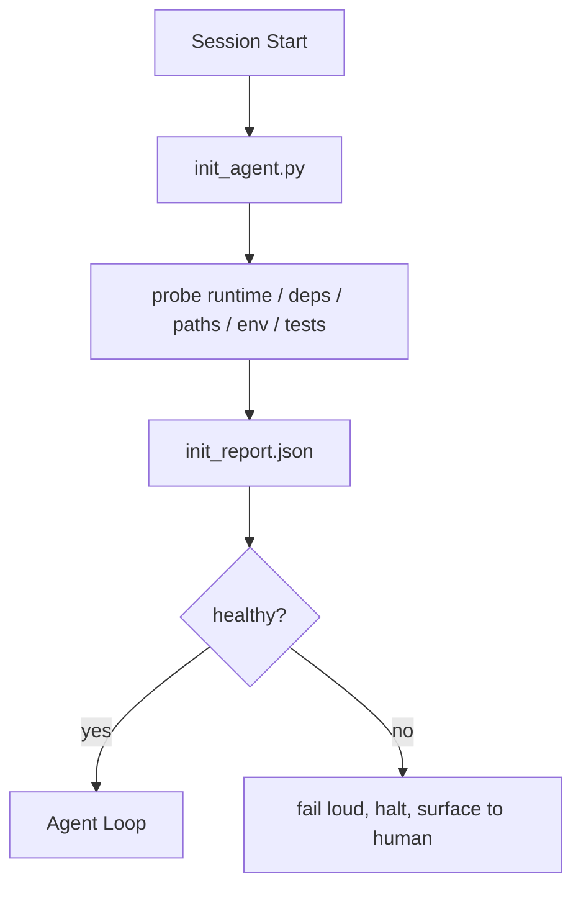

# Ajanlar için İnsanize Skriptleri

> Soğuk bir sesyonda bir vergi ödeniyor ajan aynı dosyaları okuyor, aynı araştırmaları tekrar denediyor ve aynı yolları yeniden keşfediyor.

**Type:** Build
**Languages:** Python (stdlib)
**Prerequisites:** Phase 14 · 32 (Minimal Workbench), Phase 14 · 34 (Repo Memory)
**Time:** ~45 minutes

## Öğrenme Hedefleri

- Bir ajanın bir seansta asla tekrar etmesi gerekmeyen bir işi belirleyin.
- Çalışma zamanını, bağımlılıkları ve repo sağlığını araştırmak için belirleyici bir init metni oluşturun.
- Araçın sonucuyu devam ettirin, böylece ajan tekrar kontrol etmek yerine onu okuyabilir.
- Başlangıç başarısız olduğunda yüksek sesle, hızlı ve tek bir yere bak.

## Sorun

Bir oturum açın. Ajan Python sürümünü tahmin eder. Test komutunu tahmin eder. Giriş noktasını bulmak için repo köküünü beş kez listeler. Kurulmamış bir paket içeriye aktarmaya çalışır. Kullanıcıya yapılandırma dosyasının nerede yaşadığını sorar. Gerçek bir düzenleme yapıldığı zaman, on bin token tek bir senaryo olması gereken kurulum işlerine gitti.

Düzeltme , ajanın başka bir şey yapmadan önce çalıştırılan ve bir yazı yazılan bir başlangıç metni .`init_report.json`Ajanın başlatma noktası.

## Anlaşım



### İnt script neyi araştırıyor

| Probe | Why it matters |
|-------|----------------|
| Runtime versions | Wrong Python or Node version means silent wrong-version bugs |
| Dependency availability | A missing package later costs ten times the cost of catching it now |
| Test command | The agent must know how to verify; if the command is missing the workbench is broken |
| Repo paths | Hard-coded paths drift; resolve them once and pin |
| Environment variables | Missing `OPENAI_API_KEY` is a failure surface, not a runtime mystery |
| State + board freshness | Stale state from a crashed session is a footgun |
| Last-known-good commit | Anchor for the handoff diff at the end of the session |

### Sesli başarısız olun, hızlı başarısız olun, tek bir yerde başarısız olun.

Bir sonda başarısızlık, durmak ve insan yüzeyi anlamına gelir. "Ajent bunu çözecek".

### Gücün yetersiz

İkinci atış yeni bir zaman damgası hariç bir no-op olmalıdır. İdempotency senaryoyu CI, haklar veya görev öncesi kesme komutlarına bağlamanızı sağlayan şeydir.

### Başlangıç kuralları karşı karşıya

Kurallar (Fase 14 · 33) hareket etmek için neyin doğru olması gerektiğini açıklar. Init bu kurallara kontrol edilebileceğini belirleyen metin.

```figure
wb-init-probes
```

## Yapın

`code/main.py`uygulamalar `init_agent.py`- ...

- Beş sonda: Python versiyonu, listelenmiş bağımlılıklar `importlib.util.find_spec`, test komut çözülebilirliği, gerekli çevre gücü, dosyaların tazeliği.
- Her sonda geri dönüyor .`(name, status, detail)`- Evet .
- Senaryo yazıyor .`init_report.json`Tüm sonda ayarlanmış ve blok ağırlığı sonda başarısız olursa sıfır dışı çıkıyor.

Çek şunu:

```
python3 code/main.py
```

Senaryo, sondanın tablolarını basıyor, yazıyor.`init_report.json`, ve mutlu yolda sıfırdan çıkıyor veya başarısız sondların bir listesine sahip olmayan sıfırdan çıkıyor.

## Doğada üretim biçimleri

Üç örnektir, faydalı bir init metnini bir törenden ayırır.

**Last-known-good commit anchoring.**Bir                                                                                        `LKG`Bu, Cloudflare'ın AI Code Review'i değerlendirme ajanlarını etkilemek için kullanan bir dosyadır: her inceleme seansı aynı bilinen iyiliğe karşı demirlenir ve asla bileşikler seanslar arasında sürüklenmez.

**Lock files with TTL.**Bir yazın .`prereqs.lock`Sonraki çalışmalar N saat (24 saat varsayılan) için kilit güven ve pahalı araştırma atlamak. init senaryo ilk olarak kilit okur; eğer taze ve bağımlılık manifesto hasha eşleşir, kısa devre. Bu Docker katman önbelleği için kullanılan aynı kalıp: idempotent probe + içeriği hasha = atlamak.

**No network, no LLM, no surprises in the hot path.**Init sondaları belirleyici tesisat. Bir hatayı sınıflandırmak için bir LLM'yi çağıran veya bir lisans kontrol etmek için bir dış hizmete çarpan bir sonda bir sonda değildir; bir iş akışıdır. Bir sonda kuru bir çalışmada üç saniyeden uzun sürerse, bunu bir çalışma tahtası kokusu olarak değerlendirin ve ya init'ten çıkarın veya sonuçlarını önbelleğe koyun.

## Kullan

Üretim:

- **Claude Code hooks.** `pre-task`Hook, init senaryoyu arıyor ve başarısız olursa ajanı başlatmayı reddediyor.
- **GitHub Actions.**A.`setup-agent`İş init senaryoyu çalıştırır; ajan işi buna bağlıdır.
- **Docker entrypoint.**Ajan konteyneri, Ajan çalıştırma zamanını gerçekleştirmeden önce init senaryosunu çalıştırır; başarısızlık durumunda kayıtlar açılır.

init senaryosu taşınabilir çünkü belirli bir çerçeveye çağrı yapmaz. Bash, Make veya bir görev dosyası hepsini sarılabilir.

## Gönder

`outputs/skill-init-script.md`Projeyi röportaj eder, kurulum çalışmalarını araştırmalara sınıflandırır ve projeye özel bir bilgi gönderir `init_agent.py`Bir ajanın adımlarından önce çalıştırılan bir bilgi akışı da var.

## Egzersizler

1. Son bilinen iyi commit ile mevcut commit'i farklılaştıran ve 50'den fazla dosya değiştirildiğinde başlatmayı reddeden bir sonda ekleyin.
2. Bir yazı yazmak için senaryoyu bağlayın `prereqs.lock`Eğer kilit yedi günden daha eskiyse başlatmayı reddeder.
3. Bir ekle`--fix`Kayıp dev bağımlılıklarını otomatik olarak yükleyen ama hiçbir zaman onay olmadan çalıştırma süresi bağımlılıklarını değiştirmeyen bir bayrak.
4. Sondeyi sert kodlanmış fonksiyonlardan YAML kayıtlarına taşı.
5. Bir sondada üç saniye daha uzun süren bir sonda iş masası kokusu.

## Anahtar Terimler

| Term | What people say | What it actually means |
|------|----------------|------------------------|
| Probe | "A check" | A deterministic function returning `(name, status, detail)` |
| Init report | "Setup output" | JSON written next to state with the probe results |
| Idempotent | "Safe to re-run" | Two runs in a row produce identical reports modulo timestamp |
| Fail loud | "Don't swallow" | Halt and surface to the human; no silent fallback |
| Setup tax | "Bootstrap cost" | The tokens the agent spends per session rediscovering the obvious |

## Daha Fazla Okumak

- [Anthropic, Effective harnesses for long-running agents](https://www.anthropic.com/engineering/effective-harnesses-for-long-running-agents)
- [GitHub Actions, composite actions for setup](https://docs.github.com/en/actions/sharing-automations/creating-actions/creating-a-composite-action)
- [microservices.io, GenAI dev platform: guardrails](https://microservices.io/post/architecture/2026/03/09/genai-development-platform-part-1-development-guardrails.html) Öntanımlı + CI kontrolleri init olarak
- [Augment Code, How to Build Your AGENTS.md (2026)](https://www.augmentcode.com/guides/how-to-build-agents-md) init beklentileri
- [Codex Blog, Codex CLI Context Compaction](https://codex.danielvaughan.com/2026/03/31/codex-cli-context-compaction-architecture/) Sessiyon başlangıcı kompaktasyon farkındadır
- Fase 14 · 33  bu senaryo ayarlı kural
- Fase 14 · 34  bu senaryo tohumları devlet dosyası
- Fase 14 · 38  verifikasyon kapısı init senaryosu beslenir
- Fase 14 · 40  init raporu'nun son bilinen iyiliğini tüketen teslimat
