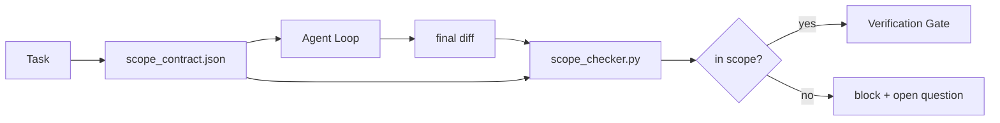

# Sözleşmeler ve görev sınırları

> Model, işin nerede sona ereceğini bilmiyor. Bir kapsam sözleşmesi, işin nerede başladığını, nerede bittiğini ve dökülürse nasıl geri döneceğini söyleyen bir görev dosyasıdır.

**Type:** Build
**Languages:** Python (stdlib)
**Prerequisites:** Phase 14 · 32 (Minimal Workbench), Phase 14 · 33 (Rules as Constraints)
**Time:** ~50 minutes

## Öğrenme Hedefleri

- Bir ajanın görev başlamasındaki ve bir doğrulayıcının görev sonunda okuduğu bir kapsam sözleşmesi yazın.
- İzin verilen dosyaları, yasaklanan dosyaları, kabul kriterlerini, geri dönüş planını ve onay sınırlarını belirtin.
- Sözleşme ile karşılaştırılan bir farkı karşılaştıran ve ihlalleri işaretleyen bir kapsam kontrolcisi uygulanmalıdır.
- Görülebilir, otomatik ve gözden geçirilebilir bir alan yaratın.

## Sorun

Ajanlar kaydırılır. Görev "açış hatalarını düzeltmek" dir. Fark giriş yoluna, e-posta yardımcıına, veritabanı sürücüsüne, README'ye ve yayın senaryouna dokunur. Her dokunmanın şu anda makul bir nedeni vardı.

Skip creep, ajan işinde en az izlenen başarısızlık modudur çünkü ajan her adımı iyi niyetle anlatır. Düzeltme daha sıkı bir istek değildir. Düzeltme, söz verilen şeyi söyleyen bir disk üzerinde bir sözleşme ve sonuçları söz verilenle karşılaştıran bir kontroldür.

## Anlaşım



### Bir sözleşmenin kapsamında ne yer alır

| Field | Purpose |
|-------|---------|
| `task_id` | Links to the task on the board |
| `goal` | One sentence the reviewer can verify |
| `allowed_files` | Globs the agent may write |
| `forbidden_files` | Globs the agent must not touch even by accident |
| `acceptance_criteria` | Test commands or assertion lines that prove done |
| `rollback_plan` | One paragraph the operator can execute if a halt is required |
| `approvals_required` | Actions outside scope that need explicit human sign-off |

Bir sözleşme olmadan`forbidden_files`Negatif boşluk sözleşmenin yarısı.

### Balonlar, çiğ yollar değil

Gerçek depolar dosyaları taşır.`app/**/*.py`- Evet .`tests/test_signup*.py`) bu nedenle oturmalar arası bir refactor sözleşmeyi geçersiz kılmaz.

### Rollback'ın kapsamının bir parçası

Bir sözleşmenin nasıl geri atılacağını listelenmek, sözleşmenin yazarını yanlış giden şeyler hakkında düşünmeye zorlar.

### Kapsam kontrolü bir farklılık kontrolüdür

Agent bir fark yazar. Kontrolcü farkı, izin verilen küpleri, yasaklanan küpleri ve çalıştırılan herhangi bir kabul komutlarının bir listesini okuyor. Her ihlal doğrulama kapısı reddedebilir bir etiket bulma.

### İki alan yüksekliği: Özellik listesi ve görev sözleşmesi

Kapsam sözleşmesi bir görevi sınırlıyor. Projede bağlamıyor. Bir ajan giriş düzeltmesi için bir sözleşmenin içinde mükemmel kalabilir ve yine de, bir sonraki sırada, projeye bir ayar sayfası, karanlık mod değişikliğine ve yönlendirici yeniden yazılmasına ihtiyaç olduğunu karar verebilir. Sözleşmeye projenin kapsamında hangi iş olduğu sorulmadı.

Bu ikinci yükseklik kendi ilkeline ihtiyacı var:`feature_list.json`Bu, proje arka arkalanması olarak, makine okuyabilir, sipariş dosyası olarak.`status`- Evet .`todo`, yazıyor .`id`"Bir kez bir özellik" bir istek içinde bir satır olmaktan çıkar ve ajan geçmişi mantıklı hale getirebilir ve bir değer olur disketten okur ve bir kontrol kapı uyguladı.

```json
{
  "project": "knowledge-base",
  "active": "import-pdf",
  "features": [
    { "id": "import-pdf",   "status": "in_progress", "goal": "import a PDF into the library",        "done_when": "pytest tests/test_import.py && a sample PDF appears in the library view" },
    { "id": "full-text-search", "status": "todo",     "goal": "search document text and rank hits",   "done_when": "query returns ranked results with snippets" },
    { "id": "cite-answers", "status": "todo",         "goal": "answers carry source citations",        "done_when": "every answer renders at least one clickable citation" }
  ]
}
```

| Field | Purpose |
|-------|---------|
| `active` | The single feature the current session may touch; empty means pick one and set it |
| `features[].id` | Stable slug the scope contract's `task_id` points at |
| `features[].status` | `todo`, `in_progress`, `done`, `blocked`; only one `in_progress` at a time |
| `features[].goal` | One sentence the reviewer can verify |
| `features[].done_when` | The acceptance line that flips `in_progress` to `done` |

İki kural listeyi dekoratif yerine yük taşıyan yapar.`in_progress`" kendiliğinden bir başlangıç kontrolüdür (Fase 14 · 33): listede iki tane gösterildiğinde, bir insan çözene kadar seans başlamayı reddeder. İkincisi, özellik listesi bir dosyadır, sohbet mesajı değil, çünkü sohbet bağlamdan dışarı kaydırılır ve dosya oturmalarda ve ajanlar arasında kalır.`done`Böylece bir sonraki seans, kalanı yeniden çıkarmak yerine doğru bir tahtaya açılır.

Sözleşme ve liste en az ayrıcalıkla oluşan, aşağıda açıklanan aynı birleşme: görev sözleşmesinin `allowed_files`Etkin özellik ne olursa olsun, dışarıda oturmalıdır.

```figure
wb-scope-bounce
```

## Yapın

`code/main.py`Uygulamaları:

- `scope_contract.json`schema (JSON Schema alt kümesi, glob arrays).
- Dokunulan dosyaların bir listesini ekleyen bir farklı analiz cihazı ve çalıştırma komutlarının bir listesini `RunSummary`- Evet .
- A.`scope_check`Bu da geri dönüyor.`(violations, in_scope, off_scope)`Sözleşmeye karşı.
- İki demo çalışması: birinde kapsamda kalır, birinde ürperir.

Çek şunu:

```
python3 code/main.py
```

Sonuç: sözleşme, iki yarış, her yarışta hükümler ve bir kurtulmuştur.`scope_report.json`- Evet .

## Doğada üretim biçimleri

Bir uygulayıcı "specsmaxxing" (Ajandan söz etmeden önce YAML'de kapsam sözleşmeleri) çalıştırıyor.

**Violation budgets, not binary failures.** `agent-guardrails`(Cloed Code, Cursor, Windsurf, Codex tarafından kullanılan OSS birleşme kapısı)`violationBudget`Bu görevler, bütçe içindeki küçük alan kayıpları uyarılar olarak ortaya çıkar; ancak bütçe aşıldığında birleşme kapısı reddedilir.`violationSeverity: "error" | "warning"`Bütçe, gemiye gönderilen bir kapı ile onu nefret eden bir takım tarafından devre dışı bırakılan bir kapı arasındaki fark.

**Severity asymmetry by path family.**- Dışarıda .`docs/**`- Genellikle.`warn`- Out-of-scope ' a yazıyor .`scripts/**`- Evet .`migrations/**`- Evet .`config/prod/**`Her zaman öyle.`block`Bu asimetri, çalışma süresi içinde değil, sözleşmede yaşamak zorunda, çünkü projeye özgüdür ve her görev için değişir.

**Time and network budgets next to file budgets.**A.`time_budget_minutes`Bu nedenle, bu süre boyunca, bu süre boyunca, bu süre boyunca, bu süre boyunca, bu süre boyunca, bu süre boyunca, bu süre boyunca, bu süre boyunca, bu süre boyunca, bu süre boyunca, bu süre boyunca, bu süre boyunca, bu süre boyunca, bu süre boyunca, bu süreye kadar, bu süre boyunca, bu süreye kadar, bu süre boyunca, bu süre boyunca, bu süre boyunca, bu süreye kadar, bu süre boyunca, bu süreye kadar, bu süre boyunca, bu süreye kadar, bu süreye kadar, bu süreye kadar, bu süreye kadar, bu süreye kadar, bu süreye kadar, bu süreye kadar, bu süreye kadar, bu süreye kadar, bu süreye kadar, bu süreye kadar, bu süreye kadar, bir süreye kadar, bir süreye kadar, bir süreye kadar, bir süreye kadar, bir süreye kadar, bir süreye kadar, bir süreye kadar, bir süreye kadar, bir süreye kadar, bir süreye kadar, bir süreye kadar, bir süreye kadar, bir süreye kadar, bir süreye kadar, bir süreye kadar, bir süreye kadar, bir süreye kadar, bir süreye kadar, bir süreye kadar, bir süreye kadar, bir süreceye kadar, bir sürece, bir sürececececececececececece, bir sürececececececececececececececececececececececececececececececececececececececececececececececececececececececececececececececececececececececececececececececececececececececececececececececececececececececececececececececececececececececececececececececececececececececececececececececececececececececececececececececececececececececececececececececececececececececececececececececececececececececececececececececececececececececececececececece`network_egress`hostname'lerde allowlist, ajanın görevden ayrı bir dış API'ye sessizce vurmasını engeller. Bunlar da kapsam boyutlarıdır; dosya küpleri yeterli değil, gerekli.

**Multi-contract merge semantics (least privilege).**İki kapsam sözleşmesi geçerli olduğunda (örneğin proje kapsamlı bir sözleşme artı görev özel bir sözleşme), birleşme: **intersect** `allowed_files`(İki sözleşme de yolu izin vermeli)**union** `forbidden_files`(ya da yasaklayabilir),`time_budget_minutes`en kısıtlayıcı (min), `approvals_required`toplanır.`network_egress`- Evet .`None`İcra edilmemesi için,`[]`Yalanlayanlar için.`[...]`Bir izin listesi olarak; birleşme altında,`None`Bu, birleştirmenin mekanik ve gözden geçirilebilir olması için sözleşme şemasında bunu belirtin.

## Kullan

Üretim biçimleri:

- **Claude Code slash commands.**A.`/scope`Komutanlık sözleşmeyi yazar ve oturma bağlamı olarak kaydırır.
- **GitHub PRs.**Sözleşmeyi PR organında bir JSON dosyası olarak veya bir verifiye edilmiş eser olarak it. CI, birleşme farkına karşı boyut kontrolcüsünü çalıştırır.
- **LangGraph interrupts.**Bir kapsam ihlali bir kesinti tetikler; yöneticisi insanın sözleşmenin büyümesi veya ajanın geri çekilmesi gerektiğini sorar.

Sözleşme görevle birlikte hareket eder.`outputs/scope/closed/`- Evet .

## Gönder

`outputs/skill-scope-contract.md`Görev tanımı için bir kapsam sözleşmesi ve her ajan farkında olan CI ile çalışan küresel bir kontrol cihazı oluşturur.

## Egzersizler

1. Bir ekle`network_egress`alan listesi dış hostlara izin verdi. Diğer hostları etkileyen çalışmalar reddedil.
2. Kontrol cihazını yumuşak bir şekilde çalıştırmak için uzat `docs/**`Ve sert .`scripts/**`Asimetriyi haklı çıkarın.
3. Sözleşmeyi çıkartmak `allowed_files`bir `goal`İlk kenarlık durumunda ne yanlış gider?
4. Bir ekle`time_budget_minutes`Duvar saati geçtikten sonra devam etmeyi reddediyorlar.
5. Aynı kontratlara karşı iki sözleşmeyi çalıştırın.

## Anahtar Terimler

| Term | What people say | What it actually means |
|------|----------------|------------------------|
| Scope contract | "The task brief" | Per-task JSON listing allowed/forbidden files, acceptance, rollback |
| Scope creep | "It also touched..." | Files outside the contract changed in the same task |
| Rollback plan | "We can revert" | The one-paragraph operator runbook for halting |
| Approval boundary | "Needs sign-off" | An action listed in the contract as requiring explicit human approval |
| Diff check | "Path audit" | Comparing touched files against the contract globs |

## Daha Fazla Okumak

- [LangGraph human-in-the-loop interrupts](https://langchain-ai.github.io/langgraph/concepts/human_in_the_loop/)
- [OpenAI Agents SDK tool approval policies](https://platform.openai.com/docs/guides/agents-sdk)
- [logi-cmd/agent-guardrails — merge gates and scope validation](https://github.com/logi-cmd/agent-guardrails) ihlal bütçeleri, ciddiyet seviyeleri
- [Dev|Journal, Preventing AI Agent Configuration Drift with Agent Contract Testing](https://earezki.com/ai-news/2026-05-05-i-built-a-tiny-ci-tool-to-keep-ai-agent-configs-from-drifting-in-my-repo/) `--strict`Dış depsiz mod
- [Agentic Coding Is Not a Trap (production logs)](https://dev.to/jtorchia/agentic-coding-is-not-a-trap-i-answered-the-viral-hn-post-with-my-own-production-logs-33d9) Specsmaxxing makbuzları: %52 → %21
- [OpenCode permission globs](https://opencode.ai/docs/agents/) İzin için ince taneler için alan
- [Knostic, AI Coding Agent Security: Threat Models and Protection Strategies](https://www.knostic.ai/blog/ai-coding-agent-security) En az ayrıcalık alanı
- [Augment Code, AI Spec Template](https://www.augmentcode.com/guides/ai-spec-template) Üç katlı sınır sistemi (gerek/gerek/hiçbir zaman)
- Fase 14 · 27  Çekilme kapaklarıyla eşleştirilen hızlı enjeksiyon savunmaları
- Ekipman: Bu sözleşmede belirlenen kural, görev başına uzmanlaşmış
- Ekipman ve kontrolci, verifikasyon kapısı
