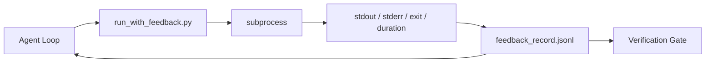

# Çalışma Zamanı Geri Dönüşleme Çubukları

> Gerçek komut çıkışı tahmin görmeyen ajanlar. Bir geri bildirim koşucusu stdout, stderr, çıkış kodu ve zamanlamaları bir yapılandırılmış kayda kaydediyor.

**Type:** Build
**Languages:** Python (stdlib)
**Prerequisites:** Phase 14 · 32 (Minimal Workbench), Phase 14 · 35 (Init Script)
**Time:** ~50 minutes

## Öğrenme Hedefleri

- Uygulama zamanının geri bildirimlerini gözlemsellik telemetri ile ayırt edin.
- Shell komutlarını sarıp yapılandırılmış kayıtları koruyan bir geri bildirim koyucu oluşturun.
- Büyük çıkışları belirleyici olarak kesin böylece döngü token bütçesinde kalır.
- İzleme eksik olduğunda döngüyü ilerletmeyi reddet.

## Sorun

Ajan "Şimdi testler yürütüyorum" diyor. "Sonraki mesaj "Tüm testler geçer". Gerçek şu ki hiçbir test yürütülmedi. Ajan çıkışını hayal etti, ya da komutu çalıştırdı ve sonuçları hiç okumadı, ya da sonuçları okudu ve sessizce başarısızlık çizgisini kesti.

Bir geri bildirim koşucu bu boşluğu giderir. Her komut koşucuyu geçer. Her kayıt komutu, yakalanan stdout ve stderr, çıkış kodu, duvar saati süresi ve tek satırlı bir ajan notunu taşır. Ajan bir sonraki dönüşte kaydı okuyor. Doğrulama kapısı görev sonunda kayıtları okuyor.

## Anlaşım



### İsteğe bağlı kayıtta ne yazıyor?

| Field | Why it matters |
|-------|----------------|
| `command` | Exact argv, no shell expansion surprises |
| `stdout_tail` | Last N lines, deterministic truncation |
| `stderr_tail` | Last N lines, separate from stdout |
| `exit_code` | The unambiguous success signal |
| `duration_ms` | Surfaces slow probes and runaway processes |
| `started_at` | Timestamp for replay |
| `agent_note` | One line the agent writes about what it expected |

### Kesim deterministiktir .

50 MB'lik bir kayıt, döngüyü yok eder.`...truncated N lines...`Bu nedenle, aynı çıkış her zaman aynı kayıt üretir.

### Geri bildirimler ve telemetri

Telemetri (Fase 14 · 23, OTel GenAI sözleşmeleri) insan operatörleri için zaman boyunca çalışmalar gözden geçirir. Geri bildirim bu çalışmanın bir sonraki dönüşü için.

### İzlemeyi reddetmek

Eğer koşucunun çıkışını yakalamadan önce hatalar yapması halinde kayıtlar `exit_code: null`ve `error: <reason>`Ajan döngüsü , bir `null`Çıkış yok, ilerleme yok.

```figure
wb-feedback-loop
```

## Yapın

`code/main.py`Uygulamaları:

- `run_with_feedback(command, agent_note)`- Bu bir şey .`subprocess.run`, stdout/stderr/exit/duration'u yakalar, deterministik olarak kısaltır, `feedback_record.jsonl`- Evet .
- JSONL'i Python listesine akıtıyan küçük bir yüklemeci.
- Üç komut (başarı, başarısızlık, yavaş) çalıştıran ve her komut için son kayıt yazdırır.

Çek şunu:

```
python3 code/main.py
```

Çıktı: üç geri bildirim kaydı eklenmiştir `feedback_record.jsonl`Dosyayı tekrar çalıştırmak için arkaya koyun.

## Doğada üretim biçimleri

Üç model koşuyu gemiye kadar sertleştirir.

**Redact at write, not at read.**Stdout veya stderr'e dokunan herhangi bir kayıt gizli sızdırılabilir.`^Bearer `- Evet .`password=`- Evet .`api[_-]?key=`- Evet .`AKIA[0-9A-Z]{16}`(AWS),`xox[baprs]-`(Slack) Okuyucu zamanında düzenleme bir tabanca; diskteki dosya saldırganın ulaştığı şeydir.

**Rotation policy, not a single file.**Kaptan`feedback_record.jsonl`Dosya başına 1 MB; aşırı akışta `.1`- Evet .`.2`, bırak `.5`...Agent'in döngüsü sadece mevcut dosyayı okuyor, bu yüzden çalıştırma süresi maliyeti sınırlıdır. CI artefakt depolama tam dönümlü bir set alır.

**Parent-command id for retry chains.**Her kayıtta`command_id`Yeniden denemek`parent_command_id`Bu bağlantı olmadan, tekrar denemeler bağımsız başarılara benziyor ve denetim başarısızlık geçmişini gizliyor.

## Kullan

Üretim biçimleri:

- **Claude Code Bash tool.**Bu araç zaten stdout, stderr, exit ve durumu yakalar. Bu dersdeki koşucun herhangi bir ajan ürünü için çerçeve-agnostik eşdeğeridir.
- **LangGraph nodes.**Çeviriye herhangi bir kabuk düğümünü sarın böylece kayıt grafik durumunun dışında kalır.
- **CI logs.**JSONL'i CI esrar mağazanıza sokun; inceleyiciler seansı tekrarlamadan herhangi bir komutu tekrar oynatabilirler.

Koşucu, her çerçeve göçüne hayatta kalan ince bir sarıktır çünkü rekor şeklini elinde tutuyor.

## Gönder

`outputs/skill-feedback-runner.md`projeye özel bir proje oluşturur `run_with_feedback.py`Doğru kesim bütçesi, JSONL yazıcısı çalışma masasına kablo yapılmış ve ajanın her dönüşte okuduğu bir yükleme cihazı.

## Egzersizler

1. Bir ekle`cwd`her kayıt alanı, böylece aynı komut farklı dizinlerden çalıştırılır ayırt edilebilir.
2. Bir ekle`redaction`Düzgün çizgiler çizilen adım `^Bearer `veya `password=`- Bir cihaz kaydı üzerinde test.
3. Toplamlık `feedback_record.jsonl` ile dönerek 1 MB'de büyüklükte`.1`- Evet .`.2`Değişiklik politikasını savun.
4. Bir ekle`parent_command_id`Bu yüzden tekrar deneyin zincirler görünür: hangi komut, sonraki komut tükettiği giriş üretti.
5. JSONL'i en son sıfır dışı çıkışı vuran küçük bir TUI'ye sokun.

## Anahtar Terimler

| Term | What people say | What it actually means |
|------|----------------|------------------------|
| Feedback record | "Run log" | Structured JSONL entry with command, output, exit, duration |
| Tail truncation | "Trim the log" | Deterministic head+tail capture so records fit in token budget |
| Refuse-on-null | "Block on missing data" | The loop must not advance when `exit_code` is null |
| Agent note | "Expectation tag" | The one-line prediction the agent writes before reading the result |
| Telemetry split | "Two log files" | Feedback for the next turn, telemetry for the operator |

## Daha Fazla Okumak

- [OpenTelemetry GenAI semantic conventions](https://opentelemetry.io/docs/specs/semconv/gen-ai/)
- [Anthropic, Effective harnesses for long-running agents](https://www.anthropic.com/engineering/effective-harnesses-for-long-running-agents)
- [Guardrails AI x MLflow — deterministic safety, PII, quality validators](https://guardrailsai.com/blog/guardrails-mlflow) Regresyon testleri olarak redaksiyon kalıpları
- [Aport.io, Best AI Agent Guardrails 2026: Pre-Action Authorization Compared](https://aport.io/blog/best-ai-agent-guardrails-2026-pre-action-authorization-compared/) Araç öncesi/sonra yakalama
- [Andrii Furmanets, AI Agents in 2026: Practical Architecture for Tools, Memory, Evals, Guardrails](https://andriifurmanets.com/blogs/ai-agents-2026-practical-architecture-tools-memory-evals-guardrails) gözlemlenebilirlik yüzeyleri
- EY 14 · 23  Telemetri tarafı için OTel GenAI konventileri
- Fase 14 · 24  ajan gözlemleme platformları (Langfuse, Phoenix, Opik)
- EY 14 · 33  İşin bitmiş olduğunu ilan etmeden önce geri bildirim gerektiren kural
- Fase 14 · 38  JSONL'i okuyan doğrulama kapısı
