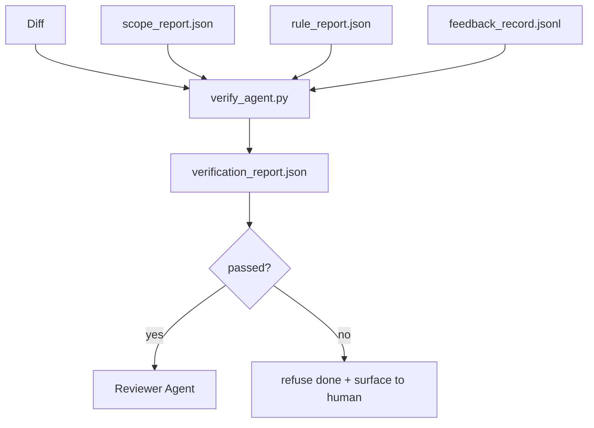

# Verifikasyon Kapıları

> Ajan kendi işini tamamlanmış olarak işaretlemeye başlamaz. Bir doğrulama kapısı kapsam sözleşmesini, geri bildirim günlüğünü, kural raporunu ve farkı okuyor ve tek bir soruya cevap veriyor: Bu görev gerçekten tamamlandı mı? Kapı hayır diyorsa, görev tamamlanmamıştır, sohbet ne derse olsun.

**Type:** Build
**Languages:** Python (stdlib)
**Prerequisites:** Phase 14 · 33 (Rules), Phase 14 · 36 (Scope), Phase 14 · 37 (Feedback)
**Time:** ~55 minutes

## Öğrenme Hedefleri

- Verifikasyon kapısı, çalışma masaları eserleri üzerinde belirleyici bir fonksiyon olarak tanımlanmalıdır.
- Kural raporunu, kapsam raporunu, geri bildirim kayıtlarını ve farklılıkları tek bir hüküm haline getir.
- Bir `verification_report.json`İkisi de okuyabilir.
- Blok ağırlığındaki herhangi bir başarısızlık üzerine bir görevi istisna olmadan ileriye çıkarmayı reddetmek.

## Sorun

Ajanlar başarıyı çok kolay ilan ederler.

- "Güzel görünüyor". Model kendi farkını okudu ve doğru olduğuna karar verdi.
- "Testler geçti". dedi güvenle.
- Kabul kriterleri, "Yapılmış gibi her şey" anlamına gelmek için yeterince gevşek olarak yorumlandı.

İşleme masası düzeltmesi, ajanın zaten ürettiği eserleri okuyan ve arama yapan tek bir doğrulama kapısıdır. Kapı belirleyici. Kapı sürüm kontrolündedir. Kapı CI'ye kabloluyor. Ajan rüşvet alamaz.

## Anlaşım



### Kapı neyi kontrol ediyor?

| Check | Source artifact | Severity |
|-------|-----------------|----------|
| All acceptance commands ran | `feedback_record.jsonl` | block |
| All acceptance commands exited zero | `feedback_record.jsonl` | block |
| Scope check has no forbidden writes | `scope_report.json` | block |
| Scope check has no off-scope writes | `scope_report.json` | block or warn |
| All block-severity rules pass | `rule_report.json` | block |
| No `null` exit codes in feedback | `feedback_record.jsonl` | block |
| Touched files match `scope.allowed_files` | both | warn |

A.`warn`Bulma kararı kaydeder; a `block`bulma engellerini bulma `passed: true`- Evet .

### Deterministik, olasılık değil

Bu nedenle, bu kararın bir sonraki aşamasında, bir diğer kararın da bir sonraki aşamasında, bir diğer kararın da bir sonraki aşamasında, bir diğer kararın da bir sonraki aşamasında, bir diğer kararın da bir sonraki aşamasında, bir diğer kararın da bir sonraki aşamasında, bir diğer kararın da bir sonraki aşamasında, bir diğer kararın da bir sonraki aşamasında, bir diğer kararın da bir sonraki aşamasında, bir diğer kararın da bir sonraki aşamasında, bir diğer kararın da bir sonraki aşamasında, bir diğer kararın da bir sonraki aşamasında, bir diğer kararın da bir sonraki aşamasında, bir diğer kararın da bir sonraki aşamasında, bir diğer kararın da bir sonraki aşamasında, bir diğer kararın da bir sonraki aşamasında, bir diğer kararın da bir sonraki aşamasında, bir diğer kararın da bir diğerine de bir kararın da bir kararın da bir kararı vermesi gerekir.

### Bir rapor, bir yol

Kapı bir tane yayıyor .`verification_report.json`Görevleri tamamlamak için, aşağıda yazılmış`outputs/verification/<task_id>.json`İK aynı yolu kullanıyor, farklı yollarla birden fazla kapı gerçeğin kaynağını açıyor.

### İstisna olmadan reddet

Blok ağırlığı bulguları ajan tarafından geçersiz kılılamaz.`override_reason`ve bir `overridden_by`Kullanıcı kimliği. Bu bir imzalama değişikliği, bir ajan kararı değil.

```figure
wb-gate-sequence
```

## Yapın

`code/main.py`Uygulamaları:

- Her giriş eser için bir yükleme cihazı, hepsi yerel olarak dövecek, böylece ders kendi kendine kalır.
- A.`verify(task_id, artifacts) -> VerdictReport`saf bir işlev.
- Her kontrol sonucu ve son geçiş/başarısızlığı gösteren bir yazıcı.
- Üç görev senaryosu olan bir demo: temiz geçiş, kapsam ürpertici, eksik kabul.

Çek şunu:

```
python3 code/main.py
```

Çıktı: üç yargı raporu, her biri senaryoya yakın kaydedildi.

## Doğada üretim biçimleri

Dört örnektir kapıyı "başka bir saç işi"nden "başlı kararlı kenara" yükseltir.

**Defense-in-depth, not single gate.**Pre-commit hook → CI durum kontrolü → pre-tool authz hook → pre-merge gate. Her katman belirleyici olduğundan bir katmandaki bir başarısızlık bir sonraki tarafından yakalanır. microservices.io'nun Mart 2026 oyun kitabı açıkça belirtilmiştir: pre-commit hook geçilebilir değildir çünkü, bir model taraflı beceri aksine, talimatları takip eden ajanın bağımlı değildir. Verifikasyon kapısı CI / pre-merge katmandadır.

**Defense by deterministic check, model-judge only for nuance.**Anthropic'in 2026 Hibrit Norm çiftleştirmesi: doğrulanabilir ödüller (birlik testleri, şema kontrolleri, çıkış kodları) "kod problemi çözdü mü?" cevabını verir. LLM rubrikleri "kod okunur mu, güvenli mi, stilde mi?" cevabını verir. Kapı ilk sınıfı çalışır; inceleyicisi (Fase 14 · 39) ikincisini çalışır.

**Signed override log, not Slack threads.**Her atış bir satır gönderir .`outputs/verification/overrides.jsonl`Bu, bir geçersizliğe sahip bir politika ile bir geçersizliğe sahip bir sinema arasındaki çizgidir.

**Coverage floor as a first-class check.**A.`coverage_report.json``coverage_floor`(ergin olarak %80) kontrol. Ölçülen kapsamın zeminin altında veya önceki birleşme zeminin altında %1'den fazla düştüğünde kapı başarısız olur. Bu kontrol olmadan ajanlar başarısız olan testleri sessizce siler ve doğrulama raporları yeşil kalır.

**`--strict` mode promotes warns to blocks.**Serbestleşme dalları, gemi bloklama ilişkiler veya olay sonrası triaj için, `--strict`Bayrak, dallara göre seçilir, küresel standart değil, çünkü her şeye sıkı sıkı her gün akışını bozar.

## Kullan

Üretim biçimleri:

- **CI step.**A.`verify_agent`İşçi, ajanın son eserlerine karşı kapıyı açıyor.`passed: true`- Evet .
- **Pre-handoff hook.**Ajan, teslimat belgesi üretmeden önce kapıyı arıyor.
- **Manual triage.**Operatörler, bir ajanın başarıyı iddia ettiğini ve bir insan bunu şüphelendiğinde raporları okuyorlar.

Kapı, çalışma masası akışının belirleyici kenarıdır.

## Gönder

`outputs/skill-verification-gate.md`kapıyı belirli bir projeye bağlar: hangi kabul komutları onu besler, hangi kurallar blok sıkılığıdır, hangi alan dışı yazılar hoşgörülür, iptal denetim günlüğü nasıl depolanır.

## Egzersizler

1. Bir ekle`coverage_floor`Kontrol: Test komutanlığı, zemini taşıyan esrarın en az %80'i olan bir kapsam raporunu oluşturmalıdır.
2. Destekleme`--strict`Her şeyi destekleyen bir mod.`warn`- ...`block`Strik modun doğru standard olduğu durumları belgeleyin.
3. Geçidi JSON'a ek olarak bir Markdown özet oluşturun. Özetin hangi alanlarına ait olduğunu savun.
4. Bir ekle`time_since_last_human_touch`kontrol: insan tıklamasından 60 saniye içinde düzenlenen herhangi bir dosya, dışı bayraklardan muaf tutulacaktır.
5. Kapıyı ürününüzden farklı bir ajanla çalıştırın.

## Anahtar Terimler

| Term | What people say | What it actually means |
|------|----------------|------------------------|
| Verification gate | "The check that stops things" | Deterministic function over workbench artifacts producing a pass/fail verdict |
| Block severity | "Hard fail" | A finding that prevents `passed: true` and requires a signed override |
| Override log | "Why we let it through" | Signed entries with reason and user id, audited by review |
| Acceptance command | "The proof" | A shell command whose zero exit is what `done` means |
| One report path | "Source of truth" | `outputs/verification/<task_id>.json`, consumed by CI and humans alike |

## Daha Fazla Okumak

- [Anthropic, Harness design for long-running application development](https://www.anthropic.com/engineering/harness-design-long-running-apps)
- [OpenAI Agents SDK guardrails](https://openai.github.io/openai-agents-python/guardrails/)
- [microservices.io, GenAI dev platform: guardrails](https://microservices.io/post/architecture/2026/03/09/genai-development-platform-part-1-development-guardrails.html) Ön görev ve CI arasındaki derin savunma
- [ICMD, The 2026 Playbook for Agentic AI Ops](https://icmd.app/article/the-2026-playbook-for-agentic-ai-ops-guardrails-costs-and-reliability-at-scale-1776661990431) onay kapısı merdiveni (önerleme → onay → eşiklerin altında otomotiv)
- [Type-Checked Compliance: Deterministic Guardrails (arXiv 2604.01483)](https://arxiv.org/pdf/2604.01483) Deterministik kapının üst sınırı olarak 4'ü eğil
- [logi-cmd/agent-guardrails — merge gate spec](https://github.com/logi-cmd/agent-guardrails) kapsam + mutasyon testi kapıları
- [Guardrails AI x MLflow](https://guardrailsai.com/blog/guardrails-mlflow) CI puanlayıcıları olarak belirleyici doğrulayıcılar
- [Akira, Real-Time Guardrails for Agentic Systems](https://www.akira.ai/blog/real-time-guardrails-agentic-systems) Araç öncesi/sonra kapılar
- Fase 14 · 27  hızlı enjeksiyon savunmaları (kapının karşılaşma çifti)
- Fase 14 · 36  bu kapı tarafından yürürlüğe alınan kapsam sözleşmesi
- Fase 14 · 37  geri bildirim kayıt bu kapı puanlar
- Ekipman, kapıyı ele alır.
