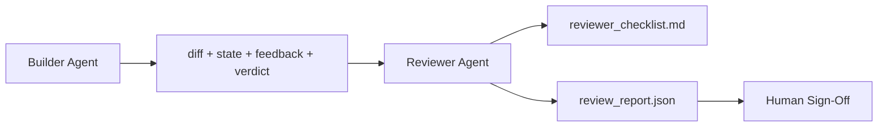

# Reviewer Agent: Marker'dan Ayrı Yapıcı

> Bu, bir sistem uyarısı, farklı bir hedef ve inşaatçı tarafından üretilen her şeye sadece okuma erişimi olan ikinci bir döngüdür.

**Type:** Build
**Languages:** Python (stdlib)
**Prerequisites:** Phase 14 · 38 (Verification Gate)
**Time:** ~55 minutes

## Öğrenme Hedefleri

- Aynı ajanın kendi çalışmalarını neden güvenilir bir şekilde inceleyemediğini açıklayın.
- İnşaatçı eserlerini tüketen ve yapılandırılmış bir inceleme raporu yayınlayan bir incelemeci ajan döngüsü oluşturun.
- Bir incelemeci rubrik yazarı, vib değil belirli boyutları değerlendirir.
- Eleştiriciyi çalışma masasına bağla böylece insan eleştirisi gerçek bir eserden başlar.

## Sorun

Bu işlemler, bir hata düzeltmesini sağlar. 4 dosyayı düzenler, testleri yürütür ve raporlar yapılır. Verifikasyon kapısı (Fase 14 · 38) kabul yürütülmesini ve kapı kapısını tutar.`passed: true`İki gün sonra, bu çözümün bug'un yanlış yarısını çözdüğünü görürsün.

Kabul yeterli değil, gerekli. Eleştirmen kabullenmemek için sorulan sorular sorar: Bu doğru bir sorun çözmüş müdür?

## Anlaşım



### Değerlendirici rubrik

Beş boyut, her biri 0-2 puan aldı.

| Dimension | Question |
|-----------|----------|
| Problem fit | Did the change solve the task as stated, not a nearby task? |
| Scope discipline | Were edits confined to the contract or was the contract grown deliberately? |
| Assumptions | Are all hidden assumptions written down somewhere reviewable? |
| Verification quality | Does the acceptance command actually prove the goal, or did it prove a weaker version? |
| Handoff readiness | Could the next session pick up cleanly from the current state? |

10'dan aşağı bir koşuk yumuşak bir başarısızlık, 5'den aşağı bir koşuk sert bir başarısızlık.

### Eleştirmen ayrı bir rol, ayrı bir model değil.

Bu nedenle, bu sistemin farklı bir şekilde kullanılması ve kullanılması için kullanılan bir sistemin farklı bir şekilde kullanılması gerekir.

### Değerlendirici farklılığı düzenleyemez

Bu durumun farkını, durumu, geri bildirimleri, hükümleri okuyor. Bir rapor yazar. Farkını düzeltmez. Rapor "bu durumu düzeltin" diyorsa, bir sonraki inşaatçı dönüş düzeltir; incelemeci tekrar incelemeye başlar.

### Tekrarlayıcı rubrik karşı doğrulama kapısı

Kapı (Fase 14 · 38) belirleyici gerçekleri kontrol eder: kabul yürürlüğe girdi mi, kurallar geçerli mi, kapsamı geçerli mi. Değerlendirici niteliksel yargılar yapar: bu doğru iş mi, belgelemiyor mu, teslimat kullanılabilir mi. Her ikisi de gereklidir.

```figure
wb-builder-marker
```

## Yapın

`code/main.py`Uygulamaları:

- A.`ReviewerInputs`Dataclass, inceleyicinin okuduğu eserleri birleştirir.
- Her fonksiyon dersi için belirleyici ve stub derecesindedir; gerçek uygulamalar bir LLM olarak adlandırır.
- A.`review_report.json`Beş puan, toplam puan ve bir hüküm ile yazar (`pass`- Evet .`soft_fail`- Evet .`hard_fail`)
- İki demo vaka: temiz bir değişiklik ve "doğru testler, yanlış sorun" değişimi.

Çek şunu:

```
python3 code/main.py
```

Çıktı: disk'e yazılmış iki inceleme raporu ve boyutlu puanların konsol tablosu.

## Doğada üretim biçimleri

Kits: Cloudflare'ın Nisan 2026 AI Code Review sistemi 30 günde 5169 repo'da 48,095 birleşme talebinde 131.246 inceleme atışı gerçekleştirdi. Ortalama inceleme 3 dakika 39 saniye içinde tamamlandı. Yedi uzman incelemeciye kadar (güvenlik, performans, kod kalitesi, doklar, serbest bırakma yönetimi, uyumluluk, Mühendislik Kodeksi) bir inceleme koordinatörü altında paralel olarak çalışarak bulguları çoğaltıp ciddiyetini değerlendirdi. En yüksek seviye modeli sadece koordinatör için ayrılmış; uzmanlar daha ucuz seviyelerde çalıştı.

Dört model bu ölçekte çalışmasını sağlar.

**Specialist pool, not one big reviewer.**5 boyutlu bir rubrika ile bir inceleyiciler tek başına repos için çalışır. Kod tabanı güvenlik kritik, performans kritik ve doküs yüzeylerine sahip olduktan sonra, daha küçük isteklerle uzmanlara bölünür. Koordinatör deduplasyon yapar; uzmanlar asla tam rubrika çalıştırmazlar. Model seviyesinde ayrım düşer: ucuz uzmanlar, pahalı koordinatör.

**Bias mitigation as design requirement, not optimization.**LLM yargıçları dört güvenilir önyargıyı göstermektedir (Adnan Masood, Nisan 2026): pozisyon önyargısı (GPT-4 ~40% (A,B) vs (B,A) siparişinde tutarlı değildir), sözlü önyargısı (~15% daha uzun çıkışlara yönelik enflasyon puanlama), kendi tercih (yargıçlar aynı model ailesinden çıkışları tercih eder), yetki (tanımlı yazarlara aşırı oran referansları yargılar). Yumuşaklıklar: her iki sıralamayı değerlendirin ve sadece tutarlı kazançları sayın; açıkça kısaca ödüllendiren 1-4 ölçek kullanın; model ailelerindeki yargıçları döndürün; puan vermeden önce yazar isimlerini çıkarın.

**Calibration set, not vibes.**Bir 10-20 görev tarihi seti bilinen doğru hükümlerle. her anlık değişim üzerine eleştirici üzerinde çalıştırın. Tarihi kayıt ile anlaşma %80'ten aşağı düşerse, eleştirici gemilerinden önce rubrika gözden geçirilmesi gerekir. Bu her takım sonunda yeniden keşfeder; daha iyi onunla başlamak.

**Hybrid norm with the gate.**Verifikasyon kapısı (Fase 14 · 38) belirleyici kontrolleri ( Kabul çalıştırıldı mı, testler geçti mi, kapsam tutuldu mu). Değerlendirici semantik kontrolleri (bu doğru iş olup olmadığını, varsayımların belgelenmiş olduğunu, teslim edilebilir olduğunu) ele alıyor. Anthropic'in 2026 kılavuzu bu bölünme konusunda açıkça belirlenmiştir: Değerlendirici'den kapının zaten kanıtladığını yeniden yapmasını istemeyin.

## Kullan

Üretim biçimleri:

- **Claude Code subagents.**Bir incelemeci subgeneti, inşaatçı bir görevi kapattıktan sonra çalışır.
- **OpenAI Agents SDK handoffs.**İnşaatçı görev tamamlandığında, İnşaatçı'ya bir liste veya bir insana verebilir.
- **Two-model pairing.**Builder daha hızlı ve ucuz bir model kullanır. Eleştirmen daha güçlü bir model kullanır ve daha küçük bir bağlamda hüküm verir.

Eleştirmen, insanların her eleştirisi kendi başlarına yapamadığı zaman iş masasındaki ikinci göz çiftidir.

## Gönder

`outputs/skill-reviewer-agent.md`projeye özel bir incelemeci rubrik, inşaatçıların eserlerine kablolu bir incelemeci ajanı ve doğrulama kapısı ile birleştirme oluşturur. Böylece insan incelemesi boş bir sayfa yerine yazılı bir rapordan başlar.

## Egzersizler

1. Ürün alanınıza özel bir altıncı boyut ekleyin.
2. Tekrar inceleme yapan kişiyi iki farklı sistem uyarısı ile çalıştırın (terse, verbose).
3. Bir ekle`confidence`En düşük boyutta güven 0.6'dan aşağı olduğunda rapor göndermeyi reddetmek.
4. Bir kalibrasyon seti oluşturun: 10 tarihsel görev yakınları bilinen doğru hükümlerle.
5. "Daha fazla kanıt iste" teklifini ekleyin: inceleyiciler puan almadan önce inşaatçıdan belirli bir test koşusunu isteyebilir.

## Anahtar Terimler

| Term | What people say | What it actually means |
|------|----------------|------------------------|
| Reviewer rubric | "Checklist" | Five-dimension 0-2 scoring with a written question per dimension |
| Soft fail | "Needs revisions" | Total below 7; builder gets findings to address |
| Hard fail | "Reject" | Total below 5 or any dimension at 0; halt and surface to human |
| Role separation | "Different prompt" | Same model can be both roles; the discipline is inputs and posture |
| Confidence floor | "Don't ship low-signal reports" | Refuse to emit a verdict when the rubric is uncertain |

## Daha Fazla Okumak

- [OpenAI Agents SDK handoffs](https://openai.github.io/openai-agents-python/handoffs/)
- [Anthropic Claude Code subagents](https://code.claude.com/docs/en/sub-agents)
- [Cloudflare, Orchestrating AI Code Review at Scale](https://blog.cloudflare.com/ai-code-review/)7 uzman + koordinatör mimarisi, 131k çalıştırma / 30 gün
- [Agent-as-a-Judge: Evaluating Agents with Agents (OpenReview / ICLR)](https://openreview.net/forum?id=DeVm3YUnpj)DevAI referans değerleri, 366 hiyerarşik çözüm gereksinimleri
- [Adnan Masood, Rubric-Based Evaluations and LLM-as-a-Judge: Methodologies, Biases, Empirical Validation](https://medium.com/@adnanmasood/rubric-based-evals-llm-as-a-judge-methodologies-and-empirical-validation-in-domain-context-71936b989e80) 4 kısıtlama ve hafifleme
- [MLflow, LLM-as-a-Judge Evaluation](https://mlflow.org/llm-as-a-judge) Ayrı yapı/ değerlendirmeci için üretim araçları
- [LangChain, How to Calibrate LLM-as-a-Judge with Human Corrections](https://www.langchain.com/articles/llm-as-a-judge) Kalibrasyon ayarlı iş akışı
- [Evidently AI, LLM-as-a-judge: a complete guide](https://www.evidentlyai.com/llm-guide/llm-as-a-judge)
- [Arize, LLM as a Judge — Primer and Pre-Built Evaluators](https://arize.com/llm-as-a-judge/)
- EY 14 · 05  Kendini Temizle ve CRITIC (tek ajan kendi kendini inceleme başlangıç)
- Fase 14 · 30  Eval- yönlendirilmiş ajan geliştirme (kalibrasyon seti jeneratörü)
- Ekipman: Ekipman: Ekipman: Ekipman: Ekipman: Ekipman: Ekipman: Ekipman: Ekipman: Ekipman: Ekipman: Ekipman: Ekipman: Ekipman: Ekipman: Ekipman: Ekipman: Ekipman: Ekipman: Ekipman: Ekipman: Ekipman: Ekipman: Ekipman: Ekipman: Ekipman: Ekipman: Ekipman: Ekipman: Ekipman: Ekipman: Ekipman: Ekipman: Ekipman: Ekipman: Ekipman: Ekipman: Ekipman: Ekipman: Ekipman: Ekipman: Ekipman: Ekipman: Ekipman: Ekipman: Ekipman: Ekipman: Ekipman: Ekipman: Ekipman: Ekipman: Ekipman: Ekipman: Ekipman: Ekipman: Ekipman: Ekipman: Ekipman: Ekipman: Ekipman: Ekipman: Ekipman: Ekipman: Ekipman: Ekipman: Ekipman: Ekipman: Ekipman: Ekipman: Ekipman: Ekipman: Ekipman: Ekipman: Ekipman: Ekipman: Ekipman: Ekipman: Ekipman: Ekipman: Ekipman: Ekipman: Ekipman: Ekipman: Ekipman: Ekipman: Ekipman: Ekipman: Ekipman: Ekipman: Ekipman: Ekipman: Ekipman: Ekipman: Ekipman: Ekipman: Ekipman: Ekipman: Ekipman: Ekipman
- Eğlence Fası 14 · 40  değerlendirme raporu tarafından beslenen teslimat paketleri
